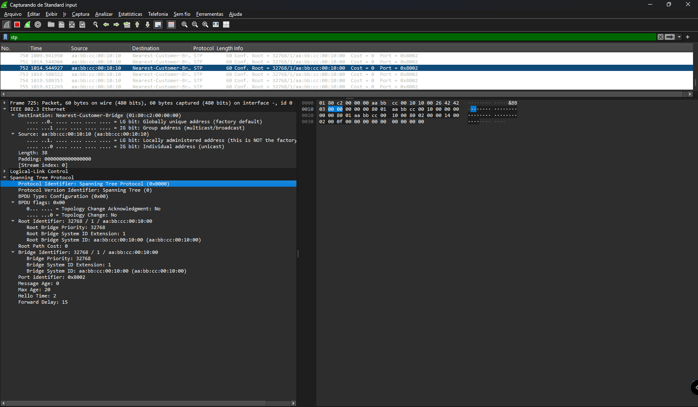
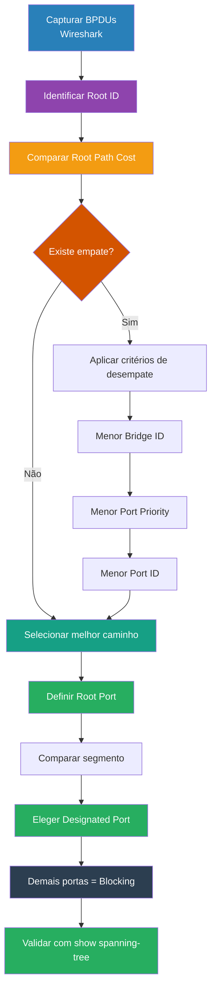

## 🔗 Eleição das Funções das Portas (STP) — Visão Operacional + CLI + Wireshark

---

## 📋 Sumário

- [🔗 Eleição das Funções das Portas (STP) — Visão Operacional + CLI + Wireshark](#-eleição-das-funções-das-portas-stp--visão-operacional--cli--wireshark)
- [📋 Sumário](#-sumário)
- [📖 Glossário](#-glossário)
- [🎯 Objetivo desta Seção](#-objetivo-desta-seção)
- [🔗 Eleição da Root Port (RP)](#-eleição-da-root-port-rp)
  - [📌 Regra principal](#-regra-principal)
  - [🧠 Interpretação](#-interpretação)
  - [🔍 Processo de decisão](#-processo-de-decisão)
  - [⚖️ Critérios de Desempate (Root Port)](#️-critérios-de-desempate-root-port)
  - [💻 Verificação via CLI](#-verificação-via-cli)
  - [🔍 Interpretação](#-interpretação-1)
  - [🧪 Observação no Wireshark](#-observação-no-wireshark)
- [🌐 Eleição das Designated Ports (DP)](#-eleição-das-designated-ports-dp)
  - [⚖️ Critérios de Desempate (Designated Port)](#️-critérios-de-desempate-designated-port)
  - [💻 Verificação via CLI](#-verificação-via-cli-1)
- [🚫 Eleição de Portas Bloqueadas (Blocking)](#-eleição-de-portas-bloqueadas-blocking)
  - [💻 Verificação via CLI](#-verificação-via-cli-2)
  - [📊 Correlação Completa: Teoria vs CLI](#-correlação-completa-teoria-vs-cli)
  - [🧠 Leitura Estratégica do show spanning-tree](#-leitura-estratégica-do-show-spanning-tree)
  - [🔬 Correlação com BPDU (Wireshark)](#-correlação-com-bpdu-wireshark)
  - [Exemplo de captura via Whireshark](#exemplo-de-captura-via-whireshark)
  - [Filtros principais](#filtros-principais)
  - [🧠 Algoritmo Operacional (CLI + Wireshark)](#-algoritmo-operacional-cli--wireshark)
  - [🎯 Resultado Final](#-resultado-final)
- [⚠️ Observação: STP vs PVST+](#️-observação-stp-vs-pvst)
  - [🧠 Diferença essencial](#-diferença-essencial)
  - [💡 O que NÃO muda](#-o-que-não-muda)
  - [🎯 Conclusão](#-conclusão)
  - [🔗 Conexão com Próximo Passo](#-conexão-com-próximo-passo)
- [🧪 Pronto para Testar seu Conhecimento?](#-pronto-para-testar-seu-conhecimento)

---

## 📖 Glossário

| Termo                    | Definição                                                                                                                      |
|:---                      |:---                                                                                                                            |
| **STP**                  | Spanning Tree Protocol — protocolo que elimina loops lógicos em redes com caminhos redundantes                                 |
| **BPDU**                 | Bridge Protocol Data Unit — quadro de controle trocado entre switches para eleger o Root Bridge e definir os papéis das portas |
| **Root Bridge**          | O switch central da topologia STP, eleito com base no menor Bridge ID                                                          |
| **Bridge ID**            | Identificador único de um switch no STP, composto por Prioridade + MAC Address                                                 |
| **Root Path Cost**       | Custo acumulado do caminho entre um switch e o Root Bridge                                                                     |
| **Root Port (RP)**       | Porta de um switch não-root com o menor custo até o Root Bridge — sempre em Forwarding                                         |
| **Designated Port (DP)** | Porta que representa um segmento de rede no STP — envia o melhor BPDU naquele link                                             |
| **Alternate Port**       | Porta bloqueada que possui um caminho alternativo até o Root Bridge                                                            |
| **Forwarding (FWD)**     | Estado em que a porta encaminha tráfego normalmente                                                                            |
| **Blocking (BLK)**       | Estado em que a porta não encaminha tráfego de dados, mas continua recebendo BPDUs                                             |
| **Port ID**              | Identificador de porta usado em desempate, composto por Port Priority + número da porta                                        |
| **Sender Bridge ID**     | Bridge ID do switch que enviou o BPDU — usado como critério de desempate na eleição da Root Port                               |
| **Hello Time**           | Intervalo (padrão: 2s) em que o Root Bridge envia BPDUs                                                                        |
| **Max Age**              | Tempo máximo (padrão: 20s) que um switch aguarda sem receber BPDU antes de recalcular a topologia                              |
| **Forward Delay**        | Tempo (padrão: 15s) que uma porta aguarda nos estados Listening e Learning antes de ir a Forwarding                            |
| **MAC Multicast STP**    | Endereço `01:80:c2:00:00:00` — destino padrão dos frames BPDU, não encaminhados por switches                                   |
| **TCN**                  | Topology Change Notification — sinalização enviada quando há mudança na topologia STP                                          |
| **802.1D**               | Padrão IEEE do STP clássico                                                                                                    |
| **PVST+**                | Per-VLAN Spanning Tree Plus — implementação Cisco que roda uma instância STP por VLAN                                          |

---

## 🎯 Objetivo desta Seção

Traduzir a engenharia de decisão do STP para:

- Eleição prática das portas
- Interpretação via CLI (`show spanning-tree`)
- Observação real via Wireshark (BPDUs)

> 💡 Aqui você sai do “cálculo no papel” e passa a **validar no mundo real**

---

## 🔗 Eleição da Root Port (RP)

### 📌 Regra principal

> A Root Port é a interface com **menor Root Path Cost até o Root Bridge**

---

### 🧠 Interpretação

Cada switch não-root está constantemente perguntando:

> “Qual é o melhor caminho até o Root?”

---

### 🔍 Processo de decisão

1. Receber BPDUs pelas interfaces
2. Comparar o custo total até o Root
3. Escolher a menor métrica

---

### ⚖️ Critérios de Desempate (Root Port)

Se houver empate:

1. Menor Root Path Cost  
2. Menor Sender Bridge ID  
3. Menor Sender Port Priority  
4. Menor Sender Port ID  

---

### 💻 Verificação via CLI

```bash
show spanning-tree
```

Exemplo de saída relevante:  
  
```bash
Interface        Role Sts Cost      Prio.Nbr Type
---------------- ---- --- --------- -------- --------------------------------
Gi1/0/1          Root FWD 4         128.1    Shr
Gi1/0/2          Altn BLK 4         128.2    Shr
```

### 🔍 Interpretação

- **Role:** Root → Essa é a Root Port
- **Cost:** 4 → Custo até o Root
- **FWD** → Porta em forwarding

### 🧪 Observação no Wireshark

Filtrar

```bash
stp
```
  
Campos importantes:
  
- Root ID
- Root Path Cost
- Bridge ID (Sender)
- Port ID

💡 **Leitura prática**

A Root Port será aquela que recebe o melhor BPDU:

- Menor Root ID
- Menor custo acumulado

## 🌐 Eleição das Designated Ports (DP)

📌 **Regra principal**  
  
> Cada segmento terá **uma única Designated Port**

🧠 **Interpretação**  

- A **DP** é a porta que **“representa”** o segmento
- É a que possui **o melhor caminho até o Root** naquele link
  
🔍 **Processo de decisão**  
  
Para cada link:

- Comparar os switches conectados
- Ver quem tem melhor caminho até o Root
- Esse switch vence o segmento

### ⚖️ Critérios de Desempate (Designated Port)

- **Menor Root Path Cost**
- **Menor Bridge ID**
- **Menor Port Priority**
- **Menor Port ID**

### 💻 Verificação via CLI

```bash
show spanning-tree
```
  
Exemplo:
  
```Bash  
Interface        Role Sts Cost      Prio.Nbr Type
---------------- ---- --- --------- -------- --------------------------------
Gi1/0/3          Desg FWD 4         128.3    Shr
```

🔍 **Interpretação**  

- **Role:** Desg → Designated Port
- Essa porta encaminha tráfego normalmente

🧪 **Observação no Wireshark**

**A Designated Port** é quem ENVIA o **melhor BPDU no segmento**
  
Você verá:
  
- Bridge ID menor (ou melhor custo)
- Essa porta "ganha" a eleição local

## 🚫 Eleição de Portas Bloqueadas (Blocking)
  
📌 **Regra principal**
  
> Toda porta que NÃO for Root Port ou Designated Port será bloqueada

🧠 **Interpretação**

- STP precisa eliminar loops
- Então mantém apenas um caminho ativo por segmento

🔍 **Processo**

Após:
  
- Eleger Root Ports
- Eleger Designated Ports
  
👉 O restante automaticamente vira:

- **Blocking (ou Alternate, dependendo do STP)**
  
### 💻 Verificação via CLI

```bash
show spanning-tree
```

Exemplo:
  
```bash
Interface        Role Sts Cost      Prio.Nbr Type
---------------- ---- --- --------- -------- --------------------------------
Gi1/0/2          Altn BLK 4         128.2    Shr
```

🔍 **Interpretação**
  
- **Role: Altn** → Porta alternativa
- **Sts: BLK** → Bloqueada
- Não encaminha tráfego de dados

🧪 **Observação no Wireshark**
  
Mesmo bloqueada:
  
- Porta continua recebendo BPDUs
- Não encaminha tráfego de usuário
  
👉 **Isso é crucial:**

> STP bloqueia dados, mas não controle
  
### 📊 Correlação Completa: Teoria vs CLI

| Função          | Regra                      | CLI        | Estado     |
| :---            | :---                       | :---       | :---       |
| Root Port       | Menor custo até Root       | Root       |Forwarding  |
| Designated Port | Melhor caminho no segmento | Desg       | Forwarding |
| Bloqueada       | Não é RP nem DP            | Altn / BLK | Blocking   |

### 🧠 Leitura Estratégica do show spanning-tree

Ao analisar a saída:

1. Identifique o Root Bridge:

```bash
Root ID    Priority    32769
           Address     0011.2233.4455
```

2. Verifique o Root Path Cost:

```bash
Cost        4
```

3. Identifique a Root Port:

```bash
Root port   Gi1/0/1
```

### 🔬 Correlação com BPDU (Wireshark)

Campos principais:

- **Root ID** → Quem é o Root
- **Bridge ID** → Quem enviou
- **Root Path Cost** → Custo até o Root
- **Port ID** → Interface de origem

💡 **Insight avançado**

> O STP NÃO decide olhando a topologia.

Ele decide com base em:

> BPDUs recebidos

### Exemplo de captura via Whireshark



Este é um exemplo de uma captura via Whireshark. Então vamos analisar o que deve ser verificado:
  
Filtro Whireshark.

```bash
stp
```
  
**Campos principais**  

1. Destination MAC

- **01:80:c2:00:00:00**

💡 **Insight:**

> Frames STP não atravessam switches (não são encaminhados)

1. Root Identifier
  
- **Root ID: 32768 / 1 / aa:bb:cc:00:10:00**
- **Priority: 32768**
- **VLAN ID (sys-id-ext): 1**
- **MAC: aa:bb:cc:00:10:00**
  
💡 **Esse é o Root Bridge da topologia**
  
3. Bridge Identifier
  
- **Bridge ID: 32768 / 1 / aa:bb:cc:00:10:00**
  
👉 Aqui está o OURO:
  
> Root ID == Bridge ID
  
💥 **Conclusão:**
  
👉 **Esse switch é o Root Bridge**

4. Root Path Cost

- **Root Path Cost: 0**
  
💡 **Explicação:**
  
- Só o Root tem custo 0
- Outros switches teriam valores > 0

5. Port ID

- **Port ID: 0x8002**
- **0x80 = prioridade da porta (128)**
- **02 = número da porta**
  
💡 **Isso é usado em desempate**

6. Timers

- **Hello Time: 2**
- **Max Age: 20**
- **Forward Delay: 15**
  
👉 Mostra que:
  
> O Root define os timers da rede

### Filtros principais

✅ **STP clássico (802.1D)**

```bash
stp
```
  
✅ **RSTP (802.1w)**

```bash
stp.version == 2
```
  
✅ **Filtrar só BPDUs de configuração**
  
```bash
stp.type == 0x00
```
  
✅ **Filtrar Topology Change**

```bash
stp.flags.tc == 1
```

👉 **Excelente pra troubleshooting**
  
✅ **Filtrar por MAC destino STP**

```bash
eth.dst == 01:80:c2:00:00:00
```

👉 **Esse é o MAC multicast padrão do STP**
  
🔥 **Filtro avançado (nível análise)**

```bash
stp.rootid == 32768

ou

stp.bridgeid
```

👉 **Pra comparar quem está anunciando o quê**
  
### 🧠 Algoritmo Operacional (CLI + Wireshark)

1. Capturar BPDUs (Wireshark)
2. Identificar Root ID
3. Comparar custos
4. Ver quem envia o melhor BPDU
5. Confirmar no CLI



### 🎯 Resultado Final

Após a convergência:

- 1 Root Port por switch (não-root)
- 1 Designated Port por segmento
- Restante em Blocking

## ⚠️ Observação: STP vs PVST+

Até este ponto, toda a explicação foi baseada no padrão IEEE 802.1D (STP).

Na prática, em equipamentos Cisco, o comportamento padrão utiliza o **PVST+ (Per-VLAN Spanning Tree Plus)**.

---

### 🧠 Diferença essencial

- STP (IEEE 802.1D):
  - Uma única instância de spanning-tree para toda a rede

- PVST+ (Cisco):
  - Uma instância de spanning-tree **por VLAN**

---

### 💡 O que NÃO muda

- Eleição de Root Bridge  
- Root Port  
- Designated Port  
- Critérios de desempate  

👉 A lógica do protocolo continua exatamente a mesma

---

### 🎯 Conclusão

> Neste material, a lógica apresentada continua válida, pois o PVST+ aplica o mesmo algoritmo do STP, apenas de forma independente para cada VLAN

### 🔗 Conexão com Próximo Passo

Agora você consegue:

- Calcular no papel
- Validar no CLI
- Observar no nível de frame (Wireshark)

💥 **Resumo desta fase:**
 
- Você domina a lógica
- Você valida via CLI
- Você entende o protocolo no nível de frame
  
> 🔎 Esse é o nível onde STP deixa de ser teoria e vira troubleshooting real
  
**🔗 Este conteúdo foca na lógica e leitura básica do STP.**
  
👉 No próximo arquivo, avançamos para análise detalhada e troubleshooting com comandos avançados.

---

## 🧪 Pronto para Testar seu Conhecimento?

Antes de partir para o laboratório, valide sua compreensão teórica com os simulados:

- **Simulados temáticos (10 questões / 10 min cada):**  
  1 - [Posicionamento do Root Bridge e Design de Rede](https://alcancil.github.io/Cisco/CCNP%20350-401%20ENCOR/03%20-%20Infrastructure/02%20-%20STP%20(Spanning%20Tree%20Protocol)/06%20-%20Revisao05/Arquivos/Simulado/01.html)  
  2 - [Bridge ID: Estrutura e Cálculo](https://alcancil.github.io/Cisco/CCNP%20350-401%20ENCOR/03%20-%20Infrastructure/02%20-%20STP%20(Spanning%20Tree%20Protocol)/06%20-%20Revisao05/Arquivos/Simulado/02.html)  
  3 - [Eleição do Root Bridge e Papéis de Porta](https://alcancil.github.io/Cisco/CCNP%20350-401%20ENCOR/03%20-%20Infrastructure/02%20-%20STP%20(Spanning%20Tree%20Protocol)/06%20-%20Revisao05/Arquivos/Simulado/03.html)  
  4 - [Critérios de Desempate (Tie-Breakers)](https://alcancil.github.io/Cisco/CCNP%20350-401%20ENCOR/03%20-%20Infrastructure/02%20-%20STP%20(Spanning%20Tree%20Protocol)/06%20-%20Revisao05/Arquivos/Simulado/04.html)  
  5 - [Consolidação: Estados, Convergência e Evolução](https://alcancil.github.io/Cisco/CCNP%20350-401%20ENCOR/03%20-%20Infrastructure/02%20-%20STP%20(Spanning%20Tree%20Protocol)/06%20-%20Revisao05/Arquivos/Simulado/01.html)  
  
- **Simulado completo STP:** [50 questões — 75 minutos](https://alcancil.github.io/Cisco/CCNP%20350-401%20ENCOR/03%20-%20Infrastructure/02%20-%20STP%20(Spanning%20Tree%20Protocol)/06%20-%20Revisao05/Arquivos/Simulado/completo.html)  
  
- **Seu desempenho consolidado:** [📊 Painel de Estatísticas](https://alcancil.github.io/Cisco/CCNP%20350-401%20ENCOR/03%20-%20Infrastructure/02%20-%20STP%20(Spanning%20Tree%20Protocol)/06%20-%20Revisao05/Arquivos/Simulado/dashboard.html)  
  