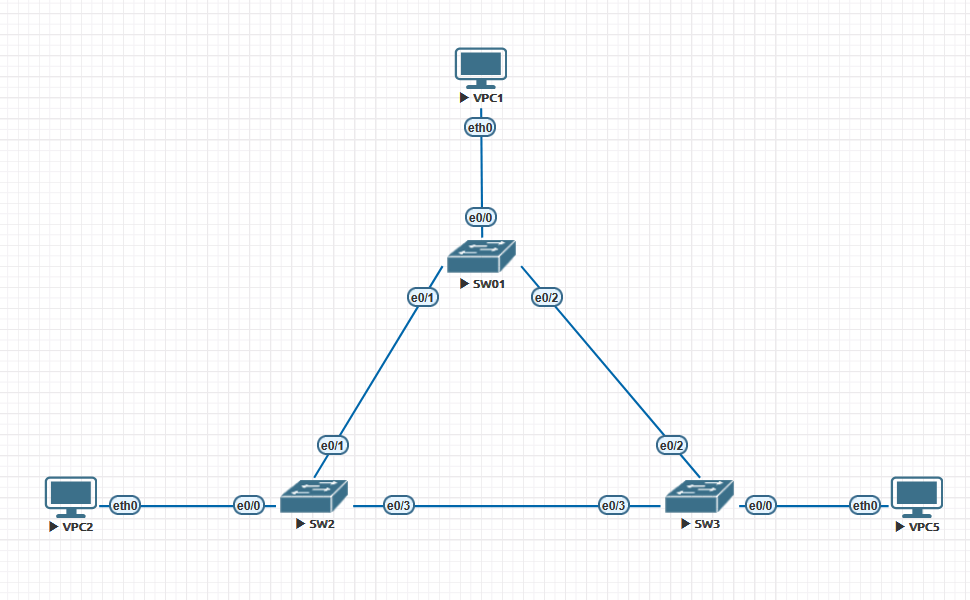
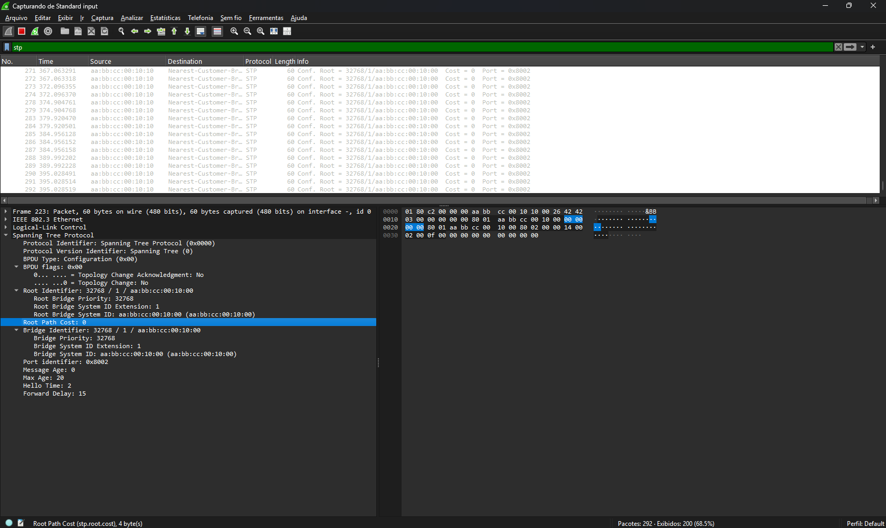
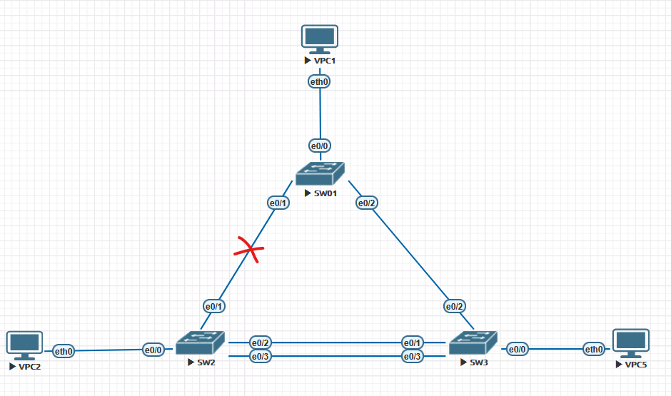
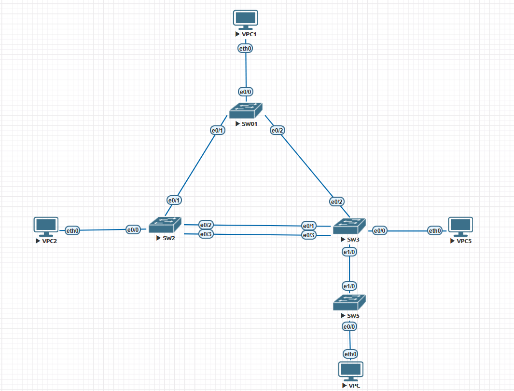
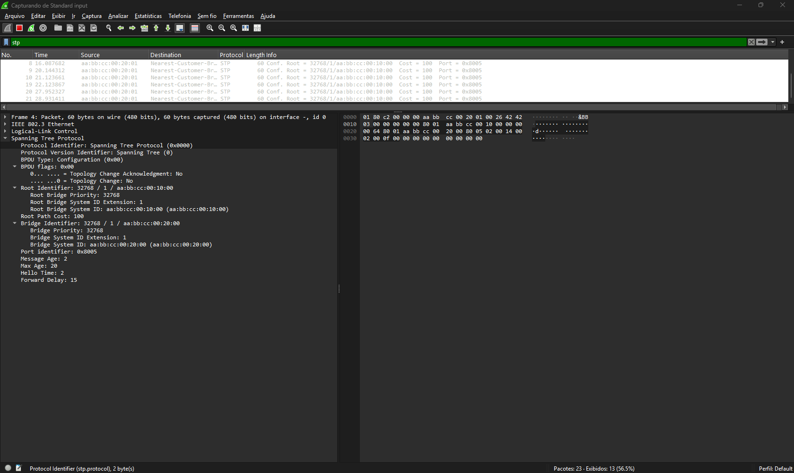
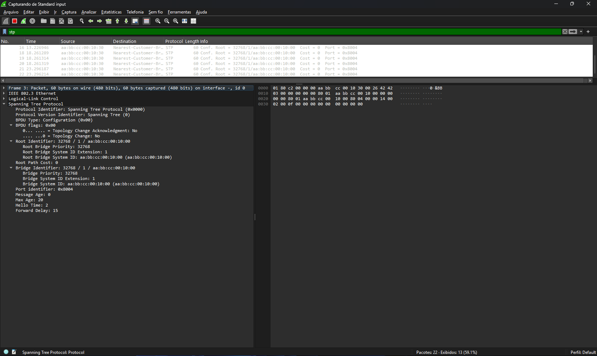

# 🔗 Análise de Cenário: STP em Ação — Convergência, Falhas e Fluxo de BPDUs

---

## 📋 Sumário

- [🔗 Análise de Cenário: STP em Ação — Convergência, Falhas e Fluxo de BPDUs](#-análise-de-cenário-stp-em-ação--convergência-falhas-e-fluxo-de-bpdus)
  - [📋 Sumário](#-sumário)
  - [📖 Glossário — STP (Formato Tabela)](#-glossário--stp-formato-tabela)
  - [🎯 Objetivo do Laboratório](#-objetivo-do-laboratório)
  - [🧾 Resumo Executivo (Visão para Negócio)](#-resumo-executivo-visão-para-negócio)
  - [🧠 Modelo Mental do STP (Antes de começar)](#-modelo-mental-do-stp-antes-de-começar)
  - [🚩 Etapa 1: Identificando o Root Bridge](#-etapa-1-identificando-o-root-bridge)
    - [💻 Verificação no SW01](#-verificação-no-sw01)
  - [✅ Checkpoint de Aprendizado — Root Bridge](#-checkpoint-de-aprendizado--root-bridge)
    - [🏭 Impacto em Produção](#-impacto-em-produção)
    - [🔬 Captura no Link SW01 \<-\> SW2](#-captura-no-link-sw01---sw2)
    - [💥 Etapa 2: Simulação de Falha (Link Principal Down)](#-etapa-2-simulação-de-falha-link-principal-down)
    - [💻 Resultado no Console (SW1)](#-resultado-no-console-sw1)
    - [📌 Interpretação (nível CCNP)](#-interpretação-nível-ccnp)
  - [🧠 Reforço de Modelo — Convergência STP](#-reforço-de-modelo--convergência-stp)
  - [✅ Checkpoint de Aprendizado — Convergência](#-checkpoint-de-aprendizado--convergência)
    - [🏭 Impacto em Produção](#-impacto-em-produção-1)
    - [📎 Resumo prático](#-resumo-prático)
    - [🔗 Etapa 3: Desempate com Links Redundantes (Port ID)](#-etapa-3-desempate-com-links-redundantes-port-id)
    - [⚖️ Processo de Decisão do STP](#️-processo-de-decisão-do-stp)
    - [📊 Comparativo dos BPDUs recebidos pelo SW03](#-comparativo-dos-bpdus-recebidos-pelo-sw03)
    - [💻 Saída no SW03](#-saída-no-sw03)
    - [📌 Interpretação (nível CCNP)](#-interpretação-nível-ccnp-1)
  - [🧠 Reforço de Modelo — Desempate STP](#-reforço-de-modelo--desempate-stp)
  - [✅ Checkpoint de Aprendizado — Port ID](#-checkpoint-de-aprendizado--port-id)
    - [📎 Resumo prático](#-resumo-prático-1)
    - [🏭 Impacto em Produção](#-impacto-em-produção-2)
    - [🌊 Etapa 4: Propagação de BPDUs e TCN](#-etapa-4-propagação-de-bpdus-e-tcn)
    - [🔄 Fluxo de BPDUs na Topologia](#-fluxo-de-bpdus-na-topologia)
    - [📈 Progressão do Root Path Cost](#-progressão-do-root-path-cost)
    - [🔬 Captura no SW04](#-captura-no-sw04)
    - [📌 Interpretação (nível CCNP)](#-interpretação-nível-ccnp-2)
    - [📎 **Resumo prático:**](#-resumo-prático-2)
    - [🏭 Impacto em Produção](#-impacto-em-produção-3)
    - [🚫 Etapa 5: O Comportamento da Porta Bloqueada](#-etapa-5-o-comportamento-da-porta-bloqueada)
    - [🧪 Teste de Tráfego](#-teste-de-tráfego)
    - [🔬 Captura na Porta em BLOCKING](#-captura-na-porta-em-blocking)
    - [📌 Interpretação (nível CCNP)](#-interpretação-nível-ccnp-3)
    - [⚠️ Ponto-chave](#️-ponto-chave)
    - [🏭 Impacto em Produção](#-impacto-em-produção-4)
    - [🛠️ Guia de Comandos e Filtros](#️-guia-de-comandos-e-filtros)
      - [💻 Comandos Essenciais (CLI)](#-comandos-essenciais-cli)
    - [🔍 Filtros Úteis (Wireshark)](#-filtros-úteis-wireshark)
      - [🚀 Além da Observação: Como assumir o controle?](#-além-da-observação-como-assumir-o-controle)
  - [💼 Tradução Técnica → Valor para o Negócio](#-tradução-técnica--valor-para-o-negócio)
  - [🧪 Pronto para Testar seu Conhecimento?](#-pronto-para-testar-seu-conhecimento)

---

## 📖 Glossário — STP (Formato Tabela)

| **Termo**                              | **Definição**                                                                                                    |
|----------------------------------------|------------------------------------------------------------------------------------------------------------------|
| **STP (Spanning Tree Protocol)**       | Protocolo de camada 2 que evita loops em redes com caminhos redundantes, criando uma topologia lógica em árvore. |
| **Root Bridge**                        | Switch central da topologia STP, eleito com base no menor Bridge ID.                                             |
| **Bridge ID (BID)**                    | Identificador do switch (Priority + MAC Address). O menor BID vence a eleição.                                   |
| **Root Port (RP)**                     | Porta com menor custo até o Root Bridge. Existe apenas uma por switch não-root.                                  |
| **Designated Port (DP)**               | Porta responsável por encaminhar tráfego em um segmento. Sempre em Forwarding.                                   |
| **Alternate Port (ALT)**               | Porta redundante que fica em Blocking e pode assumir em caso de falha.                                           |
| **Blocking (BLK)**                     | Estado onde a porta não encaminha dados, mas continua recebendo BPDUs.                                           |
| **Forwarding (FWD)**                   | Estado onde a porta encaminha tráfego e aprende MACs.                                                            |
| **Listening**                          | Estado inicial onde a porta processa BPDUs, mas não encaminha tráfego.                                           |
| **Learning**                           | Estado onde a porta aprende MACs, mas ainda não encaminha tráfego.                                               |
| **BPDU**                               | Pacote usado pelo STP para troca de informações entre switches.                                                  |
| **Root Path Cost**                     | Custo acumulado até o Root Bridge, usado para escolha do melhor caminho.                                         |
| **Port ID**                            | Identificador da porta (prioridade + número), usado como desempate.                                              |
| **Sender Bridge ID**                   | Bridge ID do switch que enviou o BPDU.                                                                           |
| **Sender Port ID**                     | Porta de origem do BPDU, critério final de desempate.                                                            |
| **TCN (Topology Change Notification)** | Notificação de mudança na topologia, usada para atualização das tabelas MAC.                                     |
| **Hello Time**                         | Intervalo de envio de BPDUs (padrão: 2s).                                                                        |
| **Max Age**                            | Tempo máximo que um BPDU é válido (padrão: 20s).                                                                 |
| **Forward Delay**                      | Tempo nos estados Listening e Learning (padrão: 15s).                                                            |
| **Convergência**                       | Processo de recalcular a topologia após mudanças.                                                                |
| **Plano de Controle**                  | Responsável por decisões do STP e troca de BPDUs.                                                                |
| **Plano de Dados**                     | Responsável pelo encaminhamento de tráfego de usuário.                                                           |
| **MAC STP**                            | Endereço multicast usado pelo STP: 01:80:c2:00:00:00                                                             |

---

## 🎯 Objetivo do Laboratório

Como parte de uma sequência lógica de aprendizado, este arquivo dedica-se à revisão profunda do STP (802.1D). Dominar o comportamento padrão e os critérios de eleição discutidos aqui é o pré-requisito essencial para compreendermos as otimizações que veremos nos próximos laboratórios de RSTP e MSTP. A análise foca em como o protocolo toma decisões de topologia no nível de pacote.  

**Objetivo:** Entender como o switch toma decisões em tempo real, correlacionando a CLI com o nível de pacote (Wireshark).  
  
Neste laboratório, vamos sair da teoria e observar o STP em funcionamento real.
  
A ideia não é apenas executar comandos, mas entender:
  
- Como o switch toma decisões em tempo real
- Como essas decisões aparecem na CLI
- Como o protocolo se comporta no nível de pacote (Wireshark)

👉 Ao final, você será capaz de correlacionar:

> CLI ↔ Estado das portas ↔ BPDUs

---

## 🧾 Resumo Executivo (Visão para Negócio)
  
Este laboratório demonstra, na prática, como o protocolo **STP (Spanning Tree Protocol)** atua para garantir a estabilidade de redes corporativas.
  
Em ambientes reais, falhas de rede ou configurações inadequadas podem causar:
  
- Indisponibilidade de sistemas  
- Lentidão na comunicação entre aplicações  
- Interrupção de serviços críticos  
  
Neste material, são analisados cenários reais de operação, incluindo:
  
- Eleição do equipamento central da rede (Root Bridge)  
- Reação da rede a falhas de conectividade  
- Comportamento de redundância e prevenção de loops  
- Impacto direto dessas decisões no tráfego de dados  
  
📌 **Valor prático:**
  
Este tipo de análise é essencial para profissionais responsáveis por:
  
- Garantir alta disponibilidade da rede  
- Reduzir tempo de indisponibilidade (downtime)  
- Diagnosticar falhas de forma rápida e precisa  

💡 **Em resumo:**  
Este laboratório demonstra a capacidade de analisar, interpretar e prever o comportamento da rede em cenários reais — uma habilidade crítica em ambientes corporativos.

---

## 🧠 Modelo Mental do STP (Antes de começar)

Antes de entrar nos comandos e capturas, precisamos alinhar o modelo mental correto do STP.
  
O STP não é um protocolo “mágico” — ele segue uma lógica determinística baseada em comparação de informações.
  
👉 Pense no STP como um processo em 3 decisões:
  
1. **Quem é a Root Bridge?**  
   → O switch com menor Bridge ID (Priority + MAC)

2. **Qual o melhor caminho até a Root?**  
   → Porta com menor Root Path Cost (Root Port)

3. **Quem encaminha em cada segmento?**  
   → Porta Designated (melhor BPDU naquele enlace)
  
Se houver empate:
  
👉 O protocolo segue critérios de desempate, nesta ordem:
  
- Root Bridge ID
- Root Path Cost
- Sender Bridge ID
- Sender Port ID
  
📌 **Regra de ouro:**
O STP sempre escolhe o **melhor BPDU**.

💡 **Se você entender esse modelo, você não precisa decorar — você consegue prever o comportamento do STP.**

---

## 🚩 Etapa 1: Identificando o Root Bridge



Antes de analisar o comportamento do STP, precisamos entender quem é o "ponto central" da rede.

👉 Todo o cálculo do STP gira em torno do Root Bridge. No nosso cenário, o **SW02** foi eleito o Root Bridge por possuir o menor MAC Address (aabb.cc00.1000), já que todas as prioridades são o padrão 32768.

---

### 💻 Verificação no SW01

Vamos entrar em cada Switch e verificar o STP com o comando

```bash
show spanning-tree vlan x
```

- **SWITCH1**

> 📍 **Contexto:** Estamos no **SW01** — switch não-root.
>
> - Root Port: `Et0/1` → aponta para o **SW02 (Root Bridge)**
> - Alternate (Blocking): `Et0/2`
> - Designated (Forwarding): `Et0/0` e `Et0/3`

```bash
SW01#show spanning-tree vlan 1

VLAN0001
  Spanning tree enabled protocol ieee
  Root ID    Priority    32769
             Address     aabb.cc00.1000
             Cost        100
             Port        2 (Ethernet0/1)
             Hello Time   2 sec  Max Age 20 sec  Forward Delay 15 sec

  Bridge ID  Priority    32769  (priority 32768 sys-id-ext 1)
             Address     aabb.cc00.7000
             Hello Time   2 sec  Max Age 20 sec  Forward Delay 15 sec
             Aging Time  300 sec

Interface           Role Sts Cost      Prio.Nbr Type
------------------- ---- --- --------- -------- --------------------------------
Et0/0               Desg FWD 100       128.1    P2p
Et0/1               Root FWD 100       128.2    P2p
Et0/2               Altn BLK 100       128.3    P2p
Et0/3               Desg FWD 100       128.4    P2p


SW01#
```

- **SWITCH2**

> 📍 **Contexto:** Estamos no **SW02** — este é o **Root Bridge**.
>
> - Todas as portas são Designated (FWD).
> - O Root Bridge **nunca bloqueia** suas próprias portas.
> - Confirmação na CLI: mensagem `This bridge is the root`.

```bash
SW02#show spanning-tree vlan 1

VLAN0001
  Spanning tree enabled protocol ieee
  Root ID    Priority    32769
             Address     aabb.cc00.1000
             This bridge is the root
             Hello Time   2 sec  Max Age 20 sec  Forward Delay 15 sec

  Bridge ID  Priority    32769  (priority 32768 sys-id-ext 1)
             Address     aabb.cc00.1000
             Hello Time   2 sec  Max Age 20 sec  Forward Delay 15 sec
             Aging Time  300 sec

Interface           Role Sts Cost      Prio.Nbr Type
------------------- ---- --- --------- -------- --------------------------------
Et0/0               Desg FWD 100       128.1    P2p
Et0/1               Desg FWD 100       128.2    P2p
Et0/2               Desg FWD 100       128.3    P2p
Et0/3               Desg FWD 100       128.4    P2p


SW02#
```

- **SWITCH03**

> 📍 **Contexto:** Estamos no **SW03** — switch não-root com caminho único até a root.
>
> - Root Port: `Et0/3` → aponta diretamente para o **SW02 (Root Bridge)**
> - Demais portas: Designated (FWD)

```bash
SW03#show spanning-tree vlan 1

VLAN0001
  Spanning tree enabled protocol ieee
  Root ID    Priority    32769
             Address     aabb.cc00.1000
             Cost        100
             Port        4 (Ethernet0/3)
             Hello Time   2 sec  Max Age 20 sec  Forward Delay 15 sec

  Bridge ID  Priority    32769  (priority 32768 sys-id-ext 1)
             Address     aabb.cc00.2000
             Hello Time   2 sec  Max Age 20 sec  Forward Delay 15 sec
             Aging Time  300 sec

Interface           Role Sts Cost      Prio.Nbr Type
------------------- ---- --- --------- -------- --------------------------------
Et0/0               Desg FWD 100       128.1    P2p
Et0/1               Desg FWD 100       128.2    P2p
Et0/2               Desg FWD 100       128.3    P2p
Et0/3               Root FWD 100       128.4    P2p


SW03#
```

Agora vamos observar os endereços MAC

- Switch01 : aabb.cc00.7000
- Switch02 : aabb.cc00.1000
- Switch03 : aabb.cc00.2000

Como as prioridades estão no padrão, 3278. Como temos somente a **vlan 1** a prioridade fica **32769**. Então o desempate se dá pelo **menor MAC ADDRESS**.  
Quem se torna o **ROOT BRIDGE** é o **SWITCH02**.  
  
**OBS:** também podemos observar que o root apresenta a mensagem **This bridge is the root**

---

## ✅ Checkpoint de Aprendizado — Root Bridge
  
Se você entendeu esta etapa, você já consegue:
  
- Identificar o Root Bridge apenas olhando o `show spanning-tree`
- Entender por que o menor MAC venceu (quando prioridade é padrão)
- Reconhecer um BPDU originado pela root (Root Path Cost = 0)
  
🧪 **Teste rápido:**
  
Se todos os switches tiverem prioridade padrão e um deles tiver MAC menor:
  
👉 Quem será o Root Bridge?
  
✔️ Se você respondeu corretamente, você já domina a base da eleição do STP.

---

### 🏭 Impacto em Produção

Em redes reais, deixar a eleição do Root Bridge baseada apenas no menor MAC Address é um erro de design.
  
👉 O Root Bridge deve ser um switch de **Core/Distribuição**, com maior capacidade de processamento e melhor posicionamento na topologia.
  
Se um switch de acesso for eleito como root:
  
- O tráfego pode seguir caminhos subótimos  
- A latência pode aumentar  
- A rede pode ficar mais suscetível a instabilidades  
  
📌 **Boas práticas:**
  
- Definir manualmente a prioridade do root
- Evitar eleição automática em ambientes produtivos

---

### 🔬 Captura no Link SW01 <-> SW2

Para validar o funcionamento do STP no plano de controle, foi realizada uma captura de pacotes no enlace entre o SW01 e o SW02.
  
No Wireshark, observa-se a presença de BPDUs do tipo *Configuration*.
  

  
A análise do frame revela os seguintes campos:
  
- **Root Bridge ID = 32769 / aabb.cc00.1000**
- **Root Path Cost = 0**
- **Bridge ID = 32769 / aabb.cc00.1000**
- **Hello Time = 2s | Max Age = 20s | Forward Delay = 15s**
  
📌 **Interpretação (nível CCNP):**
  
O fato de o **Root Path Cost ser 0**, aliado à igualdade entre **Root Bridge ID** e **Bridge ID**, indica que o BPDU foi **originado pela própria Root Bridge**.
  
Correlacionando com a saída do comando `show spanning-tree`:
  
- O **SW02 é a Root Bridge**
- O **SW01 possui uma Root Port apontando para o SW02**
  
Portanto, o BPDU capturado no enlace é proveniente do **SW02 em direção ao SW01**, o que está totalmente consistente com o funcionamento do STP, onde a root bridge é responsável por originar os BPDUs que são propagados pela topologia.
  
### 💥 Etapa 2: Simulação de Falha (Link Principal Down)

Nesta etapa, simulamos a queda do link direto entre o SW01 e o Root Bridge (SW02), forçando o STP a recalcular a topologia e eleger um novo caminho até a raiz. 

No SW01, habilitamos o debug e desativamos a interface conectada ao SW02:

- `debug spanning-tree events`
- `interface e0/1`
- `shutdown`

---

### 💻 Resultado no Console (SW1)

> 📍 **Contexto:** Estamos no **SW01** — o link `Et0/1` (Root Port → SW02) está sendo desativado.
>
> - Antes do shutdown: caminho ativo era `Et0/1` com custo 100
> - Após o shutdown: o STP recalcula e promove `Et0/2` (Alternate → Root Port) com custo 200
> - Acompanhe as transições de estado em tempo real via `debug spanning-tree events`

```Bash
SW01#debug spanning-tree events
Spanning Tree event debugging is on
SW01#conf t
Enter configuration commands, one per line.  End with CNTL/Z.
SW01(config)#int e0/1
SW01(config-if)#shut
SW01(config-if)#shutdown
SW01(config-if)#
*Apr 21 01:57:52.278: STP: VLAN0001 new root port Et0/2, cost 200
*Apr 21 01:57:52.278: STP: VLAN0001 Et0/2 -> listening
*Apr 21 01:57:52.278: STP[1]: Generating TC trap for port Ethernet0/1
SW01(config-if)#
*Apr 21 01:57:54.277: %LINK-5-CHANGED: Interface Ethernet0/1, changed state to administratively down
SW01(config-if)#
*Apr 21 01:57:54.278: STP: VLAN0001 sent Topology Change Notice on Et0/2
SW01(config-if)#
*Apr 21 01:57:55.277: %LINEPROTO-5-UPDOWN: Line protocol on Interface Ethernet0/1, changed state to down
SW01(config-if)#
*Apr 21 01:58:07.278: STP: VLAN0001 Et0/2 -> learning
SW01(config-if)#
*Apr 21 01:58:22.279: STP[1]: Generating TC trap for port Ethernet0/2
*Apr 21 01:58:22.279: STP: VLAN0001 sent Topology Change Notice on Et0/2
*Apr 21 01:58:22.279: STP: VLAN0001 Et0/2 -> forwarding
SW01(config-if)#
```

### 📌 Interpretação (nível CCNP)

- **New root port Et0/2, cost 200**  

Com a queda do link principal (Et0/1), o SW01 recalcula a topologia e elege a Et0/2 como **nova Root Port**, agora com custo maior até a root.

- **Transição de estados (Listening → Learning → Forwarding)**  
  
A nova **Root Port** segue o processo clássico do STP:

- **Listening:** evita loops enquanto avalia a topologia
- **Learning:** começa a popular a tabela MAC
- **Forwarding:** passa a encaminhar tráfego normalmente

- **Topology Change Notice (TCN)**  
  
O SW01 envia TCNs informando a mudança na topologia, o que faz com que os switches ajustem suas tabelas MAC (aging acelerado).

---

## 🧠 Reforço de Modelo — Convergência STP

Quando ocorre uma falha, o STP não “recalcula do zero”.

Ele:

1. Detecta a perda do caminho atual
2. Promove uma porta alternativa
3. Reexecuta o processo de estados:
   - Listening
   - Learning
   - Forwarding

📌 Isso existe para **evitar loops durante a transição**.

---
  
## ✅ Checkpoint de Aprendizado — Convergência
  
Se você entendeu esta etapa, você já consegue:
  
- Explicar por que a convergência do STP é lenta
- Identificar mudança de Root Port
- Interpretar mensagens de debug do STP
  
🧪 **Teste rápido:**
  
Ao derrubar a Root Port:
  
👉 Qual porta tende a assumir?  

✔️ Se você respondeu “Alternate → Root Port”, você já domina convergência no STP clássico.

---

### 🏭 Impacto em Produção

Durante a convergência do STP clássico (802.1D), ocorre interrupção no tráfego.
  
👉 Tempo típico:

- ~30 a 50 segundos
  
Isso pode causar:
  
- Perda de pacotes
- Queda de sessões (SSH, VoIP, aplicações críticas)
- Impacto direto na experiência do usuário
  
📌 Por isso, em ambientes reais:

- O STP clássico raramente é utilizado isoladamente
- Tecnologias como RSTP são preferidas devido à convergência rápida

---

### 📎 Resumo prático

A falha do link direto com a root força o STP a convergir para um caminho alternativo. Como estamos usando STP clássico (802.1D), há um tempo de convergência perceptível devido às transições de estado da porta.  
  
Esse comportamento muda completamente em cenários com RSTP, onde a convergência é significativamente mais rápida.
  
### 🔗 Etapa 3: Desempate com Links Redundantes (Port ID)

Nesta etapa, adicionamos um segundo enlace entre o SW02 (Root Bridge) e o SW03, criando caminhos redundantes diretos até a raiz.



Quando existem dois links paralelos entre switches, como entre SW02 e SW03, os critérios de Root BID, Root Path Cost e Sender BID empatam.

---

### ⚖️ Processo de Decisão do STP

Com dois links paralelos entre SW02 e SW03, o STP precisa decidir:

- Qual porta será a **Root Port** no SW03  
- Qual porta será colocada em estado de **bloqueio (Alternate)**  

Os critérios anteriores já foram empatados:

- **Root Bridge ID** → igual (SW02 é a root)  
- **Root Path Cost** → igual (mesmo custo nos dois links)  

📌 **Desempate final:**  
O STP utiliza o **Sender Port ID (Port ID do switch remetente — SW02)**.

A porta do SW02 com **menor Port ID** vence, e o link associado a ela será o caminho ativo.

---

### 📊 Comparativo dos BPDUs recebidos pelo SW03

> 📍 **Contexto:** O SW03 recebe **dois BPDUs simultâneos** — um por cada link conectado ao SW02.
> Os três primeiros critérios de desempate estão empatados. O vencedor é determinado pelo **Sender Port ID**.

| Campo                  | BPDU — Link 1 (`Et0/1` no SW03)  | BPDU — Link 2 (`Et0/3` no SW03)  |
|------------------------|----------------------------------|----------------------------------|
| Root Bridge ID         | 32769 / aabb.cc00.1000           | 32769 / aabb.cc00.1000           |
| Root Path Cost         | 100                              | 100                              |
| Sender Bridge ID       | 32769 / aabb.cc00.1000           | 32769 / aabb.cc00.1000           |
| **Sender Port ID**     | **128.1 — `Et0/0` do SW02**      | **128.2 — `Et0/1` do SW02**      |
| **Resultado**          | ✅ **Root Port**                | ❌ **Alternate (BLK)**           |

> 💡 O SW03 não usa o próprio Port ID para desempatar — ele usa o **Port ID do SW02 (remetente do BPDU)**.  
> O link conectado à porta com **menor número no SW02** vence e torna-se a Root Port.  
> Esse é um dos erros mais comuns em prova e em troubleshooting real.

---

### 💻 Saída no SW03

```bash
SW03#Show spanning-tree

VLAN0001
  Spanning tree enabled protocol ieee
  Root ID    Priority    32769
             Address     aabb.cc00.1000
             Cost        100
             Port        2 (Ethernet0/1)
             Hello Time   2 sec  Max Age 20 sec  Forward Delay 15 sec

  Bridge ID  Priority    32769  (priority 32768 sys-id-ext 1)
             Address     aabb.cc00.2000
             Hello Time   2 sec  Max Age 20 sec  Forward Delay 15 sec
             Aging Time  300 sec

Interface           Role Sts Cost      Prio.Nbr Type
------------------- ---- --- --------- -------- --------------------------------
Et0/0               Desg FWD 100       128.1    P2p
Et0/1               Root FWD 100       128.2    P2p
Et0/2               Desg FWD 100       128.3    P2p
Et0/3               Altn BLK 100       128.4    P2p


SW03#
```

### 📌 Interpretação (nível CCNP)

- **Et0/1 foi eleita Root Port** : Indica que este enlace está conectado à porta do SW02 com menor Sender Port ID.
- **Et0/3 está como Alternate (Blocking):** Este link perdeu o desempate e foi bloqueado para evitar loop.
- **Critério decisivo:** Como custo e bridge ID eram idênticos, o STP utilizou o Port ID do SW02 (remetente do BPDU), e não o do SW03.

O critério decisivo é o **Sender Port ID** (Port ID do switch remetente). [13]

> 💡 **DICA 1: Insight de Plano de Controle**
>
> Um erro comum em troubleshooting é tentar alterar a prioridade da porta localmente (no SW03) para forçar um caminho. No STP, como o critério é o **Sender Port ID**, a configuração deve ser feita no switch que **envia** os BPDUs (**SW02**). Alterar a prioridade da porta no SW02 influenciará a decisão do SW03, demonstrando como o Plano de Controle dita o comportamento dos vizinhos downstream.

---

## 🧠 Reforço de Modelo — Desempate STP

Quando tudo empata:

- Mesmo Root
- Mesmo custo
- Mesmo switch remetente

👉 O STP usa:

➡️ **Sender Port ID (do switch vizinho)**

📌 Isso é extremamente importante:

O switch local **NÃO decide com base na própria porta**.

---

## ✅ Checkpoint de Aprendizado — Port ID

Se você entendeu esta etapa, você já consegue:

- Explicar por que um link foi bloqueado mesmo com custo igual
- Identificar o critério final de desempate
- Evitar um dos erros mais comuns em prova

🧪 **Teste rápido:**

Se dois links têm mesmo custo:

👉 Quem decide qual vence?

- ( ) Porta local
- ( ) Porta do switch vizinho

✔️ Resposta correta: **porta do switch vizinho (Sender Port ID)**

---

### 📎 Resumo prático

Em cenários com links redundantes e métricas iguais, o STP segue a ordem clássica de desempate:

- Root Bridge ID
- Root Path Cost
- Sender Bridge ID
- Sender Port ID (critério final)
  
Esse é um ponto clássico de prova — e também muito comum em troubleshooting real.

---

### 🏭 Impacto em Produção

Em links redundantes, o critério de desempate define qual caminho ficará ativo.
  
👉 Se não for planejado:
  
- Um link mais rápido pode ficar bloqueado
- O balanceamento de tráfego pode ser ineficiente
- Pode haver subutilização de links
  
📌 Em ambientes reais:
  
- Ajustes de custo ou prioridade são usados para controlar o caminho
- O objetivo é otimizar performance e não apenas evitar loops

---

### 🌊 Etapa 4: Propagação de BPDUs e TCN

Para observar a propagação dos BPDUs ao longo da topologia, adicione **um switch downstream (SW04)** conectado ao SW03.



---

### 🔄 Fluxo de BPDUs na Topologia

Com o SW02 atuando como Root Bridge, o comportamento esperado é:

- O **Root Bridge (SW02)** origina BPDUs a cada **2 segundos (Hello Time)**  
- O **SW03 recebe esses BPDUs**, incrementa o **Root Path Cost** e os retransmite  
- O **SW04 recebe BPDUs já com custo acumulado**, refletindo sua distância até a root  

---

### 📈 Progressão do Root Path Cost

> 📍 **Contexto:** Cada switch que recebe um BPDU **soma o custo do enlace de entrada** antes de reenviar.
> O valor que veremos no Wireshark no SW04 já reflete **dois saltos** a partir da root.

| Switch   | Posição na Topologia | Root Path Cost no BPDU enviado |
|----------|----------------------|-------------------------------|
| **SW02** | Root Bridge          | **0**                         |
| **SW03** | 1 hop do Root        | **100**                       |
| **SW04** | 2 hops do Root       | **200**                       |

> 💡 O custo padrão por enlace depende da velocidade da interface
> 💡 **Custo vs. Velocidade (Mundo Real)**
> Neste laboratório, as interfaces operam a 10 Mbps, resultando no custo 100. Em ambientes de produção, os custos seguem o padrão IEEE (Short mode):
>
> | Velocidade      | Custo IEEE 802.1D |
> |-----------------|-------------------|
> | 10 Mbps         | 100               |
> | 100 Mbps (Fast) | 19                |
> | 1 Gbps (Giga)   | 4                 |
>
> Neste laboratório usamos interfaces Ethernet (10 Mbps), por isso o custo é **100 por enlace**.  
> Em ambientes de produção com GigabitEthernet, os valores serão diferentes — mas a lógica de incremento é a mesma.

---

### 🔬 Captura no SW04

Realize a captura no enlace entre o SW03 e o SW04. O Wireshark foi posicionado no SW04.



No Wireshark, será possível observar:

- **Root Bridge ID = SW02**
- **Root Path Cost = 200** (100 do enlace SW02→SW03 + 100 do enlace SW03→SW04)
- Incremento do custo em relação ao SW03

📌 **Ponto-chave:**  
Diferente da captura anterior (na root), aqui o **Root Path Cost não é 0**, pois o BPDU já percorreu múltiplos switches.

---

### 📌 Interpretação (nível CCNP)

Cada switch que recebe um BPDU:

1. **Avalia se aquele é o melhor caminho até a root**
2. **Incrementa o Root Path Cost**
3. **Reenvia o BPDU pelas portas Designated**

Esse processo constrói, de forma distribuída, a árvore lógica livre de loops.

---

### 📎 **Resumo prático:**  

- 1 switch adicional já demonstra perfeitamente a propagação  
- O aumento do **Root Path Cost** é a evidência clara da "distância lógica" até a root  
- Essa etapa conecta diretamente o plano de controle (BPDU) com o comportamento observado na topologia

---

### 🏭 Impacto em Produção
  
O aumento do Root Path Cost reflete diretamente o caminho percorrido pelo tráfego.
  
👉 Caminhos mais longos significam:
  
- Maior latência
- Mais pontos de falha
- Maior dependência da topologia
  
📌 Em redes corporativas:
  
- O design busca minimizar a distância lógica até o Root Bridge
- Topologias mal planejadas aumentam o custo e reduzem eficiência

---

### 🚫 Etapa 5: O Comportamento da Porta Bloqueada

Um dos pontos mais importantes (e menos intuitivos) do STP é entender que **uma porta em estado Blocking não está "morta"** — ela apenas não encaminha tráfego de dados.

O **plano de controle continua ativo**.

Uma porta em estado **Blocking** não está inativa. O Plano de Dados está bloqueado, mas o **Plano de Controle continua ativo**, recebendo BPDUs para monitorar falhas na topologia.
  
---

### 🧪 Teste de Tráfego

Realize um teste de conectividade entre a VPC2 e a VPC5:

- O tráfego **flui normalmente pela topologia ativa**
- A porta em estado **BLK no SW03 não participa do encaminhamento de dados**

```bash
VPCS> ping 192.168.0.2

84 bytes from 192.168.0.2 icmp_seq=1 ttl=64 time=0.946 ms
84 bytes from 192.168.0.2 icmp_seq=2 ttl=64 time=1.056 ms
84 bytes from 192.168.0.2 icmp_seq=3 ttl=64 time=0.851 ms
84 bytes from 192.168.0.2 icmp_seq=4 ttl=64 time=0.973 ms
84 bytes from 192.168.0.2 icmp_seq=5 ttl=64 time=0.993 ms

VPCS>
```  
  
Isso confirma que o loop foi evitado sem perda de conectividade.
  
---

### 🔬 Captura na Porta em BLOCKING

Agora vem o ponto mais importante da etapa.

Realize uma captura no enlace da porta em estado **Alternate/Blocking** no SW03 e aplique o filtro

```bash
stp
```

  
  
---

### 📌 Interpretação (nível CCNP)

Na captura, você observará que:

- A porta **continua recebendo BPDUs** do switch vizinho  
- Esses BPDUs são usados para **monitorar a topologia**  
- A porta **não encaminha tráfego de usuário (data plane)**  
  
👉 Ou seja:
  
| Plano              | Comportamento           |
|--------------------|-------------------------|
| Controle (STP)     | ✅ Ativo (recebe BPDUs) |
| Dados (Data Plane) | ❌ Bloqueado            |

---

### ⚠️ Ponto-chave

A porta em estado **Blocking/Alternate** fica "escutando" a rede.
  
Se houver falha no caminho principal:
  
- Ela já possui informações atualizadas da topologia  
- Pode rapidamente assumir como **Root Port**  
  
Isso reduz o tempo de convergência e evita loops.
  
---

---

### 🏭 Impacto em Produção

Portas bloqueadas são essenciais para evitar loops, mas também representam links não utilizados.
  
👉 Em excesso, isso pode causar:
  
- Desperdício de largura de banda
- Falta de balanceamento de tráfego
- Ineficiência na utilização da infraestrutura
  
📌 Em ambientes reais:
  
- Técnicas como balanceamento por VLAN (PVST+) são usadas
- O objetivo é aproveitar melhor os links redundantes

---

### 🛠️ Guia de Comandos e Filtros

#### 💻 Comandos Essenciais (CLI)

- `show spanning-tree` : Resumo de funções e estados das portas
- `show spanning-tree detail`: Exibe Bridge ID detalhado e eventos de mudança (TCN)
- `debug spanning-tree events`: Acompanha a convergência em tempo real

### 🔍 Filtros Úteis (Wireshark)

- `stp` : Filtra todos os BPDUs
- `stp.root.hw == aa:bb:cc:00:10:00` : Filtra BPDUs de um root específico
- `stp.flags.tc == 1` : Filtra Topology Change Notification (TCN)
- `eth.dst == 01:80:c2:00:00:00` : Filtra pelo MAC multicast padrão do STP

---

📎 **Resumo prático:**  
  
Portas bloqueadas **não participam do encaminhamento**, mas são fundamentais para a estabilidade da rede, pois mantêm o acompanhamento contínuo da topologia via BPDUs.

#### 🚀 Além da Observação: Como assumir o controle?

Neste laboratório, deixamos o STP trabalhar sozinho e ele elegeu o **SW02** como Root Bridge apenas porque ele tinha o menor endereço MAC (`aabb.cc00.1000`). Mas em uma rede real, o administrador não deixa isso ao acaso.
  
**Imagine o seguinte cenário:** O **SW01** é um switch de Core muito mais potente que os outros. Seria tecnicamente melhor que ele fosse o Root Bridge. Como forçaríamos essa vontade ao protocolo?
  
Embora não tenhamos alterado as configurações neste lab para focar na análise do comportamento padrão, os comandos que utilizaremos para manipular a topologia no próximo arquivo (Lab 08) são:  

- **Para forçar um Switch a ser o Root (Mudando a Prioridade):**
    `SW01(config)# spanning-tree vlan 1 priority 4096`
    *(Isso garante que o SW01 vença o SW02, pois 4096 é menor que 32768)* [4, 5].
- **Para mudar o caminho preferencial (Mudando o Custo):**
    `SW01(config-if)# spanning-tree vlan 1 cost 200`
    *(Isso forçaria o tráfego a evitar um link específico, aumentando seu custo acumulado)* [6].
- **Para decidir qual cabo ganha em links redundantes:**
    `SW02(config-if)# spanning-tree port-priority 64`
    *(Isso altera o **Sender Port ID**, que foi o nosso critério de desempate na Etapa 3)* [7, 8].

> ⚠️ **Nota de Progressão:** Neste lab, validamos a teoria com os valores default. No nosso próximo exemplo, utilizaremos esses comandos na prática para realizar o **balanceamento de carga por VLAN**, provando que o Engenheiro de Redes tem o controle total sobre o Plano de Controle do STP.
  
---
  
## 💼 Tradução Técnica → Valor para o Negócio
  
Embora o STP seja um protocolo técnico de camada 2, seu impacto é diretamente percebido pelo negócio.
  
👉 Decisões incorretas de topologia podem resultar em:
  
- Sistemas indisponíveis  
- Aplicações lentas  
- Interrupções em serviços essenciais  
  
👉 Já uma rede bem projetada e analisada permite:
  
- Maior estabilidade operacional  
- Redução de incidentes  
- Melhor experiência para usuários e clientes  
  
---
  
📌 **Conexão com o papel profissional:**
  
A análise apresentada neste laboratório demonstra habilidades essenciais como:
  
- Diagnóstico de falhas em rede  
- Interpretação de comportamento de protocolos  
- Tomada de decisão baseada em evidências técnicas  
- Visão de impacto em ambiente produtivo  
  
---
  
💡 **Conclusão:**
  
Mais do que entender comandos, este material demonstra a capacidade de atuar de forma analítica e estratégica sobre a infraestrutura de rede — alinhando operação técnica com necessidades do negócio.

---

## 🧪 Pronto para Testar seu Conhecimento?

Antes de partir para o laboratório, valide sua compreensão teórica com os simulados:

- **Simulados temáticos (10 questões / 10 min cada):**  
  1 - [Convergência, Falhas e BPDUs](https://alcancil.github.io/Cisco/CCNP%20350-401%20ENCOR/03%20-%20Infrastructure/02%20-%20STP%20(Spanning%20Tree%20Protocol)/07%20-%20Revisao06/Arquivos/Simulado/01.html)  
  2 - [Timers, Custos, Comandos e Design de Rede](https://alcancil.github.io/Cisco/CCNP%20350-401%20ENCOR/03%20-%20Infrastructure/02%20-%20STP%20(Spanning%20Tree%20Protocol)/07%20-%20Revisao06/Arquivos/Simulado/02.html)  
  3 - [ Modelo Mental, Portas e Análise de Topologia](https://alcancil.github.io/Cisco/CCNP%20350-401%20ENCOR/03%20-%20Infrastructure/02%20-%20STP%20(Spanning%20Tree%20Protocol)/07%20-%20Revisao06/Arquivos/Simulado/03.html)  
  4 - [Cenários, Interpretação e Consolidação](https://alcancil.github.io/Cisco/CCNP%20350-401%20ENCOR/03%20-%20Infrastructure/02%20-%20STP%20(Spanning%20Tree%20Protocol)/07%20-%20Revisao06/Arquivos/Simulado/04.html)  
  5 - [Convergência, Falhas e BPDUs](https://alcancil.github.io/Cisco/CCNP%20350-401%20ENCOR/03%20-%20Infrastructure/02%20-%20STP%20(Spanning%20Tree%20Protocol)/07%20-%20Revisao06/Arquivos/Simulado/01.html)  
  
- **Simulado completo STP:** [50 questões — 75 minutos](https://alcancil.github.io/Cisco/CCNP%20350-401%20ENCOR/03%20-%20Infrastructure/02%20-%20STP%20(Spanning%20Tree%20Protocol)/07%20-%20Revisao06/Arquivos/Simulado/completo.html)  
  
- **Seu desempenho consolidado:** [📊 Painel de Estatísticas](https://alcancil.github.io/Cisco/CCNP%20350-401%20ENCOR/03%20-%20Infrastructure/02%20-%20STP%20(Spanning%20Tree%20Protocol)/07%20-%20Revisao06/Arquivos/Simulado/dashboard.html)
  