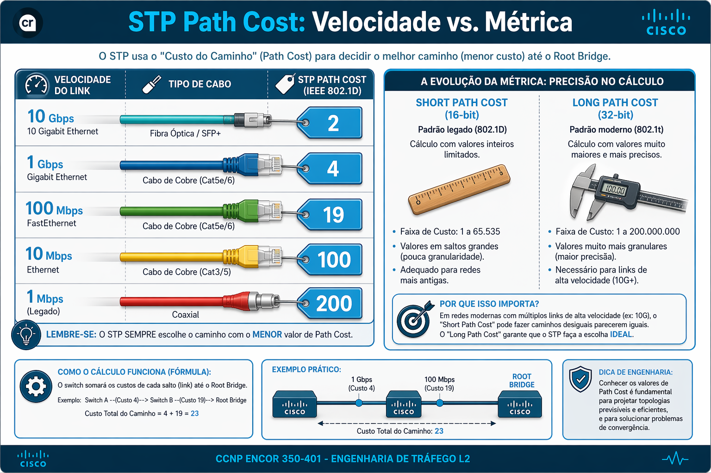
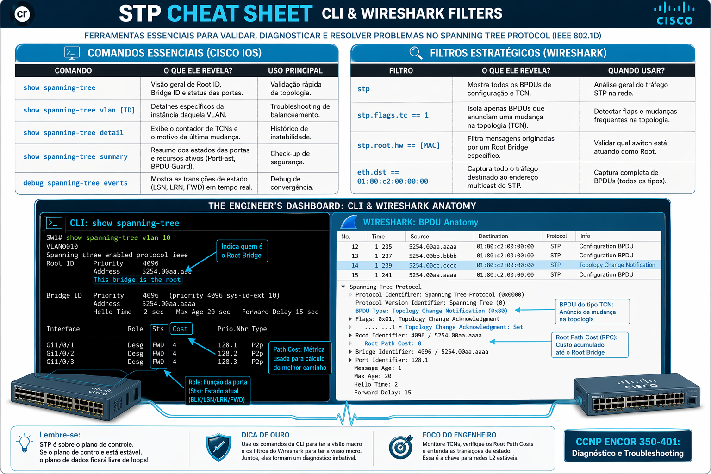
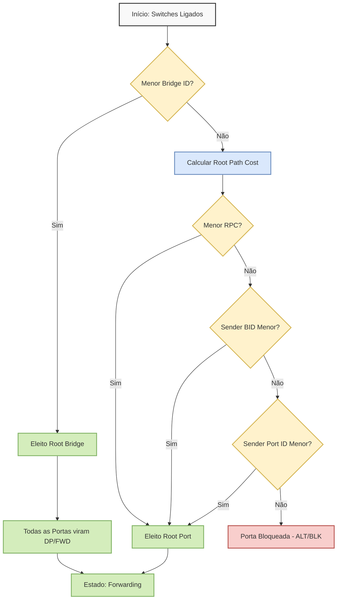
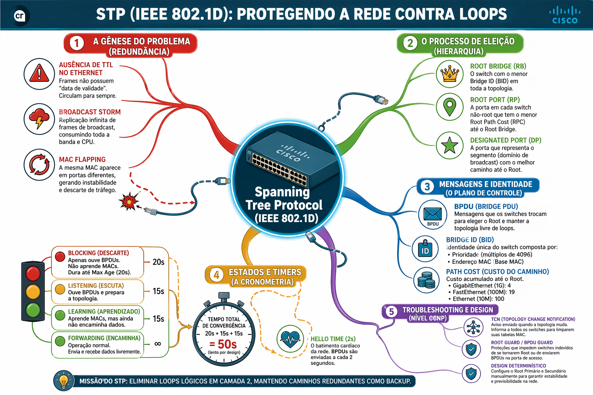

# 07 - Spanning Tree Protocol (STP): Revisão Consolidada e Guia Visual de Engenharia

Este documento consolida os conhecimentos fundamentais e avançados de Spanning Tree Protocol (STP) baseados no padrão IEEE 802.1D, servindo como guia de referência definitiva para engenharia de Camada 2 e preparação para o exame CCNP ENCOR 350-401.

- [07 - Spanning Tree Protocol (STP): Revisão Consolidada e Guia Visual de Engenharia](#07---spanning-tree-protocol-stp-revisão-consolidada-e-guia-visual-de-engenharia)
  - [🧠 Antes de começar (Explicação simples)](#-antes-de-começar-explicação-simples)
  - [🎯 O que este material demonstra (habilidades profissionais)](#-o-que-este-material-demonstra-habilidades-profissionais)
  - [📖 Glossário Mestre de Engenharia](#-glossário-mestre-de-engenharia)
  - [🏗️ Arquitetura do Problema: Redundância vs. Loop](#️-arquitetura-do-problema-redundância-vs-loop)
  - [💼 Por que isso importa no mundo real?](#-por-que-isso-importa-no-mundo-real)
  - [🧩 Tradução rápida (sem complicação)](#-tradução-rápida-sem-complicação)
  - [🧠 Como pensar no BPDU (modo simples)](#-como-pensar-no-bpdu-modo-simples)
  - [🧬 Anatomia do Plano de Controle: BPDU e Bridge ID](#-anatomia-do-plano-de-controle-bpdu-e-bridge-id)
    - [📊 Tabela de Custos de Caminho (STP Path Cost)](#-tabela-de-custos-de-caminho-stp-path-cost)
  - [🧠 O Algoritmo de Decisão (O Modelo Mental)](#-o-algoritmo-de-decisão-o-modelo-mental)
  - [🎯 Regra simples (antes da técnica - eleição do ROOT / PORTAS)](#-regra-simples-antes-da-técnica---eleição-do-root--portas)
  - [⏱️ Por que o STP é "lento"?](#️-por-que-o-stp-é-lento)
  - [⏱️ Cronometria da Convergência e Estados](#️-cronometria-da-convergência-e-estados)
  - [🛠️ Engenharia de Design e Melhores Práticas](#️-engenharia-de-design-e-melhores-práticas)
  - [🛠️ Toolbox do Engenheiro: CLI Cheat Sheet e Wireshark Filters](#️-toolbox-do-engenheiro-cli-cheat-sheet-e-wireshark-filters)
      - [💻 Comandos Essenciais (Cisco IOS)](#-comandos-essenciais-cisco-ios)
      - [🔍 Filtros Estratégicos (Wireshark)](#-filtros-estratégicos-wireshark)
    - [🏭 Impacto em Produção](#-impacto-em-produção)
  - [🎨 Fluxograma do Processo de Decisão do STP (Algoritmo Mental)](#-fluxograma-do-processo-de-decisão-do-stp-algoritmo-mental)
    - [STP (IEEE 802.1D): Protegendo a rede contra LOOPS](#stp-ieee-8021d-protegendo-a-rede-contra-loops)
  - [🧠 O que você deveria ter entendido até aqui](#-o-que-você-deveria-ter-entendido-até-aqui)

---

## 🧠 Antes de começar (Explicação simples)

Se você nunca estudou redes, pense assim:

- Switches são como "cruzamentos" de uma cidade
- Eles recebem dados e encaminham para o destino correto

Agora imagine:

❌ E se existirem caminhos circulares?
→ O dado pode ficar rodando para sempre

💥 **Resultado:**

- Rede fica lenta
- Equipamentos sobrecarregados
- Comunicação pode parar completamente

👉 Esse problema se chama: LOOP DE CAMADA 2

E é exatamente isso que o STP resolve.

## 🎯 O que este material demonstra (habilidades profissionais)

Este estudo não é apenas teórico. Ele evidencia:
  
- Capacidade de troubleshooting (análise de falhas)
- Entendimento de protocolos fundamentais de rede
- Correlação entre teoria e operação real (CLI + análise de tráfego)
- Raciocínio lógico aplicado a cenários complexos
  
👉 **Essas são competências essenciais para atuação em ambientes corporativos.**

---

## 📖 Glossário Mestre de Engenharia

| **Termo**                | **Definição Técnica**                                                    | **Aplicação CCNP**                                                     |
| :---                     | :---                                                                     | :---                                                                   |
| **Bridge ID (BID)**      | Identidade de 8 bytes (4 bits Prioridade, 12 bits VLAN ID, 48 bits MAC). | Base da eleição do Root Bridge. Valores menores vencem.                |
| **Root Path Cost (RPC)** | Soma acumulada dos custos das interfaces de entrada até o Root.          | Determina a Root Port (RP). Calculado pelo somatório, não custo local. |
| **BPDU**                 | Bridge Protocol Data Unit. Quadro multicast (01:80:C2:00:00:00).         | "Plano de Controle" que dita a topologia lógica.                       |
| **TCN**                  | Topology Change Notification.                                            | Alerta de mudança que reduz o aging da tabela MAC de 300s para 15s.    |
| **Port ID**              | Valor de 2 bytes (Prioridade da porta + Número da porta).                | Critério final de desempate (Sender Port ID).                          |
| **Root Bridge**          | O switch central eleito com o menor Bridge ID. Todas as suas portas são Designated (FWD). | O "Presidente" ou o "Topo da Árvore" da topologia.    |
| **TCA (TC Ack)**         | Bit no BPDU usado pelo Root para confirmar o recebimento de um alerta de mudança (TCN).   | O "Recebido" ou confirmação de leitura do alarme.     |
| **Forward Delay**        | Tempo de permanência nos estados de Listening e Learning (15s cada).     | A "quarentena" obrigatória para evitar loops temporários.              |
| **Max Age**            |Tempo que o switch aguarda (20s) sem BPDUs antes de invalidar a topologia atual.|O tempo de "espera na linha" antes de considerar que a ligação caiu.|
| **Root Port (RP)**       | A única porta por switch non-root que possui o menor custo até o Root Bridge. | O seu "GPS" apontando para a rota mais rápida para casa.          |
| **Designated Port (DP)** | Porta eleita por segmento para encaminhar tráfego; possui o melhor BPDU no link. | O "Dono da Rua" ou representante oficial do segmento.          |
| **Alternate Port**       | Porta em estado de bloqueio (BLK) que serve como backup para a Root Port. | O "pneu estepe" do carro; pronto para uso se o principal furar.       |
| **Bridge Priority**      | Valor configurável em incrementos de 4096 (padrão 32768) para influenciar a eleição. | O "peso político" que o administrador dá ao switch.        |
| **Port ID**         | Identificador de 16 bits: Prioridade da porta (ex: 128) + número da interface. | O número da "pista" usado para desempate final entre links paralelos. |
| **Sender Port ID**|O ID da porta do vizinho que enviou o BPDU; critério final de desempate para Root Port. |A "porta de saída" do vizinho que dita quem vence do nosso lado. |
| **Short vs Long Cost**   | Padrões de custo de 16 bits (Short) vs 32 bits (Long) para links acima de 10 Gbps. | Régua antiga (limitada) vs régua moderna de alta precisão.   |
| **MAC Flapping**|Sintoma de loop onde o switch aprende o mesmo MAC em portas diferentes rapidamente.|Uma "pessoa" sendo vista em dois lugares ao mesmo tempo, causando confusão.|
| **Aging Time**           | Tempo de vida das entradas na tabela MAC; reduzido de 300s para 15s durante um TC. | O tempo que o switch leva para "esquecer" quem não vê mais.  |

---

## 🏗️ Arquitetura do Problema: Redundância vs. Loop

O protocolo Ethernet foi projetado para simplicidade, mas carece de um campo TTL (Time-to-Live) em seu cabeçalho.

- **A Falha:** Em topologias redundantes, frames de broadcast circulam infinitamente, causando **Broadcast Storms, MAC Flapping e exaustão de CPU.**
- **A Solução:** O STP cria uma topologia lógica em árvore (Spanning Tree) onde caminhos redundantes permanecem físicos, mas **são bloqueados logicamente.**

## 💼 Por que isso importa no mundo real?

Redes corporativas precisam ser:
  
- Estáveis
- Previsíveis
- Disponíveis
  
Um erro de configuração em protocolos de camada 2 pode causar:

💥 Queda total da rede
💥 Sistemas indisponíveis
💥 Impacto direto no negócio
  
👉 **O Spanning Tree Protocol (STP) existe para evitar esse tipo de falha.**
  
Este material demonstra, na prática:
  
✔️ Como identificar problemas de rede
✔️ Como analisar comportamento de switches
✔️ Como garantir estabilidade em ambientes reais

## 🧩 Tradução rápida (sem complicação)

Antes de entrar nos detalhes, guarde isso:

- BPDU → Mensagem que os switches trocam para decidir a rede
- BID → Identidade do switch (quem ele é)
- RPC (Root Path Cost) → Distância até o switch principal
  
👉 Não precisa decorar agora — isso vai fazer sentido ao longo do material.

## 🧠 Como pensar no BPDU (modo simples)

Pense no BPDU como um "currículo" que cada switch envia:
  
Ele diz:
  
- Quem eu acho que é o líder (Root Bridge)
- Qual o custo para chegar até ele
- Quem eu sou
- Por qual porta estou falando
  
👉 Com base nisso, os switches decidem:  
**quem manda, quem encaminha e quem bloqueia.**

## 🧬 Anatomia do Plano de Controle: BPDU e Bridge ID 

Toda a inteligência do STP reside na troca de BPDUs.

- **Bridge ID (BID):** Composto por Prioridade (múltiplos de 4096) + Extended System ID (VLAN) + MAC Address.
- **BPDU de Configuração:** Contém Root ID, Root Path Cost e os timers de rede.

### 📊 Tabela de Custos de Caminho (STP Path Cost)

## 🧠 O Algoritmo de Decisão (O Modelo Mental)

O STP segue uma hierarquia determinística de decisões para evitar loops:

- **Eleger o Root Bridge:** Menor Bridge ID (Prioridade > MAC).
- **Eleger Root Ports (RP):** Uma por switch não-root. Menor custo acumulado (RPC).
- **Eleger Designated Ports (DP):** Uma por segmento. O switch que envia o melhor BPDU vence o link.
- **Bloquear Portas (Non-Designated/Alternate):** Tudo o que sobrou vai para estado Blocking.
  
Hierarquia de Desempate (Tie-breakers):
  
1. **Menor Root Path Cost (RPC).**
2. **Menor Sender Bridge ID (BID do vizinho).**
3. **Menor Sender Port Priority (Prioridade da porta do vizinho).**
4. **Menor Sender Port ID (Número da porta do vizinho).**

## 🎯 Regra simples (antes da técnica - eleição do ROOT / PORTAS)

Se você só lembrar disso, já entende o STP:

1. Existe UM switch principal (Root)
2. Todo switch tenta chegar nele pelo melhor caminho
3. Caminhos redundantes são bloqueados

👉 O restante é só como o STP decide isso.

---

## ⏱️ Por que o STP é "lento"?

O STP clássico (802.1D) foi projetado para ser:
  
✔️ Seguro  
❌ Não rápido  
  
Ele espera antes de tomar decisões para evitar erros.

👉 **Resultado:**

- A rede demora para se recuperar
- Mas evita loops perigosos

## ⏱️ Cronometria da Convergência e Estados

O STP clássico (802.1D) é conservador e lento, podendo levar até 50 segundos para convergir:

| **Estado**     | **Duração**                        | **Função Operacional**                                    |
| :---           | :---                               | :---                                                      |
| **Blocking**   | Indefinido (¹)                     | Recebe BPDUs, mas não encaminha dados nem aprende MAC.    |
| **Listening**  | Forward Delay (15s)                | Participa da eleição. Decide papéis de portas (RP/DP).    |
| **Learning**   | Forward Delay (15s)                | Popula a tabela MAC (CAM Table), mas não encaminha dados. |
| **Forwarding** | Contínuo                           | Encaminhamento normal de tráfego e aprendizado de MAC.    |

> *(¹) Uma porta em Blocking permanece nesse estado enquanto receber BPDUs normalmente — o que pode ser indefinido.*
> *O **Max Age (20s)** é ativado apenas em **falha indireta**: quando o link físico permanece UP mas os BPDUs param de chegar.*
> *Somente após esgotar o Max Age o switch invalida a topologia atual e inicia a transição para Listening.*

## 🛠️ Engenharia de Design e Melhores Práticas

- **Posicionamento Estratégico:** O Root Bridge deve estar no Core/Distribuição da rede.
- **Determinismo:** Definir manualmente o Root Primary (prioridade 4096 ou 8192) e Root Secondary (prioridade 16384).
- **Balanceamento de Carga:** Utilizar múltiplos Root Bridges para diferentes grupos de VLANs para otimizar os links redundantes.

## 🛠️ Toolbox do Engenheiro: CLI Cheat Sheet e Wireshark Filters

- **Comandos CLI:**
  - **show spanning-tree:** Visão geral de papéis (Role) e estados (Sts).
  - **debug spanning-tree events:** Observação das transições de estado em tempo real.
  
- **Análise Wireshark:**
  - **Root Path Cost** = 0: O BPDU foi originado pelo Root Bridge.
  - **Filtros Úteis**: stp (todos os BPDUs) ou stp.flags.tc == 1 (mudanças de topologia).

Para um engenheiro CCNP, saber o que procurar é tão importante quanto saber o comando. Esta seção consolida as ferramentas essenciais para validar o plano de controle do STP.

#### 💻 Comandos Essenciais (Cisco IOS)

| Comando                        | O que ele revela?                                                   | Uso Principal                  |
| :---                           | :---                                                                | :---                           |
| `show spanning-tree`           | Visão geral de Root ID, Bridge ID e status das portas.              | Validação rápida da topologia. |
| `show spanning-tree vlan [ID]` | Detalhes específicos da instância daquela VLAN.                  | Troubleshooting de balanceamento. |
| `show spanning-tree detail`    | Exibe o contador de TCNs e o motivo da última mudança.              | Histórico de instabilidade.    |
| `show spanning-tree summary`   | Resumo dos estados das portas e recursos ativos (PortFast, BPDU Guard). | Check-up de segurança.     |
| `debug spanning-tree events`   | Mostra as transições de estado (LSN, LRN, FWD) em tempo real.       | Debug de convergência.         |

#### 🔍 Filtros Estratégicos (Wireshark)

Utilize estes filtros para isolar o "ruído" e focar no comportamento do protocolo:

- **`stp`**: Mostra todos os BPDUs de configuração e TCN [1, 2].
- **`stp.flags.tc == 1`**: Isola apenas BPDUs que anunciam uma mudança na topologia [2, 3].
- **`stp.root.hw == [MAC]`**: Filtra mensagens originadas por um Root Bridge específico [2].
- **`eth.dst == 01:80:c2:00:00:00`**: Captura todo o tráfego destinado ao endereço multicast do STP [2, 4].

### 🏭 Impacto em Produção

Se mal configurado, pode causar:

- Interrupção de serviços críticos
- Lentidão generalizada na rede
- Dificuldade de diagnóstico em incidentes

👉 **Em ambientes corporativos, isso impacta diretamente usuários e sistemas.**

## 🎨 Fluxograma do Processo de Decisão do STP (Algoritmo Mental)

### STP (IEEE 802.1D): Protegendo a rede contra LOOPS

## 🧠 O que você deveria ter entendido até aqui

Se tudo fez sentido, você já consegue:

✔️ Entender o que é um loop de rede  
✔️ Saber por que ele é perigoso  
✔️ Explicar o que o STP faz  
✔️ Entender a ideia de Root Bridge  
✔️ Saber que existem portas ativas e bloqueadas  

👉 **Se isso está claro, você já saiu do nível iniciante.**
