# 🛡️ STP: Anatomia das Falhas e Processos de Convergência

## 📌 Sumário

- [🛡️ STP: Anatomia das Falhas e Processos de Convergência](#️-stp-anatomia-das-falhas-e-processos-de-convergência)
  - [📌 Sumário](#-sumário)
  - [🎯 Objetivo do Documento](#-objetivo-do-documento)
  - [📖 Como Este Documento Deve Ser Lido](#-como-este-documento-deve-ser-lido)
  - [🏗️ Contexto](#️-contexto)
  - [📖 Glossário Técnico](#-glossário-técnico)
  - [🛠️ STP: Falhas e Mecânicas de Convergência](#️-stp-falhas-e-mecânicas-de-convergência)
  - [📉 Mecânica de Falha: Direta vs. Indireta](#-mecânica-de-falha-direta-vs-indireta)
  - [🔄 2. O Processo de Reconvergência em Detalhes](#-2-o-processo-de-reconvergência-em-detalhes)
  - [🔬 Análise Detalhada de Cenários](#-análise-detalhada-de-cenários)
  - [🟢 Cenário Base: STP em Condições Normais](#-cenário-base-stp-em-condições-normais)
  - [🌊 Fluxo Downstream de BPDUs](#-fluxo-downstream-de-bpdus)
  - [📉 Mecânica de Detecção de Mudanças na Topologia](#-mecânica-de-detecção-de-mudanças-na-topologia)
    - [⚡ Falhas Diretas: Reação Imediata do Hardware](#-falhas-diretas-reação-imediata-do-hardware)
    - [🐢 Falhas Indiretas: O "Silêncio" do Root Bridge](#-falhas-indiretas-o-silêncio-do-root-bridge)
    - [📊 Quadro Comparativo de Recuperação](#-quadro-comparativo-de-recuperação)
    - [Cenário 01: Queda do Link de Backup (Link 1)](#cenário-01-queda-do-link-de-backup-link-1)
    - [Cenário 02: Queda de Link entre Switch Não-Root (Link 3)](#cenário-02-queda-de-link-entre-switch-não-root-link-3)
  - [Cenário 03: ⚖️ O Fator de Desempate: Port-ID](#cenário-03-️-o-fator-de-desempate-port-id)
  - [🛠️ Análise de Falhas por Segmento (Links 01, 02 e 03)](#️-análise-de-falhas-por-segmento-links-01-02-e-03)
    - [1. Queda do Link 01 (Link de Backup entre SW\_D e SW\_E)](#1-queda-do-link-01-link-de-backup-entre-sw_d-e-sw_e)
    - [2. Queda do Link 02 (Root Link do SW\_D)](#2-queda-do-link-02-root-link-do-sw_d)
    - [3. Queda do Link 03 (Root Link do SW\_E)](#3-queda-do-link-03-root-link-do-sw_e)
    - [📝 Resumo de Comportamento](#-resumo-de-comportamento)
    - [Cenário 04 : Links Redundantes](#cenário-04--links-redundantes)
  - [📉 Análise de Falhas Sequenciais e Impacto na Convergência](#-análise-de-falhas-sequenciais-e-impacto-na-convergência)
    - [1. Queda do Link 02 (Conexão SW\_D -\> Root)](#1-queda-do-link-02-conexão-sw_d---root)
    - [2. Queda do Link 01 (Link entre SW\_D e SW\_E)](#2-queda-do-link-01-link-entre-sw_d-e-sw_e)
    - [3. Queda Simultânea: Link 01 e Link 02](#3-queda-simultânea-link-01-e-link-02)
    - [📊 Resumo de Impacto](#-resumo-de-impacto)
  - [🛡️ Filtragem de Quadros no STP](#️-filtragem-de-quadros-no-stp)
    - [Como funciona a filtragem](#como-funciona-a-filtragem)
  - [🏚️ Queda de uma Bridge Não-Root (Switch Intermediário)](#️-queda-de-uma-bridge-não-root-switch-intermediário)
    - [Comportamento da Rede](#comportamento-da-rede)
    - [Impacto](#impacto)
    - [📊 Resumo de Estados da Porta vs. Encaminhamento](#-resumo-de-estados-da-porta-vs-encaminhamento)
  - [💻 Comandos de Verificação (Laboratório)](#-comandos-de-verificação-laboratório)
  - [🧠 O que este documento prova que você sabe fazer](#-o-que-este-documento-prova-que-você-sabe-fazer)
    - [✅ Competências demonstradas neste documento](#-competências-demonstradas-neste-documento)
    - [🔑 As 5 regras que você nunca mais vai esquecer](#-as-5-regras-que-você-nunca-mais-vai-esquecer)
  - [🧪 Pronto para Testar seu Conhecimento?](#-pronto-para-testar-seu-conhecimento)

---

## 🎯 Objetivo do Documento

Este documento visa detalhar como o protocolo **IEEE 802.1D (Spanning Tree clássico)** reage a instabilidades na topologia. O foco é entender o comportamento dos timers, a propagação de BPDUs e a lógica de transição de portas para evitar loops enquanto a rede tenta se recuperar.

## 📖 Como Este Documento Deve Ser Lido

Este guia foi projetado para seguir uma linha de raciocínio logístico:

1. **Teoria Base:** Entenda o que é o erro.
2. **Visualização:** Analise os diagramas de topologia.
3. **Mecânica Interna:** Compreenda os cálculos e timers envolvidos.
4. **Verificação:** Comandos para validar o comportamento em laboratório.

## 🏗️ Contexto

Em uma rede com caminhos redundantes, a queda de um link não deve derrubar a comunicação. No entanto, o STP original é conhecido por ser "lento" (convergência de até 50 segundos). Entender esses 50 segundos é vital para o exame **CCNP ENCOR 350-401**, pois serve de base para compreender por que o RSTP (Rapid STP) foi criado.

## 📖 Glossário Técnico

* **BPDU (Bridge Protocol Data Unit):** Quadros de controle usados para troca de informações entre switches.
* **Max Age (20s):** Tempo máximo que um switch armazena informações de um BPDU antes de descartá-lo.
* **Forward Delay (15s):** Tempo gasto em cada estado intermediário (Listening e Learning).
* **Root Port (RP):** A porta de menor custo em direção ao Root Bridge.
* **Designated Port (DP):** Porta responsável por encaminhar tráfego em um segmento.
* **Blocking (BLK):** Estado onde a porta descarta dados para evitar loops, mas ainda "escuta" BPDUs.

---

## 🛠️ STP: Falhas e Mecânicas de Convergência

Após entender a eleição do Root Bridge e as funções das portas, é crucial compreender como a topologia reage quando algo dá errado. O STP clássico (802.1D) é conservador e prioriza a prevenção de loops em vez da velocidade.

## 📉 Mecânica de Falha: Direta vs. Indireta

A forma como um switch reage depende de como ele percebe a perda de conectividade. (ex: cabo desconectado).  
  
**A. Falha Direta (Reconverge em ~30s)**  
  
Ocorre quando o link físico conectado diretamente ao switch cai. O switch detecta a queda do sinal elétrico imediatamente.

- **Ação:** O switch remove a entrada da tabela MAC e busca um caminho alternativo imediatamente, movendo a porta reserva para os estados de Listening e Learning.
  
**B. Falha Indireta (Reconverge em ~50s)**  
  
Ocorre em um link que não está fisicamente conectado ao switch (ex: uma falha entre o Root e um vizinho).
  
- **O Perigo:** O switch local ainda vê o link "Up", mas para de receber BPDUs.
- **Ação:** Ele deve aguardar o Max Age (20s) para expirar as informações antigas antes de iniciar a transição da porta bloqueada.

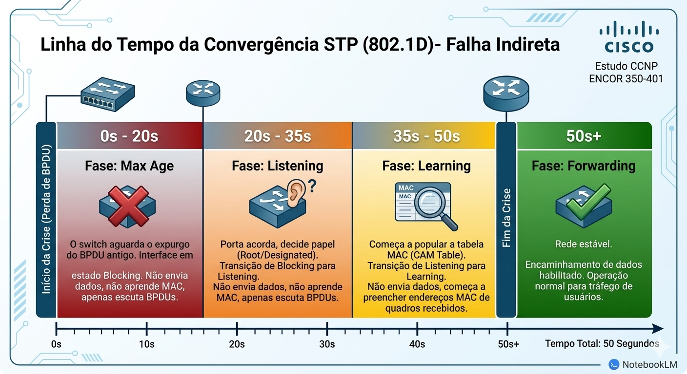

## 🔄 2. O Processo de Reconvergência em Detalhes

Fluxo de Decisão em Caso de Perda de BPDU

- **Max Age (20s):** O switch "congela" e espera para ter certeza de que o BPDU realmente parou de chegar.
- **Listening (15s):** A porta bloqueada acorda. Ela ouve BPDUs para decidir se deve ser Root ou Designated. Não aprende MAC.
- **Learning (15s):** A porta começa a popular a tabela CAM (MAC Address Table), mas ainda não encaminha dados do usuário.
- **Forwarding:** A rede está estável e o tráfego volta a fluir.

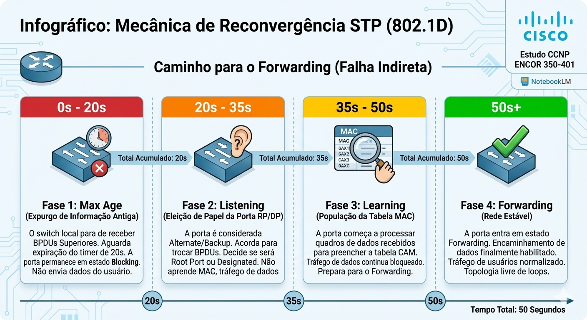

---

## 🔬 Análise Detalhada de Cenários

Para compreender como o STP reage a falhas, precisamos primeiro estabelecer e visualizar a topologia em seu estado estável (convergido). Este cenário base serve como referência para todas as análises de falhas diretas e indiretas.

## 🟢 Cenário Base: STP em Condições Normais

Nesta topologia triangular clássica, os switches concluíram o processo de eleição e cálculo de caminhos. A rede está estável e livre de loops.

**Pontos Chave da Topologia Estável:**

- **SW_A** é o **Root Bridge** (possui o menor MAC Address).
- **SW_B** e **SW_C** identificaram suas **Root Ports (RP)** — os caminhos mais rápidos até o Root.
- O link direto entre SW_B e SW_C foi identificado como redundante. Como SW_B tem um BID menor que SW_C, a porta de SW_B neste segmento torna-se **Designated (DP)** e a porta de SW_C é **Bloqueada (BLK)**.

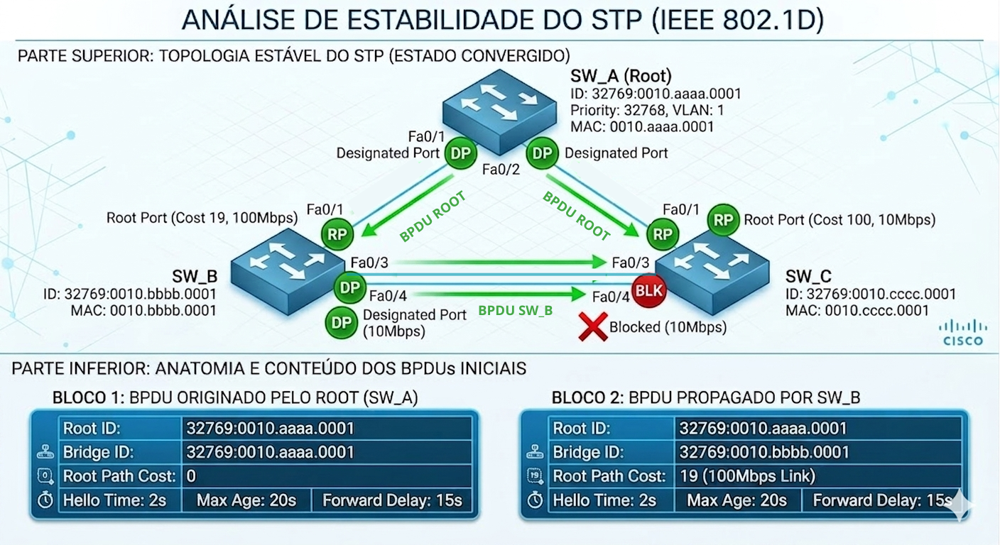

## 🌊 Fluxo Downstream de BPDUs

É fundamental visualizar o STP como um sistema hierárquico onde a informação flui do "mestre" (Root) para os "escravos" (switches não-root). Esse fluxo é chamado de **Downstream**.

**A Regra de Propagação:**

1. Apenas o **Root Bridge** gera BPDUs "originais".
2. Switches não-root recebem BPDUs em suas **Root Ports**.
3. Eles processam a informação, atualizam o campo *Root Path Cost* (somando seu próprio custo de interface) e propagam o BPDU por todas as suas **Designated Ports**.
4. BPDUs nunca são propagados para fora de uma Root Port.

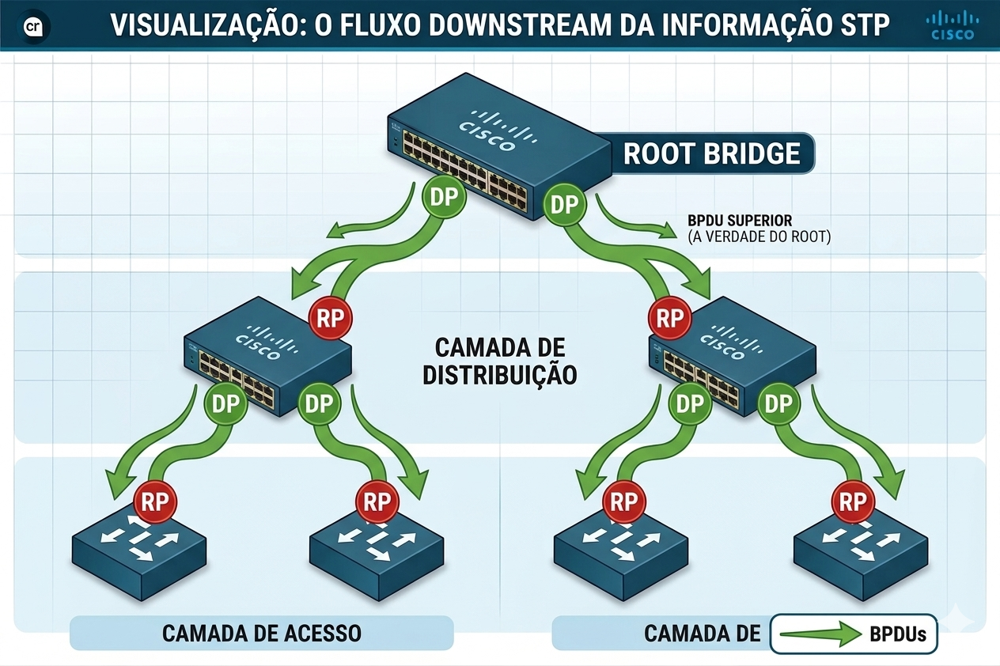

## 📉 Mecânica de Detecção de Mudanças na Topologia

O STP não é um protocolo reativo instantâneo; ele opera com base na confiança e na manutenção de estados. Um switch monitora a saúde da topologia de duas formas principais: pela camada física e pelo monitoramento de BPDUs.

---

### ⚡ Falhas Diretas: Reação Imediata do Hardware
  
Uma **Falha Direta** ocorre quando o switch detecta um problema em um link **fisicamente conectado** a uma de suas portas.
  
- **O Gatilho:** A controladora da interface (PHY) notifica o software imediatamente que o link está "Down" (perda de sinal elétrico/óptico).
- **A Mecânica:** * O switch invalida a porta que caiu.
  - Se ele possuir uma porta em estado de bloqueio (**Blocking/Alternate**), ele entende que a topologia mudou drasticamente e não há necessidade de esperar.
  - Ele **pula o timer de Max Age (20s)** e coloca a porta reserva imediatamente para transicionar.
- **Tempo de Convergência:** ~30 Segundos.
  - `15s (Listening) + 15s (Learning) = 30s`.
  
---
  
### 🐢 Falhas Indiretas: O "Silêncio" do Root Bridge
  
Uma **Falha Indireta** ocorre quando um link ou switch falha em um ponto da rede que **não possui conexão física** com o switch local.
  
- **O Gatilho:** O switch local mantém suas portas em "Up", mas para de receber BPDUs Superiores vindos do Root Bridge.
- **O Problema (Conservadorismo):** O switch não tem como saber se o Root caiu ou se o link apenas está congestionado. Para evitar criar um loop catastrófico, ele deve ser paciente.
- **A Mecânica:** * O switch inicia uma contagem regressiva chamada **Max Age**.
  - Ele mantém a última informação conhecida como "verdade" por **20 segundos**.
  - Somente após o estouro desse cronômetro (silêncio total do Root) é que ele considera a informação antiga inválida e começa a buscar um novo caminho.
- **Tempo de Convergência:** ~50 Segundos.
  - `20s (Max Age) + 15s (Listening) + 15s (Learning) = 50s`.

---

### 📊 Quadro Comparativo de Recuperação

| **Tipo de Falha** | **Detecção**                     | **Timer Max Age**    | **Tempo de Queda** |
| :---              | :---                             | :---                 | :---               |
| **Direta**        | Camada Física (Link Down local)  | Ignorado (Skip)      | **30 Segundos**    |
| **Indireta**      | Camada Lógica (Ausência de BPDU) | Ativo (Aguardar 20s) | **50 Segundos**    |

> ⚠️**CUIDADO !!!**  
> Em cenários de **CCNP ENCOR**, lembre-se: a falha indireta é o maior gargalo do STP clássico (802.1D). O tempo de 50 segundos é inaceitável para aplicações de Voz e Vídeo modernas, o que justifica a migração para o RSTP (802.1w).

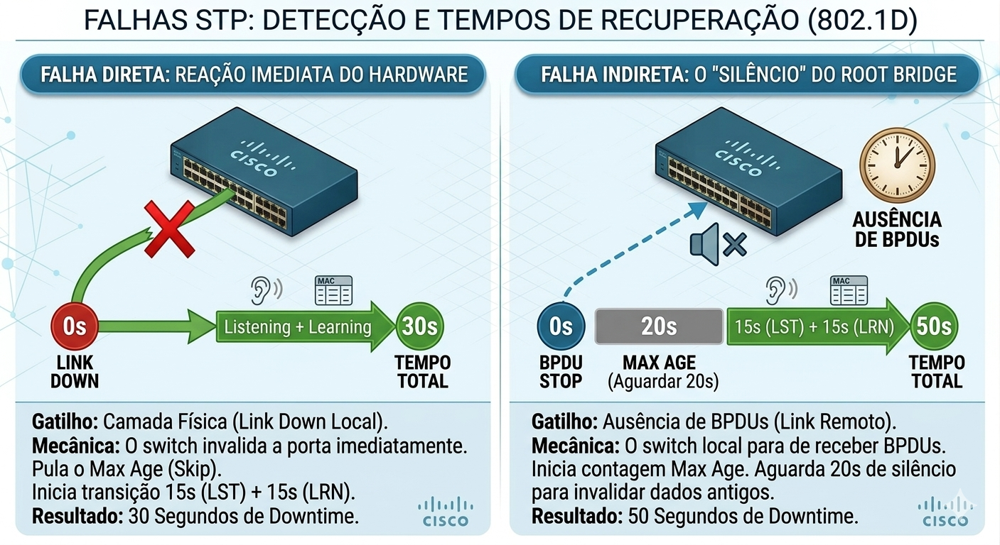

### Cenário 01: Queda do Link de Backup (Link 1)

- **Impacto:** Mínimo.
- **Resultado:** Como o link já estava em estado de bloqueio (BLK), a queda não interfere no fluxo de dados atual. As portas apenas são removidas da topologia lógica.

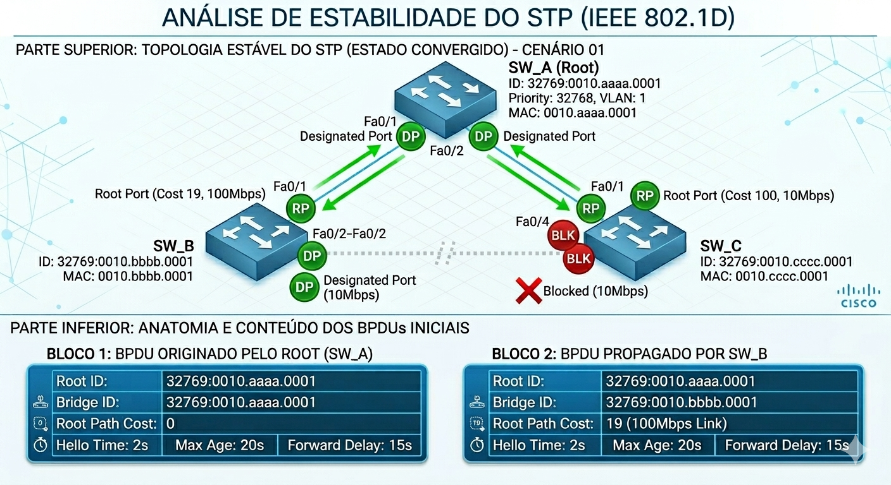

### Cenário 02: Queda de Link entre Switch Não-Root (Link 3)

- **Mecânica:** O Switch B perde sua Root Port Fa0/1 (Root Port) — detecta queda física imediata. Ele envia BPDUs alegando ser o Root para o Switch C.
- Sem Root Port, SW_B acredita ser a raiz e passa a gerar BPDUs com ele mesmo como Root Bridge ID
- **O "Duelo" de BPDUs:** SW_C recebe o BPDU inferior do SW_B via Fa0/4 e o descarta imediatamente — ele já possui um BPDU Superior do SW_A válido. Não há necessidade de aguardar Max Age, pois o caminho até o Root real continua ativo. SW_C encaminha o BPDU Superior via Fa0/3, SW_B o recebe, reconhece que não é a raiz e elege nova Root Port.
- SW_C recebe esse BPDU "inferior" pela porta Fa0/4 — mas ainda recebe BPDUs superiores do SW_A pela Fa0/1 (Root Port)
- SW_C descarta o BPDU do SW_B porque ele é inferior ao que já conhece — essa é a regra de comparação de BPDUs
- SW_C continua encaminhando o BPDU Superior do SW_A pela porta Fa0/3 em direção ao SW_B — essa porta, que antes era BLK no SW_C, agora - entra em jogo
- SW_B recebe um BPDU melhor que o seu próprio vindo do SW_C — reconhece que não é a raiz e converge elegendo uma nova Root Port

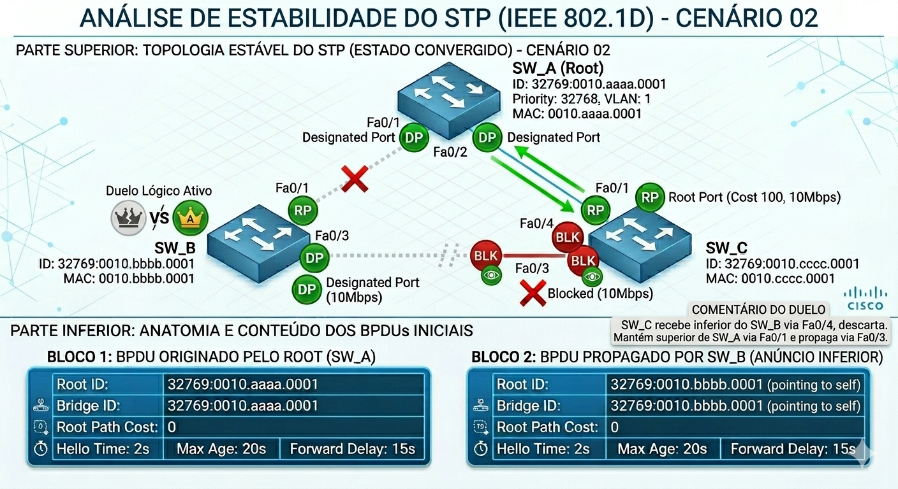

---

## Cenário 03: ⚖️ O Fator de Desempate: Port-ID

Quando todos os outros critérios (Root Bridge ID, Path Cost, Sender Bridge ID) são iguais — comum em links paralelos entre dois switches — o STP usa o **Port-ID** do vizinho para decidir qual porta bloquear.

1. **Prioridade da Porta:** Padrão 128.
2. **Número da Porta:** Ex: Fa0/1.

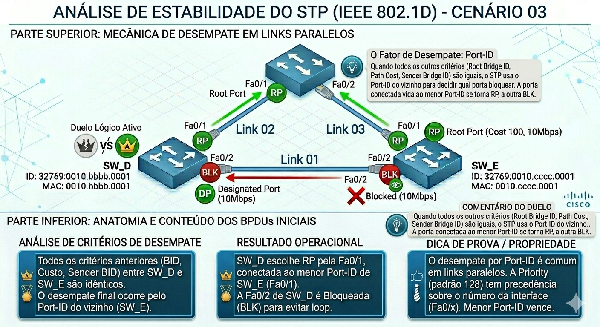

## 🛠️ Análise de Falhas por Segmento (Links 01, 02 e 03)

Com a topologia convergida e os links devidamente identificados, vamos analisar o comportamento do STP quando cada caminho físico é interrompido.

---

### 1. Queda do Link 01 (Link de Backup entre SW_D e SW_E)

Este é o cenário de **menor impacto** para a rede.

- **O que acontece:** O link que já estava em estado de **Blocking (BLK)** cai.
- **Mecânica:** O switch detecta a queda física, mas como o tráfego de dados dos usuários já não passava por ali, não há interrupção nos serviços.
- **Resultado:** A topologia lógica permanece idêntica. O STP apenas remove a entrada da interface da sua tabela. A redundância é perdida, mas a estabilidade é mantida.
- **Tempo de Convergência:** 0 segundos (Impacto zero).

---

### 2. Queda do Link 02 (Root Link do SW_D)

Este cenário caracteriza uma **Falha Direta** para o Switch D.
  
- **O que acontece:** O SW_D perde sua porta Fa0/1, que era sua **Root Port (RP)**.
- **Mecânica:** 1. O SW_D detecta a queda física imediata.
    2. Ele consulta sua tabela e vê que possui um caminho alternativo via Link 01 (porta Fa0/2).
    3. **Skip Max Age:** Ele não espera os 20 segundos, pois ele mesmo sentiu a queda.
    4. A porta Fa0/2 do SW_D transiciona: `Listening (15s) -> Learning (15s) -> Forwarding`.
- **Resultado:** O SW_D volta a ter conectividade com o Root através do SW_E.
- **Tempo de Convergência:** ~30 segundos.

---

### 3. Queda do Link 03 (Root Link do SW_E)

Este cenário caracteriza uma **Falha Direta** para o Switch E.

- **O que acontece:** O SW_E perde sua conexão principal com o Root Bridge.
- **Mecânica:**
  1. O SW_E detecta que sua Root Port caiu.
  2. Ele promove sua porta no Link 01 (que estava em BLK) para o processo de transição.
  3. Assim como no caso anterior, ele pula o timer de Max Age.
  4. A porta passa pelos estados de transição para garantir que não haverá loop antes de liberar o tráfego.
- **Resultado:** O SW_E passa a alcançar o Root Bridge através do SW_D (Link 01 -> Link 02).
- **Tempo de Convergência:** ~30 segundos.

---

### 📝 Resumo de Comportamento

| Link Caído  | Tipo de Falha | Impacto no Tráfego     | Tempo de Recuperação |
| :---        | :---          | :---                   | :---                 |
| **Link 01** | Redundante    | Nenhum                 | Inexistente (0s)     |
| **Link 02** | Direta (SW_D) | Interrupção Temporária | 30 Segundos          |
| **Link 03** | Direta (SW_E) | Interrupção Temporária | 30 Segundos          |

> ⚠️ **NOTA!**
> Note que em nenhum desses cenários "Diretos" houve a necessidade de esperar os 50 segundos. A convergência de 50s (Falha Indireta) só ocorreria se o Link 02 caísse e o SW_E (que não está ligado ao Link 02) tivesse que "adivinhar" que o Root sumiu através do silêncio de BPDUs.

---

### Cenário 04 : Links Redundantes

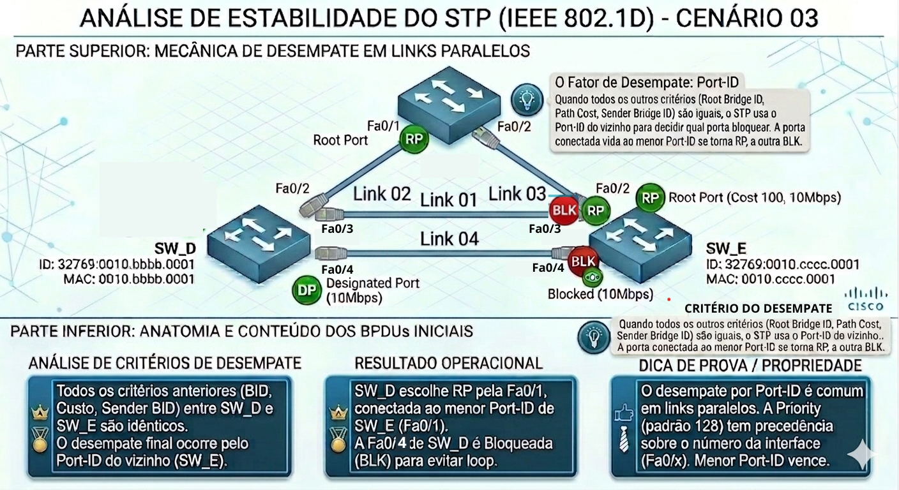

## 📉 Análise de Falhas Sequenciais e Impacto na Convergência
  
Com base na topologia do **Cenário 04**, onde o **SW_D** e o **SW_E** possuem links paralelos (Link 01 e Link 04) e conexões individuais ao Root Bridge (Links 02 e 03), analisaremos o comportamento do STP em quedas sucessivas.  
  
---

### 1. Queda do Link 02 (Conexão SW_D -> Root)

Este cenário é uma **Falha Direta** para o Switch D.

- **O que acontece:** O SW_D perde sua única **Root Port (RP)** direta para o Root Bridge (Fa0/1).
- **Mecânica de Convergência:**
  1. O hardware do SW_D detecta o link "Down" instantaneamente.
  2. Como ele possui links redundantes (Links 01 e 04) que estão em estado de bloqueio, ele **pula o timer de Max Age (20s)**.
  3. Ele elege uma nova Root Port através do SW_E. Pelo critério de desempate de Port-ID do vizinho, a porta Fa0/2 (conectada ao Link 01) inicia a transição.
- **Tempo de Recuperação:** ~30 segundos (15s Listening + 15s Learning).

---

### 2. Queda do Link 01 (Link entre SW_D e SW_E)

Considerando que este link caiu **enquanto os outros estão operacionais**:
  
- **O que acontece:** Queda de um link redundante que já estava em estado de **Blocking (BLK)** do lado do SW_E (ou servindo de backup para o SW_D).
- **Mecânica de Convergência:**
  1. O STP detecta a falha, mas como não havia tráfego de dados passando por este link, a topologia de encaminhamento não muda.
  2. O Link 04 continua em estado de bloqueio, pronto para assumir caso o Link 01 falhasse se estivesse ativo.
- **Tempo de Recuperação:** 0 segundos (Impacto zero no tráfego).

---

### 3. Queda Simultânea: Link 01 e Link 02

Este é o cenário de **Isolamento Parcial** do SW_D.

- **O que acontece:** O SW_D perde seu caminho principal para o Root (Link 02) E seu melhor caminho de backup (Link 01).
- **Mecânica de Convergência:**
  1. O SW_D detecta as falhas físicas em ambas as portas.
  2. Ele agora deve transicionar sua última opção: o **Link 04**.
  3. Novamente, por ser uma falha direta, ele não aguarda o Max Age.
  4. A interface conectada ao Link 04 deve passar pelos estados de Listening e Learning para garantir que o SW_E realmente tenha um caminho para o Root antes de abrir o tráfego.
- **Tempo de Recuperação:** ~30 segundos.

---

### 📊 Resumo de Impacto

| **Falha**         | **Gravidade** | **Nova Root Port (SW_D)** | **Tempo Total** |
| :---              | :---          | :---                      | :---            |
| **Link 02**       | Média         | Fa0/2 (Link 01)           | 30s             |
| **Link 01**       | Nula          | Mantém Fa0/1 (Link 02)    | 0s              |
| **Links 01 + 02** | Alta          | Fa0/x (Link 04)           | 30s             |

> ⚠️ **CUIDADO!!!**
> Se o **Link 03** (do Switch E) também caísse neste momento, teríamos uma **Falha Indireta** generalizada. Os switches passariam a acreditar que são o Root Bridge (Duelo de BPDUs) até que o Max Age de 20s expirasse em toda a rede.

## 🛡️ Filtragem de Quadros no STP

O principal objetivo do STP não é apenas encontrar o melhor caminho, mas **garantir a integridade da rede** bloqueando caminhos redundantes.

### Como funciona a filtragem

Enquanto uma porta está no estado de **Blocking (BLK)**, ela opera sob regras rígidas:

- **❌ NÃO encaminha** quadros de dados (tráfego dos usuários).
- **❌ NÃO aprende** endereços MAC.
- **✅ RECEBE BPDUs** para monitorar a saúde da topologia.
- **❌ NÃO envia** BPDUs (exceto em casos especiais de mudança de topologia).

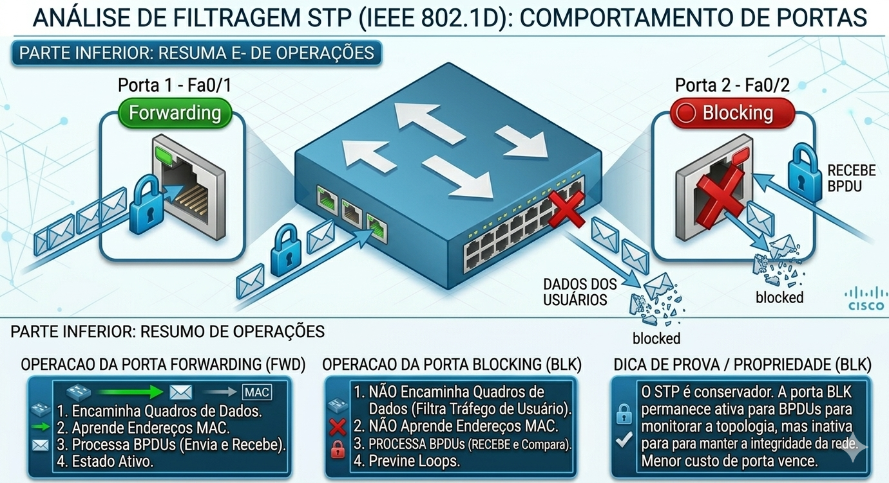

---

## 🏚️ Queda de uma Bridge Não-Root (Switch Intermediário)

O que acontece quando o switch que **não é a raiz** falha completamente? Este é um cenário de falha crítica para os dispositivos conectados a ele, mas como o STP reage?

### Comportamento da Rede

1. **Detecção Física:** Os switches vizinhos detectam a queda dos links conectados ao switch que falhou (Falha Direta).
2. **Invalidação de Caminhos:** Se o switch que caiu servia de caminho para o Root (era o *Designated Bridge* para outros switches abaixo), os switches de nível inferior perderão seus BPDUs superiores.
3. **Nova Eleição:** Os switches afetados buscarão caminhos alternativos através de suas portas de backup.

### Impacto

- **Dispositivos Finais:** Todos os PCs/Servidores ligados diretamente ao switch que caiu perdem conectividade total (independente do STP).
- **Tráfego de Passagem:** Se o switch era um nó de trânsito, o STP levará **30 segundos** (se houver caminho direto alternativo) ou **50 segundos** (se a falha for notada pelo silêncio de BPDUs) para restabelecer a conectividade através de outro switch.

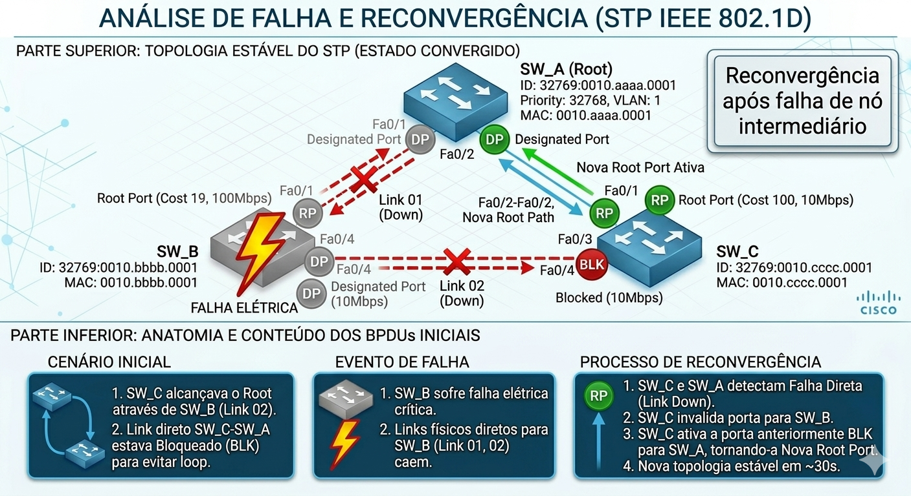

---

### 📊 Resumo de Estados da Porta vs. Encaminhamento

| Estado         | Encaminha Dados? | Aprende MAC? | Processa BPDU? |
| :---           | :---:            | :---:        | :---:          |
| **Blocking**   | ❌              | ❌           | ✅            |
| **Listening**  | ❌              | ❌           | ✅            |
| **Learning**   | ❌              | ✅           | ✅            |
| **Forwarding** | ✅              | ✅           | ✅            |
| **Disabled**   | ❌              | ❌           | ❌            |

## 💻 Comandos de Verificação (Laboratório)

```bash
# Verificar timers e estados
show spanning-tree

# Ver transições de portas em tempo real
debug spanning-tree events

# Ver detalhes da porta específica (incluindo Port-ID)
show spanning-tree interface <interface> detail
```

---

## 🧠 O que este documento prova que você sabe fazer

Se você chegou até aqui e acompanhou cada cenário, você não apenas leu sobre STP — você analisou o protocolo sob pressão. Isso é diferente.

### ✅ Competências demonstradas neste documento

| **Competência**                                     | **Onde foi aplicada**                         |
| :---                                                | :---                                          |
| Distinguir Falha Direta de Indireta                 | Seção de Mecânica de Falha + Cenários 01 e 02 |
| Calcular tempo de convergência por tipo de falha    | 30s vs 50s com fórmula explícita              |
| Interpretar o "Duelo de BPDUs"                      | Cenário 02 — SW_B vs SW_A via SW_C            |
| Aplicar critério de desempate por Port-ID           | Cenário 03 — links paralelos SW_D / SW_E      |
| Analisar falhas sequenciais e simultâneas           | Cenário 04 — Links 01, 02 e combinados        |
| Entender filtragem de quadros por estado de porta   | Seção de Filtragem + tabela de estados        |
| Prever comportamento após queda de nó intermediário | Seção de Queda de Bridge Não-Root             |

---

### 🔑 As 5 regras que você nunca mais vai esquecer

**1. O tipo de falha determina o tempo de convergência.**
> Falha Direta = 30s. Falha Indireta = 50s. A diferença está em *como* o switch percebe o problema — pelo hardware ou pelo silêncio de BPDUs.

**2. Max Age só conta quando os BPDUs param de chegar.**
> Uma porta em Blocking pode ficar nesse estado indefinidamente enquanto receber BPDUs normalmente. O timer de 20s só inicia quando o silêncio começa.

**3. No "Duelo de BPDUs", quem tem o BPDU Superior vence — e vence imediatamente.**
> SW_C não precisou esperar Max Age para descartar o BPDU inferior do SW_B. A regra de comparação de BPDUs é instantânea.

**4. O desempate por Port-ID usa a porta do vizinho, não a sua.**
> Quando dois links têm mesmo custo e mesmo Sender Bridge ID, o SW_D não olha para suas próprias portas — ele compara o Port-ID das portas do SW_E que enviaram os BPDUs.

**5. Uma porta em Blocking não está morta — ela está de plantão.**
> Plano de dados bloqueado. Plano de controle ativo. Ela continua recebendo BPDUs e pode assumir em segundos se o caminho principal cair.

---

## 🧪 Pronto para Testar seu Conhecimento?

Antes de partir para o laboratório, valide sua compreensão teórica com os simulados:

- **Simulados temáticos (10 questões / 10 min cada):**  
  1 - [Posicionamento do Root Bridge e Design de Rede](https://alcancil.github.io/Cisco/CCNP%20350-401%20ENCOR/03%20-%20Infrastructure/02%20-%20STP%20(Spanning%20Tree%20Protocol)/09%20-%20Revisao07/Arquivos/Simulado/01.html)  
  2 - [Bridge ID: Estrutura e Cálculo](https://alcancil.github.io/Cisco/CCNP%20350-401%20ENCOR/03%20-%20Infrastructure/02%20-%20STP%20(Spanning%20Tree%20Protocol)/09%20-%20Revisao07/Arquivos/Simulado/02.html)  
  3 - [Eleição do Root Bridge e Papéis de Porta](https://alcancil.github.io/Cisco/CCNP%20350-401%20ENCOR/03%20-%20Infrastructure/02%20-%20STP%20(Spanning%20Tree%20Protocol)/09%20-%20Revisao07/Arquivos/Simulado/03.html)  
  4 - [Critérios de Desempate (Tie-Breakers)](https://alcancil.github.io/Cisco/CCNP%20350-401%20ENCOR/03%20-%20Infrastructure/02%20-%20STP%20(Spanning%20Tree%20Protocol)/09%20-%20Revisao07/Arquivos/Simulado/04.html)  
  5 - [Consolidação: Estados, Convergência e Evolução](https://alcancil.github.io/Cisco/CCNP%20350-401%20ENCOR/03%20-%20Infrastructure/02%20-%20STP%20(Spanning%20Tree%20Protocol)/09%20-%20Revisao07/Arquivos/Simulado/01.html)  
  
- **Simulado completo STP:** [50 questões — 75 minutos](https://alcancil.github.io/Cisco/CCNP%20350-401%20ENCOR/03%20-%20Infrastructure/02%20-%20STP%20(Spanning%20Tree%20Protocol)/09%20-%20Revisao07/Arquivos/Simulado/completo.html)  
  
- **Seu desempenho consolidado:** [📊 Painel de Estatísticas](https://alcancil.github.io/Cisco/CCNP%20350-401%20ENCOR/03%20-%20Infrastructure/02%20-%20STP%20(Spanning%20Tree%20Protocol)/09%20-%20Revisao07/Arquivos/Simulado/dashboard.html)