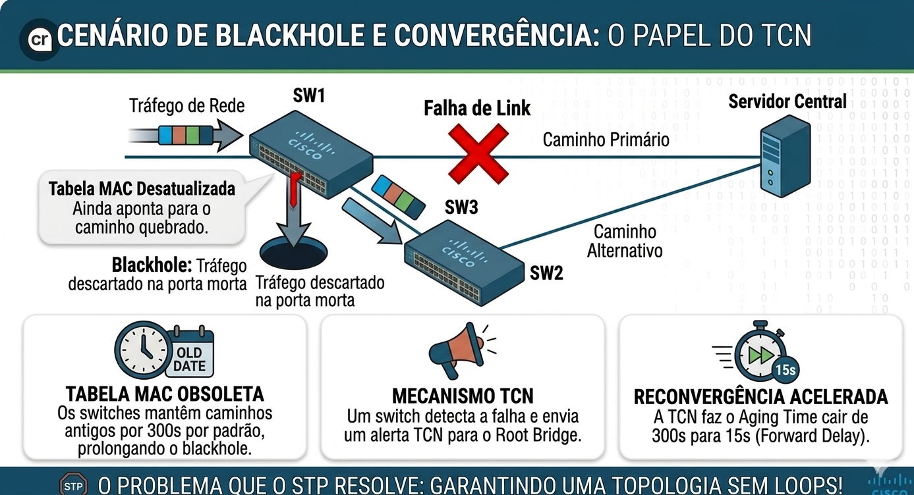
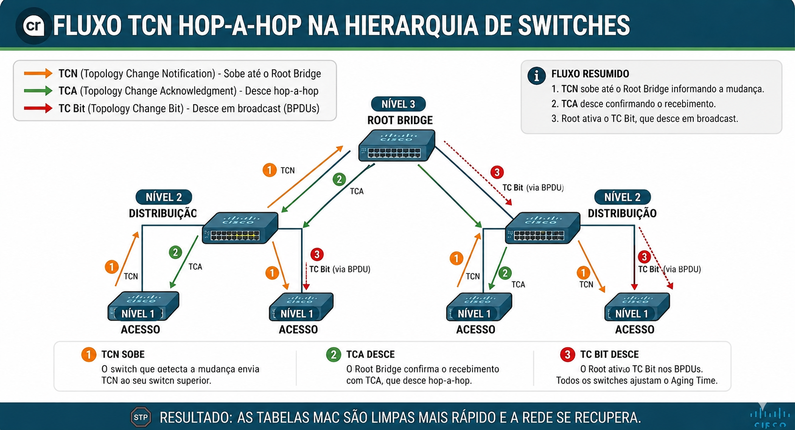
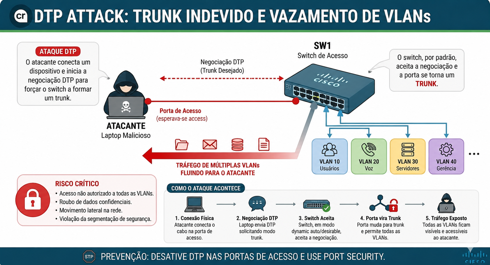
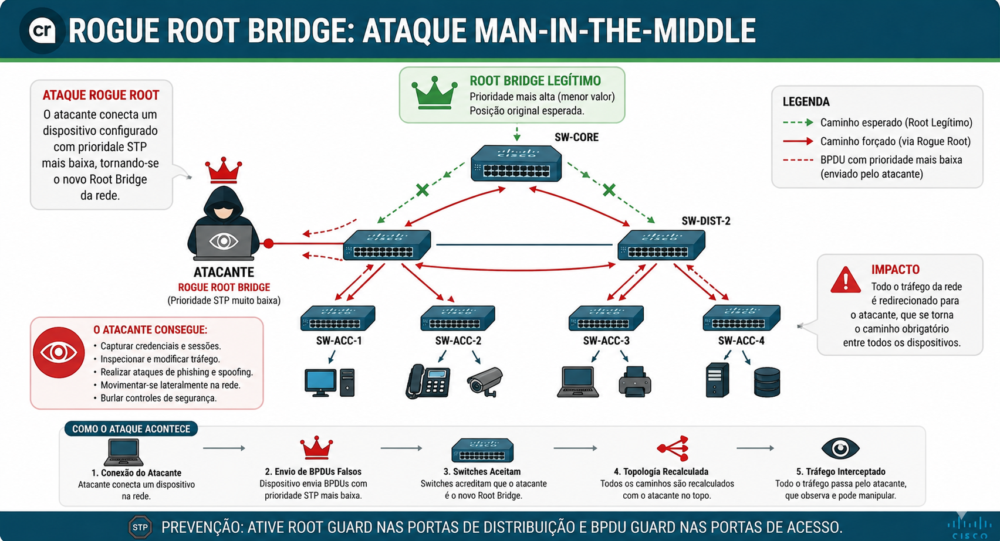
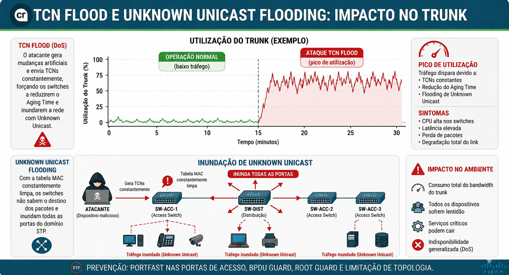
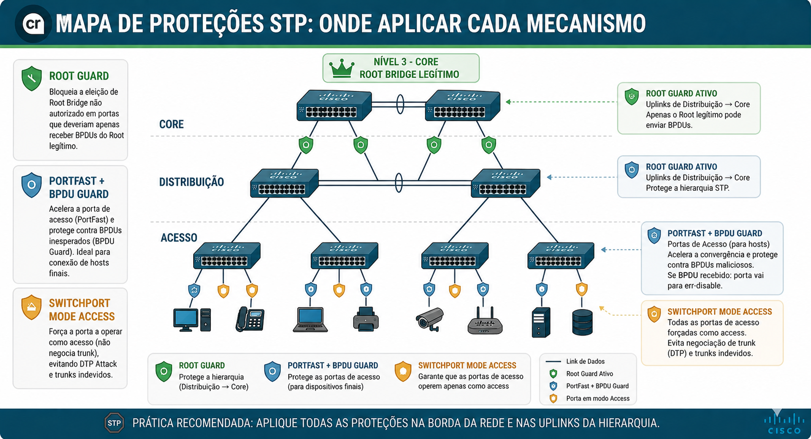
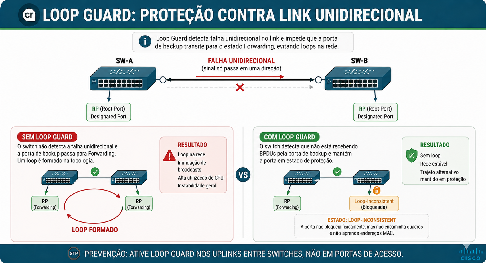
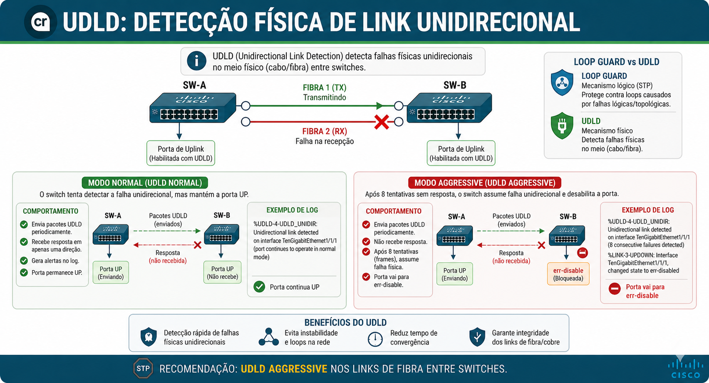
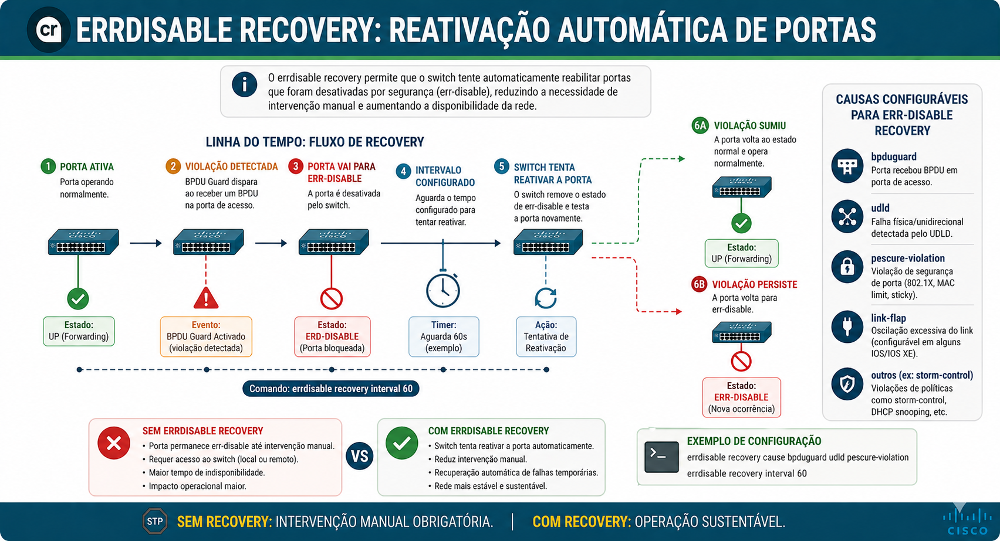
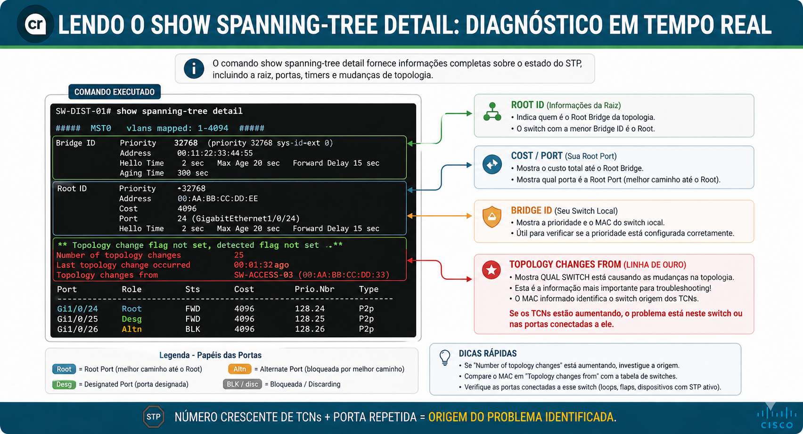

# 🛡️ Arquivo 10 — STP: Topology Change Notification (TCN) e Segurança

---

## 📌 Sumário

- [🛡️ Arquivo 10 — STP: Topology Change Notification (TCN) e Segurança](#️-arquivo-10--stp-topology-change-notification-tcn-e-segurança)
  - [📌 Sumário](#-sumário)
  - [🎯 Objetivo do Documento](#-objetivo-do-documento)
  - [🏗️ Contexto: Por Que o STP Não Termina na Convergência](#️-contexto-por-que-o-stp-não-termina-na-convergência)
  - [📖 Glossário Técnico](#-glossário-técnico)
  - [📖 Como Este Documento Deve Ser Lido](#-como-este-documento-deve-ser-lido)
  - [🔄 Topology Change Notification (TCN)](#-topology-change-notification-tcn)
    - [O Problema: A Tabela MAC Mentiu](#o-problema-a-tabela-mac-mentiu)
    - [O Fluxo Completo de Mensagens TCN](#o-fluxo-completo-de-mensagens-tcn)
    - [A Solução: Redução do Aging Time](#a-solução-redução-do-aging-time)
  - [⚠️ Riscos de Segurança no STP](#️-riscos-de-segurança-no-stp)
    - [Ataque 1 — DTP Attack (Trunk Indevido)](#ataque-1--dtp-attack-trunk-indevido)
    - [Ataque 2 — Rogue Root Bridge](#ataque-2--rogue-root-bridge)
    - [Ataque 3 — TCN Flood (DoS)](#ataque-3--tcn-flood-dos)
  - [🛡️ Mecanismos de Proteção Cisco](#️-mecanismos-de-proteção-cisco)
    - [Lógica de Aplicação](#lógica-de-aplicação)
    - [Loop Guard — Proteção Contra Falhas Unidirecionais de Link](#loop-guard--proteção-contra-falhas-unidirecionais-de-link)
    - [UDLD — Detecção de Link Unidirecional](#udld--detecção-de-link-unidirecional)
    - [Loop Guard vs. UDLD — Qual é a Diferença?](#loop-guard-vs-udld--qual-é-a-diferença)
    - [Comandos Para Loop Guard e UDLD](#comandos-para-loop-guard-e-udld)
  - [⚙️ Ajustes Finos e Recomendações](#️-ajustes-finos-e-recomendações)
    - [errdisable Recovery — Recuperação Automática de Portas Bloqueadas](#errdisable-recovery--recuperação-automática-de-portas-bloqueadas)
    - [Lendo o Output do show spanning-tree detail](#lendo-o-output-do-show-spanning-tree-detail)
  - [💻 Comandos de Verificação e Configuração](#-comandos-de-verificação-e-configuração)
    - [Proteção de Borda](#proteção-de-borda)
    - [Proteção de Hierarquia](#proteção-de-hierarquia)
    - [Prevenção de DTP Attack](#prevenção-de-dtp-attack)
    - [Diagnóstico e Troubleshooting](#diagnóstico-e-troubleshooting)
    - [Verificação de Root Guard](#verificação-de-root-guard)
  - [📋 Resumo](#-resumo)
  - [🧪 Pronto para Testar seu Conhecimento?](#-pronto-para-testar-seu-conhecimento)

---

## 🎯 Objetivo do Documento

Este documento detalha o mecanismo de atualização das tabelas de endereços MAC após uma mudança na rede e explora as vulnerabilidades inerentes ao protocolo STP, apresentando as melhores práticas de endurecimento (*hardening*) para garantir que a topologia lógica permaneça sob controle do administrador.

---

## 🏗️ Contexto: Por Que o STP Não Termina na Convergência

Imagine que você mora em um edifício e decide mudar de apartamento. Os entregadores ainda têm o seu endereço antigo na memória. Você se mudou, mas os pacotes continuam chegando na porta errada.  
  
Em redes de computadores, a mesma situação acontece. Quando o STP redefine quais portas estão ativas após uma falha, os switches continuam com uma **tabela de endereços MAC desatualizada**. Eles sabem *para onde enviar os dados* com base em um mapa antigo — e esse mapa está errado.
  
A convergência do STP reposiciona as portas fisicamente. Mas a **inteligência lógica da rede** — a tabela MAC — precisa ser sincronizada com essa nova realidade. Sem isso, os pacotes vão parar em **buracos negros** (*Blackholes*): portas que não levam mais a lugar nenhum.
  
O mecanismo de **Topology Change Notification (TCN)** existe exatamente para resolver isso.
  
---
  
## 📖 Glossário Técnico

| **Termo**                                | **O que significa na prática**                                                                                          |
|:---                                      |:---                                                                                                                     |
| **TCN** *(Topology Change Notification)* | Aviso enviado por um switch ao Root dizendo: "Algo mudou aqui."                                                         |
| **TCA** *(TC Acknowledgment)*            | Confirmação de recebimento do TCN, enviada hop-a-hop de volta ao remetente.                                             |
| **TC Bit** *(Topology Change Bit)*       | Sinal embutido nos BPDUs do Root que ordena: "Todos limpem a tabela MAC agora."                                         |
| **Aging Time**                           | Tempo que um endereço MAC fica guardado na tabela CAM antes de expirar. Padrão: **300 segundos**.                       |
| **BPDU Guard**                           | Proteção que desliga a porta imediatamente se receber qualquer BPDU inesperado.                                         |
| **Root Guard**                           | Proteção que bloqueia a porta se ela tentar eleger um Root Bridge não autorizado.                                       |
| **Loop Guard**                           | Proteção que impede uma porta bloqueada de transitar para *Forwarding* quando os BPDUs param de chegar — ela vai para o estado `loop-inconsistent` em vez de abrir um loop. |
| **UDLD** *(Unidirectional Link Detection)* | Protocolo Cisco que detecta falhas físicas de bidirecionalidade no cabo ou fibra, verificando se os dois lados do link conseguem transmitir e receber. |
| **PortFast**                             | Acelerador de convergência para portas de acesso: coloca direto em *Forwarding* e suprime TCNs.                         |
| **err-disable**                          | Estado de desligamento forçado de uma porta pelo switch após violação de segurança.                                     |
| **loop-inconsistent**                    | Estado de bloqueio aplicado pelo Loop Guard quando BPDUs param de chegar em uma porta que deveria recebê-los. A porta se recupera automaticamente quando os BPDUs voltam. |
| **undetermined**                         | Estado reportado pelo UDLD Normal quando ele detecta assimetria no link mas não encerra a porta — registra o alerta e aguarda. |

---

## 📖 Como Este Documento Deve Ser Lido

1. **Entenda o TCN:** Primeiro, compreenda por que a mudança física exige uma limpeza lógica (Tabela MAC).
2. **Analise o Fluxo:** Siga a hierarquia de mensagens do switch local até o Root.
3. **Estude as Ameaças:** Veja como o STP pode ser manipulado por atacantes.
4. **Aplique Proteções:** Conheça os mecanismos de *Guard* para proteção de borda e hierarquia.
5. **Proteja o Físico:** Entenda como Loop Guard e UDLD cobrem falhas que o STP não consegue detectar sozinho.

---

## 🔄 Topology Change Notification (TCN)

### O Problema: A Tabela MAC Mentiu

Antes de entender a solução, é preciso entender o problema com precisão.
  
A **tabela MAC** (também chamada de tabela CAM) é o "guia de endereços" de cada switch. Ela registra: *"O dispositivo com o endereço MAC X está acessível pela Porta Y."* Toda vez que um frame chega, o switch atualiza esse registro.
  
O problema surge quando a topologia física muda:
  
- O **link principal cai**.
- O STP ativa o **link de backup**.
- Agora, o dispositivo que antes era alcançado pela Porta A está sendo alcançado pela Porta B.
- Mas a tabela MAC ainda diz: *"Porta A."*
  
O switch envia os dados para a Porta A. A Porta A não tem mais caminho. Os dados desaparecem.
  
**O Aging Time padrão é de 300 segundos (5 minutos).** Esperar esse tempo para que o switch "esqueça" o endereço antigo e reaprendesse pelo novo caminho é inaceitável em uma rede corporativa. Cinco minutos de interrupção significa reuniões perdidas, transações canceladas, VoIP caído.



---

### O Fluxo Completo de Mensagens TCN

O TCN segue uma hierarquia precisa. Veja cada etapa:

- **Etapa 1 — Detecção local**

Um switch detecta uma transição de link: uma porta que estava em *Forwarding* vai para *Down*, ou o contrário. Essa é a "gatilho" do processo.
  
- **Etapa 2 — Geração do BPDU de TCN**
  
O switch afetado gera um **BPDU especial de TCN** e o envia exclusivamente pela sua **Root Port** — a porta que aponta em direção ao Root Bridge. O TCN não é enviado para toda a rede; ele sobe a hierarquia.

- **Etapa 3 — Confirmação Hop-a-Hop (TCA)**
  
O switch vizinho que recebe o TCN:
  
1. Responde com um **TCA** (TC Acknowledgment) de volta para o remetente, confirmando o recebimento.
2. Replica o TCN para cima pela sua própria Root Port, em direção ao Root Bridge.
  
Esse processo se repete em cada hop até o Root.
  
- **Etapa 4 — Ação do Root Bridge**

Ao receber o TCN, o Root Bridge assume o controle. Ele começa a enviar **BPDUs de configuração regulares** com o **Bit TC setado** para **toda a rede**. Esse processo dura por um período igual a `Max Age + Forward Delay` (geralmente 35 segundos: 20s + 15s).
  
- **Etapa 5 — Limpeza distribuída**
  
Todos os switches da rede recebem os BPDUs com o TC Bit ativo e executam a ação:
  
> *Reduza o Aging Time da sua tabela MAC de 300 segundos para 15 segundos.*

Isso força uma **reaprendizagem acelerada e distribuída** dos endereços MAC. Os switches "esquecem" os caminhos antigos rapidamente e reaprendem os novos à medida que o tráfego real circula.



---

### A Solução: Redução do Aging Time

O mecanismo é elegante porque evita dois extremos problemáticos:

- **Flush total imediato** causaria uma tempestade de Unknown Unicast Flooding em toda a rede ao mesmo tempo, sobrecarregando os trunks.
- **Esperar 300 segundos** causaria minutos de blackholes e interrupção de serviço.

A redução para **15 segundos (Forward Delay)** é um meio-termo calculado: rápido o suficiente para eliminar rotas inválidas, gradual o suficiente para não gerar sobrecarga simultânea.

```bash
Aging Time Normal:    [████████████████████████████████████] 300s
Aging Time com TC:    [████] 15s
                       ↑
                  Reaprendizagem forçada

```

---

## ⚠️ Riscos de Segurança no STP

O STP foi projetado em uma época em que **confiança entre dispositivos de rede era um pressuposto**, não uma exceção. Qualquer dispositivo que envie BPDUs tem o poder de alterar a topologia da rede inteira. Esse é o problema fundamental.

---

### Ataque 1 — DTP Attack (Trunk Indevido)

**O que é:** Um atacante conecta um switch não autorizado (*Rogue Switch*) em uma porta de acesso comum. Usando o protocolo DTP (*Dynamic Trunking Protocol*), ele negocia automaticamente um trunk com o switch legítimo.

**O que acontece:**

- Com um trunk estabelecido, o atacante passa a receber tráfego de **todas as VLANs** configuradas naquele trunk.
- A partir daí, ele pode injetar BPDUs na rede e tentar se tornar o Root Bridge.

**Analogia:** É como alguém que consegue acesso ao corredor de um prédio e passa a ver a correspondência de todos os apartamentos.



---

### Ataque 2 — Rogue Root Bridge

**O que é:** Um computador executando software de ataque (como Yersinia) envia BPDUs com **prioridade 0** — o valor mais baixo possível, que garante vitória na eleição de Root Bridge.

**O que acontece:**

1. O switch legítimo recebe um BPDU "superior" ao do Root Bridge atual.
2. O STP reconhece o atacante como o novo Root Bridge.
3. **Todo o tráfego da rede é redirecionado pelo dispositivo do atacante.**
4. O atacante executa um ataque de **Man-in-the-Middle**: ele vê, registra e potencialmente modifica todo o tráfego da empresa.

**Impacto:** Confidencialidade zero. Senhas, dados financeiros, conversas internas — tudo passa pelo atacante.



---

### Ataque 3 — TCN Flood (DoS)

**O que é:** Um dispositivo provoca oscilação contínua do estado de um link (*flapping*) ou envia TCNs falsos em alta frequência.

**O que acontece:**

- Os switches recebem TCNs constantemente e ficam reduzindo o Aging Time repetidamente.
- As tabelas MAC são limpas com altíssima frequência.
- Sem endereços MAC aprendidos, os switches passam a fazer **Unknown Unicast Flooding**: enviam todo frame desconhecido para **todas as portas** do switch.
- Os trunks ficam saturados com tráfego desnecessário.
- A rede experimenta **picos de utilização**, latência alta e possível interrupção de serviços.

**Impacto:** Ataque de negação de serviço (DoS) distribuído dentro da própria rede interna.



---

## 🛡️ Mecanismos de Proteção Cisco

Cada ataque descrito acima tem um mecanismo de proteção correspondente. A defesa em profundidade exige **múltiplas camadas**:

| **Mecanismo**                | **Onde Aplicar**                                           | **O Que Faz**                            | **Ameaça Mitigada**                   |
|:---                          |:---                                                        |:---                                      |:---                                   |
| **`switchport mode access`** | Toda porta de acesso                                       | Desativa DTP, impede negociação de trunk | DTP Attack                            |
| **BPDU Guard**               | Portas com PortFast                                    | Coloca porta em `err-disable` se receber qualquer BPDU | Rogue Root Bridge via borda |
| **Root Guard**               | Portas de distribuição/acesso que não devem ser Root Ports | Move a porta para `root-inconsistent` (bloqueio) se receber BPDU superior | Rogue Root Bridge via core |
| **PortFast**                 | Portas conectadas apenas a hosts finais | Vai direto para *Forwarding*, **não gera TCNs** quando o host liga/desliga | TCN Flood              |

### Lógica de Aplicação

**BPDU Guard** protege a borda. Nenhum host final deve enviar BPDUs. Se enviar, é um dispositivo não autorizado — a porta desliga imediatamente.

**Root Guard** protege a hierarquia. Você define quais portas *jamais* devem levar a um Root Bridge. Se um BPDU superior chegar por ali, a porta é bloqueada — mas não desligada. Ela volta ao normal automaticamente quando os BPDUs superiores param de chegar.

**PortFast** reduz ruído operacional. Cada vez que um computador liga ou desliga, sem PortFast, o switch gera um TCN e dispara a limpeza das tabelas MAC de toda a rede — desnecessariamente. Com PortFast, isso não acontece.



---

### Loop Guard — Proteção Contra Falhas Unidirecionais de Link

**O que é:** Uma porta STP em estado *Blocking* recebe BPDUs continuamente do switch vizinho. Se esses BPDUs param de chegar — por qualquer motivo — o STP interpreta o silêncio como uma falha de topologia e promove a porta para *Forwarding*. Em um link saudável, isso é correto. Em um link com falha unidirecional, é um desastre.
  
**O problema sem Loop Guard:**
  
Um link pode perder a capacidade de *receber* pacotes enquanto ainda consegue *transmitir*. O switch local para de receber BPDUs do vizinho, mas o vizinho ainda recebe os BPDUs do switch local. O STP, sem informação suficiente para distinguir as duas situações, assume que o vizinho sumiu da topologia e transiciona a porta bloqueada para *Forwarding*.
  
- A porta que estava bloqueada entra em *Forwarding*.
- Um loop de camada 2 se forma silenciosamente.
- O tráfego começa a circular em loop até saturar os links.
  
**Analogia:** É como um semáforo que, ao perder a comunicação com a central de controle, decide que o sinal está verde para todos — sem saber que os outros semáforos do cruzamento continuam funcionando normalmente.
  
**O que o Loop Guard faz:**
  
Em vez de transicionar a porta para *Forwarding* quando os BPDUs param, o Loop Guard move a porta para um estado especial chamado **`loop-inconsistent`**. A porta permanece bloqueada e gera um log de alerta. Quando os BPDUs voltam a chegar, a porta sai do estado *loop-inconsistent* automaticamente e retoma o processo STP normal.
  
> O Loop Guard **não desliga a porta**. Ele a mantém bloqueada e aguarda os BPDUs voltarem — comportamento muito mais seguro do que promovê-la a Forwarding.
  
**Onde aplicar:** Portas que são candidatas a Root Port ou Designated Port — ou seja, links entre switches na hierarquia (uplinks de acesso → distribuição, distribuição → core). Nunca em portas conectadas a hosts finais.
  
**Incompatibilidade importante:** Loop Guard e Root Guard são mutuamente exclusivos na mesma porta. Root Guard protege contra BPDUs superiores *chegando*. Loop Guard protege contra BPDUs *parando de chegar*. Aplicar os dois na mesma interface gera conflito — o switch desativa o Loop Guard automaticamente se Root Guard estiver ativo naquela porta.
  


---

### UDLD — Detecção de Link Unidirecional
  
**O que é:** O UDLD (*Unidirectional Link Detection*) é um protocolo proprietário Cisco que opera na camada 2 para detectar fisicamente se um link está funcionando nas duas direções.
  
**Por que o STP não é suficiente:**
  
O STP detecta falhas de topologia, não falhas físicas de direção. Um cabo de fibra com uma das fibras danificadas — transmissão funcionando, recepção quebrada — não é detectado automaticamente pelo STP. O switch vê o link como *up* porque ainda consegue transmitir. Mas não recebe nada.
  
O UDLD resolve isso de forma direta: os dois switches nas pontas do link trocam mensagens periódicas com suas próprias identidades. Cada switch confirma que está recebendo mensagens do vizinho. Se um lado para de receber, o UDLD detecta a assimetria — e age.
  
**Dois modos de operação:**
  
- **Normal:** Ao detectar o link unidirecional, o UDLD registra um alerta no syslog e marca a porta como *undetermined*, mas não a desliga. Adequado para ambientes onde a disponibilidade do link é mais crítica do que a garantia de bidirecionalidade.
  
- **Aggressive:** Ao detectar que o vizinho parou de responder, o UDLD tenta reestabelecer comunicação enviando 8 mensagens em 1 segundo. Se não houver resposta, coloca a porta em **`err-disable`** imediatamente. Recomendado para links de fibra em backbones críticos, onde um link unidirecional é sempre um problema grave.
  
**Analogia:** É como dois walkie-talkies que periodicamente dizem "aqui base, você me ouve?" ao invés de simplesmente assumir que o canal está livre porque conseguem transmitir.
  
**Onde aplicar:** Links ponto a ponto entre switches — especialmente fibras ópticas, onde falhas unidirecionais são mais comuns do que em cobre. Não se aplica a hubs ou meios compartilhados.
  

  
---
  
### Loop Guard vs. UDLD — Qual é a Diferença?
  
Os dois protocolos protegem contra problemas de link unidirecional, mas atuam em camadas diferentes e se complementam:
  
| **Aspecto**               | **Loop Guard**                                              | **UDLD**                                                       |
|:---                       |:---                                                         |:---                                                            |
| **Camada de atuação**     | Lógica — monitora o fluxo de BPDUs do STP                   | Física — monitora bidirecionalidade do link em si              |
| **O que detecta**         | Ausência de BPDUs em porta bloqueada                        | Falha física de recepção ou transmissão no cabo                |
| **Ação ao detectar**      | Porta vai para `loop-inconsistent` (permanece bloqueada)    | Normal: alerta no log / Aggressive: porta vai para err-disable |
| **Recuperação**           | Automática quando BPDUs voltam                              | Manual (shutdown/no shutdown) ou com errdisable recovery       |
| **Onde aplicar**          | Uplinks entre switches (Root/Designated Ports)              | Links ponto a ponto entre switches, especialmente fibras       |
| **Exclusão com outros**   | Incompatível com Root Guard na mesma porta                  | Compatível com Loop Guard — uso simultâneo é recomendado       |

> **Recomendação de produção:** Use Loop Guard e UDLD Aggressive juntos nos links entre switches. Loop Guard atua na lógica do STP; UDLD atua no físico do cabo. Os dois juntos eliminam praticamente toda a superfície de ataque de links unidirecionais.

### Comandos Para Loop Guard e UDLD

```bash
! Ativar Loop Guard globalmente (todas as portas elegíveis automaticamente)
spanning-tree loopguard default

! Ativar Loop Guard em uma interface específica
interface GigabitEthernet0/1
 spanning-tree guard loop

! Ativar UDLD Normal globalmente (recomendado para fibras)
udld enable

! Ativar UDLD Aggressive globalmente (recomendado para backbones críticos)
udld aggressive

! Ativar UDLD Aggressive em uma interface específica
interface GigabitEthernet0/1
 udld port aggressive

! Verificar estado do UDLD e vizinhos detectados
show udld neighbors

! Verificar estado do UDLD em uma interface específica
show udld interface GigabitEthernet0/1

! Resetar manualmente portas em err-disable causadas pelo UDLD
udld reset

! Verificar portas em loop-inconsistent (Loop Guard atuando)
show spanning-tree inconsistentports
```

## ⚙️ Ajustes Finos e Recomendações

**Desativar DTP em todas as portas de acesso** é a recomendação mais básica e mais frequentemente ignorada. O comando `switchport mode access` deve ser aplicado como política padrão, não como exceção.

**BackboneFast e UplinkFast** são extensões proprietárias Cisco para o 802.1D clássico que aceleram a convergência em cenários específicos. Em redes modernas com RSTP (802.1w) ou MSTP (802.1s), esses recursos são incorporados ao protocolo e não precisam ser configurados separadamente.

**VSS e StackWise** são tecnologias que unificam o plano de controle de múltiplos switches físicos em um único plano lógico. Ao eliminar topologias redundantes no nível de camada 2, elas reduzem drasticamente a dependência do STP — que passa a ser um protocolo de borda, não de core.

**RSTP (802.1w)** deve ser o mínimo em qualquer rede nova. A convergência cai de 30–50 segundos para menos de 2 segundos. O TCN continua existindo, mas o processo é muito mais eficiente.

### errdisable Recovery — Recuperação Automática de Portas Bloqueadas
  
**O problema sem errdisable recovery:**
  
Quando o BPDU Guard ou o UDLD Aggressive colocam uma porta em `err-disable`, ela permanece desligada indefinidamente até que um administrador entre na interface e execute `shutdown` seguido de `no shutdown` manualmente. Em ambientes com muitas portas de acesso — ou com falhas intermitentes — isso gera sobrecarga operacional e tempo de inatividade desnecessário.
  
**O que o errdisable recovery faz:**
  
Configura o switch para tentar reativar automaticamente portas em `err-disable` após um intervalo de tempo definido. Se a causa da violação não existir mais quando a porta for reativada, ela volta ao estado normal. Se a violação persistir, a porta volta para `err-disable` imediatamente.
  
> O errdisable recovery **não elimina a proteção** — ele a torna operacionalmente sustentável. A porta ainda desliga ao detectar a violação; ela apenas tenta se recuperar sozinha após o intervalo configurado.

**Causas configuráveis individualmente:** É possível ativar o recovery automático apenas para causas específicas, mantendo o bloqueio permanente para outras. Por exemplo: recovery automático para BPDU Guard (que pode ser disparado por um hub mal conectado temporariamente), mas sem recovery para `psecure-violation` (violação de Port Security), que exige intervenção humana.

```bash
! Verificar quais causas de err-disable estão configuradas no switch
show errdisable detect

! Verificar quais portas estão em err-disable e por qual motivo
show errdisable recovery

! Ativar recovery automático para bpduguard (intervalo padrão: 300s)
errdisable recovery cause bpduguard

! Ativar recovery automático para UDLD
errdisable recovery cause udld

! Ajustar o intervalo de tentativa de recovery (em segundos)
errdisable recovery interval 60

! Verificar estado atual de todas as portas em err-disable
show interfaces status err-disabled
```



---

### Lendo o Output do show spanning-tree detail

O comando `show spanning-tree detail` é a principal ferramenta de diagnóstico do STP. Saber interpretar seu output é tão importante quanto saber configurar as proteções.

**Output simulado e anotado:**

```
VLAN0001
  Spanning tree enabled protocol ieee
  Root ID    Priority    24577
             Address     0001.C9A3.5B2D
             Cost        4
             Port        1 (GigabitEthernet0/1)
             Hello Time   2 sec  Max Age 20 sec  Forward Delay 15 sec

  Bridge ID  Priority    32769  (priority 32768 sys-id-ext 1)
             Address     00D0.D3DC.2825
             Hello Time   2 sec  Max Age 20 sec  Forward Delay 15 sec
             Aging Time  300

 GigabitEthernet0/1 of VLAN0001 is Root Forwarding
   Port info             port id          128.1    priority    128  cost      4
   Designated root has   priority    24577   address   0001.C9A3.5B2D
   Designated bridge has priority    32769   address   00D0.D3DC.2825
   Number of topology changes 3 last change occurred 0:02:15 ago
           from GigabitEthernet0/2

 GigabitEthernet0/2 of VLAN0001 is Altn Blocking
   Port info             port id          128.2    priority    128  cost      4
   Number of topology changes 3 last change occurred 0:02:15 ago
```

**O que cada linha revela:**

- `Root ID Priority 24577` — O Root Bridge desta VLAN tem prioridade 24577. Verifique se este é o switch esperado. Prioridade inesperadamente baixa pode indicar Rogue Root Bridge.

- `Cost 4 / Port GigabitEthernet0/1` — Este switch chega ao Root com custo 4 através da Gi0/1. Essa é a Root Port.

- `Bridge ID Priority 32769` — A prioridade deste switch é 32768 + 1 (sys-id-ext da VLAN 1). Valor padrão sem ajuste manual.

- `Number of topology changes 3 last change occurred 0:02:15 ago from GigabitEthernet0/2` — **Esta linha é ouro para troubleshooting.** Indica quantas mudanças de topologia ocorreram e qual porta as originou. Um número alto e crescente de TCNs nesta linha aponta diretamente para a causa de instabilidade.

- `Altn Blocking` — Porta alternativa no estado de bloqueio. Estado saudável para redundância.

```bash
! Filtrar apenas as linhas de mudanças de topologia em todos os VLANs
show spanning-tree detail | include from|occur|change

! Ver o estado detalhado de uma interface específica
show spanning-tree interface GigabitEthernet0/1 detail

! Verificar portas em estado inconsistente (Loop Guard ou Root Guard atuando)
show spanning-tree inconsistentports
```

> **Dica de troubleshooting:** Se `Number of topology changes` estiver aumentando continuamente, execute `show spanning-tree detail` duas vezes com intervalo de 30 segundos e compare o campo `from`. A porta que aparece repetidamente é a origem do problema — verifique o dispositivo conectado a ela.



---

## 💻 Comandos de Verificação e Configuração

### Proteção de Borda

```bash
! Ativar PortFast globalmente em todas as portas de acesso
spanning-tree portfast default

! Ativar BPDU Guard globalmente (para todas as portas com PortFast)
spanning-tree portfast bpduguard default

! Ativar manualmente em uma interface específica
interface GigabitEthernet0/1
 spanning-tree portfast
 spanning-tree bpduguard enable
```

### Proteção de Hierarquia

```bash
! Root Guard em interface que não deve ser Root Port
interface GigabitEthernet0/2
 spanning-tree guard root
```

### Prevenção de DTP Attack

```bash
! Desativar negociação de trunk em porta de acesso
interface GigabitEthernet0/3
 switchport mode access
 switchport access vlan 10
```

### Diagnóstico e Troubleshooting

```bash
! Verificar estado do STP e se há Topology Change ativo
show spanning-tree detail | include from|occurrence

! Ver quais portas geraram TCNs e quantas vezes
show spanning-tree detail

! Ver o estado de cada proteção por interface
show spanning-tree interface GigabitEthernet0/1 detail

! Ver portas em err-disable (BPDU Guard ativado)
show interfaces status err-disabled

! Limpar tabela MAC manualmente (use com cautela em produção)
clear mac address-table dynamic

! Reativar porta em err-disable após corrigir a causa
interface GigabitEthernet0/1
 shutdown
 no shutdown
```

### Verificação de Root Guard

```bash
! Porta em root-inconsistent indica que Root Guard atuou
show spanning-tree inconsistentports
```

---

## 📋 Resumo

> *Para quem precisa entender o documento em 90 segundos.*

O STP garante que a rede não tenha loops. Mas quando a topologia muda, os switches ficam com mapas de endereços desatualizados. O mecanismo de **TCN** resolve isso: o switch que detectou a mudança avisa o Root Bridge, que ordena uma limpeza acelerada das tabelas MAC em toda a rede — reduzindo o tempo de expiração de 5 minutos para 15 segundos.

O problema maior é que o STP foi projetado para confiar em qualquer dispositivo que envie BPDUs. Isso abre três vetores de ataque: formação de trunks não autorizados (DTP Attack), sequestro do Root Bridge (Man-in-the-Middle) e inundação de TCNs falsos (DoS).

A Cisco oferece cinco mecanismos de defesa complementares: **BPDU Guard** (desliga a porta se receber BPDU inesperado), **Root Guard** (bloqueia quem tenta se tornar Root não autorizado), **PortFast** (suprime TCNs desnecessários em portas de hosts), **Loop Guard** (mantém portas bloqueadas quando BPDUs param de chegar, prevenindo loops por falha unidirecional lógica) e **UDLD** (detecta falhas físicas de bidirecionalidade no cabo antes que o STP perceba).
  
**Competências demonstradas neste documento:** STP hardening, análise de vetores de ataque L2, proteção contra falhas unidirecionais (Loop Guard e UDLD), troubleshooting de convergência com leitura de output CLI, documentação técnica multi-audiência.

---

## 🧪 Pronto para Testar seu Conhecimento?

Antes de partir para o laboratório, valide sua compreensão teórica com os simulados:

- **Simulados temáticos (10 questões / 10 min cada):**  
  1 - [TCN, Segurança e Proteções Cisco (802.1D))](https://alcancil.github.io/Cisco/CCNP%20350-401%20ENCOR/03%20-%20Infrastructure/02%20-%20STP%20(Spanning%20Tree%20Protocol)/10%20-%20Revisao10/Arquivos/Simulado/01.html)  
  2 - [Loop Guard, UDLD, Ataques e Hardening (802.1D)](https://alcancil.github.io/Cisco/CCNP%20350-401%20ENCOR/03%20-%20Infrastructure/02%20-%20STP%20(Spanning%20Tree%20Protocol)/10%20-%20Revisao10/Arquivos/Simulado/02.html)  
  3 - [Comandos, Troubleshooting e Boas Práticas (802.1D)](https://alcancil.github.io/Cisco/CCNP%20350-401%20ENCOR/03%20-%20Infrastructure/02%20-%20STP%20(Spanning%20Tree%20Protocol)/10%20-%20Revisao10/Arquivos/Simulado/03.html)  
  4 - [Cenários, Analogias e Decisões de Projeto (802.1D)](https://alcancil.github.io/Cisco/CCNP%20350-401%20ENCOR/03%20-%20Infrastructure/02%20-%20STP%20(Spanning%20Tree%20Protocol)/10%20-%20Revisao10/Arquivos/Simulado/04.html)  
  5 - [Comandos Avançados, Output CLI e Defesa em Profundidade (802.1D)](https://alcancil.github.io/Cisco/CCNP%20350-401%20ENCOR/03%20-%20Infrastructure/02%20-%20STP%20(Spanning%20Tree%20Protocol)/10%20-%20Revisao10/Arquivos/Simulado/01.html)  
  
- **Simulado completo STP:** [50 questões — 75 minutos](https://alcancil.github.io/Cisco/CCNP%20350-401%20ENCOR/03%20-%20Infrastructure/02%20-%20STP%20(Spanning%20Tree%20Protocol)/10%20-%20Revisao10/Arquivos/Simulado/completo.html)  
  
- **Seu desempenho consolidado:** [📊 Painel de Estatísticas](https://alcancil.github.io/Cisco/CCNP%20350-401%20ENCOR/03%20-%20Infrastructure/02%20-%20STP%20(Spanning%20Tree%20Protocol)/10%20-%20Revisao10/Arquivos/Simulado/dashboard.html)
