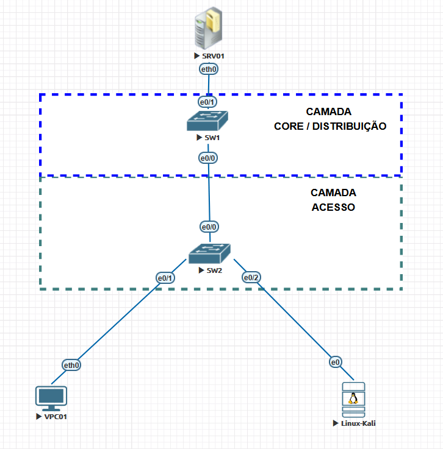
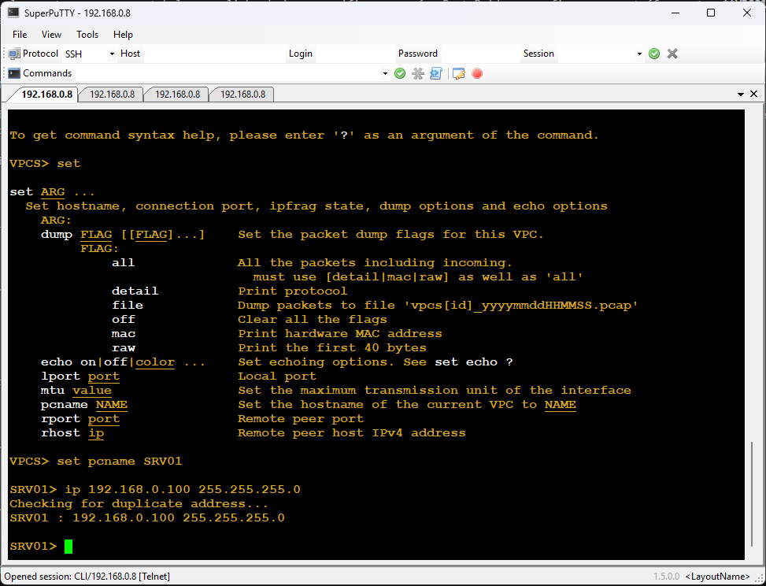
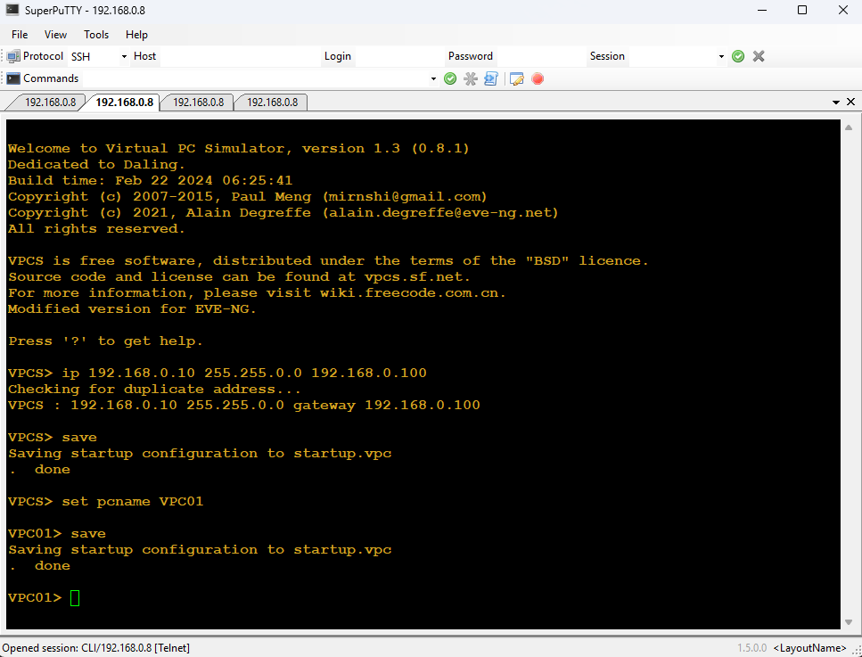
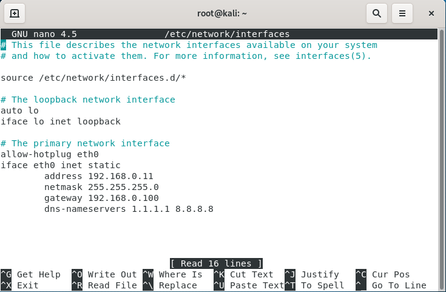
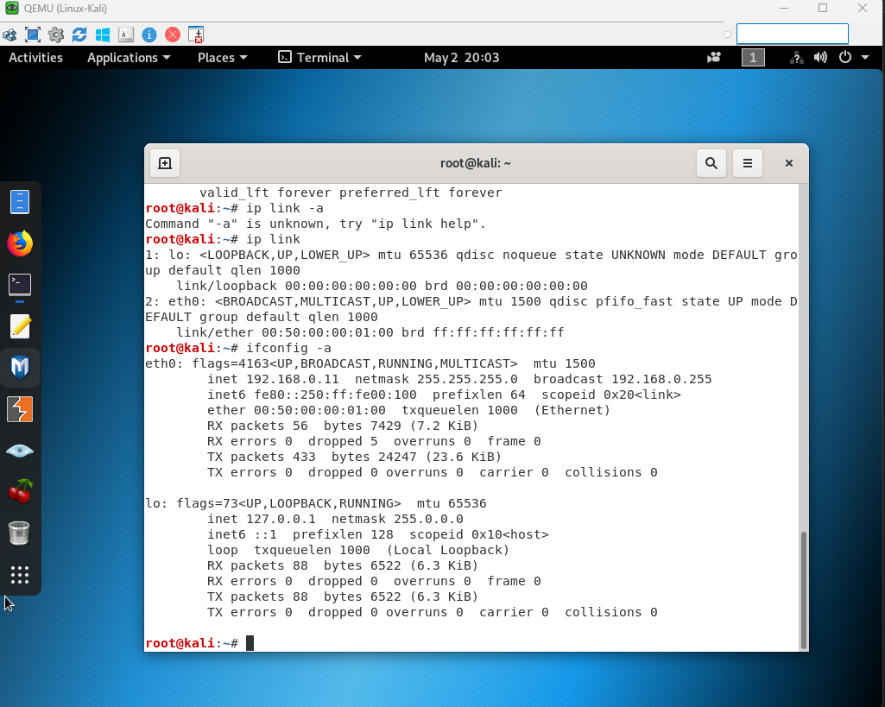
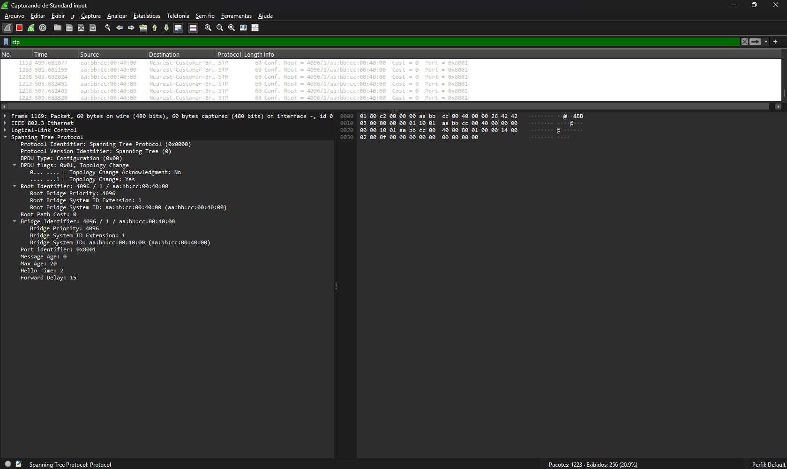
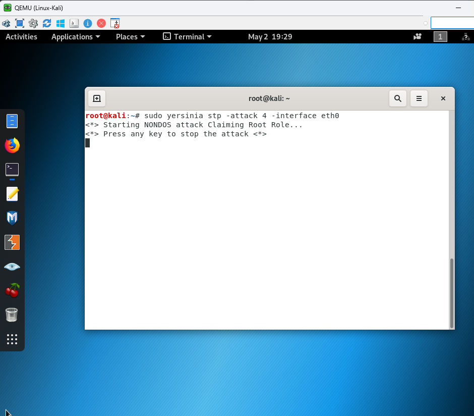
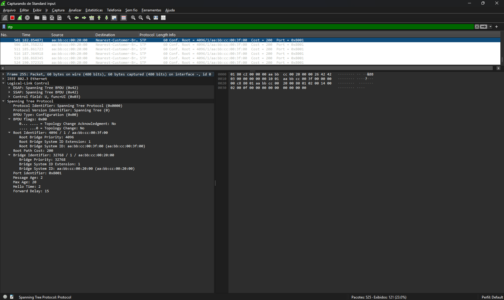
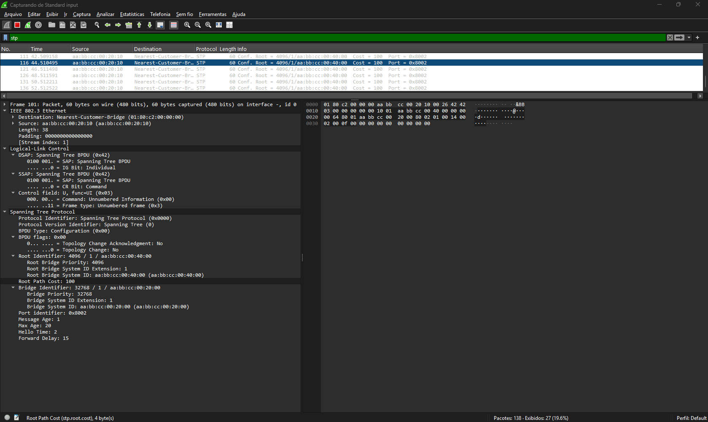

# 🧪 Arquivo 11 — STP na Prática: Proteções, Falhas e Defesa da Camada 2

---

## 📌 Sumário

- [🧪 Arquivo 11 — STP na Prática: Proteções, Falhas e Defesa da Camada 2](#-arquivo-11--stp-na-prática-proteções-falhas-e-defesa-da-camada-2)
  - [📌 Sumário](#-sumário)
  - [🎯 Objetivo do Documento](#-objetivo-do-documento)
  - [🏗️ Contexto: Por Que Este Laboratório Importa no Mercado](#️-contexto-por-que-este-laboratório-importa-no-mercado)
  - [📖 Glossário Técnico](#-glossário-técnico)
  - [🖥️ Ambiente de Laboratório](#️-ambiente-de-laboratório)
    - [Requisitos do EVE-NG](#requisitos-do-eve-ng)
  - [🧪 Laboratório 1 — PortFast e BPDU Guard](#-laboratório-1--portfast-e-bpdu-guard)
    - [Objetivo](#objetivo)
    - [Simulando o Ataque](#simulando-o-ataque)
    - [O que Observar](#o-que-observar)
    - [Cenário](#cenário)
    - [Endereçamento IP](#endereçamento-ip)
    - [Configurando os Endereços IP](#configurando-os-endereços-ip)
      - [SRV01 e VPC01](#srv01-e-vpc01)
      - [Kali Linux](#kali-linux)
    - [Configurando os Switches](#configurando-os-switches)
      - [SW1 — Root Bridge](#sw1--root-bridge)
      - [SW2 — Switch de Acesso](#sw2--switch-de-acesso)
    - [Parte 1 — Verificando a Linha de Base](#parte-1--verificando-a-linha-de-base)
      - [Verificando o Root Bridge](#verificando-o-root-bridge)
      - [Verificando a Conectividade — Ping Inicial](#verificando-a-conectividade--ping-inicial)
      - [Captura Wireshark — Estado Normal](#captura-wireshark--estado-normal)
    - [Parte 2 — Simulando o Ataque sem Proteção](#parte-2--simulando-o-ataque-sem-proteção)
      - [Instalando o Yersinia no Kali](#instalando-o-yersinia-no-kali)
      - [Executando o Ataque](#executando-o-ataque)
      - [Observando o Impacto no STP](#observando-o-impacto-no-stp)
      - [Captura Wireshark — Durante o Ataque](#captura-wireshark--durante-o-ataque)
    - [Impacto em produção](#impacto-em-produção)
    - [Parte 3 — Aplicando a Proteção (PortFast + BPDU Guard)](#parte-3--aplicando-a-proteção-portfast--bpdu-guard)
    - [🧠 Por que isso é importante?](#-por-que-isso-é-importante)
      - [Aplicando PortFast e BPDU Guard no SW2](#aplicando-portfast-e-bpdu-guard-no-sw2)
      - [Verificando a Proteção Aplicada](#verificando-a-proteção-aplicada)
    - [Parte 4 — Repetindo o Ataque com Proteção Ativa](#parte-4--repetindo-o-ataque-com-proteção-ativa)
      - [Verificando o Estado após o Ataque](#verificando-o-estado-após-o-ataque)
      - [Captura Wireshark — Com Proteção Ativa](#captura-wireshark--com-proteção-ativa)
    - [🛠️ Troubleshooting rápido](#️-troubleshooting-rápido)
    - [Recuperando a Porta](#recuperando-a-porta)
    - [Resumo do Laboratório 1](#resumo-do-laboratório-1)
  - [🔧 Padronização e Reprodutibilidade](#-padronização-e-reprodutibilidade)
    - [🔧 Pré-requisitos para Automação](#-pré-requisitos-para-automação)
    - [🌐 Configuração básica nos switches](#-configuração-básica-nos-switches)
    - [🐍 Script 1 — Backup de Configuração](#-script-1--backup-de-configuração)
    - [♻️ Script 2 — Restore de Configuração](#️-script-2--restore-de-configuração)
    - [🎯 Visão Geral](#-visão-geral)
    - [Arquivos de configuração Para Baixar](#arquivos-de-configuração-para-baixar)
  - [O que aprendemos com esse laboratório](#o-que-aprendemos-com-esse-laboratório)
  - [Habilidades adquiridas](#habilidades-adquiridas)

## 🎯 Objetivo do Documento

Este laboratório tem como objetivo consolidar, na prática, os principais mecanismos iniciais de proteção do Spanning Tree Protocol (STP) utilizados em ambientes Cisco.

Ao final deste documento, você será capaz de:

- Aplicar proteções como PortFast e BPDU Guard
- Entender o comportamento real da rede diante de falhas e ataques
- Correlacionar saída de comandos (`show`) com eventos no plano de controle
- Visualizar BPDUs e eventos de camada 2 utilizando o Wireshark
- Validar estados como *err-disable*

---

## 🏗️ Contexto: Por Que Este Laboratório Importa no Mercado

Em ambientes corporativos, a camada 2 ainda é uma das maiores fontes de incidentes críticos — não por falta de tecnologia, mas por **falhas de implementação, validação e proteção**.
  
Na prática, o que diferencia um ambiente estável de um ambiente problemático não é apenas conhecer o STP, mas saber:
  
- Como ele reage sob falha
- Como ele se comporta sob ataque
- Como prevenir impactos antes que eles ocorram
  
O mercado exige profissionais capazes de ir além da configuração básica. É esperado que você consiga:
  
- Identificar rapidamente a causa de instabilidades de camada 2
- Interpretar saídas de comandos sob pressão
- Correlacionar eventos entre dispositivos e captura de pacotes
- Aplicar proteções de forma estratégica, não apenas “por padrão”
  
> Em outras palavras: não basta saber configurar — é preciso saber **diagnosticar, prever e defender**.
  
Estes laboratórios foram desenhados exatamente com esse objetivo.
  
Aqui, você não está apenas configurando features, mas simulando situações reais como:
  
- Um usuário conectando um switch não autorizado na rede
- Um atacante tentando se eleger como Root Bridge
- Falhas físicas silenciosas que podem gerar loops
- Interfaces sendo desativadas automaticamente por mecanismos de proteção
  
Esses cenários são comuns em ambientes de produção e frequentemente aparecem em:
  
- Incidentes de rede (troubleshooting real)
- Entrevistas técnicas
- Provas práticas e certificações (como CCNP)
  
Ao executar estes laboratórios, você desenvolve uma habilidade crítica no mercado:
  
> **Pensar como a rede se comporta — e não apenas como ela foi configurada.**
  
Esse é o tipo de conhecimento que diferencia um operador de rede de um engenheiro capaz de sustentar ambientes críticos.
  
---

## 📖 Glossário Técnico

| **Termo**                            | **O que significa na prática**                                                                                                       |
| :---                                 | :---                                                                                                                                 |
| **EVE-NG**                           | Plataforma de emulação de redes que permite criar topologias realistas com dispositivos Cisco virtualizados[cite: 2].                |
| **Wireshark**                        | Ferramenta de análise de pacotes usada para visualizar BPDUs e mensagens de controle do STP[cite: 2].                                |
| **Yersinia**                         | Ferramenta ofensiva utilizada para simular ataques de camada 2, como envio de BPDUs falsos[cite: 2].                                 |
| **Netmiko**                          | Biblioteca Python para automação de conexões SSH em dispositivos de rede[cite: 1, 2].                                                |
| **err-disable**                      | Estado em que uma interface é automaticamente desativada por proteção de segurança[cite: 2].                                         |
| **loop-inconsistent**                | Estado em que uma porta é bloqueada pelo Loop Guard para evitar loops[cite: 2].                                                      |
| **root-inconsistent**                | Estado aplicado pelo Root Guard quando um switch tenta assumir o papel de Root indevidamente[cite: 2].                               |
| **BPDU (Bridge Protocol Data Unit)** | Quadros de controle trocados entre switches para eleger o Root Bridge e montar a topologia lógica[cite: 2].                          |
| **PortFast**                        | Recurso que coloca a porta de acesso diretamente em estado de *Forwarding*, ignorando os estados de *Listening* e *Learning*[cite: 2].|
| **BPDU Guard**                       | Mecanismo que desativa a porta (err-disable) se um BPDU for recebido em uma porta onde não deveria haver switches[cite: 2].          |
| **Root Bridge**                      | O "centro" da árvore do STP; o switch com o menor Bridge ID (Priority + MAC) que dita a topologia[cite: 2].                          |
| **IEEE 802.1D**                      | O padrão oficial do Spanning Tree Protocol (STP) clássico[cite: 2].                                                                  |
| **PVST+ (Per-Vlan Spanning Tree)**   | Extensão da Cisco que permite uma instância independente de STP para cada VLAN[cite: 2].                                             |
| **SSH (Secure Shell)**               | Protocolo de rede que permite acesso remoto criptografado para gerenciamento e automação[cite: 1].                                   |
| **NVRAM**                            | Memória não volátil do switch onde o `startup-config` é armazenado via comando `write memory`[cite: 1].                              |
| **running-config**                   | A configuração que está ativa na memória RAM do dispositivo no momento exato[cite: 1].                                               |
| **startup-config**                   | A configuração que será carregada pelo dispositivo na próxima inicialização[cite: 1].                                                |
| **ConnectHandler**                   | Classe principal da Netmiko usada para definir os parâmetros e iniciar a conexão com o host[cite: 1].                                |
| **send_config_set**                  | Método da Netmiko que envia uma lista de comandos para o modo de configuração global (`config t`)[cite: 1].                          |
| **send_command**                     | Método da Netmiko usado para enviar comandos do modo EXEC (como `show` ou `write memory`)[cite: 1].                                  |
| **getpass**                          | Módulo do Python que permite capturar a senha do usuário sem exibi-la no terminal, aumentando a segurança do script[cite: 1].        |

---

## 🖥️ Ambiente de Laboratório

### Requisitos do EVE-NG

Para execução deste laboratório, recomenda-se o seguinte ambiente:

- **EVE-NG Community ou Pro**
- Imagem Cisco IOS (ex: IOU ou vIOS-L2)
- Mínimo de:
  - 8 GB de RAM
  - 4 vCPUs
- Wireshark instalado na máquina host
- Kali Linux integrado à topologia (para uso do Yersinia)

> Quanto mais recursos disponíveis, mais estável será a simulação — principalmente durante capturas simultâneas.

---

## 🧪 Laboratório 1 — PortFast e BPDU Guard

### Objetivo

Demonstrar como proteger portas de acesso contra a recepção indevida de BPDUs, evitando a introdução de switches não autorizados na rede.

### Simulando o Ataque

Neste cenário, um switch ou dispositivo malicioso é conectado a uma porta configurada como PortFast.

Esse dispositivo começa a enviar BPDUs, simulando comportamento de bridge.

Sem proteção, isso poderia:

- Interferir na eleição do Root Bridge
- Alterar a topologia STP
- Introduzir instabilidade

### O que Observar

Após o envio de BPDUs:

- A interface entra em estado **err-disable**
- Logs indicam violação de BPDU Guard
- `show interface status` indica porta desativada
- `show spanning-tree interface` não lista mais a porta como ativa

### Cenário



O cenário simula um ambiente corporativo simplificado com dois switches organizados no modelo hierárquico da Cisco. O **SW1** representa a camada **Core/Distribuição** e é eleito manualmente como **Root Bridge** — garantindo que o caminho de dados seja previsível e controlado pelo administrador. O **SW2** representa a camada de **Acesso**, onde hosts legítimos e, neste laboratório, o dispositivo atacante estão conectados.
  
O ambiente é composto por:
  
- **2 Switches** — SW1 (Root Bridge / Core) e SW2 (Acesso)
- **3 Hosts:**
  - **SRV01** — servidor na camada Core, destino do tráfego legítimo
  - **VPC01** — host legítimo na camada de Acesso, origem do tráfego de teste
  - **Kali Linux** — dispositivo atacante, conectado a uma porta de acesso do SW2
  
Antes de qualquer ataque, vamos estabelecer a linha de base: verificar quem é o Root Bridge e confirmar que o tráfego entre **VPC01** e **SRV01** flui normalmente. Esse estado inicial é a referência para comparar o que muda — e o que o BPDU Guard protege — nas etapas seguintes.

---

### Endereçamento IP

Todos os dispositivos estão na mesma sub-rede **192.168.0.0/24**, sem VLANs adicionais e sem roteamento — a comunicação é inteiramente feita na camada 2.  
A tabela abaixo resume o endereçamento utilizado neste laboratório:
  
| **Dispositivo** | **IP**            | **Máscara**     | **Conectado a**   |
|:---             |:---               |:---             |:---               |
| SRV01           | 192.168.0.100     | /24             | SW1 — e0/1        |
| VPC01           | 192.168.0.10      | /24             | SW2 — e0/1        |
| Kali Linux      | 192.168.0.11      | /24             | SW2 — e0/2        |

---
  
### Configurando os Endereços IP
  
#### SRV01 e VPC01

No EVE-NG, clique duas vezes no dispositivo para abrir o terminal.
  
Configure o IP diretamente pelo prompt do VPC:

```bash
# VPC01
ip 192.168.0.10 255.255.255.0
save

# SRV01
ip 192.168.0.100 255.255.255.0
save
```

| **SRV01**             | **VPC01**             |
| :---:                 | :---:                 |
|  |  |

---

#### Kali Linux

No Kali Linux, o IP é configurado editando o arquivo de interfaces de rede.
Abra o terminal e execute:

```bash
sudo nano /etc/network/interfaces
```

Adicione ou edite o bloco correspondente à interface `eth0`:

```bash
allow-hotplug eth0
iface eth0 inet static
    address 192.168.0.11
    netmask 255.255.255.0
    gateway 192.168.0.100
    dns-nameservers 1.1.1.1 8.8.8.8
```

Salve o arquivo (`Ctrl+O`, `Enter`, `Ctrl+X`) e aplique as configurações:

```bash
sudo ifdown eth0 && sudo ifup eth0
```

Confirme que o IP foi aplicado corretamente:

```bash
ip addr show eth0
```



---

### Configurando os Switches

#### SW1 — Root Bridge

```bash
SW1# configure terminal
SW1(config)# hostname SW1
SW1(config)# spanning-tree vlan 1 priority 4096
SW1# write memory
Building configuration...
[OK]
SW1#
```

#### SW2 — Switch de Acesso

```bash
SW2# configure terminal
SW2(config)# hostname SW2
SW02(config)#interface range e0/1-3
SW02(config-if-range)#switchport mode access
SW02(config-if-range)#int range e1/0-3
SW02(config-if-range)#switchport mode access
SW02(config-if-range)#end
SW02#copy running-config startup-config
Destination filename [startup-config]?
Building configuration...
[OK]
SW02#
```

**OBSERVAÇÂO:** em ambientes reais, o modo que vem habilitado em roteadores CISCO é o PVST, porém no EVE-NG o modo que vem ativado é o RSTP, que não vimos ainda. Neste laboratório, focamos no STP clássico (IEEE 802.1D). Então precisamos ajustar isso nos dois switches.  

```bash
SW01(config)#spanning-tree mode ?
  mst         Multiple spanning tree mode
  pvst        Per-Vlan spanning tree mode
  rapid-pvst  Per-Vlan rapid spanning tree mode

SW01(config)#spanning-tree mode pvst
Warning: Changing STP mode can disrupt the traffic and make system unstable
Recommend to change STP mode only during maintenance window
SW01(config)#do wr
Building configuration...
[OK]
SW01(config)#
```

---

### Parte 1 — Verificando a Linha de Base

Antes de qualquer ataque, precisamos confirmar que a rede está funcionando como esperado. Esse é o estado de referência — qualquer desvio que o ataque causar será comparado com estes outputs.

#### Verificando o Root Bridge

Execute nos dois switches:

```bash
SW1# show spanning-tree vlan 1
SW2# show spanning-tree vlan 1
```

**SW01**

```bash
SW01#show spanning-tree vlan 1

VLAN0001
  Spanning tree enabled protocol ieee
  Root ID    Priority    4097
             Address     aabb.cc00.4000
             This bridge is the root
             Hello Time   2 sec  Max Age 20 sec  Forward Delay 15 sec

  Bridge ID  Priority    4097   (priority 4096 sys-id-ext 1)
             Address     aabb.cc00.4000
             Hello Time   2 sec  Max Age 20 sec  Forward Delay 15 sec
             Aging Time  300 sec

Interface           Role Sts Cost      Prio.Nbr Type
------------------- ---- --- --------- -------- --------------------------------
Et0/0               Desg FWD 100       128.1    P2p
Et0/1               Desg FWD 100       128.2    P2p
Et0/2               Desg FWD 100       128.3    P2p
Et0/3               Desg FWD 100       128.4    P2p
Et1/0               Desg FWD 100       128.5    P2p
Et1/1               Desg FWD 100       128.6    P2p
Et1/2               Desg FWD 100       128.7    P2p
Et1/3               Desg FWD 100       128.8    P2p

Interface           Role Sts Cost      Prio.Nbr Type
------------------- ---- --- --------- -------- --------------------------------


SW01#
```
  
**SW02**  

```bash
SW02#show spanning-tree vlan 1

VLAN0001
  Spanning tree enabled protocol ieee
  Root ID    Priority    4097
             Address     aabb.cc00.4000
             Cost        100
             Port        1 (Ethernet0/0)
             Hello Time   2 sec  Max Age 20 sec  Forward Delay 15 sec

  Bridge ID  Priority    32769  (priority 32768 sys-id-ext 1)
             Address     aabb.cc00.2000
             Hello Time   2 sec  Max Age 20 sec  Forward Delay 15 sec
             Aging Time  300 sec

Interface           Role Sts Cost      Prio.Nbr Type
------------------- ---- --- --------- -------- --------------------------------
Et0/0               Root LRN 100       128.1    P2p
Et0/1               Desg LRN 100       128.2    P2p
Et0/2               Desg LRN 100       128.3    P2p
Et0/3               Desg LRN 100       128.4    P2p
Et1/0               Desg LRN 100       128.5    P2p
Et1/1               Desg LRN 100       128.6    P2p
Et1/2               Desg LRN 100       128.7    P2p

Interface           Role Sts Cost      Prio.Nbr Type
------------------- ---- --- --------- -------- --------------------------------

Et1/3               Desg LRN 100       128.8    P2p


SW02#
```

**OBSERVAÇÃO:** note que o mac address **aabb.cc00.4000** é o mac address do próprio **SW01, que é o ROOT BRIDGE**  
  
**OBSERVAÇÃO2:** vale ressaltar aqui que também é interessante observar o mac address do kali que é : **00:50:00:01:00**. Podemos utilizar o comando **ip link ou ifconfig -a**  
  


**O que confirmar:**

- SW1 aparece como `This bridge is the root`
- Prioridade do SW1: **4096**
- Prioridade do SW2: **32769** (padrão 32768 + sys-id-ext da VLAN 1)
- Porta e0/0 do SW2 em estado **Root Forwarding**

---

#### Verificando a Conectividade — Ping Inicial

Com a rede estável, confirme que o tráfego legítimo flui normalmente.
No **VPC01**, execute:

> ping 192.168.0.100

```bash
VPC01> ping 192.168.0.100

84 bytes from 192.168.0.100 icmp_seq=1 ttl=64 time=0.803 ms
84 bytes from 192.168.0.100 icmp_seq=2 ttl=64 time=1.313 ms
84 bytes from 192.168.0.100 icmp_seq=3 ttl=64 time=0.627 ms
84 bytes from 192.168.0.100 icmp_seq=4 ttl=64 time=0.684 ms
84 bytes from 192.168.0.100 icmp_seq=5 ttl=64 time=0.748 ms

VPC01>
```

Mantenha o ping rodando em modo contínuo durante o ataque para observar
se há perda de pacotes:

```bash
# No VPC01 — ping contínuo
ping 192.168.0.100 -t
```

---

#### Captura Wireshark — Estado Normal

Antes de iniciar o ataque, abra o **Wireshark** na interface entre **SW1 e SW2** para capturar o tráfego STP em operação normal.

**Como capturar no EVE-NG:**
Clique com o botão direito no link entre SW1 e SW2 → `Capture`.  
O Wireshark abrirá automaticamente.

**Filtro a usar:**

```whireshark
stp
```



**O que observar:**

- BPDUs chegando a cada **2 segundos** (Hello Time padrão)
- `Root Bridge System ID Extension`: 1 (VLAN 1)
- `Root Bridge Priority`: 4096
- Bridge Address apontando para o MAC do SW1

---

### Parte 2 — Simulando o Ataque sem Proteção

Com a linha de base estabelecida e o Wireshark capturando, vamos iniciar o ataque. O Kali Linux usará o **Yersinia** para enviar BPDUs com **prioridade 0** — o menor valor possível — garantindo vitória na **eleição do Root Bridge.**

#### Instalando o Yersinia no Kali

```bash
sudo apt update
sudo apt install yersinia -y
```

#### Executando o Ataque

```bash
# Modo CLI direto — mais simples para o laboratório
sudo yersinia stp -attack 4 -interface eth0
```



---

#### Observando o Impacto no STP

Imediatamente após iniciar o ataque, execute no SW2:

```bash
SW2# show spanning-tree vlan 1
```

```bash
SW02#show spanning-tree vlan 1

VLAN0001
  Spanning tree enabled protocol ieee
  Root ID    Priority    4097
             Address     aabb.cc00.3f00
             Cost        200
             Port        3 (Ethernet0/2)
             Hello Time   2 sec  Max Age 20 sec  Forward Delay 15 sec

  Bridge ID  Priority    32769  (priority 32768 sys-id-ext 1)
             Address     aabb.cc00.2000
             Hello Time   2 sec  Max Age 20 sec  Forward Delay 15 sec
             Aging Time  300 sec

Interface           Role Sts Cost      Prio.Nbr Type
------------------- ---- --- --------- -------- --------------------------------
Et0/0               Desg FWD 100       128.1    P2p
Et0/1               Desg FWD 100       128.2    P2p
Et0/2               Root FWD 100       128.3    P2p
Et0/3               Desg FWD 100       128.4    P2p
Et1/0               Desg FWD 100       128.5    P2p
Et1/1               Desg FWD 100       128.6    P2p
Et1/2               Desg FWD 100       128.7    P2p

Interface           Role Sts Cost      Prio.Nbr Type
------------------- ---- --- --------- -------- --------------------------------

Et1/3               Desg FWD 100       128.8    P2p


SW02#
```

**O que observar:**

- `Root ID Priority` mudou para **1** (prioridade 0 + sys-id-ext)
- `Root ID Address` aponta para o **MAC do Kali Linux**
- O SW2 recalculou os caminhos — tráfego agora passa pelo atacante
- O ping do VPC01 pode apresentar perda de pacotes durante a reconvergência
- **Nenhum log, nenhum alarme, nenhuma reação do switch**

---

#### Captura Wireshark — Durante o Ataque

Com o Wireshark ainda aberto na interface SW1–SW2, observe a mudança:

**Filtro a usar:**  

```whireshark
stp
```



**O que observar:**

- BPDUs chegando com `Root Bridge Priority: 0`
- Bridge Address diferente do SW1 — agora é o MAC do Kali
- Dois emissores de BPDU visíveis na captura: SW1 e Kali disputando

> **Este é o problema central.** O SW2 aceitou silenciosamente um novo Root Bridge não autorizado. Em produção, todo o tráfego da rede estaria passando pelo dispositivo do atacante neste momento — credenciais, dados financeiros, comunicações internas.

Pare o ataque no Kali (`Ctrl+C`) antes de prosseguir para a Parte 3.

**OBSERVAÇÂO:** aqi cabe mencionar que agora o mac address do ROOT BRIDGE é : **aa:bb:cc:00:3f:00**. Porém se analisarmos o cenário inteiro não vamos achar esse endereço em nenhum lugar. Isso acontece porque o yersinia cria um endereço mac address falso para simular que esse pacote veio de algum switch real e não do atacante. Isso evita que o administrador consiga identificar de forma simples o atacante.  
  
### Impacto em produção

Um ataque de STP pode causar instabilidade imediata na rede, pois um dispositivo malicioso assume o papel de Root Bridge, forçando a reconvergência e gerando perda de pacotes, latência e até indisponibilidade de sistemas críticos.  
  
Além disso, há risco de interceptação de tráfego, já que o atacante pode se posicionar no caminho dos dados (man-in-the-middle), expondo informações sensíveis.
  
Por fim, o problema costuma ser difícil de diagnosticar, aumentando o tempo de resolução e o impacto operacional em ambientes reais.
  
---

### Parte 3 — Aplicando a Proteção (PortFast + BPDU Guard)

Com o problema demonstrado, vamos aplicar a proteção e repetir o ataque para mostrar o contraste.  

### 🧠 Por que isso é importante?
  
No cenário anterior, o Kali Linux conseguiu enviar BPDUs superiores e influenciar a eleição do STP, alterando o comportamento da rede.
  
Em ambientes reais, isso pode causar:
  
- mudança indevida da Root Bridge
- reconvergência inesperada do STP
- interrupção momentânea do tráfego
- instabilidade em toda a camada 2
  
O objetivo dessas proteções é impedir que dispositivos não autorizados participem do processo do STP.
  
> 👉 Neste caso, PortFast acelera a transição da porta para forwarding em portas de hosts finais, enquanto o BPDU Guard desabilita automaticamente a interface caso uma BPDU seja recebida, protegendo a rede contra switches indevidos ou ataques de STP.
  
Isso ajuda a conectar a configuração com o comportamento real da rede e com cenários encontrados em produção.
  
#### Aplicando PortFast e BPDU Guard no SW2

```bash
SW2# configure terminal

! Porta do VPC01 — host legítimo
SW2(config)# interface ethernet0/1
SW2(config-if)# spanning-tree portfast
SW2(config-if)# spanning-tree bpduguard enable
SW2(config-if)# exit

! Porta do Kali — onde o ataque acontece
SW2(config)# interface ethernet0/2
SW2(config-if)# spanning-tree portfast
SW2(config-if)# spanning-tree bpduguard enable
SW2(config-if)# exit
SW2(config)# end
SW2# write memory
```

> **Nota:** O IOS exibirá um aviso ao configurar PortFast:
> `%Warning: portfast should only be enabled on ports connected to a
> single host`. Esse aviso é esperado — confirma que PortFast
> é exclusivo para portas de hosts finais.

**OBSERVAÇÂO:** o comando **PORTFAST** deve ser aplicado somente em portas de acesso onde serão conectados os hosts finais.  
  
---

#### Verificando a Proteção Aplicada

```bash
SW2# show spanning-tree interface ethernet0/1 detail
SW2# show spanning-tree interface ethernet0/2 detail
```
  
```bash
SW02#show spanning-tree interface ethernet0/1 detail
 Port 2 (Ethernet0/1) of VLAN0001 is designated forwarding
   Port path cost 100, Port priority 128, Port Identifier 128.2.
   Designated root has priority 4097, address aabb.cc00.4000
   Designated bridge has priority 32769, address aabb.cc00.2000
   Designated port id is 128.2, designated path cost 100
   Timers: message age 0, forward delay 0, hold 0
   Number of transitions to forwarding state: 1
   The port is in the portfast mode
   Link type is point-to-point by default
   Bpdu guard is enabled
   BPDU: sent 5401, received 0
SW02#show spanning-tree interface ethernet0/2 detail
 Port 3 (Ethernet0/2) of VLAN0001 is designated forwarding
   Port path cost 100, Port priority 128, Port Identifier 128.3.
   Designated root has priority 4097, address aabb.cc00.4000
   Designated bridge has priority 32769, address aabb.cc00.2000
   Designated port id is 128.3, designated path cost 100
   Timers: message age 0, forward delay 0, hold 0
   Number of transitions to forwarding state: 1
   The port is in the portfast mode
   Link type is point-to-point by default
   Bpdu guard is enabled
   BPDU: sent 5066, received 340
SW02#
```

**O que confirmar:**

- `The port is in the portfast mode` — PortFast ativo
- `Bpduguard is enabled` — BPDU Guard ativo
- Porta em estado **Forwarding** imediato

---

### Parte 4 — Repetindo o Ataque com Proteção Ativa

Com o BPDU Guard configurado, reinicie o ataque no Kali:
  
```bash
sudo yersinia stp -attack 4 -interface eth0
```

Aguarde 3 segundos e observe o log do SW2:

```bash
SW2# show logging
```

Você verá mensagens similares a:

```ios
%SPANTREE-2-BLOCK_BPDUGUARD: Received BPDU on port Et0/2
with BPDU Guard enabled. Disabling port.
%PM-4-ERR_DISABLE: bpduguard error detected on Et0/2,
putting Et0/2 in err-disable state
%LINK-3-UPDOWN: Interface Ethernet0/2, changed state to down
```

```ios
SW02#
*May  3 01:28:33.309: %SPANTREE-2-BLOCK_BPDUGUARD: Received BPDU from bridge aabb.cc00.1f00 on port Et0/2 with BPDU Guard enabled. Disabling port.
SW02#
*May  3 01:28:33.309: %PM-4-ERR_DISABLE: bpduguard error detected on Et0/2, putting Et0/2 in err-disable state
SW02#
*May  3 01:28:34.310: %LINEPROTO-5-UPDOWN: Line protocol on Interface Ethernet0/2, changed state to down
*May  3 01:28:35.310: %LINK-5-UPDOWN: Interface Ethernet0/2, changed state to down

SW02#show logging
Syslog logging: enabled (0 messages dropped, 2 messages rate-limited, 0 flushes, 0 overruns, xml disabled, filtering disabled)

No Active Message Discriminator.


No Inactive Message Discriminator.


    Console logging: level debugging, 52 messages logged, xml disabled,
                     filtering disabled
    Monitor logging: level debugging, 0 messages logged, xml disabled,
                     filtering disabled
    Buffer logging:  level debugging, 52 messages logged, xml disabled,
                    filtering disabled
    Exception Logging: size (4096 bytes)
    Count and timestamp logging messages: disabled
    Persistent logging: disabled
    Trap logging: level informational, 57 message lines logged
        Logging Source-Interface:       VRF Name:
    TLS Profiles:

Log Buffer (4096 bytes):
iled Sun 11-Aug-24 22:06 by mcpre
*May  2 18:56:05.726: %LINK-5-UPDOWN: Interface Ethernet0/0, changed state to up
*May  2 18:56:05.744: %LINK-5-UPDOWN: Interface Ethernet0/1, changed state to up
*May  2 18:56:05.763: %LINK-5-UPDOWN: Interface Ethernet0/2, changed state to up
*May  2 18:56:05.781: %LINK-5-UPDOWN: Interface Ethernet0/3, changed state to up
*May  2 18:56:05.798: %LINK-5-UPDOWN: Interface Ethernet1/0, changed state to up
*May  2 18:56:05.817: %LINK-5-UPDOWN: Interface Ethernet1/1, changed state to up
*May  2 18:56:05.833: %LINK-5-UPDOWN: Interface Ethernet1/2, changed state to up
*May  2 18:56:05.850: %LINK-5-UPDOWN: Interface Ethernet1/3, changed state to up
*May  2 18:56:06.727: %LINEPROTO-5-UPDOWN: Line protocol on Interface Ethernet0/0, changed state to up
*May  2 18:56:06.744: %LINEPROTO-5-UPDOWN: Line protocol on Interface Ethernet0/1, changed state to up
*May  2 18:56:06.764: %LINEPROTO-5-UPDOWN: Line protocol on Interface Ethernet0/2, changed state to up
*May  2 18:56:06.781: %LINEPROTO-5-UPDOWN: Line protocol on Interface Ethernet0/3, changed state to up
*May  2 18:56:06.799: %LINEPROTO-5-UPDOWN: Line protocol on Interface Ethernet1/0, changed state to up
*May  2 18:56:06.818: %LINEPROTO-5-UPDOWN: Line protocol on Interface Ethernet1/1, changed state to up
*May  2 18:56:06.833: %LINEPROTO-5-UPDOWN: Line protocol on Interface Ethernet1/2, changed state to up
*May  2 18:56:06.850: %LINEPROTO-5-UPDOWN: Line protocol on Interface Ethernet1/3, changed state to up
*May  2 18:56:24.519: %PKI-6-SUDI_INFO: PKI: platform doesn't support sudi certificate
*May  2 18:56:24.519: %PKI-6-SUDI_INFO: PKI: no sudi certificate is installed
*May  2 18:56:24.519: %PKI-2-NON_AUTHORITATIVE_CLOCK: PKI functions can not be initialized until an authoritative time source, like NTP, can be obtained.
*May  2 19:08:24.609: %PNP-6-PNP_SAVING_TECH_SUMMARY: Saving PnP tech summary (/pnp-tech/pnp-tech-discovery-summary)... Please wait. Do not interrupt.
*May  2 19:08:24.713: %SYS-5-CONFIG_P: Configured programmatically by process PnP Agent Discovery from console as vty0
*May  2 19:08:24.714: %SYS-5-CONFIG_P: Configured programmatically by process PnP Agent Discovery from console as vty0
*May  2 19:08:24.828: %SYS-5-CONFIG_P: Configured programmatically by process PnP Agent Discovery from console as vty0
*May  2 19:08:24.928: %PNP-6-PNP_TECH_SUMMARY_SAVED_OK: PnP tech summary (/pnp-tech/pnp-tech-discovery-summary) saved successfully (elapsed time: 0 seconds).
*May  2 19:08:24.928: %PNP-6-PNP_DISCOVERY_STOPPED: PnP Discovery stopped (Config Wizard)
*May  2 19:08:31.803: %SYS-5-CONFIG_I: Configured from console by console
*May  2 19:18:33.186: %SYS-6-TTY_EXPIRE_TIMER: (exec timer expired, tty 0 (0.0.0.0)), user
*May  2 21:34:55.800: %SYS-5-CONFIG_I: Configured from console by console
*May  2 21:36:23.230: %SYS-5-CONFIG_I: Configured from console by console
*May  2 21:46:47.668: %SYS-6-TTY_EXPIRE_TIMER: (exec timer expired, tty 0 (0.0.0.0)), user
*May  2 22:07:28.675: %SYS-5-CONFIG_I: Configured from console by console
*May  2 22:09:52.199: %SYS-5-CONFIG_I: Configured from console by console
*May  2 22:23:02.504: %SYS-6-TTY_EXPIRE_TIMER: (exec timer expired, tty 0 (0.0.0.0)), user
*May  2 22:26:32.719: %SYS-5-CONFIG_I: Configured from console by console
*May  2 22:36:49.819: %SYS-6-TTY_EXPIRE_TIMER: (exec timer expired, tty 0 (0.0.0.0)), user
*May  2 23:44:31.336: %SYS-6-TTY_EXPIRE_TIMER: (exec timer expired, tty 0 (0.0.0.0)), user
*May  2 23:57:59.639: %SYS-6-TTY_EXPIRE_TIMER: (exec timer expired, tty 0 (0.0.0.0)), user
*May  3 01:19:43.569: %SYS-5-CONFIG_I: Configured from console by console
*May  3 01:28:33.309: %SPANTREE-2-BLOCK_BPDUGUARD: Received BPDU from bridge aabb.cc00.1f00 on port Et0/2 with BPDU Guard enabled. Disabling port.
*May  3 01:28:33.309: %PM-4-ERR_DISABLE: bpduguard error detected on Et0/2, putting Et0/2 in err-disable state
*May  3 01:28:34.310: %LINEPROTO-5-UPDOWN: Line protocol on Interface Ethernet0/2, changed state to down
*May  3 01:28:35.310: %LINK-5-UPDOWN: Interface Ethernet0/2, changed state to down
SW02#
```

---

#### Verificando o Estado após o Ataque

```bash
! Porta do Kali em err-disable
SW2# show interfaces ethernet0/2 status
```

```bash
SW02#show interfaces ethernet0/2 status

Port         Name               Status       Vlan       Duplex  Speed Type
Et0/2                           err-disabled 1            full   auto 10/100/1000BaseTX
```
  
```bash
! Causa do err-disable
SW2# show errdisable recovery
```
  
```bash
SW02#show errdisable recovery
ErrDisable Reason            Timer Status
-----------------            --------------
arp-inspection               Disabled
bpduguard                    Disabled
channel-misconfig            Disabled
dhcp-rate-limit              Disabled
dtp-flap                     Disabled
evpn-mh-core-isolation       Disabled
gbic-invalid                 Disabled
inline-power                 Disabled
l2ptguard                    Disabled
link-flap                    Disabled
mac-limit                    Disabled
link-monitor-failure         Disabled
loopback                     Disabled
loopdetect                   Disabled
oam-remote-failure           Disabled
pagp-flap                    Disabled
port-mode-failure            Disabled
pppoe-ia-rate-limit          Disabled
psecure-violation            Disabled
security-violation           Disabled
sfp-config-mismatch          Disabled
storm-control                Disabled
udld                         Disabled
unicast-flood                Disabled
vmps                         Disabled
psp                          Disabled
dual-active-recovery         Disabled
evc-lite input mapping fa    Disabled
mrp-miscabling               Disabled

Timer interval: 300 seconds

Interfaces that will be enabled at the next timeout:

```

```bash
! STP — Root Bridge continua sendo o SW1
SW2# show spanning-tree vlan 1
```

```bash
SW02#show spanning-tree vlan 1

VLAN0001
  Spanning tree enabled protocol ieee
  Root ID    Priority    4097
             Address     aabb.cc00.4000
             Cost        100
             Port        1 (Ethernet0/0)
             Hello Time   2 sec  Max Age 20 sec  Forward Delay 15 sec

  Bridge ID  Priority    32769  (priority 32768 sys-id-ext 1)
             Address     aabb.cc00.2000
             Hello Time   2 sec  Max Age 20 sec  Forward Delay 15 sec
             Aging Time  300 sec

Interface           Role Sts Cost      Prio.Nbr Type
------------------- ---- --- --------- -------- --------------------------------
Et0/0               Root FWD 100       128.1    P2p
Et0/1               Desg FWD 100       128.2    P2p Edge
Et0/3               Desg FWD 100       128.4    P2p
Et1/0               Desg FWD 100       128.5    P2p
Et1/1               Desg FWD 100       128.6    P2p
Et1/2               Desg FWD 100       128.7    P2p
Et1/3               Desg FWD 100       128.8    P2p

Interface           Role Sts Cost      Prio.Nbr Type
------------------- ---- --- --------- -------- --------------------------------


SW02#

```
  
**O que observar:**
  
- `Et0/2` aparece como `err-disabled` no `show interfaces status`
- SW1 continua como Root Bridge com prioridade 4096
- VPC01 continua com conectividade — a porta e0/1 não foi afetada
- O ataque foi contido em menos de 1 segundo

---

#### Captura Wireshark — Com Proteção Ativa

**Filtro a usar:**

Vamos posicionar o Whireshark agora em : **SW02** na porta **E0/01**

```whireshark
stp
```



**O que observar:**

- O BPDU do Kali aparece **uma única vez** na captura
- Imediatamente após, o link para — a porta entrou em err-disable
- Os BPDUs do SW1 continuam normalmente no link SW1–SW2
- O Root Bridge **não mudou**

---

### 🛠️ Troubleshooting rápido

Se o resultado não for o esperado:
  
1. Verifique o estado das interfaces: `show interface status`
2. Verifique o STP: `show spanning-tree`
3. Verifique logs: `show logging`

> 👉 Isso simula um cenário real de diagnóstico em produção.

---

### Recuperando a Porta
  
Após confirmar o err-disable, mostre a recuperação manual.  
Primeiro pare o ataque no Kali (`Ctrl+C`), depois no SW2:  
  
```bash
SW02#show interfaces ethernet0/2 status

Port         Name               Status       Vlan       Duplex  Speed Type
Et0/2                           err-disabled 1            full   auto 10/100/1000BaseTX
SW02#conf t
Enter configuration commands, one per line.  End with CNTL/Z.
SW02(config)#int e0/2
SW02(config-if)#shut
SW02(config-if)#no shu
*May  3 01:49:23.966: %LINK-5-CHANGED: Interface Ethernet0/2, changed state to administratively down
SW02(config-if)#no shut
SW02(config-if)#end
*May  3 01:49:30.207: %LINK-5-UPDOWN: Interface Ethernet0/2, changed state to up
*May  3 01:49:31.207: %LINEPROTO-5-UPDOWN: Line protocol on Interface Ethernet0/2, changed state to up
SW02(config-if)#end
SW02#
*May  3 01:49:32.214: %SYS-5-CONFIG_I: Configured from console by console
SW02#show interfaces ethernet0/2 status

Port         Name               Status       Vlan       Duplex  Speed Type
Et0/2                           connected    1            full   auto 10/100/1000BaseTX
SW02#
```

> **Atenção:** Execute o shutdown/no shutdown somente após parar o Yersinia. Se o ataque ainda estiver ativo, a porta voltará para err-disable imediatamente ao subir.

---

### Resumo do Laboratório 1

| **Critério**            | **Sem proteção**                        | **Com BPDU Guard**                     |
|:---                     |:---                                     |:---                                    |
| Root Bridge após ataque | Kali Linux (indevido)                   | SW1 (legítimo — não mudou)             |
| Reação do switch        | Nenhuma — aceitou silenciosamente       | Porta em err-disable em < 1 segundo    |
| Log gerado              | Nenhum                                  | 3 linhas de alerta no syslog           |
| Impacto no VPC01        | Perda de pacotes durante reconvergência | Nenhum — porta e0/1 não foi afetada    |
| Visibilidade no ataque  | Zero                                    | Total — causa, porta e horário no log  |

> **Lição central:**
> O BPDU Guard não negocia e não avisa antes de agir.
> O primeiro BPDU recebido em uma porta de acesso é suficiente para desligar a porta imediatamente. Essa é a proteção correta para qualquer porta onde um host final está conectado.

## 🔧 Padronização e Reprodutibilidade

Para garantir que este laboratório possa ser facilmente replicado, as configurações dos dispositivos foram exportadas e disponibilizadas no diretório `configs/`.

Além disso, um script simples foi utilizado para automatizar a aplicação dessas configurações, estabelecendo uma base inicial para práticas futuras de automação de rede.

> ⚠️ Nota: O foco deste material é o comportamento do STP. A automação será explorada em profundidade em outro repositório dedicado.

### 🔧 Pré-requisitos para Automação

Para possibilitar a automação dos dispositivos neste laboratório, é necessário realizar uma configuração mínima de gerenciamento. O acesso será feito via SSH, utilizando credenciais locais.

**🔐 Credenciais utilizadas**  

- Usuário: cisco
- Senha: cisco

**OBSERVAÇÃO:** para automações, é preciso que os equipamentos seja acessíveis. Então termos que configurar os IPs em cada equipamento.

| **EQUIPAMENTO** | **IP**        | **MÁSCARA**   |
| :---:           | :---:         | :---:         |
| **SW1**         | 192.168.0.254 | 255.255.255.0 |
| **SW2**         | 192.168.0.253 | 255.255.255.0 |

### 🌐 Configuração básica nos switches

**SW1**  

```ios
conf t
!
hostname SW01
!
interface vlan 1
 ip address 192.168.0.254 255.255.255.0
 no shutdown
!
ip domain-name lab.local
!
username cisco privilege 15 secret cisco
!
crypto key generate rsa
!
line vty 0 4
 login local
 transport input ssh
!
end
```

**SW2**  

```ios
conf t
!
hostname SW02
!
interface vlan 1
 ip address 192.168.0.253 255.255.255.0
 no shutdown
!
ip domain-name lab.local
!
username cisco privilege 15 secret cisco
!
crypto key generate rsa
!
line vty 0 4
 login local
 transport input ssh
!
end
```
  
**🧠 Observação**  
  
> Essa configuração estabelece o mínimo necessário para permitir conexões remotas seguras via SSH. Com isso, torna-se possível utilizar scripts em Python (por exemplo, com Netmiko) para realizar tarefas como backup e aplicação de configurações de forma automatizada.

Agora que terminamos nosso exemplo, vou disponibilizar um script em python para que seja feito o backup das configurações dos equipamentos de rede. Também será disponibilizado um segundo script que retorna essas configurações para o caso de necessidade de reprodução do mesmo cenário. Para isso foi adicionado um computador (pode ser windows ou linux, desde que tenha o python3 ou seuperior instalado) onde deve ser executado o script. 

**Script de Backup**  

```python
from netmiko import ConnectHandler
from datetime import datetime
import os
import getpass

# Criar pasta de backup
os.makedirs("backups", exist_ok=True)

while True:
    print("\n=== Backup de Configuração ===")

    ip = input("Digite o IP do dispositivo: ")
    username = input("Usuário: ")
    password = getpass.getpass("Senha: ")

    device = {
        "device_type": "cisco_ios",
        "host": ip,
        "username": username,
        "password": password,
    }

    try:
        print(f"\nConectando em {ip}...")
        connection = ConnectHandler(**device)

        output = connection.send_command("show running-config")

        print("Salvando configuração na NVRAM...")
        connection.send_command("write memory")

        timestamp = datetime.now().strftime("%Y-%m-%d_%H-%M-%S")
        filename = f"backups/{ip}_{timestamp}.cfg"

        with open(filename, "w") as f:
            f.write(output)

        print(f"✔ Backup salvo em: {filename}")

        connection.disconnect()

    except Exception as e:
        print(f"❌ Erro ao conectar ou executar comando: {e}")

    # Pergunta se deseja continuar
    continuar = input("\nDeseja fazer outro backup? (s/n): ").lower()

    if continuar != "s":
        print("Encerrando script...")
        break
```

**Script de Backup Comentado**  

```python
# Importa a classe ConnectHandler da biblioteca Netmiko (responsável por criar conexões SSH com dispositivos de rede)
from netmiko import ConnectHandler

# Importa a classe datetime para trabalhar com data e hora (usada para gerar timestamp nos arquivos)
from datetime import datetime

# Importa o módulo os para interagir com o sistema operacional (criar pastas, manipular arquivos, etc.)
import os

# Importa o módulo getpass para capturar senha sem exibir no terminal
import getpass


# Cria a pasta "backups" caso ela ainda não exista (evita erro se já existir)
os.makedirs("backups", exist_ok=True)


# Inicia um loop infinito (o script continuará rodando até o usuário decidir parar)
while True:

    # Exibe um título no terminal para indicar o início do processo de backup
    print("\n=== Backup de Configuração ===")

    # Solicita ao usuário o IP do dispositivo que será acessado
    ip = input("Digite o IP do dispositivo: ")

    # Solicita o nome de usuário para autenticação no dispositivo
    username = input("Usuário: ")

    # Solicita a senha de forma segura (sem mostrar na tela)
    password = getpass.getpass("Senha: ")


    # Cria um dicionário com os parâmetros necessários para conexão via Netmiko
    device = {
        "device_type": "cisco_ios",  # Define o tipo de dispositivo (driver do Netmiko para Cisco IOS)
        "host": ip,                  # Define o IP informado pelo usuário
        "username": username,        # Define o usuário informado
        "password": password,        # Define a senha informada
    }


    # Inicia um bloco try para tratamento de possíveis erros (ex: falha de conexão)
    try:

        # Exibe mensagem indicando tentativa de conexão
        print(f"\nConectando em {ip}...")

        # Estabelece conexão SSH com o dispositivo usando os dados fornecidos
        connection = ConnectHandler(**device)

        # Executa o comando "show running-config" no dispositivo e armazena a saída na variável output
        output = connection.send_command("show running-config")
        # Exibe mensagem Salvando configuração na NVRAM...
        print("Salvando configuração na NVRAM...")
        # Executa o comando "write memory"
        connection.send_command("write memory")

        # Gera um timestamp no formato ano-mês-dia_hora-minuto-segundo
        timestamp = datetime.now().strftime("%Y-%m-%d_%H-%M-%S")

        # Define o nome do arquivo de backup, incluindo IP e timestamp
        filename = f"backups/{ip}_{timestamp}.cfg"

        # Abre (ou cria) o arquivo no modo escrita ("w")
        with open(filename, "w") as f:

            # Escreve o conteúdo da configuração capturada no arquivo
            f.write(output)

        # Exibe mensagem informando que o backup foi salvo com sucesso
        print(f"✔ Backup salvo em: {filename}")

        # Encerra a conexão SSH com o dispositivo
        connection.disconnect()


    # Captura qualquer erro que ocorrer dentro do bloco try
    except Exception as e:

        # Exibe mensagem de erro com detalhes do problema encontrado
        print(f"❌ Erro ao conectar ou executar comando: {e}")


    # Pergunta ao usuário se deseja realizar outro backup
    continuar = input("\nDeseja fazer outro backup? (s/n): ").lower()

    # Verifica se a resposta é diferente de "s" (sim)
    if continuar != "s":

        # Exibe mensagem informando que o script será encerrado
        print("Encerrando script...")

        # Interrompe o loop infinito, finalizando o script
        break
```

**Script de Restore**  

```python
from netmiko import ConnectHandler
import getpass
import os

while True:
    print("\n=== Restore de Configuração ===")

    ip = input("Digite o IP do dispositivo: ")
    username = input("Usuário: ")
    password = getpass.getpass("Senha: ")

    config_file = input("Digite o caminho do arquivo .cfg: ")

    # Verifica se o arquivo existe
    if not os.path.isfile(config_file):
        print("❌ Arquivo não encontrado. Verifique o caminho.")
        continue

    device = {
        "device_type": "cisco_ios",
        "host": ip,
        "username": username,
        "password": password,
    }

    try:
        print(f"\nConectando em {ip}...")
        connection = ConnectHandler(**device)

        with open(config_file) as f:
            config_lines = f.read().splitlines()

        print("Aplicando configuração...")

        output = connection.send_config_set(config_lines)

        print("Salvando alterações permanentemente na NVRAM...")
        connection.send_command("write memory")

        print("✔ Configuração aplicada e salva com sucesso.")

        connection.disconnect()

    except Exception as e:
        print(f"❌ Erro ao aplicar configuração: {e}")

    # Pergunta se deseja continuar
    continuar = input("\nDeseja aplicar outra configuração? (s/n): ").lower()

    if continuar != "s":
        print("Encerrando script...")
        break
```

**Script de Restore Comentado**  

```python
from netmiko import ConnectHandler # Importa o driver principal para gerenciar conexões SSH com dispositivos de rede[cite: 1]
import getpass # Importa o módulo para capturar senhas de forma segura, ocultando os caracteres no terminal[cite: 1]
import os # Importa a biblioteca para interação com o sistema operacional, como verificação de arquivos[cite: 1]

while True: # Inicia um loop infinito para permitir que você restaure múltiplos equipamentos sem reiniciar o script[cite: 1]
    print("\n=== Restore de Configuração ===") # Exibe o título do processo no terminal para o usuário[cite: 1]

    ip = input("Digite o IP do dispositivo: ") # Solicita e armazena o endereço IP do switch ou roteador de destino[cite: 1]
    username = input("Usuário: ") # Solicita e armazena o nome de usuário para a autenticação SSH[cite: 1]
    password = getpass.getpass("Senha: ") # Captura a senha de forma privada (sem ecoar no terminal) para segurança[cite: 1]

    config_file = input("Digite o caminho do arquivo .cfg: ") # Solicita o local e nome do arquivo de backup que será restaurado[cite: 1]

    # Verifica se o arquivo informado pelo usuário realmente existe no diretório especificado[cite: 1]
    if not os.path.isfile(config_file): 
        print("❌ Arquivo não encontrado. Verifique o caminho.") # Exibe erro caso o caminho do arquivo esteja incorreto[cite: 1]
        continue # Retorna ao início do loop para que o usuário tente digitar o caminho correto novamente[cite: 1]

    # Cria um dicionário com os parâmetros necessários para a biblioteca Netmiko estabelecer a conexão[cite: 1]
    device = {
        "device_type": "cisco_ios", # Define que o sistema operacional do destino é um Cisco IOS padrão[cite: 1]
        "host": ip, # Atribui o IP coletado anteriormente ao parâmetro de destino[cite: 1]
        "username": username, # Atribui o nome de usuário coletado para a autenticação[cite: 1]
        "password": password, # Atribui a senha coletada para a autenticação[cite: 1]
    }

    try: # Inicia o bloco de tratamento de exceções para capturar erros de rede ou autenticação[cite: 1]
        print(f"\nConectando em {ip}...") # Informa ao usuário que a tentativa de conexão SSH foi iniciada[cite: 1]
        connection = ConnectHandler(**device) # Estabelece a conexão SSH usando os parâmetros do dicionário 'device'[cite: 1]

        with open(config_file) as f: # Abre o arquivo de configuração (.cfg) no modo de leitura[cite: 1]
            config_lines = f.read().splitlines() # Lê o conteúdo do arquivo e o transforma em uma lista de strings (uma por linha)[cite: 1]

        print("Aplicando configuração...") # Avisa ao usuário que o script começou a enviar os comandos para o switch[cite: 1]

        # Envia a lista de comandos para o modo de configuração global (config t) do dispositivo[cite: 1]
        output = connection.send_config_set(config_lines) 

        print("Salvando alterações permanentemente na NVRAM...") # Informa que o processo de salvamento foi iniciado[cite: 1]
        
        # Executa o comando 'write memory' no modo EXEC Privilegiado para salvar o running-config no startup-config[cite: 1]
        connection.send_command("write memory") 

        print("✔ Configuração aplicada e salva com sucesso.") # Confirma que o restore e o salvamento foram concluídos[cite: 1]

        connection.disconnect() # Encerra a sessão SSH com o dispositivo de forma limpa e segura[cite: 1]

    except Exception as e: # Captura qualquer erro ocorrido durante o bloco 'try' (conexão recusada, senha errada, etc)[cite: 1]
        print(f"❌ Erro ao aplicar configuração: {e}") # Exibe a mensagem de erro detalhada no terminal[cite: 1]

    # Pergunta ao usuário se ele deseja realizar o processo em outro equipamento de rede[cite: 1]
    continuar = input("\nDeseja aplicar outra configuração? (s/n): ").lower() 

    if continuar != "s": # Verifica se a resposta foi algo diferente de 's' (sim)[cite: 1]
        print("Encerrando script...") # Avisa que o script está sendo finalizado[cite: 1]
        break # Quebra o loop 'while True' e encerra a execução do programa[cite: 1]
```

### 🐍 Script 1 — Backup de Configuração
  
Este script realiza o backup da configuração atual (running-config) de um dispositivo Cisco. Ele se conecta via SSH (utilizando a biblioteca Netmiko), executa o comando show running-config e salva a saída em um arquivo local. O processo é interativo: o usuário informa IP, usuário e senha, e pode repetir a operação para múltiplos dispositivos sem alterar o código.
  
Os arquivos gerados seguem um padrão que facilita organização e rastreabilidade:
  
- backups/<IP>_<YYYY-MM-DD_HH-MM-SS>.cfg
  
Exemplo:
  
- backups/192.168.0.10_2026-05-06_14-30-00.cfg

👉 Esse padrão garante:
  
- identificação do dispositivo (IP)
- controle de versão por data/hora (timestamp)
- histórico de mudanças ao longo do tempo
  
### ♻️ Script 2 — Restore de Configuração
  
Este script realiza o restore (aplicação) de uma configuração previamente salva em um arquivo .cfg. Ele também utiliza SSH via Netmiko, onde o usuário informa IP, credenciais e o caminho do arquivo. O script lê o conteúdo do arquivo linha por linha e aplica no dispositivo usando modo de configuração (config mode).
  
Diferente do backup, este script não gera arquivos, mas consome os .cfg criados anteriormente. Ele permite restaurar rapidamente um estado conhecido do dispositivo, facilitando testes, repetição de laboratórios e recuperação de cenários.
  
### 🎯 Visão Geral

Juntos, os dois scripts criam um fluxo simples e eficiente:
  
- 📥 Backup → captura e armazena configurações
- 📤 Restore → reaplica configurações salvas

👉 Isso estabelece uma base sólida de:
  
- reprodutibilidade
- padronização
- automação inicial em redes Cisco
  
### Arquivos de configuração Para Baixar

Aqui disponibilizo os arquivos gerados dos dispositivos utilizados no laboratório. Se necessário for, copie e cole o conteúdo do arquivo que irá ser aberto.

[Download Sw1](Arquivos/backups/192.168.0.254_2026-05-04_03-30-35.cfg)  
  
[Download SW2](Arquivos/backups/192.168.0.253_2026-05-04_03-32-45.cfg)

## O que aprendemos com esse laboratório

Este laboratório proporcionou uma visão profunda sobre a resiliência e a segurança em redes de Camada 2. Os principais aprendizados incluíram:

- **Dinâmica do STP:** Compreensão real de como a eleição do Root Bridge e a definição de estados de porta evitam loops de broadcast.
- **Vulnerabilidades de Camada 2:** Identificação de como ataques de falsificação de BPDU podem desestabilizar uma rede inteira.
- **Importância da Automação:** Validação de que scripts Python (Netmiko) reduzem erros humanos e garantem a padronização de configurações de segurança em múltiplos dispositivos simultaneamente.

## Habilidades adquiridas

Ao finalizar este projeto, as seguintes competências técnicas foram consolidadas:

- **Configuração Avançada de Switches:** Implementação de PortFast e BPDU Guard em ambiente Cisco.
- **Troubleshooting de Redes:** Diagnóstico de estados de interface (err-disable) e análise de tráfego de controle com Wireshark.
- **Infraestrutura como Código (IaC):** Desenvolvimento de scripts de automação para tarefas repetitivas de gerenciamento de rede. Backup e Restore de configuração.
- **Emulação de Redes Complexas:** Domínio do ambiente EVE-NG para simulação de cenários críticos de infraestrutura.