# 🧪 Arquivo 13 — STP na Prática: Loop Guard e UDLD

---

## 📌 Sumário

- [🧪 Arquivo 13 — STP na Prática: Loop Guard e UDLD](#-arquivo-13--stp-na-prática-loop-guard-e-udld)
  - [📌 Sumário](#-sumário)
  - [📘 Visão Geral](#-visão-geral)
  - [🎯 Objetivo do Documento](#-objetivo-do-documento)
  - [🏗️ Contexto: Por Que Este Laboratório Importa no Mercado](#️-contexto-por-que-este-laboratório-importa-no-mercado)
  - [📖 Glossário Técnico](#-glossário-técnico)
  - [🖥️ Ambiente de Laboratório (Montagem)](#️-ambiente-de-laboratório-montagem)
  - [Equipamentos](#equipamentos)
  - [🧱 Topologia do Laboratório](#-topologia-do-laboratório)
  - [Cenário](#cenário)
  - [⚙️ Configuração Base (Pré-requisito)](#️-configuração-base-pré-requisito)
  - [ROOT BRIDGE](#root-bridge)
  - [✅ Resultado esperado](#-resultado-esperado)
  - [🧪 Laboratório 1 — Loop Guard](#-laboratório-1--loop-guard)
  - [🧠 Entendendo o Cenário](#-entendendo-o-cenário)
  - [🎯 Objetivo do laboratório](#-objetivo-do-laboratório)
  - [📍 Passo 1 — Identificar a porta bloqueada](#-passo-1--identificar-a-porta-bloqueada)
  - [📍 Passo 2 — Captura no Wireshark](#-passo-2--captura-no-wireshark)
  - [👀 O que observar?](#-o-que-observar)
  - [📍 Passo 3 — Habilitando Loop Guard](#-passo-3--habilitando-loop-guard)
  - [🔎 Verificação](#-verificação)
  - [📍 Passo 4 — Simulando perda de BPDUs](#-passo-4--simulando-perda-de-bpdus)
  - [🧠 Como simular?](#-como-simular)
  - [📍 Inserir imagem aqui](#-inserir-imagem-aqui)
  - [📍 Passo 5 — Validando o Loop Guard](#-passo-5--validando-o-loop-guard)
  - [🔥 O que aconteceu?](#-o-que-aconteceu)
  - [🧠 Onde o Loop Guard Deve Ser Aplicado?](#-onde-o-loop-guard-deve-ser-aplicado)
  - [🧪 Laboratório 2 — UDLD](#-laboratório-2--udld)
  - [🧠 Objetivo](#-objetivo)
  - [📍 Passo 1 — Habilitando UDLD](#-passo-1--habilitando-udld)
  - [🔎 Verificação](#-verificação-1)
  - [📍 Passo 2 — Captura no Wireshark](#-passo-2--captura-no-wireshark-1)
  - [👀 O que observar?](#-o-que-observar-1)
  - [📍 Passo 3 — Habilitando modo aggressive](#-passo-3--habilitando-modo-aggressive)
  - [🔎 Verificação](#-verificação-2)
  - [🔥 O que muda?](#-o-que-muda)
  - [🔍 O que é UDLD?](#-o-que-é-udld)
  - [🧠 Como o UDLD funciona](#-como-o-udld-funciona)
  - [⚠️ Por que links unidirecionais são perigosos](#️-por-que-links-unidirecionais-são-perigosos)
  - [🏢 Onde o UDLD é utilizado](#-onde-o-udld-é-utilizado)
  - [🔒 Benefícios do UDLD](#-benefícios-do-udld)
  - [⚙️ Modos de operação](#️-modos-de-operação)
    - [UDLD Enable](#udld-enable)
    - [UDLD Aggressive](#udld-aggressive)
  - [Configurando dois etherchannels](#configurando-dois-etherchannels)
  - [Configurando a agregaçõ de links](#configurando-a-agregaçõ-de-links)
  - [Pequena revisão até aqui](#pequena-revisão-até-aqui)
  - [Terminando as configurações do cenário](#terminando-as-configurações-do-cenário)
  - [📍 Passo 4 — Simulando falha parcial](#-passo-4--simulando-falha-parcial)
  - [Simulado o problema na parte do UDLD AGRESSIVE](#simulado-o-problema-na-parte-do-udld-agressive)
  - [⚠️ Considerações Operacionais sobre UDLD Aggressive](#️-considerações-operacionais-sobre-udld-aggressive)
  - [🔍 Como o administrador percebe o problema?](#-como-o-administrador-percebe-o-problema)
  - [🧠 Então por que existe errdisable recovery para UDLD?](#-então-por-que-existe-errdisable-recovery-para-udld)
  - [✅ Boa prática](#-boa-prática)
  - [🐍 Python e Automação](#-python-e-automação)
  - [📍 Preparar o alvo](#-preparar-o-alvo)
  - [📝 Script exemplo](#-script-exemplo)
  - [📝 Script exemplo comentado](#-script-exemplo-comentado)
    - [Saída](#saída)
  - [🧠 O que isso agrega?](#-o-que-isso-agrega)
  - [🔬 Troubleshooting](#-troubleshooting)
  - [Comandos Essenciais](#comandos-essenciais)
  - [Debugs](#debugs)
  - [📊 Comparativo Técnico](#-comparativo-técnico)
  - [⚠️ Considerações de Produção](#️-considerações-de-produção)
  - [Loop Guard](#loop-guard)
  - [UDLD](#udld)
  - [🏁 O que Aprendemos](#-o-que-aprendemos)

---

## 📘 Visão Geral

Nos laboratórios anteriores entendemos:

- BPDU Guard
- BPDU Filter
- Err-disable Recovery

Agora vamos avançar para um problema muito mais perigoso e silencioso:

🔥 falhas unidirecionais.

Esse é um dos temas clássicos de troubleshooting nível CCNP porque:

- o link aparenta estar funcionando
- a interface continua UP
- o STP pode perder visibilidade da topologia
- loops podem surgir silenciosamente

Neste laboratório iremos construir um cenário REALISTA onde:

- o STP está convergido
- existe redundância
- uma porta está bloqueada
- ocorre perda de BPDUs
- o Loop Guard protege a rede
- o UDLD detecta falha física parcial

Além disso:

- vamos analisar tudo no Wireshark
- validar logs
- utilizar troubleshooting Cisco
- automatizar verificações com Python

---

## 🎯 Objetivo do Documento

Ao final deste laboratório você será capaz de:

- entender links unidirecionais
- compreender o Loop Guard
- compreender o UDLD
- analisar comportamento do STP
- identificar portas loop-inconsistent
- interpretar logs do IOS
- validar falhas no Wireshark
- realizar troubleshooting nível CCNP

Mais importante:

> você vai APRENDER e ENSINAR ao mesmo tempo.

O objetivo não é apenas executar comandos.

O objetivo é construir um laboratório didático e profissional.

---

## 🏗️ Contexto: Por Que Este Laboratório Importa no Mercado

Em ambientes corporativos reais:

- fibras rompem parcialmente
- GBICs falham
- SFPs degradam
- patch cords sofrem interferência
- conectores oxidam

E aqui está o problema:

> o link pode continuar UP eletricamente mas falhar em apenas UMA direção.

Isso quebra completamente a lógica do STP.

O resultado pode ser:

- loops L2
- MAC flapping
- broadcast storm
- alta CPU
- indisponibilidade

Por isso:

- Loop Guard
- UDLD

são mecanismos extremamente importantes em ambientes enterprise.

Esse tema possui enorme valor para:

| Perfil          | Valor                                      |
| :---            | :---                                       |
| Aluno           | Aprende comportamento real                 |
| Instrutor Cisco | Excelente cenário demonstrativo            |
| Analista Sênior | Troubleshooting avançado                   |
| RH Técnico      | Demonstra conhecimento operacional         |
| RH Geral        | Demonstra organização e maturidade técnica |

---

## 📖 Glossário Técnico

| Termo              | Definição                                                              |
| :---               | :---                                                                   |
| Loop Guard         | Impede portas bloqueadas de entrarem em forwarding após perda de BPDUs |
| UDLD               | Detecta links unidirecionais                                           |
| Link Unidirecional | Link funcionando em apenas um sentido                                  |
| Loop-Inconsistent  | Estado gerado pelo Loop Guard                                          |
| Root Port          | Melhor caminho até a Root Bridge                                       |
| Alternate Port     | Porta redundante bloqueada                                             |
| Broadcast Storm    | Tempestade de broadcast causada por loop                               |
| MAC Flapping       | MAC alternando entre interfaces                                        |

---

## 🖥️ Ambiente de Laboratório (Montagem)

## Equipamentos

| **Equipamento** | **Função**            | **IP**      | **MÁSCARA** |
| :---            | :---                  | :---        | :---        |
| SW_CORE         | Root Bridge           | 10.0.0.1    | /24         |
| SW_ACC01        | Switch de acesso      | 10.0.0.2    | /24         |
| SW_ACC02        | Switch de acesso      | 10.0.0.3    | /24         |
| SW_CONTROLE     | Switch redundante     | 10.0.0.4    | /24         |
| SRV01           | Simula um servidor    | 10.0.0.100  | /24         |
| VPC01           | Simula um host final  | 10.0.0.110  | /24         |
| Kali Linux      | Captura e automação   | 10.0.0.111  | /24         |

---

## 🧱 Topologia do Laboratório

## Cenário

Neste laboratório teremos:

- redundância entre switches
- um link bloqueado pelo STP
- captura Wireshark
- simulação de falha parcial

Topologia lógica:

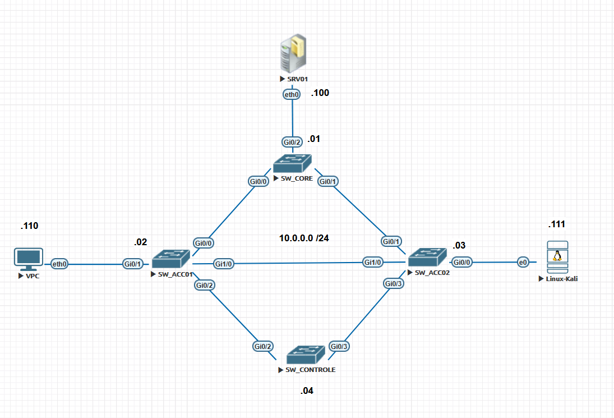  
  
🔥 O objetivo é:
  
- criar redundância
- deixar o STP convergir
- provocar perda de BPDUs
- observar o comportamento do Loop Guard
- depois validar o UDLD

---

## ⚙️ Configuração Base (Pré-requisito)

Agora vamos fazer as configurações iniciais. Então vamos acessar os equipamentos e vamos para as configurações
  
**SRV01**  

```ios
VPCS> ip 10.0.0.100 255.255.255.0
Checking for duplicate address...
VPCS : 10.0.0.100 255.255.255.0

VPCS> save
Saving startup configuration to startup.vpc
.  done

VPCS>
```

**VPC**  

```ios
VPCS> ip 10.0.0.110 255.255.255.0
Checking for duplicate address...
VPCS : 10.0.0.110 255.255.255.0

VPCS> save
Saving startup configuration to startup.vpc
.  done

VPCS>
```

**KALI_LINUX**  

Vamos entrar em: **sudo nano /etc/network/interfaces** e vamos deixar a configuração como na imagem:

```bash
allow-hotplug eth0
iface eth0 inet static
    address 10.0.0.111
    netmask 255.255.255.0
    dns-nameservers 1.1.1.1 8.8.8.8
```

Depois disso, reinicie o servido de redes.  

> sudo systemctl restart networking  
  
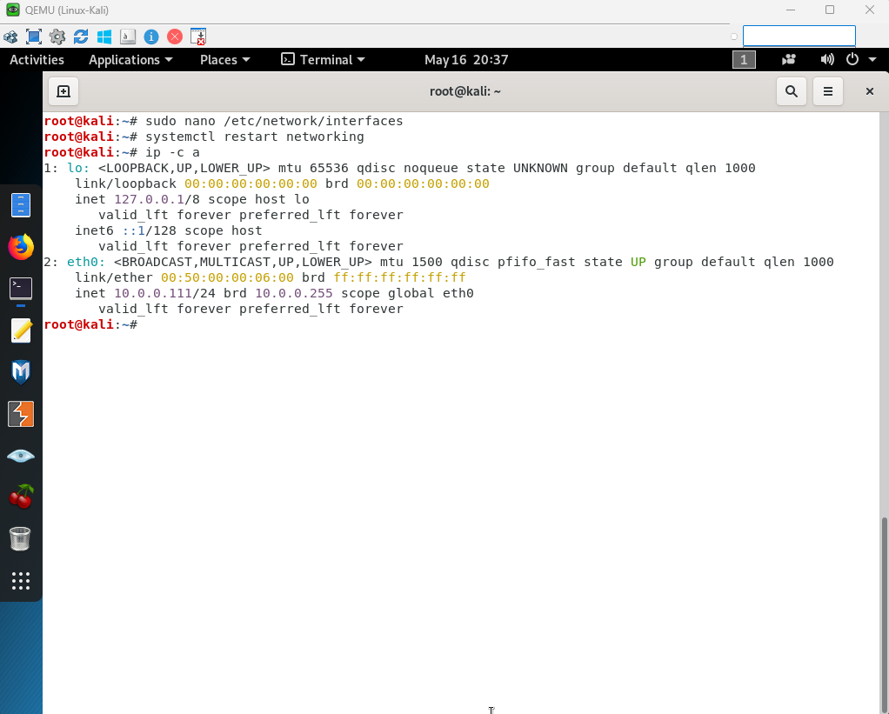  
  
---

## ROOT BRIDGE

No SW_CORE:

```ios
Switch>ena
Switch#conf t
Enter configuration commands, one per line.  End with CNTL/Z.
Switch(config)#hostname SW_CORE
SW_CORE(config)#int valn 1
                     ^
% Invalid input detected at '^' marker.

SW_CORE(config)#int vlan 1
*May 17 00:38:00.538: %LINEPROTO-5-UPDOWN: Line protocol on Interface Vlan1, changed stat
SW_CORE(config-if)#ip address 10.0.0.1 255.255.255.0
SW_CORE(config-if)#no shut
SW_CORE(config-if)#
*May 17 00:38:26.741: %LINK-3-UPDOWN: Interface Vlan1, changed state to up
*May 17 00:38:27.741: %LINEPROTO-5-UPDOWN: Line protocol on Interface Vlan1, changed state to up
SW_CORE(config-if)#exit
SW_CORE(config)#spanning-tree vlan 1 priority 4096
SW_CORE(config)#end
SW_CORE#wr
Building configuration...
Compressed configuration from 3591 bytes to 1623 bytes[OK]
*May 17 00:39:22.011: %GRUB-5-CONFIG_WRITING: GRUB configuration is being updated on disk. Please wait...
*May 17 00:39:22.683: %GRUB-5-CONFIG_WRITTEN: GRUB configuration was written to disk successfully.
SW_CORE#
```

**OBSERVAÇÃO:** como podemos notar, alteramos a prioridade da vlan 1 para4096 para esse switch se tonar o root bridge

**SW_ACC01**  

```ios
Switch>ena
Switch#conf t
Enter configuration commands, one per line.  End with CNTL/Z.
Switch(config)#hostname SW_ACC01
SW_ACC01(config)#int vlan 1
SW_ACC01(config-if)#
*May 17 00:45:07.929: %LINEPROTO-5-UPDOWN: Line protocol on Interface Vlan1, changed state to down
SW_ACC01(config-if)#ip address 10.0.0.2 255.255.255.0
SW_ACC01(config-if)#no shut
SW_ACC01(config-if)#
*May 17 00:45:35.448: %LINK-3-UPDOWN: Interface Vlan1, changed state to up
*May 17 00:45:36.449: %LINEPROTO-5-UPDOWN: Line protocol on Interface Vlan1, changed state to upend
SW_ACC01#wr
Building configuration...
Compressed configuration from 3557 bytes to 1609 bytes[OK]
SW_ACC01#
*May 17 00:46:12.029: %GRUB-5-CONFIG_WRITING: GRUB configuration is being updated on disk. Please wait...
*May 17 00:46:12.705: %GRUB-5-CONFIG_WRITTEN: GRUB configuration was written to disk successfully.
SW_ACC01#

```

**SW_ACC02**  

```ios
Switch>ena
Switch#conf t
Enter configuration commands, one per line.  End with CNTL/Z.
Switch(config)#hostname SW_ACC02
SW_ACC02(config)#int vlan 1
SW_ACC02(config-if)#
*May 17 00:48:59.367: %LINEPROTO-5-UPDOWN: Line protocol on Interface Vlan1, changed state to down
SW_ACC02(config-if)#ip address 10.0.0.3 255.255.255.0
SW_ACC02(config-if)#no shut
SW_ACC02(config-if)#exit
SW_ACC02(config)#
*May 17 00:49:37.282: %LINK-3-UPDOWN: Interface Vlan1, changed state to up
*May 17 00:49:38.282: %LINEPROTO-5-UPDOWN: Line protocol on Interface Vlan1, changed state to up
SW_ACC02(config)#exit
SW_ACC02#
*May 17 00:49:41.679: %SYS-5-CONFIG_I: Configured from console by consolewr
Building configuration...
Compressed configuration from 3557 bytes to 1607 bytes[OK]
*May 17 00:49:45.282: %GRUB-5-CONFIG_WRITING: GRUB configuration is being updated on disk. Please wait...
*May 17 00:49:45.951: %GRUB-5-CONFIG_WRITTEN: GRUB configuration was written to disk successfully.
SW_ACC02#
```

**SW_CONTROLE**  

```ios
Switch>ena
Switch#conf t
Enter configuration commands, one per line.  End with CNTL/Z.
Switch(config)#hostname SW_CONTROLE
SW_CONTROLE(config)#int vlan 1
SW_CONTROLE(config-if)#
*May 17 00:51:59.649: %LINEPROTO-5-UPDOWN: Line protocol on Interface Vlan1, changed state to down
SW_CONTROLE(config-if)#ip address 10.0.0.4 255.255.255.0
SW_CONTROLE(config-if)#no shut
SW_CONTROLE(config-if)#end
SW_CONTROLE#
*May 17 00:52:28.888: %SYS-5-CONFIG_I: Configured from console by console
*May 17 00:52:29.049: %LINK-3-UPDOWN: Interface Vlan1, changed state to up
*May 17 00:52:30.049: %LINEPROTO-5-UPDOWN: Line protocol on Interface Vlan1, changed state to up
SW_CONTROLE#wr

```

---

## ✅ Resultado esperado

Agora vamos analisar o estado do **STP** nos switches  **SW_CORE** e **SW_CONTROLE**  

**SW_CORE**  

```ios
SW_CORE#show spanning-tree vlan 1

VLAN0001
  Spanning tree enabled protocol ieee
  Root ID    Priority    4097
             Address     5000.0001.0000
             This bridge is the root
             Hello Time   2 sec  Max Age 20 sec  Forward Delay 15 sec

  Bridge ID  Priority    4097   (priority 4096 sys-id-ext 1)
             Address     5000.0001.0000
             Hello Time   2 sec  Max Age 20 sec  Forward Delay 15 sec
             Aging Time  300 sec

Interface           Role Sts Cost      Prio.Nbr Type
------------------- ---- --- --------- -------- --------------------------------
Gi0/0               Desg FWD 4         128.1    P2p
Gi0/1               Desg FWD 4         128.2    P2p
Gi0/2               Desg FWD 4         128.3    P2p
Gi0/3               Desg FWD 4         128.4    P2p
Gi1/0               Desg FWD 4         128.5    P2p
Gi1/1               Desg FWD 4         128.6    P2p
Gi1/2               Desg FWD 4         128.7    P2p
Gi1/3               Desg FWD 4         128.8    P2p
Gi2/0               Desg FWD 4         128.9    P2p
Gi2/1               Desg FWD 4         128.10   P2p
Gi2/2               Desg FWD 4         128.11   P2p
Gi2/3               Desg FWD 4         128.12   P2p
Gi3/0               Desg FWD 4         128.13   P2p
Gi3/1               Desg FWD 4         128.14   P2p
Gi3/2               Desg FWD 4         128.15   P2p
Gi3/3               Desg FWD 4         128.16   P2p


SW_CORE#
```

**SW_CONTROLE**  

```ios
SW_CONTROLE#show spanning-tree vlan 1

VLAN0001
  Spanning tree enabled protocol ieee
  Root ID    Priority    4097
             Address     5000.0001.0000
             Cost        8
             Port        3 (GigabitEthernet0/2)
             Hello Time   2 sec  Max Age 20 sec  Forward Delay 15 sec

  Bridge ID  Priority    32769  (priority 32768 sys-id-ext 1)
             Address     5000.0004.0000
             Hello Time   2 sec  Max Age 20 sec  Forward Delay 15 sec
             Aging Time  300 sec

Interface           Role Sts Cost      Prio.Nbr Type
------------------- ---- --- --------- -------- --------------------------------
Gi0/0               Desg FWD 4         128.1    P2p
Gi0/1               Desg FWD 4         128.2    P2p
Gi0/2               Root FWD 4         128.3    P2p
Gi0/3               Altn BLK 4         128.4    P2p
Gi1/0               Desg FWD 4         128.5    P2p
Gi1/1               Desg FWD 4         128.6    P2p
Gi1/2               Desg FWD 4         128.7    P2p
Gi1/3               Desg FWD 4         128.8    P2p
Gi2/0               Desg FWD 4         128.9    P2p
Gi2/1               Desg FWD 4         128.10   P2p
Gi2/2               Desg FWD 4         128.11   P2p
Gi2/3               Desg FWD 4         128.12   P2p
Gi3/0               Desg FWD 4         128.13   P2p
Gi3/1               Desg FWD 4         128.14   P2p
Gi3/2               Desg FWD 4         128.15   P2p
Gi3/3               Desg FWD 4         128.16   P2p


SW_CONTROLE#
```

Resultado esperado:

- SW_CORE como Root - **MAC ADDRESS 5000.0001.0000 e nenhuma porta bloqada**
- uma porta bloqueada - **SW_CONROLE**
- topologia estável
- troca normal de BPDUs

```ios
SW_CONTROLE#debug spanning-tree bpdu
SW_CONTROLE#end

*May 17 01:29:40.860: STP: VLAN0001 rx BPDU: config protocol = ieee, packet from GigabitEthernet0/2  , linktype IEEE_SPANNING , enctype 2, encsize 17
*May 17 01:29:40.866: STP: enc 01 80 C2 00 00 00 50 00 00 02 00 02 00 26 42 42 03
*May 17 01:29:40.869: STP: Data     0000000000100150000001000000000004800150000002000080030100140002000F00
*May 17 01:29:40.875: STP: VLAN0001 Gi0/2:0000 00 00 00 1001500000010000 00000004 8001500000020000 8003 0100 1400 0200 0F00
*May 17 01:29:40.881: STP(1) port Gi0/2 supersedes 0
*May 17 01:29:40.882: STP: VLAN0001 Gi0/0 tx BPDU: config protocol=ieee
    Data : 0000 00 00 00 1001500000010000 00000008 8001500000040000 8001 0200 1400 0200 0F00
*May 17 01:29:40.888: STP: VLAN0001 Gi0/1 tx BPDU: config protocol=ieee
    Data : 0000 00 00 00 1001500000010000 00000008 8001500000040000 8002 0200 1400 0200 0F00
*May 17 01:29:40.894: STP: VLAN0001 Gi1/0 tx BPDU: config protocol=ieee
    Data : 0000 00 00 00 1001500000010000 00000008 8001500000040000 8005 0200 1400 0200 0F00
*May 17 01:29:40.899: STP: VLAN0001 Gi1/1 tx BPDU: config protocol=ieee
    Data : 0000 00 00 00 1001500000010000 00000008 8001500000040000 8006 0200 1400 0200 0F00
*May 17 01:29:40.904: STP: VLAN0001 Gi1/2 tx BPDU: config protocol=ieee
    Data : 0000 00 00 00 1001500000010000 00000008 8001500000040000 8007 0200 1400 0200 0F00
*May 17 01:29:40.910: STP: VLAN0001 Gi1/3 tx BPDU: config protocol=ieee
    Data : 0000 00 00 00 1001500000010000 00000008 8001500000040000 8008 0200 1400 0200 0F00
...
```

**OBSERVAÇÂO:** sempre tome cuidado com os comandos **debug**. Nesse nosso exemplo, tivemos bastante saúdas na tela e isso pode até travar o equipamento. Para pararmos todosos comandos debug devemos digitar **undebug all**  

---

## 🧪 Laboratório 1 — Loop Guard

---

## 🧠 Entendendo o Cenário

O Loop Guard protege portas que:

- deveriam continuar recebendo BPDUs
- mas param inesperadamente

Sem Loop Guard:

> 🔥 a porta pode sair de blocking e entrar em forwarding.

Resultado:

- LOOP

---

## 🎯 Objetivo do laboratório

Vamos:

- criar redundância
- identificar a porta bloqueada
- provocar perda de BPDUs
- validar o estado loop-inconsistent

---

## 📍 Passo 1 — Identificar a porta bloqueada

No SW_CONTROLE:

> show spanning-tree vlan 1

```ios
SW_CONTROLE#show spanning-tree vlan 1

VLAN0001
  Spanning tree enabled protocol ieee
  Root ID    Priority    4097
             Address     5000.0001.0000
             Cost        8
             Port        3 (GigabitEthernet0/2)
             Hello Time   2 sec  Max Age 20 sec  Forward Delay 15 sec

  Bridge ID  Priority    32769  (priority 32768 sys-id-ext 1)
             Address     5000.0004.0000
             Hello Time   2 sec  Max Age 20 sec  Forward Delay 15 sec
             Aging Time  300 sec

Interface           Role Sts Cost      Prio.Nbr Type
------------------- ---- --- --------- -------- --------------------------------
Gi0/0               Desg FWD 4         128.1    P2p
Gi0/1               Desg FWD 4         128.2    P2p
Gi0/2               Root FWD 4         128.3    P2p
Gi0/3               Altn BLK 4         128.4    P2p
```

Resultado esperado:

- Gi0/2 Root FWD
- Gi0/3 Altn BLK

👉 Isso significa:

- Gi0/3 está protegendo a rede contra loop.

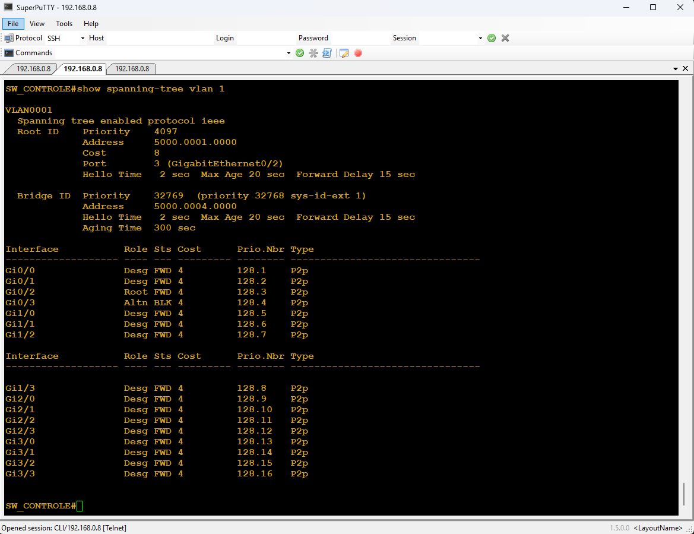  
  
---

## 📍 Passo 2 — Captura no Wireshark

Inicie captura no link:

```text
SW_CONTROLE Gi0/2 <-> SW_ACC01 Gi0/2
```

Filtro:

```wireshark
stp
```

ou

```wireshark
llc.dsap == 0x42
```

---

## 👀 O que observar?

- BPDUs chegando
- Root Bridge
- Hello Time
- Root Path Cost
- troca contínua de BPDUs

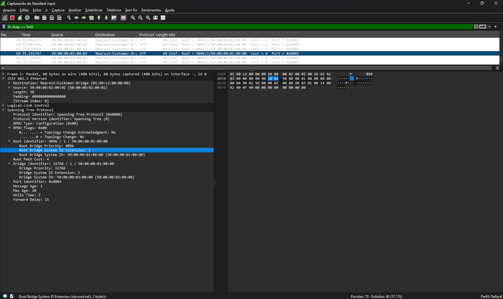

---

## 📍 Passo 3 — Habilitando Loop Guard

No SW_CONTROLE:

```ios
Switch(config)#int g0/2
Switch(config-if)#spanning-tree guard loop
Switch(config-if)#
```

---

## 🔎 Verificação

Para vericar a configuração execute o comando
  
> show spanning-tree interface gi0/2 detail
  
Resultado esperado:

> Loop guard is enabled

```ios
Switch#show spanning-tree int g0/2 detail
 Port 3 (GigabitEthernet0/2) of VLAN0001 is root forwarding
   Port path cost 4, Port priority 128, Port Identifier 128.3.
   Designated root has priority 4097, address 5000.0001.0000
   Designated bridge has priority 32769, address 5000.0002.0000
   Designated port id is 128.3, designated path cost 4
   Timers: message age 3, forward delay 0, hold 0
   Number of transitions to forwarding state: 1
   Link type is point-to-point by default
   Loop guard is enabled on the port
   BPDU: sent 3, received 97
Switch#
```

---

## 📍 Passo 4 — Simulando perda de BPDUs

Agora vamos provocar o problema.

🔥 Aqui está a parte importante do laboratório.

O objetivo NÃO é derrubar o link completamente.

O objetivo é:

> simular falha parcial.

---

## 🧠 Como simular?

No EVE-NG:

- desconecte APENAS um lado do enlace
- ou pause uma interface
- ou utilize filtro de captura

A ideia é:

- manter parte do link UP
- mas interromper recebimento de BPDUs

---

## 📍 Inserir imagem aqui

Agora vamos entrar no **SW_ACC02** e vamos dar um **shutdown** na porta **G0/2** que esta ligada na porta **G0/2** do **SW_COTROLE**. Isso vai simula uma queda no link. Ai precisamos observar o comportamento do **SW_CONTROLE**  

```ios
Switch#
*May 18 00:44:51.791: %SPANTREE-2-LOOPGUARD_BLOCK: Loop guard blocking port GigabitEthernet0/2 on VLAN0001.show spanning-tree vlan 1

VLAN0001
  Spanning tree enabled protocol ieee
  Root ID    Priority    4097
             Address     5000.0001.0000
             Cost        8
             Port        4 (GigabitEthernet0/3)
             Hello Time   2 sec  Max Age 20 sec  Forward Delay 15 sec

  Bridge ID  Priority    32769  (priority 32768 sys-id-ext 1)
             Address     5000.0004.0000
             Hello Time   2 sec  Max Age 20 sec  Forward Delay 15 sec
             Aging Time  15  sec

Interface           Role Sts Cost      Prio.Nbr Type
------------------- ---- --- --------- -------- --------------------------------
Gi0/0               Desg FWD 4         128.1    P2p
Gi0/1               Desg FWD 4         128.2    P2p
Gi0/2               Desg BKN*4         128.3    P2p *LOOP_Inc
Gi0/3               Root LIS 4         128.4    P2p
Gi1/0               Desg FWD 4         128.5    P2p
Gi1/1               Desg FWD 4         128.6    P2p
Gi1/2               Desg FWD 4         128.7    P2p

Interface           Role Sts Cost      Prio.Nbr Type
------------------- ---- --- --------- -------- --------------------------------

Gi1/3               Desg FWD 4         128.8    P2p
Gi2/0               Desg FWD 4         128.9    P2p
Gi2/1               Desg FWD 4         128.10   P2p
Gi2/2               Desg FWD 4         128.11   P2p
Gi2/3               Desg FWD 4         128.12   P2p
Gi3/0               Desg FWD 4         128.13   P2p
Gi3/1               Desg FWD 4         128.14   P2p
Gi3/2               Desg FWD 4         128.15   P2p
Gi3/3               Desg FWD 4         128.16   P2p
```

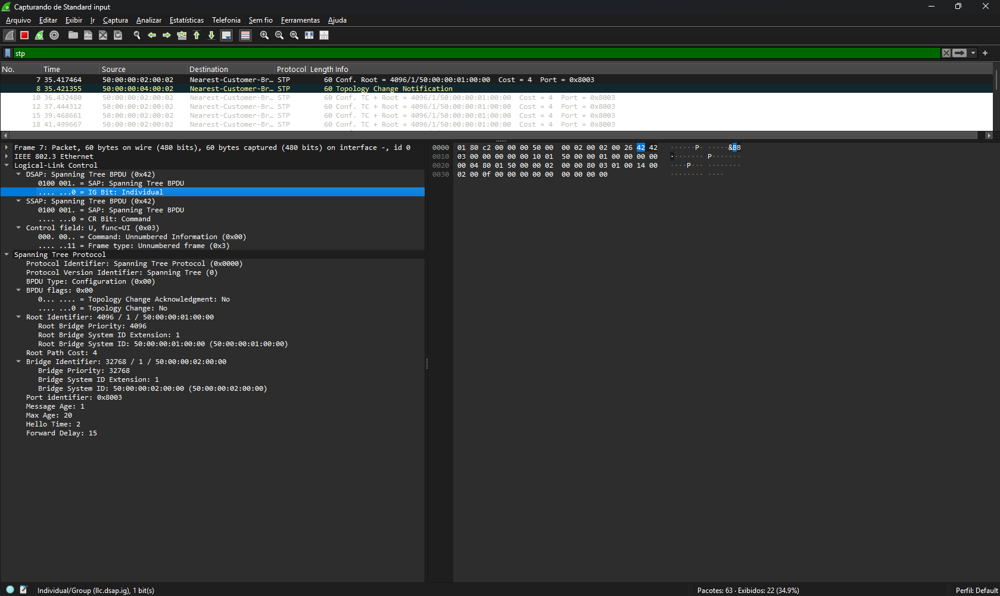

Mostrar:

- lado afetado
- perda parcial

---

## 📍 Passo 5 — Validando o Loop Guard

Agora execute:

> show spanning-tree inconsistentports

Resultado esperado:

```ios
Switch#show spanning-tree inconsistentports

Name                 Interface                Inconsistency
-------------------- ------------------------ ------------------
VLAN0001             GigabitEthernet0/2       Loop Inconsistent

Number of inconsistent ports (segments) in the system : 1

Switch#
```

---

## 🔥 O que aconteceu?

O Loop Guard percebeu:

- a perda inesperada de BPDUs
- mas o link ainda estava operacional

Então:

> ele IMPEDIU a porta de entrar em forwarding.

🔥 Isso salvou a rede de um loop.

---

Delisgando a porta em **SW_ACC01**  

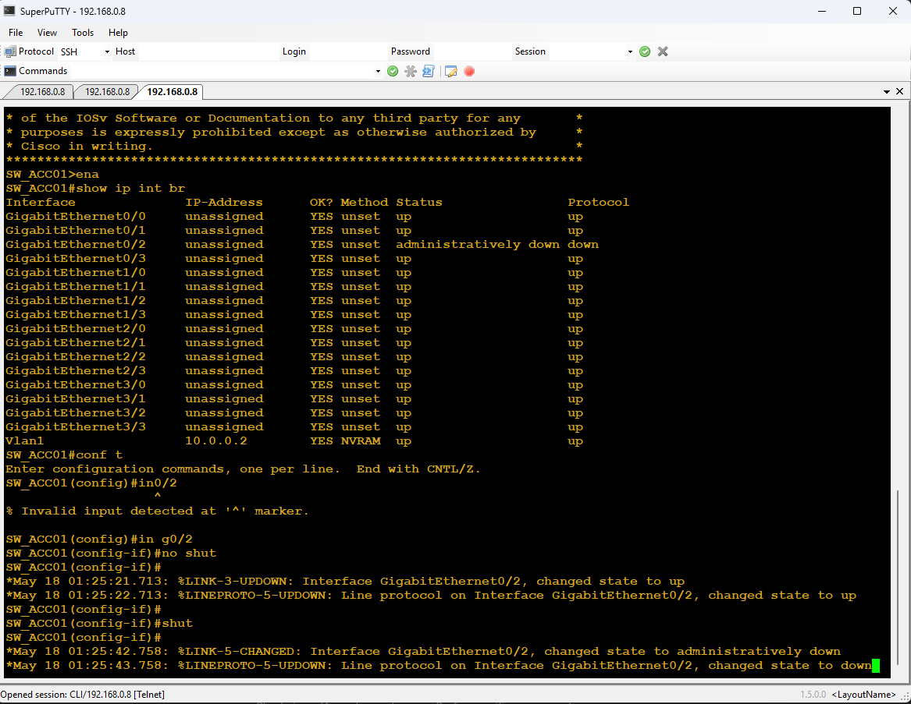

Comportamento do **LOOP GUARD** em **SWCONTROLE**

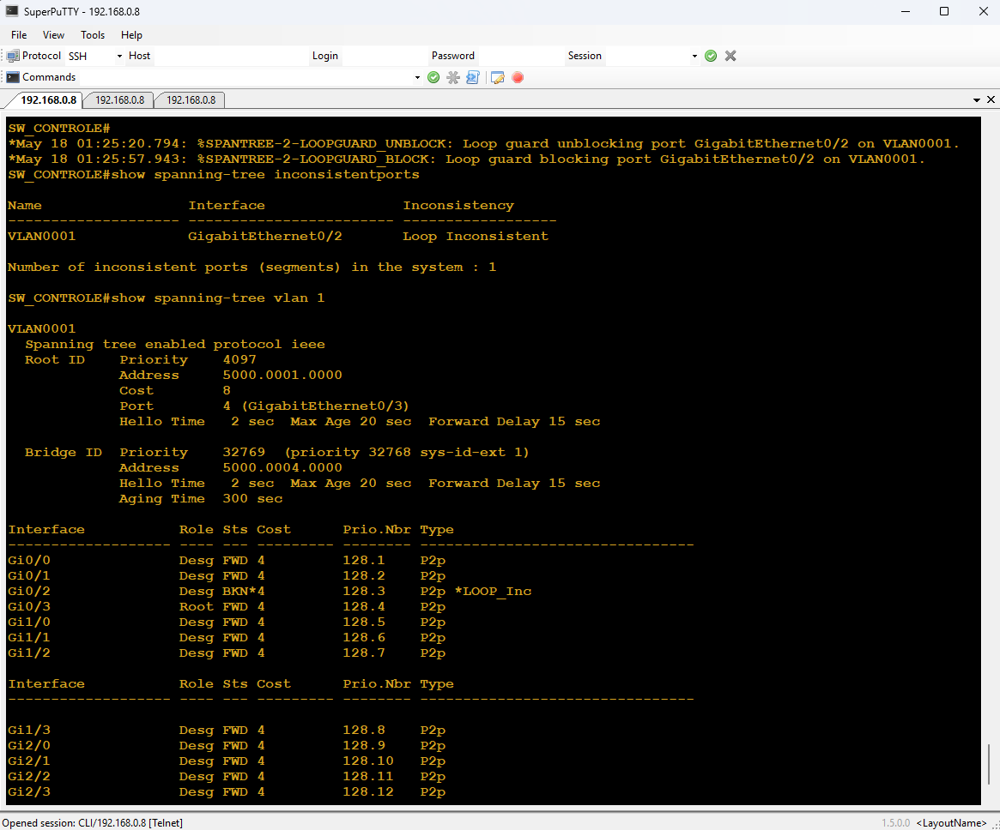

Mostrar:

- loop-inconsistent
- porta protegida
  
## 🧠 Onde o Loop Guard Deve Ser Aplicado?

Neste laboratório, o Loop Guard foi configurado na porta **Root (Gi0/2)** do SW_CONTROLE — e não na porta bloqueada (Gi0/3). Isso foi intencional para demonstrar o efeito mais crítico do recurso.
  
**A lógica é a seguinte:**  
  
- O Loop Guard protege qualquer porta que depende de receber BPDUs para manter seu estado atual.
- Se essa porta para de receber BPDUs por uma falha silenciosa (como uma falha unidirecional em fibra óptica), o STP sem proteção vai promovê-la para Forwarding — criando um loop.
  
**Na prática, o Loop Guard deve ser aplicado em:**  
  
- Portas Root — para impedir que se tornem Designated Forwarding ao perder BPDUs
- Portas Alternate/Backup — para impedir que sejam promovidas indevidamente
  
**Onde o Loop Guard NÃO deve ser aplicado:**  
  
- Portas Designated que são a origem dos BPDUs (elas enviam, não dependem de receber)
- Portas PortFast — o Loop Guard é incompatível com PortFast e será ignorado
  
> **Conclusão:** A porta bloqueada (Gi0/3) seria o próximo candidato a receber Loop Guard em um ambiente de produção. Neste laboratório, protegemos a Root port para demonstrar o estado `loop-inconsistent` de forma mais clara e direta — pois foi ela que parou de receber BPDUs quando o link foi derrubado.

---

## 🧪 Laboratório 2 — UDLD

O UDLD funciona assim:  
  
- ele envia mensagens UDLD periodicamente
- espera receber mensagens UDLD do outro lado
- valida vizinhança bidirecional Layer 1
- detecta link unidirecional (TX funciona / RX falha)
  
Ou seja:
  
> 👉 UDLD precisa existir nos DOIS lados do link físico.

---

## 🧠 Objetivo

Agora vamos detectar:

- falhas físicas parciais

O UDLD atua em camada física/lógica.

---

## 📍 Passo 1 — Habilitando UDLD

Para habilitarmos o recurso de **UDLD** devemos:

- entrar em modo global e hnilitar o udld: **udld enable**
- entrar na interface que se quer habilitar o recurso e digitar: **udld port**

No **SW_ACC01:**  
  
```ios
SW_ACC01#conf t
SW_ACC01(config)#udld ?
  aggressive  Enable UDLD protocol in aggressive mode on fiber ports except
              where locally configured
  enable      Enable UDLD protocol on fiber ports except where locally
              configured
  message     Set UDLD message parameters

SW_ACC01(config)#udld enable
SW_ACC01(config)#int g0/0
SW_ACC01(config-if)#udld port
```

No **SW_CORE:**  
  
```ios
SW_CORE#conf t
Enter configuration commands, one per line.  End with CNTL/Z.
SW_CORE(config)#udld enable
SW_CORE(config)#int g0/0
SW_CORE(config-if)#udld port
```

---

## 🔎 Verificação

Para verificar a formação de vizinhança do UDLD, devemos digitar:

> show udld neighbors

Resultado esperado:

```ios
SW_ACC01#show udld neighbors
Port     Device Name   Device ID     Port ID    Neighbor State
----     -----------   ---------     -------    --------------
Gi0/0    97OO61SQUK3     1            Gi0/0      Bidirectional
SW_ACC01#

```

Aqui podemos observar que:

- ao executar o comando **show udld neighbors** em **SW_ACC01** conseguimos verificar que o switch SW_ACC01 formou uma vizinhança udl com o sitchw SW_CORE

Também podemos verificar se o udld esá ativo por interface digitando:
  
> show udld g0/0

```ios
SW_ACC01#show udld g0/0

Interface Gi0/0
---
Port enable administrative configuration setting: Enabled
Port enable operational state: Enabled
Current bidirectional state: Bidirectional
Current operational state: Advertisement - Single neighbor detected
Message interval: 15000 ms
Time out interval: 5000 ms

Port fast-hello configuration setting: Disabled
Port fast-hello interval: 0 ms
Port fast-hello operational state: Disabled
Neighbor fast-hello configuration setting: Disabled
Neighbor fast-hello interval: Unknown


    Entry 1
    ---
    Expiration time: 39900 ms
    Cache Device index: 1
    Current neighbor state: Bidirectional
    Device ID: 97OO61SQUK3
    Port ID: Gi0/0
    Neighbor echo 1 device: 9ALNGACW8E3
    Neighbor echo 1 port: Gi0/0

    TLV Message interval: 15 sec
    No TLV fast-hello interval
    TLV Time out interval: 5
    TLV CDP Device name: SW_CORE
SW_ACC01#

SW_ACC01#show udld g0/1

Interface Gi0/1
---
Port enable administrative configuration setting: Disabled
Port enable operational state: Disabled
Current bidirectional state: Unknown
SW_ACC01#
```

---

## 📍 Passo 2 — Captura no Wireshark

Vamos iniciar a captura no link UDLD. Então vamos posicionar o Whireshark no switch **SW_ACC01** na porta **G0/0**.

Filtro:

```wireshark
eth.dst == 01:00:0c:cc:cc:cc
```

ou

```whireshark
udld
```

## 👀 O que observar?

- mensagens UDLD
- troca bidirecional
- keepalives

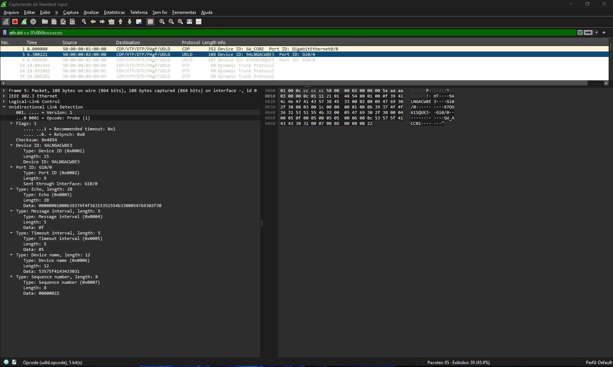

---

## 📍 Passo 3 — Habilitando modo aggressive

Agora vamos ativar o modo aggressive. Só que agora vamos ativar no link entre **SW_CORE** e **SW_ACC02** nas porta **G0/1**

**SW_CORE**  

```ios
SW_CORE(config)#udld enable
SW_CORE(config)#int g0/1
SW_CORE(config-if)#udld port aggressive
SW_CORE(config-if)#
```

**SW_ACC02**  

```ios
SW_ACC02#conf t
Enter configuration commands, one per line.  End with CNTL/Z.
SW_ACC02(config)#udld enable
SW_ACC02(config)#int g0/1
SW_ACC02(config-if)#udld port aggressive
SW_ACC02(config-if)#
```

## 🔎 Verificação

Para verificar a formação de vizinhança do UDLD, devemos digitar:

> show udld neighbors

Resultado esperado:

```ios
SW_ACC02#show udld neighbors
Port     Device Name   Device ID     Port ID    Neighbor State
----     -----------   ---------     -------    --------------
Gi0/1    97OO61SQUK3     1            Gi0/1      Bidirectional
```

Aqui podemos observar que:

- ao executar o comando **show udld neighbors** em **SW_ACC02** conseguimos verificar que o switch SW_ACC01 formou uma vizinhança udl com o sitchw SW_CORE

Também podemos verificar se o udld esá ativo por interface digitando:
  
> show udld g0/1

```ios
SW_ACC02#show udld g0/1

Interface Gi0/1
---
Port enable administrative configuration setting: Enabled / in aggressive mode
Port enable operational state: Enabled / in aggressive mode
Current bidirectional state: Bidirectional
Current operational state: Advertisement - Single neighbor detected
Message interval: 15000 ms
Time out interval: 5000 ms

Port fast-hello configuration setting: Disabled
Port fast-hello interval: 0 ms
Port fast-hello operational state: Disabled
Neighbor fast-hello configuration setting: Disabled
Neighbor fast-hello interval: Unknown


    Entry 1
    ---
    Expiration time: 36200 ms
    Cache Device index: 1
    Current neighbor state: Bidirectional
    Device ID: 97OO61SQUK3
    Port ID: Gi0/1
    Neighbor echo 1 device: 9I1SZVKPTBF
    Neighbor echo 1 port: Gi0/1

    TLV Message interval: 15 sec
    No TLV fast-hello interval
    TLV Time out interval: 5
    TLV CDP Device name: SW_CORE
SW_ACC02#
```

---

## 🔥 O que muda?

No modo aggressive:

- o switch tenta recuperar comunicação
- se falhar:
- coloca interface em err-disable

---
  
## 🔍 O que é UDLD?
  
O **UDLD (Unidirectional Link Detection)** é um protocolo proprietário da Cisco utilizado para detectar falhas de comunicação unidirecional em enlaces Ethernet.
  
O protocolo verifica se os dispositivos conseguem se comunicar corretamente nos dois sentidos do link:
  
- transmissão (TX)
- recepção (RX)
  
O objetivo é garantir que o enlace esteja realmente funcional de forma bidirecional.
  
---
  
## 🧠 Como o UDLD funciona
  
Os switches trocam mensagens UDLD periodicamente contendo:
  
- Device ID
- porta local
- informações do vizinho
  
Assim, cada lado consegue validar que:
  
> "eu consigo enviar mensagens para você e também receber suas respostas"
  
Caso um dos lados pare de receber mensagens UDLD, o protocolo identifica uma possível falha unidirecional.
  
---

## ⚠️ Por que links unidirecionais são perigosos

Em alguns cenários, principalmente em fibra óptica, um dos sentidos do enlace pode falhar enquanto o outro continua funcionando.
  
Isso pode fazer com que a interface permaneça:
  
```text
UP/UP
```

Mesmo com falha parcial no link.

Esse comportamento pode causar:

- loops de camada 2
- falhas no STP
- MAC flapping
- flooding
- instabilidade na rede
  
---
  
## 🏢 Onde o UDLD é utilizado
  
O UDLD é muito comum em:
  
- enlaces de fibra óptica
- uplinks entre switches
- EtherChannels
- redes de campus
- datacenters
- ambientes com redundância

---

## 🔒 Benefícios do UDLD

- Detecta falhas difíceis de identificar
- Protege o funcionamento do STP
- Reduz riscos de loops de camada 2
- Aumenta a estabilidade da rede
- Melhora a confiabilidade de enlaces redundantes

---

## ⚙️ Modos de operação

### UDLD Enable

- Detecta inconsistências
- Gera logs e alertas
- Comportamento mais passivo

### UDLD Aggressive

- Detecta falhas mais rapidamente
- Tenta restabelecer comunicação
- Pode colocar a interface em `err-disable`

Esse modo é recomendado para enlaces críticos.

**OBSERVAÇÂO:** então como agora não temos como simular uma fibra óptica, vamos simular uma agregção de links e o comportamento do **UDLD**

## Configurando dois etherchannels

Para podermos dar andamento ao nosso exemplo, ficou claro que precisamos ter no mínimo dois links atuando do forma como bidirecional. Então podemos establecer dois links etherchannel e logo após verificar o funcionamento do UDLD.  
  
Para o STP, se criarmos um link agregado, o STP passa a entender que esse link é formado somente por um cabo e, portanto, não bloqueia nenhuma porta deixando todas ativas.  
  
Então vamos adicionar um link entre **SW_CORE** e **SW_ACC01** nas portas **G0/3**. Também vamos adiicionar mais um link entre **SW_CORE** e **SW_ACC02** nas portas **G1/1**. E ai nosso cenário agora ficaassim:

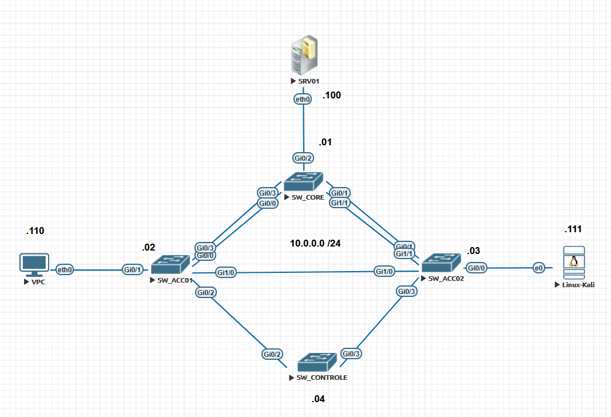  

## Configurando a agregaçõ de links
  
Vamos entrar no switch **SW_CORE** e vamos configurar o grupo 1 que vai agregar o link entre **SW_CORE** e **SW_ACC01**  

```ios
SW_CORE#ena
SW_CORE#conf t
SW_CORE(config)#interface port-channel 1
SW_CORE(config)#switchport trunk encapsulation dot1q
SW_CORE(config-if)#switchport mode trunk
SW_CORE(config-if)#exit
SW_CORE(config)#int g0/0
SW_CORE(config-if)#channel-group 1 mode active
SW_CORE(config-if)#
*May 18 19:41:11.124: %LINEPROTO-5-UPDOWN: Line protocol on Interface GigabitEthernet0/0, changed state to down
SW_CORE(config-if)#int g0/
*May 18 19:41:18.557: %EC-5-L3DONTBNDL2: Gi0/0 suspended: LACP currently not enabled on the remote p
% Incomplete command.
SW_CORE(config)#switchport trunk encapsulation dot1q
SW_CORE(config-if)#switchport mode trunk


SW_CORE(config)#int g0/3
SW_CORE(config-if)#channel-group 1 mode active
SW_CORE(config)#switchport trunk encapsulation dot1q
SW_CORE(config-if)#switchport mode trunk
```

Vamos acessar o switch **SW_ACC01** e terminar a outra parte  
  
```ios
SW_ACC01#conf t
Enter configuration commands, one per line.  End with CNTL/Z.
SW_ACC01(config)#int g0/0
SW_ACC01(config-if)#switchport trunk encapsulation dot1q
SW_ACC01(config-if)#switchport mode trunk
SW_ACC01(config-if)#channel-group 1 mode passive
Creating a port-channel interface Port-channel 1
*May 18 20:08:11.542: %LINEPROTO-5-UPDOWN: Line protocol on Interface GigabitEthernet0/0, changed state to down
*May 18 20:08:18.808: %EC-5-L3DONTBNDL2: Gi0/0 suspended: LACP currently not enabled on the remote port.
*May 18 20:08:34.490: %LINEPROTO-5-UPDOWN: Line protocol on Interface GigabitEthernet0/0, changed state to up

SW_ACC01(config-if)#
*May 18 20:00:21.792: %LINEPROTO-5-UPDOWN: Line protocol on Interface GigabitEthernet0/1, changed state to down
*May 18 20:00:29.149: %EC-5-L3DONTBNDL2: Gi0/1 suspended: LACP currently not enabled on the remote port.
SW_ACC01(config-if)#int g0/3
SW_ACC01(config-if)#switchport trunk encapsulation dot1q
SW_ACC01(config-if)#switchport mode trunk
SW_ACC01(config-if)#channel-group 1 mode passive
SW_ACC01(config-if)#
```

Agora vamos verificar o agrupamento de links. Vamos acessar o switch **SW_CORE**  

```ios
SW_CORE#show etherchannel 1 summary
Flags:  D - down        P - bundled in port-channel
        I - stand-alone s - suspended
        H - Hot-standby (LACP only)
        R - Layer3      S - Layer2
        U - in use      N - not in use, no aggregation
        f - failed to allocate aggregator

        M - not in use, minimum links not met
        m - not in use, port not aggregated due to minimum links not met
        u - unsuitable for bundling
        w - waiting to be aggregated
        d - default port

        A - formed by Auto LAG


Number of channel-groups in use: 1
Number of aggregators:           1

Group  Port-channel  Protocol    Ports
------+-------------+-----------+-----------------------------------------------
1      Po1(SU)         LACP      Gi0/0(P)    Gi0/3(P)

SW_CORE#
```

Como podemos ver, a nova porta  **Po1** está como **SU** que segundo a leganda quer dizer link layer 2 em uso confirmando que nossa agregação em modo **LACP** está correto e funcional.  
  
Agora vamos analisar o spanning three

```ios
SW_CORE#show spanning-tree

VLAN0001
  Spanning tree enabled protocol ieee
  Root ID    Priority    4097
             Address     5000.0001.0000
             This bridge is the root
             Hello Time   2 sec  Max Age 20 sec  Forward Delay 15 sec

  Bridge ID  Priority    4097   (priority 4096 sys-id-ext 1)
             Address     5000.0001.0000
             Hello Time   2 sec  Max Age 20 sec  Forward Delay 15 sec
             Aging Time  300 sec

Interface           Role Sts Cost      Prio.Nbr Type
------------------- ---- --- --------- -------- --------------------------------
Gi0/1               Desg FWD 4         128.2    P2p
Gi0/2               Desg FWD 4         128.3    P2p
Gi1/0               Desg FWD 4         128.5    P2p
Gi1/1               Desg FWD 4         128.6    P2p
Gi1/2               Desg FWD 4         128.7    P2p
Gi1/3               Desg FWD 4         128.8    P2p
Gi2/0               Desg FWD 4         128.9    P2p
Gi2/1               Desg FWD 4         128.10   P2p
Gi2/2               Desg FWD 4         128.11   P2p
Gi2/3               Desg FWD 4         128.12   P2p
Gi3/0               Desg FWD 4         128.13   P2p
Gi3/1               Desg FWD 4         128.14   P2p
Gi3/2               Desg FWD 4         128.15   P2p
Gi3/3               Desg FWD 4         128.16   P2p
Po1                 Desg FWD 3         128.65   P2p


SW_CORE#
```

Antes de criarmos a agregação de links no **SW_ACC02** vamos analisar o spanning-three para observarmos o comportamento e comporovar o que foi dito antes.

```ios
SW_ACC02#show sp
SW_ACC02#show spanning-tree

VLAN0001
  Spanning tree enabled protocol ieee
  Root ID    Priority    4097
             Address     5000.0001.0000
             Cost        4
             Port        2 (GigabitEthernet0/1)
             Hello Time   2 sec  Max Age 20 sec  Forward Delay 15 sec

  Bridge ID  Priority    32769  (priority 32768 sys-id-ext 1)
             Address     5000.0003.0000
             Hello Time   2 sec  Max Age 20 sec  Forward Delay 15 sec
             Aging Time  300 sec

Interface           Role Sts Cost      Prio.Nbr Type
------------------- ---- --- --------- -------- --------------------------------
Gi0/0               Desg FWD 4         128.1    P2p
Gi0/1               Root FWD 4         128.2    P2p
Gi0/2               Desg FWD 4         128.3    P2p
Gi0/3               Desg FWD 4         128.4    P2p
Gi1/0               Altn BLK 4         128.5    P2p
Gi1/1               Altn BLK 4         128.6    P2p
Gi1/2               Desg FWD 4         128.7    P2p
Gi1/3               Desg FWD 4         128.8    P2p
Gi2/0               Desg FWD 4         128.9    P2p
Gi2/1               Desg FWD 4         128.10   P2p
Gi2/2               Desg FWD 4         128.11   P2p
Gi2/3               Desg FWD 4         128.12   P2p
Gi3/0               Desg FWD 4         128.13   P2p
Gi3/1               Desg FWD 4         128.14   P2p
Gi3/2               Desg FWD 4         128.15   P2p
Gi3/3               Desg FWD 4         128.16   P2p


SW_ACC02#
```

Então podemos notar que o STP atuou bloqueando as portas **G1/0** e **G1/1**, o que comprova que depois da agregação o STP passa a enchergar as portas como uma só e não bloqueia mais nenhuma porta.  

Agora vamos criar o **grupo2** que vai agregar os links entre os switches **SW_CORE** e **SW_ACC02**  

**SW_CORE**  

```ios
SW_CORE#conf t
Enter configuration commands, one per line.  End with CNTL/Z.
SW_CORE(config)#int g0/1
SW_CORE(config-if)#switchport trunk encapsulation dot1q
SW_CORE(config-if)#switchport mode trunk
SW_CORE(config-if)#channel-group 2 mode active
Creating a port-channel interface Port-channel 2

SW_CORE(config-if)#
*May 18 21:11:45.660: %LINEPROTO-5-UPDOWN: Line protocol on Interface GigabitEthernet0/1, changed state to down
SW_CORE(config-if)#int
*May 18 21:11:52.686: %EC-5-L3DONTBNDL2: Gi0/1 suspended: LACP currently not enabled on the remote port.
% Incomplete command.

SW_CORE(config)#
SW_CORE(config)#int g1/1
SW_CORE(config-if)#switchport trunk encapsulation dot1q
SW_CORE(config-if)#switchport mode trunk
SW_CORE(config-if)#channel-group 2 mode active
SW_CORE(config-if)#
*May 18 21:12:17.166: %LINEPROTO-5-UPDOWN: Line protocol on Interface GigabitEthernet1/1, changed state to down
*May 18 21:12:24.241: %EC-5-L3DONTBNDL2: Gi1/1 suspended: LACP currently not enabled on the remote port.
```

**SW_ACC02**  

```ios
SW_ACC02>enable
SW_ACC02#conf t
Enter configuration commands, one per line.  End with CNTL/Z.
SW_ACC02(config)#int g0/1
SW_ACC02(config-if)#switchport trunk encapsulation dot1q
SW_ACC02(config-if)#switchport mode trunk
SW_ACC02(config-if)#channel-group 2 mode passive
Creating a port-channel interface Port-channel 2

SW_ACC02(config-if)#
*May 18 21:16:08.026: %LINEPROTO-5-UPDOWN: Line protocol on Interface GigabitEthernet0/1, changed state to down
*May 18 21:16:15.210: %EC-5-L3DONTBNDL2: Gi0/1 suspended: LACP currently not enabled on the remote port.
*May 18 21:16:25.634: %LINEPROTO-5-UPDOWN: Line protocol on Interface GigabitEthernet0/1, changed state to up
SW_ACC02(config-if)#int g1/1

*May 18 21:16:34.168: %LINK-3-UPDOWN: Interface Port-channel2, changed state to up
*May 18 21:16:35.169: %LINEPROTO-5-UPDOWN: Line protocol on Interface Port-channel2, changed stachannel-group 2 mode passive
SW_ACC02(config-if)#switchport trunk encapsulation dot1q
SW_ACC02(config-if)#channel-group 2 mode passive
SW_ACC02(config-if)SW_ACC02(config-if)#switchport mode trunk
*May 18 21:17:03.349: %EC-5-L3DONTBNDL2: Gi1/1 suspended: LACP currently not enabled on the remote port.
*May 18 21:17:04.349: %LINEPROTO-5-UPDOWN: Line protocol on Interface GigabitEthernet1/1, changed state to down
SW_ACC02(config-if)#channel-group 2 mode passive
SW_ACC02(config-if)#
*May 18 21:17:16.322: %LINEPROTO-5-UPDOWN: Line protocol on Interface GigabitEthernet1/1, changed state to up
SW_ACC02(config-if)#
```

Verificando o grupo 2  

```ios
SW_ACC02#show etherchannel 2 summary
Flags:  D - down        P - bundled in port-channel
        I - stand-alone s - suspended
        H - Hot-standby (LACP only)
        R - Layer3      S - Layer2
        U - in use      N - not in use, no aggregation
        f - failed to allocate aggregator

        M - not in use, minimum links not met
        m - not in use, port not aggregated due to minimum links not met
        u - unsuitable for bundling
        w - waiting to be aggregated
        d - default port

        A - formed by Auto LAG


Number of channel-groups in use: 1
Number of aggregators:           1

Group  Port-channel  Protocol    Ports
------+-------------+-----------+-----------------------------------------------
2      Po2(SU)         LACP      Gi0/1(P)    Gi1/1(P)

SW_ACC02#
```

## Pequena revisão até aqui

Certo, para não perdermos o foco do que fizemos até aqui, vamos relembrar o que temos até aqui e o que falta para terminar.  

**O que temos até aqui?**  

- Stp ativo e funcionando.
- Topologia convergida
- Agregação de portas em modo **LACP** entre o switch **SW_CORE** e o switch **SW_ACC1** nas portas **G0/0 e G0/3** formando o **grupo1**
- Agregação de portas em modo **LACP** entre o switch **SW_CORE** e o switch **SW_ACC2** nas portas **G0/1 e G1/1** formando o **grupo2**
- UDLD em modo enabale nas portas **G0/0** dos switches **SW_CORE** e **SW_ACC1**
- UDLD em modo aggressive nos portas **G0/1** dos switches **SW_CORE** e **SW_ACC2**  
  
**O que falta agora?**  

- UDLD em modo enabale nas portas **G0/3** dos switches **SW_CORE** e **SW_ACC1**
- UDLD em modo aggressive nos portas **G1/1** dos switches **SW_CORE** e **SW_ACC2**  

## Terminando as configurações do cenário
  
Então vamos agora terminar o que falta  

> UDLD em modo enabale nas portas **G0/3** dos switches **SW_CORE** e **SW_ACC1**

**SW_CORE**  

```ios
Enter configuration commands, one per line.  End with CNTL/Z.
SW_CORE(config)#int g0/3
SW_CORE(config-if)#udld port
SW_CORE(config-if)#
```

**SW_ACC01**  
  
```ios
SW_ACC01#conf t
Enter configuration commands, one per line.  End with CNTL/Z.
SW_ACC01(config)#int g0/3
SW_ACC01(config-if)#udld port
SW_ACC01(config-if)#
```

- UDLD em modo aggressive nos portas **G1/1** dos switches **SW_CORE** e **SW_ACC2**

**SW_CORE**  
  
```ios
SW_CORE#conf t
Enter configuration commands, one per line.  End with CNTL/Z.
SW_CORE(config)#int g1/1
SW_CORE(config-if)#udld port aggressive
SW_CORE(config-if)#
```

**SW_ACC2**  
  
```ios
SW_ACC02#conf t
Enter configuration commands, one per line.  End with CNTL/Z.
SW_ACC02(config)#int g1/1
SW_ACC02(config-if)#udld port aggressive
```

## 📍 Passo 4 — Simulando falha parcial

Agora:

- interrompa apenas uma direção do enlace

O objetivo é:

- manter link UP
- perder comunicação bidirecional

**OBSERVAÇÂO:** aqui temos uma limitação quando estamos utilizando qualquer simulador. Então não temos como quebrar uma fibra, ou um cabo. Também se simplesmente desligarmos uma porta, o UDLD vai detectar que o link inteiro caiu e não vai agir. Então para podermos simular o problema vamos criar uma acl para bloquear os quadros em uma das portas que estão presentes nos agrupamentso que criamos. Primeiros vamos analisar o agrupamento 1 de depois o agrupamento 2.

Então vamos entrar em **SW_ACC01** para criarmos nossa acl.

**SW_ACC01**

```ios
SW_ACC01(config)# mac access-list extended BLOCK_UDLD
SW_ACC01(config-ext-macl)# deny any 0100.0ccc.cccc 0000.0000.0000
SW_ACC01(config-ext-macl)# permit any any
SW_ACC01(config-ext-macl)# exit

SW_ACC01(config)# interface gi0/2
SW_ACC01(config-if)# mac access-group BLOCK_UDLD in
```

**OBSERVAÇÂO2:**  

O endereço MAC de destino **0100.0ccc.cccc (com a máscara curinga 0000.0000.0000)** é um endereço de multicast de camada 2 global para protocolos proprietários da Cisco.Se você aplicar essa ACL de bloqueio na interface, você não estará isolando apenas o UDLD. Você vai quebrar a comunicação de todos os seguintes protocolos que trafegam nessa porta:

- **CDP (Cisco Discovery Protocol):** O switch deixará de descobrir informações do vizinho (como nome do equipamento, IOS, IPs de gerência e portas conectadas).
- **VTP (VLAN Trunking Protocol):** A sincronização e propagação de tabelas de VLAN através desse Trunk vai parar de funcionar.
- **DTP (Dynamic Trunking Protocol):** Se a porta estiver configurada como dynamic desirable ou dynamic auto, o fechamento do Trunk via negociação vai falhar.
- **PVST+ (Per-VLAN Spanning Tree):** O Spanning Tree da Cisco utiliza esse mesmo MAC para enviar BPDUs em VLANs diferentes da VLAN 1. 
  
> **Cuidado:** Bloquear isso pode causar loops de rede catastróficos ou fazer o STP travar a porta de outra forma.PAgP (Port Aggregation Protocol): Se houver um EtherChannel (Port-Channel) negociado via PAgP, ele vai cair.
  
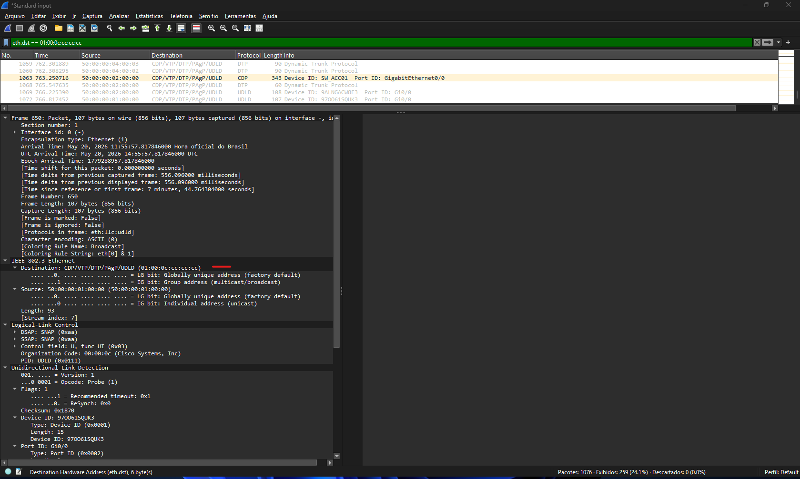  

Agora vamos observar o estado do **channel-group 1**  

```ios
SW_ACC01#show etherchannel 1 summ
SW_ACC01#show etherchannel 1 summary
Flags:  D - down        P - bundled in port-channel
        I - stand-alone s - suspended
        H - Hot-standby (LACP only)
        R - Layer3      S - Layer2
        U - in use      N - not in use, no aggregation
        f - failed to allocate aggregator

        M - not in use, minimum links not met
        m - not in use, port not aggregated due to minimum links not met
        u - unsuitable for bundling
        w - waiting to be aggregated
        d - default port

        A - formed by Auto LAG


Number of channel-groups in use: 1
Number of aggregators:           1

Group  Port-channel  Protocol    Ports
------+-------------+-----------+-----------------------------------------------
1      Po1(SU)         LACP      Gi0/0(P)    Gi0/3(P)

SW_ACC01#
*May 20 18:05:01.879: %LINEPROTO-5-UPDOWN: Line protocol on Interface GigabitEthernet0/0, changed state to down
*May 20 18:05:06.308: %EC-5-L3DONTBNDL2: Gi0/0 suspended: LACP currently not enabled on the remote port.
SW_ACC01#show etherchannel 1 summary
Flags:  D - down        P - bundled in port-channel
        I - stand-alone s - suspended
        H - Hot-standby (LACP only)
        R - Layer3      S - Layer2
        U - in use      N - not in use, no aggregation
        f - failed to allocate aggregator

        M - not in use, minimum links not met
        m - not in use, port not aggregated due to minimum links not met
        u - unsuitable for bundling
        w - waiting to be aggregated
        d - default port

        A - formed by Auto LAG


Number of channel-groups in use: 1
Number of aggregators:           1

Group  Port-channel  Protocol    Ports
------+-------------+-----------+-----------------------------------------------
1      Po1(SU)         LACP      Gi0/0(s)    Gi0/3(P)

SW_ACC01#
*May 20 18:06:25.404: %EC-5-L3DONTBNDL2: Gi0/0 suspended: LACP currently not enabled on the remote port.
```

Como podemos observar pela saída, a **acl** começa a bloquear o tráfego e depois de algum tempo pequeno nos é exibido o log mostrando que agora a porta **G0/0** agora está como **Gi0/0(s)**, ou seja, **s - suspended**.  
  
Também vamos observar o udld agora:

```ios
SW_ACC01#show udld

Interface Gi0/0
---
Port enable administrative configuration setting: Enabled
Port enable operational state: Enabled
Current bidirectional state: Unknown
Current operational state: Advertisement
Message interval: 7000 ms
Time out interval: 5000 ms

Port fast-hello configuration setting: Disabled
Port fast-hello interval: 0 ms
Port fast-hello operational state: Disabled
Neighbor fast-hello configuration setting: Disabled
Neighbor fast-hello interval: Unknown

No neighbor cache information stored
```

E agora vamos verificar a vizinhança **UDLD**

```ios
SW_ACC01#show udld neighbors
Port     Device Name   Device ID     Port ID    Neighbor State
----     -----------   ---------     -------    --------------
Gi0/3    97OO61SQUK3     1            Gi0/3      Bidirectional
SW_ACC01#
```

Como podemos observar pelas saídas, agora temos somente uma porta ativa no **bundle lacp** e somente um vizinho ativo no **udld** que é a porta **G0/3**.  
No que o estado da porta **G0/0** no udld está como **Current bidirectional state: Unknown**.  
  
Agora para recuoerarmos o estado da porta, temos que remover a acl da porta e depois restaurar o estado do protocolo **lacp** nas duas pontas, ou seja, nas portas **G0/0** nos switches **SW_ACC01** e **SW_CORE**.  

**SW_ACC01**  

```ios
SW_ACC01#conf t
SW_ACC01(config)#int g0/0
SW_ACC01(config-if)#no mac access-group BLOCK_UDLD in
SW_ACC01(config-if)#shut
SW_ACC01(config-if)#
*May 20 18:22:08.348: %LINK-5-CHANGED: Interface GigabitEthernet0/0, changed state to administratively down
SW_ACC01(config-if)#no shut
SW_ACC01(config-if)#
*May 20 18:22:16.992: %LINK-3-UPDOWN: Interface GigabitEthernet0/0, changed state to up
*May 20 18:22:17.992: %LINEPROTO-5-UPDOWN: Line protocol on Interface GigabitEthernet0/0, changed state to up
*May 20 18:22:26.203: %EC-5-L3DONTBNDL2: Gi0/0 suspended: LACP currently not enabled on the remote port.
*May 20 18:22:27.203: %LINEPROTO-5-UPDOWN: Line protocol on Interface GigabitEthernet0/0, changed state to down
SW_ACC01(config-if)#channel-group 1 mode passive
SW_ACC01(config-if)#
```

**SW_CORE**  

```ios
SW_CORE(config)#int g0/0
SW_CORE(config-if)#channel-group 1 mode activ
SW_CORE(config-if)#channel-group 1 mode active
SW_CORE(config-if)#shut
SW_CORE(config-if)#
*May 20 18:25:23.543: %LINK-5-CHANGED: Interface GigabitEthernet0/0, changed state to administratively down
SW_CORE(config-if)#no shut
SW_CORE(config-if)#
*May 20 18:25:36.988: %LINK-3-UPDOWN: Interface GigabitEthernet0/0, changed state to up
*May 20 18:25:40.071: %LINEPROTO-5-UPDOWN: Line protocol on Interface GigabitEthernet0/0, changed state to up
SW_CORE(config-if)#
```

Vamos verificar novamente os estados do bundle e do udld.  

```ios
SW_ACC01#show etherchannel 1 summ
Flags:  D - down        P - bundled in port-channel
        I - stand-alone s - suspended
        H - Hot-standby (LACP only)
        R - Layer3      S - Layer2
        U - in use      N - not in use, no aggregation
        f - failed to allocate aggregator

        M - not in use, minimum links not met
        m - not in use, port not aggregated due to minimum links not met
        u - unsuitable for bundling
        w - waiting to be aggregated
        d - default port

        A - formed by Auto LAG


Number of channel-groups in use: 1
Number of aggregators:           1

Group  Port-channel  Protocol    Ports
------+-------------+-----------+-----------------------------------------------
1      Po1(SU)         LACP      Gi0/0(P)    Gi0/3(P)

SW_ACC01#

SW_ACC01#show udld

Interface Gi0/0
---
Port enable administrative configuration setting: Enabled
Port enable operational state: Enabled
Current bidirectional state: Bidirectional
Current operational state: Advertisement - Single neighbor detected
Message interval: 15000 ms
Time out interval: 5000 ms

Port fast-hello configuration setting: Disabled
Port fast-hello interval: 0 ms
Port fast-hello operational state: Disabled
Neighbor fast-hello configuration setting: Disabled
Neighbor fast-hello interval: Unknown


    Entry 1
    ---
    Expiration time: 33400 ms
    Cache Device index: 1
    Current neighbor state: Bidirectional
    Device ID: 97OO61SQUK3
    Port ID: Gi0/0
    Neighbor echo 1 device: 9ALNGACW8E3
    Neighbor echo 1 port: Gi0/0

    TLV Message interval: 15 sec
    No TLV fast-hello interval
    TLV Time out interval: 5
    TLV CDP Device name: SW_CORE
    ....

SW_ACC01#show udld neighbors
Port     Device Name   Device ID     Port ID    Neighbor State
----     -----------   ---------     -------    --------------
Gi0/0    97OO61SQUK3     1            Gi0/0      Bidirectional
Gi0/3    97OO61SQUK3     1            Gi0/3      Bidirectional
SW_ACC01#
```

Agora podemos obsercar que no bundle a porta **G0/0** está como **Gi0/0(P)**. Já no udld agora o estado está como **Current bidirectional state: Bidirectional**. Também podemos notar que a vizinha udld voltou ao normal.

## Simulado o problema na parte do UDLD AGRESSIVE  
  
Agora vamos fazer os mesmos passos só que agora vamos aplicar a acl no **SW_ACC02** na porta **G0/1**.

**SW_ACC02**  

```ìos
SW_ACC02#conf t
Enter configuration commands, one per line.  End with CNTL/Z.
SW_ACC02(config)#mac access-list extended BLOCK_UDLD
SW_ACC02(config-ext-macl)#deny any 0100.0ccc.cccc 0000.0000.0000
SW_ACC02(config-ext-macl)#permit any any
SW_ACC02(config-ext-macl)#exit
SW_ACC02(config)#int G0/1
SW_ACC02(config-if)#mac access-group BLOCK_UDLD in
SW_ACC02(config-if)#
```

Como era de se esperar, o **UDLD** detecta a falta de comunicação e entra em ação  

```ios
SW_ACC02(config-if)#
*May 20 18:46:02.777: %LINEPROTO-5-UPDOWN: Line protocol on Interface GigabitEthernet0/1, changed state to down
*May 20 18:46:03.774: %UDLD-4-UDLD_PORT_DISABLED: UDLD disabled interface Gi0/1, aggressive mode failure detected
*May 20 18:46:03.774: %PM-4-ERR_DISABLE: udld error detected on Gi0/1, putting Gi0/1 in err-disable state
*May 20 18:46:05.775: %LINK-3-UPDOWN: Interface GigabitEthernet0/1, changed state to down
```

Também podemos notar agora que o **UDLD** perde a vizinhança.  

```ios
SW_ACC02#show udld neighbors
Port     Device Name   Device ID     Port ID    Neighbor State
----     -----------   ---------     -------    --------------
Gi1/1    97OO61SQUK3     1            Gi1/1      Bidirectional
SW_ACC02#
```

Também o estado da porta no udld entra em **unknow**  

```ios
SW_ACC02#show udld

Interface Gi0/0
---
Port enable administrative configuration setting: Disabled
Port enable operational state: Disabled
Current bidirectional state: Unknown

Interface Gi0/1
---
Port enable administrative configuration setting: Enabled / in aggressive mode
Port enable operational state: Enabled / in aggressive mode
Current bidirectional state: Unknown
Current operational state: Disabled port
Message interval: 7000 ms
Time out interval: 5000 ms

Port fast-hello configuration setting: Disabled
Port fast-hello interval: 0 ms
Port fast-hello operational state: Disabled
Neighbor fast-hello configuration setting: Disabled
Neighbor fast-hello interval: Unknown

No neighbor cache information stored
...
```

**OBSERVAÇÂO:** se formos verificar o comando **show ip int br**, o eve ng vai nos mostrar p estado das portas em **down down**. Isso é uma limitação do próprio eve. Mse verificarmos o logg vamos observar o real estado:

```ios
SW_ACC02#show logging | inc udld
*May 20 18:46:03.774: %PM-4-ERR_DISABLE: udld error detected on Gi0/1, putting Gi0/1 in err-disable state
SW_ACC02#
```

Também podemos verificar o **status das portas**  

```ios
SW_ACC02#show interfaces status

Port      Name               Status       Vlan       Duplex  Speed Type
Gi0/0                        connected    1          a-full   auto RJ45
Gi0/1                        err-disabled 1            auto   auto RJ45
Gi0/2                        connected    1          a-full   auto RJ45
Gi0/3                        connected    1          a-full   auto RJ45
Gi1/0                        connected    1          a-full   auto RJ45
Gi1/1                        connected    trunk      a-full   auto RJ45
Gi1/2                        connected    1          a-full   auto RJ45
Gi1/3                        connected    1          a-full   auto RJ45
Gi2/0                        connected    1          a-full   auto RJ45
Gi2/1                        connected    1          a-full   auto RJ45
Gi2/2                        connected    1          a-full   auto RJ45
Gi2/3                        connected    1          a-full   auto RJ45
Gi3/0                        connected    1          a-full   auto RJ45
Gi3/1                        connected    1          a-full   auto RJ45
Gi3/2                        connected    1          a-full   auto RJ45
Gi3/3                        connected    1          a-full   auto RJ45
Po2                          connected    trunk      a-full   auto
SW_ACC02#
```

**⚠️ Importante: Diferente do modo `udld enable`, o `udld aggressive` não recupera automaticamente a interface após detectar uma falha unidirecional.**  

Quando o protocolo identifica perda de comunicação bidirecional, a porta é colocada em estado `err-disabled` para evitar problemas como:

- loops de camada 2
- inconsistência no STP
- MAC flapping
- blackhole de tráfego
  
Esse comportamento existe porque a Cisco considera esse tipo de evento uma possível falha física séria.
  
A recuperação pode ser feita:
  
- manualmente, utilizando:

 ```ios
 shutdown
 no shutdown
 ```

- ou automaticamente com:

```ios
errdisable recovery cause udld
errdisable recovery interval 30
```

## ⚠️ Considerações Operacionais sobre UDLD Aggressive

Em ambientes reais, utilizar `errdisable recovery` junto com `udld aggressive` exige bastante cautela.

Se existir uma falha física intermitente — por exemplo, uma fibra parcialmente rompida — o comportamento pode entrar em ciclo:

1. o UDLD detecta falha unidirecional
2. a interface entra em `err-disabled`
3. o `errdisable recovery` reativa a porta automaticamente
4. a falha física continua existindo
5. o UDLD derruba a porta novamente

Esse processo pode se repetir continuamente.

---

## 🔍 Como o administrador percebe o problema?

Normalmente através de:

- logs repetitivos no switch
- alertas no sistema de monitoramento
- flapping de interfaces
- mudanças frequentes no STP
- reconvergências da rede
- aumento de CPU em casos extremos

Exemplo de log:

```text
UDLD-4-UDLD_PORT_DISABLED
PM-4-ERR_RECOVER
```

---

## 🧠 Então por que existe errdisable recovery para UDLD?

Porque nem toda falha é permanente.

Em alguns casos podem ocorrer:

- falhas temporárias de transceiver
- mau contato
- micro interrupções ópticas
- reinicialização de equipamentos
- instabilidade momentânea do enlace

Nesses cenários, a recuperação automática pode restaurar o link sem intervenção manual.

---

## ✅ Boa prática

A prática mais recomendada em enlaces críticos é:

- investigar a causa física da falha
- evitar depender apenas do recovery automático
- utilizar monitoramento e geração de alertas
- analisar logs e eventos recorrentes
- usar `errdisable recovery` com cautela

Em muitos ambientes corporativos, o recovery automático é desabilitado para UDLD justamente para evitar loops operacionais contínuos.

---

## 🐍 Python e Automação

Neste laboratório:

> Python será utilizado para troubleshooting.

Não para ataque.

---

## 📍 Preparar o alvo

Para essa etapa, vamos ter que configurar o acesso via ssh. Vamos utilizar o **SW_ACC02** como alvo. Então as credenciais serão:

- usuário: cisco
- senha  : cisco

Configrando o ssha em **SW_ACC02**  

```ios
SW_ACC02#conf t
Enter configuration commands, one per line.  End with CNTL/Z.
SW_ACC02(config)#username cisco privilege 15 secret cisco
SW_ACC02(config)#line vty 0 4
SW_ACC02(config-line)#transport input ssh
SW_ACC02(config-line)#login local
SW_ACC02(config-line)#exec-time 0 0
SW_ACC02(config-line)#exit
SW_ACC02(config)#ip domain-name cisco.com
SW_ACC02(config)#crypto key generate rsa modulus 1024
The name for the keys will be: SW_ACC02.cisco.com

% The key modulus size is 1024 bits
% Generating 1024 bit RSA keys, keys will be non-exportable...
[OK] (elapsed time was 0 seconds)

SW_ACC02(config)#
*May 20 21:20:37.349: %SSH-5-ENABLED: SSH 1.99 has been enabled
```

---

## 📝 Script exemplo

**udld.py**

```python
from netmiko import ConnectHandler

# Configuração dos parâmetros de acesso ao dispositivo cisco
device = {
    "device_type": "cisco_ios",
    "host": "10.0.0.3",
    "username": "cisco",
    "password": "cisco"
}

# Lista contendo todos os comandos que você deseja executar
comandos = [
    "show spanning-tree inconsistentports",
    "show udld neighbors"
]

print("Iniciando conexão com o ativo...")

# Abre a conexão com o equipamento utilizando o dicionário 'device'
conn = ConnectHandler(**device)

print("Conectado com sucesso! Executando comandos...\n")

# Loop 'for' que percorre a lista de comandos um por um
for cmd in comandos:
    print(f"==================================================")
    print(f" COMANDO: {cmd}")
    print(f"==================================================")
    
    # Envia o comando atual do loop e armazena o retorno na variável 'resultado'
    resultado = conn.send_command(cmd)
    
    # Exibe o resultado do comando na tela
    print(resultado)
    print("\n") # Pula uma linha no final para organizar o visual

# Fecha a sessão SSH de forma limpa
conn.disconnect()
print("Sessão encerrada.")
```

## 📝 Script exemplo comentado

**udld_comentado.py**  

```python
from netmiko import ConnectHandler                                # Importa a classe necessária para gerenciar conexões SSH com os ativos.
#                                                                 # Linha em branco para separar os imports das configurações do script.
device = {                                                        # Inicia a criação de um dicionário chamado 'device' para armazenar os dados do dispositivo.
    "device_type": "cisco_ios",                                   # Define o tipo de sistema operacional do ativo como Cisco IOS para o Netmiko.
    "host": "10.0.0.3",                                           # Especifica o endereço IP de gerenciamento do equipamento Cisco.
    "username": "cisco",                                          # Define o nome de usuário que será utilizado para a autenticação SSH.
    "password": "cisco"                                           # Define a senha correspondente ao usuário para efetuar o login.
}                                                                 # Fecha o dicionário com todas as credenciais e parâmetros de acesso do dispositivo.
#                                                                 # Linha em branco para separar o bloco de credenciais do bloco de comandos.
comandos = [                                                      # Inicia uma lista em Python chamada 'comandos' para agrupar as instruções a serem enviadas.
    "show spanning-tree inconsistentports",                       # Armazena o primeiro comando para verificar portas inconsistentes no STP.
    "show udld neighbors"                                         # Armazena o segundo comando para verificar os vizinhos detectados pelo protocolo UDLD.
]                                                                 # Fecha a lista contendo a sequência de comandos que serão executados em lote.
#                                                                 # Linha em branco para separar a definição dos comandos das mensagens de status na tela.
print("Iniciando conexão com o ativo...")                         # Exibe uma mensagem informativa no terminal avisando que o processo começou.
#                                                                 # Linha em branco para separar o aviso inicial da abertura de conexão real.
conn = ConnectHandler(**device)                                   # Conecta via SSH usando os dados do dicionário 'device' e salva a sessão na variável 'conn'.
#                                                                 # Linha em branco para separar o comando de conexão dos próximos avisos de sucesso.
print("Conectado com sucesso! Executando comandos...\n")          # Exibe uma mensagem de sucesso na tela e pula uma linha com o '\n'.
#                                                                 # Linha em branco para separar as mensagens iniciais da estrutura de repetição principal.
for cmd in comandos:                                              # Inicia um laço 'for' que vai repetir o bloco abaixo para cada comando dentro da lista 'comandos'.
    print(f"==================================================")  # Imprime uma linha pontilhada de igual para servir como separador visual.
    print(f" COMANDO: {cmd}")                                     # Exibe de forma dinâmica o texto do comando que está sendo executado no momento.
    print(f"==================================================")  # Imprime outra linha pontilhada idêntica para fechar o cabeçalho visual do comando.
    #                                                             # Linha em branco interna ao loop para separar o cabeçalho estético da execução real do comando.
    resultado = conn.send_command(cmd)                            # Envia o comando atual para o equipamento via SSH e guarda o texto retornado em 'resultado'.
    #                                                             # Linha em branco interna ao loop para separar a coleta do resultado de sua exibição na tela.
    print(resultado)                                              # Exibe no terminal a saída textual exata enviada pelo equipamento Cisco.
    print("\n")                                                   # Imprime uma quebra de linha extra no final para que o próximo comando não fique colado no anterior.
#                                                                 # Linha em branco para sinalizar o término do bloco do laço de repetição.
conn.disconnect()                                                 # Envia o sinal de encerramento para o switch/roteador e fecha o canal SSH de maneira segura.
print("Sessão encerrada.")                                        # Exibe uma mensagem final no terminal confirmando que o script terminou sua execução com sucesso.
```

### Saída

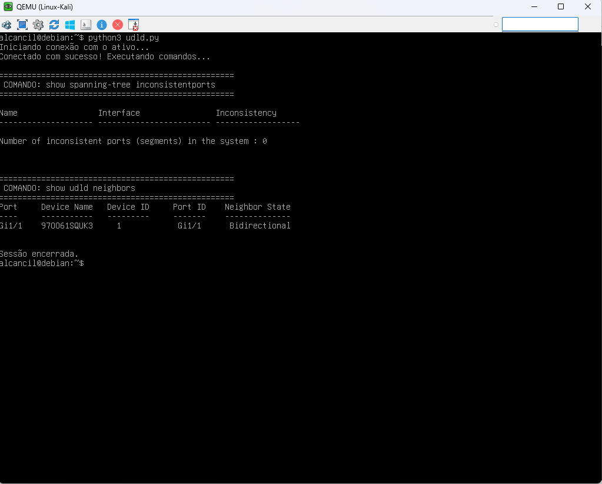

---

## 🧠 O que isso agrega?

Esse detalhe transforma o laboratório em algo:

- profissional
- automatizável
- enterprise
- próximo da realidade operacional

---

## 🔬 Troubleshooting

---

## Comandos Essenciais

```ios
show spanning-tree
show spanning-tree inconsistentports
show spanning-tree interface detail
show udld neighbors
show udld interface
show interfaces status err-disabled
show logging
```

---

## Debugs

```ios
debug spanning-tree events
debug udld events
```

⚠️ Utilize apenas em laboratório.

---

## 📊 Comparativo Técnico

| Recurso     | Objetivo              | Resultado         |
| :---        | :---                  | :---              |
| Loop Guard  | Proteger STP          | Loop-Inconsistent |
| UDLD        | Detectar falha física | Err-disable       |
| BPDU Guard  | Proteger portas edge  | Err-disable       |
| BPDU Filter | Ignorar STP           | Sem proteção      |

---

## ⚠️ Considerações de Produção

## Loop Guard

Ideal para:

- uplinks
- portas redundantes
- alternate ports

Nunca utilizar em:

- portas edge
- dispositivos finais

---

## UDLD

Ideal para:

- fibras ópticas
- uplinks críticos
- EtherChannels
- ambientes enterprise

---

## 🏁 O que Aprendemos

Neste laboratório aprendemos:

- como falhas unidirecionais afetam o STP
- como loops silenciosos surgem
- como o Loop Guard protege a rede
- como o UDLD detecta falhas físicas
- como analisar tudo no Wireshark
- como executar troubleshooting nível CCNP

Mais importante:

> aprendemos comportamento operacional REAL.

Isso aproxima o laboratório de:

- ambientes enterprise
- entrevistas técnicas
- troubleshooting avançado
- operações N2/N3
- engenharia de redes
