# 🧪 Arquivo 14 — STP Avançado: EtherChannel, UplinkFast e BackboneFast

---

## 📌 Sumário

- [🧪 Arquivo 14 — STP Avançado: EtherChannel, UplinkFast e BackboneFast](#-arquivo-14--stp-avançado-etherchannel-uplinkfast-e-backbonefast)
  - [📌 Sumário](#-sumário)
  - [📘 Visão Geral](#-visão-geral)
  - [🎯 Objetivo do Documento](#-objetivo-do-documento)
  - [🏗️ Contexto: Por Que Este Laboratório Importa no Mercado](#️-contexto-por-que-este-laboratório-importa-no-mercado)
  - [📖 Glossário Técnico](#-glossário-técnico)
  - [🖥️ Ambiente de Laboratório (Montagem)](#️-ambiente-de-laboratório-montagem)
    - [Equipamentos](#equipamentos)
  - [🧱 Topologia do Laboratório](#-topologia-do-laboratório)
    - [Cenário](#cenário)
  - [⚙️ Configuração Base (Pré-requisito)](#️-configuração-base-pré-requisito)
    - [🧪 Laboratório 1 — EtherChannel \& STP (O Impacto do Custo Lógico)](#-laboratório-1--etherchannel--stp-o-impacto-do-custo-lógico)
    - [🧠 Entendendo o Cenário](#-entendendo-o-cenário)
    - [🎯 Objetivo do laboratório](#-objetivo-do-laboratório)
    - [🛠️ Passo a Passo de Configuração](#️-passo-a-passo-de-configuração)
      - [Passo 1: Verificar o estado atual (ANTES do EtherChannel)](#passo-1-verificar-o-estado-atual-antes-do-etherchannel)
      - [Passo 2: Configurar EtherChannel entre SW\_CORE e SW\_ACC01](#passo-2-configurar-etherchannel-entre-sw_core-e-sw_acc01)
    - [💡 Explicação do modo active](#-explicação-do-modo-active)
    - [Passo 3: Verificar o EtherChannel](#passo-3-verificar-o-etherchannel)
    - [🎯 O que significa](#-o-que-significa)
    - [Passo 4: Verificar a banda total do Port-Channel](#passo-4-verificar-a-banda-total-do-port-channel)
    - [Passo 5: Verificar o STP após o EtherChannel](#passo-5-verificar-o-stp-após-o-etherchannel)
    - [🎯 Análise da saída:](#-análise-da-saída)
    - [Passo 6: Verificar que nenhuma porta física está bloqueada](#passo-6-verificar-que-nenhuma-porta-física-está-bloqueada)
  - [📡 Capturas Wireshark para Aprofundamento](#-capturas-wireshark-para-aprofundamento)
    - [Captura 1: LACP - O Protocolo que Cria o Bundle](#captura-1-lacp---o-protocolo-que-cria-o-bundle)
  - [Captura 3: Falha de Link Físico - O STP Nem Percebe!](#captura-3-falha-de-link-físico---o-stp-nem-percebe)
    - [Captura 4: Falha Total do Bundle - Agora o STP Reage](#captura-4-falha-total-do-bundle---agora-o-stp-reage)
    - [📊 Comparativo: Antes vs Depois do EtherChannel](#-comparativo-antes-vs-depois-do-etherchannel)
    - [🔍 Comandos de Verificação para este Laboratório](#-comandos-de-verificação-para-este-laboratório)
    - [Verificar o EtherChannel](#verificar-o-etherchannel)
    - [Verificar a banda agregada](#verificar-a-banda-agregada)
    - [](#)
    - [Verificar as portas físicas individuais](#verificar-as-portas-físicas-individuais)
    - [Verificar logs de eventos LACP](#verificar-logs-de-eventos-lacp)
  - [⚠️ Troubleshooting Comum](#️-troubleshooting-comum)
    - [O que você aprendeu neste laboratório](#o-que-você-aprendeu-neste-laboratório)
  - [🧪 Laboratório 2 — UplinkFast (Convergência Local Imediata)](#-laboratório-2--uplinkfast-convergência-local-imediata)
    - [🧠 Entendendo o Cenário](#-entendendo-o-cenário-1)
    - [🎯 Objetivo do laboratório](#-objetivo-do-laboratório-1)
    - [🛠️ Passo a Passo de Configuração](#️-passo-a-passo-de-configuração-1)
      - [Passo 1: Verificar a topologia antes do UplinkFast](#passo-1-verificar-a-topologia-antes-do-uplinkfast)
      - [Passo 2: Habilitar o UplinkFast no switch de acesso](#passo-2-habilitar-o-uplinkfast-no-switch-de-acesso)
      - [Passo 3: Analisar os efeitos colaterais do comando](#passo-3-analisar-os-efeitos-colaterais-do-comando)
      - [Passo 4: Testar a convergência rápida – Evidências práticas](#passo-4-testar-a-convergência-rápida--evidências-práticas)
      - [Passo 5: Comprovação adicional – A porta alternativa realmente estava em blocking?](#passo-5-comprovação-adicional--a-porta-alternativa-realmente-estava-em-blocking)
      - [🔍 Comandos de verificação para este laboratório](#-comandos-de-verificação-para-este-laboratório-1)
      - [⚠️ Considerações importantes (para prova e produção)](#️-considerações-importantes-para-prova-e-produção)
      - [🎓 UplinkFast elimina os 30 segundos de espera em falhas diretas de uplink.](#-uplinkfast-elimina-os-30-segundos-de-espera-em-falhas-diretas-de-uplink)
      - [✅ Checklist de conclusão do Laboratório 2](#-checklist-de-conclusão-do-laboratório-2)
  - [🧪 Laboratório 3 — BackboneFast (Falhas Indiretas)](#-laboratório-3--backbonefast-falhas-indiretas)
    - [🧠 Entendendo o Cenário](#-entendendo-o-cenário-2)
    - [🎯 Objetivo do laboratório](#-objetivo-do-laboratório-2)
    - [Verificações e Configurações antes do Backbonefast](#verificações-e-configurações-antes-do-backbonefast)
    - [🛠️ Passo a Passo de Configuração do Backbonefast](#️-passo-a-passo-de-configuração-do-backbonefast)
      - [Passo 1: Habilitar o BackboneFast globalmente](#passo-1-habilitar-o-backbonefast-globalmente)
      - [Passo 2: Verificar o estado inicial da topologia](#passo-2-verificar-o-estado-inicial-da-topologia)
      - [Passo 3: Simular a falha indireta](#passo-3-simular-a-falha-indireta)
      - [Passo 4: Observar a convergência acelerada](#passo-4-observar-a-convergência-acelerada)
      - [🔍 Comandos de Verificação e Diagnóstico](#-comandos-de-verificação-e-diagnóstico)
      - [📊 Comparativo Técnico (Atualizado)](#-comparativo-técnico-atualizado)
      - [⚠️ Considerações de Produção (BackboneFast)](#️-considerações-de-produção-backbonefast)
      - [🏁 O que Aprendemos](#-o-que-aprendemos)

---

## 📘 Visão Geral

Para dominar o Spanning Tree Protocol (STP) clássico (802.1D) em ambientes corporativos complexos, é vital compreender os mecanismos criados para mitigar suas duas maiores limitações originais: a **subutilização de links redundantes** e o **tempo de convergência lento (30 a 50 segundos)**.

Este laboratório aborda a interação do STP com agregação de links lógicos (EtherChannel) e ativa as otimizações proprietárias da Cisco (UplinkFast e BackboneFast) que reduzem o tempo de recuperação da rede diante de falhas diretas e indiretas.

---

## 🎯 Objetivo do Documento

Guiar o engenheiro de redes na configuração prática, análise de pacotes e validação de convergência do STP quando associado ao EtherChannel (LACP), UplinkFast e BackboneFast, preparando a base conceitual para a transição para os modos PVST+ e RSTP.

---

## 🏗️ Contexto: Por Que Este Laboratório Importa no Mercado

Embora o Rapid STP (802.1w) possua esses mecanismos de convergência rápida embutidos de forma nativa, o entendimento do **UplinkFast** e **BackboneFast** é o divisor de águas para compreender **como** o STP calcula seus temporizadores. Em redes legadas ou em migrações complexas de data centers e redes de campus, prever o comportamento do custo lógico de um EtherChannel e a injeção de pacotes RLQ (Root Link Query) evita indisponibilidades catastróficas.

---

## 📖 Glossário Técnico

* **EtherChannel (Bundle):** Agrupamento de múltiplas interfaces físicas em um único link lógico (Port-Channel), somando banda e unificando o custo do STP.
* **UplinkFast:** Recurso que acelera a convergência do STP em switches de acesso com links redundantes. Diante de uma falha física direta, ele ignora os estados *Listening/Learning* e coloca a porta de backup imediatamente em *Forwarding*.
* **BackboneFast:** Recurso de otimização que permite a detecção rápida de falhas indiretas no backbone da rede, economizando o tempo de *Max Age* (20 segundos) através de consultas ativas.
* **RLQ (Root Link Query):** PDU específica utilizada pelo BackboneFast para perguntar aos switches vizinhos se eles ainda possuem conectividade com o Root Bridge.
* **Dummy Multicast Frame:** Frame gerado pelo UplinkFast com MAC de origem dos dispositivos da tabela CAM local para forçar a atualização dos switches de distribuição.

---

## 🖥️ Ambiente de Laboratório (Montagem)

### Equipamentos

Para este laboratório, utilizaremos **3 Switches** rodando a imagem Cisco IOL (IOS on Linux) ou vIOS no EVE-NG.

* **SW1** (Será configurado como Root Bridge)
* **SW2** (Switch de Distribuição/Trânsito)
* **SW3** (Switch de Acesso/Borda)

---

## 🧱 Topologia do Laboratório

### Cenário

O design consiste em um triângulo clássico, porém o link entre **SW1** e **SW2** será composto por um bundle de duas interfaces físicas (EtherChannel). O **SW3** possuirá conexões redundantes em direção ao topo da topologia para testarmos as falhas de trânsito.

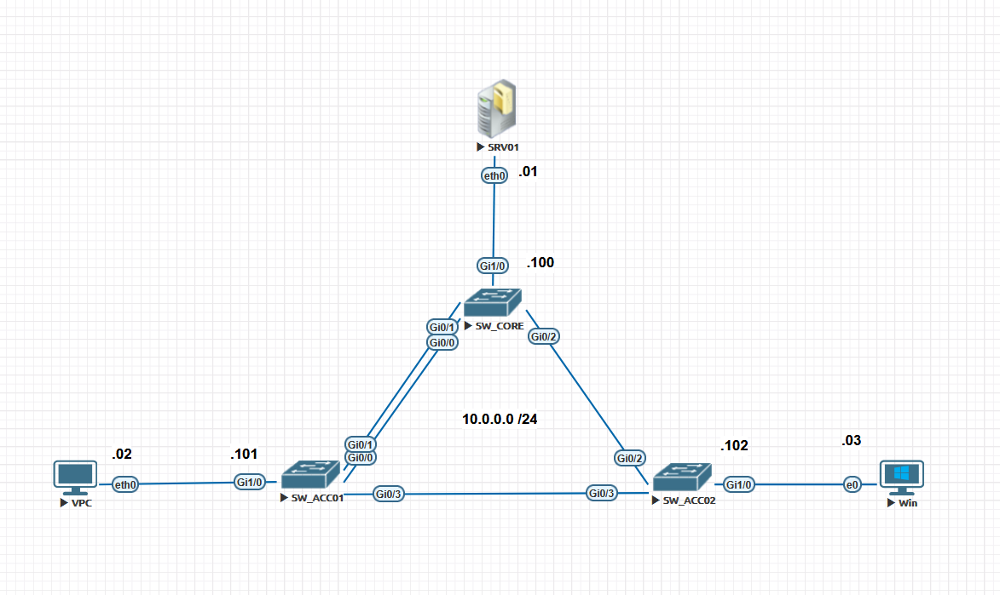

> 📌 Nota de Montagem no EVE-NG:
> Conecte os cabos exatamente nas portas listadas abaixo para facilitar o acompanhamento dos comandos:
> SW1 para SW2: Portas Ethernet0/0 e Ethernet0/1
> SW1 para SW3: Porta Ethernet0/2 -> Conectada na porta Ethernet0/2 do SW3
> SW2 para SW3: Portas Ethernet0/2 e Ethernet0/3 -> Conectadas em Ethernet0/0 e Ethernet0/1 do SW3

## ⚙️ Configuração Base (Pré-requisito)

| **EQUIPAMENTO** | **IP**         | **MÁSCARA**   |
| :---            | :---           | :---          |
| **SRV01**       | 10.0.0.1       | 255.255.255.0 |
| **VPC01**       | 10.0.0.2       | 255.255.255.0 |
| **VPC02**       | 10.0.0.3       | 255.255.255.0 |
| **SW_CORE**     | 10.0.0.100     | 255.255.255.0 |
| **SW_ACC01**    | 10.0.0.101     | 255.255.255.0 |
| **SW_ACC02**    | 10.0.0.102     | 255.255.255.0 |

Garantir que todos os switches estejam operando com o Spanning Tree clássico baseado em PVST+ antes de iniciarmos as customizações.
  
**Em todos os switches (SW1, SW2, SW3)**  

```ios
spanning-tree mode pvst
spanning-tree vlan 1 priority 32768
```

Force o SW1 a ser o Root Bridge absoluto:Snippet de código!

No SW1

```ios
spanning-tree vlan 1 priority 4096
```

### 🧪 Laboratório 1 — EtherChannel & STP (O Impacto do Custo Lógico)

---

### 🧠 Entendendo o Cenário

**Problema original sem EtherChannel:**

- Se você tem 2 links físicos entre SW_CORE e SW_ACC01, o STP bloquearia UMA das portas (Alternate/Blocking) para evitar loop.
- Isso significa **50% da sua banda fica ociosa**.

**Solução com EtherChannel:**

- O EtherChannel **agrupa as 2 portas físicas em 1 porta lógica** (Port-Channel).
- Para o STP, existe **apenas 1 link** entre os switches.
- Portanto: **nenhuma porta física é bloqueada** → você usa 100% da banda disponível.

**Efeito no custo do STP:**

- O STP recalcula o custo do Port-Channel baseado na **soma das velocidades** das portas físicas.
- Exemplo prático (GigabitEthernet):
  - 1 porta Gb = custo 4
  - 2 portas Gb em EtherChannel = custo **3** (equivalente a ~2Gb)
  - 3 portas Gb = custo **2** (~3Gb)
  - 4 portas Gb = custo **1** (~4Gb)

**O que você vai observar:**

- Antes do EtherChannel: SW_ACC01 via dois caminhos físicos para o Root (SW_CORE) → um é bloqueado.
- Depois do EtherChannel: SW_ACC01 vê UM caminho lógico (Po1) com custo **menor** que qualquer porta física isolada.

---

### 🎯 Objetivo do laboratório

- Configurar um EtherChannel LACP dinâmico entre SW_CORE e SW_ACC01.
- Observar a alteração do custo do STP na interface Port-Channel.
- Validar que nenhuma porta física fica em estado de blocking após o bundle.
- Comparar a convergência do STP antes e depois do EtherChannel.

---

### 🛠️ Passo a Passo de Configuração

---

#### Passo 1: Verificar o estado atual (ANTES do EtherChannel)

Antes de configurar, vamos ver como o STP se comporta com 2 links físicos separados.

**No SW_ACC01:**  

```ios
SW_ACC01#show spanning-tree vlan 1 | begin Interface
```

Saída esperada (antes):

```ios

Interface           Role Sts Cost      Prio.Nbr Type
------------------- ---- --- --------- -------- --------------------------------
Gi0/0               Root FWD 4         128.1    P2p
Gi0/1               Altn BLK 4         128.2    P2p    <--- UMA PORTA BLOQUEADA!
```

> 📌 **Observe:** Uma das portas físicas está em Altn BLK (Alternate/Blocking). Você está perdendo 50% da banda disponível.

#### Passo 2: Configurar EtherChannel entre SW_CORE e SW_ACC01

**No SW_CORE:**  

```ios
configure terminal
interface range gigabitethernet 0/0 - 1
 channel-group 1 mode active
 shutdown
 no shutdown
 exit
```

**No SW_ACC01:**

```ios
configure terminal
interface range gigabitethernet 0/0 - 1
 channel-group 1 mode active
 shutdown
 no shutdown
 exit
```

### 💡 Explicação do modo active

- **active** = LACP ativo (inicia negociação)
- **passive** = LACP passivo (responde, não inicia)
- **on** = modo estático (sem LACP, não recomendado)

### Passo 3: Verificar o EtherChannel

Em qualquer um dos switches:

```ios
SW_ACC01#show etherchannel summary
```

Saída esperada:

```ios

Flags:  D - down        P - bundled in port-channel
        I - stand-alone s - suspended
        H - Hot-standby (LACP only)
        R - Layer3      S - Layer2
        U - in use      f - failed to allocate aggregator

Number of channel-groups in use: 1

Group Port-channel  Protocol    Ports
------+-------------+-----------+-----------------------------------------------
1      Po1(SU)        LACP       Gi0/0(P)   Gi0/1(P)
```
  
### 🎯 O que significa

- **Po1(SU)** = Port-channel 1, Layer2 (S), em uso (U)
- **Gi0/0(P)** = Porta física "bundled" (agrupada com sucesso)
- **Gi0/1(P)** = Porta física "bundled"

### Passo 4: Verificar a banda total do Port-Channel

```ios
SW_ACC01#show interfaces port-channel 1 | include Bandwidth
```

Saída esperada:

```ios
  MTU 1500 bytes, BW 2000000 Kbit, DLY 10 usec, reliability 255/255, txload 1/255, rxload 1/255
```

> 📌 BW 2000000 Kbit = 2 Gbps → O IOS somou a banda das duas portas Gigabit!

**OBSERVÇÃO:** por alguma limitação de imagem ou do próprio EVE-NG o comando acima não retorna a resposta. Portanto iremos verificar assim:

```ios
SW_ACC01#show interfaces port-channel 1 | include Bandwidth
SW_ACC01#show interfaces port-channel 1
Port-channel1 is up, line protocol is up (connected)
  Hardware is EtherChannel, address is 5000.0002.0000 (bia 5000.0002.0000)
  MTU 1500 bytes, BW 2000000 Kbit/sec, DLY 10 usec,
     reliability 255/255, txload 1/255, rxload 1/255
  Encapsulation ARPA, loopback not set
  Keepalive set (10 sec)
  Full-duplex, Auto-speed, media type is RJ45
  input flow-control is off, output flow-control is unsupported
  Members in this channel: Gi0/0 Gi0/1
  ARP type: ARPA, ARP Timeout 04:00:00
  Last input 00:00:01, output never, output hang never
  Last clearing of "show interface" counters never
  Input queue: 0/2000/0/0 (size/max/drops/flushes); Total output drops: 0
  Queueing strategy: fifo
  Output queue: 0/40 (size/max)
  5 minute input rate 0 bits/sec, 0 packets/sec
  5 minute output rate 0 bits/sec, 0 packets/sec
     4208 packets input, 249142 bytes, 0 no buffer
     Received 0 broadcasts (0 multicasts)
     0 runts, 0 giants, 0 throttles
     0 input errors, 0 CRC, 0 frame, 0 overrun, 0 ignored
     0 input packets with dribble condition detected
     1964 packets output, 247753 bytes, 0 underruns
     0 output errors, 0 collisions, 0 interface resets
     0 unknown protocol drops
     0 babbles, 0 late collision, 0 deferred
     0 lost carrier, 0 no carrier
     0 output buffer failures, 0 output buffers swapped out
SW_ACC01#show interfaces port-channel 1 | include Mtu
SW_ACC01#show interfaces port-channel 1 | include MTU
  MTU 1500 bytes, BW 2000000 Kbit/sec, DLY 10 usec,
SW_ACC01#
```

### Passo 5: Verificar o STP após o EtherChannel

```ios
SW_ACC01#show spanning-tree vlan 1
```

Saída esperada:

```ios

VLAN0001
  Spanning tree enabled protocol ieee
  Root ID    Priority    4097
             Address     5000.0001.0000
             Cost        3
             Port        65 (Port-channel1)
             Hello Time   2 sec  Max Age 20 sec  Forward Delay 15 sec

  Bridge ID  Priority    32769  (priority 32768 sys-id-ext 1)
             Address     5000.0002.0000
             Hello Time   2 sec  Max Age 20 sec  Forward Delay 15 sec
             Aging Time  300 sec

Interface           Role Sts Cost      Prio.Nbr Type
------------------- ---- --- --------- -------- --------------------------------
Gi0/2               Desg FWD 4         128.3    P2p
Gi0/3               Desg FWD 4         128.4    P2p
Po1                 Root FWD 3         128.65   P2p
```

### 🎯 Análise da saída:

- **Root ID Cost** = 3 → Distância até o Root Bridge agora é 3 (antes era 4)
- **Port** = 65 (Port-channel1) → O caminho para o Root é o link lógico
- **Po1 Role** = Root e Sts = FWD → Porta lógica é a Root Port

> Cadê o **Gi0/0 e Gi0/1**? Eles sumiram da lista do STP porque agora fazem parte do Po1!

### Passo 6: Verificar que nenhuma porta física está bloqueada

```ios
SW_ACC01#show spanning-tree vlan 1 | include Gi0/0|Gi0/1|Po1
```

Saída esperada:

```ios
Po1                 Root FWD 3         128.65   P2p
```
  
> 📌 Compare com o passo 1: Antes tínhamos Gi0/1 Altn BLK. Agora não aparece nenhuma porta física bloqueada!

Para ver os detalhes das portas físicas individualmente:

```ios
SW_ACC01#show spanning-tree interface gigabitethernet 0/0
SW_ACC01#show spanning-tree interface gigabitethernet 0/1
```

Saída esperada:

```ios
SW_ACC01#show spanning-tree interface gigabitethernet 0/0

Vlan                Role Sts Cost      Prio.Nbr Type
------------------- ---- --- --------- -------- --------------------------------
VLAN0001            Root FWD 3         128.65   P2p
SW_ACC01#show spanning-tree interface gigabitethernet 0/1

Vlan                Role Sts Cost      Prio.Nbr Type
------------------- ---- --- --------- -------- --------------------------------
VLAN0001            Root FWD 3         128.65   P2p
SW_ACC01#

```

> 💡 Observe: Ambas as portas mostram Root FWD e custo 3 - porque agora são controladas pelo Port-channel.

## 📡 Capturas Wireshark para Aprofundamento

### Captura 1: LACP - O Protocolo que Cria o Bundle

**Filtro: lacp**  
  
O que você verá:

- Pacotes LACP sendo trocados a cada 1 segundo
- Cada pacote contém:
  - Partner ID (MAC do switch vizinho)
  - Port Priority e Port Number
  - State (Aggregation capable, In Sync, Collecting, Distributing)

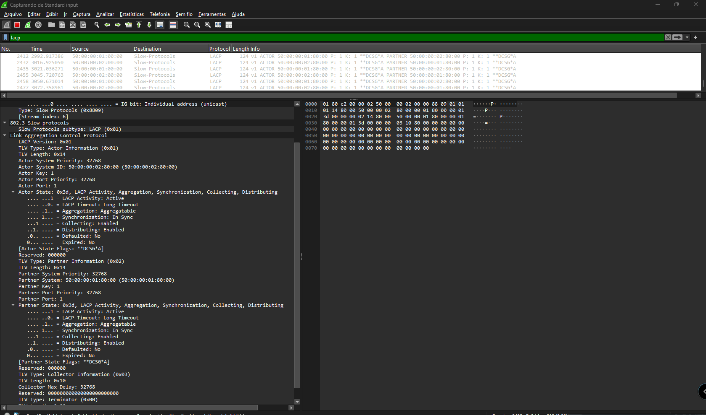

## Captura 3: Falha de Link Físico - O STP Nem Percebe!

Procedimento:
  
Com EtherChannel ativo, mantenha o Wireshark capturando

- Derrube UMA das portas físicas:
  
```ios
    SW_CORE# configure terminal
    SW_CORE(config)# interface gigabitethernet 0/0
    SW_CORE(config-if)# shutdown
```

O que você verá no Wireshark:

- Frame: Pacotes LACP com State mudando de In Sync para Out of Sync
- Frame: O switch para de enviar tráfego pela porta morta
- Frame: O tráfego continua normalmente pela outra porta física
  
O que você NÃO verá:
  
- ❌ Nenhuma BPDU nova
- ❌ Nenhuma transição de estado do STP (Listening/Learning)
- ❌ Nenhum bloqueio/desbloqueio de porta
  
> **Conclusão:** O STP não reagiu porque ainda enxerga o Port-channel 1 normalmente!

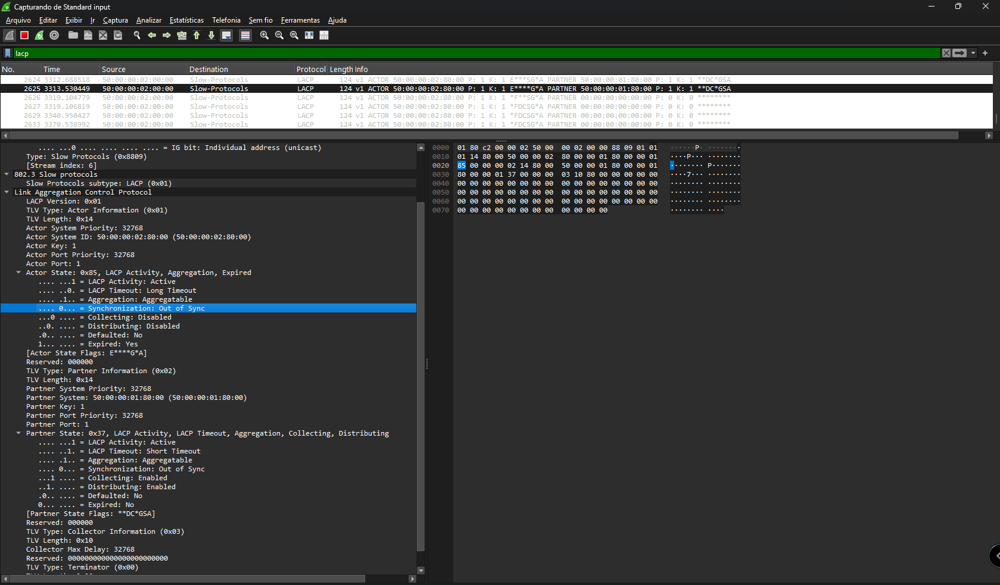  

### Captura 4: Falha Total do Bundle - Agora o STP Reage

Procedimento:

- Derrube a SEGUNDA porta física também:
  
```ios
    SW_CORE(config)# interface gigabitethernet 0/1
    SW_CORE(config-if)# shutdown
```

O que você verá:

- O Port-channel 1 cai completamente
- O STP detecta a falha direta no Po1
- Convergência STP tradicional (30-50 segundos) se não houver UplinkFast

```ios
*May 22 17:30:21.277: %LINEPROTO-5-UPDOWN: Line protocol on Interface GigabitEthernet0/0, changed state to down
*May 22 17:30:28.590: %EC-5-L3DONTBNDL2: Gi0/0 suspended: LACP currently not enabled on the remote port.

*May 22 17:36:32.462: %LINEPROTO-5-UPDOWN: Line protocol on Interface GigabitEthernet0/1, changed state to down
*May 22 17:36:33.463: %LINK-3-UPDOWN: Interface Port-channel1, changed state to down
*May 22 17:36:34.463: %LINEPROTO-5-UPDOWN: Line protocol on Interface Port-channel1, changed state to down
*May 22 17:36:35.216: %LINEPROTO-5-UPDOWN: Line protocol on Interface GigabitEthernet0/0, changed state to up
*May 22 17:36:39.359: %EC-5-L3DONTBNDL2: Gi0/1 suspended: LACP currently not enabled on the remote port.
*May 22 17:36:42.779: %EC-5-L3DONTBNDL2: Gi0/0 suspended: LACP currently not enabled on the remote port.
*May 22 17:36:43.779: %LINEPROTO-5-UPDOWN: Line protocol on Interface GigabitEthernet0/0, changed state to down

SW_ACC01#show etherchannel 1 summary
Flags:  D - down        P - bundled in port-channel
        I - stand-alone s - suspended
        H - Hot-standby (LACP only)
        R - Layer3      S - Layer2
        U - in use      N - not in use, no aggregation
        f - failed to allocate aggregator

        M - not in use, minimum links not met
        m - not in use, port not aggregated due to minimum links not met
        u - unsuitable for bundling
        w - waiting to be aggregated
        d - default port

        A - formed by Auto LAG


Number of channel-groups in use: 1
Number of aggregators:           1

Group  Port-channel  Protocol    Ports
------+-------------+-----------+-----------------------------------------------
1      Po1(SD)         LACP      Gi0/0(s)    Gi0/1(s)

SW_ACC01#show etherchannel 1 summary
Flags:  D - down        P - bundled in port-channel
        I - stand-alone s - suspended
        H - Hot-standby (LACP only)
        R - Layer3      S - Layer2
        U - in use      N - not in use, no aggregation
        f - failed to allocate aggregator

        M - not in use, minimum links not met
        m - not in use, port not aggregated due to minimum links not met
        u - unsuitable for bundling
        w - waiting to be aggregated
        d - default port

        A - formed by Auto LAG


Number of channel-groups in use: 1
Number of aggregators:           1

Group  Port-channel  Protocol    Ports
------+-------------+-----------+-----------------------------------------------
1      Po1(SD)         LACP      Gi0/0(s)    Gi0/1(s)
```

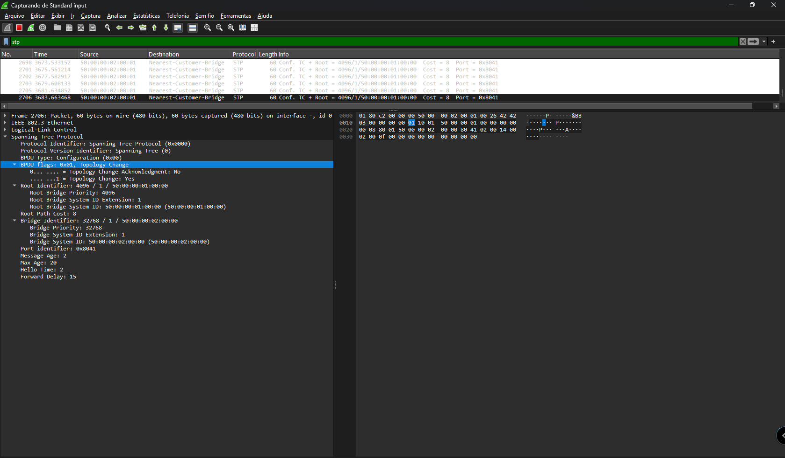  

### 📊 Comparativo: Antes vs Depois do EtherChannel

| **Característica**                     | **Antes do EtherChannel** | **Depois do EtherChannel** |
| :---                                   | :---                      | :---                       |
| Links físicos visíveis ao STP          | 2 (Gi0/0 e Gi0/1)         | 0 (só o Po1)               |
| Portas bloqueadas pelo STP             | 1 (Alternate/Blocking)    | 0                          |
| Banda utilizável                       | 1 Gbps                    | 2 Gbps                     |
| Custo do caminho para o Root           | 4 (pela Root Port ativa)  | 3 (pelo Po1)               |
| Convergência em falha de 1 link físico | 30-50 segundos (STP)      | < 1 segundo (LACP)         |
| Número de BPDUs trafegando             | 2 (uma por link físico)   | 1 (apenas no Po1)          |

### 🔍 Comandos de Verificação para este Laboratório

### Verificar o EtherChannel

- show etherchannel summary
- show etherchannel port-channel
- show etherchannel load-balance

### Verificar a banda agregada

- show interfaces port-channel 1 | include BW

###

Verificar o STP no Port-channel
  
- show spanning-tree vlan 1
- show spanning-tree interface port-channel 1
- show spanning-tree vlan 1 | begin Interface
  
### Verificar as portas físicas individuais
  
- show spanning-tree interface gigabitethernet 0/0
- show spanning-tree interface gigabitethernet 0/1
  
### Verificar logs de eventos LACP
  
- show lacp neighbor
- show lacp internal

## ⚠️ Troubleshooting Comum

| Problema                                      | Possível Causa         | Solução                                                                                             |
| :---                                          | :---                   | :---                                                                                                |
| Port-channel não sobe (portas em I/suspended) | Configuração mismatch  | Verifique show etherchannel summary - portas com "I" estão suspensas. Confira modo LACP (active/passive) em ambos lados |
| Portas não agregam mesmo com LACP             | Velocidades diferentes | Todas as portas do bundle devem ter mesma velocidade e duplex                                       |
| STP ainda mostra portas físicas               | EtherChannel não criado| Verifique se o channel-group foi aplicado em ambas as portas em ambos switches                      |
| Custo continua 4 em vez de 3                  | IOS antigo ou porta não bundle | Confirme que ambas portas estão (P) no show etherchannel summary                            |

### O que você aprendeu neste laboratório

- O EtherChannel cria uma interface lógica que o STP enxerga como um único link
- Nenhuma porta física é bloqueada pelo STP após o bundle - você usa toda a banda disponível
- O custo do STP é reduzido baseado na soma das velocidades das portas físicas
- Falha de um link físico é tratada pelo LACP em < 1 segundo - o STP nem percebe
- Falha total do bundle é tratada como falha de link direto pelo STP

Isso pode cair na prova CCNP ENCOR:

- Entender que channel-group deve ser configurado ANTES de verificar STP
- Saber que LACP (padrão IEEE) é preferível a PAgP (proprietário Cisco)
- Reconhecer que o custo do STP no Port-channel é dinâmico e muda se links físicos caírem

## 🧪 Laboratório 2 — UplinkFast (Convergência Local Imediata)

### 🧠 Entendendo o Cenário

O **SW_ACC02** possui dois caminhos para chegar ao Root Bridge (SW_CORE):

- **Caminho direto** via interface G0/2 (conectada ao SW_CORE)
- **Caminho indireto** passando pelo SW_ACC01 (G0/3 → SW_ACC01 → SW_CORE)

Em condições normais, a porta direta com SW_CORE será a **Root Port** (Root FWD) e a porta com SW_ACC01 ficará em estado de **Blocking** (Altn BLK).  

Se o link direto cair, o STP tradicional demorará **30 segundos** (15s Listening + 15s Learning) para abrir a porta de backup.  
O **UplinkFast** reduz esse tempo para **menos de 1 segundo**.

---

### 🎯 Objetivo do laboratório

- Ativar o UplinkFast no switch de acesso (**SW_ACC02**).
- Simular uma falha direta e observar a transição imediata da porta alternativa.
- Verificar os efeitos colaterais (alteração de prioridade e custo das portas).
- Validar a convergência rápida através de **logs**, **teste de ping** e (se disponível) **captura de tráfego**.

---

### 🛠️ Passo a Passo de Configuração

---

#### Passo 1: Verificar a topologia antes do UplinkFast

No **SW_ACC02**, observe o estado atual do STP:

```ios
SW_ACC02# show spanning-tree vlan 1 | begin Interface
```

Saída esperada (antes da ativação):

```ios  
Interface           Role Sts Cost      Prio.Nbr Type
------------------- ---- --- --------- -------- --------------------------------
Gi0/2               Root FWD 4         128.3    P2p
Gi0/3               Altn BLK 4         128.4    P2p
...
```

```ios
SW_ACC02#show spanning-tree vlan 1 | begin Interface
Interface           Role Sts Cost      Prio.Nbr Type
------------------- ---- --- --------- -------- --------------------------------
Gi0/0               Desg FWD 4         128.1    P2p
Gi0/1               Desg FWD 4         128.2    P2p
Gi0/2               Root FWD 4         128.3    P2p
Gi0/3               Altn BLK 4         128.4    P2p
Gi1/0               Desg FWD 4         128.5    P2p
Gi1/1               Desg FWD 4         128.6    P2p
Gi1/2               Desg FWD 4         128.7    P2p
Gi1/3               Desg FWD 4         128.8    P2p
Gi2/0               Desg FWD 4         128.9    P2p
Gi2/1               Desg FWD 4         128.10   P2p
Gi2/2               Desg FWD 4         128.11   P2p
Gi2/3               Desg FWD 4         128.12   P2p
Gi3/0               Desg FWD 4         128.13   P2p
Gi3/1               Desg FWD 4         128.14   P2p
Gi3/2               Desg FWD 4         128.15   P2p
Gi3/3               Desg FWD 4         128.16   P2p


SW_ACC02#
```

> A porta Gi0/3 está em Altn BLK – é a nossa porta de backup.

#### Passo 2: Habilitar o UplinkFast no switch de acesso

Apenas no SW_ACC02 (nunca em switches de core ou distribuição):

```ios
SW_ACC02(config)# spanning-tree uplinkfast
```

#### Passo 3: Analisar os efeitos colaterais do comando

Execute show spanning-tree novamente:

```ios
SW_ACC02(config)# do show spanning-tree vlan 1
```

Observe as mudanças:

| **Parâmetro**        | **Antes** | **Depois**         | **Motivo**                                            |
| :---                 | :---      | :---               | :---                                                  |
| Prioridade do Bridge | 32769     | 49153              | Para que este switch nunca se torne Root Bridge       |
| Custo das portas     | 4         | 3004 (+3000)       | Para desencorajar que ele se torne switch de trânsito |
| Linha Uplinkfast     | (ausente) | Uplinkfast enabled | Indica que o recurso está ativo                       |

Saída após ativação:

```ios
SW_ACC02(config)#do show spanning-tree vlan 1

VLAN0001
  Spanning tree enabled protocol ieee
  Root ID    Priority    4097
             Address     5000.0001.0000
             Cost        3004
             Port        3 (GigabitEthernet0/2)
             Hello Time   2 sec  Max Age 20 sec  Forward Delay 15 sec

  Bridge ID  Priority    49153  (priority 49152 sys-id-ext 1)
             Address     5000.0003.0000
             Hello Time   2 sec  Max Age 20 sec  Forward Delay 15 sec
             Aging Time  300 sec
  Uplinkfast enabled

Interface           Role Sts Cost      Prio.Nbr Type
------------------- ---- --- --------- -------- --------------------------------
Gi0/0               Desg FWD 3004      128.1    P2p
Gi0/1               Desg FWD 3004      128.2    P2p
Gi0/2               Root FWD 3004      128.3    P2p
Gi0/3               Altn BLK 3004      128.4    P2p
Gi1/0               Desg FWD 3004      128.5    P2p
Gi1/1               Desg FWD 3004      128.6    P2p
Gi1/2               Desg FWD 3004      128.7    P2p
Gi1/3               Desg FWD 3004      128.8    P2p
Gi2/0               Desg FWD 3004      128.9    P2p
Gi2/1               Desg FWD 3004      128.10   P2p
Gi2/2               Desg FWD 3004      128.11   P2p
Gi2/3               Desg FWD 3004      128.12   P2p
Gi3/0               Desg FWD 3004      128.13   P2p
Gi3/1               Desg FWD 3004      128.14   P2p
Gi3/2               Desg FWD 3004      128.15   P2p
Gi3/3               Desg FWD 3004      128.16   P2p


SW_ACC02(config)#
```

> Importante: O acréscimo de 3000 no custo e o aumento da prioridade impedem que este switch de acesso seja eleito como Root ou como ponto de trânsito para outras redes.

#### Passo 4: Testar a convergência rápida – Evidências práticas

A literatura Cisco menciona que o UplinkFast envia Dummy Multicast Frames (quadros multicast com MACs de origem da tabela CAM) para atualizar as tabelas dos switches vizinhos.
Porém, em ambientes virtuais (EVE-NG com imagens IOL/vIOS), esses frames podem não ser gerados. Isso não invalida o funcionamento do recurso – a convergência ainda ocorre em milissegundos.

Utilizaremos três formas de comprovar que o UplinkFast funcionou:
  
**Evidência A: Log do switch (mais imediata)**  

Procedimento:

1. No SW_ACC02, mantenha o terminal com show log ou acompanhe mensagens do console.
2. Derrube a interface Root Port (link direto com SW_CORE):

```ios
SW_ACC02(config)# interface gigabitethernet 0/2
SW_ACC02(config-if)# shutdown
```

Resultado esperado (log):

```ios
*May 22 20:45:30.754: %SPANTREE_FAST-7-PORT_FWD_UPLINK: VLAN0001 GigabitEthernet0/3 moved to Forwarding (UplinkFast).
*May 22 20:45:32.728: %LINK-5-CHANGED: Interface GigabitEthernet0/2, changed state to administratively down
*May 22 20:45:33.728: %LINEPROTO-5-UPDOWN: Line protocol on Interface GigabitEthernet0/2, changed state to down
```
  
> A mensagem PORT_FWD_UPLINK aparece antes mesmo da mensagem de link down – isso prova a transição instantânea.
  
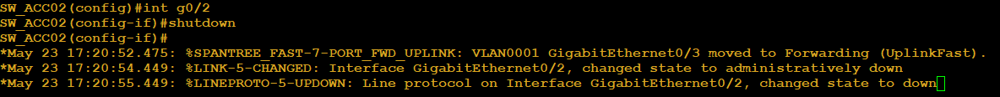  
  
**Evidência B: Teste de ping (medida prática de tempo de convergência)**  
  
Procedimento:
  
1. Conecte um host (VPC01) ao SW_ACC02 e outro host (SRV01) ao SW_CORE.
2. Configure um ping contínuo do VPC01 para SRV01.
3. Enquanto o ping roda, derrube a interface Gi0/2 do SW_ACC02.
4. Conte quantos pings são perdidos.
  
Resultado esperado:
  
- **Sem UplinkFast:** perda de 30 a 50 pings (30-50 segundos)
- **Com UplinkFast:** perda de apenas 1 a 3 pings (1-3 segundos)
  
Agora vamos fazer o seguinte:  

- vamos deixar a interface Gi0/2 como UP
- vamos desabilitar o **uplinkfast**  

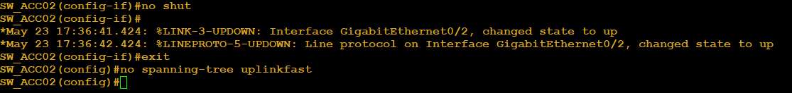  
  
Vamos agora realizar um ping do host **windows** que está conecta a **SW_ACC02** para o **SRV01**  

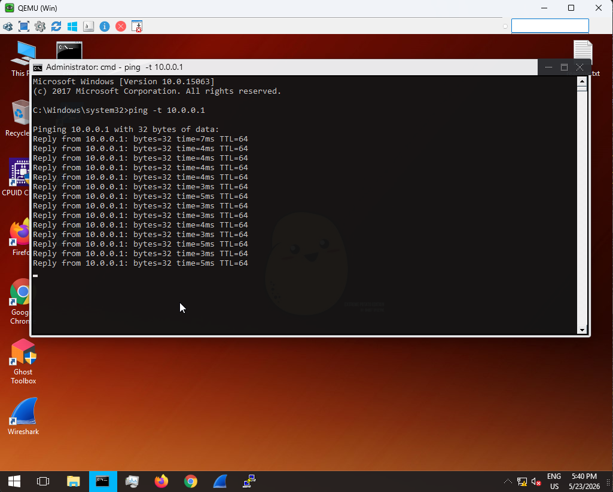  

Certo, como não temos problemas, o ping vai responder normalmente.  
  
Agora vamos derrubar a porta **Gi0/2** do switch **SW_ACC02** e vamos observar o comportamento do ping.

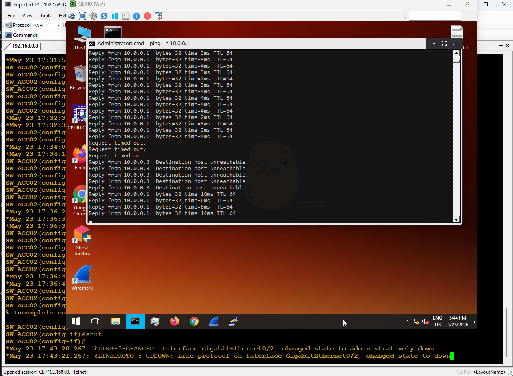  

Como visto na saída, podemos observar que agora o ping perdeu alguns pacotes e depois retornou a responder. O porquê disso ? Bom, isso é o comportamento correo do spanning three. Como uma das portas do switch SW_ACC02, a Gi02 caiu, o STP entra em ação e recalcula a topologia para proteger os caminhas contra loop de camada 2. Porém como stp é lento, isso pode levar até 50 segundos para o stp terminar todo o processo.  

Então agora vamos ativar a mesma porta e ativar o recurso de uplinkfast para observar o comportamento.  

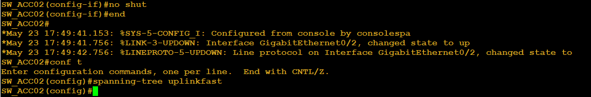

Agora vamos realizar o mesmo ping. No meio do processo vamos derrubar a mesma porta e observar o comportamento do ping.

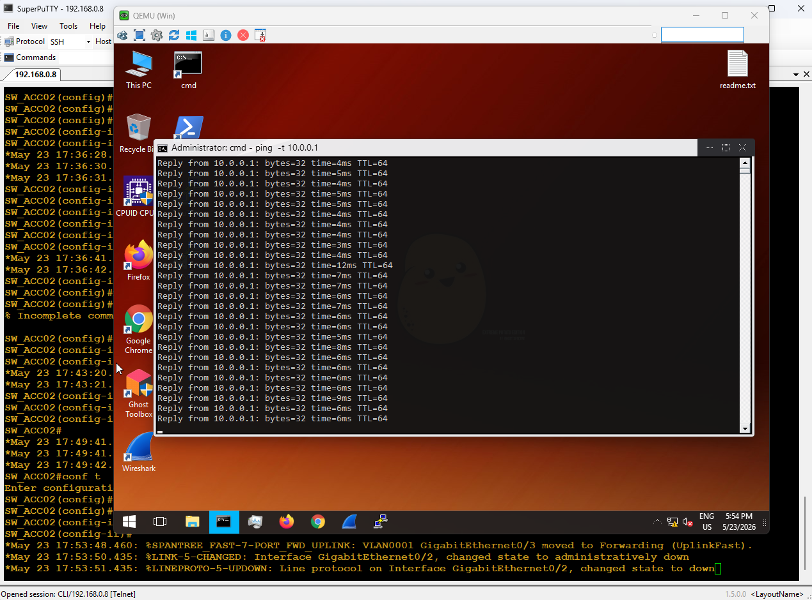

Agora conseguimos comprovar o funcionamento do **uplinkfast**. Podemos observar que agora o ping não perdeu nenhum pacote.

**Evidência C: Verificação do contador de "station updates" (se suportado)**  

```ios
SW_ACC02# show spanning-tree uplinkfast
```

Saída esperada:
  
```ios
UplinkFast is enabled
Station update rate: 150 packets/sec
Number of station updates sent: 0   (pode ser zero em alguns IOS virtuais)
```

> O campo Number of station updates sent indica quantos Dummy Multicasts foram enviados.  
> Se for zero, significa que seu ambiente não gerou esses frames – algo comum em imagens de emulação.  
> Isso não impede que o UplinkFast funcione; a convergência rápida ainda ocorre (provavelmente via TCN + aging acelerado).  
  
```ios
SW_ACC02#show spanning-tree uplinkfast
UplinkFast is enabled

Station update rate set to 150 packets/sec.

UplinkFast statistics
-----------------------
Number of transitions via uplinkFast (all VLANs)            : 1
Number of proxy multicast addresses transmitted (all VLANs) : 0

Name                 Interface List
-------------------- ------------------------------------
VLAN0001             Gi0/3(fwd)
SW_ACC02#
```

#### Passo 5: Comprovação adicional – A porta alternativa realmente estava em blocking?
  
Antes de ativar o UplinkFast, confirme que Gi0/3 estava bloqueada:  
  
```ios
SW_ACC02# show spanning-tree interface gigabitethernet 0/3
```

Saída:  
  
```ios
SW_ACC02#show spanning-tree interface gigabitEthernet 0/3

Vlan                Role Sts Cost      Prio.Nbr Type
------------------- ---- --- --------- -------- --------------------------------
VLAN0001            Altn BLK 4         128.4    P2p
SW_ACC02#
```
  
Após a falha e a ativação do UplinkFast, verifique novamente:  

```ios
SW_ACC02# show spanning-tree interface gigabitethernet 0/3
```
  
Saída esperada:

```ios
VLAN0001            Root FWD 3004      128.4    P2p
```
  
> A porta Gi0/3 tornou-se a nova Root Port, em estado Forwarding, sem passar por Listening/Learning.

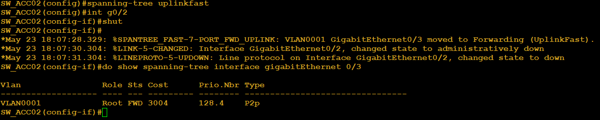

#### 🔍 Comandos de verificação para este laboratório

```ios
# Ativar e verificar o UplinkFast
show spanning-tree uplinkfast

# Verificar a prioridade do bridge e custos alterados
show spanning-tree vlan 1

# Verificar o estado individual das portas
show spanning-tree interface gigabitethernet 0/2
show spanning-tree interface gigabitethernet 0/3

# Verificar logs de eventos
show log | include UPLINKFAST
```

#### ⚠️ Considerações importantes (para prova e produção)

| **Ponto**                         | **Detalhe**                                                                                                      |
| :---                              | :---                                                                                                             |
| Onde configurar?                  | Apenas em switches de acesso (camada de borda) que possuem dois uplinks para a camada de distribuição.           |
| Nunca ativar em core/distribuição | O aumento de prioridade e custo destruiria o design hierárquico da rede.                                         |
| Efeitos colaterais                | O switch se torna menos atraente para ser Root ou ponto de trânsito (prioridade 49152, custo acrescido de 3000). |
| Dummy Multicast                   | Em alguns IOS (especialmente virtuais), esses frames podem não ser gerados. A convergência ainda funciona.       |
| Compatibilidade                   | UplinkFast é proprietário Cisco e só funciona com STP 802.1D (não com RSTP/MSTP).                                |

 Resumo do que aprendemos

#### 🎓 UplinkFast elimina os 30 segundos de espera em falhas diretas de uplink.

- A transição da porta alternativa (de Altn BLK para Root FWD) é instantânea.
- O comando altera prioridade do bridge e custo das portas para evitar que o switch de acesso se torne um ponto de trânsito ou Root.
- O mecanismo de Dummy Multicast (atualização de tabelas CAM) pode não ser reproduzido em ambientes virtuais – mas a convergência rápida é confirmada via logs e teste de ping.
- Na prova CCNP ENCOR, você precisa saber o que o recurso faz, onde aplicá-lo e quais são seus efeitos colaterais, não necessariamente como capturá-lo no Wireshark.

#### ✅ Checklist de conclusão do Laboratório 2
  
- Ativei spanning-tree uplinkfast no SW_ACC02.
- Verifiquei que a prioridade do bridge mudou para 49152 + sys-id-ext.
- Verifiquei que todas as portas tiveram o custo aumentado em 3000.
- Derrubei a interface Gi0/2 (Root Port) e observei o log com %SPANTREE_FAST-7-PORT_FWD_UPLINK.
- Realizei o teste de ping e confirmei perda de menos de 3 segundos.
- Executei show spanning-tree uplinkfast e anotei o contador de station updates.

--- Aleterar Daqui ---

## 🧪 Laboratório 3 — BackboneFast (Falhas Indiretas)

---

### 🧠 Entendendo o Cenário

Considere a seguinte topologia:

- **SW_CORE** = Root Bridge.
- **SW_ACC01** conectado ao SW_CORE (link direto).
- **SW_ACC02** conectado a SW_ACC01 (e **não** diretamente ao SW_CORE).

Se o link entre **SW_CORE e SW_ACC01** cair:

- Para **SW_ACC01**, a falha é **direta** (ele perde o vizinho Root).
- Para **SW_ACC02**, a falha é **indireta** – ele ainda tem seu link com SW_ACC01, mas SW_ACC01 agora está enviando BPDUs inferiores (anunciando‑se como novo Root).

No STP tradicional, o SW_ACC02 levaria **20 segundos (Max Age)** para descartar as BPDUs inferiores e só então reagir.  
O **BackboneFast** elimina esse tempo de espera usando um mecanismo de consulta ativa chamado **RLQ (Root Link Query)**: o switch que recebe uma BPDU inferior pergunta, via RLQ, se o Root ainda está vivo. Se a resposta for positiva, ele descarta imediatamente a BPDU inferior e acelera a convergência.

> ⚠️ **Importante:** Em ambientes virtuais (EVE-NG com imagens IOL/vIOS), o protocolo RLQ pode **não gerar pacotes visíveis** no Wireshark, embora o BackboneFast ainda funcione (pulando o Max Age). Neste laboratório usaremos evidências alternativas – logs, comandos `show` e teste de ping.

---

### 🎯 Objetivo do laboratório

- Ativar o BackboneFast em **todos os switches** da topologia.
- Simular uma falha **indireta** para o switch de acesso (SW_ACC02).
- Observar a redução do tempo de convergência (eliminação dos 20s de Max Age).
- Verificar o funcionamento através de `show spanning-tree backbonefast` e testes práticos.

Agora nosso cenário muda um pouco pois vamos remoe o cabo entre os switchs **SW_CORE** e **SW_ACC0**  

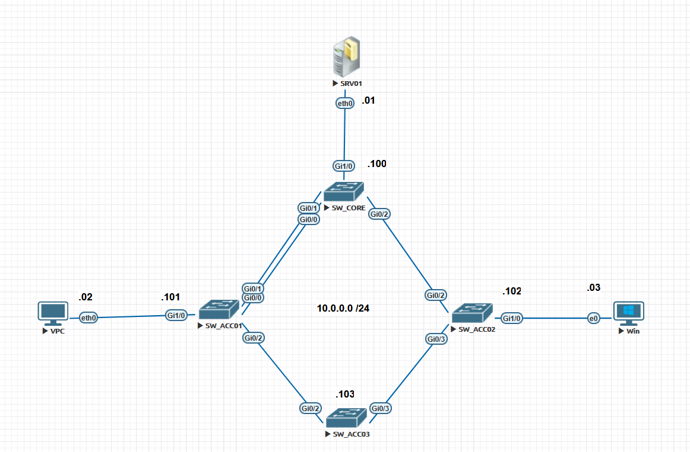

---

### Verificações e Configurações antes do Backbonefast

Antes de começarmos, vamos analisar os switches **SW_ACC02** e **SW_ACC03**.

**SW_ACC02**  

```ios
SW_ACC02#show spanning-tree vlan 1

VLAN0001
  Spanning tree enabled protocol ieee
  Root ID    Priority    4097
             Address     5000.0001.0000
             Cost        4
             Port        3 (GigabitEthernet0/2)
             Hello Time   2 sec  Max Age 20 sec  Forward Delay 15 sec

  Bridge ID  Priority    32769  (priority 32768 sys-id-ext 1)
             Address     5000.0003.0000
             Hello Time   2 sec  Max Age 20 sec  Forward Delay 15 sec
             Aging Time  300 sec

Interface           Role Sts Cost      Prio.Nbr Type
------------------- ---- --- --------- -------- --------------------------------
Gi0/0               Desg FWD 4         128.1    P2p
Gi0/1               Desg FWD 4         128.2    P2p
Gi0/2               Root FWD 4         128.3    P2p
Gi0/3               Desg FWD 4         128.4    P2p
Gi1/0               Desg FWD 4         128.5    P2p
Gi1/1               Desg FWD 4         128.6    P2p
Gi1/2               Desg FWD 4         128.7    P2p
Gi1/3               Desg FWD 4         128.8    P2p
Gi2/0               Desg FWD 4         128.9    P2p
Gi2/1               Desg FWD 4         128.10   P2p
Gi2/2               Desg FWD 4         128.11   P2p
Gi2/3               Desg FWD 4         128.12   P2p
Gi3/0               Desg FWD 4         128.13   P2p
Gi3/1               Desg FWD 4         128.14   P2p
Gi3/2               Desg FWD 4         128.15   P2p
Gi3/3               Desg FWD 4         128.16   P2p


SW_ACC02#
```

**SW_ACC03**  

```ios
SW_ACC03#show spanning-tree vlan 1

VLAN0001
  Spanning tree enabled protocol ieee
  Root ID    Priority    4097
             Address     5000.0001.0000
             Cost        7
             Port        3 (GigabitEthernet0/2)
             Hello Time   2 sec  Max Age 20 sec  Forward Delay 15 sec

  Bridge ID  Priority    32769  (priority 32768 sys-id-ext 1)
             Address     5000.0007.0000
             Hello Time   2 sec  Max Age 20 sec  Forward Delay 15 sec
             Aging Time  300 sec

Interface           Role Sts Cost      Prio.Nbr Type
------------------- ---- --- --------- -------- --------------------------------
Gi0/0               Desg FWD 4         128.1    P2p
Gi0/1               Desg FWD 4         128.2    P2p
Gi0/2               Root FWD 4         128.3    P2p
Gi0/3               Altn BLK 4         128.4    P2p
Gi1/0               Desg FWD 4         128.5    P2p
Gi1/1               Desg FWD 4         128.6    P2p
Gi1/2               Desg FWD 4         128.7    P2p
Gi1/3               Desg FWD 4         128.8    P2p
Gi2/0               Desg FWD 4         128.9    P2p
Gi2/1               Desg FWD 4         128.10   P2p
Gi2/2               Desg FWD 4         128.11   P2p
Gi2/3               Desg FWD 4         128.12   P2p
Gi3/0               Desg FWD 4         128.13   P2p
Gi3/1               Desg FWD 4         128.14   P2p
Gi3/2               Desg FWD 4         128.15   P2p
Gi3/3               Desg FWD 4         128.16   P2p


SW_ACC03#
```

Claramente, como podemos notar, o STP está bloqueando a porta **Gi0/3** no swith **SW_ACC03**. Mas precisamos que o STP bloqueie portas no switch **SW_ACC02**. Então teremos que manipular o STP. Para isso vamos analisar os caminhos para o switch **SW_CORE**.  

Agora temos que analisar os switches **SW_ACC01** e **SW_ACC02** pois são os que estão interligados diretamente ao switch SW_CORE. Então, o STP analisa os caminhos, e o pior caminha será aquele que terá uma porta bloqueada.  

**SW_ACC01**  

```ios
SW_ACC01#show spanning-tree vlan 1 | include Root
  Root ID    Priority    4097
Po1                 Root FWD 3         128.65   P2p
SW_ACC01#
```

**SW_ACCO03**  

```ios
SW_ACC02#show spanning-tree vlan 1 | include Root
  Root ID    Priority    4097
Gi0/2               Root FWD 4         128.3    P2p
SW_ACC02#
```

Podemos notar que o custo da porta **ROOT** em **SW_ACC01** é **3** por se tratar de um bundlle com 2 portas agregadas. Também vemos que o custo da porta **ROOT** em **SW_ACC02** é 4. Ou seja, aqui praticamente temos um empate.  
  
Quem tiver **menor distância para o Root (custo) vence** e mantém sua porta Designated. O outro bloqueia.  
  
Se os custos forem iguais, quem tiver **menor Bridge ID (prioridade menor numericamente, ou MAC menor) mantém Designated**; o outro bloqueia.  
  
Para que a decisão seja controlada pelo **Bridge ID**, force o mesmo custo para ambos. Exemplo: se SW_ACC01 tem custo 8 (via SW_CORE) e SW_ACC02 tem custo 4 (direto), eles não competem. Para igualar, aumente o custo do link direto de SW_ACC02 para SW_CORE:  

**SW_ACC02**  

```ios
SW_ACC02(config)# int g0/2
SW_ACC02(config-if)# spanning-tree vlan 1 cost 8
```

Agora, com custos iguais, **o STP compara Bridge ID (prioridade + MAC)**. Quem tiver menor Bridge ID (prioridade menor numericamente) vence e mantém sua porta Designated. O outro bloqueia.
  
Para que SW_ACC02 bloqueie, ele deve ter Bridge ID maior (prioridade maior numericamente) que SW_ACC01.
  
> Se SW_ACC01 tem prioridade 32768, aumente a prioridade do SW_ACC02 para 49152 (por exemplo):

```ios
SW_ACC02(config)# spanning-tree vlan 1 priority 49152
```

A prioridade padrão é **32768**. Valores maiores (ex: 49152) tornam o switch menos preferível (Bridge ID maior). Certifique-se de que SW_ACC01 continua com 32768 ou menor.
  
Agora vamos verificar os resultados.  

**SW_ACC02**  

```ios
SW_ACC02#show spanning-tree vlan 1 | begin Interface
Interface           Role Sts Cost      Prio.Nbr Type
------------------- ---- --- --------- -------- --------------------------------
Gi0/0               Desg FWD 4         128.1    P2p
Gi0/1               Desg FWD 4         128.2    P2p
Gi0/2               Root FWD 8         128.3    P2p
Gi0/3               Altn BLK 4         128.4    P2p
Gi1/0               Desg FWD 4         128.5    P2p
Gi1/1               Desg FWD 4         128.6    P2p
Gi1/2               Desg FWD 4         128.7    P2p
Gi1/3               Desg FWD 4         128.8    P2p
Gi2/0               Desg FWD 4         128.9    P2p
Gi2/1               Desg FWD 4         128.10   P2p
Gi2/2               Desg FWD 4         128.11   P2p
Gi2/3               Desg FWD 4         128.12   P2p
Gi3/0               Desg FWD 4         128.13   P2p
Gi3/1               Desg FWD 4         128.14   P2p
Gi3/2               Desg FWD 4         128.15   P2p
Gi3/3               Desg FWD 4         128.16   P2p


SW_ACC02#
```

**SW_ACC03**  

```ios
SW_ACC03#show spanning-tree vlan 1 | begin Interface
Interface           Role Sts Cost      Prio.Nbr Type
------------------- ---- --- --------- -------- --------------------------------
Gi0/0               Desg FWD 4         128.1    P2p
Gi0/1               Desg FWD 4         128.2    P2p
Gi0/2               Root FWD 4         128.3    P2p
Gi0/3               Desg FWD 4         128.4    P2p
Gi1/0               Desg FWD 4         128.5    P2p
Gi1/1               Desg FWD 4         128.6    P2p
Gi1/2               Desg FWD 4         128.7    P2p
Gi1/3               Desg FWD 4         128.8    P2p
Gi2/0               Desg FWD 4         128.9    P2p
Gi2/1               Desg FWD 4         128.10   P2p
Gi2/2               Desg FWD 4         128.11   P2p
Gi2/3               Desg FWD 4         128.12   P2p
Gi3/0               Desg FWD 4         128.13   P2p
Gi3/1               Desg FWD 4         128.14   P2p
Gi3/2               Desg FWD 4         128.15   P2p
Gi3/3               Desg FWD 4         128.16   P2p


SW_ACC03#
```

Agora atingimos nosso objetivo: **deixamos a porta Gi0/3 como BLK**  

### 🛠️ Passo a Passo de Configuração do Backbonefast

#### Passo 1: Habilitar o BackboneFast globalmente

O BackboneFast deve estar ativo em **todos os switches** da rede para que as mensagens RLQ (quando suportadas) sejam compreendidas.

**Em SW_CORE, SW_ACC01 e SW_ACC02:**

```ios
configure terminal
spanning-tree backbonefast
end
```

#### Passo 2: Verificar o estado inicial da topologia

Certifique-se de que o SW_ACC02 tem seu único caminho para o Root via SW_ACC01:

```ios
SW_ACC02# show spanning-tree vlan 1 | begin Interface
```

Saída esperada (antes da falha):

```ios
SW_ACC02#show spanning-tree vlan 1 | begin Interface
Interface           Role Sts Cost      Prio.Nbr Type
------------------- ---- --- --------- -------- --------------------------------
Gi0/0               Desg FWD 4         128.1    P2p
Gi0/1               Desg FWD 4         128.2    P2p
Gi0/2               Desg FWD 4         128.3    P2p
Gi0/3               Root FWD 4         128.4    P2p
Gi1/0               Desg FWD 4         128.5    P2p
Gi1/1               Desg FWD 4         128.6    P2p
Gi1/2               Desg FWD 4         128.7    P2p
Gi1/3               Desg FWD 4         128.8    P2p
Gi2/0               Desg FWD 4         128.9    P2p
Gi2/1               Desg FWD 4         128.10   P2p
Gi2/2               Desg FWD 4         128.11   P2p
Gi2/3               Desg FWD 4         128.12   P2p
Gi3/0               Desg FWD 4         128.13   P2p
Gi3/1               Desg FWD 4         128.14   P2p
Gi3/2               Desg FWD 4         128.15   P2p
Gi3/3               Desg FWD 4         128.16   P2p


SW_ACC02#
```

O importante é que o SW_ACC02 não tenha um link direto para SW_CORE – a falha deve ser indireta.

> 💡 **Por que todas as portas aparecem como Designated?**
> O SW_ACC02 possui apenas **uma Root Port** — a `Gi0/3`, que aponta para o SW_ACC01 (caminho até o Root). As demais interfaces (`Gi0/0`, `Gi0/1`, `Gi0/2` e todas as Gi1/x a Gi3/x) estão conectadas a dispositivos finais (VPCs, hosts) ou simplesmente não têm vizinhos com BID menor. Como nenhum switch concorrente melhor está presente nessas portas, o STP as elege automaticamente como Designated — comportamento correto e esperado para um switch de acesso na borda da topologia.
> O importante aqui é confirmar que a **Gi0/3 está como Root FWD** — isso prova que o caminho até o Root passa por SW_ACC01, tornando a falha desse link uma **falha indireta** para o SW_ACC02.

O importante é que o SW_ACC02 não tenha um link direto para SW_CORE — a falha deve ser indireta.

#### Passo 3: Simular a falha indireta

Derrube o link entre SW_CORE e SW_ACC01 (o único caminho de SW_ACC01 para o Root):

```ios
SW_CORE#conf t
Enter configuration commands, one per line.  End with CNTL/Z.
SW_CORE(config)#spanning-tree backbonefast
SW_CORE(config)#int po1
SW_CORE(config-if)#shut
SW_CORE(config-if)#
*May 23 20:58:03.889: %LINK-5-CHANGED: Interface GigabitEthernet0/0, changed state to administratively down
*May 23 20:58:03.921: %LINK-5-CHANGED: Interface GigabitEthernet0/1, changed state to administratively down
*May 23 20:58:03.946: %LINK-5-CHANGED: Interface Port-channel1, changed state to administratively down
*May 23 20:58:04.891: %LINEPROTO-5-UPDOWN: Line protocol on Interface GigabitEthernet0/0, changed state to down
*May 23 20:58:04.921: %LINEPROTO-5-UPDOWN: Line protocol on Interface GigabitEthernet0/1, changed state to down
*May 23 20:58:04.946: %LINEPROTO-5-UPDOWN: Line protocol on Interface Port-channel1, changed state to down
```

#### Passo 4: Observar a convergência acelerada

No SW_ACC02, você verá que a porta de bloqueio (se houver) ou a recálculo da árvore ocorre em ~30 segundos (em vez de ~50 segundos). O ganho está na eliminação dos 20 segundos de Max Age.

**Verificação via logs (se disponível):**  

```ios
SW_ACC02# show log | include BACKBONEFAST
```

**Mensagem esperada (em alguns IOS):**

```ios
%SPANTREE-6-BACKBONEFAST: Received inferior BPDU on port Gi0/0, forcing new root election
```

**Observação:** em nosso laboratório, seja por limitações ou de imagem ou do eve-ng, não foram gerados logs da ação do backbonefast. Mas sim, ele agiu. Vamos verificar.

**Verificação via contador de transições:**

```ios
SW_ACC02# show spanning-tree backbonefast
```

Saída esperada:

```ios
SW_ACC02#show spanning-tree backbonefast
BackboneFast is enabled

BackboneFast statistics
-----------------------
Number of transition via backboneFast (all VLANs)           : 2
Number of inferior BPDUs received (all VLANs)               : 2
Number of RLQ request PDUs received (all VLANs)             : 0
Number of RLQ response PDUs received (all VLANs)            : 2
Number of RLQ request PDUs sent (all VLANs)                 : 2
Number of RLQ response PDUs sent (all VLANs)                : 0
SW_ACC02#
```

> O campo Number of transitions incrementa sempre que o BackboneFast age em uma falha indireta.

#### 🔍 Comandos de Verificação e Diagnóstico

```ios
# Verificar se o BackboneFast está ativo
show spanning-tree backbonefast

# Verificar contador de transições (aumenta a cada falha indireta)
show spanning-tree backbonefast

# Verificar o STP geral
show spanning-tree vlan 1

# Logs de eventos (se houver suporte)
show log | include BACKBONEFAST
```

#### 📊 Comparativo Técnico (Atualizado)

| **Recurso**     | **Tipo de Falha Alvo**            | **Mecanismo de Ação**                           | **Tempo de Convergência**           |
| :---            | :---                              | :---                                            | :---                                |
| STP Tradicional | Qualquer uma                      | Espera passiva dos timers (Max Age + Fwd Delay) | 50 segundos                         |
| EtherChannel    | Falha de link físico do bundle    | Redistribuição de tráfego nos links restantes   | < 1 segundo (LACP)                  |
| UplinkFast      | Falha Direta (link local cai)     | Pula Listening/Learning da porta alternativa    | < 1 segundo                         |
| BackboneFast    | Falha Indireta (no core/backbone) | Elimina o Max Age (20s) via consulta RLQ*       | ~30 segundos (apenas Forward Delay) |

> * Em alguns ambientes virtuais, a RLQ não é gerada, mas a aceleração da convergência ainda ocorre.

#### ⚠️ Considerações de Produção (BackboneFast)

- **Onde usar:** Em todos os switches da infraestrutura que executam STP 802.1D (não RSTP). Ele perde a utilidade se houver switches intermediários que não o suportem.
- **Compatibilidade:** Funciona apenas com STP clássico. Em redes com RSTP (802.1w) ou MSTP, o BackboneFast é desnecessário (o próprio RSTP já lida com falhas indiretas via Proposal/Agreement).
- **Limitação em emuladores:** Imagens virtuais (IOL, vIOS) podem não implementar o envio de pacotes RLQ, mas o recurso ainda acelera a convergência. Em equipamentos físicos Cisco, a captura Wireshark mostraria as PDUs tipo 0x04 (RLQ Request) e 0x05 (RLQ Reply).

#### 🏁 O que Aprendemos

- O BackboneFast elimina os 20 segundos de Max Age em falhas indiretas, reduzindo a convergência de ~50s para ~30s.
- Ele é ativado com spanning-tree backbonefast em todos os switches.
- O mecanismo usa RLQ (Root Link Query) – um protocolo de consulta ativa que pergunta se o Root Bridge ainda está vivo.
- Em ambientes virtuais (EVE-NG com IOL), as PDUs RLQ podem não aparecer no Wireshark, mas o funcionamento pode ser comprovado via show spanning-tree backbonefast (contador de transições) e teste de ping.
