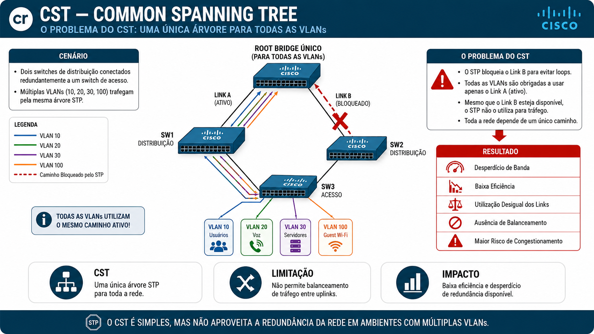
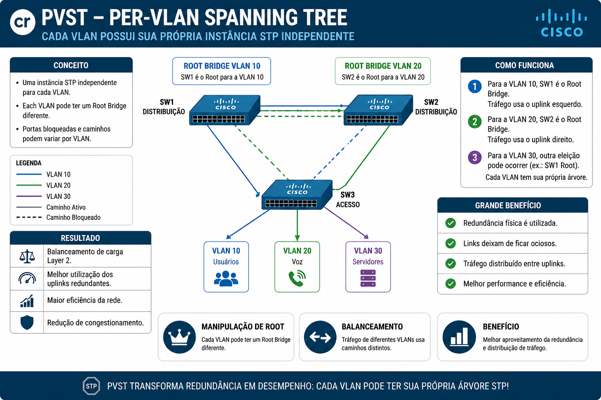
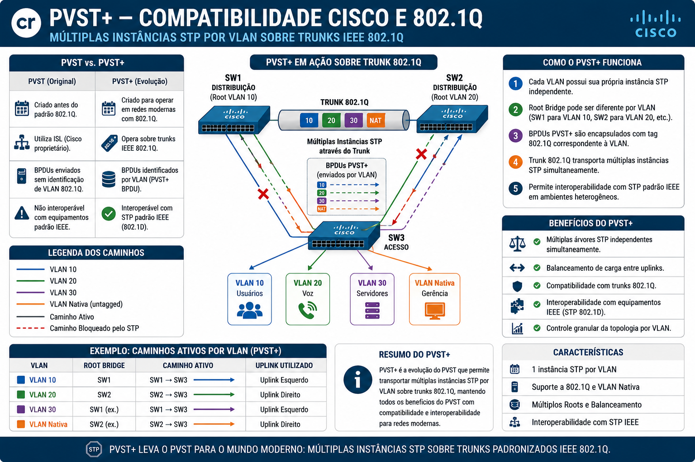
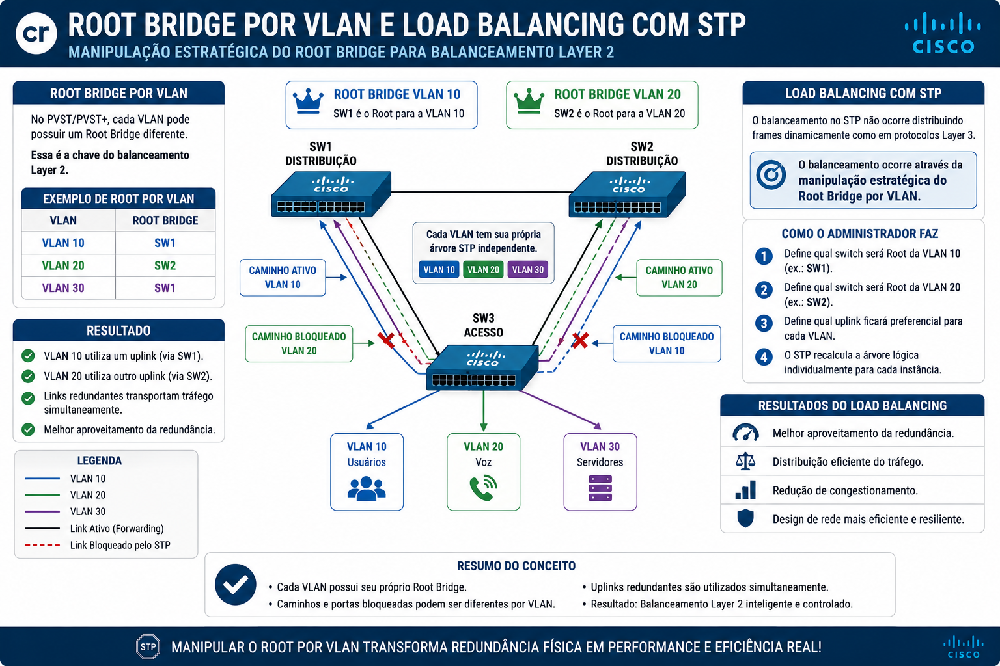

# 🛡️ Arquivo 15 — STP Multi-VLAN: CST, PVST e PVST+

---

## 📌 Sumário

- [🛡️ Arquivo 15 — STP Multi-VLAN: CST, PVST e PVST+](#️-arquivo-15--stp-multi-vlan-cst-pvst-e-pvst)
  - [📌 Sumário](#-sumário)
  - [🎯 Objetivo do Documento](#-objetivo-do-documento)
  - [🏗️ Contexto: O Problema do STP em Redes Multi-VLAN](#️-contexto-o-problema-do-stp-em-redes-multi-vlan)
- [📖 Glossário Técnico](#-glossário-técnico)
  - [📖 Como Este Documento Deve Ser Lido](#-como-este-documento-deve-ser-lido)
  - [🌲 CST — Common Spanning Tree](#-cst--common-spanning-tree)
  - [O Problema do CST](#o-problema-do-cst)
  - [Características do CST](#características-do-cst)
  - [🌲 PVST — Per-VLAN Spanning Tree](#-pvst--per-vlan-spanning-tree)
  - [O Grande Benefício do PVST](#o-grande-benefício-do-pvst)
  - [Características do PVST](#características-do-pvst)
  - [🌲 PVST+ — Compatibilidade Cisco e 802.1Q](#-pvst--compatibilidade-cisco-e-8021q)
  - [Como o PVST+ Funciona](#como-o-pvst-funciona)
  - [Características do PVST+](#características-do-pvst-1)
  - [⚖️ Comparação Entre CST, PVST e PVST+](#️-comparação-entre-cst-pvst-e-pvst)
  - [⚙️ Root Bridge por VLAN](#️-root-bridge-por-vlan)
  - [⚖️ Load Balancing com STP](#️-load-balancing-com-stp)
  - [🚧 Limitações do PVST+](#-limitações-do-pvst)
  - [💻 Comandos de Verificação e Configuração](#-comandos-de-verificação-e-configuração)
  - [Verificar Root Bridge por VLAN](#verificar-root-bridge-por-vlan)
  - [Definir Root Primário](#definir-root-primário)
  - [Definir Root Secundário](#definir-root-secundário)
  - [Ajustar prioridade manualmente](#ajustar-prioridade-manualmente)
  - [Verificar trunks](#verificar-trunks)
  - [Verificar estado das portas STP](#verificar-estado-das-portas-stp)
  - [Verificar instâncias por VLAN](#verificar-instâncias-por-vlan)
  - [⚠️ Problemas Comuns e Troubleshooting](#️-problemas-comuns-e-troubleshooting)
  - [Root Bridge inesperado](#root-bridge-inesperado)
  - [Load balancing não acontece](#load-balancing-não-acontece)
  - [Excessivas instâncias STP](#excessivas-instâncias-stp)
  - [📋 Resumo](#-resumo)
  - [🧪 Pronto para Testar seu Conhecimento?](#-pronto-para-testar-seu-conhecimento)

---

## 🎯 Objetivo do Documento

Este documento explica como o STP evoluiu de uma única árvore lógica para múltiplas instâncias por VLAN, permitindo melhor utilização da redundância da rede, balanceamento de tráfego Layer 2 e maior controle operacional em ambientes Cisco.

Além de apresentar os conceitos de **CST**, **PVST** e **PVST+**, este material demonstra como a Cisco transformou o comportamento do STP tradicional para operar eficientemente em ambientes corporativos modernos com múltiplas VLANs.

---

## 🏗️ Contexto: O Problema do STP em Redes Multi-VLAN

O STP clássico nasceu em uma época onde as redes eram relativamente simples:
  
- poucas VLANs,
- poucos switches,
- pouca segmentação,
- baixo volume de tráfego.
  
Naquele cenário, uma única árvore lógica resolvia o problema dos loops.
  
Mas as redes evoluíram.
  
As VLANs passaram a separar:
  
- usuários,
- servidores,
- voz,
- gerenciamento,
- Wi-Fi,
- segurança,
- datacenter.
  
E então surgiu o problema:
  
> Como o STP se comporta quando existem várias VLANs simultaneamente?
  
O STP tradicional não diferencia VLANs. Ele enxerga toda a rede como uma única topologia lógica.
  
Isso cria uma limitação importante:

- todas as VLANs utilizam os mesmos caminhos,
- o mesmo Root Bridge,
- os mesmos links ativos,
- os mesmos links bloqueados.

Mesmo existindo múltiplos uplinks redundantes, apenas um conjunto de links é utilizado para toda a rede.

O resultado é desperdício de redundância.

Imagine uma rodovia com quatro pistas disponíveis, mas onde todas as faixas obrigatoriamente usam apenas uma única pista enquanto as outras ficam vazias. A rede possui capacidade física, mas o protocolo não consegue aproveitá-la.

Foi exatamente para resolver esse problema que surgiram:

- CST,
- PVST,
- PVST+,
- Rapid-PVST+,
- MSTP.

---

# 📖 Glossário Técnico

| **Termo**                           | **O que significa na prática**                                              |
|:---                                 |:---                                                                         |
| **CST** *(Common Spanning Tree)*    | Uma única instância STP compartilhada por toda a rede.                      |
| **PVST** *(Per-VLAN Spanning Tree)* | Implementação Cisco que cria uma instância STP separada para cada VLAN.     |
| **PVST+**                           | Evolução do PVST compatível com trunks 802.1Q.                              |
| **Rapid-PVST+**                     | Implementação Cisco do RSTP operando por VLAN.                              |
| **Root Bridge**                     | Switch considerado o centro lógico da árvore STP.                           |
| **Instância STP**                   | Processo lógico independente do protocolo STP.                              |
| **Load Balancing Layer 2**          | Distribuição de tráfego entre uplinks utilizando diferentes roots por VLAN. |
| **802.1Q**                          | Padrão IEEE para trunking de VLANs.                                         |
| **BPDU**                            | Frame de controle usado pelo STP para troca de informações.                 |
| **Native VLAN**                     | VLAN transmitida sem tag em trunks 802.1Q.                                  |

---

## 📖 Como Este Documento Deve Ser Lido

1. Primeiro, entenda a limitação do STP clássico em redes multi-VLAN.
2. Depois, compreenda como o CST mantém apenas uma árvore lógica.
3. Em seguida, veja como o PVST cria múltiplas instâncias independentes.
4. Analise como o PVST+ resolve a compatibilidade com trunks 802.1Q.
5. Por fim, entenda como a manipulação de Root Bridge permite balanceamento de carga Layer 2.

---

## 🌲 CST — Common Spanning Tree

O **CST (Common Spanning Tree)** representa o modelo mais simples possível:
  
> Uma única árvore STP para toda a rede.

Não importa quantas VLANs existam:
  
- VLAN 10,
- VLAN 20,
- VLAN 30,
- VLAN 100,

todas utilizam:
  
- o mesmo Root Bridge,
- os mesmos caminhos,
- os mesmos links ativos,
- os mesmos links bloqueados.

---

## O Problema do CST

A simplicidade do CST traz uma limitação operacional importante.

Imagine dois uplinks redundantes:
  
- Link A
- Link B

O STP bloqueará um deles para evitar loops.

O problema é que:
  
> TODAS as VLANs serão obrigadas a utilizar apenas o mesmo uplink ativo.

Mesmo que:
  
- o Link B esteja disponível,
- o tráfego esteja congestionado,
- existam múltiplas VLANs independentes,

o STP continuará usando apenas uma única árvore lógica.

O resultado é:
  
- desperdício de banda,
- baixa eficiência,
- utilização desigual dos links,
- ausência de balanceamento.



---

## Características do CST

| Característica         | Comportamento |
|:---                    |:---           |
| Número de instâncias   | 1             |
| Root Bridge            | Único         |
| Balanceamento por VLAN | ❌            |
| Escalabilidade         | Alta          |
| Complexidade           | Baixa         |

---

## 🌲 PVST — Per-VLAN Spanning Tree

A Cisco percebeu que redes corporativas modernas precisavam de algo mais inteligente.

Assim surgiu o:
  
> PVST — Per-VLAN Spanning Tree.

A ideia é simples e poderosa:
  
> Cada VLAN possui sua própria instância STP independente.

Agora:
  
- VLAN 10 pode usar um caminho,
- VLAN 20 pode usar outro,
- VLAN 30 pode usar outro.

Cada VLAN pode inclusive possuir:
  
- Root Bridge diferente,
- portas bloqueadas diferentes,
- caminhos diferentes.

---

## O Grande Benefício do PVST

O PVST transforma redundância física em capacidade útil.

Agora os uplinks deixam de ficar ociosos.

Exemplo:
  
- VLAN 10 utiliza SW1 como Root.
- VLAN 20 utiliza SW2 como Root.

Resultado:
  
- os dois uplinks são utilizados simultaneamente,
- o tráfego é distribuído,
- a redundância passa a gerar performance.



---

## Características do PVST

| Característica       | Comportamento        |
|:---                  |:---                  |
| Número de instâncias | 1 por VLAN           |
| Root Bridge          | Pode variar por VLAN |
| Balanceamento        | ✅                   |
| Escalabilidade       | Média                |
| Complexidade         | Média                |

---

## 🌲 PVST+ — Compatibilidade Cisco e 802.1Q

O PVST original foi criado antes da popularização do padrão IEEE 802.1Q.

Com a evolução dos trunks padronizados, surgiu um novo desafio:
  
> Como transportar múltiplas instâncias STP sobre trunks 802.1Q?

A Cisco então criou o:
  
> PVST+

O PVST+ mantém:
  
- uma instância STP por VLAN,
- múltiplos roots,
- balanceamento de tráfego,

mas adiciona compatibilidade com:
  
- trunks 802.1Q,
- VLAN nativa,
- interoperabilidade com STP padrão IEEE.

---

## Como o PVST+ Funciona

O PVST+ envia BPDUs separadas para cada VLAN através dos trunks.

Isso permite:
  
- múltiplas árvores lógicas simultâneas,
- independência entre VLANs,
- balanceamento Layer 2,
- controle granular da topologia.



---

## Características do PVST+

| Característica         | Comportamento |
|:---                    |:---           |
| Número de instâncias   | 1 por VLAN    |
| Compatibilidade 802.1Q | ✅            |
| Balanceamento          | ✅            |
| Interoperabilidade     | ✅            |
| Uso em ambientes Cisco | Muito comum   |

---

## ⚖️ Comparação Entre CST, PVST e PVST+

| Tecnologia  | Instâncias                    | Balanceamento | Escalabilidade | Compatibilidade |
|:---         |:---                           |:---           |:---            |:---             |
| CST         | 1                             | ❌            | Alta           | IEEE            |
| PVST        | 1 por VLAN                    | ✅            | Média          | Cisco           |
| PVST+       | 1 por VLAN                    | ✅            | Média          | Cisco + IEEE    |
| Rapid-PVST+ | 1 por VLAN                    | ✅            | Média          | Cisco           |
| MSTP        | múltiplas VLANs por instância | ✅            | Excelente      | IEEE            |

---

## ⚙️ Root Bridge por VLAN

No PVST/PVST+, cada VLAN pode possuir um Root Bridge diferente.

Essa é a chave do balanceamento Layer 2.

Exemplo:
  
| VLAN    | Root Bridge |
|:---     |:---         |
| VLAN 10 | SW1         |
| VLAN 20 | SW2         |
  
O resultado é:
  
- VLAN 10 utiliza um uplink,
- VLAN 20 utiliza outro,
- os links redundantes passam a transportar tráfego simultaneamente.
  
Esse conceito é extremamente importante em ambientes Cisco corporativos.
  
---

## ⚖️ Load Balancing com STP

O balanceamento no STP não ocorre distribuindo frames dinamicamente como em protocolos Layer 3.
  
O balanceamento ocorre através da:

> manipulação estratégica do Root Bridge por VLAN.
  
O administrador define:

- qual switch será Root da VLAN 10,
- qual switch será Root da VLAN 20,
- qual uplink ficará preferencial para cada VLAN.
  
O STP então recalcula a árvore lógica individualmente para cada instância.
  
Resultado:
  
- melhor aproveitamento da redundância,
- distribuição do tráfego,
- redução de congestionamento,
- design mais eficiente.



---

## 🚧 Limitações do PVST+

O PVST+ resolveu o problema do balanceamento.

Mas criou outro:
  
> escalabilidade.

Cada VLAN mantém sua própria instância STP independente.

Em ambientes grandes:
  
- 100 VLANs,
- 200 VLANs,
- 500 VLANs,

isso significa:
  
- centenas de BPDUs,
- múltiplas eleições,
- maior uso de CPU,
- maior consumo de memória,
- processamento elevado.

O protocolo funciona muito bem.
  
Mas em ambientes extremamente grandes, o custo operacional aumenta.

Foi justamente para resolver esse problema que surgiu o:
  
> MSTP — Multiple Spanning Tree Protocol.

O MSTP agrupa múltiplas VLANs dentro da mesma instância STP, reduzindo drasticamente o processamento da rede.

---

## 💻 Comandos de Verificação e Configuração

## Verificar Root Bridge por VLAN

```ios
show spanning-tree vlan 10
show spanning-tree vlan 20
```

---

## Definir Root Primário

```ios
spanning-tree vlan 10 root primary
```

---

## Definir Root Secundário

```ios
spanning-tree vlan 20 root secondary
```

---

## Ajustar prioridade manualmente

```ios
spanning-tree vlan 10 priority 4096
spanning-tree vlan 20 priority 8192
```

---

## Verificar trunks

```ios
show interfaces trunk
```

---

## Verificar estado das portas STP

```ios
show spanning-tree
```

---

## Verificar instâncias por VLAN

```ios
show spanning-tree summary
```

---

## ⚠️ Problemas Comuns e Troubleshooting

## Root Bridge inesperado

Sintoma:
  
- tráfego tomando caminhos incorretos,
- portas bloqueadas inesperadamente.

Causa:
  
- prioridade STP menor em switch não planejado.

Solução:
  
- ajustar prioridades manualmente.

---

## Load balancing não acontece

Sintoma:
  
- todas VLANs utilizam mesmo uplink.

Causa:
  
- mesmo Root Bridge para todas as VLANs.

Solução:
  
- distribuir roots entre switches.

---

## Excessivas instâncias STP

Sintoma:
  
- alto uso de CPU,
- múltiplos BPDUs,
- convergência mais pesada.

Causa:
  
- muitas VLANs usando PVST+.

Solução:
  
- migrar para MSTP.

---

## 📋 Resumo

> *Para quem precisa entender o documento em 90 segundos.*

- O STP clássico utiliza apenas uma única árvore lógica para toda a rede. Isso significa que todas as VLANs compartilham os mesmos caminhos e os mesmos links ativos, desperdiçando redundância.

- O CST mantém exatamente esse comportamento: uma única instância STP para toda a infraestrutura.

O PVST introduz uma grande mudança:
  
- uma instância STP por VLAN.

Isso permite:
  
- múltiplos Root Bridges,
- caminhos independentes,
- balanceamento de tráfego Layer 2.

O PVST+ evolui o conceito adicionando compatibilidade com trunks 802.1Q e ambientes IEEE.

A manipulação estratégica do Root Bridge por VLAN permite que uplinks redundantes sejam utilizados simultaneamente, criando balanceamento de carga em Layer 2.

O problema é que o PVST+ aumenta o número de instâncias STP conforme o número de VLANs cresce, elevando o processamento da rede.

Esse problema levará diretamente ao próximo protocolo:
  
> MSTP.

---

## 🧪 Pronto para Testar seu Conhecimento?

Antes de partir para os laboratórios de PVST+, valide sua compreensão teórica com os simulados:

- Simulados temáticos (10 questões / 10 min cada):
  1 - [CST, PVST e PVST+ — Conceitos e Diferenças Fundamentais](https://alcancil.github.io/Cisco/CCNP%20350-401%20ENCOR/03%20-%20Infrastructure/02%20-%20STP%20(Spanning%20Tree%20Protocol)/15%20-%20Revisao15/Arquivos/Simulado/01.html)
  2 - [Root Bridge por VLAN e Load Balancing Layer 2](https://alcancil.github.io/Cisco/CCNP%20350-401%20ENCOR/03%20-%20Infrastructure/02%20-%20STP%20(Spanning%20Tree%20Protocol)/15%20-%20Revisao15/Arquivos/Simulado/02.html)
  3 - [Trunks 802.1Q, BPDUs por VLAN e Interoperabilidade](https://alcancil.github.io/Cisco/CCNP%20350-401%20ENCOR/03%20-%20Infrastructure/02%20-%20STP%20(Spanning%20Tree%20Protocol)/15%20-%20Revisao15/Arquivos/Simulado/03.html)
  4 - [Limitações do PVST+, Escalabilidade e Transição para MSTP](https://alcancil.github.io/Cisco/CCNP%20350-401%20ENCOR/03%20-%20Infrastructure/02%20-%20STP%20(Spanning%20Tree%20Protocol)/15%20-%20Revisao15/Arquivos/Simulado/04.html)
  5 - [Troubleshooting, Comandos CLI e Cenários de Produção](https://alcancil.github.io/Cisco/CCNP%20350-401%20ENCOR/03%20-%20Infrastructure/02%20-%20STP%20(Spanning%20Tree%20Protocol)/15%20-%20Revisao15/Arquivos/Simulado/05.html)
- Simulado completo CST/PVST/PVST+: [50 questões — 75 minutos](https://alcancil.github.io/Cisco/CCNP%20350-401%20ENCOR/03%20-%20Infrastructure/02%20-%20STP%20(Spanning%20Tree%20Protocol)/15%20-%20Revisao15/Arquivos/Simulado/completo.html)
- Seu desempenho consolidado: [📊 Painel de Estatísticas](https://alcancil.github.io/Cisco/CCNP%20350-401%20ENCOR/03%20-%20Infrastructure/02%20-%20STP%20(Spanning%20Tree%20Protocol)/15%20-%20Revisao15/Arquivos/Simulado/dashboard.html)

Nos próximos laboratórios você irá:
  
- criar múltiplas VLANs,
- manipular prioridades STP,
- definir roots independentes,
- observar portas bloqueadas diferentes por VLAN,
- implementar load balancing Layer 2 real em ambiente Cisco.
  