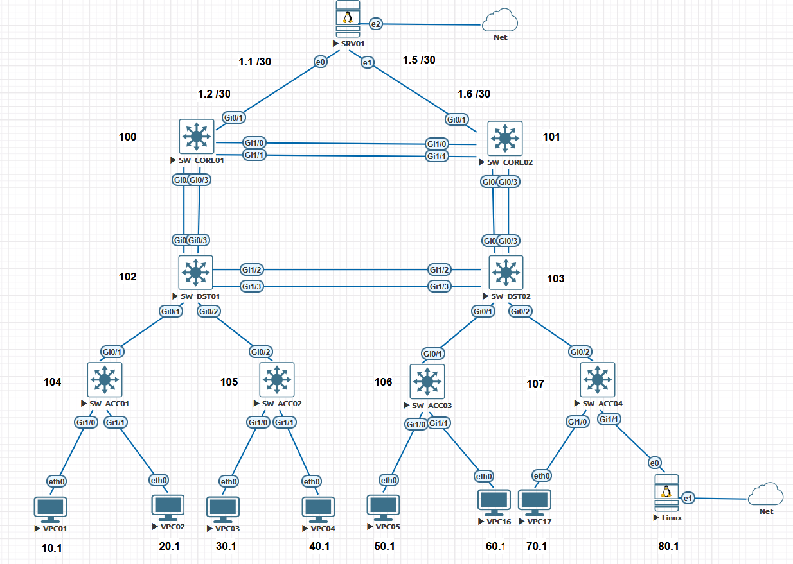
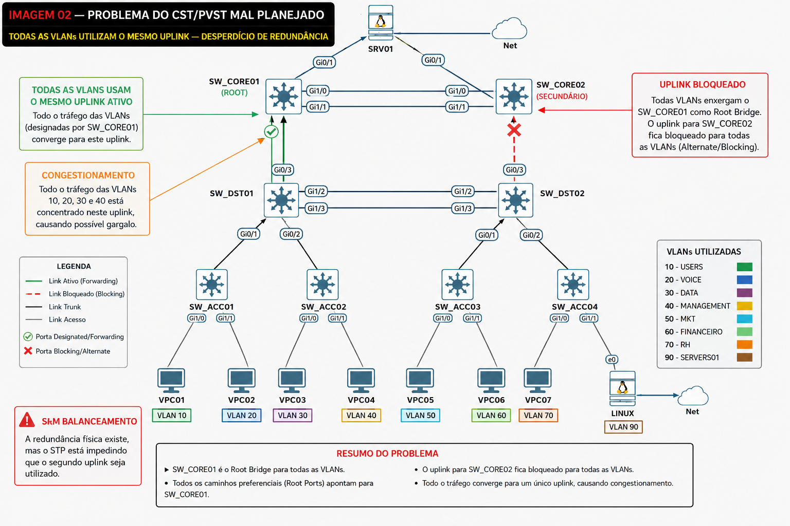
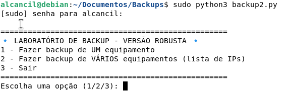
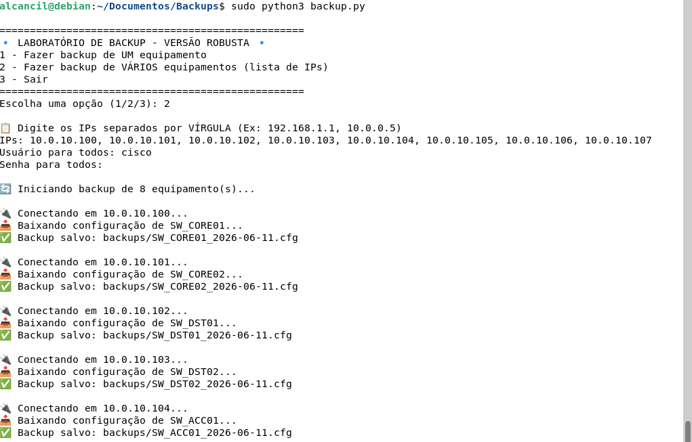
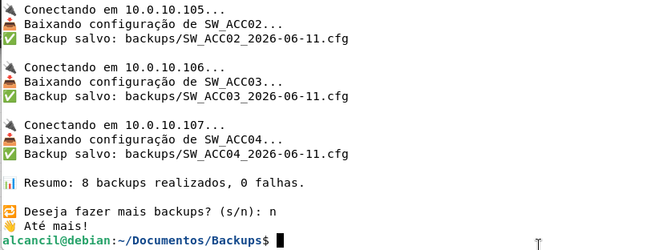
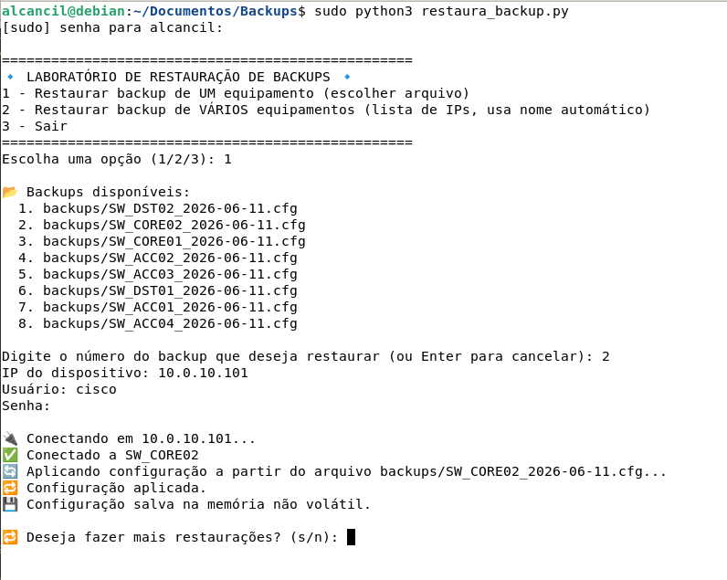
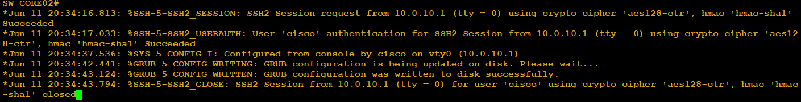

# 🧪 Laboratório 16 — STP Load Balancing com PVST+

---

## 📌 Sumário

- [🧪 Laboratório 16 — STP Load Balancing com PVST+](#-laboratório-16--stp-load-balancing-com-pvst)
  - [📌 Sumário](#-sumário)
  - [🎯 Objetivo do Laboratório](#-objetivo-do-laboratório)
  - [🏗️ Cenário Proposto](#️-cenário-proposto)
  - [🧠 O Que Este Laboratório Demonstra](#-o-que-este-laboratório-demonstra)
  - [🖥️ Equipamentos Utilizados](#️-equipamentos-utilizados)
  - [Switches](#switches)
  - [Hosts Finais](#hosts-finais)
  - [🌐 VLANs Utilizadas](#-vlans-utilizadas)
  - [🖼️ Imagem 01 — Topologia Inicial](#️-imagem-01--topologia-inicial)
  - [⚠️ Fase 1 — Problema Sem Load Balancing](#️-fase-1--problema-sem-load-balancing)
  - [🖼️ Problema do PVST Mal Planejado](#️-problema-do-pvst-mal-planejado)
  - [⚙️ Configuração Inicial da Rede](#️-configuração-inicial-da-rede)
  - [Ajustando os nomes dos switches](#ajustando-os-nomes-dos-switches)
  - [Configurar versão do STP](#configurar-versão-do-stp)
  - [Roteamento nos switches](#roteamento-nos-switches)
  - [Criar VLANs](#criar-vlans)
  - [Criar as SVis (Switch Virtual Interface ou Interface Virtual de Switch)](#criar-as-svis-switch-virtual-interface-ou-interface-virtual-de-switch)
  - [Configurar as portas trunks](#configurar-as-portas-trunks)
  - [Verificar versão do Spanning Tree](#verificar-versão-do-spanning-tree)
  - [Configurar portas de acesso](#configurar-portas-de-acesso)
  - [Configurando hosts](#configurando-hosts)
  - [🧪 Validação Inicial](#-validação-inicial)
  - [Verificar STP](#verificar-stp)
  - [Verificar o STP por vlan](#verificar-o-stp-por-vlan)
  - [Verificar root bridge](#verificar-root-bridge)
  - [Verificar trunks](#verificar-trunks)
  - [O que observar](#o-que-observar)
  - [Configuração dos Hosts Linux](#configuração-dos-hosts-linux)
  - [Host Linux – Configuração base](#host-linux--configuração-base)
    - [Explicação da configuração de rede](#explicação-da-configuração-de-rede)
  - [Srv01 – Configuração base](#srv01--configuração-base)
  - [Automação e programabilidade](#automação-e-programabilidade)
  - [Backup e Restauração](#backup-e-restauração)
  - [📡 Captura Wireshark — Fase Inicial (Abordagem Automatizada)](#-captura-wireshark--fase-inicial-abordagem-automatizada)
  - [🐍 Exemplo prático: capturar BPDUs com tshark e extrair dados](#-exemplo-prático-capturar-bpdus-com-tshark-e-extrair-dados)
  - [🧠 Exemplo de análise com Python (usando pandas e scapy)](#-exemplo-de-análise-com-python-usando-pandas-e-scapy)
    - [✅ O que você ganha com essa abordagem](#-o-que-você-ganha-com-essa-abordagem)
  - [📦 Arquivos do Laboratório](#-arquivos-do-laboratório)
  - [📁 Arquivos Disponibilizados](#-arquivos-disponibilizados)
  - [🚀 Como Importar o Laboratório no EVE-NG](#-como-importar-o-laboratório-no-eve-ng)
  - [🖥️ Imagens Utilizadas](#️-imagens-utilizadas)
  - [✅ Conclusão da Parte 1](#-conclusão-da-parte-1)
  - [🔬 Próxima Etapa — Análise Prática do STP](#-próxima-etapa--análise-prática-do-stp)

---

## 🎯 Objetivo do Laboratório

Este laboratório demonstra um dos cenários mais clássicos do STP em ambientes Cisco:

> o balanceamento de carga Layer 2 utilizando PVST+.

O objetivo é mostrar como diferentes VLANs podem utilizar uplinks distintos através da manipulação estratégica do Root Bridge.

Além disso, o laboratório também demonstra:

- limitação do CST/STP tradicional,
- desperdício de redundância,
- funcionamento do PVST+,
- balanceamento de VLANs,
- múltiplas instâncias STP,
- análise de BPDUs,
- troubleshooting,
- automação de VLANs utilizando Python.

---

## 🏗️ Cenário Proposto

A rede será composta por:

- dois switches core,
- dois switches de distribuição,
- quatro switches de acesso,
- múltiplas VLANs,
- uplinks redundantes,
- hosts finais.

Inicialmente:

- todas as VLANs utilizarão o mesmo caminho,
- um uplink ficará ocioso.

Depois:

- manipularemos o Root Bridge por VLAN,
- implementaremos balanceamento Layer 2,
- utilizaremos simultaneamente os dois uplinks redundantes.

---

## 🧠 O Que Este Laboratório Demonstra

Este laboratório demonstra visualmente:

| Conceito               | Demonstração                        |
|:---                    |:---                                 |
| CST/PVST mal planejado | Todas VLANs usam mesmo uplink       |
| Root Bridge            | Controle da topologia STP           |
| PVST+                  | Instâncias independentes por VLAN   |
| Load Balancing         | VLANs usando caminhos diferentes    |
| Redundância útil       | Ambos uplinks transportando tráfego |
| Troubleshooting        | Verificação de portas bloqueadas    |
| Wireshark              | Captura de BPDUs STP                |
| Automação              | Criação massiva de VLANs            |

---

## 🖥️ Equipamentos Utilizados

## Switches

| Equipamento | Função       |
|:---         |:---          |
| SW_CORE01   | CORE         |
| SW_CORE02   | CORE         |
| SW_DST01    | Distribuição |
| SW_DST02    | Distribuição |
| SW_ACC01    | Acesso       |
| SW_ACC02    | Acesso       |
| SW_ACC03    | Acesso       |
| SW_ACC04    | Acesso       |

---

## Hosts Finais

| Host  | VLAN        |
|:---   |:---         |
| SRV01 | TODAS VLANS |
| VPC01 | VLAN 10     |
| VPC02 | VLAN 20     |
| VPC03 | VLAN 30     |
| VPC04 | VLAN 40     |
| VPC05 | VLAN 50     |
| VPC06 | VLAN 60     |
| VPC07 | VLAN 70     |
| VPC08 | VLAN 80     |
| LINUX | TODAS VLANS |

---

## 🌐 VLANs Utilizadas

| VLAN | Nome       | FAIXA IP       |
|:---  |:---        | :---           |
| 10   | USERS      | 10.0.10.0 /24  |
| 20   | VOICE      | 10.0.20.0 /24  |
| 30   | DATA       | 10.0.30.0 /24  |
| 40   | MANAGEMENT | 10.0.40.0 /24  |
| 50   | MKT        | 10.0.50.0 /24  |
| 60   | FINANCEIRO | 10.0.60.0 /24  |
| 70   | RH         | 10.0.70.0 /24  |
| 80   | PROD       | 10.0.80.0 /24  |
| 90   | SERVERS01  | 10.0.90.0 /24  |
| 100  | SERVERS02  | 10.0.100.0 /24 |

---

## 🖼️ Imagem 01 — Topologia Inicial



**OBSERVAÇÂO:** na imagem podemos ver as numerações de **100 a 107**. Esses são os finais dos IPs de cada SVI configurada dentro de cada equipamento. Então, vamos pegar o switch **SW_CORE01** como exemplo. Nele temos as 10 vlans configuradas e vamos seguir os ips no padrão: **Vlan 10 - IP: 10.0.10.100**, **Vlan 20: IP: 10.0.20.100** e assim por diante. Esse é o padrão de IPs utilizado em todo o laboratório.

**OBSERVAÇÂO02:** para garantirmos que vamos causar o problema de saturação de links, vamos configurar todas as sub-interfaces no **SRV01** em uma mesma interface para não termos o balanceamento de cargas por vlans.

**OBSERVAÇÂO03:** tanto em **SRV01** como em **HOST_LINUX**, temos interfaces de redes ligadas em duas nuvens. Isso foi feito por questões de simplificação para podermos ter acesso a INTERNET nessas duas estações. Na prática, isso não é feito assim, lembre-se o foco aqui é o STP e vamos gerar situações onde podemos analisar o protocolo.

---

## ⚠️ Fase 1 — Problema Sem Load Balancing

Até aqui falamos sobre as várias versões do STP. Então se estivéssemos rodando o **CST - Common Spanning Tree**, teríamos somente uma instância de vlan. Porém a Cisco implementou uma versão proprietária que é o **PVST+**. Isso faz que **cada VLAN seja uma instância independente, separando os fluxos entre as VLANs.**

Nesta primeira etapa:

- todas as VLANs utilizarão o mesmo Root Bridge,
- todas utilizarão o mesmo uplink,
- um dos links redundantes ficará ocioso.

Mesmo existindo redundância física:

- apenas um caminho será utilizado,
- o segundo uplink ficará bloqueado,
- a rede desperdiçará capacidade.

Isso representa exatamente o comportamento clássico do CST ou de um PVST+ mal planejado. Nesse nosso laboratório iremos adotar o PVST+ que é o padrão da Cisco.

---

## 🖼️ Problema do PVST Mal Planejado

Aqui podemos verificar o problema de se ter o PVST+ mal planejado. Como aqui usamos o modelo hierárquico de 3 camadas, o STP vai calcular os caminhos e escolher o **ROOT BRIDGE**. Então, os melhores switches que no nosso exemplo são **Layer3 e fazem roteamento**, deveriam ser o **ROOT BRIDGE**, mas não é isso que realmente acontece.



**OBSERVAÇÂO:** na imagem está marcado que o switch **SW_CORE01** é o **ROOT BRIDGE**, pois ele está na camada **CORE** e por escolha de projeto deve ser um dos melhores switches com mais capacidade. Mas será que é isso mesmo que vai acontecer ? Vamos continuar e analisar para ver como o STP vai se comportar.

---

## ⚙️ Configuração Inicial da Rede

Então aqui estamos simulando um ambiente onde os hosts precisam acessar o servidor. Por questões de projeto, foi definido que teremos 10 vlans distintas e para essas vlans se comunicarem vamos utilizar 2 switches layer 3 que fazem roteamento. Esses dois switches são **SW_CORE01 e SW_CORE02**. Somente esses roteadores terão o roteamento ativado.

Vamos começar as nossas configurações.

## Ajustando os nomes dos switches

Agora precisamos configurar o nome de cada equipamento. Para isso devemos entrar em cada equipamento e configurar o nome conforme descrito na topologia. Veja o exemplo no switch **SW_CORE01**. Configurar o mesmo para todos os switches segundo a nomenclatura definida.  

```ios
Switch#conf t
Enter configuration commands, one per line.  End with CNTL/Z.
Switch(config)#hostname SW_ACC01
SW_ACC01(config)#
```

---

## Configurar versão do STP

Em nosso laboratório, vamos utilizar o PVST. Dependendo da imagem que estamos utilizando, o switch não vem configurado com essa versão do STP. Agora temos que configurar isso em todos os switches. Vou demonstrar em um switch mas não se esqueça de configurar todos.

```ios
SW_ACC01(config)#spanning-tree mode ?
  mst         Multiple spanning tree mode
  pvst        Per-Vlan spanning tree mode
  rapid-pvst  Per-Vlan rapid spanning tree mode

SW_ACC01(config)#spanning-tree mode pvst
```

Vamos verificar a versão do STP agora.  

```ios
SW_ACC01#show spanning-tree

VLAN0001
  Spanning tree enabled protocol ieee
  Root ID    Priority    32769
             Address     5000.0012.0000
             This bridge is the root
             Hello Time   2 sec  Max Age 20 sec  Forward Delay 15 sec

  Bridge ID  Priority    32769  (priority 32768 sys-id-ext 1)
             Address     5000.0012.0000
             Hello Time   2 sec  Max Age 20 sec  Forward Delay 15 sec
             Aging Time  300 sec

Interface           Role Sts Cost      Prio.Nbr Type
------------------- ---- --- --------- -------- --------------------------------
Gi0/0               Desg FWD 4         128.1    P2p
Gi0/1               Desg FWD 4         128.2    P2p
Gi0/2               Desg FWD 4         128.3    P2p
Gi0/3               Desg FWD 4         128.4    P2p
Gi1/0               Desg FWD 4         128.5    P2p
Gi1/1               Desg FWD 4         128.6    P2p
Gi1/2               Desg FWD 4         128.7    P2p
Gi1/3               Desg FWD 4         128.8    P2p


SW_ACC01#
```

Note a linha: `Spanning tree enabled protocol ieee`. Isso confirma que o spanning three está em modo PVST. Perceba que aqui temos somente uma única instancia de PVST. Isso acontece pois não temos mais nenhuma vlan no switch além da vlan 1 **nativa** que já vem por padrão no equipamento.  
  
---

## Roteamento nos switches

Como foi definido no projeto, teremos somente dois switches com o roteamento ativado, os switches **SW_CORE01 e SW_CORE02**.  
Vamos executar o comando nesses 02 switches.  

```ios
SW_CORE01(config)#ip routing
```

Vamos verificar se o roteamento está ativo.  

```ios
SW_CORE01#show ip route
Codes: L - local, C - connected, S - static, R - RIP, M - mobile, B - BGP
       D - EIGRP, EX - EIGRP external, O - OSPF, IA - OSPF inter area
       N1 - OSPF NSSA external type 1, N2 - OSPF NSSA external type 2
       E1 - OSPF external type 1, E2 - OSPF external type 2
       i - IS-IS, su - IS-IS summary, L1 - IS-IS level-1, L2 - IS-IS level-2
       ia - IS-IS inter area, * - candidate default, U - per-user static route
       o - ODR, P - periodic downloaded static route, H - NHRP, l - LISP
       a - application route
       + - replicated route, % - next hop override

Gateway of last resort is not set

SW_CORE01#
```

Agora nos outros switches precisamos desativar o roteamento. Então vamos acessar todos os outros switches e digitar:

```ios
SW_ACC01(config)#no ip routing
```

Agora vamos verificar se o roteamento foi desativado.  

```ios
SW_ACC01#show ip route
Default gateway is not set

Host               Gateway           Last Use    Total Uses  Interface
ICMP redirect cache is empty
SW_ACC01#
```

Pronto, aqui definimos quais são os switches **Layer2** e **Layer3**. No nosso exemplo não vamos utilizar nenhum protocolo de roteamento. Vamos configurar as **SVis** nos switches e nos switches que são **layer3**, essas SVis vão ser identificadas como conectadas localmente e com isso vão inserir uma **rota local** na tabela de roteamento. Com isso, as vlans passam a se comunicar.

## Criar VLANs

Vamos criar as vlans em todos os switches. Para os quadros poderem navegar por todos os caminhos temos que ter as vlans em todos switches.

```ios
Switch#conf t
Enter configuration commands, one per line.  End with CNTL/Z.
Switch(config)#vlan 10
Switch(config-vlan)#name USERES
Switch(config-vlan)#vlan 20
Switch(config-vlan)#name VOICE
Switch(config-vlan)#vlan 30
Switch(config-vlan)#name DATA
Switch(config-vlan)#vlan 40
Switch(config-vlan)#name MANAGEMENT
Switch(config-vlan)#vlan 50
Switch(config-vlan)#name MKT
Switch(config-vlan)#vlan 60
Switch(config-vlan)#name FINANCEIRO
Switch(config-vlan)#vlan 70
Switch(config-vlan)#name RH
Switch(config-vlan)#vlan 80
Switch(config-vlan)#name PROD
Switch(config-vlan)#vlan 90
Switch(config-vlan)#name SERVER01
Switch(config-vlan)#vlan 100
Switch(config-vlan)#name SERVER02
Switch(config-vlan)#
```

Executar esses comandos em todos os switches.  
Agora vamos verificar as vlans. Para isso devemos utilizar o comando `show vlan brief`.  

```ios
Switch#show vlan brief

VLAN Name                             Status    Ports
---- -------------------------------- --------- -------------------------------
1    default                          active    Gi0/0, Gi0/1, Gi0/2, Gi0/3
                                                Gi1/0, Gi1/1, Gi1/2, Gi1/3
10   USERES                           active
20   VOICE                            active
30   DATA                             active
40   MANAGEMENT                       active
50   MKT                              active
60   FINANCEIRO                       active
70   RH                               active
80   PROD                             active
90   SERVER01                         active
100  SERVER02                         active
1002 fddi-default                     act/unsup
1003 token-ring-default               act/unsup
1004 fddinet-default                  act/unsup
1005 trnet-default                    act/unsup
Switch#
```

## Criar as SVis (Switch Virtual Interface ou Interface Virtual de Switch)  

 Essa é uma interface lógica (virtual) configurada no dispositivo que representa um endereço IP para uma VLAN específica, permitindo o gerenciamento remoto do equipamento ou o roteamento de tráfego entre redes.A SVI pode ser usada para duas finalidades principais:
  
- **Gerenciamento do Switch (Camada 2)**: Permite atribuir um endereço IP para acessar o switch via SSH, Telnet ou interfaces de monitoramento. O exemplo mais comum é a SVI padrão na VLAN 1. Vale ressaltar aqui que em produção, por questões de segurança, deve - se evitar utilizar a vlan padrão 1. As boas práticas orientam a alterar a vlan padrão em todos os equipamentos. Como aqui é apenas um laboratório, vamos manter a vlan 1 padrão.
- **Roteamento entre VLANs (Camada 3)**: Em switches Multilayer (camada 3), a SVI funciona como o "gateway padrão" para os computadores de uma VLAN. Ela permite que diferentes redes conversem entre si diretamente através do switch, substituindo ou auxiliando um roteador externo

Aqui vou entrar em um switch e demonstrar como configurar as 10 SVis. Isso mesmo, cada switch tem que ter **SVis** pois essas serão as interfaces de acesso ao equipamento por vlan. Elas também podem ser utilizadas como gateway para cada sub rede definida. Então no nosso laboratório vamos configurar inicialmente todas as sub redes com o gateway de final **100** pois o nosso objetivo é demonstrar a saturação de links com o STP mau configurado. Depois iremos ajustar isso.  

Então vamos acessar o switch **SW_CORE01** e configurar as SVIs. Vamos seguir o plano de IP que já foi estabelecido anteriormente e que está desenhado na topologia. Esse processo deve ser repetido depois em todos os outros switches.

```ios
SW_CORE01(config)#int vlan 10
SW_CORE01(config-if)#
*Jun  7 02:35:03.564: %LINEPROTO-5-UPDOWN: Line protocol on Interface Vlan10, changed state to down
SW_CORE01(config-if)#ip address 10.0.10.100 255.255.255.0
SW_CORE01(config-if)#no shut
SW_CORE01(config-if)#
*Jun  7 02:35:31.300: %LINK-3-UPDOWN: Interface Vlan10, changed state to down
SW_CORE01(config-if)#int vlan 20
SW_CORE01(config-if)#
*Jun  7 02:35:49.633: %LINEPROTO-5-UPDOWN: Line protocol on Interface Vlan20, changed state to down
SW_CORE01(config-if)#ip address 10.0.20.100 255.255.255.0
SW_CORE01(config-if)#no shut
SW_CORE01(config-if)#
*Jun  7 02:36:05.818: %LINK-3-UPDOWN: Interface Vlan20, changed state to down
SW_CORE01(config-if)#int vlan 30
SW_CORE01(config-if)#
*Jun  7 02:36:14.673: %LINEPROTO-5-UPDOWN: Line protocol on Interface Vlan30, changed state to down
SW_CORE01(config-if)#ip address 10.0.30.100 255.255.255.0
SW_CORE01(config-if)#no shut
SW_CORE01(config-if)#
*Jun  7 02:36:30.180: %LINK-3-UPDOWN: Interface Vlan30, changed state to down
SW_CORE01(config-if)#int vlan 40
*Jun  7 02:36:39.513: %LINEPROTO-5-UPDOWN: Line protocol on Interface Vlan40, changed state to down
SW_CORE01(config-if)#ip address 10.0.40.100 255.255.255.0
SW_CORE01(config-if)#no shut
SW_CORE01(config-if)#
*Jun  7 02:36:56.528: %LINK-3-UPDOWN: Interface Vlan40, changed state to down
SW_CORE01(config-if)#int vlan 50
SW_CORE01(config-if)#
*Jun  7 02:37:06.388: %LINEPROTO-5-UPDOWN: Line protocol on Interface Vlan50, changed state to down
SW_CORE01(config-if)#ip address 10.0.50.100 255.255.255.0
SW_CORE01(config-if)#no shut
SW_CORE01(config-if)#
*Jun  7 02:37:42.810: %LINK-3-UPDOWN: Interface Vlan50, changed state to down
SW_CORE01(config-if)#int vlan 60
SW_CORE01(config-if)#
*Jun  7 02:37:52.948: %LINEPROTO-5-UPDOWN: Line protocol on Interface Vlan60, changed state to down
SW_CORE01(config-if)#ip address 10.0.60.100 255.255.255.0
SW_CORE01(config-if)#no shut
SW_CORE01(config-if)#
*Jun  7 02:38:07.726: %LINK-3-UPDOWN: Interface Vlan60, changed state to down
SW_CORE01(config-if)#int vlan 70
SW_CORE01(config-if)#
*Jun  7 02:38:16.918: %LINEPROTO-5-UPDOWN: Line protocol on Interface Vlan70, changed state to down
SW_CORE01(config-if)#ip address 10.0.70.100 255.255.255.0
SW_CORE01(config-if)#no shut
SW_CORE01(config-if)#
*Jun  7 02:38:31.148: %LINK-3-UPDOWN: Interface Vlan70, changed state to down
SW_CORE01(config-if)#int vlan 80
SW_CORE01(config-if)#
*Jun  7 02:38:40.153: %LINEPROTO-5-UPDOWN: Line protocol on Interface Vlan80, changed state to down
SW_CORE01(config-if)#ip address 10.0.80.100 255.255.255.0
SW_CORE01(config-if)#no shut
SW_CORE01(config-if)#
*Jun  7 02:38:53.511: %LINK-3-UPDOWN: Interface Vlan80, changed state to down
SW_CORE01(config-if)#int vlan 90
SW_CORE01(config-if)#
*Jun  7 02:39:07.018: %LINEPROTO-5-UPDOWN: Line protocol on Interface Vlan90, changed state to down
SW_CORE01(config-if)#ip address 10.0.90.100 255.255.255.0
SW_CORE01(config-if)#no shut
SW_CORE01(config-if)#
*Jun  7 02:39:26.072: %LINK-3-UPDOWN: Interface Vlan90, changed state to down
SW_CORE01(config-if)#int vlan 100
SW_CORE01(config-if)#
*Jun  7 02:39:44.080: %LINEPROTO-5-UPDOWN: Line protocol on Interface Vlan100, changed state to down
SW_CORE01(config-if)#ip address 10.0.100.100 255.255.255.0
SW_CORE01(config-if)#no shut
SW_CORE01(config-if)#
*Jun  7 02:39:56.521: %LINK-3-UPDOWN: Interface Vlan100, changed state to down
SW_CORE01(config-if)#
```

Agora vamos verificar se isso funcionou.  

```ios
SW_CORE01#show ip interface brief
Interface              IP-Address      OK? Method Status                Protocol
GigabitEthernet0/0     unassigned      YES unset  up                    up
GigabitEthernet0/1     unassigned      YES unset  up                    up
GigabitEthernet0/2     unassigned      YES unset  up                    up
GigabitEthernet0/3     unassigned      YES unset  up                    up
GigabitEthernet1/0     unassigned      YES unset  up                    up
GigabitEthernet1/1     unassigned      YES unset  up                    up
GigabitEthernet1/2     unassigned      YES unset  up                    up
GigabitEthernet1/3     unassigned      YES unset  up                    up
GigabitEthernet2/0     unassigned      YES unset  up                    up
GigabitEthernet2/1     unassigned      YES unset  up                    up
GigabitEthernet2/2     unassigned      YES unset  up                    up
GigabitEthernet2/3     unassigned      YES unset  up                    up
GigabitEthernet3/0     unassigned      YES unset  up                    up
GigabitEthernet3/1     unassigned      YES unset  up                    up
GigabitEthernet3/2     unassigned      YES unset  up                    up
GigabitEthernet3/3     unassigned      YES unset  up                    up
Vlan10                 10.0.10.100     YES NVRAM  up                    up
Vlan20                 10.0.20.100     YES NVRAM  up                    up
Vlan30                 10.0.30.100     YES NVRAM  up                    up
Vlan40                 10.0.40.100     YES NVRAM  up                    up
Vlan50                 10.0.50.100     YES NVRAM  up                    up
Vlan60                 10.0.60.100     YES NVRAM  up                    up
Vlan70                 10.0.70.100     YES NVRAM  up                    up
Vlan80                 10.0.80.100     YES NVRAM  up                    up
Vlan90                 10.0.90.100     YES NVRAM  up                    up
Vlan100                10.0.100.100    YES NVRAM  up                    up
SW_CORE01#
```

Note que a interface tem que estar como **STATUS: up** e **PROTOCOL: up** para estar ativa.  
Agora podemos verificar o roteamento nos switches layer 3.  

```ios
SW_CORE01#show ip route
Codes: L - local, C - connected, S - static, R - RIP, M - mobile, B - BGP
       D - EIGRP, EX - EIGRP external, O - OSPF, IA - OSPF inter area
       N1 - OSPF NSSA external type 1, N2 - OSPF NSSA external type 2
       E1 - OSPF external type 1, E2 - OSPF external type 2
       i - IS-IS, su - IS-IS summary, L1 - IS-IS level-1, L2 - IS-IS level-2
       ia - IS-IS inter area, * - candidate default, U - per-user static route
       o - ODR, P - periodic downloaded static route, H - NHRP, l - LISP
       a - application route
       + - replicated route, % - next hop override

Gateway of last resort is not set

      10.0.0.0/8 is variably subnetted, 20 subnets, 2 masks
C        10.0.10.0/24 is directly connected, Vlan10
L        10.0.10.100/32 is directly connected, Vlan10
C        10.0.20.0/24 is directly connected, Vlan20
L        10.0.20.100/32 is directly connected, Vlan20
C        10.0.30.0/24 is directly connected, Vlan30
L        10.0.30.100/32 is directly connected, Vlan30
C        10.0.40.0/24 is directly connected, Vlan40
L        10.0.40.100/32 is directly connected, Vlan40
C        10.0.50.0/24 is directly connected, Vlan50
L        10.0.50.100/32 is directly connected, Vlan50
C        10.0.60.0/24 is directly connected, Vlan60
L        10.0.60.100/32 is directly connected, Vlan60
C        10.0.70.0/24 is directly connected, Vlan70
L        10.0.70.100/32 is directly connected, Vlan70
C        10.0.80.0/24 is directly connected, Vlan80
L        10.0.80.100/32 is directly connected, Vlan80
C        10.0.90.0/24 is directly connected, Vlan90
L        10.0.90.100/32 is directly connected, Vlan90
C        10.0.100.0/24 is directly connected, Vlan100
L        10.0.100.100/32 is directly connected, Vlan100
SW_CORE01#
```

**OBSERVAÇÂO:** Para facilitar os testes de conectividade, troubleshooting e automação, foram criadas SVIs adicionais nas VLANs do laboratório. Em ambientes corporativos normalmente utiliza-se uma VLAN dedicada de gerenciamento por equipamento, porém a abordagem adotada neste laboratório amplia as possibilidades de validação de STP, roteamento e scripts de automação.  
O protocolo STP opera exclusivamente na camada 2 e não depende da existência de SVIs ou roteamento IP para funcionar. As SVIs foram criadas antecipadamente neste laboratório para facilitar testes de conectividade, gerenciamento dos equipamentos, validações de roteamento entre VLANs e futuras atividades de automação. A análise do STP realizada neste laboratório seria exatamente a mesma mesmo que nenhuma SVI estivesse configurada. 

**OBSERVAÇÂO02:**

> 📝 Nota de Arquitetura de Laboratório:
>
> "Em um ambiente de produção corporativo real, a ativação de SVIs em todas as VLANs nos switches de acesso é evitada para preservar recursos de CPU/TCAM e reduzir a superfície de ataque de segurança, limitando-se o acesso a uma VLAN de gerência isolada. Todavia, para fins didáticos e instrumentação de testes neste laboratório, optou-se por configurar IPs em todas as SVIs. Isso viabiliza a geração de múltiplos fluxos simultâneos de telemetria e testes de vazão (via iperf3), facilitando a extração estruturada de dados de cada instância do PVST+ via scripts de automação Python e TextFSM."

---

## Configurar as portas trunks

Certo, até aqui definimos as sub redes, vlans e SVIs. Mas veja, em **802.1Q** sabemos que toda vlan recebe uma tag, uma marcação dizendo em qual vlan o quadro pertence. Porém para esses quadros saírem de um switch e entrar em outros, eles precisam passar por um tipo de interface especial chamada de **trunk**. Sem isso as vlans ficam presas dentro do switch e não conseguem navegar pela topologia toda.
  
Então agora temos que definir quais são as nossas interfaces **trunk** e depois vamos configurar elas. Uma curiosidade é que o STP foi criado a partir de uma analogia com árvores. Então, trunk realmente quer dizer tronco, o que faz todo o sentido pois é por ai que todas vlans vão passar.

| **EQUIPAMENTO** | **PORTA** | **MODO** | **VLANS**                                  |
| :---            | :---      | :---     | :---                                       |
| SW_CORE01       | Gi0/1     | trunk    | 1, 10, 20, 30, 40, 50, 60, 70, 80, 90, 100 |
| SW_CORE01       | Gi1/0     | trunk    | 1, 10, 20, 30, 40, 50, 60, 70, 80, 90, 100 |
| SW_CORE01       | Gi1/1     | trunk    | 1, 10, 20, 30, 40, 50, 60, 70, 80, 90, 100 |
| SW_CORE01       | Gi0/0     | trunk    | 1, 10, 20, 30, 40, 50, 60, 70, 80, 90, 100 |
| SW_CORE01       | Gi0/3     | trunk    | 1, 10, 20, 30, 40, 50, 60, 70, 80, 90, 100 |
| SW_CORE02       | Gi0/1     | trunk    | 1, 10, 20, 30, 40, 50, 60, 70, 80, 90, 100 |
| SW_CORE02       | Gi1/0     | trunk    | 1, 10, 20, 30, 40, 50, 60, 70, 80, 90, 100 |
| SW_CORE02       | Gi1/1     | trunk    | 1, 10, 20, 30, 40, 50, 60, 70, 80, 90, 100 |
| SW_CORE02       | Gi0/0     | trunk    | 1, 10, 20, 30, 40, 50, 60, 70, 80, 90, 100 |
| SW_CORE02       | Gi0/3     | trunk    | 1, 10, 20, 30, 40, 50, 60, 70, 80, 90, 100 |
| SW_DST01        | Gi0/0     | trunk    | 1, 10, 20, 30, 40, 50, 60, 70, 80, 90, 100 |
| SW_DST01        | Gi0/3     | trunk    | 1, 10, 20, 30, 40, 50, 60, 70, 80, 90, 100 |
| SW_DST01        | Gi1/2     | trunk    | 1, 10, 20, 30, 40, 50, 60, 70, 80, 90, 100 |
| SW_DST01        | Gi1/3     | trunk    | 1, 10, 20, 30, 40, 50, 60, 70, 80, 90, 100 |
| SW_DST01        | Gi0/1     | trunk    | 1, 10, 20, 30, 40, 50, 60, 70, 80, 90, 100 |
| SW_DST01        | Gi0/2     | trunk    | 1, 10, 20, 30, 40, 50, 60, 70, 80, 90, 100 |
| SW_DST02        | Gi0/0     | trunk    | 1, 10, 20, 30, 40, 50, 60, 70, 80, 90, 100 |
| SW_DST02        | Gi0/3     | trunk    | 1, 10, 20, 30, 40, 50, 60, 70, 80, 90, 100 |
| SW_DST02        | Gi1/2     | trunk    | 1, 10, 20, 30, 40, 50, 60, 70, 80, 90, 100 |
| SW_DST02        | Gi1/3     | trunk    | 1, 10, 20, 30, 40, 50, 60, 70, 80, 90, 100 |
| SW_DST02        | Gi0/1     | trunk    | 1, 10, 20, 30, 40, 50, 60, 70, 80, 90, 100 |
| SW_DST02        | Gi0/2     | trunk    | 1, 10, 20, 30, 40, 50, 60, 70, 80, 90, 100 |
| SW_ACC01        | Gi0/1     | trunk    | 1, 10, 20, 30, 40, 50, 60, 70, 80, 90, 100 |
| SW_ACC02        | Gi0/2     | trunk    | 1, 10, 20, 30, 40, 50, 60, 70, 80, 90, 100 |
| SW_ACC03        | Gi0/1     | trunk    | 1, 10, 20, 30, 40, 50, 60, 70, 80, 90, 100 |
| SW_ACC04        | Gi0/2     | trunk    | 1, 10, 20, 30, 40, 50, 60, 70, 80, 90, 100 |
| **SW_ACC04**    | **Gi1/1** | trunk    | 1, 10, 20, 30, 40, 50, 60, 70, 80, 90, 100 |

**OBSERVÇÃO:** No switch **SW_ACC04** vamos configurar a porta como tronco pois no host Linux vamos configurar 10 sub interfaces, uma por sub rede e habilitar o módulo 802.1q para poder termos todas as vlans dentro do Linux. Isso será feita para podermos executar os testes com a ferramenta **iperf3** para tentarmos saturar os links.

Com as portas **tronco** mapeadas, vamos entrar em todos os dispositivos indicados e configurar as portas.

```ios
SW_CORE01(config)#interface GigabitEthernet 0/0
SW_CORE01(config-if)#switchport trunk encapsulation dot1q
SW_CORE01(config-if)#switchport mode trunk
SW_CORE01(config-if)#switchport trunk allowed vlan 1,10,20,30,40,50,60,70,80,90,100
SW_CORE01(config-if)#switchport nonegotiate
SW_CORE01(config-if)#
```

Devemos repetir os comandos para todos os equipamentos e portas indicadas na tabela. Também devemos tomar o cuidado com o comando **switchport trunk allowed vlan 1,10,20,30,40,50,60,70,80,90,100**. Vamos supor que tivessemos esquecido de colocar a vlan 1, por exemplo, e percebemos o problema depois. Então se formos corrigir e digitar assim: **switchport trunk allowed 1**, depois do primeiro comando o que realmente vai acontecer que esse comando vai substituir o primeiro comando e vai somente permitir a navegação da vlan 1 proibindo o resto. O correto nesses casos, é executar o comando com a palavra **add**. O comando ficaria assim: **switchport trunk allowed vlan add 1**, ai sim vamos somar a vlan 1 na lista das vlans habilitadas para passar na interface.

---

## Verificar versão do Spanning Tree

Agora que configuramos as Vlans e as SVIs, vamos analisar a versão do STP novamente para ver o que mudou agora.  
  
```ios
SW_CORE01#show spanning-tree

VLAN0001
  Spanning tree enabled protocol ieee
  Root ID    Priority    32769
             Address     5000.000a.0000
             This bridge is the root
             Hello Time   2 sec  Max Age 20 sec  Forward Delay 15 sec

  Bridge ID  Priority    32769  (priority 32768 sys-id-ext 1)
             Address     5000.000a.0000
             Hello Time   2 sec  Max Age 20 sec  Forward Delay 15 sec
             Aging Time  300 sec

Interface           Role Sts Cost      Prio.Nbr Type
------------------- ---- --- --------- -------- --------------------------------
Gi0/0               Desg FWD 4         128.1    P2p
Gi0/1               Desg FWD 4         128.2    P2p
Gi0/2               Desg FWD 4         128.3    P2p
Gi0/3               Desg FWD 4         128.4    P2p
Gi1/0               Desg FWD 4         128.5    P2p
Gi1/1               Desg FWD 4         128.6    P2p
Gi1/2               Desg FWD 4         128.7    P2p
Gi1/3               Desg FWD 4         128.8    P2p
Gi2/0               Desg FWD 4         128.9    P2p
Gi2/1               Desg FWD 4         128.10   P2p
Gi2/2               Desg FWD 4         128.11   P2p
Gi2/3               Desg FWD 4         128.12   P2p
Gi3/0               Desg FWD 4         128.13   P2p
Gi3/1               Desg FWD 4         128.14   P2p
Gi3/2               Desg FWD 4         128.15   P2p
Gi3/3               Desg FWD 4         128.16   P2p


VLAN0010
  Spanning tree enabled protocol ieee
  Root ID    Priority    32778
             Address     5000.000a.0000
             This bridge is the root
             Hello Time   2 sec  Max Age 20 sec  Forward Delay 15 sec

  Bridge ID  Priority    32778  (priority 32768 sys-id-ext 10)
             Address     5000.000a.0000
             Hello Time   2 sec  Max Age 20 sec  Forward Delay 15 sec
             Aging Time  300 sec

Interface           Role Sts Cost      Prio.Nbr Type
------------------- ---- --- --------- -------- --------------------------------
Gi0/0               Desg FWD 4         128.1    P2p
Gi0/1               Desg FWD 4         128.2    P2p
Gi0/3               Desg FWD 4         128.4    P2p
Gi1/0               Desg FWD 4         128.5    P2p
Gi1/1               Desg FWD 4         128.6    P2p


VLAN0020
  Spanning tree enabled protocol ieee
  Root ID    Priority    32788
             Address     5000.000a.0000
             This bridge is the root
             Hello Time   2 sec  Max Age 20 sec  Forward Delay 15 sec

  Bridge ID  Priority    32788  (priority 32768 sys-id-ext 20)
             Address     5000.000a.0000
             Hello Time   2 sec  Max Age 20 sec  Forward Delay 15 sec
             Aging Time  300 sec

Interface           Role Sts Cost      Prio.Nbr Type
------------------- ---- --- --------- -------- --------------------------------
Gi0/0               Desg FWD 4         128.1    P2p
Gi0/1               Desg FWD 4         128.2    P2p
Gi0/3               Desg FWD 4         128.4    P2p
Gi1/0               Desg FWD 4         128.5    P2p
Gi1/1               Desg FWD 4         128.6    P2p

...
```

Podemos ver que temos 10 instancias do protocolo **PVST**, uma por cada vlan que criamos mais a instancia de vlan 1 que já tinhamos visto. Também é possível analisar os papéis das portas, o status, os custos e a prioridade. Ao analisarmos, podemos podemos notar que uma mesma porta pode estar exercendo vários pápeis e ter status diferentes conforme olhamos para as diferentes instâncias do PVST. Até esse ponto, vamos notar que tudo esá igual pois não vamos alterar nada ainda, somente deixar o PVST realizar seus cálculos até convergir.  

---

## Configurar portas de acesso

Agora precisamos acessar os switches de acesso **SW_ACC01, SW_ACC02, SW_ACC03 e SW_ACC04** e vamos configurar as portas de acesso.
  
**SW_ACC01**  

```ios
SW_ACC01#conf t
Enter configuration commands, one per line.  End with CNTL/Z.
SW_ACC01(config)#interface GigabitEthernet1/0
SW_ACC01(config-if)#switchport mode access
SW_ACC01(config-if)#switchport access vlan 10
SW_ACC01(config-if)#switchport nonegotiate
SW_ACC01(config-if)#
SW_ACC01(config)#interface GigabitEthernet1/1
SW_ACC01(config-if)#switchport mode access
SW_ACC01(config-if)#switchport access vlan 20
SW_ACC01(config-if)#switchport nonegotiate
SW_ACC01(config-if)#
```

**SW_ACC02**  

```ios
SW_ACC01#conf t
Enter configuration commands, one per line.  End with CNTL/Z.
SW_ACC01(config)#interface GigabitEthernet1/0
SW_ACC01(config-if)#switchport mode access
SW_ACC01(config-if)#switchport access vlan 30
SW_ACC01(config-if)#switchport nonegotiate
SW_ACC01(config-if)#
SW_ACC01(config)#interface GigabitEthernet1/1
SW_ACC01(config-if)#switchport mode access
SW_ACC01(config-if)#switchport access vlan 40
SW_ACC01(config-if)#switchport nonegotiate
SW_ACC01(config-if)#
```

**SW_ACC03**  

```ios
SW_ACC01#conf t
Enter configuration commands, one per line.  End with CNTL/Z.
SW_ACC01(config)#interface GigabitEthernet1/0
SW_ACC01(config-if)#switchport mode access
SW_ACC01(config-if)#switchport access vlan 50
SW_ACC01(config-if)#switchport nonegotiate
SW_ACC01(config-if)#
SW_ACC01(config)#interface GigabitEthernet1/1
SW_ACC01(config-if)#switchport mode access
SW_ACC01(config-if)#switchport access vlan 60
SW_ACC01(config-if)#switchport nonegotiate
SW_ACC01(config-if)#
```

**SW_ACC04**  

```ios
SW_ACC01#conf t
Enter configuration commands, one per line.  End with CNTL/Z.
SW_ACC01(config)#interface GigabitEthernet1/0
SW_ACC01(config-if)#switchport mode access
SW_ACC01(config-if)#switchport access vlan 70
SW_ACC01(config-if)#switchport nonegotiate
SW_ACC01(config-if)#
SW_ACC01(config)#interface GigabitEthernet1/1
SW_ACC01(config-if)#switchport mode access
SW_ACC01(config-if)#switchport access vlan 80
SW_ACC01(config-if)#switchport nonegotiate
SW_ACC01(config-if)#
```

## Configurando hosts

Aqui estamos utilizando VPCs que são pcs virtuais bem simples. Depois temos dois hosts linux. Um deles será o servidor **SRV01** e o outro será o **HOST**.

**VPC01**  

```ios
VPC01> set pcname VPC01

VPC01> ip 10.0.10.1 255.255.255.0 10.0.10.100
Checking for duplicate address...
VPC01 : 10.0.10.1 255.255.255.0 gateway 10.0.10.100

VPC01> save
```

Perceba que o ip ficou como 10.0.10.1, ou seja, estamos colocando ele na sub-rede 10 que está na vlan 10. Então vamos fazer o mesmo em todos os outros VPCs.  
  
**OBSERVAÇÂO:** escolhemos o ip 10.0.**10**.1 para o host **VPC01**. Então para o **VPC02** vamos configurar o ip 10.0.**20**.1 e assim vamos seguir esse padrão para todos os vpcs.  
  
---

## 🧪 Validação Inicial

Agora que configuramos a parte inicial do nosso cenário, precisamos realizar algumas verificações para ver como o PVST se comportou. Alguns desses comandos também vão servir para a parte do troubleshooting quando necessário.

## Verificar STP

- Comando: `show spanning-tree`

```ios
SW_CORE01#show spanning-tree

VLAN0001
  Spanning tree enabled protocol ieee
  Root ID    Priority    32769
             Address     5000.0003.0000
             Cost        4
             Port        1 (GigabitEthernet0/0)
             Hello Time   2 sec  Max Age 20 sec  Forward Delay 15 sec

  Bridge ID  Priority    32769  (priority 32768 sys-id-ext 1)
             Address     5000.000a.0000
             Hello Time   2 sec  Max Age 20 sec  Forward Delay 15 sec
             Aging Time  300 sec

Interface           Role Sts Cost      Prio.Nbr Type
------------------- ---- --- --------- -------- --------------------------------
Gi0/0               Root FWD 4         128.1    P2p
Gi0/1               Desg FWD 4         128.2    P2p
Gi0/2               Desg FWD 4         128.3    P2p
Gi0/3               Altn BLK 4         128.4    P2p
Gi1/0               Desg FWD 4         128.5    P2p
Gi1/1               Desg FWD 4         128.6    P2p
Gi1/2               Desg FWD 4         128.7    P2p
Gi1/3               Desg FWD 4         128.8    P2p
Gi2/0               Desg FWD 4         128.9    P2p
Gi2/1               Desg FWD 4         128.10   P2p
Gi2/2               Desg FWD 4         128.11   P2p
Gi2/3               Desg FWD 4         128.12   P2p
Gi3/0               Desg FWD 4         128.13   P2p
Gi3/1               Desg FWD 4         128.14   P2p
Gi3/2               Desg FWD 4         128.15   P2p
Gi3/3               Desg FWD 4         128.16   P2p


VLAN0010
  Spanning tree enabled protocol ieee
  Root ID    Priority    32778
             Address     5000.0003.0000
             Cost        4
             Port        1 (GigabitEthernet0/0)
             Hello Time   2 sec  Max Age 20 sec  Forward Delay 15 sec

  Bridge ID  Priority    32778  (priority 32768 sys-id-ext 10)
             Address     5000.000a.0000
             Hello Time   2 sec  Max Age 20 sec  Forward Delay 15 sec
             Aging Time  300 sec

Interface           Role Sts Cost      Prio.Nbr Type
------------------- ---- --- --------- -------- --------------------------------
Gi0/0               Root FWD 4         128.1    P2p
Gi0/1               Desg FWD 4         128.2    P2p
Gi0/3               Altn BLK 4         128.4    P2p
Gi1/0               Desg FWD 4         128.5    P2p
Gi1/1               Desg FWD 4         128.6    P2p


VLAN0020
  Spanning tree enabled protocol ieee
  Root ID    Priority    32788
             Address     5000.0003.0000
             Cost        4
             Port        1 (GigabitEthernet0/0)
             Hello Time   2 sec  Max Age 20 sec  Forward Delay 15 sec

  Bridge ID  Priority    32788  (priority 32768 sys-id-ext 20)
             Address     5000.000a.0000
             Hello Time   2 sec  Max Age 20 sec  Forward Delay 15 sec
             Aging Time  300 sec

Interface           Role Sts Cost      Prio.Nbr Type
------------------- ---- --- --------- -------- --------------------------------
Gi0/0               Root FWD 4         128.1    P2p
Gi0/1               Desg FWD 4         128.2    P2p
Gi0/3               Altn BLK 4         128.4    P2p
Gi1/0               Desg FWD 4         128.5    P2p
Gi1/1               Desg FWD 4         128.6    P2p


VLAN0030
  Spanning tree enabled protocol ieee
  Root ID    Priority    32798
             Address     5000.0003.0000
             Cost        4
             Port        1 (GigabitEthernet0/0)
             Hello Time   2 sec  Max Age 20 sec  Forward Delay 15 sec

  Bridge ID  Priority    32798  (priority 32768 sys-id-ext 30)
             Address     5000.000a.0000
             Hello Time   2 sec  Max Age 20 sec  Forward Delay 15 sec
             Aging Time  300 sec

Interface           Role Sts Cost      Prio.Nbr Type
------------------- ---- --- --------- -------- --------------------------------
Gi0/0               Root FWD 4         128.1    P2p
Gi0/1               Desg FWD 4         128.2    P2p
Gi0/3               Altn BLK 4         128.4    P2p
Gi1/0               Desg FWD 4         128.5    P2p
Gi1/1               Desg FWD 4         128.6    P2p


VLAN0040
  Spanning tree enabled protocol ieee
  Root ID    Priority    32808
             Address     5000.0003.0000
             Cost        4
             Port        1 (GigabitEthernet0/0)
             Hello Time   2 sec  Max Age 20 sec  Forward Delay 15 sec

  Bridge ID  Priority    32808  (priority 32768 sys-id-ext 40)
             Address     5000.000a.0000
             Hello Time   2 sec  Max Age 20 sec  Forward Delay 15 sec
             Aging Time  300 sec

Interface           Role Sts Cost      Prio.Nbr Type
------------------- ---- --- --------- -------- --------------------------------
Gi0/0               Root FWD 4         128.1    P2p
Gi0/1               Desg FWD 4         128.2    P2p
Gi0/3               Altn BLK 4         128.4    P2p
Gi1/0               Desg FWD 4         128.5    P2p
Gi1/1               Desg FWD 4         128.6    P2p


VLAN0050
  Spanning tree enabled protocol ieee
  Root ID    Priority    32818
             Address     5000.0003.0000
             Cost        4
             Port        1 (GigabitEthernet0/0)
             Hello Time   2 sec  Max Age 20 sec  Forward Delay 15 sec

  Bridge ID  Priority    32818  (priority 32768 sys-id-ext 50)
             Address     5000.000a.0000
             Hello Time   2 sec  Max Age 20 sec  Forward Delay 15 sec
             Aging Time  300 sec

Interface           Role Sts Cost      Prio.Nbr Type
------------------- ---- --- --------- -------- --------------------------------
Gi0/0               Root FWD 4         128.1    P2p
Gi0/1               Desg FWD 4         128.2    P2p
Gi0/3               Altn BLK 4         128.4    P2p
Gi1/0               Desg FWD 4         128.5    P2p
Gi1/1               Desg FWD 4         128.6    P2p


VLAN0060
  Spanning tree enabled protocol ieee
  Root ID    Priority    32828
             Address     5000.0003.0000
             Cost        4
             Port        1 (GigabitEthernet0/0)
             Hello Time   2 sec  Max Age 20 sec  Forward Delay 15 sec

  Bridge ID  Priority    32828  (priority 32768 sys-id-ext 60)
             Address     5000.000a.0000
             Hello Time   2 sec  Max Age 20 sec  Forward Delay 15 sec
             Aging Time  300 sec

Interface           Role Sts Cost      Prio.Nbr Type
------------------- ---- --- --------- -------- --------------------------------
Gi0/0               Root FWD 4         128.1    P2p
Gi0/1               Desg FWD 4         128.2    P2p
Gi0/3               Altn BLK 4         128.4    P2p
Gi1/0               Desg FWD 4         128.5    P2p
Gi1/1               Desg FWD 4         128.6    P2p


VLAN0070
  Spanning tree enabled protocol ieee
  Root ID    Priority    32838
             Address     5000.0003.0000
             Cost        4
             Port        1 (GigabitEthernet0/0)
             Hello Time   2 sec  Max Age 20 sec  Forward Delay 15 sec

  Bridge ID  Priority    32838  (priority 32768 sys-id-ext 70)
             Address     5000.000a.0000
             Hello Time   2 sec  Max Age 20 sec  Forward Delay 15 sec
             Aging Time  300 sec

Interface           Role Sts Cost      Prio.Nbr Type
------------------- ---- --- --------- -------- --------------------------------
Gi0/0               Root FWD 4         128.1    P2p
Gi0/1               Desg FWD 4         128.2    P2p
Gi0/3               Altn BLK 4         128.4    P2p
Gi1/0               Desg FWD 4         128.5    P2p
Gi1/1               Desg FWD 4         128.6    P2p


VLAN0080
  Spanning tree enabled protocol ieee
  Root ID    Priority    32848
             Address     5000.0003.0000
             Cost        4
             Port        1 (GigabitEthernet0/0)
             Hello Time   2 sec  Max Age 20 sec  Forward Delay 15 sec

  Bridge ID  Priority    32848  (priority 32768 sys-id-ext 80)
             Address     5000.000a.0000
             Hello Time   2 sec  Max Age 20 sec  Forward Delay 15 sec
             Aging Time  300 sec

Interface           Role Sts Cost      Prio.Nbr Type
------------------- ---- --- --------- -------- --------------------------------
Gi0/0               Root FWD 4         128.1    P2p
Gi0/1               Desg FWD 4         128.2    P2p
Gi0/3               Altn BLK 4         128.4    P2p
Gi1/0               Desg FWD 4         128.5    P2p
Gi1/1               Desg FWD 4         128.6    P2p


VLAN0090
  Spanning tree enabled protocol ieee
  Root ID    Priority    32858
             Address     5000.0003.0000
             Cost        4
             Port        1 (GigabitEthernet0/0)
             Hello Time   2 sec  Max Age 20 sec  Forward Delay 15 sec

  Bridge ID  Priority    32858  (priority 32768 sys-id-ext 90)
             Address     5000.000a.0000
             Hello Time   2 sec  Max Age 20 sec  Forward Delay 15 sec
             Aging Time  300 sec

Interface           Role Sts Cost      Prio.Nbr Type
------------------- ---- --- --------- -------- --------------------------------
Gi0/0               Root FWD 4         128.1    P2p
Gi0/1               Desg FWD 4         128.2    P2p
Gi0/3               Altn BLK 4         128.4    P2p
Gi1/0               Desg FWD 4         128.5    P2p
Gi1/1               Desg FWD 4         128.6    P2p


VLAN0100
  Spanning tree enabled protocol ieee
  Root ID    Priority    32868
             Address     5000.0003.0000
             Cost        4
             Port        1 (GigabitEthernet0/0)
             Hello Time   2 sec  Max Age 20 sec  Forward Delay 15 sec

  Bridge ID  Priority    32868  (priority 32768 sys-id-ext 100)
             Address     5000.000a.0000
             Hello Time   2 sec  Max Age 20 sec  Forward Delay 15 sec
             Aging Time  300 sec

Interface           Role Sts Cost      Prio.Nbr Type
------------------- ---- --- --------- -------- --------------------------------
Gi0/0               Root FWD 4         128.1    P2p
Gi0/1               Desg FWD 4         128.2    P2p
Gi0/3               Altn BLK 4         128.4    P2p
Gi1/0               Desg FWD 4         128.5    P2p
Gi1/1               Desg FWD 4         128.6    P2p


SW_CORE01#

```

## Verificar o STP por vlan

No comando `show spanning tree`, podemos verificar que tivemos 11 saídas, uma por vlan. Então conseguimos verificar tudo sobre o STP no mesmo equipamento. Mas isso pode ser complexo de analisar, então podemos verficar a saída por vlan em específico.  
  
- Comando: `show spanning-tree vlan id`

```ios
SW_CORE01#show spanning-tree vlan 20

VLAN0020
  Spanning tree enabled protocol ieee
  Root ID    Priority    32788
             Address     5000.0003.0000
             Cost        4
             Port        1 (GigabitEthernet0/0)
             Hello Time   2 sec  Max Age 20 sec  Forward Delay 15 sec

  Bridge ID  Priority    32788  (priority 32768 sys-id-ext 20)
             Address     5000.000a.0000
             Hello Time   2 sec  Max Age 20 sec  Forward Delay 15 sec
             Aging Time  300 sec

Interface           Role Sts Cost      Prio.Nbr Type
------------------- ---- --- --------- -------- --------------------------------
Gi0/0               Root FWD 4         128.1    P2p
Gi0/1               Desg FWD 4         128.2    P2p
Gi0/3               Altn BLK 4         128.4    P2p
Gi1/0               Desg FWD 4         128.5    P2p
Gi1/1               Desg FWD 4         128.6    P2p


SW_CORE01#
```

---

## Verificar root bridge

- comando: `show spanning-tree root`

```ios
SW_CORE01#show spanning-tree root

                                        Root    Hello Max Fwd
Vlan                   Root ID          Cost    Time  Age Dly  Root Port
---------------- -------------------- --------- ----- --- ---  ------------
VLAN0001         32769 5000.0003.0000         4    2   20  15  Gi0/0
VLAN0010         32778 5000.0003.0000         4    2   20  15  Gi0/0
VLAN0020         32788 5000.0003.0000         4    2   20  15  Gi0/0
VLAN0030         32798 5000.0003.0000         4    2   20  15  Gi0/0
VLAN0040         32808 5000.0003.0000         4    2   20  15  Gi0/0
VLAN0050         32818 5000.0003.0000         4    2   20  15  Gi0/0
VLAN0060         32828 5000.0003.0000         4    2   20  15  Gi0/0
VLAN0070         32838 5000.0003.0000         4    2   20  15  Gi0/0
VLAN0080         32848 5000.0003.0000         4    2   20  15  Gi0/0
VLAN0090         32858 5000.0003.0000         4    2   20  15  Gi0/0
VLAN0100         32868 5000.0003.0000         4    2   20  15  Gi0/0
```

Certo, com esse comando podemos verifcar quem é **root bridge**. Note que ele fornece quem é o root por cada instância de vlan. Como não vamos alterar nada no stp, perceba que todos os **ROOT BRIDGES** apontam para o mesmo mac. Isso quer dizer que todas as vlans possuem o mesmo root bridge que está em um mesmo switch da rede.

---

## Verificar trunks

- comando: `show interfaces trunk`
  
Para verificarmos as interfaces trunk, podemos executar o comando citado. Ai vamos ter a informção de que portas estão no modo trunk, o encpasulamento do trunk, que modo o trunk está e a vlan nativa.
  
```ios
SW_CORE01#show interfaces trunk

Port        Mode             Encapsulation  Status        Native vlan
Gi0/0       on               802.1q         trunking      1
Gi0/1       on               802.1q         trunking      1
Gi0/3       on               802.1q         trunking      1
Gi1/0       on               802.1q         trunking      1
Gi1/1       on               802.1q         trunking      1

Port        Vlans allowed on trunk
Gi0/0       1,10,20,30,40,50,60,70,80,90,100
Gi0/1       1,10,20,30,40,50,60,70,80,90,100
Gi0/3       1,10,20,30,40,50,60,70,80,90,100
Gi1/0       1,10,20,30,40,50,60,70,80,90,100
Gi1/1       1,10,20,30,40,50,60,70,80,90,100

Port        Vlans allowed and active in management domain
Gi0/0       1,10,20,30,40,50,60,70,80,90,100
Gi0/1       1,10,20,30,40,50,60,70,80,90,100
Gi0/3       1,10,20,30,40,50,60,70,80,90,100
Gi1/0       1,10,20,30,40,50,60,70,80,90,100
Gi1/1       1,10,20,30,40,50,60,70,80,90,100

Port        Vlans in spanning tree forwarding state and not pruned

Port        Vlans in spanning tree forwarding state and not pruned
Gi0/0       1,10,20,30,40,50,60,70,80,90,100
Gi0/1       1,10,20,30,40,50,60,70,80,90,100
Gi0/3       none
Gi1/0       1,10,20,30,40,50,60,70,80,90,100
Gi1/1       1,10,20,30,40,50,60,70,80,90,100
```

---

## O que observar

Você deverá observar:

- todas as VLANs utilizando o mesmo Root Bridge,
- mesmas portas bloqueadas,
- mesmo uplink ativo.

Aqui vale uma ressalva. Como estamos com 10 vlans configuradas, você teria que ir executando os comandos um por um em cada switch e ir analisando todas as instâncias e vlans. Percebe como isso fica muito complexo ? Digo isso pela quantidade de dados que vamos ter que analisar. Então não iremos analisar o cenário de forma tradicional. Aqui vamos utilizar um pouco de programabilidade. Então vamos em frente.  

---

## Configuração dos Hosts Linux

## Host Linux – Configuração base

Foi utilizado o Debian 13 com interface gráfica habilitada (Xfce ou GNOME, conforme preferência). O host possui duas interfaces de rede físicas: ens3 (conectada diretamente ao laboratório, para tráfego das VLANs) e ens4 (conectada à nuvem Management Cloud 0, apenas para acesso à internet e gerenciamento – uma simplificação para o ambiente de estudo).
  
**Configuração da interface de Internet e DNS no host Linux**  
  
Agora precisamos configurar o host para receber Internet. Então vamos configurar a interface ens4 (conforme está no arquivo **/etc/network/interfaces**). Vamos digitar no terminal: `sudo nano /etc/network/interfaces`. Configure o arquivo conforme indicado e depois salve ele.  
  
```bash
allow-hotplug ens4
iface ens4 inet dhcp
iface ens4 inet6 auto
```
  
Depois, precisamos ajustar o arquivo /etc/resolv.conf conforme está no arquivo:

```bash
nameserver 8.8.8.8
nameserver 1.1.1.1
nameserver 192.168.0.1
```

**OBSERVAÇÂO:** aqui eu estou utilizando dns públicos. Temos também o endereço **192.168.0.1**. Esse deve ser o endereço do seu gateway para a Internet.  
  
Para garantir que o arquivo resolv.conf não sofra mudanças automáticas (por exemplo, pelo DHCP), usei o comando:

```bash
sudo chattr -i /etc/resolv.conf
```
  
Isso torna o arquivo imutável, mantendo os servidores DNS fixos.  
  
Para que as altreções entrem em vigor, vamos reiniciar o  serviço de redes: `sudo systemctl restart networking`  
  
**Verificação de IP e atualização do sistema**  
  
Após configurar a interface ens4 e o DNS, verificamos se o host obteve um endereço IP na faixa 192.168.0.0/24 (rede de management). Para isso, executamos:
  
```bash
ip addr show ens4
```
  
A saída esperada (simulada) é:

```text
2: ens4: <BROADCAST,MULTICAST,UP,LOWER_UP> mtu 1500 qdisc pfifo_fast state UP group default qlen 1000
    inet 192.168.0.2/24 brd 192.168.0.255 scope global dynamic ens4
       valid_lft 86400sec preferred_lft 86400sec
    inet6 fe80::dd11:37d5:338c:9278/64 scope link
```
  
Com a conectividade estabelecida, executamos a atualização completa do sistema:
  
```bash
sudo apt update && sudo apt upgrade -y
```

Agora temos a lista de dependências que precisamos instalar em: [requirements.yaml](Arquivos/host%20linux/requirements.yaml)  
  
Para instalar as dependências, siga os passos abaixo:
  
- Atualize o sistema e instale o ambiente virtual (venv):
  
```bash
    sudo apt update
    sudo apt install -y python3-venv
```
  
- Crie e ative o ambiente virtual:
  
```bash
    python3 -m venv venv
    source venv/bin/activate
```

**Por que usar venv (ambiente virtual) em Python – abordagem profissional**  
  
O venv isola as dependências do seu projeto, evitando conflitos com pacotes do sistema ou de outros projetos. Essa é a abordagem profissional porque garante reprodutibilidade, segurança e controle sobre as versões das bibliotecas, sem quebrar o ambiente global do Linux.

Como sair do ambiente virtual

```bash
deactivate
```

- Instale o pacote pyyaml (necessário para ler o arquivo de dependências):
  
```bash
pip install pyyaml
```

- Baixe o script de instalação [aqui](Arquivos/host%20linux/install_deps.py) e execute-o dentro do venv:
  
```bash
 python3 install_deps.py
```

**Observações importantes:**

- O script instalará os pacotes APT com sudo e os pacotes Python diretamente no seu ambiente virtual (venv), sem conflitos com o sistema Debian.
- Sempre que for usar os scripts de automação, lembre-se de ativar o ambiente com source venv/bin/activate.
- Se ao instalar o iperf3 for exibida a pergunta de que se deseja iniciar o serviço junto ao sistema. Escolha não.
- Quando se instala as dependências é instalado o ambiente gráfico Gnome. Se quiser instalar outro ou se sua vm já tiver o ambiente gráfico instaldo é só comentar a linha no arquivo de dependências.
  
**Observação**: O arquivo requirements.yaml deve estar no mesmo diretório onde o comando é executado.  
  
Aqui eu vou deixar o script [install_deps.py](Arquivos/host%20linux/install_deps_comentado.py) comentado.

Resumo do que você aprendeu com o script:

- O script lê o requirements.yaml, extrai pacotes de duas seções (apt e pip), e os instala usando comandos do sistema.
- Pacotes APT são instalados com sudo (afetam o sistema todo).
- Pacotes pip são instalados com o Python atual (se você tiver ativado o venv, eles vão para lá, sem precisar de sudo).
- check=True faz o script parar se algum comando falhar – útil para evitar instalações incompletas.

Agora precisamos ajustar a interface de rede. Para podermos simular o problema de saturação de links, vamos gerar 10 fluxos de tráfego de rede com o iperf3 ao mesmo tempo. Para isso precisamos ter 10 sub interfaces de rede configuradas em sub redes diferentes, conforme nosso plajemento de ips peviamente documentado.  
  
Aqui precisamos fazer uma pequena explicação. Nos equipamentos Cisco, as Vlans são armazenadas em um banco de dados, portanto o IOS cria um arquivo chamado **vlan.dat** dentro do próprio switch. Então se quisermos apagar todas as vlans do equipamento, o certo é apagar também esse arquivo.  
  
Já no Linux, isso não existe. O linux trata tudo como arquivos. Então as vlans são configuradas dentro do arquivo **/etc/network/interfaces**. Porém para as VLANs funcionarem, o módulo 8021q precisa estar carregado no kernel.

**Como carregar o módulo 8021q no Linux**  

- Verifique se o módulo já está carregado

```bash
lsmod | grep 8021q
```

Se aparecer algo como 8021q, ele já está carregado.
  
- Carregue o módulo manualmente (se não estiver)

```bash
sudo modprobe 8021q
```

- Para carregar automaticamente na inicialização
  
Crie ou edite o arquivo /etc/modules-load.d/8021q.conf:

```bash
echo "8021q" | sudo tee /etc/modules-load.d/8021q.conf
```

Se não der erro, o módulo está funcionando.

- Teste se as VLANs funcionam
  
Após carregar o módulo, você pode criar uma VLAN temporária para testar:

```bash
sudo ip link add link ens3 name ens3.10 type vlan id 10
sudo ip link set ens3.10 up
sudo ip addr add 10.0.10.1/24 dev ens3.10
```

Agora vamos pensar um pouco. Aqui temos que configurar 10 sub interfaces com 10 sub redes pré definidas anteriormente. Percebe que isso é uma tarefa repetitiva, grande e que pode gerar muito erro humano ? Por conta disso vou deixar um script que automatiza essa tarefa. Para reproduzirmos o problema, temos que configurar todas as nossas subinterfaces em uma única interface, no nosso caso vamos configurar em ens3. E como gateway vamos configurar o último octeto como **100** por conta de todas as SVIs terminadas com **100** estarem configuradas no switch **SW_CORE01**.  

Script [subinterfaces_host.py](Arquivos/host%20linux/subinterfaces_host.py).

Copie o script para uma pasta. Recomendo utilizar a pasta **Documentos**. Para executar o script, utilize o comando abaixo com privilégios de superusuário:

```bash
 sudo python3 subinterfaces_host.py
```
  
O menu principal será exibido, permitindo criar backups, restaurar configurações ou configurar as VLANs automaticamente.

- **OPÇÂO01**:  

  

- **OPÇÂO02**:  


- **OPÇÂO03**:  


Agora vou deixar a versão do script comentada para poder analisar e entender depois.  
  
Script Comentado [subinterfaces_host.py](Arquivos/host%20linux/subinterfaces_host_comentado.py).
  
### Explicação da configuração de rede

Para que as VLANs funcionem corretamente no Linux, a interface física (ens3) não pode ter um IP na rede que será utilizada como trunk. No entanto, o Linux aceita que uma mesma interface física tenha múltiplos endereços IP. Diante disso, adotamos uma estratégia mista:
  
- O comando iface ens3 inet dhcp fornece conectividade com a internet ao host Linux, permitindo a instalação de pacotes e o download de dependências.
- O comando iface ens3 inet manual garante que a interface física fique UP e pronta para receber as subinterfaces VLAN, mas sem um IP associado à rede física (apenas as subinterfaces terão IPs).
  
Isso permite que o host participe da rede de laboratório (VLANs) e ao mesmo tempo tenha acesso à internet, tudo utilizando a mesma interface física ens3. Essa abordagem é eficiente para laboratórios e ambientes controlados.
  
**Nota:** Em ambientes profissionais, a prática recomendada é separar o tráfego de internet/gerenciamento do tráfego das VLANs utilizando duas interfaces físicas distintas (ex: ens3 para as VLANs, ens4 para internet). No nosso laboratório, optamos pela simplicidade com uma única interface, pois é suficiente para os objetivos de estudo e demonstração.

## Srv01 – Configuração base

Foi utilizado o Debian 13 com interface gráfica habilitada (Xfce ou GNOME, conforme preferência). O servidor possui duas interfaces de rede físicas:
  
- **ens3:** conectada diretamente ao laboratório, para tráfego das VLANs.
- **ens4:** conectada à nuvem Management Cloud 0, para acesso à internet e gerenciamento.
  
**Observação:** Diferente do host Linux (que utilizou uma única interface para ambos os propósitos por simplicidade), o SRV01 adota a abordagem profissional de separar o tráfego de dados (LAN) do tráfego de gerenciamento/internet em interfaces físicas distintas.
  
**Configuração da interface de Internet e DNS**  

Vamos verificar todas as interfaces disponíveis.

```bash
alcancil@debian:~$ ip -br a
lo        UNKNOWN          127.0.0.1/8 ::1/128
ens3      DOWN
ens4      DOWN
```

Primeiro, vamos configurar a interface ens4 para ter acesso à internet. Edite o arquivo `/etc/network/interfaces`:

```bash
sudo nano /etc/network/interfaces
```
  
Adicione ou ajuste as linhas para a interface ens4:

```bash
allow-hotplug ens4
iface ens4 inet dhcp
iface ens4 inet6 auto
```

Em seguida, configure o arquivo /etc/resolv.conf com os servidores DNS desejados:
  
```bash
nameserver 8.8.8.8
nameserver 1.1.1.1
nameserver 192.168.0.1
```
  
**Observação:** O endereço 192.168.0.1 é o gateway da sua rede de management (ajuste conforme seu ambiente).
  
Para evitar que o arquivo resolv.conf seja alterado automaticamente pelo DHCP, torne-o imutável:

```bash
sudo chattr -i /etc/resolv.conf
```
  
Reinicie o serviço de rede para aplicar as mudanças:
  
```bash
sudo systemctl restart networking
```
  
Verificação de IP e atualização do sistema

Verifique se a interface ens4 obteve um IP na faixa 192.168.0.0/24:

```bash
alcancil@debian:~$ ip -br a
lo               UNKNOWN        127.0.0.1/8 ::1/128
ens3             UP             169.254.83.65/16 fe80::22d3:206:ee00:4878/64
ens4             UP             192.168.0.126/24 2804:14d:4451:28a:d5d:f057:dc3f              :ad4c/64 fe80::bc9f:23bc:b2cc:a562/64
alcancil@debian:~$
```
  
Com a conectividade estabelecida, atualize o sistema:

```bash
sudo apt update && sudo apt upgrade -y
```
  
Configuração da interface de laboratório (VLANs)

A interface ens3 será configurada para o tráfego das VLANs do laboratório. Ela não deve receber um IP diretamente (apenas as subinterfaces VLAN). Para isso, adicione no arquivo `/etc/network/interfaces`  

```bash
# Interface física para VLANs (sem IP, apenas como base para as subinterfaces)
allow-hotplug ens3
iface ens3 inet manual
    up ip link set ens3 up
    down ip link set ens3 down
```

Agora precisamos reiniciar o serviço de redes.

```bash
sudo systemctl restart networking
```

**OBSERVAÇÂO:** é preciso salientar que se você estiver conecta por **ssh**, essas operações podem derrubar a conexão e dependendo do que acontecer você pode não conseguir se conectar novamente. Então muito cuidado.
  
**OBSERVAÇÂO2:** quando se coloca a interface em modo manual, é como se a gente estivesse colocando uma interface do roteador em modo **trunk**. Essa interface vai ser a interface **trunk**. Isso pode gerar algumas mensagens de alerta pois a interface não vai conseguir obter um endereço **IP**. Isso é o correto e esperado.  

```bash
alcancil@debian:~$ ip -br a
lo               UNKNOWN        127.0.0.1/8 ::1/128
ens3             UP
ens4             UP             192.168.0.127/24 2804:14d:4451:1000:fa83:69a5:75ab:5e20/64 2804:14d:4451:1000:250:ff:fe00:1401/64 2804:14d:4451:28a:d5d:f057:dc3f:ad4c/64 fe80::bc9f:23bc:b2cc:a562/64
alcancil@debian:~$
```

Agora o recomendado é fazer um backup do arquivo de configuração das placas de rede.
  
```bash
cp /etc/nework/interfaces /etc/network/interfaces.bkp
```

As subinterfaces VLAN (ens3.10, ens3.20, etc.) serão criadas automaticamente via script, seguindo o mesmo padrão do host Linux.

**Resumo das abordagens**  
  
| Host       | Interface    | Função              | Abordagem                                      |
| :---       | :---         | :---                | :---                                           |
| Host Linux | ens3 (única) | LAN + Internet      | Simplificada (funciona, mas não profissional)  |
| SRV01      | ens3         | LAN/VLANs           | Profissional (recomendada para produção)       |
| SRV01      | ens4         | Internet/Management | Separada e dedicada                            |

Com essa estrutura, o SRV01 está pronto para participar do laboratório com o tráfego das VLANs isolado na interface ens3 e o acesso à internet garantido pela ens4.

Antes de terminarmos de configurar a placa de rede, temos que instalar as dependências do nosso ambiente.  
  
Agora temos a lista de dependências que precisamos instalar em: [requirements.yaml](Arquivos/srv01/requirements.yaml)  
  
Para instalar as dependências, siga os passos abaixo:
  
- Atualize o sistema e instale o ambiente virtual (venv):
  
```bash
    sudo apt update
    sudo apt install -y python3-venv
```
  
- Crie e ative o ambiente virtual:
  
```bash
    python3 -m venv venv
    source venv/bin/activate
```

- Instale o pacote pyyaml (necessário para ler o arquivo de dependências):
  
```bash
pip install pyyaml
```

- Baixe o script de instalação [aqui](Arquivos/srv01/install_deps.py) e execute-o dentro do venv:
- Se precisar verificar ou entender o script [aqui](Arquivos/srv01/install_deps_comentado.py) está a versão comentada.
  
```bash
 python3 install_deps.py
```

Agora precisamos configurar as sub interfaces. Como esse é um processo manual, eu criei um script para essa tarefa. Primeiro vamos configurar tudo na interface ens3, mas temos a função implementada para fazer depois o balanceamento com as vlans. Então vou deixar o script aqui: [subinterfaces_linux.py](Arquivos/srv01/subinterfaces_linux.py)

Copie o script para uma pasta. Recomendo utilizar a pasta **Documentos**. Para executar o script, utilize o comando abaixo com privilégios de superusuário:

```bash
 sudo python3 subinterfaces_host.py
```
  
O menu principal será exibido, permitindo criar backups, restaurar configurações ou configurar as VLANs automaticamente.

- **OPÇÂO01**:  

  

- **OPÇÂO02**:  


- **OPÇÂO03**:  


- **OPÇÂO04**  


Agora vou deixar a versão do script comentada para poder analisar e entender depois.  
  
Script Comentado [subinterfaces_linux_comentado.py](Arquivos/srv01/subinterfaces_linux_comentado.py).

## Automação e programabilidade

Agora para podermos continuar, teremos que ter scripts que acessem os nosssos switches para que possamos continuar a nossa análise do PVST. Então o mínimo que temos que ter configurado nos switches são:

- usuário e senha;
- svis - IP de acesso;
- SSH - Vamos utilizar somente o ssh
  
Para as credênciais vamos utilizar:

- **usuário:** cisco
- **senha:** cisco

Então temos que acessar todos os switches e executar esses configurações:

- Configurar usuário e senha

```ios
username cisco priv 15 secret cisco
```

- Configurar as linhas de acesso para utilizar o ssh

```ios
line vty 0 15
login local
transport input ssh
exec-timeout 0 0
```

- Configurar e habilitar o ssh

```ios
ip domain-name cisco.com
crypto key generate rsa modulus 2048
ip ssh version 2
ip ssh authentication-retries 3
ip ssh logging events
ip ssh time-out 60
```

Exemplo: vou demonstrar as configurações em SW_CORE01, mas não se esqueça de acessar todos os equipamentos e realzar as mesmas configurações.  

**SW_CORE01**  

```ios
SW_CORE01#conf t
Enter configuration commands, one per line.  End with CNTL/Z.
SW_CORE01(config)#username cisco priv 15 secret cisco
SW_CORE01(config)#line vty 0 15
SW_CORE01(config-line)#login local
SW_CORE01(config-line)#transport input ssh
SW_CORE01(config-line)#exec-timeout 0 0
SW_CORE01(config-line)#exit
SW_CORE01(config)#ip domain-name cisco.com
SW_CORE01(config)#crypto key generate rsa modulus 2048
% You already have RSA keys defined named SW_CORE01.cisco.com.
% They will be replaced.

% The key modulus size is 2048 bits
% Generating 2048 bit RSA keys, keys will be non-exportable...
[OK] (elapsed time was 0 seconds)

SW_CORE01(config)#ip ssh version 2
SW_CORE01(config)#ip ssh authentication-retries 3
SW_CORE01(config)#ip ssh logging events
SW_CORE01(config)#ip ssh time-out 60
SW_CORE01(config)#
*Jun 11 04:04:28.090: %SSH-5-DISABLED: SSH 2.0 has been disabled
*Jun 11 04:04:28.300: %SSH-5-ENABLED: SSH 2.0 has been enabled
SW_CORE01(config)#exit
SW_CORE01#
*Jun 11 04:04:43.056: %SYS-5-CONFIG_I: Configured from console by console
SW_CORE01#wr
Building configuration...
Compressed configuration from 4999 bytes to 2298 bytes[OK]
SW_CORE01#
*Jun 11 04:04:51.611: %GRUB-5-CONFIG_WRITING: GRUB configuration is being updated on disk. Please wait...
*Jun 11 04:04:52.286: %GRUB-5-CONFIG_WRITTEN: GRUB configuration was written to disk successfully.
SW_CORE01#
```

## Backup e Restauração

Agora que temos a base do nosso ambiente pronta, é interessante que façamos um backup das configurações dos equipamentos. Isso nos permite segurança em caso de alguma falha e reprodutividade. Então quem quiser reproduzir / testar o cenário terá as configurações em mãos e com isso pode voltar as configurações base para acelerar o processo. Escolhi documentar dessa maneira para ficar mais didático e mostrar todos os passos de como se chegar até aqui.  
  
Então vou deixar aqui o script para realizar [backup](Arquivos/backups/backup.py).  
  
Para quem quiser verificar o script e entender o que ele faz, vou deixar aqui uma versão comentada dele [backup_comentado](Arquivos/backups/backup_comentado.py)
  
**Observação importante:** O script utiliza connection.base_prompt para obter o hostname. Esse atributo faz parte da API interna do Netmiko e funciona de forma confiável. A função obter_hostname() captura o prompt exato do dispositivo, que inclui o nome configurado no hostname do Cisco IOS.  
  
Para executar os Backups, copie e cole para uma pasta o script e execute: `sudo python3 backup.py`
  
  
  
  
  
  
  
Também vou disponibilizar aqui uma cópia de todas as configurações de todos os equipamentos. [configurações](Arquivos/backups/Backups/Backups.rar)  
  
Esse é um arquivo que está compacto na extesão .rar. Basta extrarir os arquivos dentro de uma pasta com algum aplicativo como 7zip.  
  
Agora se quiser restaurar as configurações, vou deixar o script de restor aqui [restaura_back](Arquivos/backups/restaura_backup.py).  
Devemos executar da mesma maneira que o script anterior: `sudo python3 restaura_backup.py`
  
  
 
Também podemos ir olhando o terminal do switch alvo. Perceba que pela mensagem obtivemos sucesso na restauração das configurações.  

  

Agora também deixo disponibilizado a versão comentada do script de retore. [restaura_backup_comentado.py](Arquivos/backups/restaura_backup_comentado.py)  

## 📡 Captura Wireshark — Fase Inicial (Abordagem Automatizada)

🔴 **Aviso importante:** Tentar analisar manualmente os BPDUs de 10 VLANs no Wireshark é "loucura". Você teria que filtrar VLAN por VLAN, identificar centenas de quadros, e ainda correlacionar com os comandos show spanning-tree. O tempo gasto seria enorme e o risco de erro altíssimo.  
  
Por isso, adotaremos uma abordagem profissional: usar tshark (versão CLI do Wireshark) para extrair os dados de BPDUs de forma estruturada, e depois processá-los com Python. O Wireshark gráfico será usado apenas para conferência pontual (ex.: verificar um único BPDU suspeito).
  
📍 **Onde capturar ?**
  
Faça o **SPAN/mirror** em qualquer trunk da rede – por exemplo:

- entre SW_CORE01 e SW_DST01 (uplink principal), ou
- entre SW_DST01 e SW_DST02 (link de distribuição).
  
No EVE-NG, basta clicar com o botão direito no switch, selecionar Capture e escolher a porta trunk desejada.
Esse seria o uso clásio do Wireshark, mas aqui vou demonstrar como utilizar o **tshark**, que é a versão em modo cli do wireshark, então vamos executar dentro do host linux.  

## 🐍 Exemplo prático: capturar BPDUs com tshark e extrair dados

Inicie a captura em segundo plano, salvando em /tmp/ (local seguro para root):
  
```bash
    sudo tshark -i ens3 -f "stp" -w /tmp/bpdu_captura.pcap -F pcap -a duration:60

        -i ens3 → interface onde o SPAN está chegando (ajuste para a sua interface)

        -f "stp" → filtro de captura (BPF) para capturar apenas BPDUs

        -w /tmp/bpdu_captura.pcap → salva o arquivo em /tmp/ (diretório que o root pode escrever)

        -F pcap → formato do arquivo (padrão)

        -a duration:60 → captura por 60 segundos
```

Após a captura, copie o arquivo para o seu diretório Documentos (para preservar):
  
```bash
    sudo cp /tmp/bpdu_captura.pcap ~/Documentos/
    sudo rm /tmp/bpdu_captura.pcap   # remove o original do /tmp
```

Extraia os dados de todas as VLANs em um arquivo CSV a partir do arquivo copiado:
  
```bash
 tshark -r ~/Documentos/bpdu_captura.pcap -Y "stp" -T fields \
  -e vlan.id \
  -e stp.root.hw \
  -e stp.bridge.hw \
  -e stp.flags.port_role \
  -e stp.flags.learning \
  -e stp.flags.forwarding \
  -e frame.time_epoch > ~/Documentos/bpdu_extraidos.csv
```

**OBSERVAÇÂO:** os campos que estão no whireshark podem ser diferentes do tshark
  
Vamos analisar como ficou a saída. Por aqui podemos perceber o ganho da nossa estratégia. Mas veja, ainda estamos caminhando.  
  
[bpdu_extraidos](Imagens/03.png)

**🧪 Como descobrir os nomes corretos para qualquer campo**  

Se um dia você precisar de outros campos, use este comando para listar todos os campos disponíveis relacionados ao STP:  

```bash
tshark -G fields | grep -i stp
```

Agora você pode abrir o arquivo .pcap no Wireshark gráfico para conferir um ou dois quadros:  

```bash
 wireshark ~/Documentos/bpdu_captura.pcap
```
  
[wireshark](Imagens/04.png)
  
- **Alternativa:** No ambiente gráfico, clique com o botão direito no arquivo e escolha Abrir com Wireshark.
- Use o Wireshark apenas para verificação pontual (ex.: conferir um BPDU suspeito). A análise real será feita com Python lendo o CSV.
  
## 🧠 Exemplo de análise com Python (usando pandas e scapy)

```python
import os  # Importa o módulo 'os' para interagir com o sistema operacional e manipular caminhos de arquivos
import pandas as pd  # Importa o Pandas com o apelido 'pd' para tratar os dados em formato de tabela (DataFrame)
from scapy.all import rdpcap  # Importa especificamente a função 'rdpcap' do Scapy para ler arquivos de captura binários (.pcap)[cite: 4]

caminho_pcap = os.path.expanduser('~/Documentos/bpdu_captura.pcap')  # Define o caminho inicial do PCAP expandindo o atalho '~' para a pasta 'home' do usuário[cite: 4]

if not os.path.exists(caminho_pcap):  # Verifica se o arquivo de captura de rede não existe no diretório 'Documentos'
    caminho_pcap = 'bpdu_captura.pcap'  # Altera o alvo para procurar o arquivo diretamente na pasta onde o script está rodando, caso não o ache em 'Documentos'
    if not os.path.exists(caminho_pcap):  # Verifica se o arquivo também não existe no diretório de execução atual do script
        print("ERRO: O arquivo 'bpdu_captura.pcap' não foi encontrado.")  # Exibe uma mensagem de erro na tela informando a ausência do arquivo
        exit()  # Encerra o script Python imediatamente para evitar erros de execução subsequentes

print("Analisando BPDUs STP clássicos diretamente do PCAP...")  # Imprime uma mensagem informativa avisando que o processamento dos pacotes foi iniciado
try:  # Abre um bloco de tentativa ('try') para capturar possíveis falhas de leitura de arquivos corrompidos
    pacotes = rdpcap(caminho_pcap)  # Lê todo o arquivo PCAP do disco e carrega os pacotes na memória RAM através da função do Scapy[cite: 4]
except Exception as e:  # Captura qualquer exceção/erro ocorrido durante a tentativa de ler o arquivo PCAP
    print(f"Erro ao ler o arquivo PCAP: {e}")  # Exibe no console o erro detalhado fornecido pelo interpretador Python
    exit()  # Finaliza o script para que a execução falha não quebre o resto do programa

dados_stp = []  # Inicializa uma lista vazia que armazenará os dicionários com as propriedades extraídas de cada BPDU

for pkt in pacotes:  # Inicia um loop estruturado para analisar cada pacote individual encontrado dentro da lista gerada pelo Scapy
    if pkt.haslayer('STP'):  # Condicional que filtra e valida se o pacote atual possui a camada do protocolo Spanning Tree (STP)
        stp = pkt['STP']  # Isola a camada de dados específica do STP para facilitar o acesso aos seus atributos internos
        
        root_mac = getattr(stp, 'rootmac', 'Desconhecido')  # Extrai o MAC Address do Root Bridge anunciado (ou retorna 'Desconhecido' se o campo falhar)[cite: 3, 4]
        bridge_mac = getattr(stp, 'bridgemac', 'Desconhecido')  # Extrai o MAC Address do switch físico que enviou este BPDU específico[cite: 3, 4]
        path_cost = getattr(stp, 'pathcost', 0)  # Extrai o valor do custo do caminho (Path Cost) acumulado até o Root Bridge[cite: 3, 4]
        port_id = getattr(stp, 'portid', 0)  # Extrai o ID numérico da porta de origem que transmitiu este frame de dados[cite: 3, 4]
        
        is_root = "SIM (Dono da Rede)" if root_mac == bridge_mac else "NÃO"  # Aplica lógica condicional para marcar 'SIM' caso o remetente seja o Root Bridge da topologia
        
        bpdu_type_val = getattr(stp, 'bpdutype', 0)  # Obtém o valor numérico hexadecimal que indica o tipo do pacote BPDU recebido[cite: 3, 4]
        bpdu_type = "TCN (Link Caiu/Subiu!)" if bpdu_type_val == 0x80 else "Configuração"  # Traduz o valor: se for 0x80 define como TCN (mudança), senão como BPDU de Configuração comum
        
        flags_val = getattr(stp, 'flags', 0)  # Extrai o valor decimal referente ao byte de flags presente no frame do STP[cite: 3, 4]
        tc_active = "Sim" if (flags_val & 0x01) else "Não"  # Faz uma operação bitwise para testar se o primeiro bit (Topology Change) está ativo no pacote[cite: 3]
        
        dados_stp.append({  # Insere as informações já tratadas de forma legível dentro da lista 'dados_stp' no formato de dicionário Python
            'Root Bridge': root_mac,  # Associa o endereço MAC do Root Bridge à respectiva coluna do dicionário[cite: 3, 4]
            'Sender Switch': bridge_mac,  # Associa o endereço MAC do switch que enviou o pacote à respectiva coluna[cite: 3, 4]
            'Is Root?': is_root,  # Associa a resposta lógica de identificação do Root Bridge à respectiva coluna
            'Path Cost': path_cost,  # Associa o valor numérico do custo de caminho à respectiva coluna[cite: 3, 4]
            'Port ID': f"0x{port_id:04x}",  # Converte o identificador numérico da porta para um formato hexadecimal amigável de 4 dígitos[cite: 3, 4]
            'BPDU Type': bpdu_type,  # Associa a classificação de tipo do BPDU (Configuração/TCN) à respectiva coluna
            'TC Active?': tc_active,  # Associa o estado do bit indicador de alteração de topologia à respectiva coluna
            'Time': float(pkt.time)  # Captura o registro de tempo exato (Timestamp Unix) em que o pacote foi gerado
        })  # Fecha o dicionário de dados do pacote atual

if not dados_stp:  # Condicional que valida se a lista de dados estruturados do STP permaneceu completamente vazia
    print("Nenhum pacote STP detectado no PCAP.")  # Imprime um aviso informando ao usuário que não havia pacotes STP no arquivo analisado
    exit()  # Encerra o programa de imediato caso não haja dados válidos para processar no Pandas

df = pd.DataFrame(dados_stp)  # Converte a lista de dicionários estruturada no Python em uma tabela bidimensional de manipulação rápida (DataFrame)

print("=" * 110)  # Imprime uma linha estética pontilhada com 110 caracteres '=' para separar o cabeçalho no console
print("                        ANÁLISE DE TOPOLOGIA STP CLASSICO (802.1D)")  # Exibe o título centralizado do relatório de STP gerado na tela
print("=" * 110)  # Imprime outra divisória idêntica de 110 caracteres '=' para delimitar o topo da tabela de dados
print(df[['Root Bridge', 'Sender Switch', 'Is Root?', 'Path Cost', 'Port ID', 'BPDU Type', 'TC Active?']].head(20))  # Filtra as colunas que importam para o lab e exibe na tela apenas as primeiras 20 linhas[cite: 3]
print("=" * 110)  # Imprime uma linha estética de fechamento de tabela com 110 caracteres '=' para o console

caminho_resumo = os.path.expanduser('~/Documentos/bpdu_analise_resumo.csv')  # Define o local final onde o relatório tabular resumido do laboratório será armazenado no disco
df.to_csv(caminho_resumo, index=False)  # Exporta o DataFrame do Pandas formatado como um arquivo de texto CSV físico, omitindo a coluna de índice do Pandas[cite: 3]
print(f"Análise concluída! {len(df)} pacotes processados.")  # Exibe uma mensagem de sucesso no terminal exibindo a quantidade total de pacotes STP mapeados no arquivo
print(f"Resumo salvo em: {caminho_resumo}\n")  # Exibe o local exato do arquivo CSV gerado para que você possa visualizá-lo fora do terminal
```

Vamos ver a saída:

```bash
alcancil@debian:~/Documentos$ python3 analise_bpdu_2.py 
Analisando BPDUs STP clássicos diretamente do PCAP...
==============================================================================================================
                       ANÁLISE DE TOPOLOGIA STP CLASSICO (802.1D)
==============================================================================================================
          Root Bridge      Sender Switch Is Root?  Path Cost Port ID     BPDU Type TC Active?
0   50:00:00:03:00:00  50:00:00:09:00:00      NÃO          8  0x8006  Configuração        Não
1   50:00:00:03:00:00  50:00:00:09:00:00      NÃO          8  0x8006  Configuração        Não
2   50:00:00:03:00:00  50:00:00:09:00:00      NÃO          8  0x8006  Configuração        Não
3   50:00:00:03:00:00  50:00:00:09:00:00      NÃO          8  0x8006  Configuração        Não
4   50:00:00:03:00:00  50:00:00:09:00:00      NÃO          8  0x8006  Configuração        Não
5   50:00:00:03:00:00  50:00:00:09:00:00      NÃO          8  0x8006  Configuração        Não
6   50:00:00:03:00:00  50:00:00:09:00:00      NÃO          8  0x8006  Configuração        Não
7   50:00:00:03:00:00  50:00:00:09:00:00      NÃO          8  0x8006  Configuração        Não
8   50:00:00:03:00:00  50:00:00:09:00:00      NÃO          8  0x8006  Configuração        Não
9   50:00:00:03:00:00  50:00:00:09:00:00      NÃO          8  0x8006  Configuração        Não
10  50:00:00:03:00:00  50:00:00:09:00:00      NÃO          8  0x8006  Configuração        Não
11  50:00:00:03:00:00  50:00:00:09:00:00      NÃO          8  0x8006  Configuração        Não
12  50:00:00:03:00:00  50:00:00:09:00:00      NÃO          8  0x8006  Configuração        Não
13  50:00:00:03:00:00  50:00:00:09:00:00      NÃO          8  0x8006  Configuração        Não
14  50:00:00:03:00:00  50:00:00:09:00:00      NÃO          8  0x8006  Configuração        Não
15  50:00:00:03:00:00  50:00:00:09:00:00      NÃO          8  0x8006  Configuração        Não
16  50:00:00:03:00:00  50:00:00:09:00:00      NÃO          8  0x8006  Configuração        Não
17  50:00:00:03:00:00  50:00:00:09:00:00      NÃO          8  0x8006  Configuração        Não
18  50:00:00:03:00:00  50:00:00:09:00:00      NÃO          8  0x8006  Configuração        Não
19  50:00:00:03:00:00  50:00:00:09:00:00      NÃO          8  0x8006  Configuração        Não
==============================================================================================================
Análise concluída! 28 pacotes processados.
Resumo salvo em: /home/alcancil/Documentos/bpdu_analise_resumo.csv
```

### ✅ O que você ganha com essa abordagem

| **Abordagem**                      | **Problema**                                           | **Solução**  |
| :---                               | :---                                                   | :---         |
| Analisar manualmente no Wireshark  | Impraticável para 10 VLANs, erro humano, tempo perdido | Abandonada   |
| Usar tshark + Python               | Automatizada, rápida, precisa, 100% reprodutível       | Adotada      |
| Abrir o .pcap no Wireshark gráfico | Apenas para dúvidas pontuais (ex.: verificar um TCN)   | Uso eventual |

**🔍 O que observar nos dados extraídos**  

- **BPDUs por VLAN** → quantos quadros cada VLAN gerou (indica atividade)
- **Root ID** → quem é o root em cada instante (se mudou, houve re-eleição)
- **Bridge ID** → quem enviou o BPDU (pode ajudar a identificar switches)
- **Role e State** → papéis (root, designated, alternate) e estados (blocking, forwarding)
- **Timestamps** → permite calcular tempo de convergência
  
## 📦 Arquivos do Laboratório

Até este ponto, toda a infraestrutura necessária para os estudos de STP foi construída e validada.
  
Foram configurados e testados:
  
- Topologia hierárquica (Core, Distribuição e Acesso)
- VLANs e SVIs
- Trunks IEEE 802.1Q
- Hosts Linux para geração de tráfego
- Servidor Linux para testes com iperf3
- Ambiente preparado para captura de pacotes com Wireshark e tshark
- Estrutura preparada para automação com Python e TextFSM
  
O objetivo desta primeira etapa foi construir uma base sólida e totalmente reproduzível para os estudos de STP, Rapid PVST+ e MSTP que serão realizados nas próximas fases.
  
Então deixo aqui o arquivo [LAB16-STP-INFRAESTRUTURA-BASE.unl](Arquivos/Eve/LAB16-STP-INFRAESTRUTURA-BASE.unl) para que se possa importar dentro do EVE-NG.  
  
---

## 📁 Arquivos Disponibilizados
  
Os seguintes arquivos acompanham este laboratório:

| Arquivo              | Descrição                                                  |
|----------------------|------------------------------------------------------------|
| `Lab16-STP-Base.unl` | Topologia completa do laboratório para EVE-NG              |
| `README.md`          | Documentação completa do ambiente                          |
| `scripts/`           | Scripts auxiliares utilizados durante os testes            |
| `captures/`          | Capturas de tráfego geradas durante os experimentos        |
| `automation/`        | Scripts Python e templates TextFSM utilizados nas análises |

---

## 🚀 Como Importar o Laboratório no EVE-NG

1. Faça o download do arquivo `.unl`.
2. Copie o arquivo para o diretório de laboratórios do EVE-NG.
3. Acesse a interface web do EVE-NG.
4. Navegue até o diretório onde o laboratório foi armazenado.
5. Abra o arquivo e aguarde o carregamento da topologia.
6. Verifique se todas as imagens utilizadas no laboratório estão instaladas.

---

## 🖥️ Imagens Utilizadas

| Equipamento  | Imagem                             |
|--------------|------------------------------------|
| Cisco IOSvL2 | `viosl2-adventerprisek9-m.03.2017` |
| Linux Host   | Debian 13                          |
| Linux Server | Debian 13                          |
| VPCs         | Virtual Pc Template                |

> **Importante:** Caso alguma imagem não esteja instalada no EVE-NG, os respectivos nós não serão iniciados corretamente. Recomenda-se utilizar as mesmas versões especificadas neste documento. Não iriei disponibilizar as imagens.

---

## ✅ Conclusão da Parte 1

Nesta primeira etapa foi construída toda a infraestrutura necessária para os estudos do protocolo Spanning Tree.
  
Embora o STP já esteja operando na topologia, ainda não foram realizadas alterações relacionadas à eleição do Root Bridge, balanceamento de carga entre VLANs ou otimizações de convergência.
  
O objetivo foi preparar um ambiente estável e reproduzível para que os comportamentos do protocolo possam ser observados e analisados antes de qualquer intervenção administrativa.
  
---

## 🔬 Próxima Etapa — Análise Prática do STP

Com a infraestrutura concluída, iniciaremos a fase de investigação e análise do protocolo STP.
  
Nesta etapa serão coletadas informações manualmente e através de automação para responder perguntas fundamentais sobre o funcionamento do protocolo:
  
- Quem venceu a eleição do Root Bridge?
- Por que ele venceu?
- Qual o Bridge ID de cada equipamento?
- Qual o MAC Address associado ao Bridge ID?
- Quais são as Root Ports?
- Quais são as Designated Ports?
- Quais são as Alternate Ports?
- Quais links estão sendo bloqueados?
- Qual caminho os quadros estão percorrendo?
- Como o STP influencia a utilização dos links?
- Por que o STP clássico pode levar até 50 segundos para convergir?
  
Além disso, serão realizadas análises comparativas utilizando:
  
- Python
- TextFSM
- tshark
- Wireshark
- iperf3
