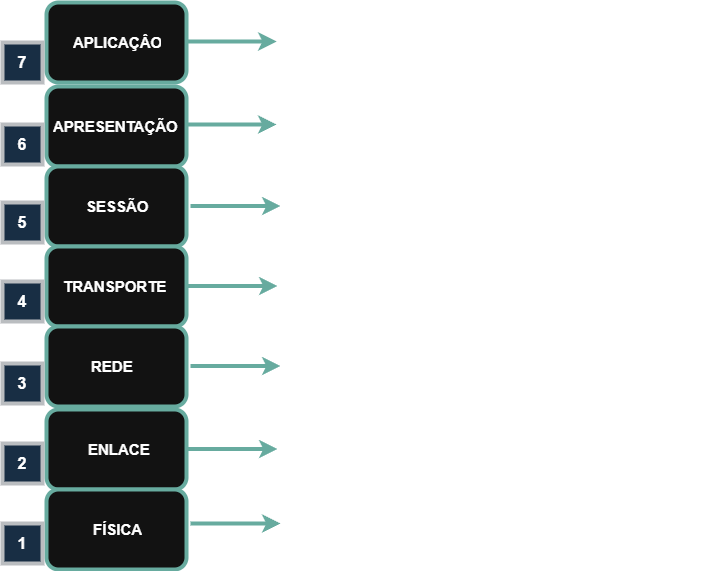
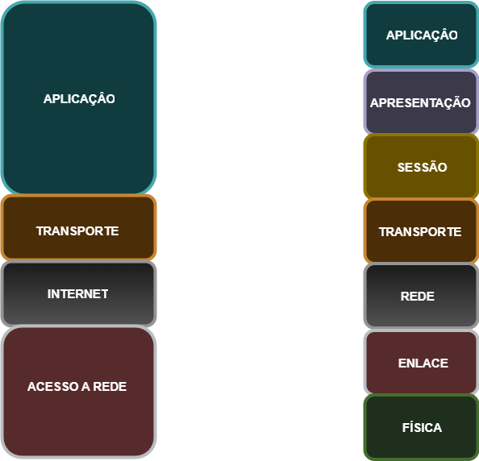

# Índice

- [Índice](#índice)
- [01 - Revisão](#01---revisão)
  - [Contexto Histórico](#contexto-histórico)
  - [Por que Estudar os Modelos?](#por-que-estudar-os-modelos)
- [MODELO OSI](#modelo-osi)
- [MODELO TCP/IP](#modelo-tcpip)
- [Comparação OSI x TCP/IP](#comparação-osi-x-tcpip)

# 01 - Revisão

Para podermos realizar a automação de processos, primeiro precisamos entender como fazer o acesso aos equipamentos de rede e depois, conseguiremos fazer isso de forma automática.
Então vamos fazer uma breve revisão dos principais protocolos de rede para acesso aos equipamentos.  

No início, quando surgiram as redes, não existia nenhum padrão. Com isso, o crescimento se deu de forma desordenada e cada fabricante desenvolvia os protocolos conforme sua necessidade,
ou seja, as coisas não eram compatíveis entre si. Isso tornava uma rede "isolada" de outra pois cada rede ficava dependente de um único fabricante sem poder escolher outro.  

Foi então que em 1984, a ISO (International Organization for Standardization) lançou o modelo de referência OSI (Open Systems Interconnection). Esse é um modelo de referência que visa padronizar e trazer interoperabilidade para que as redes sejam desenvolvidas independente do fabricante.  

Porém, depois de algum tempo surgiu o padrão TCP/IP que é uma pilha de protocolos. Então, por mais que já existisse o modelo anterior, o mercado adotou e implementou o TCP/IP porém,
como os equipamentos são referenciados através do modelo OSI, os dois coexistem até hoje.

## Contexto Histórico

No início da era das redes de computadores (décadas de 1960-1970), não existiam padrões universais de comunicação. Cada fabricante (IBM, DEC, Xerox, etc.) desenvolvia seus próprios protocolos proprietários, resultando em:  

- **Incompatibilidade** total entre equipamentos de fabricantes diferentes
- **Vendor Lock-in:** Organizações ficavam "presas" a um único fornecedor
- **Custos elevados** de integração e manutenção
- **Limitações de escalabilidade** das redes

**Marco Histórico: 1984**  

A ISO (International Organization for Standardization) lançou o modelo OSI (Open Systems Interconnection), revolucionando a padronização de redes:  

**🎯 Objetivo:** Criar um modelo de referência universal para interoperabilidade entre sistemas de diferentes fabricantes  

**Evolução Paralela: TCP/IP**  

Paralelamente, o DoD (Department of Defense) americano desenvolveu a stack TCP/IP para a ARPANET (precursora da Internet), que eventualmente se tornou o padrão de facto mundial.

## Por que Estudar os Modelos?

**Para Automação de Redes:**  

✅ **Troubleshooting estruturado:** Identificar em qual camada está o problema  
✅ **Desenvolvimento de scripts:** Entender como acessar equipamentos programaticamente  
✅ **APIs e protocolos:** Conhecer onde operam (HTTP/HTTPS na camada de aplicação)  
✅ **Segurança:** Implementar controles apropriados por camada  

# MODELO OSI

**Visão Geral**  

O modelo OSI divide a comunicação de rede em 7 camadas independentes, cada uma com responsabilidades específicas:



**Camada 7 : Aplicação**  

    Interface entre o usuário e a rede.
    Proporciona serviços como e-mail, navegação na web, transferência de arquivos.
    Exemplos de protocolos: HTTP, HTTPS, FTP, SMTP, POP3, IMAP, Telnet, SSH, DNS.

| Categoria     | Protocolos        | Porta Padrão | Uso                  |
|---------------|-------------------|--------------|----------------------|
| Web           | HTTP, HTTPS       | 80, 443      | Navegação, APIs REST |
| Email         | SMTP, POP3, IMAP  | 25, 110, 143 | Correio eletrônico   |
| Transferência | FTP, SFTP         | 21, 22       | Arquivos             |
| Administração | SSH, Telnet, SNMP | 22, 23, 161  | Automação de redes   |
| DNS           | DNS               | 53           | Resolução de nomes   |

**💡 Relevância para Automação:**

- **APIs REST/RESTCONF** operam nesta camada
- **SSH para automação** via scripts Python/Ansible
- **SNMP para monitoramento** automatizado

**Camada 6 : Apresentação**  

    Responsável por tradução, criptografia e compactação de dados.
    Converte formatos de arquivos entre sistemas diferentes.
    Exemplos de formatos e protocolos: SSL/TLS, JPEG, GIF, MP3, MPEG, ASCII, Unicode.

| Função       | Exemplos             | Aplicação Prática            |
|--------------|----------------------|------------------------------|
| Criptografia | SSL/TLS, IPSec       | HTTPS para APIs seguras      |
| Compressão   | ZIP, GZIP            | Otimização de transferências |
| Codificação  | ASCII, UTF-8, Base64 | Formatação de dados          |
| Formatos     | JPEG, MP3, PDF       | Multimedia                   |

**Camada 5 : Sessão**  

    Controla o estabelecimento, manutenção e encerramento de sessões de comunicação entre dispositivos.
    Garante a sincronização e o gerenciamento das conexões.
    Exemplos de protocolos: RPC, NetBIOS, PPTP, SIP.

| Protocolo | Função                           | Exemplo de Uso               |
|-----------|----------------------------------|------------------------------|
| NetBIOS   | Serviços de rede Windows         | Compartilhamento de arquivos |
| RPC       | Chamadas remotas de procedimento | APIs distribuídas            |
| PPTP/L2TP | Túneis VPN                       | Conexões seguras             |
| SIP       | Sinalização VoIP                 | Telefonia IP                 |

**Camada 4 : Transporte**  

    Fornece comunicação confiável ou não entre dispositivos.
    Controla o fluxo de dados e pode realizar a retransmissão de pacotes perdidos.
    Protocolos principais: TCP (confiável, orientado à conexão) e UDP (rápido, sem conexão).

| Protocolo | Características       | Quando Usar          |
|-----------|-----------------------|----------------------|
| TCP       | • Confiável           | SSH, HTTP, FTP       |
|           | • Orientado à conexão | APIs críticas        |
|           | • Controle de fluxo   |                      |
|           | • Retransmissão       |                      |
| UDP       | • Rápido              | DNS, SNMP, Streaming |
|           | • Sem conexão         | Monitoramento        |
|           | • Sem garantias       |                      |
|           | • Baixo overhead      |                      |

**Camada 3 : Rede**  

    Responsável pelo roteamento e endereçamento dos pacotes de dados entre redes diferentes.
    Define os caminhos para a entrega eficiente dos pacotes.
    Protocolos e tecnologias: IP, ICMP, ARP, RIP, OSPF, BGP.  

| Protocolo        | Categoria            | FunçãoIPv4/IPv6                     |
|------------------|----------------------|-------------------------------------|
| IPv4/IPv6        | Endereçamento        | Identificação única de dispositivos |
| ICMP             | Diagnóstico          | Ping, traceroute                    |
| OSPF, BGP, EIGRP | Roteamento           | Determinação de melhores caminhos   |
| ARP              | Resolução            | IP para MAC address                 |

**Camada 2 : Enlace de Dados**  

    Controla o acesso ao meio físico e a detecção/correção de erros na transmissão.
    Organiza os dados em quadros antes da transmissão.
    Dividida em duas subcamadas: LLC (Logical Link Control) e MAC (Media Access Control).
    Exemplos de protocolos e tecnologias: Ethernet, Wi-Fi (802.11), PPP, VLAN (802.1Q), ARP.  

| Subcamada                  | Função                    | Tecnologias     |
|----------------------------|---------------------------|-----------------|
| LLC (Logical Link Control) | Controle de enlace lógico | IEEE 802.2      |
| MAC (Media Access Control) | Acesso ao meio físico     | Ethernet, Wi-Fi |

**Principais Tecnologias:**

- **Ethernet (802.3):** Padrão cabeado
- **Wi-Fi (802.11):** Padrão wireless
- **VLAN (802.1Q):** Segmentação lógica
- **STP:** Prevenção de loops

**Camada 1 : Física**  

    Responsável pela transmissão de bits no meio físico (cabos, ondas de rádio, fibra óptica).
    Define características elétricas e mecânicas da conexão.
    Exemplos de tecnologias: Cabo UTP, Fibra Óptica, Bluetooth, Wi-Fi, RS-232, DSL.  

| Meio         | Características     | Aplicação         |
|--------------|---------------------|-------------------|
| Cabo UTP     | Cat 5e, 6, 6a, etc. | LANs corporativas |
| Fibra Óptica | Monomodo, multimodo | Backbone, WANs    |
| Wireless     | 2.4GHz, 5GHz, 6GHz  | Mobilidade        |
| Coaxial      | RG-58, RG-59        | Legacy, CATV      |

# MODELO TCP/IP

**Características Fundamentais**  

O modelo TCP/IP é a implementação prática que dominou o mercado devido a:  

✅ Simplicidade: Apenas 4 camadas  
✅ Flexibilidade: Menos rígido que OSI  
✅ Pragmatismo: Baseado em protocolos reais  
✅ Interoperabilidade: Adoção universal  

  

```text
┌─────────────────────────────────────┐
│   4. APLICAÇÃO    │  Dados          │  ← Combina OSI 7+6+5
├─────────────────────────────────────┤
│   3. TRANSPORTE   │  TRANSPORTE     │  ← Igual OSI 4
├─────────────────────────────────────┤
│   2. INTERNET     │  REDE           │  ← Igual OSI 3
├─────────────────────────────────────┤
│   1. ACESSO REDE  │  Quadros/Bits   │  ← Combina OSI 2+1
└─────────────────────────────────────┘
```

**Camada 4 : Aplicação**  

    Corresponde às camadas de Aplicação, Apresentação e Sessão do modelo OSI.
    Oferece serviços de rede diretamente para as aplicações do usuário.
    Exemplos de protocolos: HTTP, HTTPS, FTP, SMTP, POP3, IMAP, Telnet, SSH, DNS, SNMP.  

**Camada 3 : Transporte**  

    Responsável pela comunicação fim a fim entre dispositivos.
    Garante a entrega confiável dos dados ou o envio rápido sem conexão.
    Protocolos principais: TCP (confiável, orientado à conexão) e UDP (rápido, sem conexão).  

**Camada 2 : Internet**  

    Equivalente à camada de Rede do modelo OSI.
    Define endereçamento, roteamento e empacotamento dos dados para envio entre redes diferentes.
    Protocolos e tecnologias: IP, ICMP, ARP, RIP, OSPF, BGP.  

**Camada 1 : Acesso à Rede**  

    Combina as camadas de Enlace de Dados e Física do modelo OSI.
    Define como os dados são transmitidos fisicamente pelo meio de comunicação.
    Exemplos de tecnologias: Ethernet, Wi-Fi (802.11), PPP, VLAN (802.1Q), DSL, Fibra Óptica.  

Aqui vale notar que algumas camadas dos dois modelos são iguais. Já o modelo TCP/IP tem a camada **APRESENTAÇÃO, camada 4**, que é referente as camadas **APLICAÇÃO, APRESENTAÇÃO e SESSÃO** do modelo OSI, ou seja, **as camadas 7, 6 e 5**. A **camada 4** do OSI é igual a **camada 3** do modelo TCP/IP.  
Agora a **camada 3** do OSI é igual a **camada 2** do TCP/IP porém uma é chamada de REDE e a outra de INTERNET.  
Já a **camada 1** do modelo TCP/IP (Acesso à Rede) engloba as **camadas 1 (Física) e 2 (Enlace) do modelo OSI**, além de parte das funções da camada 3 (Rede).

# Comparação OSI x TCP/IP  

| Modelo OSI (7 camadas)  | Modelo TCP/IP (4 camadas) | Principais Protocolos/Exemplos    |
|-------------------------|---------------------------|-----------------------------------|
| 7. Aplicação            | 4. Aplicação              | HTTP, HTTPS, FTP, SMTP, DNS, SNMP |
| 6. Apresentação         | 4. Aplicação              | SSL/TLS, JPEG, MPEG, ASCII        |
| 5. Sessão               | 4. Aplicação              | RPC, NetBIOS, SIP                 |
| 4. Transporte           | 3. Transporte             | TCP, UDP                          |
| 3. Rede                 | 2. Internet               | IP, ICMP, OSPF, BGP               |
| 2. Enlace de Dados      | 1. Acesso à Rede          | Ethernet, Wi-Fi, VLAN, PPP        |
| 1. Física               | 1. Acesso à Rede          | Cabo UTP, Fibra Óptica, DSL       |
