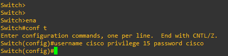
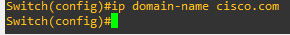
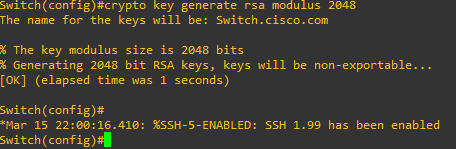
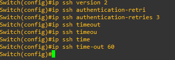
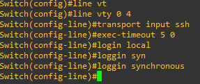

# 02 - SSH (Secure Shell)

## Windows

Para instalar o OpenSSH Server no Windows 11 usando, siga os passos:

*  Clique em iniciar e clique em Configurações.

    

* Em seguida, clique em "Recursos opcionais".
    

* Adicionar um Recurso Opcional
Role para baixo e clique em "Exibir recursos" (ou "Adicionar um recurso").
    

* Na lista de recursos, procure por "OpenSSH Server".
    

* Marque a caixa ao lado de "OpenSSH Server" e clique em "Avançar".
    

* Aguarde a instalação ser concluída.
    

* Iniciar o Serviço OpenSSH Server
Após a instalação, você precisará iniciar o serviço OpenSSH Server manualmente.
Pressione Win + R, digite services.msc e pressione Enter.
No Gerenciador de Serviços, localize o serviço chamado "OpenSSH SSH Server".
Clique com o botão direito sobre ele e selecione "Iniciar".

Para garantir que o serviço inicie automaticamente com o Windows, clique com o botão direito novamente, selecione "Propriedades" e defina o "Tipo de inicialização" como "Automático".
|  |   |
|-----------------------------------|------------------------------------|
|  |  |

* Configurar o Firewall para Permitir Conexões SSH

|                     |                       |
|---------------------------------------------------------|-----------------------------------------------------------|
| 01 Pressione Win + S, digite "Firewall do Windows"      | 02 Selecione "Firewall do Windows com Segurança Avançada" |
|                     |                       |
| 03 No painel esquerdo, clique em "Regras de Entrada"    | 04 No painel direito, clique em "Nova Regra"              |
|                     |                       |
| 05 Selecione "Porta" e clique em "Avançar"              | 06 Escolha "TCP" e insira a porta 22. Clique em "Avançar" |
|                     |                       |
| 07 Selecione "Permitir a conexão" e clique em "Avançar" | 08 Marque todas as opções de perfil (Domínio, Privado e Público) e clique em "Avançar"|
|                     |                       |
| Dê um nome à regra e clique em "Concluir"               | Verifique a regra                                         |

* Verificar a Instalação
Abra o Prompt de Comando ou PowerShell e digite:

    ssh localhost
    Se a instalação estiver correta, você será solicitado a inserir suas credenciais de usuário do Windows.

|  |  |
|------------------------------------|------------------------------------|

Por padrão o OpenSSH é instalado no diretório **C:\Windows\System32\OpenSSH**.  Dentro desse diretório existe o arquivo **sshd_config_default** que contém todas as configurações necessárias para o funcionamento do ssh no Windows. É nesse arquivo que podemos alterar o número de portas e demais configurações necessárias. De inicio, não precisamos alterar nada pois o ssh estará funcionando normalmente. Outras ferramentas encontram-se disponíveis nesse diretório.

## Linux

Primeiro vamos verificar se o SSH está instalado. A versão de linux que estou utilizando nesse artigo é a Debian, mas nas outras distribuições o processo é semelhante. 

Agora que conferimos que o SSH não está instalado, vamos instalar o client. Para isso devemos instalar o pacote **openssh-client**.

Agora faremos o mesmo para o para o pacote **openssh-server**.

E agora precisamos instalar o pacote **openssh-sftp-server**

Como todo serviço, podemos verificar que ele não fica ativo por padrão.

Então vamos iniciar o serviço e habilitar o mesmo para iniciar junto do sistema.

|  |  |
|----------------------------------|----------------------------------|
|                                     |

Todas as configurações do servidor ficam em: **/etc/ssh/sshd_config** . Já as configurações do cliente ficam em: **/etc/ssh/sshd_config** .  

Agora vamos testar o ssh.

## CISCO

Para habilitarmos o **SSH** em equipamentos Cisco, primeiro precisamos configurar um usuário com privilégios de acesso. **OBS:** aqui vou criar um usuário chamado cisco com o **privilégio 15**, que é o maior privilégio possível. Não é recomendado utilizar esse privilégio em produção. 

Como sabemos, o **SSH** é mais seguro que o TELNET que deve ser evitado por criptografar os dados durante a comunicação entre os dispositivos. Para fazer isso, ele utiliza chave criptográficas. **OBS:** chaves com tamanho igual a 1024 ou menores que esse tamanho são consideradas inseguras nos dias atuais. Recomenda-se utilizar chaves com tamanho de **2048** ou maiores que isso, lembrando que quanto maior for o tamanho da chave, maior será o consumo de cpu e memória pela caixa.   
Antes de gerarmos a chave, devemos configurar o nome de domínio no equipamento. As chaves são baseadas nisso. 

  

O próximo passo agora é gerar a chave de criptografia.

Como podemos perceber, logo após a geração da chave, a caixa retorna uma mensagem dizendo que o **ssh versão 1.9**está habilitado. Isso significa que já temos o ssha em nossa caixa, mas o recomendado é utilizarmos a versão mais nova suportada. Então aqui iremos realizar alguns ajustes no ssh.

* **ip ssh version 2 :** aqui definimos que a versão do ssh a ser utilizada é a 2
* **ip ssh authentication-retries 3:** esse linha define que só temos 3 tentativas de realizar o login
* **ip ssh time-out 60:** tempo limite para o usuário fornecer as credenciais. Se em 60 segundos não forem digitados usuário e senha, a conexão é encerrada

Nesse ponto já temos o ssh habilitado. Porém ainda precisamos informar que nossas linhas virtuais precisam utilizar o protocolo ssh.

