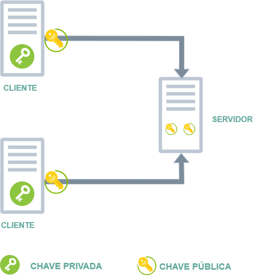
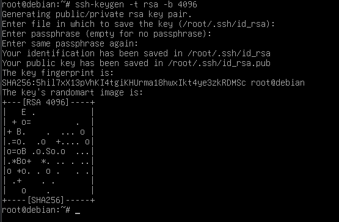
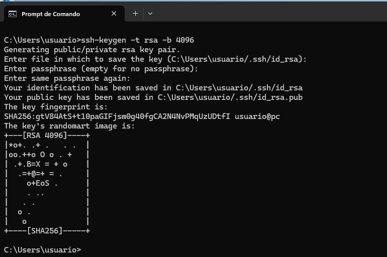
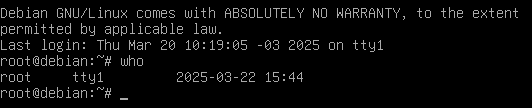
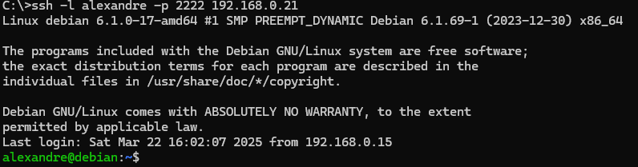
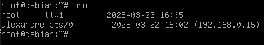
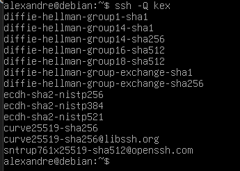

# 03 - SSH (Secure Shell) - Configurações e Hardenering

Agora vamos olhar os arquivos de configuração do ssh. Aqui podemos configurar quais usuários são permitidos, qual porta o ssh irá utilizar e etc. Aqui vou dar enfoque a segurança pois como é sabido, o ssh utiliza por padrão a porta 22. Com isso existem diversos tipos de de ataque, então a ideia é diminuir a superfície de ataque.    

Mas o que é Hardening (endurecer)?   

Hardening é o processo de reforçar a segurança de um sistema, reduzindo vulnerabilidades e minimizando superfícies de ataque. No caso do SSH, isso significa configurar o serviço para ser mais seguro, prevenindo acessos não autorizados e protegendo contra ataques como brute force e MITM (Man-in-the-Middle).   

## 🔹 1. Hardening SSH no Linux
 
Passo a passo para reforçar a segurança do SSH no Linux (Debian, Ubuntu, CentOS, Rocky Linux, etc.)   

Editar a Configuração do SSH

**sudo nano /etc/ssh/sshd_config**

1. Altere as seguintes configurações:   
   > **Port 2222** - Alterar a porta padrão (evita scanners automatizados). Escolha uma porta entre 1024-65535  
   > **SyslogFacility AUTH** - Define o tipo de log (geralmente AUTH para logs de autenticação).  
   > **LogLevel INFO** - aqui definimos os níveis de log que queremos obter.  
   > **PermitRootLogin no** - Desativa login como root  
   > **PubkeyAuthentication yes** - Impedir autenticação por senha (usar apenas chaves)  
   > **AuthorizedKeysFile .ssh/authorized_keys** - define o caminho e o nome do arquivo das chaves autorizadas  
   > **PasswordAuthentication no** - Impedir autenticação por senha (usar apenas chaves)  
   > **ClientAliveInterval 300** - Define tempo de timeout. A cada 300 segundos (5 minutos), o servidor envia um pacote de keep-alive para verificar se o cliente ainda está ativo       
   > **ClientAliveCountMax 2** - Aqui é definido quantas vezes quantas vezes o servidor envia os pacotes keep-alive sem receber resposta, ou seja duas vezes seguidas. 
   > **AllowUsers usuario1 usuario2** - Permite apenas usuários específicos          
   > **KexAlgorithms curve25519-sha256,ecdh-sha2-nistp521,ecdh-sha2-nistp384** - Restringe o uso de certos algoritmos inseguros  
   > **Ciphers aes256-gcm@openssh.com,aes128-gcm@openssh.com** - Restringe o uso de certos algoritmos inseguros  
   > **MACs hmac-sha2-512,hmac-sha2-256** - Restringe o uso de certos algoritmos inseguros  
   > **Protocol 2** - Habilitar apenas versões seguras do protocolo SSH   

  **OBS:** para podermos ter logs do ssh, temos que ter instalado um serviço de logs no sistema. Geralmente o utilizado em linux é o **rsyslog**. Então verificar se ele está instalado e rodando.
  **OBS2:** o caminho dos logs em sistemas Debian / Ubuntu ficam em **/var/log/auth.log**. Já em distribuições baseadas em Red Hat/CentOS os logs ficam em **/var/log/secure**.   
  **OBS3:** Os possíveis níveis de log são:  
  > * **QUIET:** Logs mínimos.  
  > * **FATAL:** Apenas erros fatais.  
  > * **ERROR:** Erros.  
  > * **INFO:** Informações gerais (recomendado).
  > * **VERBOSE:** Mais detalhes.  
  > * **DEBUG:** Logs detalhados (use apenas para depuração).  
  
Deixo aqui um exemplo do arquivo **sshd_config** com as configurações aplicadas. [sshd_config](Arquivos/sshd_config)  

2. Reiniciar o SSH para aplicar as mudanças  
    > **sudo systemctl restart ssh**  
3. Configurar Firewall  
Permita apenas a porta do SSH:  
    > **sudo ufw allow 2222/tcp**  
    > **sudo ufw enable**  

## Chave Públicas x Chaves Privadas

Certo chegamos em um ponto em que já configuramos o daemon ssh e precisamos entender como funcionam as chaves. Agora não iremos mais utilizar usuário e senha pois o acesso através de chaves é mais seguro e auxilia no processo de automação.  
A palavra chave vem de uma analogia a portas que precisam de chaves para fechar e abrir. Esse é um conceito utilizado em criptografia assimétrica. Uma chave nada mais é o resultado de um algoritmo que retorna caracteres como números, letras e bytes por exemplo e fica armazenado dentro de um arquivo.  
As chaves são geradas por algoritmos de criptografia assimétrica, como **RSA, ECDSA, ou Ed25519**. Esses algoritmos usam matemática avançada (como fatoração de números primos ou curvas elípticas) para criar um par de chaves que estão matematicamente relacionadas, mas não podem ser derivadas uma da outra de forma prática.  
Entendido o conceito de chaves, precisamos notar que existem dois tipos de chaves: **Pública e Privada**  
  * **Chave Pública:** Pode ser compartilhada livremente e é usada para criptografar dados ou verificar assinaturas.  
  * **Chave Privada:** Deve ser mantida em segredo e é usada para descriptografar dados ou criar assinaturas.  

**Geração de Chaves**  
Vamos imaginar que queremos acessar um servidor Linux a partir de um host Windows. Então, no host Windows, geramos um par de chaves (pública e privada). A chave privada fica no host Windows, e a chave pública é copiada para o servidor Linux.  

**Autenticação**  

Quando o host Windows tenta se conectar ao servidor Linux, ele usa sua chave privada para provar sua identidade. O servidor Linux verifica a identidade usando a chave pública armazenada no arquivo **~/.ssh/authorized_keys**  

Para gerarmos as chaves vamos ir no terminal do windows e devemos digitar:  
**ssh-keygen -t rsa -b 4096**  
Esse comando cria:  
**id_rsa:** Chave privada (mantida no host Windows).  
**id_rsa.pub:** Chave pública (enviada para o servidor Linux).  
**OBS:** como enviamos o arquivo id_rsa para o linux devemos alterar o nome desse arquivo para **authorized_keys**. Esse é o arquivo que o sshd_config irá buscar para a autenticação conforme configuramos anteriormente.  
**OBS2:** ao gerar as chaves, o ssh-keygen vai pedir uma senha. Pode-se deixar a chave sem senha mas o recomendado é se utilizar uma senha. Essa senha só ira ser utilizada uma única vez.  

**Segurança**  
A chave privada nunca deve ser compartilhada com ninguém. A chave pública pode ser compartilhada livremente.  

Aqui vale ressaltar que o comando para criar as chaves é igual tanto em linux e windos, porém onde as chaves são criadas é ligeiramente diferente:  
  > **Linux**  
  > Por padrão, as chaves são salvas no diretório ~/.ssh/:  
  > **Chave privada: ~/.ssh/id_rsa**  
  > **Chave pública: ~/.ssh/id_rsa.pub**    

  > **Windows**  
  > Quando solicitado, escolha o local para salvar as chaves. O padrão é:
  > Chave privada: C:\Users\<seu_usuario>\.ssh\id_rsa  
  > Chave pública: C:\Users\<seu_usuario>\.ssh\id_rsa.pub  

|  |  |
|-------------------------------------|---------------------------------------|
| LINUX                               | WINDOWS                               |

**OBS:** o processo irá pedir uma senha. Não é necessário digitar a senha, mas recomenda-se utilizar uma senha forte para as chaves.

## Realizando acesso

Agora para realizarmos o acesso ao dispositivo através do protocolo ssh, termos que indicar a porta e o usuário para realizar o acesso. Vale lembrar, que no nosso caso alteramos a porta do ssh para **22222** . Primeiro vamos verificar em nosso servidor ssh que não existem conexões ativas, ou seja somente o usuário root está logado. Para isso vamos no terminal do linux e digitamos **who** para verificar as conexões ativas.

Feito isso, vamos no terminal do dispositivo em que vamos realizar o ssh e digitamos o comando:  

**ssh -l alexandre -p 2222 192.168.0.21**  

  

Para termos certeza, vamos voltar ao terminal do linux para verificarmos novamente as conexões.

## 🔹 2. Hardening SSH no Windows

O processo no Windows é bem parecido com o linux, mas com algumas poucas diferenças.  

Passo a passo para reforçar a segurança do OpenSSH no Windows 10/11 e Windows Server.
1. Instalar o OpenSSH (caso não esteja instalado)

  > Abra a o powershell e digite 
  > Add-WindowsCapability -Online -Name OpenSSH.Server  

Inicie o serviço:  

  > Start-Service sshd  
  > Set-Service -Name sshd -StartupType Automatic  

2. Editar Configuração do SSH no Windows  

Abra o arquivo:  
  > **notepad C:\ProgramData\ssh\sshd_config**  

Modifique estas linhas:  
   
  > **Port 2222** - Alterar a porta padrão de 22 para 2222  
  > **PermitRootLogin no** - Impedir login de administrador via SSH  
  > **PasswordAuthentication no** - Habilitar apenas chaves SSH    
  > **PubkeyAuthentication yes**  - Habilitar apenas chaves SSH  

Salve e reinicie o SSH:  

  > **Restart-Service sshd**  

3. Configurar Firewall  

  > **New-NetFirewallRule -DisplayName "SSH Custom" -Direction Inbound -Protocol TCP -LocalPort 2222 -Action Allow **

4. Auditar tentativas de login (Event Viewer)  

Abra o Event Viewer e navegue até:  
  > **Applications and Services Logs > Microsoft > Windows > OpenSSH > Operational**

Ative o log de auditoria para rastrear tentativas de login suspeitas.  

## 🔹 3. Hardening SSH em equipamentos CISCO  

Passo a passo para reforçar a segurança do SSH em roteadores e switches Cisco.  

1. Habilitar apenas SSH (desativar Telnet)  

  > **conf t**  
  >   **line vty 0 4**  
  >   **transport input ssh**  
  >   **exit**  

2. Alterar a porta padrão do SSH  

  > **ip ssh port 2222 rotary 1**  
  > **line vty 0 4**  
  > **rotary 1**  
  > **exit**  

3. Definir tempo máximo de inatividade  

  > **ip ssh time-out 300**  

4. Restringir número de tentativas de login  

  > **ip ssh authentication-retries 3**  

5. Habilitar apenas SSH versão 2  

  > **ip ssh version 2**  

6. Criar um usuário com senha segura  

  > **username admin privilege 15 secret SenhaForte123**  

7. Definir algoritmos seguros

  **ip ssh server algorithm encryption aes256-ctr**  
  **ip ssh server algorithm mac hmac-sha2-256**  

**OBS:** pode ser que na rede existam equipamentos mais antigos e que não suportem os algoritmos de criptografia e troca de chaves mais novos e com isso, não tenhamos mais acesso via ssh. Para isso precisamos habilitar os algoritmos mais antigos por questões de compatibilidade.  
Para verificarmos os algoritmos ativos devemos digitar os seguinte comandos no terminal do linux:  
**ssh -Q kex** - Lista os algoritmos de troca de chaves disponíveis  
**ssh -Q cipher**  - Lista os algoritmos de criptografia disponíveis  

|  |  |
|-----------------------------------------|-----------------------------------------|
| Algoritmos de trocas de chaves          | Algoritmos de cifra                     |

Então precisamos realizar os ajustes de compatibilidade.  
Em distribuições baseadas em **Red Hat (Rocky Linux, AlmaLinux,, Fedora e etc)**, devemos digitar o comando:  

**sudo update-crypto-policies --set LEGACY**  

Esse comando altera as políticas criptográficas do sistema para permitir o uso de algoritmos mais antigos e menos seguros.  
* O que esse comando faz?

Ele configura o sistema para usar a política LEGACY, que permite protocolos e algoritmos mais antigos, como:

  > **TLS 1.0 e 1.1**  
  > **Chaves RSA menores que 2048 bits**  
  >**Algoritmos MD5 e SHA-1**  

A ferramenta **update-crypto-policies** é usada para gerenciar essas configurações no Rocky Linux e outras distribuições baseadas em RHEL.  

Já em distribuições baseadas em Debian / Ubuntu, essa ferramenta não existe. Então é preciso alterar manualmente os arquivos de configuração.  

Edite o arquivo de configuração do OpenSSL:  

**sudo nano /etc/ssl/openssl.cnf**

Adicione ou edite esta linha dentro da seção [system_default_sect]:  

** MinProtocol = TLSv1  **
** CipherString = DEFAULT:@SECLEVEL=1  **

Edite o arquivo **/etc/ssh/ssh_config** (cliente SSH)  

**sudo nano /etc/ssh/ssh_config**

Adicione as seguintes linhas no final do arquivo:  

> Host *  
    > **KexAlgorithms +diffie-hellman-group14-sha1,diffie-hellman-group1-sha1** - Habilita algoritmos antigos como diffie-hellman-group1-sha1, necessários para switches e roteadores Cisco mais antigos.  
    > **Ciphers +aes128-cbc,3des-cbc** - Ativa cifradores antigos, como aes128-cbc e 3des-cbc, compatíveis com versões antigas do SSH nos Cisco.  
    > **HostKeyAlgorithms +ssh-rsa** - Permite chaves RSA mais antigas, que foram removidas das versões mais recentes do OpenSSH.   
    > **PubkeyAcceptedAlgorithms +ssh-rsa** - Permite chaves RSA mais antigas, que foram removidas das versões mais recentes do OpenSSH.  

Configurar o Servidor SSH (sshd_config):  

Se você quiser permitir conexões SSH para o Debian de dispositivos antigos, edite:  

**sudo nano /etc/ssh/sshd_config**

Adicione ou altere estas linhas:

**KexAlgorithms +diffie-hellman-group1-sha1,diffie-hellman-group14-sha1**
**Ciphers +aes128-cbc,3des-cbc**  
**HostKeyAlgorithms +ssh-rsa**  
**PubkeyAcceptedAlgorithms +ssh-rsa**  

Depois reinicie o serviço SSH:

**sudo systemctl restart sshd**