## Protocolo TELNET (TELECOMMUNICATION NETWORK)

O Telnet é um protocolo da camada de Aplicação (Modelo OSI e TCP/IP) que permite a comunicação remota entre computadores através de uma interface de linha de comando. Ele foi um dos primeiros protocolos utilizados para acesso remoto a sistemas e equipamentos de rede.   

**Principais Características do Telnet:**

    Acesso remoto: Permite que um usuário controle um computador ou dispositivo de rede remotamente.
    Baseado em texto: Utiliza comandos enviados via terminal.
    Utiliza TCP: Funciona sobre o protocolo TCP na porta 23.
    Sem criptografia: A comunicação ocorre em texto puro, expondo credenciais e comandos a ataques de interceptação (sniffing).
    Baixa segurança: Como não oferece criptografia, é vulnerável a ataques como MITM (Man-in-the-Middle) e captura de senhas.

**Funcionamento do Telnet:**

    O cliente Telnet inicia uma conexão com um servidor na porta 23/TCP.
    Após a conexão, o usuário pode autenticar-se (se necessário) e executar comandos remotamente.
    O servidor responde com a saída dos comandos, permitindo o controle do sistema remoto.

**Desvantagens e Alternativa Segura**

    Vulnerável a ataques: Como transmite dados em texto puro, qualquer pessoa que consiga interceptar o tráfego pode visualizar informações sensíveis.
    Não recomendado para redes públicas: Pode ser facilmente explorado por invasores.
    Alternativa segura: O SSH (Secure Shell) substituiu o Telnet, oferecendo criptografia e autenticação mais seguras.

## Instalação do Telnet

### Windows

| 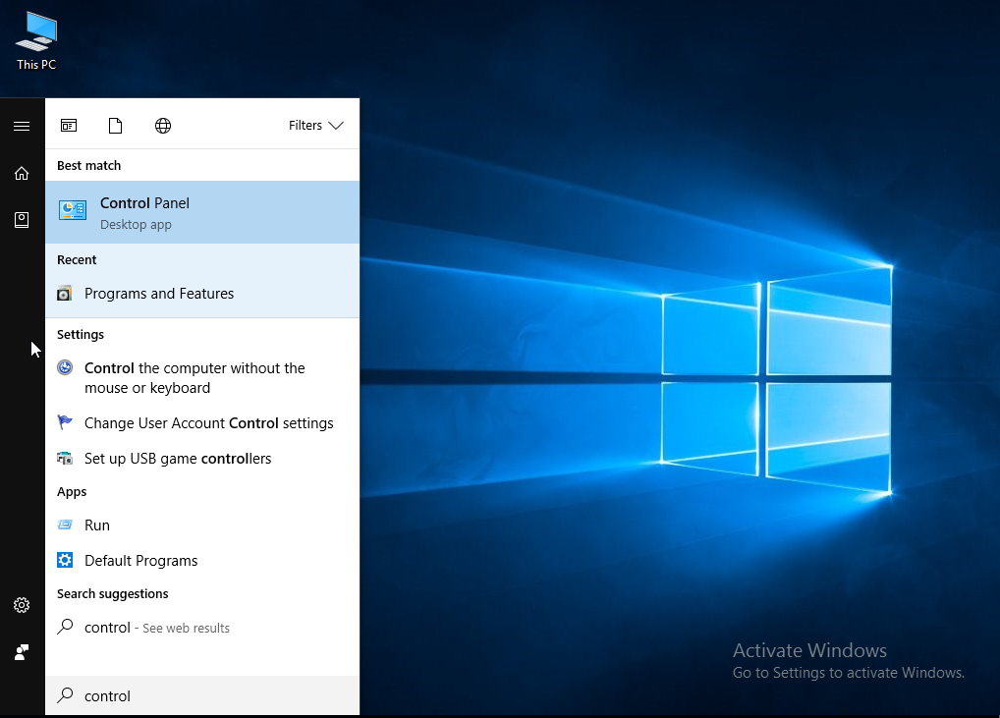 | 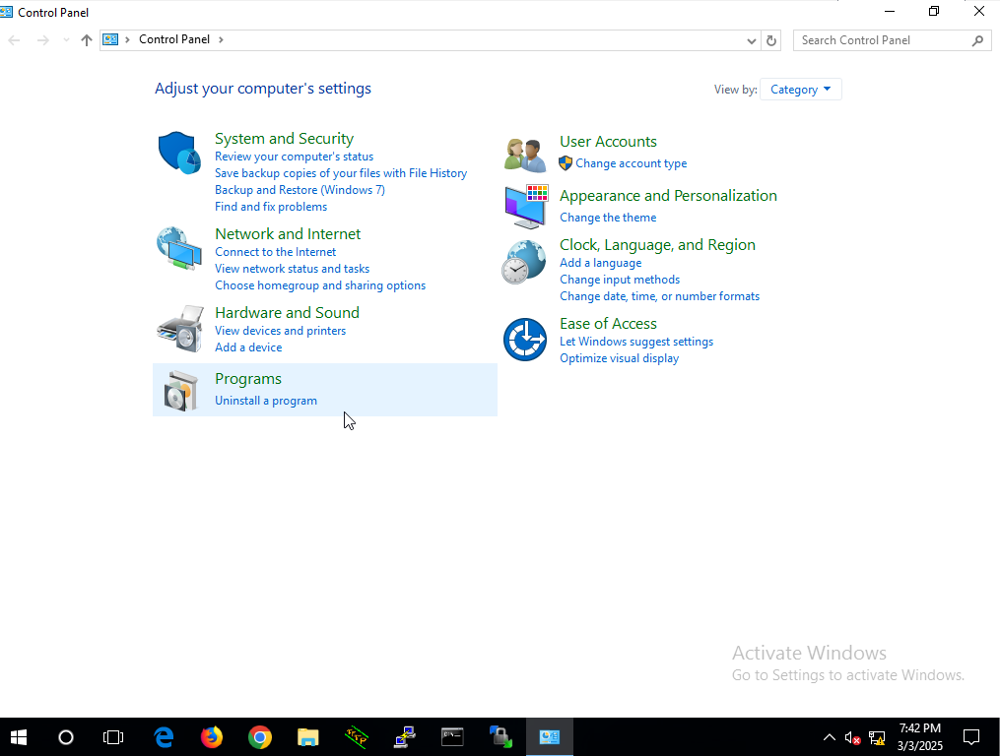 |
|------------------------------------------|------------------------------------------|
| 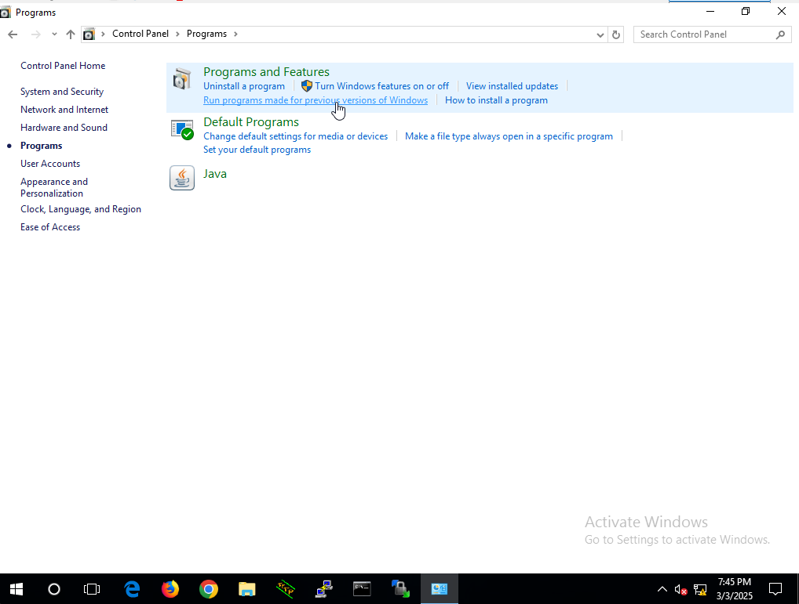 | 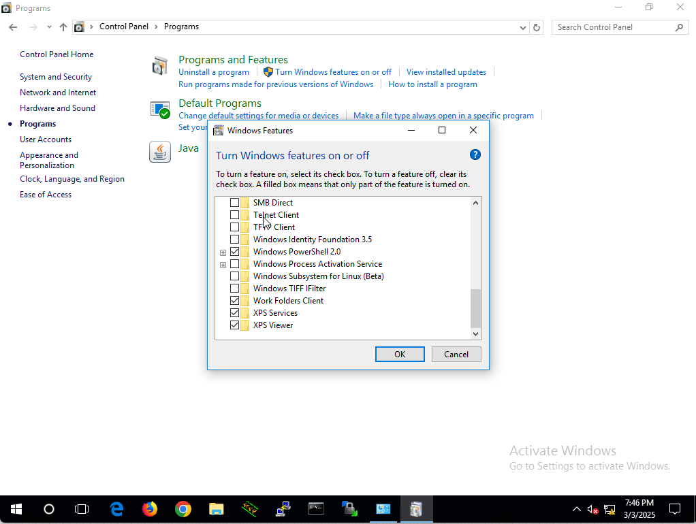 | 
| 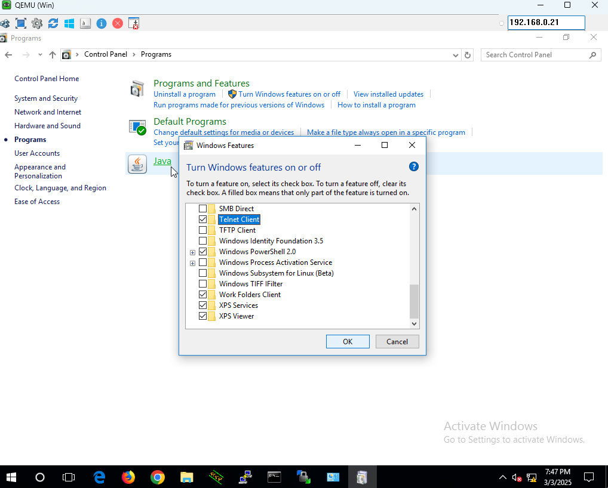 | 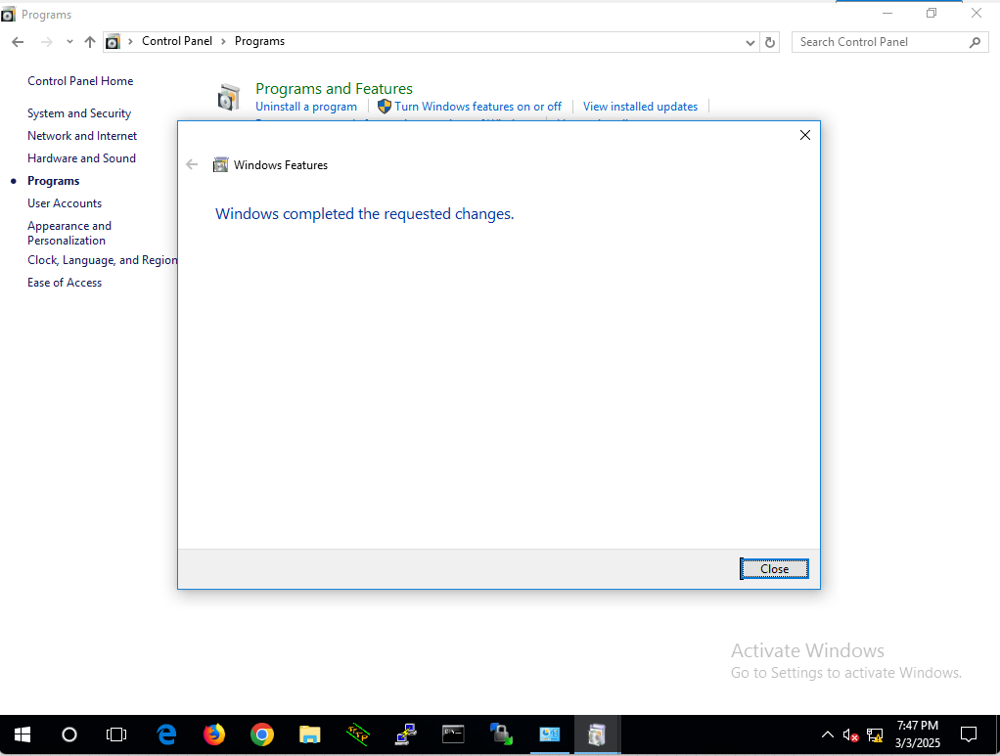 | 

  

### Linux

| 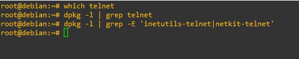 | 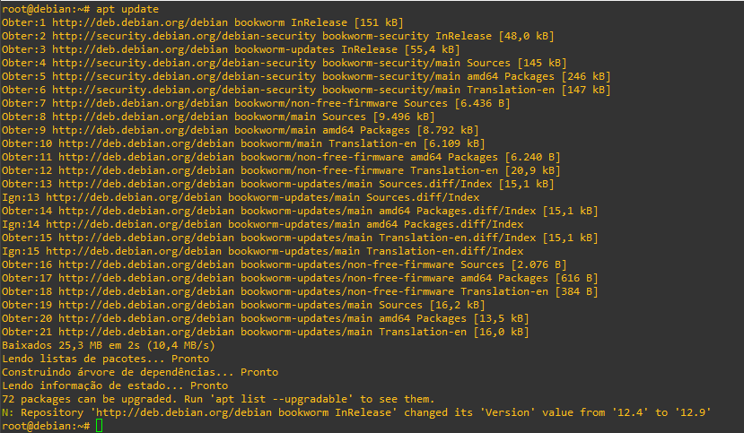 |
|---------------------------------------|---------------------------------------|
| 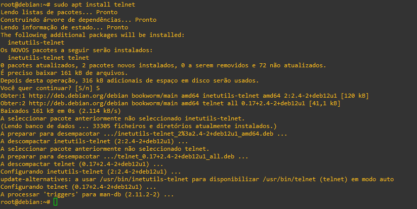 | 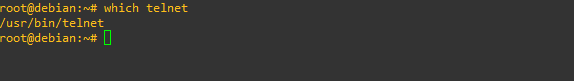 |

### Cisco

| 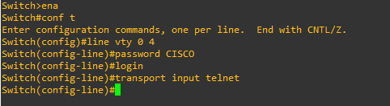 | 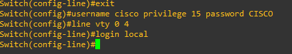 |
|--------------------------------------|--------------------------------------|
| 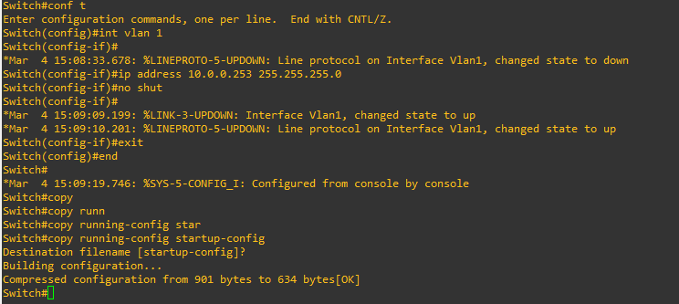                                        |

Cabe aqui uma pequena explicação para o entendimento da configuração. Vale ressaltar que essa configuração serve tanto para roteadores e switches.

**Configurar o Telnet na linha VTY**

* **line vty 0 15** : Define as linhas de acesso remoto. OBS: 15 é número máximo de terminais, mas esse número varia dependendo do equipamento.
* **password SEU_PASSWORD** : Define uma senha para o Telnet.
* **login** : Exige autenticação para o acesso.
* **transport input telnet** : Permite conexões Telnet.

**Configurar autenticação via usuário e senha**

* **username cisco privilege 15 password CISCO** : criação do usuário chamado cisco, com privilégio 15 (máximo) e com senha CISCO. OBS: sempre analisar o nível de privilégio necessário
* **line vty 0 15** : Define as linhas de acesso remoto
* **login local** : Exige a senha do banco de dados local, ou seja, a senha criada para o usuário Cisco.
* **transport input telnet** : Define que o protocolo de acesso as linhas vty será o Telnet 

**OBS:** Quando estamos nas linhas vty, se digitarmos somente **login** isso fará com que o equipamento exija uma senha. Essa senha é a definida no comando password e é única e compartilhada para toda a caixa. Já o comando **login local** faz com que a caixa peça uma senha do banco de dados local. Ou seja, isso permite que seja definidos múltiplos usuários
e múltiplas senhas. Método mais recomendado.

## Utilização

Para utilizar o telnet é simples. Veja as opções em windows e linux.

| WINDOWS                                    | LINUX                                  |
|--------------------------------------------|----------------------------------------|
| 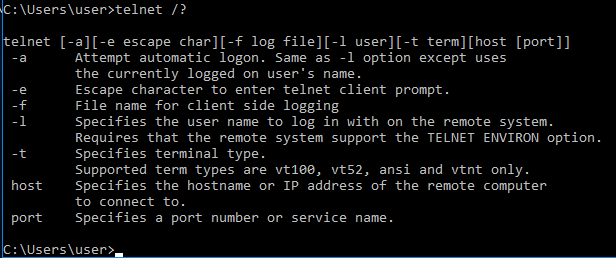 | 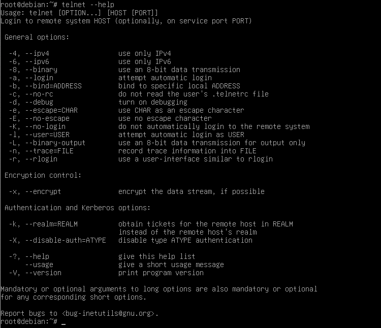 |

Como podemos observar pelas opções a sintaxe é simples. Um exemplo: telnet 10.0.0.254. Depois é só colocar usuário e senha.

**OBS:** como o telnet envia o fluxo de dados em texto plano sem criptografia, não é mais indicado se utilizar em produção. O indicado é substituir pelo SSH.   
**OBS2:** existem casos como em equipamentos velhos que não suportam o SSH em que o Telnet serve para se utilizar. Mas ele pode ser utilizado em testes para alguns casos específicos:

Exemplo:

* Testar se um servidor SMTP (e-mail) está ativo na porta 25:

    telnet mail.exemplo.com 25

* Testar se um serviço HTTP responde na porta 80:

    telnet site.com 80

* Testar um servidor MySQL na porta 3306:

    telnet 192.168.1.100 3306

Caso a conexão seja bem-sucedida, a tela do Telnet ficará em branco, indicando que a porta está aberta e o serviço está rodando.