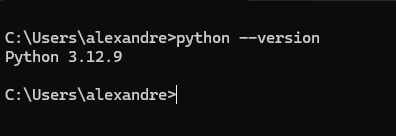
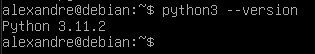
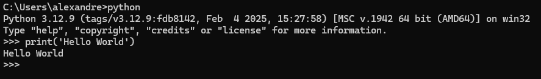
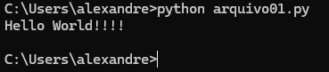
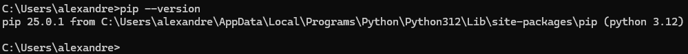
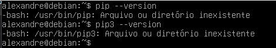
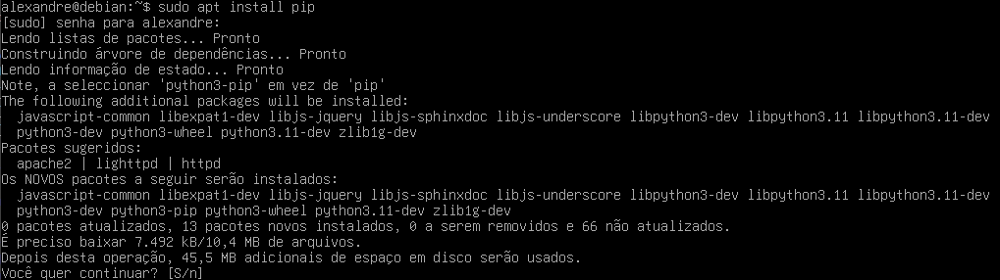
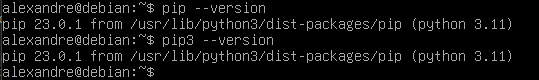
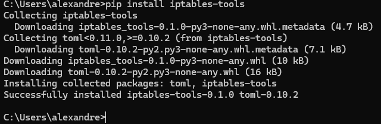

# Python

Python é uma linguagem de programação de alto nível, ou seja, mais próxima da linguagem humana, interpretada, e de código aberto, conhecida por sua simplicidade e legibilidade. Foi criada por Guido van Rossum e lançada em 1991.

🔹 Principais características do Python:  
✔ Fácil de aprender: Sintaxe limpa e intuitiva, parecida com linguagem humana.  
✔ Multiparadigma: Suporta programação orientada a objetos, estruturada e funcional.  
✔ Interpretada: O código é executado linha por linha, sem necessidade de compilação prévia.  
✔ Dinamicamente tipada: Não é necessário declarar o tipo das variáveis.  
✔ Extensível: Possui uma vasta biblioteca padrão e muitos frameworks (Django, Flask, Pandas, NumPy etc.).  
✔ Multiplataforma: Funciona em Windows, Linux, macOS e outros sistemas.  
✔ Comunidade ativa: Muitos recursos, tutoriais e suporte online.  

🔹 Para que o Python é usado?  
✔ Desenvolvimento Web (Django, Flask)  
✔ Ciência de Dados & Machine Learning (Pandas, TensorFlow, Scikit-learn)  
✔ **Automação/Scripts**  
✔ Análise de dados  
✔ Inteligência Artificial  
✔ Jogos (com Pygame)  
✔ IoT (Internet das Coisas)  

## Instalação

O Python pode ser encontrado em : **https://www.python.org/** . Toda a documentação e todos os recursos da linguagem podem ser encontrados nesse site oficial do desenvolvedor.  

Instalando o Python no Windows - **https://python.org.br/instalacao-windows/**  
Instalando o Python no Linux  - **https://python.org.br/instalacao-linux/**  

## Editando Códigos.

Agora que temos o Python instalado já podemos criar nossos códigos. Para isso basta abrir o terminal do sistema, entrar no python e digitar o código .  

|  |  |
|---------------------------------|---------------------------------|
| Verificando versão em Windows   | Verificando versão em Linux     |

Então, vamos escrever o nosso primeiro código em Python, o tradicional Olá mundo ! .  

  

Então podemos ver que o Python é um interpretador simples e intuitivo.  O Python interpreta arquivos na extensão **.py**. Então para rodar o código desse arquivo basta digitar **python nome_do_arquivo.py**.  

  

De inicio era assim que os programadores faziam. Eles utilizam editores de texto como o notapd.exe (Windows) ou mesmo o nano (linux). Mas com o passar do tempo, foram criadas as **IDEs** que nada mais são programas em interface gráfica que permitem integrar vários recursos para facilitar a digitação dos códigos.  
Algumas das IDES mais populares são:  
* [Pycharm](https://www.jetbrains.com/pycharm/)  
* [Vscode](https://code.visualstudio.com/)  
* [Jupyter](https://jupyter.org/)  

Existem outras IDES mas cada uma tem suas propriedades e vantagens. Então o usuário tem que escolher a que mais se adequa as suas necessidades.  

## Gerenciador de pacotes - PIP

O Python funciona com bibliotecas e pacotes e para gerenciar (instalar, remover ou atualizar) os pacotes e le utiliza um gerenciador de pacotes chamado **pip**. O pip por sua vez utiliza um repositório de pacotes o pypy (https://pypi.org/).  
Então vamos supor que você precise de alguma biblioteca para manipular o **iptables** do linux. Como faríamos ?  
Para isso, precisamos saber se existe algum pacote com essa finalidade. Para isso, basta navegar no site do repositório **pypi** e no campo de busca vamos digitar iptables. Como resultado, podemos notar que a pesquisa irá retornar vários resultados. Dentre eles, você ira encontrar o pacote **iptables-tools**.  Se navegarmos por esse resultado, vamos ter toda a documentação oficial que ensina desde como se instala o pacote até mesmo como se utiliza o mesmo.  

Mas como o pip funciona então ?  

Como usar o PIP?  

1. Verificar se o PIP está instalado

No Windows, normalmente o Pip já vem instalado. Já no linux é necessário se instalar o mesmo.  

**Windows**

  

**Linux**

**OBS:** normalmente quando se instala o Linux (Debian, Ubuntu, Red Hat, Fedora, etc), o Python já vem instalado. Porém, muitas vezes o Python em alguns equipamentos ou distribuições podem estar na versão 2.7 . Ai é preciso se atualizar o python para a versão mais nova. Com isso, o pip pode ser chamado através dos comandos **pip ou pip3**.  

Para instalarmos o pip no Debian basta digitar no terminal:  

  

E depois é esperar o processo terminar, como qualquer pacote do linux.

  

2. Instalar um pacote

Como citado anteriormente, o PIP tem um repositório com vários pacotes. Então sempre que queremos instalar algum pacote, o certo é pesquisar no repositório para saber qual o pacote em questão queremos instalar. Vamos pegar o exemplo do pacote **iptables-tools** . Agora que já sabemos o nome do pacote, vamos digitar assim no terminal:  
    
    pip install iptables-tools  

  