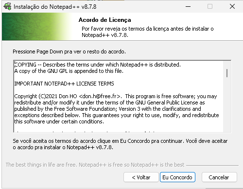
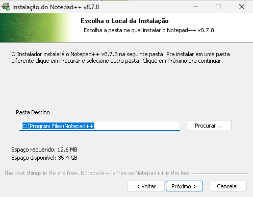
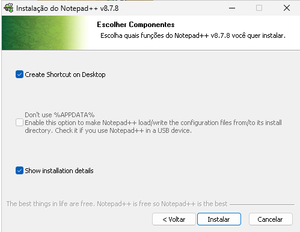
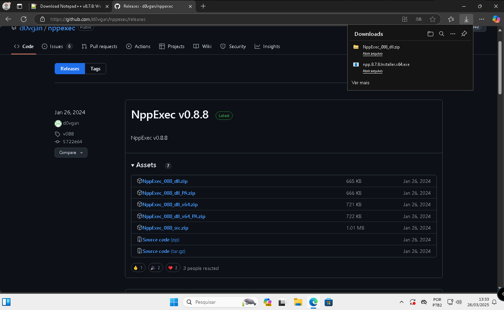
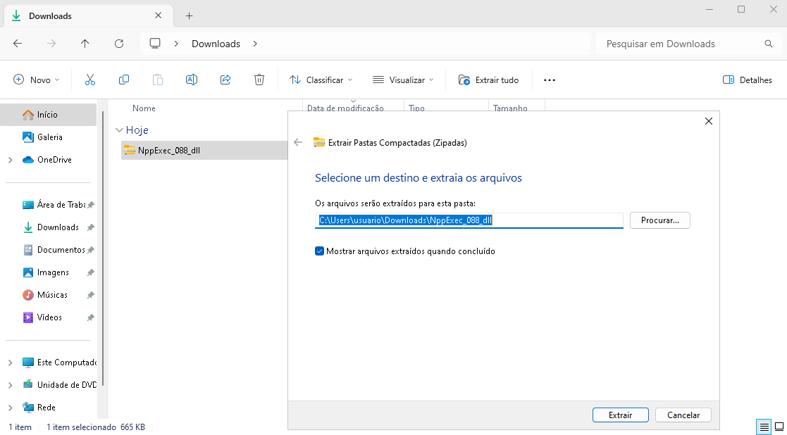
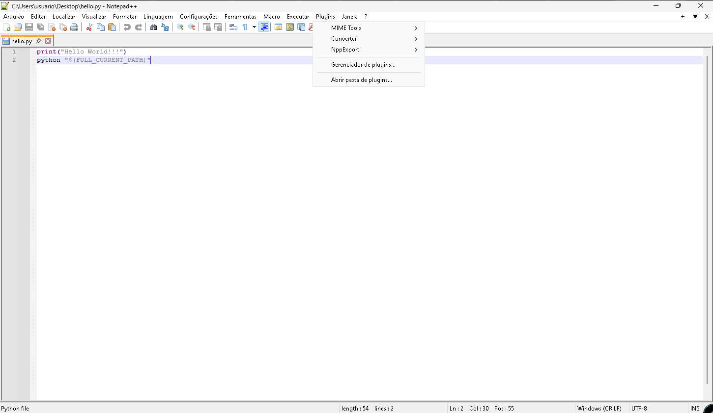
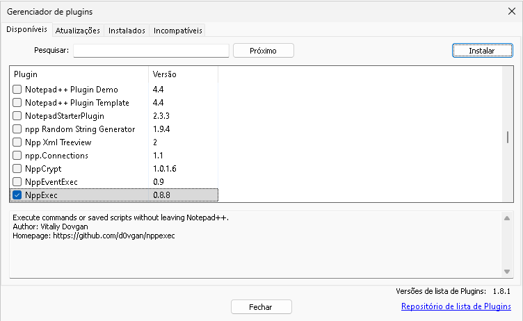
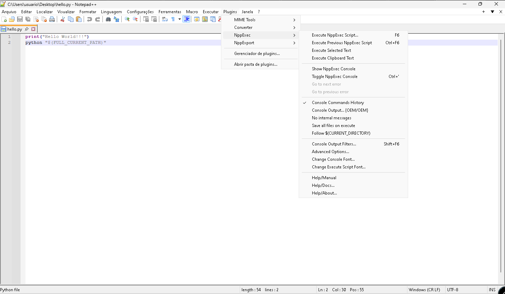
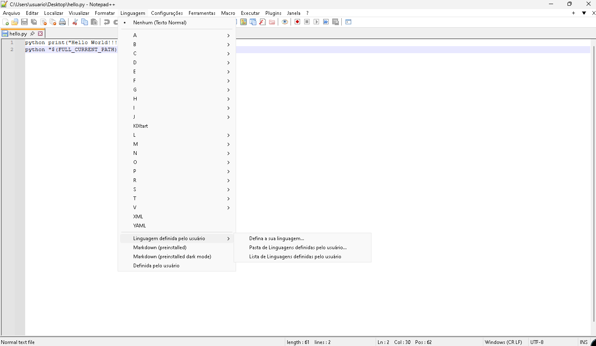
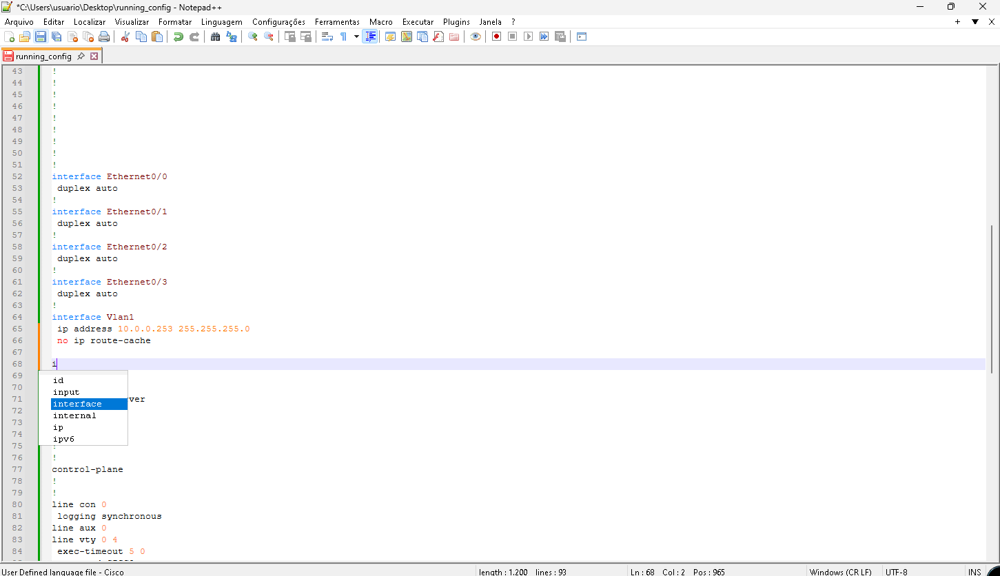

# IDEs (Integrated Development Environment)

As IDEs ou Ambiente de Desenvolvimento Integrado são a evolução natural dos editores de texto. São softwares gráficos que além de ter o próprio compilador trazem algumas outras funcionalidades integradas como:  

✔ Edição de código-fonte  
✔ Destaque da sintaxe  
✔ Preenchimento automático  
✔ Verificação de bugs  
✔ Compilação  
✔ Teste  
✔ Empacotamento  

## NOTEPAD++

Essa é uma IDE que ficou bastante popular em ambiente Windows. Essa não é uma ide completa e robusta pois não tem um depurador ou um gerenciador avançado de projetos. Mas mesmo assim vale a pena darmos uma atenção especial pois existem alguns recursos uteis para o nosso dia a dia.  

Então para instalarmos a ide devemos ir até o site https://notepad-plus-plus.org/ , escolher a versão desejada e depois instalar a mesma. A instalação é bem simples, clicar em executar e ir avançando.  

|  |  |
|----------------------------------------|----------------------------------------|
|  |  |
|----------------------------------------|----------------------------------------|
|  |  |
|----------------------------------------|----------------------------------------|
|  |  |  

Pronto, agora instalamos o software, mas por si só o NOTEPAD++ não consegue compilar códigos em python. Para isso, pode instalar o pluguin **nppexec** . O repositório oficial do plugin com a instrução de instalação fica em https://github.com/d0vgan/nppexec . Então vamos baixar o plugin em https://github.com/d0vgan/nppexec/releases e descompactar o mesmo.  

|  |  | 
|----------------------------------------|----------------------------------------|

O NOTEPAD++ fica instalado em **C:\Program Files\Notepad++** . Dentro dessa pasta existe a pasta **plugins** onde ficam todos os plugins. Então vamos copiar o conteúdo da pasta que extraímos para dentro dessa pasta de plugins. Depois disso vamos executar o notepad++ e clicar no menu plugins, gerenciar plugins.  

  

É aqui que o Notepad++ vai gerenciar os plugins disponíveis. Então vamos selecionar o plugin nppexec e depois clicar em instalar.  

|  |  |
|----------------------------------------|----------------------------------------|    

Após isso, o notpad++ irá reiniciar e podemos notar que ao clicar no menu plugins agora temos a opção **NppExec**, com todas as suas funções.  

  

Então repare que agora pode executar o atalho **F6** do teclado para executarmos os nosso scripts.  

  

Podemos reparar que ao pressionar o botão **F6**, é aberto uma janela e na parte inferior aparece uma nova janela, que é chamada de terminal. Então devemos copiar o nosso script em python e colocar na janela aberta, clicar em executar e vamos notar que o resultado sairá no terminal. Não é a forma mais prática de utilizarmos python, mas é uma maneira. Mas vamos em frente que agora que já vimos que podemos executar python de dentro do Notpad++, vamos instalar outros recursos interessantes nele que vão ajudar na produtividade do dia a dia.  

Agora vamos adicionar uma funcionalidade bacana que é a de deixar a IDE interpretar as linguagens de equipamentos, no caso Cisco. Aqui ele ai colorir comando e reconhecer comandos do Cisco IOs. Essa dica foi tirada do fórum da cisco ( https://community.cisco.com/t5/technical-documentation-ideas/how-to-highlighting-cisco-sintax-with-notepad/td-p/2611914 ).  
Então o que iremos fazer é instalar o arquivo de linguagens correspondente ao Cisco Ios. Esse arquivo deve estar no formato **.xml**. Pode se baixar o arquivo no fórum ou nesse link que disponibilizei aqui [userdefinelang.xml](Arquivos/userdefinelang.xml)  
As linguagens definidas pelo usuário ficam em : **C:\Users\usuario\AppData\Roaming\Notepad++\userDefineLangs** , onde devemos substituir a palavra **usuário** pelo nome do seu usuário corrente. Vamos clicar em linguagens e vamos reparar que só existem a linguagens padrão que já vem com o instalador. Feito isso, vamos copiar o arquivo **userdefinelang.xml** para dentro dessa pasta e em seguida devemos reiniciar o Notepad++

|  |  |
|----------------------------------------|----------------------------------------|

Bom, como podemos perceber agora apareceram mais opções de linguagens. Vamos abrir um arquivo de configuração de um equipamento cisco para podermos comparar depois que aplicarmos a linguagem.  

  

Como podemos notar, esse é um arquivo que abre como se fosse em um editor de texto comum. Agora vamos ativar a linguagem **cisco**. Vamos clicar no menu **linguagem** e depois **cisco**.  

  

Vamos reparar como ficou o mesmo arquivo agora com a linguagem cisco ativada.  

|  |  |
|----------------------------------------|----------------------------------------|
| Sem Linguagem cisco                    | Com linguagem cisco                    |

