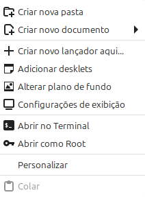
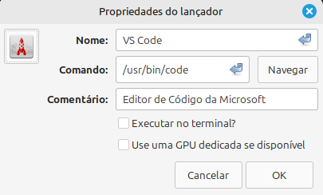

# Visual Studio Code (Vs Code)

O Visual Studio Code (VS Code) é um editor de código-fonte multiplataforma desenvolvido pela Microsoft, gratuito e de código aberto. Ele é uma das ferramentas mais utilizadas por programadores e desenvolvedores.  
Ele é muito popular por algumas características tais como: 

✔ Suporta diversas linguagens de programação, como JavaScript, Python, PHP, HTML e CS  
✔ Tem suporte interno para JavaScript, TypeScript e Node.js   
✔ Possui um ecossistema de extensões para outras linguagens e runtimes   
✔ Permite a depuração de código diretamente do editor   
✔ Tem controle de versionamento Git incorporado   
✔ Tem realce de sintaxe, complementação inteligente de código, snippets e refatoração de código  
✔ É personalizável, permitindo que os usuários mudem o tema do editor, teclas de atalho e preferência  

Pelo que podemos notar essa é uma IDE bem robusta. Então vamos começar com a sua instalação. Aqui estarei utilizando Windows e o Linux mint que é baseado em Debian. Para outrs distribuições de linux pode ser que algum comando mude um pouco. Então, a primeira coisa que precisamos fazer é baixar o aplicativo em: https://code.visualstudio.com/  

## Windows

A instalação aqui é bem simples, comumente apelidada de "next, next, finish." Então vamos baixar a aplicação no site e executar o arquivo.  

|  |
|-----------------------------------|   
| Site do fabricante                |

|  |  |
|-----------------------------------|-----------------------------------|
|  |  |  
|-----------------------------------|-----------------------------------|
|  |  | 

Agora vamos iniciar a aplicação. Quando iniciamos, ele irá pedir algumas configurações. Vamos somente escolher o tema escuro.  

|  |  |  
|-----------------------------------|-----------------------------------|
|  |  |  

Clique em mark done. Ele irá retornar uma tela, mas com a opção do tem escolhida. Clique em mark done até terminar as configurações.

|  |  |  
|-----------------------------------|-----------------------------------| 

Essa foi nossa primeira configuração. O modo escuro. Agora vamos colocar a linguagem Português do Brasil. Então vamos clicar em **extensões** ou o atalho **Ctrl + Shift + x**.  

|  |  |  
|-----------------------------------|-----------------------------------|

Podemos notar que abriu uma caixa de pesquisa. Vamos digitar: **Portuguese**. Vamos escolher a primeira, conforme mostro na imagem a seguir. **Obs:** clique em instalar e depois reinicie o vscode para aplicar as configurações.  

|  |  |  
|-----------------------------------|-----------------------------------|  

**Obs2:** Aqui é interessante ressaltar que quando selecionamos uma extensão, podemos notar que ao lado se abre uma página que explica qual é o objetivo da extensão e como se utiliza e instala a mesma. Esse é um dos motivos dessa IDE ser tão popular. Existem muitas extensões que auxiliam no fluxo do desenvolvimento dos códigos aumentando a produtividade.  

Agora vamos ver como instalar um corretor de textos. Vamos no menu extensões e vamos procurar por: **Code Spelll Checker** . Essa é uma extensão que depende de outras. A principal se chama Code Spell, que é o corretor ortográfico. Porém essa extensão precisa que instalemos os dicionários com as línguas que queremos corrigir. Então vamos instalar o Code Spell Checker, Brazilian Code Spell Checker e Portuguese Code Spell Checker.  Se aparecer uma mensagem, clicar em **Confiar e Instalar**.  

|  |  |  
|-----------------------------------|-----------------------------------|   

Agora precisamos configurar essa extensão. Aqui vou entrar em um caminho um pouco mais difícil. Pela própria documentação era para termos uma aba com as configurações onde iriamos clicando. Vamos pela configuração manual sugerida pela própria documentação. Então devemos ir no menu **Arquivos > Preferências > Configurações**  

|  |  |  
|-----------------------------------|-----------------------------------|  

Na tela que abrir devemos ir em extensões > Code Spell Checker. É aqui que iremos realizar todas as configurações necessárias. A primeira opção que vamos marcar é **enabled**. Isso irá ativar o Corretor Ortográfico. **OBS:** as configurações apresentadas nessa tela são aplicadas no arquivo **settings.json**.  Logo em seguida vamos achar a seção: **Cspell.Language:**. E nessa seção que iremos indicar os dicionários pt e pt/br. Percebam que só tem selecionado en. Então devemos digitar: **en,pt,pt_BR** .  

|  |  |  
|-----------------------------------|-----------------------------------|  

Como dito, essa é uma extensão bem interessante que reconhece vários tipos de arquivos por extensão. Então vamos até a seção **Enabled File Eypes** e devemos clicar em adicionar. Então precisamos digitar as extensões que queremos e vamos marcar como true. Aqui vou selecionar as seguintes: **bat, dockerfile, git-commit, git-rebase, json, markdown, plaintext, python, xml e yaml**. **OBS:** se depois se desejar incluir algum outro tipo a mais, a lista completa pode ser obtida em: https://code.visualstudio.com/docs/languages/identifiers .  

|  |  |  
|-----------------------------------|-----------------------------------|  

Infelizmente, nessa parte não existe nenhum botão de salvar. Então devemos fechar o vscode e reiniciar o mesmo. Ele irá abir do ponto onde paramos. Aproveitando que reiniciamos e acabamos de configurar o Code Spell Checker, mas configurar o auto salvamento. Então vamos clicar no menu **arquivo > auto salvamento** . Isso vai habilitar a função de salvar automaticamente. Então suponha que estejamos digitando algo editor e a energia acabe e desligue tudo. Em tese, vamos ter parte ou quase tudo salvo.  

  

Vamos voltar a seção de extensões e vamos procurar por Python (Microsoft). Vamos instalar o Python e o Debugger do Python. Faremos isso para o vscode reconhecer a linguagem Python.  

  

Agora nosso vscode está quase pronto para podermos utilizar. Até aqui o vscode já consegue corrigir a linguagem em inglês e português e também reconhece arquivos Python. Vamos olhar mais algumas extensões interessantes. Então vamos novamente na seção extensões e vamos digitar cisco. Irão aparecer várias extensões. Vamos instalara a **Cisco Ios Syntax** (que é oficial da cisco) e também vamos instalar a **Cisco Config Highlight**.   

  

Essas duas extensões não precisam de configuração. Porém para funcionarem devemos salvar os arquivos com extensões específicas para o nosso vscode já reconhecer os nosso arquivos. Então para a primeira extensão devemos salvar o nosso arquivo como **nome_do_arquivo.ios**. Já para a segunda extensão, devemos salvar o arquivo como **nom_do_arquivo.cisco** . Agora estamos prontos para poder utilizar nosso vscode.  

## Linux

Agora vou demonstrar como instalar o Vscode no linux. Estarei utilizando o linux Mint para isso, mas a instalação é semelhante para outras distribuições. A primeira coisa que vamos fazer é atualizar o linux. Então vamos abrir o terminal e digitar:  

    sudo apt update && sudo apt upgrade  

Após isso, temos que adicionar as chaves GPG de verificação para os repositórios da Microsoft:  

    cd /tmp && curl https://packages.microsoft.com/keys/microsoft.asc | gpg --dearmor > packages.microsoft.gpg && sudo install -o root -g root -m 644 packages.microsoft.gpg /etc/apt/keyrings/packages.microsoft.gpg && cd $HOME  

Então vamos adicionar os repositórios da Microsoft  

    echo "deb [arch=amd64 signed-by=/etc/apt/keyrings/packages.microsoft.gpg] https://packages.microsoft.com/repos/code stable main" | sudo tee /etc/apt/sources.list.d/vscode.list  

Feito isso temos que atualizar os repositórios  

    sudo apt update  

Por último vamos instalar o aplicativo em si  

    sudo apt install code  

Agora vamos criar um ícone do aplicativo no desktop. Veja o passo a passo:  

|  |  | 
|---------------------------------|---------------------------------|
| 01                              | 02                              |
|  |  |
| 03                              | 04                              |
|  |  |
| 05                              | 06                              |
|  |                                 |
| 07                              |                                 |