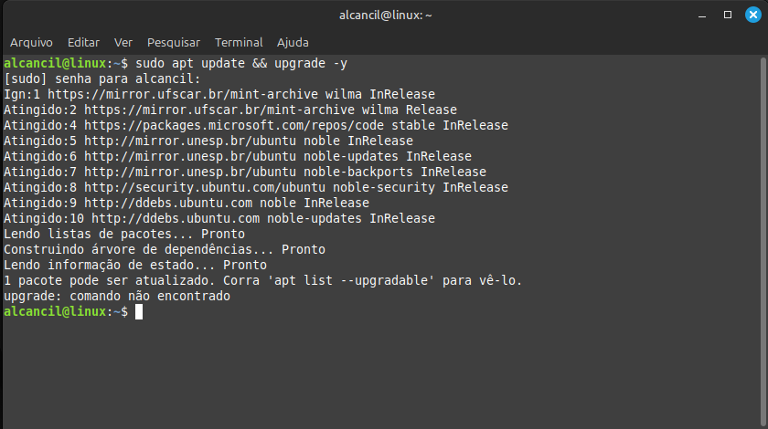

# Python Ambientes Virtuais.

Antes de começarmos a escrever nossos códigos, precisamos entender o que são os ambientes virtuais e porque devemos utilizá-los.  
Bom se lembrarmos que na parte que passamos pelo gerenciador de pacotes PIP, quando vamos utilizá-lo recebemos uma mensagem de erro que por padrão nos impede de utilizar o PIP. Mas o que realmente é essa mensagem ? Na verdade isso não é um erro e sim um aviso de boas práticas, e sendo "boas práticas", podemos modificar ese comportamento e passar a utilizar o PIP direto no sistema.  
No caso vimos que o Linux nos trouxe a mensagem, mas o Windows não. Mas a mensagem serve para qualquer um dos sistemas operacionais. O que acontece é que muitas vezes quando vamos desenvolver nossos código precisamos utilizar alguma biblioteca ou mesmo algum pacote. No caso de distribuições Linux Debian, o sistema utiliza o gerenciador de pacotes **apt**. Já no windows, recentemente foi introduzido o **winget**.  
Então se repararmos, temos dois gerenciadores de pacote: um oficial para o sistema e outro para o Python. Acontece que os gerenciadores de pacote utilizam as suas fontes oficiais onde armazenam seu pacotes e pode ser que existam pacotes do sistema que possa gerar conflitos com pacotes do Python. Obviamente não queremos esse tipo de comportamento.  
Outro problema comum é que podemos escrever um código em uma máquina e depois queremos enviar para outra pessoa que irá utilizar em outra máquina para analisar, terminar ou mesmo completar esse mesmo código. Então é interessante que essa pessoa tenha também os mesmos pacotes necessários instalados no seu ambiente para que o código posso rodar sem problemas. Isso é chamado de requisitos do código.  
Então, os ambientes virtuais nada mais são do que a virtualização de um ambiente em que podemos explicitar os requisitos e depois enviar para outras pessoas com isso protegendo o sistema operacional e que não falte nada para se executar o código.  
Vou deixar aqui a documentação oficial sobre ambientes virtuais em Python: !(https://docs.python.org/3/library/venv.html)

|  |  | 
|---------------------------------|---------------------------------|
| 01                              | 02                              |
|  |  |
| 03                              | 04                              |
|  |  |
| 05                              | 06                              |
|  |                                 |
| 07                              |                                 |

Feito isso, o restante das otimizações e instalações de extensões é igual as realizadas em windows.  