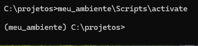
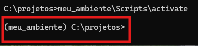
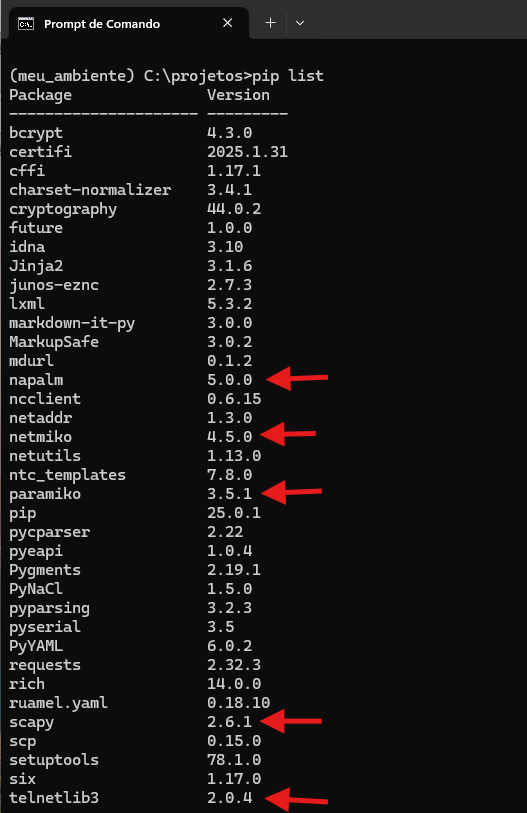

# Python - Ambientes Virtuais

Antes de começarmos a escrever nossos códigos, precisamos entender o que são os ambientes virtuais e porque devemos utilizá-los.  
Bom se lembrarmos que na parte que passamos pelo gerenciador de pacotes PIP, quando vamos utilizá-lo recebemos uma mensagem de erro que por padrão nos impede de utilizar o PIP. Mas o que realmente é essa mensagem ? Na verdade isso não é um erro e sim um aviso de boas práticas, e sendo "boas práticas", podemos modificar ese comportamento e passar a utilizar o PIP direto no sistema.   
No caso vimos que o Linux nos trouxe a mensagem, mas o Windows não. Mas a mensagem serve para qualquer um dos sistemas operacionais. O que acontece é que muitas vezes quando vamos desenvolver nossos código precisamos utilizar alguma biblioteca ou mesmo algum pacote. No caso de distribuições Linux Debian, o sistema utiliza o gerenciador de pacotes **apt**. Já no windows, recentemente foi introduzido o **winget**.     
Então se repararmos, temos dois gerenciadores de pacote: um oficial para o sistema e outro para o Python. Acontece que os gerenciadores de pacote utilizam as suas fontes oficiais onde armazenam seu pacotes e pode ser que existam pacotes do sistema que possa gerar conflitos com pacotes do Python. Obviamente não queremos esse tipo de comportamento.  
Outro problema comum é que podemos escrever um código em uma máquina e depois queremos enviar para outra pessoa que irá utilizar em outra máquina para analisar, terminar ou mesmo completar esse mesmo código. Então é interessante que essa pessoa tenha também os mesmos pacotes necessários instalados no seu ambiente para que o código posso rodar sem problemas. Isso é chamado de requisitos do código.    
Então, os ambientes virtuais nada mais são do que a virtualização de um ambiente em que podemos explicitar os requisitos e depois enviar para outras pessoas com isso protegendo o sistema operacional e que não falte nada para se executar o código.  
  
Resumindo:  

Por Que Usar Ambientes Virtuais?  
    ✔**Isolar Dependências :** Evita que bibliotecas de um projeto (ex: telnetlib v1.0) conflitem com as de outro (ex: telnetlib v2.0).
    ✔**Reproducibilidade   :** Garante que seu código funcione em qualquer máquina (com as mesmas versões de bibliotecas).  
    ✔**Sem Poluir o Python Global :** Instalações ficam restritas ao ambiente do projeto, sem afetar o sistema.  

## Windows

Agora vamos ver como criar, ativar, desativar e remover ambientes virtuais no Windows. Obs: no windows podemos utilizar o cmd ou o Powershell. Eu recomendo se utilizar o cmd.  
1. Vamos abrir o terminal do Windows. 
2. Agora vamos listar os pacotes instalados pelo Pip no sistema operacional com o comando: **pip list**

  

Como podemos observar, temos várias bibliotecas e dependências instaladas no windows.  

3. Vamos criar a pasta **projetos** e vamos entrar nela
4. Dentro da pasta vamos criar nosso ambiente virtual com o comando: **python -m venv meu_ambiente Obs:** é a biblioteca **venv** quem cria os ambientes virtuais.  

|  |  |
|---------------------------------|---------------------------------|  

Como podemos observar, após inserirmos o comando uma pasta é criada com o nome do ambiente fornecido, nesse caso **meu_ambiente**. Dentro dessa pasta ficam todas as bibliotecas e dependências do projeto que vamos criar.  
Dentro da pasta com o nome do nosso projeto, existe uma pasta com os Scripts necessários para ativarmos e desativarmos nosso ambiente.  

  

5. Agora vamos ativar nosso ambiente virtual. Para isso vamos digitar : **meu_ambiente\Scripts\activate**

|  |  |
|---------------------------------|---------------------------------|  

Como podemos notar, agora nosso prompt mudou. Então sempre fica nesse padrão: **(nome_do_ambiente) C:\Pasta\_**  

Antes de desativarmos nosso ambiente, vamos comparar agora para ver quais as bibliotecas que ele tem instalada.  

  

Como podemos reparar não temos nenhuma biblioteca instalada. Então vamos instalar as bibliotecas: **telnetlib3, nornir, scapy, netmico, paramiko, napalm** 

|  |  |
|---------------------------------|---------------------------------|

6. Agora que verificamos que temos bibliotecas instaladas no nosso ambiente virtual diferentes do sistema operacional, vamos desativar nosso ambiente com o comando: **meu_ambiente\Scripts\deactivate**

|  |  |
|---------------------------------|---------------------------------|  

Agora se repararmos, nosso prompt mudou e não tem mais o **(nome_do_ambiente)** antes do prompt o que indica que agora saímos do nosso ambiente virtual.  

7. Agora vamos exportar os requisitos desse nosso ambiente virtual. Nós iremos fazer isso para que possamos enviar para outro computador e a pessoa que for utilizar esse projeto possa instalar o ambiente virtual com os mesmos requisitos (bibliotecas, pacotes, interpretador, etc) que foram utilizados.  
Aqui tenho que citar que temos dois comando bem parecidos que são: **pip list** e **pip freeze**. A princípio, esses dois comando mostram os pacotes instalados através do pip. Mas existe uma diferença, o comando pip freeze além de mostrar as bibliotecas, ele também exporta os requisitos. Ex: **pip freeze > requerimentos.txt**  

|  |  |
|---------------------------------|---------------------------------| 

Então, foi gerado um arquivo chamado de **requirements.txt**. Quando for instalar um novo ambiente virtual, esse arquivo deve ser utilizado.  

8. Agora vamos instalar um novo ambiente virtual utilizando esse arquivo de requerimentos. **OBS:** pelas boas práticas, não é recomendado se ter vários ambientes virtuais num mesmo projeto. Isso pode gerar alguns problemas. Vou fazer isso agora para fins de demonstração.  
Primeiro vamos criar o segundo ambiente virtual chamado de **meu_ambiente2**. Feito isso devemos entrar na pasta criada e vamos copiar o arquivo de requerimentos.  
Após isso, devemos instalar os requerimentos através do pip: **pip install -r requirements.txt**  

|  |  |
|---------------------------------|---------------------------------| 

## LINUX

Os procedimentos que vou demonstrar aqui são bem parecidos com os do Windows. Então alguns comandos podem ser diferentes mas no geral o procedimento se mantém o mesmo.  
A primeira coisa que precisamos fazer é abrir o terminal do linux e realizar uma atualização de repositórios. **OBS:** aqui estarei utilizando o Linux Mint na versão 22 e portanto em outras distribuições que não seguem a linha do Debian podem ter comandos um pouco diferentes.  

    Digitar os seguintes comandos no prompt:  
    **sudo apt update && upgrade -y**  

  

Feito isso precisamos instalar o **venv** : **sudo apt install python3-venv**  

  

Vou deixar aqui a documentação oficial sobre ambientes virtuais em Python: https://docs.python.org/3/library/venv.html