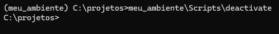
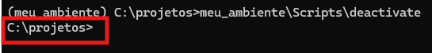
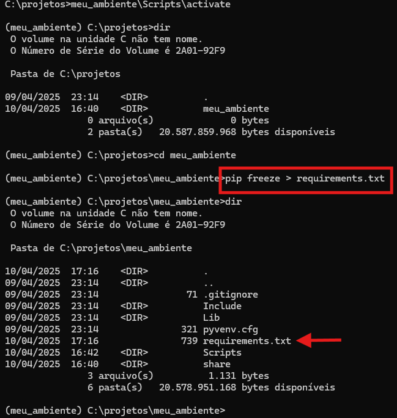
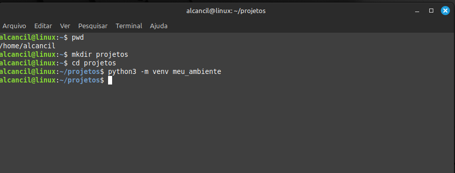
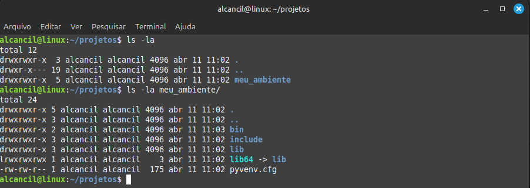
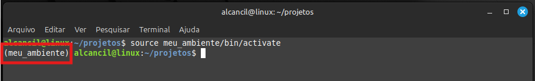

# Python - Ambientes Virtuais

Antes de começarmos a escrever nossos códigos, precisamos entender o que são os ambientes virtuais e porque devemos utilizá-los.  

Vale lembrar que temos dois gerenciadores de pacotes quando instalamos o sistema e o python juntos. Um gerencia pacotes do sistema **(winget para sistemas windows e o apt ou semelhantes para sistemas linux)**. Acontece que o Python possui o **PIP**, como visto anteriormente.  
Então o Pip serve para instalar bibliotecas e suas dependências para os projetos em Python enquanto que os outros gerenciadores como o winget e o apt vão gerenciar os pacotes do sistema operacional.  
São duas coisas completamente diferentes, mas como visto, o PIP pode ser utilizado para se instalar pacotes **globalmente** e isso pode ocasionar que, pacotes que sejam instalados por ele entrem em conflito com algum pacote que seja instalado para o sistema. Isso faz que o sistema como um todo fique poluído e possa começar a ter problemas.  
Outra situação que podemos ter é quando vamos ter mais de um projeto em Python e queremos isolar esse projeto. Com isso, se precisarmos gerar um arquivo executável, o Python irá colocar somente o necessário dentro desse arquivo tornando ele mais leve.  

Mas e o que são ambientes virtuais ?  
Ambiente virtual é uma forma de se isolar um ambiente de outro. Então quando executamos os comandos de criação do ambiente, ele cria uma pasta contendo tudo o que necessário para esse ambiente funcionar. Ou seja, isso seria uma espécie de virtualização do ambiente Python pois vai conter uma cópia do interpretador e o restante dos arquivos necessários para funcionar.  
Outra vantagem que temos é que através dos ambientes virtuais podemos gerar uma lista de requisitos e enviar para outra máquina. Com isso, quando instalamos esse novo ambiente vamos conseguir obter os mesmos resultados.
  
## Windows

Agora vamos ver como criar, ativar, desativar e remover ambientes virtuais no Windows. Obs: no windows podemos utilizar o cmd ou o Powershell. Eu recomendo se utilizar o cmd.  
1. Vamos abrir o terminal do Windows. 
2. Agora vamos listar os pacotes instalados pelo Pip no sistema operacional com o comando: **pip list**

  

Como podemos observar, temos várias bibliotecas e dependências instaladas no windows.  

3. Vamos criar a pasta **projetos** e vamos entrar nela
4. Dentro da pasta vamos criar nosso ambiente virtual com o comando: **python -m venv meu_ambiente Obs:** é a biblioteca **venv** quem cria os ambientes virtuais.  

|  |  |
|---------------------------------|---------------------------------|  

Como podemos observar, após inserirmos o comando uma pasta é criada com o nome do ambiente fornecido, nesse caso **meu_ambiente**. Dentro dessa pasta ficam todas as bibliotecas e dependências do projeto que vamos criar.  
Dentro da pasta com o nome do nosso projeto, existe uma pasta com os Scripts necessários para ativarmos e desativarmos nosso ambiente.  

  

5. Agora vamos ativar nosso ambiente virtual. Para isso vamos digitar : **meu_ambiente\Scripts\activate**

|  |  |
|---------------------------------|---------------------------------|  

Como podemos notar, agora nosso prompt mudou. Então sempre fica nesse padrão: **(nome_do_ambiente) C:\Pasta\_**  

Antes de desativarmos nosso ambiente, vamos comparar agora para ver quais as bibliotecas que ele tem instalada.  

  

Como podemos reparar não temos nenhuma biblioteca instalada. Então vamos instalar as bibliotecas: **telnetlib3, nornir, scapy, netmico, paramiko, napalm** 

|  |  |
|---------------------------------|---------------------------------|

6. Agora que verificamos que temos bibliotecas instaladas no nosso ambiente virtual diferentes do sistema operacional, vamos desativar nosso ambiente com o comando: **meu_ambiente\Scripts\deactivate**

|  |  |
|---------------------------------|---------------------------------|  

Agora se repararmos, nosso prompt mudou e não tem mais o **(nome_do_ambiente)** antes do prompt o que indica que agora saímos do nosso ambiente virtual.  

7. Agora vamos exportar os requisitos desse nosso ambiente virtual. Nós iremos fazer isso para que possamos enviar para outro computador e a pessoa que for utilizar esse projeto possa instalar o ambiente virtual com os mesmos requisitos (bibliotecas, pacotes, interpretador, etc) que foram utilizados.  
Aqui tenho que citar que temos dois comando bem parecidos que são: **pip list** e **pip freeze**. A princípio, esses dois comando mostram os pacotes instalados através do pip. Mas existe uma diferença, o comando pip freeze além de mostrar as bibliotecas, ele também exporta os requisitos. Ex: **pip freeze > requerimentos.txt**  

|  |  |
|---------------------------------|---------------------------------| 

Então, foi gerado um arquivo chamado de **requirements.txt**. Quando for instalar um novo ambiente virtual, esse arquivo deve ser utilizado.  

8. Agora vamos instalar um novo ambiente virtual utilizando esse arquivo de requerimentos. **OBS:** pelas boas práticas, não é recomendado se ter vários ambientes virtuais num mesmo projeto. Isso pode gerar alguns problemas. Vou fazer isso agora para fins de demonstração.  
Primeiro vamos criar o segundo ambiente virtual chamado de **meu_ambiente2**. Feito isso devemos entrar na pasta criada e vamos copiar o arquivo de requerimentos.  
Após isso, devemos instalar os requerimentos através do pip: **pip install -r requirements.txt**  

|  |  |
|---------------------------------|---------------------------------| 

## LINUX

Os procedimentos que vou demonstrar aqui são bem parecidos com os do Windows. Então alguns comandos podem ser diferentes mas no geral o procedimento se mantém o mesmo.  
A primeira coisa que precisamos fazer é abrir o terminal do linux e realizar uma atualização de repositórios. **OBS:** aqui estarei utilizando o Linux Mint na versão 22 e portanto em outras distribuições que não seguem a linha do Debian podem ter comandos um pouco diferentes.  

    Digitar os seguintes comandos no prompt:  
    **sudo apt update && upgrade -y**  

  

Feito isso precisamos instalar o **venv** : **sudo apt install python3-venv**  

  

Após a instalação do venv, vamos criar uma pasta chamada **projetos** e dentro dela vamos criar nosso primeiro ambiente virtual com o comando: **sudo python3 -m venv meu_ambiente**  

  

E como mostrado em ambientes Windows, é criado uma pasta com o nome **meu_ambiente** contendo tudo o que é necessário para o nosso ambiente virtual funcionar.  

  

E agora vamos ativar o nosso ambiente. Para isso vamos executar o script para o bash **shell** que é o que estamos utilizando. Vamos executar o comando: **source meu_ambiente/bin/activate** .

|  |  |
|------------------------------|--------------------------------|  

Como podemos notar, o nosso prompt muda. Além disso também podemos verificar qual o comando do interpretador python que estamos utilizando agora. Percebam que ele deve retornar o caminho dentro da pasta de nosso ambiente virtual.  

Agora podemos desativar nosso ambiente com o comando **deactivate**  

  

Também pode exportar os requerimentos de nosso ambiente como fizemos anteriormente com o comando: **pip freeze > requerimentos**  

  

## VSCODE

Vamos entrar na pasta meu_ambiente e criar um arquivo em branco chamado **hello.py**  

Feito isso, vamos abrir o vscode e abrir a pasta meu_ambiente. Aqui eu preciso fazer uma ressalva. Tanto podemos abrir um arquivo quanto podemos abrir uma pasta.  
Quando abrimos uma pasta, o vscode consegue identificar nossos ambientes de trabalho. Nesse momento, por segurança ele vai identificar nosso ambiente e perguntar se confiamos nele ou não. Se marcarmos como não, o vscode restringe a edição e execução dos arquivos. Então vamos marcar nosso ambiente como confiável.  

|  |  |
|-------------------------------|-------------------------------|  

Como podemos notar, o vscode tem um painel á esquerda chamado explorador. Nesse painel ele irá nos mostrar todos os arquivos que existem dentro da pasta **meu_ambiente**, ou seja vao nos mostrar tudo o que existe no nosso ambiente. Então vamos clicar no arquivo que criamos **hello.py** e vamos ver que ele será aberto na painel a direita onde podemos editar o mesmo.  

|  |  |
|-------------------------------|-------------------------------| 

Mas antes de começarmos a escrever o código, precisamos ativar nosso ambiente. E como faremos isso ?  
Temos que ir com o cursos do mouse na parte superior do Vscode no lado direito, ao lado dos botões de **maximizar e fechar**. Vamos encontrar o botão **ativar ou desativar o painel**. Também podemos utilizar as teclas de atalho **Ctrl + J**.  

|  |  |
|-------------------------------|-------------------------------|

Agora vamos notar que na parte inferior vai se abrir o terminal e ai o processo é de ativação e desativação do nosso ambiente é o mesmo que utilizamos até aqui. Mas como estamos no Vscode, existe uma maneira mais fácil de se ativar / desativar os nossos ambientes. Então vamos clicar no botão **extensões** que fica no painel a esquerda e procurar por **Python Environments** que é da Microsoft e vamos instalá-la. **OBS:** no momento em que ecrevo esse texto, essa extensão se encontra em pré lançamento e pode sofrer alterações.

Vou deixar aqui a documentação oficial sobre ambientes virtuais em Python: https://docs.python.org/3/library/venv.html