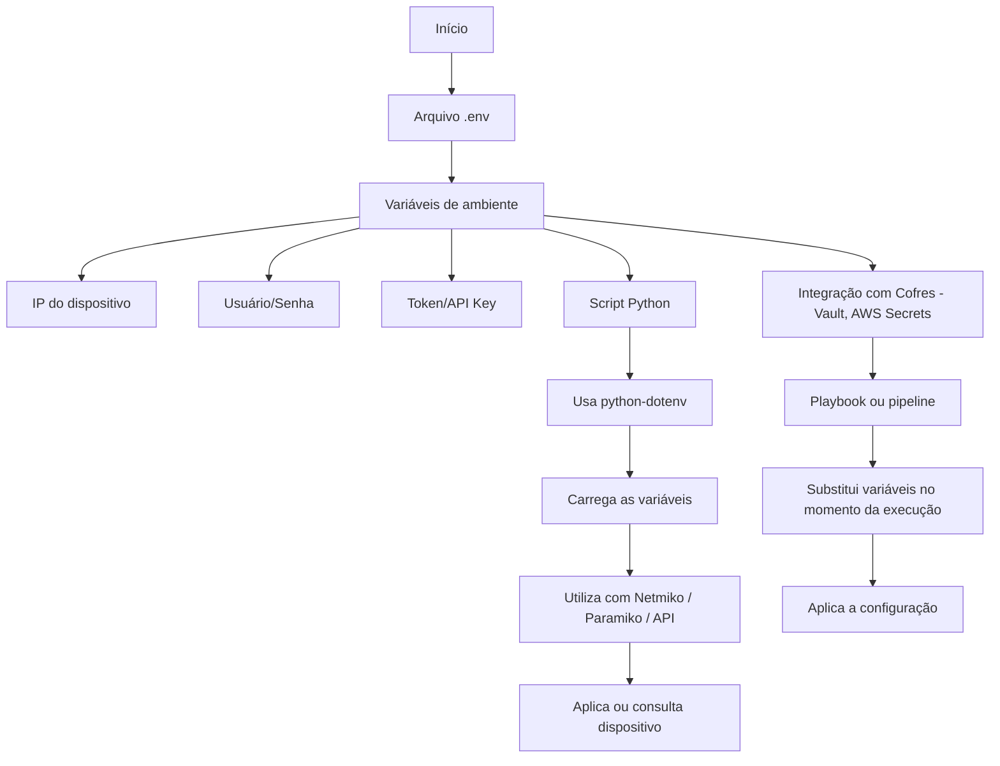

# Python - Básico 10

## Índice
- [Python - Básico 10](#python---básico-10)
  - [Índice](#índice)
- [05 Manipulação de arquivos – .env](#05-manipulação-de-arquivos--env)
  - [Vantagens de usar arquivos `.env`](#vantagens-de-usar-arquivos-env)
  - [Como usar](#como-usar)
    - [Casos de uso de arquivos .env na automação de redes:](#casos-de-uso-de-arquivos-env-na-automação-de-redes)
    - [Quando usar .env vs outras abordagens](#quando-usar-env-vs-outras-abordagens)
    - [Por que .env é essencial para o CCNP e para automação de redes?](#por-que-env-é-essencial-para-o-ccnp-e-para-automação-de-redes)
    - [Fluxo do uso de .env com Python puro e com Ansible](#fluxo-do-uso-de-env-com-python-puro-e-com-ansible)

# 05 Manipulação de arquivos – .env

Arquivos `.env` são amplamente utilizados para armazenar **variáveis de ambiente sensíveis**, como:

- Credenciais de acesso (usuário e senha)
- Endereço IP de dispositivos
- Tokens de APIs

O objetivo é **separar os dados sensíveis do código-fonte**, permitindo que os scripts sejam mais seguros, reutilizáveis e organizados.  

Site oficial: https://pypi.org/project/python-dotenv/  

---

## Vantagens de usar arquivos `.env`

| Benefício                  | Explicação prática                       |
|----------------------------|------------------------------------------|
| Segurança básica           | Evita deixar senhas no código-fonte      |
| Reutilização de scripts    | Basta trocar o `.env` para novo ambiente |
| Compatível com frameworks  | Suporte em Python, Ansible, Docker etc.  |
| Git-safe                   | Pode ser ignorado com `.gitignore`       |

---

## Como usar

1. **Crie um arquivo `.env` com suas variáveis**
2. Instale a biblioteca:

```bash
pip install python-dotenv
```

### Casos de uso de arquivos .env na automação de redes:

- Armazenamento seguro de credenciais: usuário, senha, token de API, chaves privadas.  
- Separação entre lógica e dados sensíveis: o script não precisa conter IPs ou senhas diretamente.  
- Criação de ambientes reutilizáveis: troca-se o .env e o mesmo script pode ser usado em sites diferentes.  
- Facilidade para testes e simulações: carregar configurações diferentes sem editar o código.  
- Integração com bibliotecas Python: como Netmiko, Paramiko, Napalm, requests, pyATS, etc.  
- Organização e padronização de projetos: cada projeto possui seu próprio .env, facilitando o versionamento.  

### Quando usar .env vs outras abordagens

| Use .env quando...                                  | Evite .env quando...                                 |  
|-----------------------------------------------------|------------------------------------------------------|
| Você precisa manter dados sensíveis fora do código	| Os dados são públicos ou não sensíveis               |
| O script será usado em ambientes diferentes	        | O projeto é totalmente fixo, para uso único          |
| Trabalha em equipe ou múltiplos ambientes           | Não há variações de configuração entre ambientes     |
| Vai usar Git/GitHub e quer manter segurança	        | O projeto será executado localmente, sem versionar   |
| Deseja facilitar integração com CI/CD, Ansible      | Precisa de criptografia real (use cofres nesse caso) |

### Por que .env é essencial para o CCNP e para automação de redes?

- Separação entre dados sensíveis e lógica: permite que senhas, IPs e tokens fiquem fora do código-fonte, facilitando manutenção e segurança.
- Reutilização de scripts em múltiplos ambientes: você usa o mesmo código em diferentes sites, mudando apenas o conteúdo do .env.
- Integração natural com Python e ferramentas de rede: bibliotecas como Netmiko, Paramiko, requests e Nornir podem consumir dados externos via .env.
- Escalabilidade com segurança básica: ideal para ambientes pequenos a médios, com controle de acesso por permissões (chmod) e exclusão de versionamento (.gitignore).
- Ponto de transição para práticas avançadas: usar .env é a base para depois adotar cofres de segredos como Ansible Vault, AWS Secrets Manager, ou HashiCorp Vault.
 
**OBS:** Antes de ver exemplos práticos com .env, é fundamental entender o fluxo de como variáveis de ambiente (armazenadas em .env) se integram aos scripts de automação.
O fluxograma a seguir mostra dois cenários comuns: uso com Python puro e uso com ferramentas como Ansible, que podem consumir variáveis externas ou cofres de forma segura.

### Fluxo do uso de .env com Python puro e com Ansible



**OBS:** estaremos utilizando somente scripts python puro por enquanto. Todas as saídas serão locais e não serão enviadas para nenhum equipamento por questões de boas práticas. Depois irei adicionar tópicos para acesso dos equipamentos.
