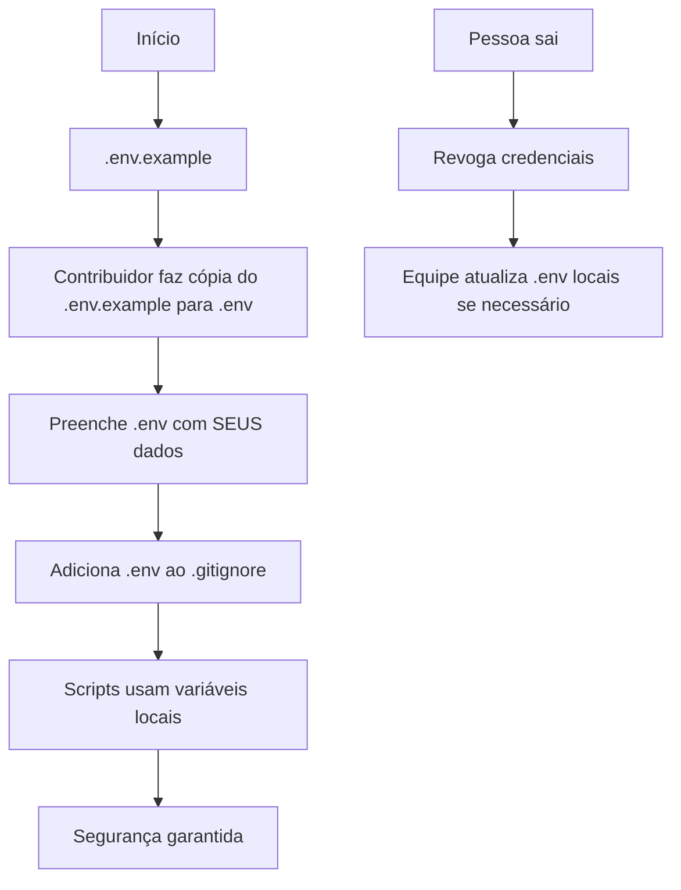
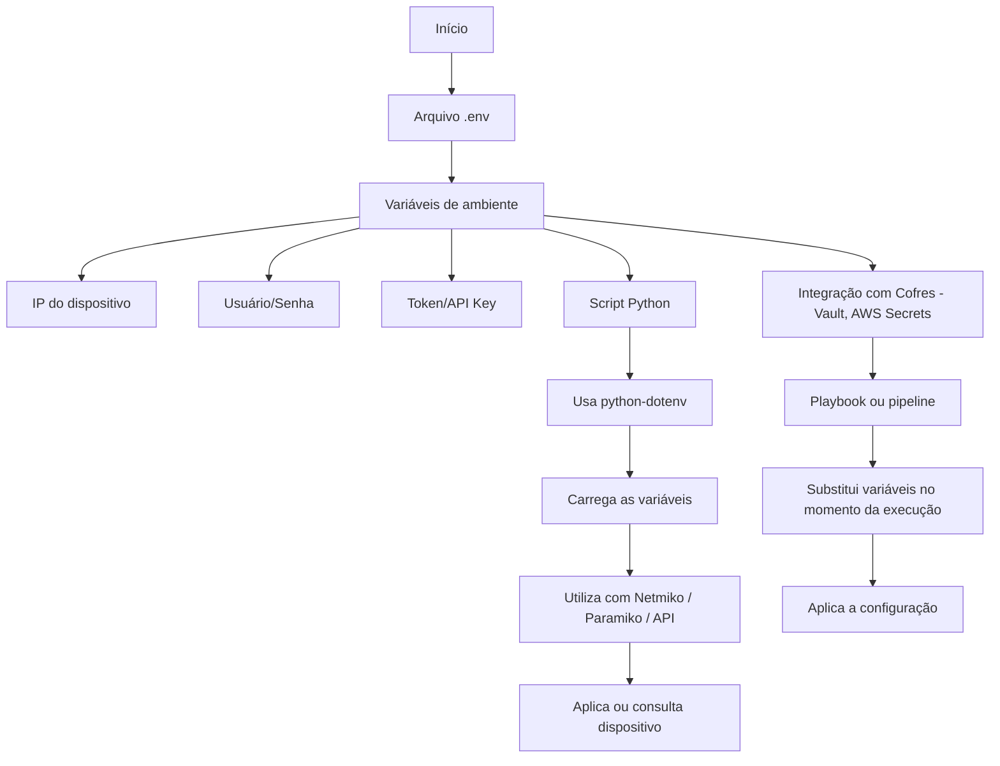

# Python - Básico 10

## Índice
- [Python - Básico 10](#python---básico-10)
  - [Índice](#índice)
- [05 Manipulação de arquivos – .env](#05-manipulação-de-arquivos--env)
  - [Vantagens de usar arquivos `.env`](#vantagens-de-usar-arquivos-env)
  - [Como usar - Fluxo Profissional](#como-usar---fluxo-profissional)
- [Adicione ao .gitignore](#adicione-ao-gitignore)
    - [Casos de uso de arquivos .env na automação de redes:](#casos-de-uso-de-arquivos-env-na-automação-de-redes)
    - [Quando usar .env vs outras abordagens](#quando-usar-env-vs-outras-abordagens)
    - [Por que .env é essencial para o CCNP e para automação de redes?](#por-que-env-é-essencial-para-o-ccnp-e-para-automação-de-redes)
    - [Fluxo do uso de .env com Python puro e com Ansible](#fluxo-do-uso-de-env-com-python-puro-e-com-ansible)
    - [Exemplo 01 – Leitura básica do .env com python-dotenv](#exemplo-01--leitura-básica-do-env-com-python-dotenv)
    - [Exemplo 02 – Integração com template Jinja2 usando variáveis do .env](#exemplo-02--integração-com-template-jinja2-usando-variáveis-do-env)
- [Exemplo 02 – Integração com Jinja2 usando variáveis do `.env`](#exemplo-02--integração-com-jinja2-usando-variáveis-do-env)
    - [Exemplo 03 – Verificação de variáveis obrigatórias no .env](#exemplo-03--verificação-de-variáveis-obrigatórias-no-env)
    - [Exemplo 04 – Simulação de login via .env (sem aplicar)](#exemplo-04--simulação-de-login-via-env-sem-aplicar)
    - [Exemplo 05 – Validação de variáveis faltantes no .env (com os.getenv(..., default))](#exemplo-05--validação-de-variáveis-faltantes-no-env-com-osgetenv-default)

# 05 Manipulação de arquivos – .env

Arquivos `.env` são amplamente utilizados para armazenar **variáveis de ambiente sensíveis**, como:

- Credenciais de acesso (usuário e senha)
- Endereço IP de dispositivos
- Tokens de APIs

O objetivo é **separar os dados sensíveis do código-fonte**, permitindo que os scripts sejam mais seguros, reutilizáveis e organizados.  

Site oficial: https://pypi.org/project/python-dotenv/  

---

## Vantagens de usar arquivos `.env`

| Benefício                  | Explicação prática                       |
|----------------------------|------------------------------------------|
| Segurança básica           | Evita deixar senhas no código-fonte      |
| Reutilização de scripts    | Basta trocar o `.env` para novo ambiente |
| Compatível com frameworks  | Suporte em Python, Ansible, Docker etc.  |
| Git-safe                   | Pode ser ignorado com `.gitignore`       |

---

## Como usar - Fluxo Profissional

1. Instale a biblioteca:

```bash
pip install python-dotenv
```
2. **Crie um arquivo `.env` com suas variáveis (NUNCA versionado) e um arquivo `.env.exemplo` de template**

> "O `.env.exemplo` é um **template seguro** que deve ser versionado. Ele serve como:  
> - Documentação das variáveis necessárias.  
> - Modelo para novos contribuidores criarem seu próprio `.env`.  
> - Referência para atualizações (ex.: adicionar novas variáveis)."  

3. **Preencha o .env com SUAS credenciais (não use as do exemplo!)**

```dotenv
# Credenciais do SEU ambiente (não compartilhe!)
DEVICE_IP=192.168.1.100
SSH_USERNAME=seu_usuario
SSH_PASSWORD=sua_senha_secreta
```

4. **Segurança com Git (Não falarei da ferramenta aqui, é só um exemplo para completar o fluxo de trabalho)**

# Adicione ao .gitignore  
> echo ".env" >> .gitignore  
  
Por quê?

- Evita que credenciais sejam "commitadas" acidentalmente.
- O .env.example é versionado, mas sem dados reais.

5. **Trabalho em Equipe (Melhores Práticas)**

> Cenário Normal:  
>  
>  - Cada integrante tem seu próprio .env com credenciais individuais.
>  - O .env.example é atualizado centralmente se novas variáveis forem adicionadas.  
>
> Se uma Pessoa Sai da Equipe:  
>  
>  - Remova o acesso físico/logico:  
>
>        A pessoa perde acesso ao repositório (revogar no GitHub/GitLab).  
>  
>  - Rotação de Credenciais:  
>  
>        Atualize as senhas/tokens que ela tinha acesso (ex.: SSH, API Keys).  
>  
>  - Não há impacto no código:  
>  
>        Como cada um tinha seu .env local, não é necessário alterar scripts.  

**Exemplo Prático:**

```bash
# Antes: pessoa usava no seu .env local
SSH_USERNAME=fulano
SSH_PASSWORD=senha_antiga

# Depois: administrador atualiza credenciais no servidor
# e avisa a equipe para atualizar seus .env locais
SSH_PASSWORD=nova_senha_complexa_123
```

6. **Fluxo de trabalho**


7. **Checklist de Segurança**

```markdown
## 🔐 Checklist de Segurança
- [ ] Nunca commit `.env` no Git.
- [ ] Use `chmod 600 .env` para restringir permissões (ou equivalente para o Windows).
- [ ] Rotacione credenciais a cada 90 dias.
- [ ] Revogue acessos imediatamente ao sair da equipe.
```

8. **Boas Práticas para Equipes**

| Ação	                            | Por quê?                                    |
|-----------------------------------|---------------------------------------------|
| .env.example sempre atualizado    | Todos sabem quais variáveis são necessárias |
| Nunca compartilhar .env real      | Evita vazamentos                            |
| Credenciais pessoais por ambiente | Isola acessos (dev, lab, prod)              |
| Revogar acessos ao sair           | Mitiga riscos de segurança                  |

### Casos de uso de arquivos .env na automação de redes:

- Armazenamento seguro de credenciais: usuário, senha, token de API, chaves privadas.  
- Separação entre lógica e dados sensíveis: o script não precisa conter IPs ou senhas diretamente.  
- Criação de ambientes reutilizáveis: troca-se o .env e o mesmo script pode ser usado em sites diferentes.  
- Facilidade para testes e simulações: carregar configurações diferentes sem editar o código.  
- Integração com bibliotecas Python: como Netmiko, Paramiko, Napalm, requests, pyATS, etc.  
- Organização e padronização de projetos: cada projeto possui seu próprio .env, facilitando o versionamento.  

### Quando usar .env vs outras abordagens

| Use .env quando...                                  | Evite .env quando...                                 |  
|-----------------------------------------------------|------------------------------------------------------|
| Você precisa manter dados sensíveis fora do código	| Os dados são públicos ou não sensíveis               |
| O script será usado em ambientes diferentes	        | O projeto é totalmente fixo, para uso único          |
| Trabalha em equipe ou múltiplos ambientes           | Não há variações de configuração entre ambientes     |
| Vai usar Git/GitHub e quer manter segurança	        | O projeto será executado localmente, sem versionar   |
| Deseja facilitar integração com CI/CD, Ansible      | Precisa de criptografia real (use cofres nesse caso) |

### Por que .env é essencial para o CCNP e para automação de redes?

- Separação entre dados sensíveis e lógica: permite que senhas, IPs e tokens fiquem fora do código-fonte, facilitando manutenção e segurança.
- Reutilização de scripts em múltiplos ambientes: você usa o mesmo código em diferentes sites, mudando apenas o conteúdo do .env.
- Integração natural com Python e ferramentas de rede: bibliotecas como Netmiko, Paramiko, requests e Nornir podem consumir dados externos via .env.
- Escalabilidade com segurança básica: ideal para ambientes pequenos a médios, com controle de acesso por permissões (chmod) e exclusão de versionamento (.gitignore).
- Ponto de transição para práticas avançadas: usar .env é a base para depois adotar cofres de segredos como Ansible Vault, AWS Secrets Manager, ou HashiCorp Vault.
 
**OBS:** Antes de ver exemplos práticos com .env, é fundamental entender o fluxo de como variáveis de ambiente (armazenadas em .env) se integram aos scripts de automação.
O fluxograma a seguir mostra dois cenários comuns: uso com Python puro e uso com ferramentas como Ansible, que podem consumir variáveis externas ou cofres de forma segura.

### Fluxo do uso de .env com Python puro e com Ansible



**OBS:** estaremos utilizando somente scripts python puro por enquanto. Todas as saídas serão locais e não serão enviadas para nenhum equipamento por questões de boas práticas. Depois irei adicionar tópicos para acesso dos equipamentos.

### Exemplo 01 – Leitura básica do .env com python-dotenv

Este exemplo demonstra como **carregar variáveis de ambiente** armazenadas em um arquivo `.env` usando a biblioteca `python-dotenv`. Isso é útil para separar **dados sensíveis (como IPs e senhas)** do código-fonte.  

**Estrutura de arquivos usada no exemplo**  

```Bash
01/
├── .env # Arquivo com as variáveis reais
├── .env.exemplo # Modelo para distribuição segura
├── script.py # Script Python que lê as variáveis
└── requirements.txt
```

**.env**

```dotenv
DISPOSITIVO_IP=192.168.100.10
USERNAME=admin
PASSWORD=cisco123
```

**.env.exemplo**  

```dotenv
DISPOSITIVO_IP=
USERNAME=
PASSWORD=
```

**script.py**

```Python
[01] from dotenv import load_dotenv
[02] import os
[03]
[04] # 1. Carrega variáveis do arquivo .env
[05] load_dotenv()
[06]
[07] # 2. Lê as variáveis de ambiente
[08] ip = os.getenv("DISPOSITIVO_IP")
[09] usuario = os.getenv("USERNAME")
[10] senha = os.getenv("PASSWORD")
[11]
[12] # 3. Imprime as informações (simulando uso)
[13] print("📡 Conectando ao dispositivo:")
[14] print(f"IP: {ip}")
[15] print(f"Usuário: {usuario}")
[16] print("Senha: ********")  # Nunca exiba senhas reais
```

**requirements.txt**

```txt
python-dotenv
```

**saída**

```bash
alcancil@linux:~/automacoes/arquivos/env/01$ python3 -m venv venv
alcancil@linux:~/automacoes/arquivos/env/01$ source venv/bin/activate
(venv) alcancil@linux:~/automacoes/arquivos/env/01$ pip install -r requirements.txt
Collecting python-dotenv (from -r requirements.txt (line 1))
  Downloading python_dotenv-1.1.0-py3-none-any.whl.metadata (24 kB)
Downloading python_dotenv-1.1.0-py3-none-any.whl (20 kB)
Installing collected packages: python-dotenv
Successfully installed python-dotenv-1.1.0
(venv) alcancil@linux:~/automacoes/arquivos/env/01$ python3 script.py 
📡 Conectando ao dispositivo:
IP: 192.168.100.10
Usuário: admin
Senha: ********
(venv) alcancil@linux:~/automacoes/arquivos/env/01$ 
```

**Observações**

- O arquivo .env.example é um modelo seguro para ser compartilhado com a equipe.
- O .env não deve ser versionado (adicione ao .gitignore).
- Este é um passo essencial para tornar seus scripts modulares, seguros e reutilizáveis.

**Explicação**  

**script.py**  

```Python
Seção 1: Importações  

[01] from dotenv import load_dotenv           # Importa a função 'load_dotenv' para carregar as variáveis do arquivo .env
[02] import os                                # Importa o módulo 'os' para acessar variáveis de ambiente com os.getenv()

Seção 2: Carregamento do arquivo .env  

[04]                                           # 1. Carrega variáveis do arquivo .env    
[05] load_dotenv()                             # Lê o arquivo .env e carrega suas variáveis para o ambiente do Python

Seção 3: Leitura das variáveis de ambiente

[07]                                           # 2. Lê as variáveis de ambiente          
[08] ip = os.getenv("DISPOSITIVO_IP")          # Lê a variável 'DISPOSITIVO_IP' do ambiente e armazena na variável 'ip'
[09] usuario = os.getenv("USERNAME")           # Lê a variável 'USERNAME' e armazena na variável 'usuario'
[10] senha = os.getenv("PASSWORD")             # Lê a variável 'PASSWORD' e armazena na variável 'senha'

Seção 4: Exibição dos dados simulando uma conexão

[12]                                               # 3. Imprime as informações (simulando uso)  
[13] print("📡 Conectando ao dispositivo:")        # Mensagem indicando o início da conexão (simulada)
[14] print(f"IP: {ip}")                            # Exibe o IP capturado do .env
[15] print(f"Usuário: {usuario}")                  # Exibe o nome de usuário capturado do .env
[16] print("Senha: ********")                      # Máscara a senha na saída (boa prática de segurança)

```

### Exemplo 02 – Integração com template Jinja2 usando variáveis do .env

# Exemplo 02 – Integração com Jinja2 usando variáveis do `.env`

Este exemplo demonstra como **integrar variáveis carregadas de um arquivo `.env`** com um **template Jinja2**, para gerar um banner de login Cisco de forma dinâmica e segura.  

**Estrutura de arquivos usada no exemplo**

```Bash
02/
├── .env
├── .env.exemplo
├── template_banner.j2
├── gerar_banner.py
├── requirements.txt
└── README.md
```

**.env**

```dotenv
HOSTNAME=SW01
BANNER=Mantenha-se autorizado. Este equipamento está sendo monitorado.
```

**.env.example**

```dotenv
HOSTNAME=
BANNER=
```

**template_banner.j2**

```jinja2
[01] hostname {{ hostname }}
[02] 
[03] banner login ^C
[04] {{ banner }}
[05] ^C
```

**gerar_banner.py**

```Python
[01] from dotenv import load_dotenv
[02] from jinja2 import Environment, FileSystemLoader
[03] import os
[04]
[05] # 1. Carrega variáveis do arquivo .env
[06] load_dotenv()
[07] 
[08] # 2. Lê as variáveis de ambiente
[09] hostname = os.getenv("HOSTNAME")
[10] banner = os.getenv("BANNER")
[11]
[12] # 3. Prepara o ambiente do Jinja2
[13] env = Environment(loader=FileSystemLoader('.'))
[14] template = env.get_template("template_banner.j2")
[15]
[16] # 4. Renderiza o template com os dados do .env
[17] saida = template.render(hostname=hostname, banner=banner)
[18]
[19] # 5. Salva o resultado em um arquivo .txt
[20] with open(f"{hostname}_banner.txt", "w") as f:
[21]     f.write(saida)
[22]
[23] print(f"✅ Configuração gerada: {hostname}_banner.txt")
```

**requirements.txt**

```text
python-dotenv
jinja2
```

**saída**

```bash
alcancil@linux:~/automacoes/arquivos/env/01/02$ python3 -m venv venv
alcancil@linux:~/automacoes/arquivos/env/01/02$ source venv/bin/activate
(venv) alcancil@linux:~/automacoes/arquivos/env/01/02$ pip install -r requirements.txt 
Collecting python-dotenv (from -r requirements.txt (line 1))
  Using cached python_dotenv-1.1.0-py3-none-any.whl.metadata (24 kB)
Collecting jinja2 (from -r requirements.txt (line 2))
  Using cached jinja2-3.1.6-py3-none-any.whl.metadata (2.9 kB)
Collecting MarkupSafe>=2.0 (from jinja2->-r requirements.txt (line 2))
  Using cached MarkupSafe-3.0.2-cp312-cp312-manylinux_2_17_x86_64.manylinux2014_x86_64.whl.metadata (4.0 kB)
Using cached python_dotenv-1.1.0-py3-none-any.whl (20 kB)
Using cached jinja2-3.1.6-py3-none-any.whl (134 kB)
Using cached MarkupSafe-3.0.2-cp312-cp312-manylinux_2_17_x86_64.manylinux2014_x86_64.whl (23 kB)
Installing collected packages: python-dotenv, MarkupSafe, jinja2
Successfully installed MarkupSafe-3.0.2 jinja2-3.1.6 python-dotenv-1.1.0
(venv) alcancil@linux:~/automacoes/arquivos/env/01/02$ python3 gerar_banner.py 
✅ Configuração gerada: SW01_banner.txt
(venv) alcancil@linux:~/automacoes/arquivos/env/01/02$ 
(venv) alcancil@linux:~/automacoes/arquivos/env/01/02$ cat SW01_banner.txt 
hostname SW01

banner login ^C
Mantenha-se autorizado. Este equipamento está sendo monitorado.
^C(venv) alcancil@linux:~/automacoes/arquivos/env/01/02$ 

```

**Boas práticas**  

| Prática         | Por quê                                              |
|-----------------|------------------------------------------------------|
| .env.exemplo	  | Para compartilhar o formato sem os valores           |
| .gitignore com  | .env	Evita expor dados reais em repositórios        |
| .txt de saída	  | Permite validar antes de aplicar no equipamento      |
| Separação .env	| Facilita reutilizar o mesmo script para vários sites |

**Explicação**

**template_banner.j2**

```jinja2
Bloco 1 – Hostname

[01] hostname {{ hostname }}       # Gera a linha de configuração 'hostname' usando o valor da variável 'hostname'

Bloco 2 – Espaço visual

[02]                               # Linha em branco apenas para separar visualmente as seções do arquivo gerado

Bloco 3 – Banner de login

[03] banner login ^C               # Inicia o bloco de banner de login (mensagem que aparece antes do login em dispositivos Cisco)
[04] {{ banner }}                  # Insere a mensagem personalizada de banner, vinda da variável 'banner' (vinda do .env)
[05] ^C                            # Fecha o bloco do banner com o delimitador ^C (recomendado para IOS)
```

**gerar_banner.py**

```Python
Bloco 1 – Importações

[01] from dotenv import load_dotenv                             # Importa a função 'load_dotenv' para carregar variáveis do arquivo .env
[02] from jinja2 import Environment, FileSystemLoader           # Importa o ambiente de template Jinja2 e o carregador de arquivos
[03] import os                                                  # Importa o módulo 'os' para acessar variáveis de ambiente via os.getenv()

Bloco 2 – Carrega o arquivo .env

[05] load_dotenv()                                              # Lê o arquivo .env do diretório atual e carrega suas variáveis no ambiente Python

Bloco 3 – Lê as variáveis do ambiente

[08] hostname = os.getenv("HOSTNAME")                           # Recupera o valor da variável HOSTNAME do .env
[09] banner = os.getenv("BANNER")                               # Recupera o valor da variável BANNER do .env

Bloco 4 – Prepara o ambiente Jinja2

[12] env = Environment(loader=FileSystemLoader('.'))            # Cria o ambiente Jinja2 e define que os templates estão na pasta atual
[13] template = env.get_template("template_banner.j2")          # Carrega o template 'template_banner.j2'

Bloco 5 – Renderiza o template com os dados

[16] saida = template.render(hostname=hostname, banner=banner)  # Renderiza o template com os valores fornecidos pelas variáveis
  > Isso substitui {{ hostname }} e {{ banner }} no arquivo .j2.

Bloco 6 – Salva o resultado em um arquivo

[19] with open(f"{hostname}_banner.txt", "w") as f:             # Abre ou cria um arquivo com o nome baseado no hostname (ex.: SW01_banner.txt)
[20]     f.write(saida)                                         # Escreve o conteúdo gerado (configuração final) no arquivo

Bloco 7 – Confirmação no terminal

[22] print(f"✅ Configuração gerada: {hostname}_banner.txt")  # Mensagem de sucesso exibida ao final
```
### Exemplo 03 – Verificação de variáveis obrigatórias no .env

**Estrutura de arquivos usada no exemplo**

```Bah
03/
├── .env
├── .env.example
├── template_banner.j2
├── gerar_banner_validado.py
├── requirements.txt
└── README.md
```

**.env (exemplo funcional)**

```dotenv
HOSTNAME=SW02
BANNER=Somente pessoal autorizado.
```

**.env.example**  

```dotenv
HOSTNAME=
BANNER=
```

**template_banner.j2**

```jinja2
[01] hostname {{ hostname }}
[02]
[03] banner login ^C
[04] {{ banner }}
[05] ^C
```

**gerar_banner_validado.py**

```Python
[01] from dotenv import load_dotenv
[02] from jinja2 import Environment, FileSystemLoader
[03] import os
[04] import sys
[05]
[06] # 1. Carrega variáveis do .env
[08] load_dotenv()
[09]
[10] # 2. Lê as variáveis obrigatórias
[11] hostname = os.getenv("HOSTNAME")
[12] banner = os.getenv("BANNER")
[13]
[14] # 3. Validação: verifica se as variáveis foram preenchidas
[15] if not hostname or not banner:
[16]     print("❌ Erro: Variáveis HOSTNAME e BANNER devem estar definidas no arquivo .env.")
[17]    sys.exit(1)  # Encerra o programa com erro
[18]
[19] # 4. Prepara o template Jinja2
[20] env = Environment(loader=FileSystemLoader('.'))
[21] template = env.get_template("template_banner.j2")
[22]
[23] # 5. Renderiza o template
[24] saida = template.render(hostname=hostname, banner=banner)
[25]
[26] # 6. Salva o resultado
[27] with open(f"{hostname}_banner.txt", "w") as f:
[28]     f.write(saida)
[29]
[30] print(f"✅ Configuração gerada: {hostname}_banner.txt")
```

**requirements.txt**

```text
python-dotenv
jinja2
```

**saída 01 - Com variáveis .env**

```Bash
alcancil@linux:~/automacoes/arquivos/env/03$ python3 -m venv venv
alcancil@linux:~/automacoes/arquivos/env/03$ source venv/bin/activate
(venv) alcancil@linux:~/automacoes/arquivos/env/03$ pip install -r requirements.txt 
Collecting python-dotenv (from -r requirements.txt (line 1))
  Using cached python_dotenv-1.1.0-py3-none-any.whl.metadata (24 kB)
Collecting jinja2 (from -r requirements.txt (line 2))
  Using cached jinja2-3.1.6-py3-none-any.whl.metadata (2.9 kB)
Collecting MarkupSafe>=2.0 (from jinja2->-r requirements.txt (line 2))
  Using cached MarkupSafe-3.0.2-cp312-cp312-manylinux_2_17_x86_64.manylinux2014_x86_64.whl.metadata (4.0 kB)
Using cached python_dotenv-1.1.0-py3-none-any.whl (20 kB)
Using cached jinja2-3.1.6-py3-none-any.whl (134 kB)
Using cached MarkupSafe-3.0.2-cp312-cp312-manylinux_2_17_x86_64.manylinux2014_x86_64.whl (23 kB)
Installing collected packages: python-dotenv, MarkupSafe, jinja2
Successfully installed MarkupSafe-3.0.2 jinja2-3.1.6 python-dotenv-1.1.0
(venv) alcancil@linux:~/automacoes/arquivos/env/03$ python3 gerar_banner_validado.py 
✅ Configuração gerada: SW02_banner.txt
(venv) alcancil@linux:~/automacoes/arquivos/env/03$ cat SW02_banner.txt 
hostname SW02

banner login ^C
Somente pessoal autorizado.
^C(venv) alcancil@linux:~/automacoes/arquivos/env/03$ 
```

**saída 01 - Sem variáveis .env**  

```Bash
(venv) alcancil@linux:~/automacoes/arquivos/env/03$ mv .env .env01
(venv) alcancil@linux:~/automacoes/arquivos/env/03$ python3 gerar_banner_validado.py 
❌ Erro: Variáveis HOSTNAME e BANNER devem estar definidas no arquivo .env.
(venv) alcancil@linux:~/automacoes/arquivos/env/03$ 
```
**explicação**  

**template_banner.j2**  

```jinja2
[01] hostname {{ hostname }}          # Define o nome do dispositivo usando a variável 'hostname'
[02]                                  # Linha vazia para organização do arquivo de configuração
[03] banner login ^C                  # Inicia o banner de login, usando ^C como delimitador
[04] {{ banner }}                     # Insere o conteúdo dinâmico do banner a partir da variável
[05] ^C                               # Fecha o bloco do banner usando o mesmo delimitador
``` 

**gerar_banner_validado.py**

```Python
Seção 1: Importação de Bibliotecas

[01] from dotenv import load_dotenv                                                               # Carrega variáveis de ambiente do arquivo .env
[02] from jinja2 import Environment, FileSystemLoader                                             # Framework para processamento de templates
[03] import os                                                                                    # Interação com sistema operacional e variáveis de ambiente
[04] import sys                                                                                   # Controle do sistema (encerramento do programa)

Seção 2: Configuração Inicial

[06]                                                                                              # 1. Carrega variáveis do .env
[08] load_dotenv()                                                                                # Lê e interpreta o arquivo .env na raiz do projeto

Seção 3: Leitura de Variáveis

[10]                                                                                              # 2. Lê as variáveis obrigatórias
[11] hostname = os.getenv("HOSTNAME")                                                             # Obtém o nome do dispositivo (ex: "SW1-CORE")
[12] banner = os.getenv("BANNER")                                                                 # Obtém o texto do banner (ex: "ACESSO RESTRITO")

Seção 4: Validação de Dados

[14]                                                                                              # 3. Validação: verifica se as variáveis foram preenchidas
[15] if not hostname or not banner:                                                               # Checa se alguma variável está vazia/inexistente
[16]     print("❌ Erro: Variáveis HOSTNAME e BANNER devem estar definidas no arquivo .env.")    # Exibe menssagem de erro se não encontrar as variáveis
[17]    sys.exit(1)                                                                               # Finaliza o programa com código de erro (1)

Seção 5: Processamento do Template

[19]                                                                                               # 4. Prepara o template Jinja2
[20] env = Environment(loader=FileSystemLoader('.'))                                               # Configura o ambiente para ler templates do diretório atual
[21] template = env.get_template("template_banner.j2")                                             # Carrega o arquivo de template especificado

Seção 6: Renderização


[23]                                                                                               # 5. Renderiza o template
[24] saida = template.render(hostname=hostname, banner=banner)                                     # Substitui variáveis no template pelos valores reais

Seção 7: Saída dos Resultados

[26]                                                                                               # 6. Salva o resultado
[27] with open(f"{hostname}_banner.txt", "w") as f:                                                # Cria/Abre arquivo para escrita (nome dinâmico)
[28]     f.write(saida)                                                                            # Escreve a configuração gerada no arquivo
[29]
[30] print(f"✅ Configuração gerada: {hostname}_banner.txt")                                       # Feedback visual para o usuário
```

### Exemplo 04 – Simulação de login via .env (sem aplicar)

Este exemplo demonstra como simular uma conexão SSH com um dispositivo de rede usando credenciais armazenadas em .env, sem aplicar configurações reais (apenas validação local). Ideal para testes seguros em scripts de automação.

**Estrutura de arquivos**

```bash
04/  
├── .env                  # Credenciais locais (não versionado)  
├── .env.example          # Template seguro  
├── simular_login.py      # Script principal  
└── requirements.txt  
```
**.env (não versionado)**  

```dotenv
# Credenciais do SEU ambiente de teste  
DEVICE_IP=192.168.1.100  
SSH_USERNAME=admin  
SSH_PASSWORD=senha_secreta_123  
SSH_PORT=22  
TIMEOUT=5  # Tempo máximo de espera (segundos)  
```

**.env.example (versionado)**  

```dotenv
DEVICE_IP=  
SSH_USERNAME=  
SSH_PASSWORD=  
SSH_PORT=  
TIMEOUT=  
```

**simular_login.py**  

```Python
[01] from dotenv import load_dotenv  
[02] import os  
[03] import sys  
[04] from time import sleep  
[05] 
[06] # 1. Carrega variáveis do .env  
[07] load_dotenv()  
[08]
[09] # 2. Validação das variáveis  
[10] required_vars = ["DEVICE_IP", "SSH_USERNAME", "SSH_PASSWORD"]  
[11] missing_vars = [var for var in required_vars if not os.getenv(var)]  
[12]
[13] if missing_vars:  
[14]     print(f"❌ Erro: Variáveis obrigatórias faltando no .env: {', '.join(missing_vars)}")  
[15]     sys.exit(1)  
[16]
[17] # 3. Simulação de conexão  
[18] def simular_ssh():  
[19]     print(f"🔐 Tentando conectar a {os.getenv('DEVICE_IP')}:{os.getenv('SSH_PORT', '22')}")  
[20]     print(f"👤 Usuário: {os.getenv('SSH_USERNAME')}")  
[21]     print("🔒 Senha: ********")  
[22]     print("⏳ Aguardando resposta...")  
[23]    
[24]     sleep(int(os.getenv("TIMEOUT", 3)))  # Simula delay de conexão  
[25]    
[26]     # Validação fictícia (sem conexão real)  
[27]     if os.getenv("SSH_PASSWORD") == "senha_incorreta":  
[28]         print("❌ Falha: Senha incorreta!")  
[29]         return False  
[30]     else:  
[31]         print("✅ Conexão simulada com sucesso! (Nenhuma ação real foi executada)")  
[32]         return True  
[33]
[34] # 4. Executa a simulação  
[35] if __name__ == "__main__":  
[36]     simular_ssh()  
```

**requirements.txt**  

```text
python-dotenv  
```

**saída**

```bash
alcancil@linux:~/automacoes/arquivos/env/04$ python3 -m venv venv
alcancil@linux:~/automacoes/arquivos/env/04$ source venv/bin/activate
(venv) alcancil@linux:~/automacoes/arquivos/env/04$ pip3 install -r requirements.txt 
Collecting python-dotenv (from -r requirements.txt (line 1))
  Using cached python_dotenv-1.1.0-py3-none-any.whl.metadata (24 kB)
Using cached python_dotenv-1.1.0-py3-none-any.whl (20 kB)
Installing collected packages: python-dotenv
Successfully installed python-dotenv-1.1.0
(venv) alcancil@linux:~/automacoes/arquivos/env/04$ python3 simular_login.py 
🔐 Tentando conectar a 192.168.1.100:22
👤 Usuário: admin
🔒 Senha: ********
⏳ Aguardando resposta...
✅ Conexão simulada com sucesso! (Nenhuma ação real foi executada)
(venv) alcancil@linux:~/automacoes/arquivos/env/04$ ls
requirements.txt  simular_login.py  venv
(venv) alcancil@linux:~/automacoes/arquivos/env/04$ 
```

**Explicação**  

**simular_login.py**

```Python
Bloco 1: Importações de Bibliotecas
python

[01] from dotenv import load_dotenv                                                              # Importa a função para carregar variáveis do arquivo .env  
[02] import os                                                                                   # Fornece acesso às variáveis de ambiente do sistema  
[03] import sys                                                                                  # Permite encerrar o programa com códigos de erro  
[04] from time import sleep                                                                      # Usado para simular delays (atrasos de conexão)  

Bloco 2: Carregamento do Arquivo .env
python

[06]                                                                                             # 1. Carrega variáveis do .env  
[07] load_dotenv()                                                                               # Lê o arquivo .env no diretório atual e carrega suas variáveis  

Bloco 3: Validação das Variáveis Obrigatórias
python

[09]                                                                                             # 2. Validação das variáveis  
[10] required_vars = ["DEVICE_IP", "SSH_USERNAME", "SSH_PASSWORD"]                               # Lista de variáveis que DEVEM existir no .env  
[11] missing_vars = [var for var in required_vars if not os.getenv(var)]                         # Verifica quais variáveis estão faltando ou vazias  
[12]  
[13] if missing_vars:                                                                            # Se houver variáveis faltando...  
[14]     print(f"❌ Erro: Variáveis obrigatórias faltando no .env: {', '.join(missing_vars)}")   # Exibe erro detalhado  
[15]     sys.exit(1)                                                                             # Encerra o programa com código de erro (1)  

Bloco 4: Simulação de Conexão SSH
python

[17]                                                                                              # 3. Simulação de conexão  
[18] def simular_ssh():                                                                           # Define a função principal de simulação  
[19]     print(f"🔐 Tentando conectar a {os.getenv('DEVICE_IP')}:{os.getenv('SSH_PORT', '22')}")  # Exibe IP e porta (default: 22)  
[20]     print(f"👤 Usuário: {os.getenv('SSH_USERNAME')}")                                        # Exibe o nome de usuário  
[21]     print("🔒 Senha: ********")                                                              # Máscara a senha (boa prática de segurança)  
[22]     print("⏳ Aguardando resposta...")                                                       # Feedback visual  
[23]    
[24]     sleep(int(os.getenv("TIMEOUT", 3)))                                                      # Simula delay de rede (usa 3 segundos se TIMEOUT não existir)  
[25]    
[26]                                                                                              # Validação fictícia (sem conexão real)  
[27]     if os.getenv("SSH_PASSWORD") == "senha_incorreta":                                       # Exemplo: verificação fictícia de senha  
[28]         print("❌ Falha: Senha incorreta!")                                                  # Mensagem de erro simulada  
[29]         return False                                                                         # Retorna falha  
[30]     else:  
[31]         print("✅ Conexão simulada com sucesso! (Nenhuma ação real foi executada)")          # Mensagem de sucesso  
[32]         return True                                                                          # Retorna sucesso  

Bloco 5: Execução Principal
python

[34]                                                                                               # 4. Executa a simulação  
[35] if __name__ == "__main__":                                                                    # Garante que o código só execute se o arquivo for rodado diretamente  
[36]     simular_ssh()                                                                             # Chama a função de simulação  

```

### Exemplo 05 – Validação de variáveis faltantes no .env (com os.getenv(..., default))