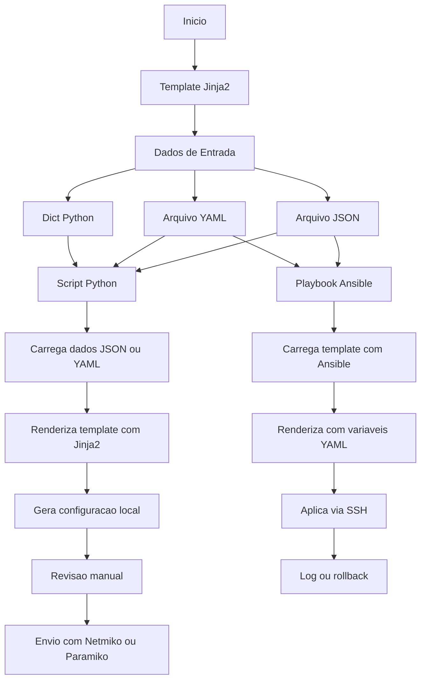

# Python - Básico 10

## Índice
- [Python - Básico 10](#python---básico-10)
  - [Índice](#índice)
- [05 Manipulação de arquivos – .j2](#05-manipulação-de-arquivos--j2)
    - [Casos de uso do Jinja2 na automação de redes:](#casos-de-uso-do-jinja2-na-automação-de-redes)
    - [Quando Usar Jinja2 vs Outras Abordagens](#quando-usar-jinja2-vs-outras-abordagens)
    - [Por que Jinja2 é essencial para o CCNP?](#por-que-jinja2-é-essencial-para-o-ccnp)
    - [Fluxo do uso do Jinja2 com Python puro e com Ansible](#fluxo-do-uso-do-jinja2-com-python-puro-e-com-ansible)
    - [Requisitos antes de começarmos os exemplos](#requisitos-antes-de-começarmos-os-exemplos)
    - [Exemplo 01: Geração de configuração de VLANs](#exemplo-01-geração-de-configuração-de-vlans)
      - [Estrutura de arquivos usada no exemplo](#estrutura-de-arquivos-usada-no-exemplo)
    - [Exemplo de uso:](#exemplo-de-uso)
    - [Exemplo de uso:](#exemplo-de-uso-1)
    - [Exemplo 02: Geração de configurações de interfaces com Jinja2](#exemplo-02-geração-de-configurações-de-interfaces-com-jinja2)
      - [Estrutura de arquivos usada no exemplo](#estrutura-de-arquivos-usada-no-exemplo-1)
    - [Exemplo 03: Geração de Listas de Acesso (ACL)](#exemplo-03-geração-de-listas-de-acesso-acl)
      - [Estrutura de arquivos usada no exemplo](#estrutura-de-arquivos-usada-no-exemplo-2)

# 05 Manipulação de arquivos – .j2

Jinja2 é uma biblioteca de template engine para Python, usada para gerar arquivos de forma dinâmica com base em dados estruturados. Os arquivos de modelo geralmente usam a extensão .j2 e contêm variáveis e estruturas de controle (como for, if, etc.).

É amplamente utilizado em automação de redes — especialmente com Ansible — para gerar configurações de roteadores, switches e firewalls de forma escalável, a partir de dados em formatos como YAML, JSON ou dicionários Python.

Também pode ser usado em scripts Python puros, sem depender do Ansible, o que é útil para engenheiros que desejam controlar totalmente o processo de automação.

Site oficial: https://jinja.palletsprojects.com/en/stable/

### Casos de uso do Jinja2 na automação de redes:

- Geração de configurações: VLANs, interfaces, ACLs, rotas, usuários, etc.
- Customização por dispositivo: mudar hostname, IP, SNMP, etc., com base em variáveis.
- Ambientes multi-site: templates reutilizáveis para dezenas ou centenas de switches.
- Integração com Ansible: geração de arquivos de configuração e comandos dinâmicos.
- Automação controlada via scripts Python: ideal para criar ferramentas internas.
- Padronização de configurações: manter consistência entre equipes e ambientes.

### Quando Usar Jinja2 vs Outras Abordagens

| Escolha Jinja2 quando...	                         | Evite Jinja2 quando...                             |
|----------------------------------------------------|----------------------------------------------------|
| Você precisa gerar configurações personalizadas	   |  O ambiente é extremamente simples e fixo          |
| Há muitos dispositivos com estruturas parecidas	   |  A mudança será aplicada uma única vez apenas      |
| Você já tem dados em JSON/YAML	                   |  Não há controle sobre os dados de entrada         |
| Você quer usar Ansible, Nornir ou criar interfaces |  A automação é feita com scripts shell simples     | 

### Por que Jinja2 é essencial para o CCNP?

- Separação de dados e lógica: facilita o reuso e o versionamento de configurações.
- Automação real de configurações: você aplica o mesmo modelo para N switches, apenas mudando os dados.
- Integração nativa com Ansible: 100% das tarefas no Ansible suportam variáveis com Jinja2.
- Escalabilidade e consistência: evita erros manuais e acelera a entrega de ambientes padronizados.
- Adoção em ambientes reais: é o padrão em equipes de redes que adotam infraestrutura como código.  
 
**OBS:** Antes de ver exemplos práticos com Jinja2, é fundamental entender o fluxo de como os templates e os dados estruturados (JSON ou YAML) se combinam para gerar configurações prontas. O fluxograma abaixo mostra dois cenários: uso com Python puro e uso com Ansible.

### Fluxo do uso do Jinja2 com Python puro e com Ansible



**OBS:** estaremos utilizando somente scripts python puro por enquanto. Todas as saídas serão locais e não serão enviadas para nenhum equipamento por questões de boas práticas. Depois irei adicionar tópicos para acesso dos equipamentos.

### Requisitos antes de começarmos os exemplos

Antes de rodar o script Python, certifique-se de que a biblioteca Jinja2 está instalada no seu ambiente.
Se não estiver, instale com o seguinte comando:

```python
pip install jinja2
```

**Dica:** se estiver usando Python 3 e o pip estiver vinculado ao Python 2, use pip3:

```python
pip3 install jinja2
```

- **Verificação**

Para garantir que está tudo certo, você pode executar:

``` python
python3 -c "import jinja2; print('Jinja2 instalado com sucesso!')"
```

### Exemplo 01: Geração de configuração de VLANs

#### Estrutura de arquivos usada no exemplo

```bash
01/
├── gerar_vlans.py              # Script principal em Python
├── vlans.json                  # Dados das VLANs
├── vlan_template.j2            # Template Jinja2
└── vlan_config.txt             # Saída gerada após a execução
```

Por que essa estrutura?? 

A ideia é passar os dados contidos no arquivo .json, que pode ser gerado manualmente ou pode ser obtido através de alguma fonte, para o template (vlan_template.j2) de forma dinâmica. Isso se torna interessante e útil pois no caso de um ambiente que temos que realizar várias mudanças, somente é necessário ou obter novos dados no arquivo .json, ou realizar algumas mudanças pontuais nesse arquivo de dados  

**Arquivo vlans.json**  

```json
{
  "vlans": [
    {"id": 10, "name": "Users"},
    {"id": 20, "name": "Servers"},
    {"id": 30, "name": "VoIP"}
  ]
}
```

**Arquivo vlan_template.j2**  

```j2
[01] ! Configuração de VLANs
[02]
[03] 
[04] vlan {{ vlan.id }}
[05] name {{ vlan.name }}
[06] !
[07] 
```

**Script Python gerar_vlans.py**  

```python
[01] import json
[02] from jinja2 import Environment, FileSystemLoader
[03]
[04] # Carrega os dados das VLANs
[05] with open('vlans.json') as f:
[06]    dados = json.load(f)
[07]
[08] # Carrega o template Jinja2
[09] env = Environment(loader=FileSystemLoader('.'))
[10] template = env.get_template('vlan_template.j2')
[11]
[12] # Renderiza a configuração
[13] saida = template.render(dados)
[14]
[15] # Salva a saída em um arquivo
[16] with open('vlan_config.txt', 'w') as f:
[17]    f.write(saida)
[18]
[19] print("Arquivo de configuração gerado: vlan_config.txt")
```

**Criando ambiente virtual e instalando o jinja2**

```bash
alcancil@linux:~/automacoes/arquivos/j2/01$ python3 -m venv venv
source venv/bin/activate
pip install jinja2
Collecting jinja2
  Using cached jinja2-3.1.6-py3-none-any.whl.metadata (2.9 kB)
Collecting MarkupSafe>=2.0 (from jinja2)
  Using cached MarkupSafe-3.0.2-cp312-cp312-manylinux_2_17_x86_64.manylinux2014_x86_64.whl.metadata (4.0 kB)
Using cached jinja2-3.1.6-py3-none-any.whl (134 kB)
Using cached MarkupSafe-3.0.2-cp312-cp312-manylinux_2_17_x86_64.manylinux2014_x86_64.whl (23 kB)
Installing collected packages: MarkupSafe, jinja2
Successfully installed MarkupSafe-3.0.2 jinja2-3.1.6
```

**Saída**

```bash
(venv) alcancil@linux:~/automacoes/arquivos/j2/01$ python3 gerar_vlans.py 
Arquivo de configuração gerado: vlan_config.txt
(venv) alcancil@linux:~/automacoes/arquivos/j2/01$ 

(venv) alcancil@linux:~/automacoes/arquivos/j2/01$ cat vlan_config.txt 
! Configuração de VLANs


vlan 10
 name Users
!

vlan 20
 name Servers
!

vlan 30
 name VoIP
!
(venv) alcancil@linux:~/automacoes/arquivos/j2/01$ 
```

**Explicação**  

**Arquivo vlan_template.j2**  

```j2
Seção 1: Cabeçalho

Linha [01] ! Configuração de VLANs              # Comentário fixo — aparece na saída final como marcação
Linha [02]                                      # Linha em branco para separar o cabeçalho do bloco de repetição

Seção 2: Laço de geração de VLANs

Linha [03]               # Início do laço — repete o bloco para cada VLAN na lista `vlans`
Linha [04] vlan {{ vlan.id }}                   # Substitui com o ID da VLAN — ex: "vlan 10"
Linha [05] name {{ vlan.name }}                 # Substitui com o nome da VLAN — ex: "name VLAN_GESTAO"
Linha [06] !                                    # Adiciona separador entre blocos de VLAN — estilo comum em configs Cisco
Linha [07]                          # Finaliza o laço — encerra a repetição dos comandos acima
```

A seguir, explicamos com mais detalhes sobre esse template jinja2. Aqui começamos a ver alguns elementos novos que são utilizados em tipos de arquivos assim, então vamos analisar:  

- **Linha 03: **  
  
  > Uso de   

Essas são chamadas de "delimitadores de instrução" no Jinja2.  

O que fazem?  

São usadas para:

    Comandos de controle de fluxo:

        for, if, elif, else, endfor, endif, etc.

    Blocos de lógica, mas que não produzem saída direta no texto.

### Exemplo de uso:

****

    Esse comando diz:
    "Para cada item da lista vlans, execute o que está dentro deste bloco."

Ele não imprime nada sozinho — ele controla o fluxo.  

- **Linhas 04 e 05: {{ vlan.id }} e {{ vlan.name }}**
  
  > Uso de {{ ... }}

Essas são chamadas de "delimitadores de expressão" no Jinja2.  

O que fazem?  

São usadas para imprimir valores ou expressões na saída final.  
Tudo o que estiver entre {{ ... }} será avaliado e substituído por seu valor.

### Exemplo de uso:

**vlan {{ vlan.id }}**

    Se vlan.id = 10, a saída será:

    vlan 10

**Resumo rápido:**  

| Símbolo   | Função                                      | Gera saída? |
|-----------|---------------------------------------------|-------------|
|  | Instruções de controle/lógica (laços, if)   | ❌ Não      |
| {{ ... }} | Expressões para imprimir valores            | ✅ Sim      |
| {# ... #} | Comentário (não aparece no resultado final) | ❌ Não      |

**Analogia simples:**
| Tipo	           | Como se fosse em Python               |
|------------------|---------------------------------------|
|  | for x in y: (estrutura de controle)   |
| {{ x }}	         | print(x) (imprimir na tela)           |

**Explicação**

**Script Python gerar_vlans.py**

```Python
Seção 1: Importação de Bibliotecas

Linha [01] import json                                       # Importa o módulo para ler e manipular arquivos JSON
Linha [02] from jinja2 import Environment, FileSystemLoader  # Importa o mecanismo de template e o carregador de arquivos do Jinja2

Seção 2: Leitura dos dados JSON

Linha [03]                                           
Linha [04]                                                    # Carrega os dados das VLANs             
Linha [05] with open('vlans.json') as f:                      # Abre o arquivo 'vlans.json' no modo leitura
Linha [06]    dados = json.load(f)                            # Carrega o conteúdo JSON e armazena na variável 'dados' (tipo: dicionário)

Seção 3: Carregamento do Template Jinja2

Linha [07]                                           
Linha [08]                                                    # Carrega o template Jinja2              
Linha [09] env = Environment(loader=FileSystemLoader('.'))    # Cria um ambiente Jinja2 e define que os templates estão no diretório atual ('.')
Linha [10] template = env.get_template('vlan_template.j2')    # Carrega o template chamado 'vlan_template.j2'

Seção 4: Renderização da configuração

Linha [11]                                           
Linha [12]                                                    # Renderiza a configuração                
Linha [13] saida = template.render(dados)                     # Usa os dados carregados do JSON para preencher o template Jinja2

Seção 5: Salvamento da saída gerada

Linha [14]                                           
Linha [15]                                                    # Salva a saída em um arquivo             
Linha [16] with open('vlan_config.txt', 'w') as f:            # Abre (ou cria) o arquivo 'vlan_config.txt' no modo "escrita"
Linha [17]    f.write(saida)                                  # Escreve o conteúdo gerado (a configuração final) no arquivo

Seção 6: Mensagem de confirmação

Linha [18]                                           
Linha [19] print("Arquivo de configuração gerado: vlan_config.txt")  # Exibe mensagem indicando sucesso da operação
```

**Etapas do ciclo de automação com Jinja2**  

O que esse script faz?  

- Lê dados de um JSON com informações de VLANs.
- Usa um template .j2 para transformar esses dados em uma configuração Cisco.
- Salva o resultado em um arquivo .txt.
- Exibe uma mensagem de confirmação.  

**Fluxo**  

Etapa	Ferramenta
1. Geração do template	Python + Jinja2
2. Validação opcional	Visual / Linter*
3. Armazenamento	.txt local ou Git (Ferramenta de versionamento)
4. Aplicação nos dispositivos	Netmiko / Paramiko / Ansible

**OBS:** Um linter é uma ferramenta que analisa automaticamente um arquivo em busca de erros, problemas de formatação ou boas práticas.

| Tipo de dado     | Ferramenta/Linter                      | O que valida                                            |
|------------------|----------------------------------------|---------------------------------------------------------|
| Config Cisco     | ciscoconfparse	                        | Verifica presença de comandos, subcomandos, e estrutura |
| YAML             | yamllint	                              | Verifica identação e estrutura                          |
| JSON             | json.tool, jq	                        | Valida sintaxe                                          | 
| Templates Jinja2 | jinjalint, ou execução de renderização |	Verifica sintaxe de template                            |

Esse ciclo é feito por boas práticas e segurança.

- [ciscofparse](https://github.com/mpenning/ciscoconfparse) - Valida configurações Cisco.
- [jinjalint](https://pypi.org/project/jinjalint/) - Verifica sintaxe de templates Jinja2.
- [yamllint](https://yamllint.readthedocs.io/en/stable/) - Valida arquivos YAML.

### Exemplo 02: Geração de configurações de interfaces com Jinja2

O exemplo a seguir vai gerar configurações de interfaces com base em dados fornecidos em JSON.

#### Estrutura de arquivos usada no exemplo

```bash
j2_interfaces/
├── template_interfaces.j2
├── dados_interfaces.json
└── gerar_interfaces.py
```

**dados_interfaces.json**

```json
{
  "hostname": "SW01",
  "interfaces": [
    {
      "nome": "GigabitEthernet0/1",
      "descricao": "Link para roteador",
      "modo": "access",
      "vlan": 10
    },
    {
      "nome": "GigabitEthernet0/2",
      "descricao": "Ligação com AP",
      "modo": "trunk"
    }
  ]
}
```

**template_interfaces.j2**

```jinja
[01] hostname {{ hostname }}
[02]
[03] 
[04] interface {{ intf.nome }}
[05] description {{ intf.descricao }}
[06] switchport mode {{ intf.modo }}
[07] 
[08] switchport access vlan {{ intf.vlan }}
[09] 
[10] !
[11] 
```
**gerar_interfaces.py**

```python
[01] import json
[02] from jinja2 import Environment, FileSystemLoader
[03]
[04] # 1. Leitura dos dados
[05] with open("dados_interfaces.json") as f:
[06]     dados = json.load(f)
[07]
[08] # 2. Carregamento do template
[09] env = Environment(loader=FileSystemLoader('.'))
[10] template = env.get_template("template_interfaces.j2")
[11]
[12] # 3. Renderização
[13] saida = template.render(dados)
[14]
[15] # 4. Salvamento
[16] with open(f"{dados['hostname']}_interfaces.txt", 'w') as f:
[17]     f.write(saida)
[18]
[19] print(f"✅ Configuração gerada: {dados['hostname']}_interfaces.txt")
```

**Saída (SW01_interfaces.txt)**

```bash
(venv) alcancil@linux:~/automacoes/arquivos/j2/02$ python3 gerar_interfaces.py 
✅ Configuração gerada: SW01_interfaces.txt
(venv) alcancil@linux:~/automacoes/arquivos/j2/02$ 
(venv) alcancil@linux:~/automacoes/arquivos/j2/02$ ls -la
total 28
drwxrwxr-x 3 alcancil alcancil 4096 mai 30 16:23 .
drwxrwxr-x 4 alcancil alcancil 4096 mai 30 16:17 ..
-rw-r--r-- 1 root     root      288 mai 30 16:18 dados_interfaces.json
-rw-r--r-- 1 root     root      505 mai 30 16:19 gerar_interfaces.py
-rw-rw-r-- 1 alcancil alcancil  218 mai 30 16:23 SW01_interfaces.txt
-rw-r--r-- 1 root     root      245 mai 30 16:18 template_interfaces.j2
drwxrwxr-x 5 alcancil alcancil 4096 mai 30 16:21 venv
(venv) alcancil@linux:~/automacoes/arquivos/j2/02$ cat SW01_interfaces.txt 
hostname SW01
interface GigabitEthernet0/1
 description Link para roteador
 switchport mode access

 switchport access vlan 10

!

interface GigabitEthernet0/2
 description Ligação com AP
 switchport mode trunk

!
(venv) alcancil@linux:~/automacoes/arquivos/j2/02$
```

**Explicação**  

**template_interfaces.j2**

```jinja
[01] hostname {{ hostname }}                             # Define o hostname com base na entrada JSON

[02]                         # Início do loop: para cada interface na lista
[03] interface {{ intf.nome }}                           # Comando "interface" seguido do nome da interface
[04]  description {{ intf.descricao }}                   # Define a descrição fornecida no JSON
[05]  switchport mode {{ intf.modo }}                    # Define o modo da porta: access ou trunk

[06]                       # Verifica se o modo é "access"
[07]  switchport access vlan {{ intf.vlan }}             # Se for access, aplica a VLAN de acesso
[08]                                          # Fim do condicional

[09] !                                                   # Separador entre interfaces
[10]                                         # Fim do loop
```

**gerar_interfaces.py**

```Python
Seção 1: Importação de bibliotecas

[01] import json                                                # Importa o módulo 'json' da biblioteca padrão do Python, usado para ler o arquivo de dados (dados_interfaces.json)
[02] from jinja2 import Environment, FileSystemLoader           # Importa as classes necessárias do Jinja2 para carregar e renderizar templates armazenados em arquivos

[03]

Seção 2: Leitura dos dados de entrada

[04]                                                            # 1. Leitura dos dados                                
[05] with open("dados_interfaces.json") as f:                   # Abre o arquivo 'dados_interfaces.json' no modo leitura
[06]     dados = json.load(f)                                   # Converte o conteúdo do arquivo JSON em um dicionário Python e armazena na variável 'dados'

[07]

Seção 3: Carregamento do template Jinja2

[08]                                                            # 2. Carregamento do template                         
[09] env = Environment(loader=FileSystemLoader('.'))            # Cria um ambiente Jinja2 e define que os templates estão no diretório atual ('.')
[10] template = env.get_template("template_interfaces.j2")      # Carrega o arquivo de template chamado 'template_interfaces.j2'

[11]

Seção 4: Renderização do template com os dados

[12]                                                             # 3. Renderização    
[13] saida = template.render(dados)                              # Executa a renderização: preenche o template com os dados e salva o resultado em 'saida'

[14]

Seção 5: Salvamento da saída gerada em um arquivo

[15]                                                              # 4. Salvamento                                       
[16] with open(f"{dados['hostname']}_interfaces.txt", 'w') as f:  # Abre ou cria um novo arquivo de saída com base no hostname (ex: SW01_interfaces.txt)
[17]     f.write(saida)                                           # Escreve o conteúdo gerado no arquivo

[18]

Seção 6: Confirmação no terminal

[19] print(f"✅ Configuração gerada: {dados['hostname']}_interfaces.txt")  # Exibe mensagem no terminal informando o nome do arquivo gerado com sucesso

```

O que esse exemplo ensina:  

- Uso de for para gerar várias interfaces. 
- Uso de if para aplicar lógica condicional.
- Separação completa entre dados (.json) e lógica (.j2).
- Como salvar um arquivo .txt com a configuração final.

### Exemplo 03: Geração de Listas de Acesso (ACL)

#### Estrutura de arquivos usada no exemplo

03
├── dados_acls.json         # Dados das acls
├── template_acl.j2         # Template Jinja2
├── gerar_acls.py           # # Script principal em Python
└── R1_acls.txt             # Saída gerada após a execução

**dados_acls.json**

```json
{
  "hostname": "R1",
  "acls": [
    {
      "nome": "ACL_INTERNET",
      "regras": [
        { "seq": 10, "acao": "permit", "protocolo": "ip", "origem": "192.168.1.0 0.0.0.255", "destino": "any" },
        { "seq": 20, "acao": "deny", "protocolo": "ip", "origem": "any", "destino": "any" }
      ]
    },
    {
      "nome": "ACL_VOIP",
      "regras": [
        { "seq": 10, "acao": "permit", "protocolo": "udp", "origem": "10.0.0.0 0.0.0.255", "destino": "any" }
      ]
    }
  ]
}
```

**template_acl.j2**

```jinja
hostname {{ hostname }}


ip access-list extended {{ acl.nome }}

 {{ regra.seq }} {{ regra.acao }} {{ regra.protocolo }} {{ regra.origem }} {{ regra.destino }}

!

```

**gerar_acls.py**

```python
[01] import json
[02] from jinja2 import Environment, FileSystemLoader
[03]
[04] # 1. Leitura dos dados
[05] with open("dados_acls.json") as f:
[06]     dados = json.load(f)
[07]
[08] # 2. Carregamento do template
[09] env = Environment(loader=FileSystemLoader('.'))
[10] template = env.get_template("template_acl.j2")
[11]
[12] # 3. Renderização
[13] saida = template.render(dados)
[14]
[16] # 4. Salvamento
[17] with open(f"{dados['hostname']}_acls.txt", "w") as f:
[18]     f.write(saida)
[19]
[20] print(f"✅ ACLs geradas: {dados['hostname']}_acls.txt")
```

**Saída gerada (R1_acls.txt)**

hostname R1

ip access-list extended ACL_INTERNET
 10 permit ip 192.168.1.0 0.0.0.255 any
 20 deny ip any any
!

ip access-list extended ACL_VOIP
 10 permit udp 10.0.0.0 0.0.0.255 any
!

**Explicação linha a linha – template_acl.j2

[01] hostname {{ hostname }}                             # Define o hostname da configuração com base no JSON

[02]                                # Loop externo para cada ACL na lista

[03] ip access-list extended {{ acl.nome }}              # Cria o bloco de ACL com o nome definido

[04]                        # Loop interno para cada regra dentro da ACL

[05]  {{ regra.seq }} {{ regra.acao }} {{ regra.protocolo }} {{ regra.origem }} {{ regra.destino }}  
                                                         # Gera a linha da regra da ACL com os campos definidos

[06]                                         # Fim do loop de regras

[07] !                                                   # Separador entre ACLs

[08]                                         # Fim do loop de ACLs

🎯 Aprendizados principais desse exemplo:

    Uso de loops aninhados (for dentro de for).

    Como gerar ACLs com múltiplas regras e nomes diferentes.

    Aplicação direta a roteadores Cisco com comandos realistas.

    Mantém a lógica de separação entre dados, template e execução.

