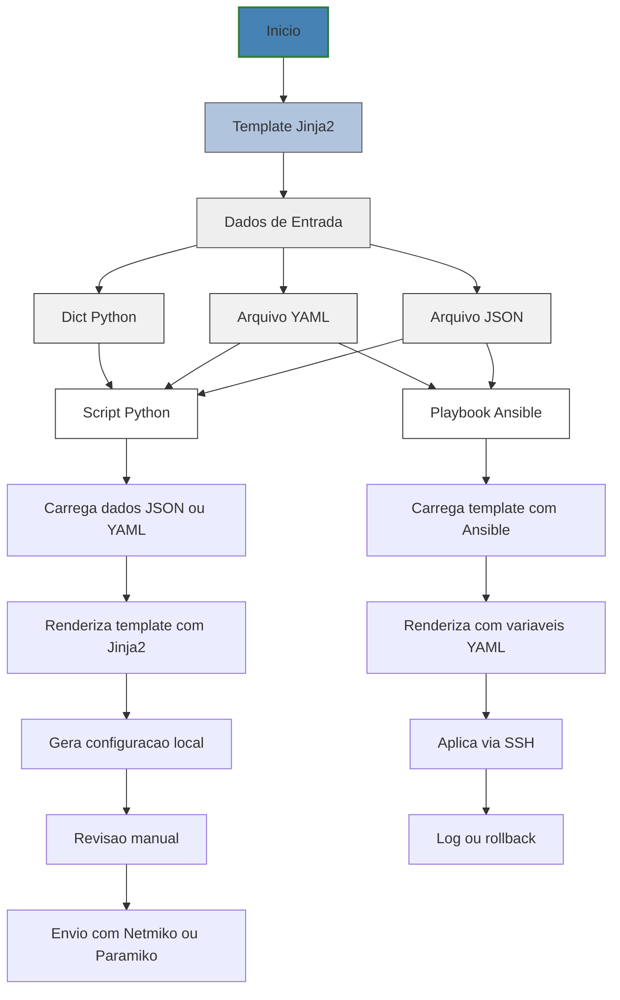

# Python - Básico 10

## Índice
- [Python - Básico 10](#python---básico-10)
  - [Índice](#índice)
- [05 Manipulação de arquivos – .j2](#05-manipulação-de-arquivos--j2)
    - [Casos de uso do Jinja2 na automação de redes:](#casos-de-uso-do-jinja2-na-automação-de-redes)
    - [Quando Usar Jinja2 vs Outras Abordagens](#quando-usar-jinja2-vs-outras-abordagens)
    - [Por que Jinja2 é essencial para o CCNP?](#por-que-jinja2-é-essencial-para-o-ccnp)
    - [Fluxo do uso do Jinja2 com Python puro e com Ansible](#fluxo-do-uso-do-jinja2-com-python-puro-e-com-ansible)

# 05 Manipulação de arquivos – .j2

Jinja2 é uma biblioteca de template engine para Python, usada para gerar arquivos de forma dinâmica com base em dados estruturados. Os arquivos de modelo geralmente usam a extensão .j2 e contêm variáveis e estruturas de controle (como for, if, etc.).

Jinja2 é amplamente utilizado em automação de redes — especialmente com Ansible — para gerar configurações de roteadores, switches e firewalls de forma escalável, a partir de dados em formatos como YAML, JSON ou dicionários Python.

Também pode ser usado em scripts Python puros, sem depender do Ansible, o que é útil para engenheiros que desejam controlar totalmente o processo de automação.

### Casos de uso do Jinja2 na automação de redes:

- Geração de configurações: VLANs, interfaces, ACLs, rotas, usuários, etc.
- Customização por dispositivo: mudar hostname, IP, SNMP, etc., com base em variáveis.
- Ambientes multi-site: templates reutilizáveis para dezenas ou centenas de switches.
- Integração com Ansible: geração de arquivos de configuração e comandos dinâmicos.
- Automação controlada via scripts Python: ideal para criar ferramentas internas.
- Padronização de configurações: manter consistência entre equipes e ambientes.

### Quando Usar Jinja2 vs Outras Abordagens

| Escolha Jinja2 quando...	                         | Evite Jinja2 quando...                             |
|----------------------------------------------------|----------------------------------------------------|
| Você precisa gerar configurações personalizadas	 |  O ambiente é extremamente simples e fixo          |
| Há muitos dispositivos com estruturas parecidas	 |  A mudança será aplicada uma única vez apenas      |
| Você já tem dados em JSON/YAML	                 |  Não há controle sobre os dados de entrada         |
| Você quer usar Ansible, Nornir ou criar interfaces |  A automação é feita com scripts shell simples     | 

### Por que Jinja2 é essencial para o CCNP?

- Separação de dados e lógica: facilita o reuso e o versionamento de configurações.
- Automação real de configurações: você aplica o mesmo modelo para N switches, apenas mudando os dados.
- Integração nativa com Ansible: 100% das tarefas no Ansible suportam variáveis com Jinja2.
- Escalabilidade e consistência: evita erros manuais e acelera a entrega de ambientes padronizados.
- Adoção em ambientes reais: é o padrão em equipes de redes que adotam infraestrutura como código.

    Antes de ver exemplos práticos com Jinja2, é fundamental entender o fluxo de como os templates e os dados estruturados (JSON ou YAML) se combinam para gerar configurações prontas. O fluxograma abaixo mostra dois cenários: uso com Python puro e uso com Ansible.

### Fluxo do uso do Jinja2 com Python puro e com Ansible

