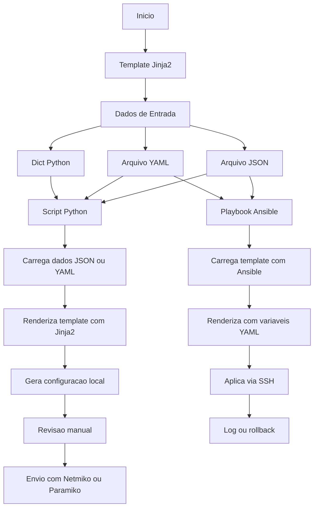

# Python - Básico 10

## Índice
- [Python - Básico 10](#python---básico-10)
  - [Índice](#índice)
- [05 Manipulação de arquivos – .j2](#05-manipulação-de-arquivos--j2)
    - [Casos de uso do Jinja2 na automação de redes:](#casos-de-uso-do-jinja2-na-automação-de-redes)
    - [Quando Usar Jinja2 vs Outras Abordagens](#quando-usar-jinja2-vs-outras-abordagens)
    - [Por que Jinja2 é essencial para o CCNP?](#por-que-jinja2-é-essencial-para-o-ccnp)
    - [Fluxo do uso do Jinja2 com Python puro e com Ansible](#fluxo-do-uso-do-jinja2-com-python-puro-e-com-ansible)
    - [Requisitos antes de começarmos os exemplos](#requisitos-antes-de-começarmos-os-exemplos)
    - [Exemplo 1: Geração de configuração de VLANs](#exemplo-1-geração-de-configuração-de-vlans)
      - [Estrutura de arquivos usada no exemplo](#estrutura-de-arquivos-usada-no-exemplo)

# 05 Manipulação de arquivos – .j2

Jinja2 é uma biblioteca de template engine para Python, usada para gerar arquivos de forma dinâmica com base em dados estruturados. Os arquivos de modelo geralmente usam a extensão .j2 e contêm variáveis e estruturas de controle (como for, if, etc.).

Jinja2 é amplamente utilizado em automação de redes — especialmente com Ansible — para gerar configurações de roteadores, switches e firewalls de forma escalável, a partir de dados em formatos como YAML, JSON ou dicionários Python.

Também pode ser usado em scripts Python puros, sem depender do Ansible, o que é útil para engenheiros que desejam controlar totalmente o processo de automação.

### Casos de uso do Jinja2 na automação de redes:

- Geração de configurações: VLANs, interfaces, ACLs, rotas, usuários, etc.
- Customização por dispositivo: mudar hostname, IP, SNMP, etc., com base em variáveis.
- Ambientes multi-site: templates reutilizáveis para dezenas ou centenas de switches.
- Integração com Ansible: geração de arquivos de configuração e comandos dinâmicos.
- Automação controlada via scripts Python: ideal para criar ferramentas internas.
- Padronização de configurações: manter consistência entre equipes e ambientes.

### Quando Usar Jinja2 vs Outras Abordagens

| Escolha Jinja2 quando...	                         | Evite Jinja2 quando...                             |
|----------------------------------------------------|----------------------------------------------------|
| Você precisa gerar configurações personalizadas	 |  O ambiente é extremamente simples e fixo          |
| Há muitos dispositivos com estruturas parecidas	 |  A mudança será aplicada uma única vez apenas      |
| Você já tem dados em JSON/YAML	                 |  Não há controle sobre os dados de entrada         |
| Você quer usar Ansible, Nornir ou criar interfaces |  A automação é feita com scripts shell simples     | 

### Por que Jinja2 é essencial para o CCNP?

- Separação de dados e lógica: facilita o reuso e o versionamento de configurações.
- Automação real de configurações: você aplica o mesmo modelo para N switches, apenas mudando os dados.
- Integração nativa com Ansible: 100% das tarefas no Ansible suportam variáveis com Jinja2.
- Escalabilidade e consistência: evita erros manuais e acelera a entrega de ambientes padronizados.
- Adoção em ambientes reais: é o padrão em equipes de redes que adotam infraestrutura como código.  
 
**OBS:** Antes de ver exemplos práticos com Jinja2, é fundamental entender o fluxo de como os templates e os dados estruturados (JSON ou YAML) se combinam para gerar configurações prontas.O fluxograma abaixo mostra dois cenários: uso com Python puro e uso com Ansible.

### Fluxo do uso do Jinja2 com Python puro e com Ansible



**OBS:** estaremos utilizando somente scripts python puro por enquanto. Todas as saídas serão locais e não serão enviadas para nenhum equipamento por questões de boas práticas. Depois irei adicionar tópicos para acesso dos equipamentos.

### Requisitos antes de começarmos os exemplos

Antes de rodar o script Python, certifique-se de que a biblioteca Jinja2 está instalada no seu ambiente.
Se não estiver, instale com o seguinte comando:

```python
pip install jinja2
```

**Dica:** se estiver usando Python 3 e o pip estiver vinculado ao Python 2, use pip3:

```python
pip3 install jinja2
```

- **Verificação**

Para garantir que está tudo certo, você pode executar:

``` python
python3 -c "import jinja2; print('Jinja2 instalado com sucesso!')"
```

### Exemplo 1: Geração de configuração de VLANs

#### Estrutura de arquivos usada no exemplo

```bash
01/
├── gerar_vlans.py              # Script principal em Python
├── vlans.json                  # Dados das VLANs
├── vlan_template.j2            # Template Jinja2
└── vlan_config.txt             # Saída gerada após a execução
```

**Arquivo vlans.json**  

```json
{
  "vlans": [
    {"id": 10, "name": "Users"},
    {"id": 20, "name": "Servers"},
    {"id": 30, "name": "VoIP"}
  ]
}
```

**Arquivo vlan_template.j2**  

```j2
! Configuração de VLANs


vlan {{ vlan.id }}
 name {{ vlan.name }}
!

```

**Script Python gerar_vlans.py2**  

```python
import json
from jinja2 import Environment, FileSystemLoader

# Carrega os dados das VLANs
with open('vlans.json') as f:
    dados = json.load(f)

# Carrega o template Jinja2
env = Environment(loader=FileSystemLoader('.'))
template = env.get_template('vlan_template.j2')

# Renderiza a configuração
saida = template.render(dados)

# Salva a saída em um arquivo
with open('vlan_config.txt', 'w') as f:
    f.write(saida)

print("Arquivo de configuração gerado: vlan_config.txt")
```

**Saída**

```bash
alcancil@linux:~/automacoes/arquivos/j2/01$ python3 -m venv venv
source venv/bin/activate
pip install jinja2
Collecting jinja2
  Using cached jinja2-3.1.6-py3-none-any.whl.metadata (2.9 kB)
Collecting MarkupSafe>=2.0 (from jinja2)
  Using cached MarkupSafe-3.0.2-cp312-cp312-manylinux_2_17_x86_64.manylinux2014_x86_64.whl.metadata (4.0 kB)
Using cached jinja2-3.1.6-py3-none-any.whl (134 kB)
Using cached MarkupSafe-3.0.2-cp312-cp312-manylinux_2_17_x86_64.manylinux2014_x86_64.whl (23 kB)
Installing collected packages: MarkupSafe, jinja2
Successfully installed MarkupSafe-3.0.2 jinja2-3.1.6
(venv) alcancil@linux:~/automacoes/arquivos/j2/01$ python3 gerar_vlans.py 
Arquivo de configuração gerado: vlan_config.txt
(venv) alcancil@linux:~/automacoes/arquivos/j2/01$ 
```