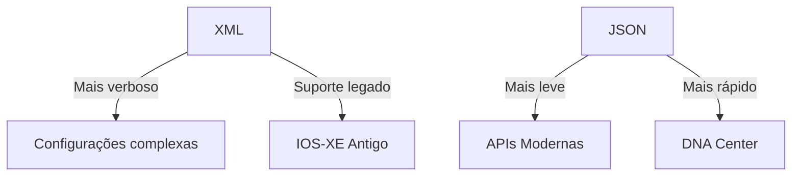

# Python - Básico 10

## 04 Manipulação de arquivos - .xml

### O que é XML?
XML (eXtensible Markup Language) é uma linguagem de marcação projetada para:
- Armazenar e transportar dados hierárquicos
- Ser legível por humanos e máquinas
- Integrar-se com sistemas legados Cisco (NETCONF, SOAP)

**Comparação com XML/JSON:**


### Quando Usar XML vs Outros Formatos  

| **Escolha XML quando...**          | **Evite XML quando...**          |
|:-----------------------------------|:---------------------------------|
| Integração com NETCONF/YANG        | APIs modernas (RESTCONF)         |
| Sistemas legados (ACI SOAP, Prime) | Performance crítica (use JSON)   |
| Necessidade de validação via XSD   | Configurações simples (use YAML) |

**Por que XML ainda é relevante para o CCNP?**

    NETCONF/YANG: muito dos dispositivos Cisco em produção ainda usam NETCONF como protocolo de configuração principal

    Compatibilidade: Único formato suportado em:

        - IOS-XE versões anteriores à 16.8
        - Cisco Prime Infrastructure
        - ACI via SOAP (em integrações legadas)

Exemplo XML vs JSON em Cisco DNA Center:

**xml**

```xml
<!-- XML -->
<device>
    <hostname>SW1</hostname>
    <interfaces>
        <interface>
            <name>Gig0/1</name>
            <vlan>10</vlan>
        </interface>
    </interfaces>
</device>
```

**json**

```json
{
    "device": {
        "hostname": "SW1",
        "interfaces": {
            "interface": {
                "name": "Gig0/1",
                "vlan": 10
            }
        }
    }
}
```

### Sintaxe do XML

**Estrutura Básica**

```xml
<?xml version="1.0" encoding="UTF-8"?>
<root>
    <element attribute="value">
        <child>Conteúdo</child>
    </element>
</root>
```

**Componentes:**  

    - Tags: <tag> (abertura) e </tag> (fechamento)
    - Atributos: name="value" dentro da tag de abertura
    - Conteúdo: Texto entre tags

### Exemplo Cisco NETCONF

```xml
<rpc message-id="101" xmlns="urn:ietf:params:xml:ns:netconf:base:1.0">
    <edit-config>
        <target>
            <running/>
        </target>
        <config>
            <interface xmlns="urn:ietf:params:xml:ns:yang:ietf-interfaces">
                <name>GigabitEthernet0/1</name>
                <enabled>true</enabled>
            </interface>
        </config>
    </edit-config>
</rpc>
```

Processamento em Python

Bibliotecas essenciais:

    xml.etree.ElementTree (nativa)

    xmltodict (para conversão JSON ↔ XML)

    lxml (para XSD validation)

Exemplo de parsing:
python

import xml.etree.ElementTree as ET

xml_data = """
<device>
    <hostname>R1</hostname>
    <interfaces>
        <interface>
            <name>Gig0/1</name>
            <status>up</status>
        </interface>
    </interfaces>
</device>"""

root = ET.fromstring(xml_data)
print(root.find('hostname').text)  # Saída: R1

Exemplos Práticos
Exemplo 01: Configuração via NETCONF

Cenário: Ativar interface em IOS-XE
xml

<rpc message-id="101">
    <edit-config>
        <target>
            <running/>
        </target>
        <config>
            <interface xmlns="urn:ietf:params:xml:ns:yang:ietf-interfaces">
                <name>GigabitEthernet0/1</name>
                <enabled>true</enabled>
            </interface>
        </config>
    </edit-config>
</rpc>

Script Python:
python

from ncclient import manager

with manager.connect(
    host='192.168.1.1',
    port=830,
    username='admin',
    password='cisco123',
    hostkey_verify=False
) as m:
    config = """
    <config>
        <interfaces xmlns="urn:ietf:params:xml:ns:yang:ietf-interfaces">
            <interface>
                <name>GigabitEthernet0/1</name>
                <enabled>true</enabled>
            </interface>
        </interfaces>
    </config>"""
    m.edit_config(target='running', config=config)

Exemplo 02: Processamento de Logs

Entrada XML (show interface):
xml

<interface>
    <name>Gig0/1</name>
    <status>up</status>
    <ip-address>192.168.1.1</ip-address>
    <speed>1000</speed>
</interface>

Conversão para JSON:
python

import xmltodict, json

xml_data = open('interface.xml').read()
json_data = json.dumps(xmltodict.parse(xml_data), indent=2)
print(json_data)

Exercício Prático

Converta este JSON para XML e valide com https://www.xmlvalidation.com/
json

{
    "vlan": {
        "id": 10,
        "name": "VLAN_GESTAO",
        "ports": ["Gig0/1", "Gig0/2"]
    }
}

Resumo do Aprendizado
bash

1. XML no Ecossistema Cisco  
   - NETCONF: Principal protocolo para IOS-XE antigos  
   - ACI: Integração via SOAP em sistemas legados  
   - Prime Infrastructure: Configuração via XML-RPC  

2. Bibliotecas Python  
   - xml.etree.ElementTree: Parsing básico  
   - xmltodict: Conversão para dicionários Python  
   - ncclient: Cliente NETCONF para Cisco  

3. Casos de Uso  
   - Configuração via NETCONF/YANG  
   - Processamento de saídas "show" em XML  
   - Integração com sistemas OSS/BSS legados  

4. Boas Práticas
   - Sempre validar com XSD em sistemas críticos
   - Usar xmltodict para integração com APIs modernas
   - Preferir JSON/YAML para novos projetos

Recursos Adicionais

- [NETCONF/YANG Developer Guide](https://www.cisco.com/c/en/us/support/ios-nx-os-software/ios-xe-17/products-installation-and-configuration-guides-list.html#!netconf-yang-and-restconf-guide)
- [Python XML Processing](https://docs.python.org/3/library/xml.html)


