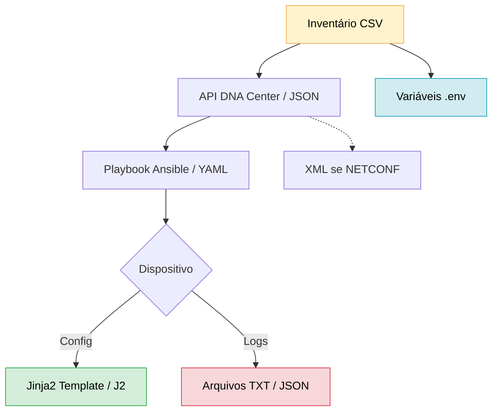

# Python - Básico 11

## Tratamento de Erros

### Por Que Isso Importa?
Erros acontecem — especialmente em automação de redes, onde arquivos podem estar mal formatados, ausentes ou conter dados inválidos.  
Saber tratar esses erros evita que seus scripts quebrem e garante uma automação segura e confiável.  

### O que vamos estudar

- Identificar e capturar erros comuns com try, except, else e finally
- Tratar exceções específicas como FileNotFoundError, KeyError, json.JSONDecodeError, PermissionError, entre outras
- Criar scripts mais robustos e prontos para produção
- Adaptar tratamentos de erro para arquivos .txt, .csv, .json, .yaml, .env, .xml e .j2

### Fluxo de Automação

  
    As caixas coloridas representam pontos onde erros são comuns:

        🟨 Arquivo não encontrado

        🟥 Formato malformado (ex: JSON inválido)

        🟦 Variável de ambiente ausente

        🟩 Renderização de template com erro

---
ARRUMAR

### Como funciona ?

Para o tratamento de erros, existem as estruturas **try, except, else e finally**. 
 
O tratamento de erros (try/except/finally) é essencial em automação de redes porque:

    Evita que scripts falhem silenciosamente (ex.: um erro em um roteador não deve parar toda a automação).

    Facilita a depuração (logs claros sobre o que deu errado).

    Garante limpeza de recursos (fechar conexões SSH, liberar memória).

1. Estrutura Básica e Propósito

| Bloco	  | Quando é Executado?	              | Para que Serve?                                                    |
|---------|-----------------------------------|--------------------------------------------------------------------|
| try	  | Sempre primeiro.	              | Delimita o código que pode gerar erros.                            |
| except  | Apenas se ocorrer um erro no try. | Trata erros específicos (ex.: conexão falhou, arquivo não existe). |
| else	  | Apenas se NÃO houver erro no try. | Executa código que depende do sucesso do try (opcional).           |
| finally | Sempre, com ou sem erros.         | Garante ações finais (ex.: fechar arquivos, conexões).             |

ARRUMAR
---

📂 Tipos de arquivos abordados e erros comuns

### [Arquivos TXT](Arquivos/txt/README.md)

- **Para que serve:** Armazenar logs brutos, saídas de comandos (como show running-config) e relatórios simples.
- **Erros comuns tratados:** Arquivo não encontrado, Permissão negada, etc.
- **Quando usar:** Quando você precisa armazenar ou analisar saídas de CLI simples ou logs sequenciais.

### [Arquivos CSV](Arquivos/csv/README.md)

- **Para que serve:** Gerenciar inventários de dispositivos, listas de portas, VLANs, IPs ou usuários de forma tabular.
- **Erros comuns tratados:** Colunas ausentes, Delimitadores incorretos, etc.
- **Quando usar:** Quando a estrutura dos dados é tabular (linhas e colunas), e você precisa importar ou exportar para planilhas.

### [Arquivos JSON](Arquivos/json/README.md)

- **Para que serve:** Representar dados estruturados, como inventários hierárquicos ou configurações vindas de APIs (ex: DNA Center, Meraki).
- **Erros comuns tratados:** JSON malformado, Chaves ausentes, etc.
- **Quando usar:** Quando os dados têm estrutura de dicionário/lista e precisam de integração com APIs modernas ou manipulação no Python.
 
### [Arquivos YAML](Arquivos/yaml/README.md)

- **Para que serve:** Configurar playbooks no Ansible, inventários do Nornir e dados hierárquicos legíveis por humanos.
- **Erros comuns tratados:** Identação incorreta, Estrutura malformada, etc.
- **Quando usar:** Quando legibilidade e compatibilidade com ferramentas como Ansible e Nornir são prioridades.

### [Arquivos XML](Arquivos/xml/README.md)

- **Para que serve:** Troca de dados com APIs legadas (NETCONF, ACI, SOAP).
- **Erros comuns tratados:** Tags malformadas, Falhas de parsing, etc.
- **Quando usar:** Quando a plataforma exige XML, como Cisco ACI, IOS-XE com NETCONF ou equipamentos que seguem YANG.

### [Templates J2](Arquivos/j2/README.md)

- **Para que serve:** Gerar configurações dinâmicas em massa com base em dados variáveis (como VLANs, interfaces, ACLs).
- **Erros comuns tratados:** Variáveis indefinidas, Sintaxe incorreta nos templates, etc.
- **Quando usar:** Quando você precisa aplicar o mesmo modelo para dezenas de equipamentos, mudando apenas os dados.

### [Arquivos ENV](Arquivos/env/README.md)

- **Para que serve:** Armazenar credenciais, IPs, senhas, tokens de API e outras variáveis sensíveis fora do código-fonte.
- **Erros comuns tratados:** Variáveis ausentes, Arquivo .env não encontrado, etc.
- **Quando usar:** Sempre que você quiser manter o código limpo, seguro e reutilizável entre diferentes ambientes (ex: LAB, produção, nuvem).

📌 Como navegar

Clique em qualquer formato acima para ver:

    Exemplos práticos com tratamento de erro

    Bibliotecas Python relacionadas

    Erros específicos que ocorrem em redes Cisco

    Estratégias para garantir resiliência na automação
