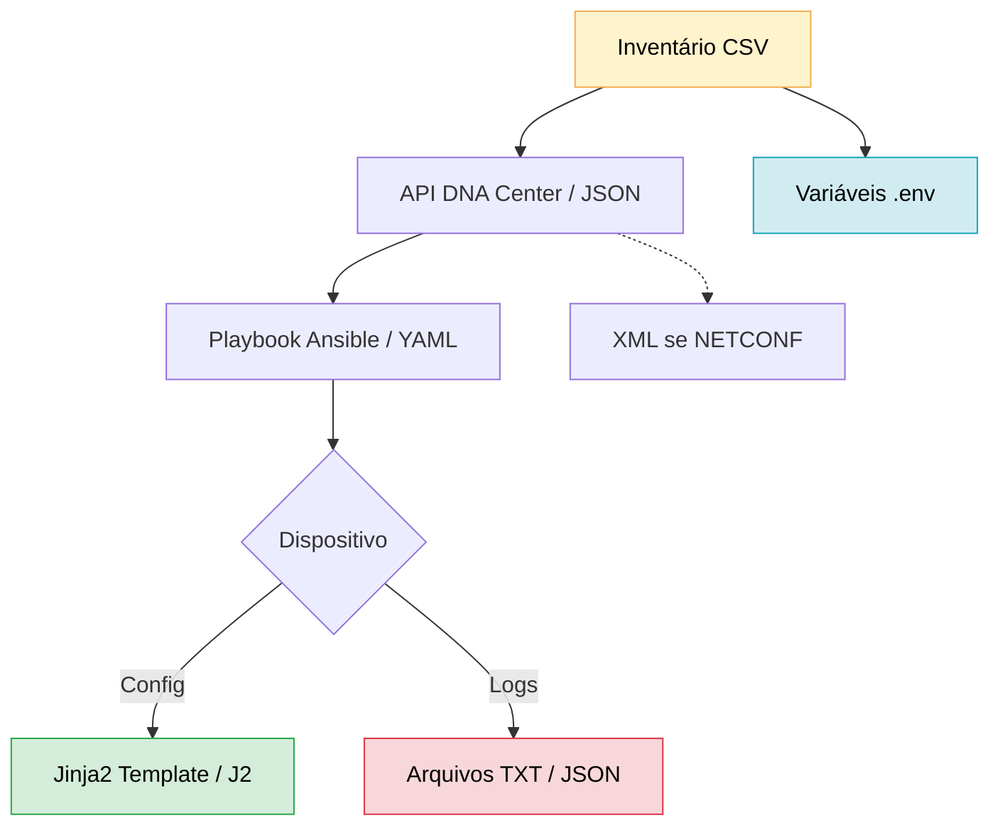

# Python - Básico 10

## Tratamento de Erros

### Por Que Isso Importa?
Erros acontecem — especialmente em automação de redes, onde arquivos podem estar mal formatados, ausentes ou conter dados inválidos.  
Saber tratar esses erros evita que seus scripts quebrem e garante uma automação segura e confiável.  

### O que vamos estudar

- Identificar e capturar erros comuns com try, except, else e finally
- Tratar exceções específicas como FileNotFoundError, KeyError, json.JSONDecodeError, PermissionError, entre outras
- Criar scripts mais robustos e prontos para produção
- Adaptar tratamentos de erro para arquivos .txt, .csv, .json, .yaml, .env, .xml e .j2

### Fluxo de Automação

    style A fill:#fff3cd,stroke:#f0ad4e
    style F fill:#f8d7da,stroke:#dc3545
    style G fill:#d1ecf1,stroke:#17a2b8
    style E fill:#d4edda,stroke:#28a745

    As caixas coloridas representam pontos onde erros são comuns:

        🟨 Arquivo não encontrado

        🟥 Formato malformado (ex: JSON inválido)

        🟦 Variável de ambiente ausente

        🟩 Renderização de template com erro

📂 Tipos de arquivos abordados e erros comuns
Tipo de arquivo	Erros comuns tratados com try/except
TXT	Arquivo não encontrado, permissões negadas
CSV	Delimitadores errados, colunas ausentes
JSON	JSON malformado, chave inexistente
YAML	Erros de indentação ou estrutura
XML	Tags não fechadas, parse quebrado
J2	Variável indefinida, erro de sintaxe no template
ENV	Variáveis ausentes ou arquivo não encontrado

📌 Como navegar

Clique em qualquer formato acima para ver:

    Exemplos práticos com tratamento de erro

    Bibliotecas Python relacionadas

    Erros específicos que ocorrem em redes Cisco

    Estratégias para garantir resiliência na automação

---
ARRUMAR

Explore os formatos essenciais:

### [Arquivos TXT](Arquivos/txt/README.md)
- **Para que serve:** Logs brutos e saída de comandos CLI  
- **Caso Cisco:** `show running-config` → análise básica  
- `with open('log.txt') as f: print(f.read())`

### [Arquivos CSV](Arquivos/csv/README.md)
- **Para que serve:** Inventários de dispositivos em massa  
- **Caso Cisco:** Importar 100+ switches para Nornir/Ansible  
- `import csv; csv.DictReader('inventario.csv')`

### [Arquivos JSON](Arquivos/json/README.md)
- **Para que serve:** APIs Cisco (DNA Center/Meraki)  
- **Caso Cisco:** `POST /restconf/data/` com configurações  
- `json.loads(response.text)`

### [Arquivos YAML](Arquivos/yaml/README.md)
- **Para que serve:** Playbooks Ansible e Nornir  
- **Caso Cisco:** Templates de VLANs/ACLs legíveis  
- `yaml.safe_load('vlan.yml')`

### [Arquivos XML](Arquivos/xml/README.md)
- **Para que serve:** APIs legadas (NETCONF/SOAP) e ACI  
- **Caso Cisco:** Configuração de dispositivos via NETCONF em IOS-XE e consulta de políticas no Cisco ACI  
- `xmltodict.parse(config.xml)`

### [Templates J2](Arquivos/j2/README.md)
- **Para que serve:** Configurações dinâmicas multi-dispositivo  
- **Caso Cisco:** Gerar unique configs para 50 switches  
- `Template(open('template.j2').read())`

### [Arquivos ENV](Arquivos/env/README.md)
- **Para que serve:** Gerenciar credenciais e variáveis de ambiente  
- **Caso Cisco:** Armazenar chaves de API do DNA Center e credenciais de dispositivos de forma segura  
- `load_dotenv('.env')`

---

### Como Navegar 

Clique em qualquer formato acima para ver:
   -  Exemplos práticos Cisco
   -  Bibliotecas Python relacionadas
   -  Armadilhas comuns em redes
