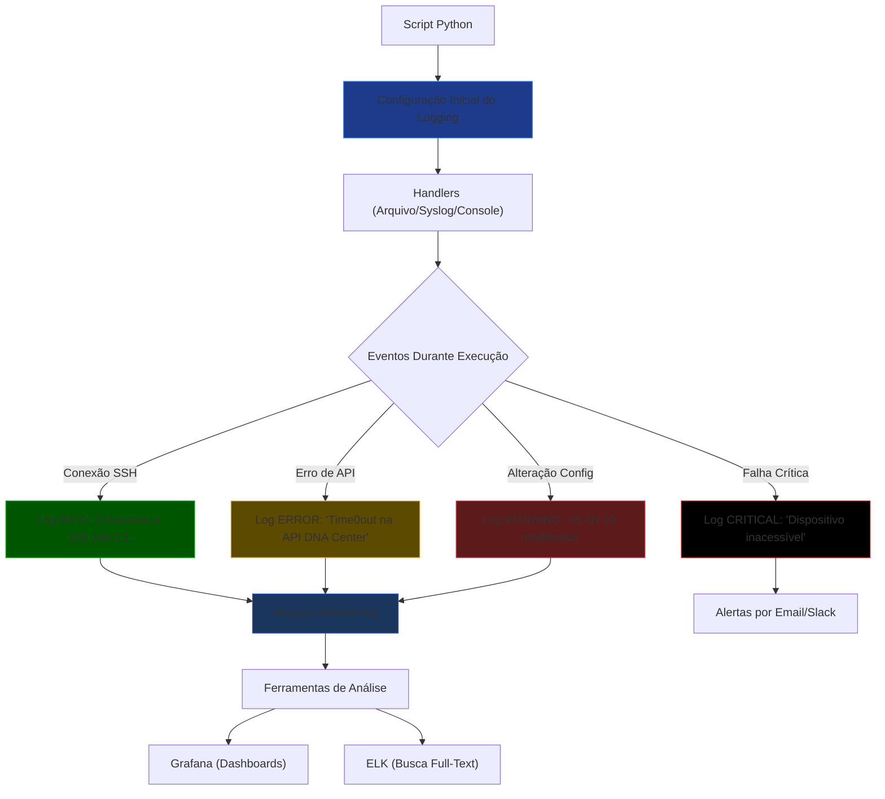

# Python - Básico 12

## Logging

## Sumário
- [Python - Básico 12](#python---básico-12)
  - [Logging](#logging)
  - [Sumário](#sumário)
    - [Por Que Logging é Essencial?](#por-que-logging-é-essencial)
    - [O que vamos estudar](#o-que-vamos-estudar)
    - [Fluxo de Automação](#fluxo-de-automação)
    - [Como Funciona o Logging em Python?](#como-funciona-o-logging-em-python)
  - [Breve revisão](#breve-revisão)
    - [SYSLOG em Dispositivos Cisco](#syslog-em-dispositivos-cisco)
    - [Níveis de Severidade Cisco (0-7):](#níveis-de-severidade-cisco-0-7)
    - [Correlação de Logs (Cisco + Python)](#correlação-de-logs-cisco--python)
    - [Logging para Troubleshooting](#logging-para-troubleshooting)
    - [Dicas de Ouro](#dicas-de-ouro)
    - [Regras de Ouro](#regras-de-ouro)
    - [Arquivos TXT](#arquivos-txt)
    - [Arquivos CSV](#arquivos-csv)
    - [Arquivos JSON](#arquivos-json)
    - [Arquivos YAML Arrumar](#arquivos-yaml-arrumar)
    - [Arquivos XML Arrumar](#arquivos-xml-arrumar)
    - [Templates J2 Arrumar](#templates-j2-arrumar)
    - [Arquivos ENV Arrumar](#arquivos-env-arrumar)

### Por Que Logging é Essencial?

Em automação de redes, 90% dos problemas ocorrem em produção — conexões SSH falhas, APIs indisponíveis ou configurações inválidas.
Logging estruturado é sua "caixa preta" para:  

    🕵️‍♂️ Diagnosticar falhas que só acontecem em ambientes reais

    📜 Auditar mudanças em dispositivos de rede

    🔒 Cumprir requisitos de segurança

    🔄 Rollback inteligente com base em logs históricos

### O que vamos estudar

- Entender como o módulo logging do Python funciona
- Aprender os diferentes níveis de log e quando usá-los
- Criar logs em arquivos e integrar com outras ferramentas (Graylog, ELK, etc)
- Aplicar logs em scripts de automação de rede com Cisco e Linux

### Fluxo de Automação


  
**Legenda de Uso:**  

| Cor         | Nível de Log  | Quando Usar                                  |
|-------------|---------------|----------------------------------------------|
| 🟢 Verde    | INFO          | Conexões bem-sucedidas, eventos rotineiros   |
| 🟡 Amarelo  |	WARNING       | Configurações incomuns mas não críticas      |
| 🔴 Vermelho |	ERROR         | Falhas recuperáveis (ex: timeout SSH)        |
| ⚫ Preto    | CRITICAL      | Falhas que exigem ação imediata              |

### Como Funciona o Logging em Python?

O logging é o sistema padrão do Python para registrar eventos durante a execução de scripts. Em automação de redes, ele é essencial para:

    📌 Rastrear o fluxo de execução

    🔍 Depurar problemas

    📊 Auditar operações em dispositivos

1. **Componentes Principais**  

| Componente | Função                                     | Exemplo em Redes                            |
|------------|--------------------------------------------|---------------------------------------------| 
| Loggers    | Canais de registro (hierárquicos)          | logging.getLogger('network.ssh')            |
| Handlers   | Destinos dos logs (arquivo/console/syslog) | FileHandler('network.log')                  | 
| Formatters | Estrutura da mensagem (timestamp/nível)    | '%(asctime)s - %(levelname)s - %(message)s' |
| Filters    | Controle de quais logs são registrados     | filter=lambda record: 'VLAN' in record.msg  |

2. **Exemplo Prático (Configuração Básica)**

```Python
import logging

# 1. Configuração Inicial
logging.basicConfig(
    filename='network.log',          # Arquivo de saída
    level=logging.INFO,              # Nível mínimo para registrar
    format='%(asctime)s - %(levelname)s - %(message)s'
)

# 2. Uso em operações de rede
logging.info("Iniciando backup de configurações...")  # Mensagem informativa
logging.warning("VLAN 10 modificada manualmente")     # Alerta
logging.error("Falha na conexão SSH com 192.168.1.1") # Erro crítico
```

```Bash
Saída no network.log:
bash

2023-10-05 14:30:00 - INFO - Iniciando backup de configurações...
2023-10-05 14:31:22 - WARNING - VLAN 10 modificada manualmente
2023-10-05 14:32:15 - ERROR - Falha na conexão SSH com 192.168.1.1
```

3. **Níveis de Log (Hierarquia)**  

| Nível    | Quando Usar?	                         | Exemplo                                        |
|----------|-----------------------------------------|------------------------------------------------|
| DEBUG    | Detalhes internos (depuração)           | logging.debug("Enviando comando: 'show vlan'") |
| INFO     | Eventos normais                         | logging.info("Dispositivo reiniciado")         | 
| WARNING  | Situações anormais, mas recuperáveis    | logging.warning("Tempo de resposta alto")      | 
| ERROR    | Falhas em operações específicas         | logging.error("Timeout na API")                | 
| CRITICAL | Falhas graves (dispositivo inacessível) | logging.critical("Perda de conectividade")     |

**Observação sobre Sincronização de Tempo (NTP)**

Para que os logs sejam confiáveis em ambientes de rede (especialmente Cisco e Python), é essencial:

    Configurar NTP nos dispositivos e servidores:

```bash
! Exemplo mínimo em Cisco (CCNP ENCOR)
configure terminal
  ntp server 200.160.7.186  # Servidor NTP do NIC.br
  clock timezone GMT -3      # Fuso horário (ex: Brasil)
```

**Impacto no Logging:**

   - Logs sem sincronização temporal = dificuldade para correlacionar eventos (ex.: falhas em cadeia).

   - Exemplo real: Um log Python marcado às 14:30 e um log Cisco às 14:35 podem ser o mesmo evento com clocks desalinhados.  

**Dica para o CCNP ENCOR:**

    "Sempre verifique o NTP (show ntp status) antes de analisar logs em cenários de troubleshooting no exame."

## Breve revisão

### SYSLOG em Dispositivos Cisco

**Comandos Chave** 
    
```bash

! Configuração mínima para o exame:
configure terminal
  logging host 10.0.0.1              # Servidor de logs
  logging trap informational         # Nível 6 (INFO)
  logging source-interface Gig0/0    # Origem dos logs
  logging facility local7            # Facility padrão
end
```
   
### Níveis de Severidade Cisco (0-7):
    

| Nível  | Significado    |
|:------:|:--------------:|
| 0:     | Emergency      |    
| 1:     | Alert          |
| 2:     | Critical       |
| 3:     | Errors         |
| 4:     | Warnings       |
| 5:     | Notification   |
| 6:     | Informational  |
| 7:     | Debugging      |


### Correlação de Logs (Cisco + Python)

Exemplo Prático (um cenário clássico do CCNP):

```python

# Script Python para analisar logs de BGP
import logging
logging.basicConfig(filename='bgp_events.log', level=logging.INFO)

def analyze_bgp_log(log_line):
    if "%BGP-5-ADJCHANGE" in log_line:
        logging.warning(f"BGP neighbor change: {log_line}")
    elif "%BGP-3-BACKWARD" in log_line:
        logging.error(f"BGP route fluctuation: {log_line}")
```

**No Cisco:**

```bash

show logging | include %BGP  # Filtra logs BGP no dispositivo
```

### Logging para Troubleshooting 

- Cenários Comuns no CCNP ENCOR:
    
| Problema      | Log Cisco Típico              | Ação no Python                        |
|---------------|-------------------------------|---------------------------------------|
| Falha OSPF    | Adjacency	%OSPF-5-ADJCHG	    | logging.error("OSPF neighbor down")   | 
| STP Loops     | %SPANTREE-7-RECV_1Q_NON_TRUNK | logging.critical("STP loop detected") |
| HSRP Failover | %HSRP-6-STATECHANGE           | logging.info("HSRP active change")    |

### Dicas de Ouro 

- Comandos para Aprender:
    
```bash
show logging                # Exibe logs armazenados no dispositivo
show logging | begin Mar 1  # Filtra por data
terminal monitor            # Exibe logs em tempo real no console
```

- Armadilhas Comuns:

**Logs não aparecem? Verifique:**

```bash
show logging status     # Confira se o logging está ativo
show clock              # Horário incorreto afeta a ordem dos logs
```


---
Arrumar


### Regras de Ouro

Seja específico nos **except**

   - **Evite except:** sem especificar o erro (captura até KeyboardInterrupt!).
   - **Prefira** except ZeroDivisionError em vez de except Exception.

Use **finally** para limpeza:

   - Conexões de rede (SSH), arquivos abertos (open()), etc.

**else** é opcional, mas útil:

   - Separa o código de "tentativa" do código de "sucesso".

**Não abuse de try/except:**

   - Erros esperados (ex.: usuário digitar letra em campo numérico) devem ser validados antes com if/else.


📂 Tipos de arquivos abordados e erros comuns

### [Arquivos TXT](Arquivos/txt/README.md)

- **Para que serve:** Armazenar logs brutos, saídas de comandos (como show running-config) e relatórios simples.
- **Erros comuns tratados:** Arquivo não encontrado, Permissão negada, etc.
- **Quando usar:** Quando você precisa armazenar ou analisar saídas de CLI simples ou logs sequenciais.

### [Arquivos CSV](Arquivos/csv/README.md) 

- **Para que serve:** Gerenciar inventários de dispositivos, listas de portas, VLANs, IPs ou usuários de forma tabular.
- **Erros comuns tratados:** Colunas ausentes, Delimitadores incorretos, etc.
- **Quando usar:** Quando a estrutura dos dados é tabular (linhas e colunas), e você precisa importar ou exportar para planilhas.

### [Arquivos JSON](Arquivos/json/README.md)

- **Para que serve:** Representar dados estruturados, como inventários hierárquicos ou configurações vindas de APIs (ex: DNA Center, Meraki).
- **Erros comuns tratados:** JSON malformado, Chaves ausentes, etc.
- **Quando usar:** Quando os dados têm estrutura de dicionário/lista e precisam de integração com APIs modernas ou manipulação no Python.
 
### [Arquivos YAML](Arquivos/yaml/README.md) Arrumar

- **Para que serve:** Configurar playbooks no Ansible, inventários do Nornir e dados hierárquicos legíveis por humanos.
- **Erros comuns tratados:** Identação incorreta, Estrutura malformada, etc.
- **Quando usar:** Quando legibilidade e compatibilidade com ferramentas como Ansible e Nornir são prioridades.

### [Arquivos XML](Arquivos/xml/README.md) Arrumar

- **Para que serve:** Troca de dados com APIs legadas (NETCONF, ACI, SOAP).
- **Erros comuns tratados:** Tags malformadas, Falhas de parsing, etc.
- **Quando usar:** Quando a plataforma exige XML, como Cisco ACI, IOS-XE com NETCONF ou equipamentos que seguem YANG.

### [Templates J2](Arquivos/j2/README.md) Arrumar

- **Para que serve:** Gerar configurações dinâmicas em massa com base em dados variáveis (como VLANs, interfaces, ACLs).
- **Erros comuns tratados:** Variáveis indefinidas, Sintaxe incorreta nos templates, etc.
- **Quando usar:** Quando você precisa aplicar o mesmo modelo para dezenas de equipamentos, mudando apenas os dados.

### [Arquivos ENV](Arquivos/env/README.md) Arrumar

- **Para que serve:** Armazenar credenciais, IPs, senhas, tokens de API e outras variáveis sensíveis fora do código-fonte.
- **Erros comuns tratados:** Variáveis ausentes, Arquivo .env não encontrado, etc.
- **Quando usar:** Sempre que você quiser manter o código limpo, seguro e reutilizável entre diferentes ambientes (ex: LAB, produção, nuvem).

📌 Como navegar

Clique em qualquer formato acima para ver:

    Exemplos práticos com tratamento de erro

    Bibliotecas Python relacionadas

    Erros específicos que ocorrem em redes Cisco

    Estratégias para garantir resiliência na automação
