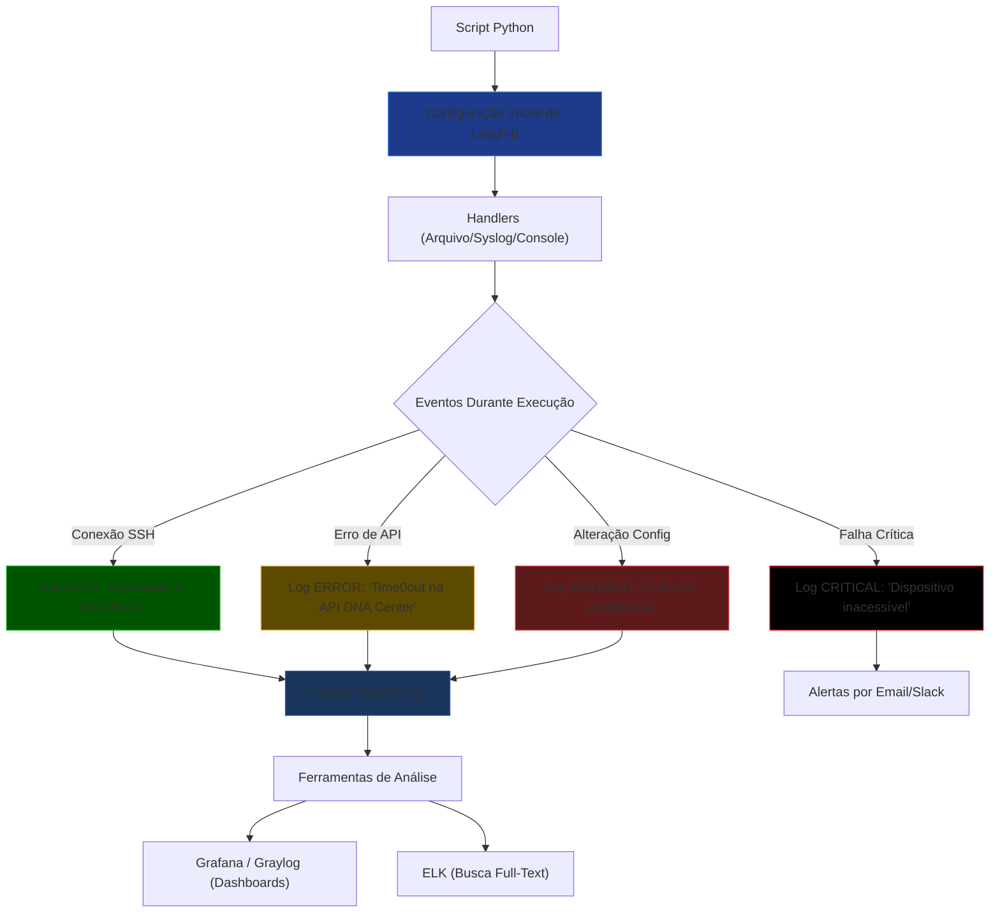
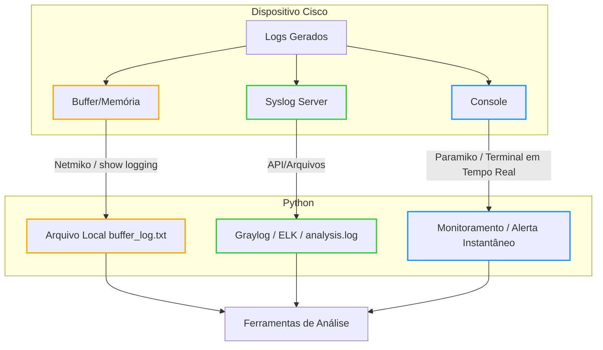

# Python - Básico 12

## Logging

## Sumário
- [Python - Básico 12](#python---básico-12)
  - [Logging](#logging)
  - [Sumário](#sumário)
    - [Por Que Logging é Essencial?](#por-que-logging-é-essencial)
    - [O que vamos estudar](#o-que-vamos-estudar)
    - [Fluxo de Automação](#fluxo-de-automação)
    - [Como Funciona o Logging em Python?](#como-funciona-o-logging-em-python)
  - [Breve revisão](#breve-revisão)
    - [SYSLOG em Dispositivos Cisco](#syslog-em-dispositivos-cisco)
    - [Níveis de Severidade Cisco (0-7):](#níveis-de-severidade-cisco-0-7)
    - [Correlação de Logs (Cisco + Python)](#correlação-de-logs-cisco--python)
    - [Logging para Troubleshooting](#logging-para-troubleshooting)
    - [Dicas de Ouro](#dicas-de-ouro)
    - [Destinos dos Logs em Dispositivos Cisco](#destinos-dos-logs-em-dispositivos-cisco)
  - [Exemplo de configuração completa:](#exemplo-de-configuração-completa)
  - [Quando o Python Entra em Ação?](#quando-o-python-entra-em-ação)
    - [Coleta de Logs em Dispositivos Cisco](#coleta-de-logs-em-dispositivos-cisco)
    - [Diferenças Entre `print()` e `logging` em Python](#diferenças-entre-print-e-logging-em-python)
      - [📌 **Quando Usar Cada Um**](#-quando-usar-cada-um)
      - [🚨 **Problemas com `print()` em Redes**](#-problemas-com-print-em-redes)
      - [✅ \*\*Vantagens do `logging` \*\*](#-vantagens-do-logging-)
  - [Exercícios](#exercícios)
  - [Exercício 01 — Log básico com print() x logging.info()](#exercício-01--log-básico-com-print-x-logginginfo)
  - [Exercício 02 — Log para arquivo .log](#exercício-02--log-para-arquivo-log)
  - [Exercício 03 — Estrutura de pastas de logs](#exercício-03--estrutura-de-pastas-de-logs)

### Por Que Logging é Essencial?

Em automação de redes, 90% dos problemas ocorrem em produção — conexões SSH falhas, APIs indisponíveis ou configurações inválidas.
Logging estruturado é sua "caixa preta" para:  

    🕵️‍♂️ Diagnosticar falhas que só acontecem em ambientes reais

    📜 Auditar mudanças em dispositivos de rede

    🔒 Cumprir requisitos de segurança

    🔄 Rollback inteligente com base em logs históricos

### O que vamos estudar

- Entender como o módulo logging do Python funciona
- Aprender os diferentes níveis de log e quando usá-los
- Criar logs em arquivos e integrar com outras ferramentas (Graylog, ELK, etc)
- Aplicar logs em scripts de automação de rede com Cisco e Linux

### Fluxo de Automação


  
**Legenda de Uso:**  

| Cor         | Nível de Log  | Quando Usar                                  |
|-------------|---------------|----------------------------------------------|
| 🟢 Verde    | INFO          | Conexões bem-sucedidas, eventos rotineiros   |
| 🟡 Amarelo  |	WARNING       | Configurações incomuns mas não críticas      |
| 🔴 Vermelho |	ERROR         | Falhas recuperáveis (ex: timeout SSH)        |
| ⚫ Preto    | CRITICAL      | Falhas que exigem ação imediata              |

### Como Funciona o Logging em Python?

O logging é o sistema padrão do Python para registrar eventos durante a execução de scripts. Em automação de redes, ele é essencial para:

    📌 Rastrear o fluxo de execução

    🔍 Depurar problemas

    📊 Auditar operações em dispositivos

1. **Componentes Principais**  

| Componente | Função                                     | Exemplo em Redes                            |
|------------|--------------------------------------------|---------------------------------------------| 
| Loggers    | Canais de registro (hierárquicos)          | logging.getLogger('network.ssh')            |
| Handlers   | Destinos dos logs (arquivo/console/syslog) | FileHandler('network.log')                  | 
| Formatters | Estrutura da mensagem (timestamp/nível)    | '%(asctime)s - %(levelname)s - %(message)s' |
| Filters    | Controle de quais logs são registrados     | filter=lambda record: 'VLAN' in record.msg  |

2. **Exemplo Prático (Configuração Básica)**

```Python
import logging

# 1. Configuração Inicial
logging.basicConfig(
    filename='network.log',          # Arquivo de saída
    level=logging.INFO,              # Nível mínimo para registrar
    format='%(asctime)s - %(levelname)s - %(message)s'
)

# 2. Uso em operações de rede
logging.info("Iniciando backup de configurações...")  # Mensagem informativa
logging.warning("VLAN 10 modificada manualmente")     # Alerta
logging.error("Falha na conexão SSH com 192.168.1.1") # Erro crítico
```

```Bash
Saída no network.log:
bash

2023-10-05 14:30:00 - INFO - Iniciando backup de configurações...
2023-10-05 14:31:22 - WARNING - VLAN 10 modificada manualmente
2023-10-05 14:32:15 - ERROR - Falha na conexão SSH com 192.168.1.1
```

3. **Níveis de Log (Hierarquia)**  

| Nível    | Quando Usar?	                         | Exemplo                                        |
|----------|-----------------------------------------|------------------------------------------------|
| DEBUG    | Detalhes internos (depuração)           | logging.debug("Enviando comando: 'show vlan'") |
| INFO     | Eventos normais                         | logging.info("Dispositivo reiniciado")         | 
| WARNING  | Situações anormais, mas recuperáveis    | logging.warning("Tempo de resposta alto")      | 
| ERROR    | Falhas em operações específicas         | logging.error("Timeout na API")                | 
| CRITICAL | Falhas graves (dispositivo inacessível) | logging.critical("Perda de conectividade")     |

**Observação sobre Sincronização de Tempo (NTP)**

Para que os logs sejam confiáveis em ambientes de rede (especialmente Cisco e Python), é essencial:

    Configurar NTP nos dispositivos e servidores:

```bash
! Exemplo mínimo em Cisco (CCNP ENCOR)
configure terminal
  ntp server 200.160.7.186  # Servidor NTP do NIC.br
  clock timezone GMT -3      # Fuso horário (ex: Brasil)
```

**Impacto no Logging:**

   - Logs sem sincronização temporal = dificuldade para correlacionar eventos (ex.: falhas em cadeia).

   - Exemplo real: Um log Python marcado às 14:30 e um log Cisco às 14:35 podem ser o mesmo evento com clocks desalinhados.  

**Dica para o CCNP ENCOR:**

    "Sempre verifique o NTP (show ntp status) antes de analisar logs em cenários de troubleshooting no exame."

## Breve revisão

### SYSLOG em Dispositivos Cisco

**Comandos Chave** 
    
```bash

! Configuração mínima para o exame:
configure terminal
  logging host 10.0.0.1              # Servidor de logs
  logging trap informational         # Nível 6 (INFO)
  logging source-interface Gig0/0    # Origem dos logs
  logging facility local7            # Facility padrão
end
```
   
### Níveis de Severidade Cisco (0-7):
    

| Nível  | Significado    |
|:------:|:--------------:|
| 0:     | Emergency      |    
| 1:     | Alert          |
| 2:     | Critical       |
| 3:     | Errors         |
| 4:     | Warnings       |
| 5:     | Notification   |
| 6:     | Informational  |
| 7:     | Debugging      |


### Correlação de Logs (Cisco + Python)

Exemplo Prático (um cenário clássico do CCNP):

```python

# Script Python para analisar logs de BGP
import logging
logging.basicConfig(filename='bgp_events.log', level=logging.INFO)

def analyze_bgp_log(log_line):
    if "%BGP-5-ADJCHANGE" in log_line:
        logging.warning(f"BGP neighbor change: {log_line}")
    elif "%BGP-3-BACKWARD" in log_line:
        logging.error(f"BGP route fluctuation: {log_line}")
```

**No Cisco:**

```bash

show logging | include %BGP  # Filtra logs BGP no dispositivo
```

### Logging para Troubleshooting 

- Cenários Comuns no CCNP ENCOR:
    
| Problema      | Log Cisco Típico              | Ação no Python                        |
|---------------|-------------------------------|---------------------------------------|
| Falha OSPF    | Adjacency	%OSPF-5-ADJCHG	    | logging.error("OSPF neighbor down")   | 
| STP Loops     | %SPANTREE-7-RECV_1Q_NON_TRUNK | logging.critical("STP loop detected") |
| HSRP Failover | %HSRP-6-STATECHANGE           | logging.info("HSRP active change")    |

### Dicas de Ouro 

- Comandos para Aprender:
    
```bash
show logging                # Exibe logs armazenados no dispositivo
show logging | begin Mar 1  # Filtra por data
terminal monitor            # Exibe logs em tempo real no console  

> - O comando `logging trap debugging` (nível 7) é útil em labs, mas evite em produção devido ao volume de logs.  
> - Em questões de troubleshooting, priorize `show logging | include %ERROR` para filtrar falhas graves.
```

- Armadilhas Comuns:

**Logs não aparecem? Verifique:**

```bash
show logging status     # Confira se o logging está ativo
show clock              # Horário incorreto afeta a ordem dos logs
```

**"Por que os logs não aparecem no servidor Syslog?"**
        
Causas possíveis:

  - Nível de severidade incorreto (logging trap).

  - Bloqueio de porta UDP 514 (firewall).

  - Fonte incorreta (logging source-interface).

**OBS:** antes de avançarmos, precisamos entender onde os logs são armazenados para podermos utilizar algum script python.  

### Destinos dos Logs em Dispositivos Cisco

Os logs podem ser enviados para múltiplos destinos simultaneamente (configuráveis via CLI):  

| Destino         | Comando Cisco           | Vantagens                         | Limitações                     |
|-----------------|-------------------------|-----------------------------------|--------------------------------|
| Console         | logging console <nível> | Útil para troubleshooting local   | Não armazena histórico         |
| Buffer (RAM)    | logging buffered <size> | Armazena logs temporariamente     | Limite de espaço               |
| Servidor Syslog | logging host <IP>       | Armazenamento centralizado        | Requer conectividade           |
| Arquivo Local   | logging file <path>     | Disponível em alguns dispositivos | Consome storage do dispositivo |

## Exemplo de configuração completa:

```bash

configure terminal
  logging console 6           # Exibe logs no console (nível 6 = informational)
  logging buffered 16384      # Armazena 16KB de logs na RAM
  logging host 192.168.1.100  # Envia para servidor Syslog (Graylog/ELK)
end
```

## Quando o Python Entra em Ação?

O script Python pode atuar em três momentos distintos:

- **Cenário 1:** Coleta de Logs do Buffer/Console (Sem Servidor Syslog)

    Como funciona:

        O Python se conecta via SSH (Paramiko/Netmiko) e executa show logging para ler logs do buffer.

        Problema: Logs antigos são perdidos se o buffer estiver cheio.

- **Cenário 2:** Análise de Logs em um Servidor Syslog (Graylog/ELK)

    Como funciona:

        Os dispositivos enviam logs para o servidor (ex: Graylog) via logging host.

        O Python consome os logs do servidor (API/arquivos) para análise.

- **Cenário 3:** Captura em Tempo Real (Terminal)

    Como funciona:

        O Python pode simular um terminal (ex: usando paramiko.invoke_shell()) para capturar logs enquanto são exibidos no console.

        Uso típico: Monitorar eventos específicos (ex: falhas de interface).

**Obs:**

- Se o equipamento está configurado para enviar logs a um servidor (Graylog):

    > O Python não precisa acessar o dispositivo diretamente (a menos que queira executar comandos adicionais).

    > Basta analisar os logs no servidor (via API ou arquivos).

- Se quiser garantir redundância:

```bash

! Configure ambos no dispositivo:
logging host 192.168.1.100   # Graylog
logging buffered 16384       # Backup local
```

### Coleta de Logs em Dispositivos Cisco  
1. **Logs Locais (Buffer)**:  
   - Use `show logging` via Python + Netmiko.  
   - Limitado pelo tamanho do buffer.  

2. **Servidor Syslog (Graylog/ELK)**:  
   - Python lê via API ou arquivos.  
   - Ideal para análise centralizada.  

3. **Console/Terminal**:  
   - Python pode capturar em tempo real com Paramiko.  
   - Útil para monitoramento ativo.  



> **Atenção**: Nunca armazene senhas em código. Use variáveis de ambiente ou arquivos `.env` ou cofre de senhas.

### Diferenças Entre `print()` e `logging` em Python

| Característica               | `print()`                            | `logging`                                                                 |
|------------------------------|--------------------------------------|---------------------------------------------------------------------------|
| **Propósito**                | Saída simples para console           | Registro estruturado de eventos com severidade                            |
| **Níveis de Severidade**     | Não possui                           | Possui (DEBUG, INFO, WARNING, ERROR, CRITICAL)                            |
| **Formatação**               | Manual (f-strings, .format())        | Automática via `Formatters` (`%(asctime)s - %(levelname)s - %(message)s`) |
| **Destinos de Saída**        | Apenas console                       | Múltiplos (arquivo, console, syslog, email) via `Handlers`                |
| **Performance**              | Mais rápido (para debug pontual)     | Leve overhead (justificável em produção)                                  |
| **Uso em Produção**          | Não recomendado                      | Essencial para troubleshooting e auditoria                                |
| **Exemplo em Redes**         | `print("Conectado a", device_ip)`    | `logging.info(f"Conectado a {device_ip}")`                                |


#### 📌 **Quando Usar Cada Um**

1. **`print()`**  
   - Debug rápido durante o desenvolvimento.  
   - Exemplo:  
     ```python
     print(f"Tentando conectar a {device_ip}...")  # Remove após testes
     ```

2. **`logging`**  
   - Automação de redes e scripts em produção.  
   - Exemplo :  
     ```python
     import logging
     logging.basicConfig(
         filename='network.log',
         level=logging.INFO,
         format='%(asctime)s - %(levelname)s - %(message)s'
     )
     try:
         connection = ConnectHandler(**device)
         logging.info(f"SSH estabelecido com {device['host']}")
     except NetmikoTimeoutException:
         logging.error(f"Timeout em {device['host']}")
     ```

#### 🚨 **Problemas com `print()` em Redes**
- **Perda de contexto**: Sem timestamps ou níveis de severidade.  
- **Inviável em escala**: Não filtra mensagens por importância.  
- **Sem persistência**: Não salva em arquivo por padrão.  

#### ✅ **Vantagens do `logging` **
1. **Correlação de Eventos**:  
```bash
   2023-10-05 14:30:00 - INFO - Conectado a 192.168.1.1  
   2023-10-05 14:31:22 - ERROR - Timeout SSH em 192.168.1.1
```

## Exercícios

## Exercício 01 — Log básico com print() x logging.info()

**OBJETIVO:** Demonstrar as diferenças fundamentais entre saídas simples (`print()`) e logs estruturados (`logging`), aplicáveis a cenários de redes Cisco.

**print_logging.py**

```Python
# Exemplo 01 — Log básico com print() x logging.info()

import logging

# Configuração básica do logging (terminal + formato)
logging.basicConfig(
    level=logging.INFO,
    format='%(asctime)s - %(levelname)s - %(message)s',
    handlers=[logging.StreamHandler()]  # Saída no terminal
)

print("=== DEMONSTRAÇÃO PRINT() VS LOGGING ===")

# Cenário: Conexão SSH simulada
device_ip = "192.168.1.1"

# Método 1: Usando print()
print(f"[Simples] Tentando conectar a {device_ip}...")
print(f"[Simples] Conexão SSH estabelecida com {device_ip}")

# Método 2: Usando logging
logging.debug(f"DEBUG: Mensagem invisível (nível configurado como INFO)")  # Não será exibido
logging.info(f"Conectando a {device_ip}...")
logging.warning(f"Conexão estabelecida com {device_ip} (nível WARNING como exemplo)")

print("\n=== ANÁLISE ===")
print("Observe como logging oferece:")
print("- Timestamp automático")
print("- Nível de severidade")
print("- Formatação consistente")
```
   
**Saída**

```Bash
alcancil@linux:~/automacoes/logging/01$ python3 -m venv venv
alcancil@linux:~/automacoes/logging/01$ source venv/bin/activate
(venv) alcancil@linux:~/automacoes/logging/01$ python3 print_logging.py 
=== DEMONSTRAÇÃO PRINT() VS LOGGING ===
[Simples] Tentando conectar a 192.168.1.1...
[Simples] Conexão SSH estabelecida com 192.168.1.1
2025-06-20 15:50:30,082 - INFO - Conectando a 192.168.1.1...
2025-06-20 15:50:30,082 - WARNING - Conexão estabelecida com 192.168.1.1 (nível WARNING como exemplo)

=== ANÁLISE ===
Observe como logging oferece:
- Timestamp automático
- Nível de severidade
- Formatação consistente
(venv) alcancil@linux:~/automacoes/logging/01$ 
```

**Boas práticas:**

```python

# ❌ Frágil (não use em scripts de rede)
print("Interface Gig0/1 down!")

# ✅ Profissional (CCNP-style)
logging.error("Interface Gig0/1 down - Verificar BGP/STP")
```

## Exercício 02 — Log para arquivo .log

    Redirecionar os logs para automacao.log

    Definir nível DEBUG e mostrar logs de todos os tipos

    Analisar conteúdo do arquivo com cat e grep

**OBJETIVO:** Redirecionar logs estruturados para um arquivo `automacao.log` com nível `DEBUG`, demonstrando análise em diferentes sistemas operacionais.

**arquivo_log_universal.py**

```Python
[01] import logging
[02] import platform
[03] 
[04] logging.basicConfig(
[05]     filename='automacao.log',
[06]     level=logging.DEBUG,
[07]     format='%(asctime)s | %(levelname)-8s | %(message)s'
[08] )
[09] 
[10] # Logs de exemplo
[11] logging.debug("Debug: Configuração carregada")
[12] logging.info(f"SO detectado: {platform.system()}")
[13] logging.warning("Alerta: CPU acima de 80%")
[14] logging.error("Erro: Timeout na conexão SSH")
[15] logging.critical("CRÍTICO: Dispositivo offline")
```

**analise_linux.py**

```Python
[01] def analisar_log():
[02]     with open('automacao.log', 'r') as f:
[03]         linhas = f.readlines()
[04]     
[05]     print("\n=== ERROS CRÍTICOS ===")
[06]     [print(l.strip()) for l in linhas if "CRITICAL" in l]
[07]     
[08]     print("\n=== RESUMO ===")
[09]     niveis = ["DEBUG", "INFO", "WARNING", "ERROR", "CRITICAL"]
[10]     for nivel in niveis:
[11]         qtd = sum(1 for linha in linhas if f"| {nivel}" in linha)
[12]         print(f"{nivel}: {qtd} ocorrências")
[13] 
[14] if __name__ == "__main__":
[15]     analisar_log()
```

**analise_windows.py**

```Python
[01] def analisar_log():
[02]     with open('automacao.log', 'r') as f:
[03]         linhas = f.readlines()
[04]     
[05]     print("\n--- ERROS CRÍTICOS ---")
[06]     [print(l.strip()) for l in linhas if "CRITICAL" in l]
[07]     
[08]     print("\n--- RESUMO ---")
[09]     from collections import defaultdict
[10]     contador = defaultdict(int)
[11]     
[12]     for linha in linhas:
[13]         if "| DEBUG" in linha: contador["DEBUG"] += 1
[14]         elif "| INFO" in linha: contador["INFO"] += 1
[15]         elif "| WARNING" in linha: contador["WARNING"] += 1
[16]         elif "| ERROR" in linha: contador["ERROR"] += 1
[17]         elif "| CRITICAL" in linha: contador["CRITICAL"] += 1
[18]    
[19]     for nivel, qtd in contador.items():
[20]         print(f"{nivel}: {qtd} ocorrência(s)")
[21]
[22] if __name__ == "__main__":
[23]     analisar_log()
```

**Como utilizar?**  

- python3 arquivo_log_universal.py  # Gera o log
- python3 analise_linux.py          # Analisa o log
- python arquivo_log_universal.py   # Gera o log
- python analise_windows.py         # Analisa o log


**Saída**

```bash
alcancil@linux:~/automacoes/logging/02$ python3 -m venv venv
alcancil@linux:~/automacoes/logging/02$ source venv/bin/activate
(venv) alcancil@linux:~/automacoes/logging/02$ python3 arquivo_log_universal.py 
```

**OBS:** como primeiro geramos o log em um arquivo de log, vou mostrar o formato e conteúdo do arquivo

```Bash
(venv) alcancil@linux:~/automacoes/logging/02$ ls -la
total 28
drwxrwxr-x 3 alcancil alcancil 4096 jun 21 14:37 .
drwxrwxr-x 4 alcancil alcancil 4096 jun 21 14:31 ..
-rw-r--r-- 1 root     root      477 jun 21 14:33 analise_linux.py
-rw-r--r-- 1 root     root      758 jun 21 14:34 analise_windows.py
-rw-r--r-- 1 root     root      427 jun 21 14:32 arquivo_log_universal.py
-rw-rw-r-- 1 alcancil alcancil  322 jun 21 14:36 automacao.log
drwxrwxr-x 5 alcancil alcancil 4096 jun 21 14:35 venv
(venv) alcancil@linux:~/automacoes/logging/02$ cat automacao.log 
2025-06-21 14:36:08,931 | DEBUG    | Debug: Configuração carregada
2025-06-21 14:36:08,931 | INFO     | SO detectado: Linux
2025-06-21 14:36:08,931 | WARNING  | Alerta: CPU acima de 80%
2025-06-21 14:36:08,931 | ERROR    | Erro: Timeout na conexão SSH
2025-06-21 14:36:08,931 | CRITICAL | CRÍTICO: Dispositivo offline
(venv) alcancil@linux:~/automacoes/logging/02$ 
```

- Agora vamos realizar a análise como script

```Bash
(venv) alcancil@linux:~/automacoes/logging/02$ python3 analise_linux.py 

=== ERROS CRÍTICOS ===
2025-06-21 14:36:08,931 | CRITICAL | CRÍTICO: Dispositivo offline

=== RESUMO ===
DEBUG: 1 ocorrências
INFO: 1 ocorrências
WARNING: 1 ocorrências
ERROR: 1 ocorrências
CRITICAL: 1 ocorrências
```

**Explicação**

**arquivo_log_universal.py**

```Python
Bloco 1: Importações

[01] import logging                                            # Importa o módulo de logging padrão do Python para geração de logs
[02] import platform                                           # Importa o módulo para obter informações do sistema operacional

Bloco 2: Configuração Básica do Logging

[04] logging.basicConfig(                                       # Função para configuração básica do sistema de logs
[05]     filename='automacao.log',                              # Especifica o arquivo onde os logs serão salvos
[06]     level=logging.DEBUG,                                   # Define o nível mínimo de log para DEBUG (captura todos)
[07]     format='%(asctime)s | %(levelname)-8s | %(message)s'   # Formato das mensagens:
                                                                # - %(asctime)s: Data/hora
                                                                # - %(levelname)-8s: Nível do log (alinhado em 8 chars)
                                                                # - %(message)s: Mensagem do log
[08] )

Bloco 3: Geração de Logs de Exemplo

[10] # Logs de exemplo
[11] logging.debug("Debug: Configuração carregada")             # Mensagem de DEBUG (nível mais baixo, para detalhes)
[12] logging.info(f"SO detectado: {platform.system()}")         # Mensagem INFO (informações gerais)
[13] logging.warning("Alerta: CPU acima de 80%")                # Mensagem WARNING (alerta sobre problemas não críticos)
[14] logging.error("Erro: Timeout na conexão SSH")              # Mensagem ERROR (erros que afetam funcionalidades)
[15] logging.critical("CRÍTICO: Dispositivo offline")           # Mensagem CRITICAL (falhas graves que exigem ação imediata)
```

**analise_linux.py**

```Python

```

## Exercício 03 — Estrutura de pastas de logs

**Objetivo:** Criar um sistema de logs organizado por tipo de tarefa em automação de redes.

📂 Estrutura Final do Projeto

```bash

automacoes/
└── logging/
    03/
       ├── logs/ 
       │        ├── vlan.log
       │        ├── usuario.log
       │        └── sistema.log
       └── rede.py
```
 
**rede.py**

```python

[01] import logging
[02] import os
[03] from datetime import datetime
[04]
[05] # 1. Criar pasta 'logs' se não existir
[06] os.makedirs('logs', exist_ok=True)
[07]
[08] # 2. Configuração base
[09] def setup_logger(name, log_file, level=logging.INFO):
[10]     """Cria um logger customizado para cada tipo de tarefa"""
[11]     
[12]     # Cria o logger
[13]     logger = logging.getLogger(name)
[14]     logger.setLevel(level)
[15]     
[16]     # Formatação profissional
[17]     formatter = logging.Formatter(
[18]         '%(asctime)s | %(name)s | %(levelname)s | %(message)s',
[19]         datefmt='%Y-%m-%d %H:%M:%S'
[20]     )
[21]     
[22]     # Handler para arquivo
[23]     file_handler = logging.FileHandler(f'logs/{log_file}')
[24]     file_handler.setFormatter(formatter)
[25]     
[26]     logger.addHandler(file_handler)
[27]     
[28]     return logger
[29] 
[30] # 3. Loggers específicos (exemplo para VLANs)
[31] logger_vlan = setup_logger('vlan', 'vlan.log')
[32] logger_usuario = setup_logger('usuario', 'usuario.log')
[33] logger_sistema = setup_logger('sistema', 'sistema.log', logging.DEBUG)
[34]
[35] # --- Exemplos de uso ---
[36]
[37] # 4. Simulação de automação de VLAN
[38] def configurar_vlan(vlan_id, nome):
[39]     try:
[40]         logger_vlan.info(f"Iniciando configuração da VLAN {vlan_id}")
[41]         # Lógica fictícia (substitua por netmiko/ansible depois)
[42]         if not nome:
[43]             raise ValueError("Nome da VLAN vazio")
[44]             
[45]         logger_vlan.debug(f"Parâmetros: ID={vlan_id}, Nome={nome}")
[46]         logger_vlan.info(f"VLAN {vlan_id} ({nome}) configurada com sucesso")
[47]         
[48]     except Exception as e:
[49]         logger_vlan.error(f"Falha na VLAN {vlan_id}: {str(e)}", exc_info=True)
[50] 
[51] # 5. Testando
[52] if __name__ == "__main__":
[53]     configurar_vlan(10, "GERENCIA")
[54]     configurar_vlan(20, "")  # Forçar erro
[55]     logger_usuario.warning("Usuário 'admin' fez login fora do horário comercial")
[56]     logger_sistema.debug("Memória utilizada: 45%")
```

**Saída**

**vlan.log***

```Bash
alcancil@linux:~/automacoes/logging/03$ python3 -m venv venv
alcancil@linux:~/automacoes/logging/03$ source venv/bin/activate
(venv) alcancil@linux:~/automacoes/logging/03$ python3 rede.py 
(venv) alcancil@linux:~/automacoes/logging/03$ ls
logs  rede.py  venv
(venv) alcancil@linux:~/automacoes/logging/03$ cd logs
(venv) alcancil@linux:~/automacoes/logging/03/logs$ ls
sistema.log  usuario.log  vlan.log
(venv) alcancil@linux:~/automacoes/logging/03/logs$ cat sistema.log 
2025-06-22 17:22:58 | sistema | DEBUG | Memória utilizada: 45%
(venv) alcancil@linux:~/automacoes/logging/03/logs$ cat usuario.log 
2025-06-22 17:22:58 | usuario | WARNING | Usuário 'admin' fez login fora do horário comercial
(venv) alcancil@linux:~/automacoes/logging/03/logs$ cat vlan.log 
2025-06-22 17:22:58 | vlan | INFO | Iniciando configuração da VLAN 10
2025-06-22 17:22:58 | vlan | INFO | VLAN 10 (GERENCIA) configurada com sucesso
2025-06-22 17:22:58 | vlan | INFO | Iniciando configuração da VLAN 20
2025-06-22 17:22:58 | vlan | ERROR | Falha na VLAN 20: Nome da VLAN vazio
Traceback (most recent call last):
  File "/home/alcancil/automacoes/logging/03/rede.py", line 43, in configurar_vlan
    raise ValueError("Nome da VLAN vazio")
ValueError: Nome da VLAN vazio
(venv) alcancil@linux:~/automacoes/logging/03/logs$ 
```

**Explicação**

```Python
Bloco 1: Importações

[01] import logging                                                                    # Biblioteca padrão para geração de logs
[02] import os                                                                         # Para operações com sistema de arquivos
[03] from datetime import datetime                                                     # Para manipulação de datas/horas (usado indiretamente pelo logging)

Bloco 2: Criação da Pasta de Logs

[05] # 1. Criar pasta 'logs' se não existir
[06] os.makedirs('logs', exist_ok=True)                                                 # Cria diretório 'logs' caso não exista (evita erros)
                                                                                        # 'exist_ok=True' ignora se pasta já existir

Bloco 3: Configuração Base do Logger

[08] # 2. Configuração base
[09] def setup_logger(name, log_file, level=logging.INFO):                              # Define função para criar loggers customizados
[10]     """Cria um logger customizado para cada tipo de tarefa"""                      # Docstring explicativa
[11]     
[12]     # Cria o logger
[13]     logger = logging.getLogger(name)                                               # Obtém ou cria um logger com o nome especificado
[14]     logger.setLevel(level)                                                         # Define nível mínimo de log (INFO por padrão)
[15]     
[16]     # Formatação profissional
[17]     formatter = logging.Formatter(                                                 # Cria formatador para as mensagens
[18]         '%(asctime)s | %(name)s | %(levelname)s | %(message)s',                    # Padrão: data+hora | nome | nível | mensagem
[19]         datefmt='%Y-%m-%d %H:%M:%S'                                                # Formato da data: '2023-08-22 14:30:00'
[20]     )
[21]     
[22]     # Handler para arquivo
[23]     file_handler = logging.FileHandler(f'logs/{log_file}')                         # Cria handler para gravar em arquivo
[24]     file_handler.setFormatter(formatter)                                           # Aplica formatação ao handler
[25]     
[26]     logger.addHandler(file_handler)                                                # Adiciona o handler ao logger
[27]     
[28]     return logger                                                                  # Retorna o logger configurado

Bloco 4: Criação dos Loggers Específicos

[30] # 3. Loggers específicos (exemplo para VLANs)
[31] logger_vlan = setup_logger('vlan', 'vlan.log')                                     # Logger para operações de VLAN (nível INFO)
[32] logger_usuario = setup_logger('usuario', 'usuario.log')                            # Logger para ações de usuário
[33] logger_sistema = setup_logger('sistema', 'sistema.log', logging.DEBUG)             # Logger para sistema (nível DEBUG)

Bloco 5: Função de Exemplo (VLAN)

[37] # 4. Simulação de automação de VLAN
[38] def configurar_vlan(vlan_id, nome):                                                # Função exemplo para configuração de VLAN
[39]     try:
[40]         logger_vlan.info(f"Iniciando configuração da VLAN {vlan_id}")              # Log nível INFO
[41]         # Lógica fictícia (substitua por netmiko/ansible depois)
[42]         if not nome:
[43]             raise ValueError("Nome da VLAN vazio")                                 # Força erro se nome estiver vazio
[44]             
[45]         logger_vlan.debug(f"Parâmetros: ID={vlan_id}, Nome={nome}")                # Log nível DEBUG (só aparece se configurado)
[46]         logger_vlan.info(f"VLAN {vlan_id} ({nome}) configurada com sucesso")       # Log de sucesso
[47]         
[48]     except Exception as e:
[49]         logger_vlan.error(f"Falha na VLAN {vlan_id}: {str(e)}", exc_info=True)     # Log de erro com stack trace

Bloco 6: Teste dos Loggers

[51] # 5. Testando
[52] if __name__ == "__main__":                                                         # Executa apenas se o script for rodado diretamente
[53]     configurar_vlan(10, "GERENCIA")                                                # Caso de sucesso
[54]     configurar_vlan(20, "")                                                        # Caso de erro (nome vazio)
[55]     logger_usuario.warning("Usuário 'admin' fez login fora do horário comercial")  # Log nível WARNING
[56]     logger_sistema.debug("Memória utilizada: 45%")                                 # Log nível DEBUG (só aparece no sistema.log)
```

**🔍 Explicação dos Conceitos**

    logging.getLogger()

        Cria loggers independentes para cada módulo/tarefa

        Evita poluição entre logs de VLANs, usuários, etc.

    FileHandler

        Direciona logs para arquivos específicos

        Permite rotação (ex: 1 arquivo por dia)

    Níveis de Log

        DEBUG: Detalhes técnicos (ex: parâmetros exatos)

        INFO: Eventos normais (ex: configuração aplicada)

        WARNING: Comportamentos incomuns

        ERROR: Falhas recuperáveis


---
Continuar


🔹 Exercício 04 — Logs por data (log rotation manual)

    Gerar um log que inclui data no nome: logs/backup_2024-06-11.log

    Mostrar como isso ajuda a organizar execuções por dia

🔹 Exercício 05 — Simular erro capturado via logging.exception()

    Criar erro com try/except e gravar com logging.exception()

    Simular falha de conexão a dispositivo e logar a stack trace

🔹 Exercício 06 — Logs formatados e personalizados

    Personalizar o formato do log: [%(asctime)s] [%(levelname)s] - %(message)s

    Mostrar log com data/hora, tipo de log e mensagem

    Importante para quando for visualizar logs no Graylog futuramente

🔹 Exercício 07 — Integração com múltiplos arquivos Python

    Criar um script principal e um módulo auxiliar (utils.py)

    Usar logging em ambos e centralizar a configuração

