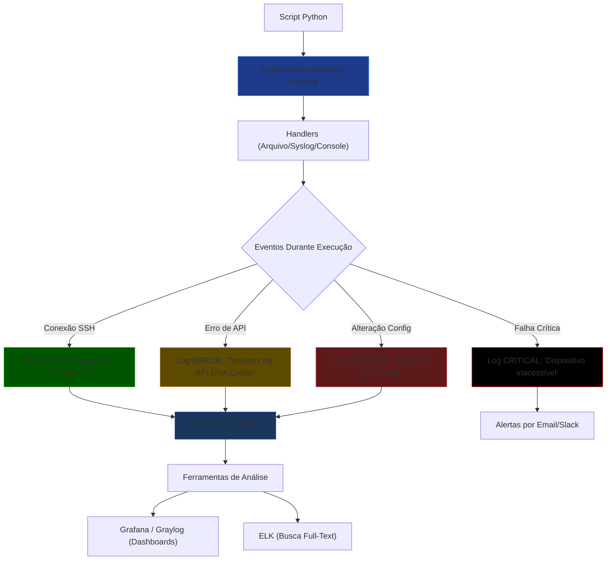
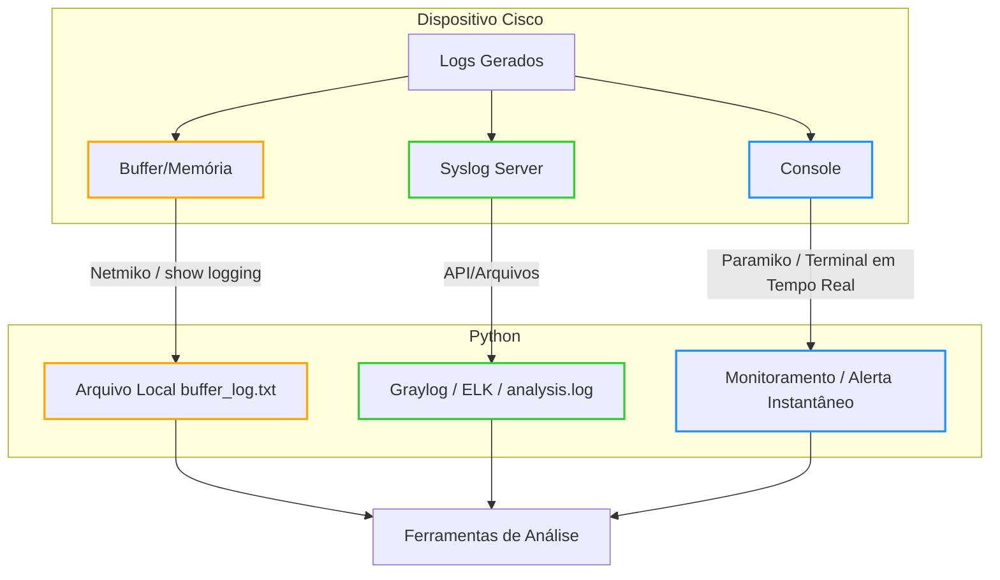

# Python - Básico 12

## Logging

## Sumário
- [Python - Básico 12](#python---básico-12)
  - [Logging](#logging)
  - [Sumário](#sumário)
    - [Por Que Logging é Essencial?](#por-que-logging-é-essencial)
    - [O que vamos estudar](#o-que-vamos-estudar)
    - [Fluxo de Automação](#fluxo-de-automação)
    - [Como Funciona o Logging em Python?](#como-funciona-o-logging-em-python)
  - [Breve revisão](#breve-revisão)
    - [SYSLOG em Dispositivos Cisco](#syslog-em-dispositivos-cisco)
    - [Níveis de Severidade Cisco (0-7):](#níveis-de-severidade-cisco-0-7)
    - [Correlação de Logs (Cisco + Python)](#correlação-de-logs-cisco--python)
    - [Logging para Troubleshooting](#logging-para-troubleshooting)
    - [Dicas de Ouro](#dicas-de-ouro)
    - [Destinos dos Logs em Dispositivos Cisco](#destinos-dos-logs-em-dispositivos-cisco)
  - [Exemplo de configuração completa:](#exemplo-de-configuração-completa)
  - [Quando o Python Entra em Ação?](#quando-o-python-entra-em-ação)
    - [Coleta de Logs em Dispositivos Cisco](#coleta-de-logs-em-dispositivos-cisco)
    - [Diferenças Entre `print()` e `logging` em Python](#diferenças-entre-print-e-logging-em-python)
      - [📌 **Quando Usar Cada Um**](#-quando-usar-cada-um)
      - [🚨 **Problemas com `print()` em Redes**](#-problemas-com-print-em-redes)
      - [✅ \*\*Vantagens do `logging` \*\*](#-vantagens-do-logging-)
  - [Exercícios ( Exemplos )](#exercícios--exemplos-)
  - [Exemplo 01 — Log básico com print() x logging.info()](#exemplo-01--log-básico-com-print-x-logginginfo)

### Por Que Logging é Essencial?

Em automação de redes, 90% dos problemas ocorrem em produção — conexões SSH falhas, APIs indisponíveis ou configurações inválidas.
Logging estruturado é sua "caixa preta" para:  

    🕵️‍♂️ Diagnosticar falhas que só acontecem em ambientes reais

    📜 Auditar mudanças em dispositivos de rede

    🔒 Cumprir requisitos de segurança

    🔄 Rollback inteligente com base em logs históricos

### O que vamos estudar

- Entender como o módulo logging do Python funciona
- Aprender os diferentes níveis de log e quando usá-los
- Criar logs em arquivos e integrar com outras ferramentas (Graylog, ELK, etc)
- Aplicar logs em scripts de automação de rede com Cisco e Linux

### Fluxo de Automação


  
**Legenda de Uso:**  

| Cor         | Nível de Log  | Quando Usar                                  |
|-------------|---------------|----------------------------------------------|
| 🟢 Verde    | INFO          | Conexões bem-sucedidas, eventos rotineiros   |
| 🟡 Amarelo  |	WARNING       | Configurações incomuns mas não críticas      |
| 🔴 Vermelho |	ERROR         | Falhas recuperáveis (ex: timeout SSH)        |
| ⚫ Preto    | CRITICAL      | Falhas que exigem ação imediata              |

### Como Funciona o Logging em Python?

O logging é o sistema padrão do Python para registrar eventos durante a execução de scripts. Em automação de redes, ele é essencial para:

    📌 Rastrear o fluxo de execução

    🔍 Depurar problemas

    📊 Auditar operações em dispositivos

1. **Componentes Principais**  

| Componente | Função                                     | Exemplo em Redes                            |
|------------|--------------------------------------------|---------------------------------------------| 
| Loggers    | Canais de registro (hierárquicos)          | logging.getLogger('network.ssh')            |
| Handlers   | Destinos dos logs (arquivo/console/syslog) | FileHandler('network.log')                  | 
| Formatters | Estrutura da mensagem (timestamp/nível)    | '%(asctime)s - %(levelname)s - %(message)s' |
| Filters    | Controle de quais logs são registrados     | filter=lambda record: 'VLAN' in record.msg  |

2. **Exemplo Prático (Configuração Básica)**

```Python
import logging

# 1. Configuração Inicial
logging.basicConfig(
    filename='network.log',          # Arquivo de saída
    level=logging.INFO,              # Nível mínimo para registrar
    format='%(asctime)s - %(levelname)s - %(message)s'
)

# 2. Uso em operações de rede
logging.info("Iniciando backup de configurações...")  # Mensagem informativa
logging.warning("VLAN 10 modificada manualmente")     # Alerta
logging.error("Falha na conexão SSH com 192.168.1.1") # Erro crítico
```

```Bash
Saída no network.log:
bash

2023-10-05 14:30:00 - INFO - Iniciando backup de configurações...
2023-10-05 14:31:22 - WARNING - VLAN 10 modificada manualmente
2023-10-05 14:32:15 - ERROR - Falha na conexão SSH com 192.168.1.1
```

3. **Níveis de Log (Hierarquia)**  

| Nível    | Quando Usar?	                         | Exemplo                                        |
|----------|-----------------------------------------|------------------------------------------------|
| DEBUG    | Detalhes internos (depuração)           | logging.debug("Enviando comando: 'show vlan'") |
| INFO     | Eventos normais                         | logging.info("Dispositivo reiniciado")         | 
| WARNING  | Situações anormais, mas recuperáveis    | logging.warning("Tempo de resposta alto")      | 
| ERROR    | Falhas em operações específicas         | logging.error("Timeout na API")                | 
| CRITICAL | Falhas graves (dispositivo inacessível) | logging.critical("Perda de conectividade")     |

**Observação sobre Sincronização de Tempo (NTP)**

Para que os logs sejam confiáveis em ambientes de rede (especialmente Cisco e Python), é essencial:

    Configurar NTP nos dispositivos e servidores:

```bash
! Exemplo mínimo em Cisco (CCNP ENCOR)
configure terminal
  ntp server 200.160.7.186  # Servidor NTP do NIC.br
  clock timezone GMT -3      # Fuso horário (ex: Brasil)
```

**Impacto no Logging:**

   - Logs sem sincronização temporal = dificuldade para correlacionar eventos (ex.: falhas em cadeia).

   - Exemplo real: Um log Python marcado às 14:30 e um log Cisco às 14:35 podem ser o mesmo evento com clocks desalinhados.  

**Dica para o CCNP ENCOR:**

    "Sempre verifique o NTP (show ntp status) antes de analisar logs em cenários de troubleshooting no exame."

## Breve revisão

### SYSLOG em Dispositivos Cisco

**Comandos Chave** 
    
```bash

! Configuração mínima para o exame:
configure terminal
  logging host 10.0.0.1              # Servidor de logs
  logging trap informational         # Nível 6 (INFO)
  logging source-interface Gig0/0    # Origem dos logs
  logging facility local7            # Facility padrão
end
```
   
### Níveis de Severidade Cisco (0-7):
    

| Nível  | Significado    |
|:------:|:--------------:|
| 0:     | Emergency      |    
| 1:     | Alert          |
| 2:     | Critical       |
| 3:     | Errors         |
| 4:     | Warnings       |
| 5:     | Notification   |
| 6:     | Informational  |
| 7:     | Debugging      |


### Correlação de Logs (Cisco + Python)

Exemplo Prático (um cenário clássico do CCNP):

```python

# Script Python para analisar logs de BGP
import logging
logging.basicConfig(filename='bgp_events.log', level=logging.INFO)

def analyze_bgp_log(log_line):
    if "%BGP-5-ADJCHANGE" in log_line:
        logging.warning(f"BGP neighbor change: {log_line}")
    elif "%BGP-3-BACKWARD" in log_line:
        logging.error(f"BGP route fluctuation: {log_line}")
```

**No Cisco:**

```bash

show logging | include %BGP  # Filtra logs BGP no dispositivo
```

### Logging para Troubleshooting 

- Cenários Comuns no CCNP ENCOR:
    
| Problema      | Log Cisco Típico              | Ação no Python                        |
|---------------|-------------------------------|---------------------------------------|
| Falha OSPF    | Adjacency	%OSPF-5-ADJCHG	    | logging.error("OSPF neighbor down")   | 
| STP Loops     | %SPANTREE-7-RECV_1Q_NON_TRUNK | logging.critical("STP loop detected") |
| HSRP Failover | %HSRP-6-STATECHANGE           | logging.info("HSRP active change")    |

### Dicas de Ouro 

- Comandos para Aprender:
    
```bash
show logging                # Exibe logs armazenados no dispositivo
show logging | begin Mar 1  # Filtra por data
terminal monitor            # Exibe logs em tempo real no console  

> - O comando `logging trap debugging` (nível 7) é útil em labs, mas evite em produção devido ao volume de logs.  
> - Em questões de troubleshooting, priorize `show logging | include %ERROR` para filtrar falhas graves.
```

- Armadilhas Comuns:

**Logs não aparecem? Verifique:**

```bash
show logging status     # Confira se o logging está ativo
show clock              # Horário incorreto afeta a ordem dos logs
```

**"Por que os logs não aparecem no servidor Syslog?"**
        
Causas possíveis:

  - Nível de severidade incorreto (logging trap).

  - Bloqueio de porta UDP 514 (firewall).

  - Fonte incorreta (logging source-interface).

**OBS:** antes de avançarmos, precisamos entender onde os logs são armazenados para podermos utilizar algum script python.  

### Destinos dos Logs em Dispositivos Cisco

Os logs podem ser enviados para múltiplos destinos simultaneamente (configuráveis via CLI):  

| Destino         | Comando Cisco           | Vantagens                         | Limitações                     |
|-----------------|-------------------------|-----------------------------------|--------------------------------|
| Console         | logging console <nível> | Útil para troubleshooting local   | Não armazena histórico         |
| Buffer (RAM)    | logging buffered <size> | Armazena logs temporariamente     | Limite de espaço               |
| Servidor Syslog | logging host <IP>       | Armazenamento centralizado        | Requer conectividade           |
| Arquivo Local   | logging file <path>     | Disponível em alguns dispositivos | Consome storage do dispositivo |

## Exemplo de configuração completa:

```bash

configure terminal
  logging console 6           # Exibe logs no console (nível 6 = informational)
  logging buffered 16384      # Armazena 16KB de logs na RAM
  logging host 192.168.1.100  # Envia para servidor Syslog (Graylog/ELK)
end
```

## Quando o Python Entra em Ação?

O script Python pode atuar em três momentos distintos:

- **Cenário 1:** Coleta de Logs do Buffer/Console (Sem Servidor Syslog)

    Como funciona:

        O Python se conecta via SSH (Paramiko/Netmiko) e executa show logging para ler logs do buffer.

        Problema: Logs antigos são perdidos se o buffer estiver cheio.

- **Cenário 2:** Análise de Logs em um Servidor Syslog (Graylog/ELK)

    Como funciona:

        Os dispositivos enviam logs para o servidor (ex: Graylog) via logging host.

        O Python consome os logs do servidor (API/arquivos) para análise.

- **Cenário 3:** Captura em Tempo Real (Terminal)

    Como funciona:

        O Python pode simular um terminal (ex: usando paramiko.invoke_shell()) para capturar logs enquanto são exibidos no console.

        Uso típico: Monitorar eventos específicos (ex: falhas de interface).

**Obs:**

- Se o equipamento está configurado para enviar logs a um servidor (Graylog):

    > O Python não precisa acessar o dispositivo diretamente (a menos que queira executar comandos adicionais).

    > Basta analisar os logs no servidor (via API ou arquivos).

- Se quiser garantir redundância:

```bash

! Configure ambos no dispositivo:
logging host 192.168.1.100   # Graylog
logging buffered 16384       # Backup local
```

### Coleta de Logs em Dispositivos Cisco  
1. **Logs Locais (Buffer)**:  
   - Use `show logging` via Python + Netmiko.  
   - Limitado pelo tamanho do buffer.  

2. **Servidor Syslog (Graylog/ELK)**:  
   - Python lê via API ou arquivos.  
   - Ideal para análise centralizada.  

3. **Console/Terminal**:  
   - Python pode capturar em tempo real com Paramiko.  
   - Útil para monitoramento ativo.  



> **Atenção**: Nunca armazene senhas em código. Use variáveis de ambiente ou arquivos `.env` ou cofre de senhas.

### Diferenças Entre `print()` e `logging` em Python

| Característica               | `print()`                            | `logging`                                                                 |
|------------------------------|--------------------------------------|---------------------------------------------------------------------------|
| **Propósito**                | Saída simples para console           | Registro estruturado de eventos com severidade                            |
| **Níveis de Severidade**     | Não possui                           | Possui (DEBUG, INFO, WARNING, ERROR, CRITICAL)                            |
| **Formatação**               | Manual (f-strings, .format())        | Automática via `Formatters` (`%(asctime)s - %(levelname)s - %(message)s`) |
| **Destinos de Saída**        | Apenas console                       | Múltiplos (arquivo, console, syslog, email) via `Handlers`                |
| **Performance**              | Mais rápido (para debug pontual)     | Leve overhead (justificável em produção)                                  |
| **Uso em Produção**          | Não recomendado                      | Essencial para troubleshooting e auditoria                                |
| **Exemplo em Redes**         | `print("Conectado a", device_ip)`    | `logging.info(f"Conectado a {device_ip}")`                                |


#### 📌 **Quando Usar Cada Um**

1. **`print()`**  
   - Debug rápido durante o desenvolvimento.  
   - Exemplo:  
     ```python
     print(f"Tentando conectar a {device_ip}...")  # Remove após testes
     ```

2. **`logging`**  
   - Automação de redes e scripts em produção.  
   - Exemplo (CCNP-style):  
     ```python
     import logging
     logging.basicConfig(
         filename='network.log',
         level=logging.INFO,
         format='%(asctime)s - %(levelname)s - %(message)s'
     )
     try:
         connection = ConnectHandler(**device)
         logging.info(f"SSH estabelecido com {device['host']}")
     except NetmikoTimeoutException:
         logging.error(f"Timeout em {device['host']}")
     ```

#### 🚨 **Problemas com `print()` em Redes**
- **Perda de contexto**: Sem timestamps ou níveis de severidade.  
- **Inviável em escala**: Não filtra mensagens por importância.  
- **Sem persistência**: Não salva em arquivo por padrão.  

#### ✅ **Vantagens do `logging` **
1. **Correlação de Eventos**:  
```bash
   2023-10-05 14:30:00 - INFO - Conectado a 192.168.1.1  
   2023-10-05 14:31:22 - ERROR - Timeout SSH em 192.168.1.1
```
---
Continuar

## Exercícios ( Exemplos )

## Exemplo 01 — Log básico com print() x logging.info()

    Mostrar a diferença entre print() e logging

    Definir basicConfig

    Gerar logs em terminal

🔹 Exemplo 02 — Log para arquivo .log

    Redirecionar os logs para automacao.log

    Definir nível DEBUG e mostrar logs de todos os tipos

    Analisar conteúdo do arquivo com cat e grep

🔹 Exemplo 03 — Estrutura de pastas de logs

    Criar pasta logs/

    Gerar log dinâmico por tipo de tarefa, ex: logs/vlan.log, logs/usuario.log

    Uso de logging.getLogger('vlan')

🔹 Exemplo 04 — Logs por data (log rotation manual)

    Gerar um log que inclui data no nome: logs/backup_2024-06-11.log

    Mostrar como isso ajuda a organizar execuções por dia

🔹 Exemplo 05 — Simular erro capturado via logging.exception()

    Criar erro com try/except e gravar com logging.exception()

    Simular falha de conexão a dispositivo e logar a stack trace

🔹 Exemplo 06 — Logs formatados e personalizados

    Personalizar o formato do log: [%(asctime)s] [%(levelname)s] - %(message)s

    Mostrar log com data/hora, tipo de log e mensagem

    Importante para quando for visualizar logs no Graylog futuramente

🔹 Exemplo 07 — Integração com múltiplos arquivos Python

    Criar um script principal e um módulo auxiliar (utils.py)

    Usar logging em ambos e centralizar a configuração

