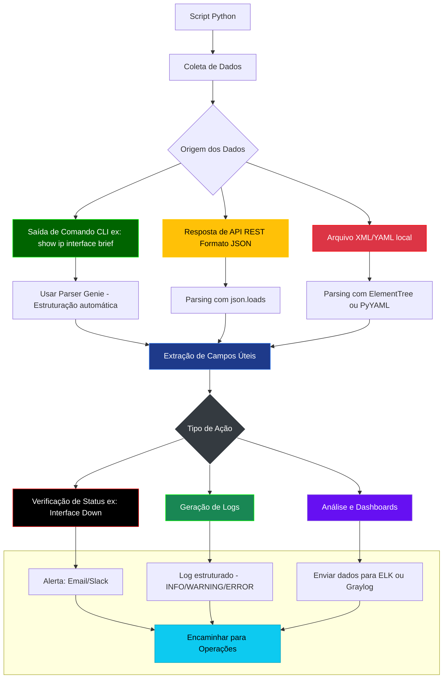
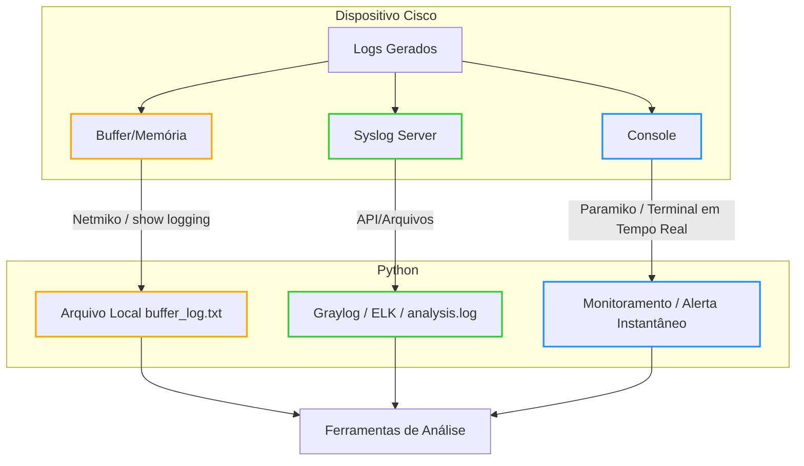
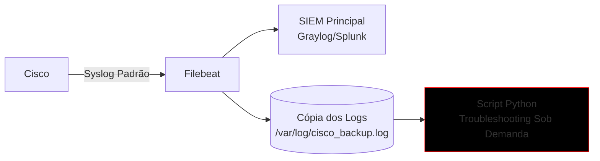

# Python - 13

## Parsing

## Sumário
- [Python - 13](#python---13)
  - [Parsing](#parsing)
  - [Sumário](#sumário)
    - [🧩 O que é Parsing?](#-o-que-é-parsing)
    - [Por que Parsing é Essencial?](#por-que-parsing-é-essencial)
    - [Documentação oficial](#documentação-oficial)
    - [O que vamos estudar](#o-que-vamos-estudar)
    - [Para que serve o Parsing?](#para-que-serve-o-parsing)
    - [Quando usar Parsing?](#quando-usar-parsing)
    - [Quando evitar ou adiar o parsing?](#quando-evitar-ou-adiar-o-parsing)
    - [Fluxo de Parsing](#fluxo-de-parsing)
  - [Parsing Manual em Automação de Redes](#parsing-manual-em-automação-de-redes)
    - [Introdução](#introdução)
    - [🟩 Parsing de JSON](#-parsing-de-json)
    - [🟥 Parsing de XML](#-parsing-de-xml)
    - [🟨 Parsing de YAML](#-parsing-de-yaml)
    - [⚫ Parsing de texto (CLI) com Regex](#-parsing-de-texto-cli-com-regex)
    - [🧠 Conclusão\*\*](#-conclusão)
  - [Breve revisão](#breve-revisão)
    - [SYSLOG em Dispositivos Cisco](#syslog-em-dispositivos-cisco)
    - [Níveis de Severidade Cisco (0-7):](#níveis-de-severidade-cisco-0-7)
    - [Correlação de Logs (Cisco + Python)](#correlação-de-logs-cisco--python)
    - [Logging para Troubleshooting](#logging-para-troubleshooting)
    - [Dicas de Ouro](#dicas-de-ouro)
    - [Destinos dos Logs em Dispositivos Cisco](#destinos-dos-logs-em-dispositivos-cisco)
  - [Exemplo de configuração completa:](#exemplo-de-configuração-completa)
  - [Quando o Python Entra em Ação?](#quando-o-python-entra-em-ação)
    - [Coleta de Logs em Dispositivos Cisco](#coleta-de-logs-em-dispositivos-cisco)
    - [Diferenças Entre `print()` e `logging` em Python](#diferenças-entre-print-e-logging-em-python)
      - [📌 **Quando Usar Cada Um**](#-quando-usar-cada-um)
      - [🚨 **Problemas com `print()` em Redes**](#-problemas-com-print-em-redes)
      - [✅ \*\*Vantagens do `logging` \*\*](#-vantagens-do-logging-)
  - [Exercícios](#exercícios)
  - [Exercício 01 — Log básico com print() x logging.info()](#exercício-01--log-básico-com-print-x-logginginfo)
  - [Exercício 02 — Log para arquivo .log](#exercício-02--log-para-arquivo-log)
  - [Exercício 03 — Estrutura de pastas de logs](#exercício-03--estrutura-de-pastas-de-logs)
  - [Exercício 04 — Logs por data (log rotation manual)](#exercício-04--logs-por-data-log-rotation-manual)
    - [Antes de começarmos o exercício, vamos verificar o conceito de Log Rotation](#antes-de-começarmos-o-exercício-vamos-verificar-o-conceito-de-log-rotation)
  - [Exercício 05 — Simular erro capturado via logging.exception()](#exercício-05--simular-erro-capturado-via-loggingexception)
  - [Exercício 06 — Logs formatados e personalizados](#exercício-06--logs-formatados-e-personalizados)
    - [Explicações adicionais](#explicações-adicionais)

### 🧩 O que é Parsing?

Parsing (ou análise sintática) é o processo de analisar e extrair informações de dados estruturados ou semiestruturados, como arquivos JSON, XML, YAML, HTML ou mesmo a saída de um comando de terminal.

### Por que Parsing é Essencial?

No contexto de redes e automação, parsing é essencial para transformar dados brutos (de um equipamento ou API) em dados organizados e utilizáveis por scripts ou dashboards.

### Documentação oficial

Parser - Python  
https://docs.python.org/pt-br/3.8/library/parser.html  

Genie - Cisco  
https://developer.cisco.com/docs/genie-docs/

Python Docs - Json  
https://docs.python.org/3/library/json.html

PyYaml  
https://pyyaml.org/wiki/PyYAMLDocumentation

---
Arrumar

### O que vamos estudar

- Entender como o módulo logging do Python funciona
- Aprender os diferentes níveis de log e quando usá-los
- Criar logs em arquivos e integrar com outras ferramentas (Graylog, ELK, etc)
- Aplicar logs em scripts de automação de rede com Cisco e Linux

---
Arrumar

### Para que serve o Parsing?

Principais objetivos:

  - Extrair informações específicas: Por exemplo, o status de uma interface, o hostname de um roteador, ou o IP de uma VLAN.

  - Validar dados recebidos: Garantir que o conteúdo tem o formato esperado (ex: JSON válido, XML bem formado).

  - Transformar a informação: Convertendo dados de texto para dicionários Python, listas, etc., para facilitar o tratamento e a automação.

  - Gerar insights e relatórios: Organizar e exibir informações para análise (Zabbix, Grafana, Graylog, etc).

### Quando usar Parsing?

Você usa parsing quando:  

| Cenário                                                       | Exemplo                                                                 |
|---------------------------------------------------------------|-------------------------------------------------------------------------| 
| 📤 Você recebe dados de um equipamento ou API                 | Saída do comando show ip interface brief, payload JSON de uma REST API  |
| 🧩 Precisa filtrar campos específicos                         | Pegar apenas o IP de uma interface em JSON                              |
| 📊 Quer estruturar os dados para um script, dashboard ou log  | Converter XML de retorno em dicionário Python                           |
| 🔄 Vai automatizar a configuração ou análise                  | Verificar se todas as interfaces estão "up" antes de aplicar uma ACL    |

### Quando evitar ou adiar o parsing?

Parsing pode ser custoso, confuso ou desnecessário em certos cenários:  

| Situação                                             | Melhor alternativa                           |
|------------------------------------------------------|----------------------------------------------|
| Dados já vêm em estrutura limpa e simples	           | Use direto, sem parsing extra                |
| Está em uma fase inicial de automação	               | Pode focar em coletar dados primeiro         |
| Vai usar ferramentas com parsers prontos (ex: Genie) | Evita reinventar a roda                      |
| Projeto pequeno e pontual	                           | Um if "up" in string: pode ser o suficiente  |


### Fluxo de Parsing



**🎯 Interpretação baseada em cor (semáforo adaptado):**

| Cor          | Significado                                | Etapa |
|--------------|--------------------------------------------|-------|
| 🟢 Verde    | Parsing claro e direto (ex: JSON limpo)    | D1, H2|
| 🟡 Amarelo  | Parsing requer atenção (ex: variações API) | D2    |
| 🔴 Vermelho | Parsing pode gerar erro grave              | D3    |
| ⚫ Preto    | Ação crítica esperada                      | H1    |
| 🔵 Azul     | Etapas técnicas neutras                    | F, Z  | 
| 🟣 Roxo     | Etapas de análise/visualização             | H3    |
| ⚪ Cinza    | Decisão intermediária                      | G     |


## Parsing Manual em Automação de Redes

### Introdução

Nem sempre os dados coletados em redes vêm prontos para serem processados. Em muitos casos, o profissional precisa interpretar manualmente saídas de comandos, arquivos de configuração ou respostas de APIs. Esse processo é chamado de parsing manual.

Parsing manual significa ler, interpretar e estruturar informações não padronizadas, como strings brutas ou arquivos em formatos diversos. Isso é útil quando:

  - Não há um parser pronto disponível (como o Genie).

  - O formato dos dados é simples o bastante para tratar diretamente com Python.

  - Desejamos entender melhor a estrutura interna dos dados antes de automatizar em larga escala.

Abaixo, apresentamos os principais formatos e como fazer o parsing manual com Python.

### 🟩 Parsing de JSON

O parsing de JSON é essencial para trabalhar com:
- APIs REST de plataformas Cisco (DNA Center, Meraki Dashboard)
- Retornos de equipamentos modernos (IOS XE, ACI)
- Automação de configurações e coleta de dados

Dados obtidos de uma API Cisco - Simulado

**dados_api.json**

```json
{
  "hostname": "R1-CCNP",
  "ip": "10.0.0.1",
  "os": "IOS-XE",
  "interfaces": [
    {"name": "Gig0/1", "status": "up", "vlan": 10},
    {"name": "Gig0/2", "status": "down", "vlan": 20}
  ]
}
```

**parse_cisco_json.py**

```Python
[01] import json
[02]
[03] # Simulando um cenário (parsing para troubleshooting)
[04] try:
[05]     with open('device_data.json') as f:
[06]         data = json.load(f)
[07]     
[08]     # Validação
[09]     if not all(key in data for key in ['hostname', 'interfaces']):
[10]         raise ValueError("JSON inválido: estrutura Cisco esperada não encontrada")
[11]    
[12]     # Análise de interface
[13]     interfaces_down = [
[14]         intf['name'] for intf in data['interfaces']
[15]         if intf['status'] == 'down'
[16]     ]
[17]    
[18]     # Saída formatada (similar a questões da prova)
[19]     print(f"\nDispositivo: {data['hostname']}")
[20]     print(f"Interfaces DOWN: {interfaces_down}")
[21]     print("\nAções recomendadas:")
[22]     for intf in interfaces_down:
[23]         print(f"  - Executar: 'show interface {intf}'")
[24]
[25] except json.JSONDecodeError:
[26]     print("ERRO: JSON malformado")
[27] except FileNotFoundError:
[28]     print("ERRO: Arquivo não encontrado (importante para troubleshooting)")
[29] except Exception as e:
[30]     print(f"ERRO inesperado: {str(e)}")
```

**Saída**

```bash
alcancil@linux:~/automacoes/parsing/01$ python3 -m venv venv
alcancil@linux:~/automacoes/parsing/01$ source venv/bin/activate
(venv) alcancil@linux:~/automacoes/parsing/01$ python3 parse_cisco.py 

Dispositivo: R1-CCNP
Interfaces DOWN: ['Gig0/2']

Ações recomendadas (exemplo ENCOR):
  - Executar: 'show interface Gig0/2'
(venv) alcancil@linux:~/automacoes/parsing/01$
```

**Explicação**

```Python
Bloco 1: Importação e Contexto

[01] import json                                                                         # Importa o módulo JSON padrão do Python para parsing
[02]
[03] # Simulando um cenário  (parsing para troubleshooting)

Bloco 2: Leitura e Validação do JSON

[04] try:                                                                                # Inicio bloco tratamento de erros 
[05]     with open('device_data.json') as f:                                             # Abre o arquivo JSON (simula resposta de API)
[06]         data = json.load(f)                                                         # Carrega e decodifica o JSON para um dicionário Python
[07]     
[08]     # Validação 
[09]     if not all(key in data for key in ['hostname', 'interfaces']):                  # Verifica chaves obrigatórias
[10]         raise ValueError("JSON inválido: estrutura Cisco esperada não encontrada")  # Falha controlada - Se não encontra chaves chama um erro

Bloco 3: Processamento

[12]     # Análise de interfaces (exemplo clássico ENCOR)
[13]     interfaces_down = [                                                                # List comprehension para processamento eficiente
[14]         intf['name'] for intf in data['interfaces']                                    # List comprehension para eficiência
[15]         if intf['status'] == 'down'                                                    # Filtra interfaces com status 'down'
[16]     ]

Bloco 4: Saída Formatada

[18]     # Saída formatada 
[19]     print(f"\nDispositivo: {data['hostname']}")                                         # Exibe hostname (dado básico)
[20]     print(f"Interfaces DOWN: {interfaces_down}")                                        # Lista interfaces problemáticas
[21]     print("\nAções recomendadas:")                                                      # Header para seção de troubleshooting
[22]     for intf in interfaces_down:                                                        # Itera sobre interfaces down
[23]         print(f"  - Executar: 'show interface {intf}'")                                 # Sugere comandos para troubleshooting

Bloco 5: Tratamento de Erros

[25] except json.JSONDecodeError:                                                            # Erro de sintaxe JSON (arquivo corrompido)
[26]     print("ERRO: JSON malformado")                                                      # Mensagem clara para o usuário
[27] except FileNotFoundError:                                                               # Captura ausência do arquivo (erro comum em automação)
[28]     print("ERRO: Arquivo não encontrado (importante para troubleshooting)")             # Feedback específico
[29] except Exception as e:                                                                  # Fallback para outros erros
[30]     print(f"ERRO inesperado: {str(e)}")                                                 # Exibe detalhes do erro para debug
```

**OBS: List Comprehension (compreensão de lista)** é uma forma concisa e eficiente de criar listas em Python, muito usada em automação de redes para processar saídas de comandos Cisco (como show interface, show ip route) ou respostas de APIs (DNA Center, Meraki).

**🔎 Como Funciona?**  

Sintaxe básica:  

```python
nova_lista = [expressão for item in lista if condição]  
```

| Parte	          | Descrição                                                        | Exemplo Cisco ENCOR             |
|-----------------|------------------------------------------------------------------|---------------------------------|
| expressão       | O que será incluído na lista (ex: nome da interface, IP, status) | intf['name']                    |
| for item        | Itera sobre cada elemento de uma lista/dicionário                | for intf in data['interfaces']  |
| if condição     | (Opcional) Filtra os itens que atendem a uma condição            | if intf['status'] == 'down'     |

**💡 Exemplo Prático (Cenário ENCOR)**

Suponha que você queira extrair interfaces **DOWN** de um JSON retornado por um comando **show interface | json** em um switch Cisco:  

Dados de Exemplo (JSON Cisco):

```Python
data = {
    "interfaces": [
        {"name": "Gig0/1", "status": "up", "vlan": 10},
        {"name": "Gig0/2", "status": "down", "vlan": 20},
        {"name": "Gig0/3", "status": "down", "vlan": 30}
    ]
}  
```

**📌 Forma Tradicional (Sem List Comprehension)**

```python
interfaces_down = []  
for intf in data['interfaces']:  
    if intf['status'] == 'down':  
        interfaces_down.append(intf['name'])  
```

**🚀 Forma com List Comprehension**

```python
interfaces_down = [intf['name'] for intf in data['interfaces'] if intf['status'] == 'down']  
```

**Saída:**

```python
['Gig0/2', 'Gig0/3']  # Lista pronta para uso em automação/troubleshooting  
```

    ✅ Quando usar: APIs REST, retorno de sistemas modernos como Cisco DNA Center, Meraki, etc.

### 🟥 Parsing de XML

o parsing de XML é essencial para:

  - Configurações via NETCONF (protocolo usado em automação Cisco)

  - Arquivos de configuração legados (ex: backups de IOS clássico)

  - Integração com sistemas enterprise (ACI, ISE) que usam XML

**parse_xml.py**

```Python
[01] import xml.etree.ElementTree as ET
[02]
[03] # XML simulando uma configuração básica de interface (pré-NETCONF)
[04] interface_config = '''
[05] <cisco_config>
[06]     <interface>
[07]         <name>GigabitEthernet0/1</name>
[08]         <ip_address>192.168.1.1</ip_address>
[09]         <status>up</status>
[10]         <vlan>10</vlan>
[11]     </interface>
[12]     <interface>
[13]         <name>GigabitEthernet0/2</name>
[14]         <ip_address>192.168.2.1</ip_address>
[15]         <status>down</status>
[16]         <vlan>20</vlan>
[17]     </interface>
[18] </cisco_config>
[19] '''
[20]
[21] # Parse básico (sem namespaces para simplificar)
[22] root = ET.fromstring(interface_config)
[23] 
[25] # Extraindo informações como no ENCOR (encontrar interfaces down)
[26] print("🔍 Interfaces com problemas:")
[27] for interface in root.findall('interface'):
[28]     name = interface.find('name').text
[29]     status = interface.find('status').text
[30]    
[31]     if status == 'down':
[32]         ip = interface.find('ip_address').text
[33]         vlan = interface.find('vlan').text
[34]         print(f"  ! Interface {name} (IP: {ip}, VLAN: {vlan}) está DOWN")
```

**Saída**

```Bash
alcancil@linux:~/automacoes/parsing/02$ python3 -m venv venv
alcancil@linux:~/automacoes/parsing/02$ source venv/bin/activate
(venv) alcancil@linux:~/automacoes/parsing/02$ python3 parse_xml.py 
🔍 Interfaces com problemas:
  ! Interface GigabitEthernet0/2 (IP: 192.168.2.1, VLAN: 20) está DOWN
(venv) alcancil@linux:~/automacoes/parsing/02$ 
```

**Explicação**  

```Python
Bloco 1: Importação e Dados de Exemplo
python

[01] import xml.etree.ElementTree as ET                                         # Importa a biblioteca padrão para parsing XML
[02]
[03] # XML simulando uma configuração básica de interface (pré-NETCONF)
[04] interface_config = '''                                                     # String multilinha contendo o XML
[05] <cisco_config>                                                             # Tag raiz do XML (equivalente a um "envelope")
[06]     <interface>                                                            # Primeiro bloco de interface (elemento filho)
[07]         <name>GigabitEthernet0/1</name>                                    # Nome da interface (tag + valor)
[08]         <ip_address>192.168.1.1</ip_address>                               # Endereço IP configurado
[09]         <status>up</status>                                                # Status operacional (up/down)
[10]         <vlan>10</vlan>                                                    # VLAN associada
[11]     </interface>                                                           # Fechamento do bloco
[12]     <interface>                                                            # Segunda interface
[13]         <name>GigabitEthernet0/2</name>                                    # Nome da Interface
[14]         <ip_address>192.168.2.1</ip_address>                               # Ip da interface
[15]         <status>down</status>                                              # Interface propositalmente down para exemplo
[16]         <vlan>20</vlan>                                                    # Número da Vlan que a interface está
[17]     </interface>                                                           # Fechamento do bloco Interface
[18] </cisco_config>                                                            # Fechamento da tag raiz
[19] '''

Bloco 2: Parsing Básico

[21] # Parse básico (sem namespaces para simplificar)
[22] root = ET.fromstring(interface_config)                                     # Converte a string XML em um objeto Python (árvore DOM)
                                                                                # Linha 22: ET.fromstring() é o método fundamental para iniciar o parsing.
                                                                                      # Transforma o XML em uma estrutura hierárquica onde você pode navegar com find()/findall().
                                                                                      # Equivalente a comandos Cisco como show interface | xml (mas em Python).

Bloco 3: Extração de Dados (Estilo ENCOR)

[25] # Extraindo informações como no ENCOR (encontrar interfaces down)
[26] print("🔍 Interfaces com problemas:")                                      # Cabeçalho para output (simula um alerta)
[27] for interface in root.findall('interface'):                                # Itera sobre TODAS as tags <interface>
[28]     name = interface.find('name').text                                     # Extrai o texto dentro de <name> (ex: Gig0/1)
[29]     status = interface.find('status').text                                 # Extrai o status (up/down)
[30]    
[31]     if status == 'down':                                                   # Filtro para troubleshooting
[32]         ip = interface.find('ip_address').text                             # Extrai IP se interface estiver down
[33]         vlan = interface.find('vlan').text                                 # Extrai VLAN associada
[34]         print(f"  ! Interface {name} (IP: {ip}, VLAN: {vlan}) está DOWN")  # Saída formatada
```

    ✅ Quando usar: NETCONF, arquivos de configuração, sistemas mais antigos.

### 🟨 Parsing de YAML

Muito usado para arquivos de configuração legíveis, como inventory, playbooks ou templates em ferramentas como Ansible.

```yaml
import yaml

yaml_data = '''
router:
  name: R1
  loopback: 10.1.1.1
'''

parsed = yaml.safe_load(yaml_data)
print(parsed["router"]["name"])     # Saída: R1
print(parsed["router"]["loopback"]) # Saída: 10.1.1.1
```
    ✅ Quando usar: arquivos .yaml em playbooks, inventories e modelos declarativos.

### ⚫ Parsing de texto (CLI) com Regex

Usado quando o equipamento só retorna texto puro, como saídas de show commands. É o mais "manual" e propenso a erros, mas também o mais comum em redes tradicionais.

```txt
import re

cli_output = "GigabitEthernet0/1 is up, line protocol is up"
match = re.search(r'(\S+) is (\w+),', cli_output)

if match:
    print(match.group(1))  # Saída: GigabitEthernet0/1
    print(match.group(2))  # Saída: up
```

    ✅ Quando usar: equipamentos sem API ou parser nativo, parsing de logs e saídas CLI.

### 🧠 Conclusão**

Parsing manual é a base do entendimento da automação. Ele te prepara para lidar com situações imprevisíveis — seja criando seus próprios parsers ou entendendo os dados antes de aplicar ferramentas como Genie, pyATS ou NAPALM.

No próximo passo, veremos como parsers prontos como o Genie facilitam (e muito) esse trabalho — trazendo agilidade e padronização para ambientes Cisco e, em alguns casos, multivendor.


---
Arrumar

**Dica para o CCNP ENCOR:**

    "Sempre verifique o NTP (show ntp status) antes de analisar logs em cenários de troubleshooting no exame."

## Breve revisão

### SYSLOG em Dispositivos Cisco

**Comandos Chave** 
    
```bash

! Configuração mínima para o exame:
configure terminal
  logging host 10.0.0.1              # Servidor de logs
  logging trap informational         # Nível 6 (INFO)
  logging source-interface Gig0/0    # Origem dos logs
  logging facility local7            # Facility padrão
end
```
   
### Níveis de Severidade Cisco (0-7):
    

| Nível  | Significado    |
|:------:|:--------------:|
| 0:     | Emergency      |    
| 1:     | Alert          |
| 2:     | Critical       |
| 3:     | Errors         |
| 4:     | Warnings       |
| 5:     | Notification   |
| 6:     | Informational  |
| 7:     | Debugging      |


### Correlação de Logs (Cisco + Python)

Exemplo Prático (um cenário clássico do CCNP):

```python

# Script Python para analisar logs de BGP
import logging
logging.basicConfig(filename='bgp_events.log', level=logging.INFO)

def analyze_bgp_log(log_line):
    if "%BGP-5-ADJCHANGE" in log_line:
        logging.warning(f"BGP neighbor change: {log_line}")
    elif "%BGP-3-BACKWARD" in log_line:
        logging.error(f"BGP route fluctuation: {log_line}")
```

**No Cisco:**

```bash

show logging | include %BGP  # Filtra logs BGP no dispositivo
```

### Logging para Troubleshooting 

- Cenários Comuns no CCNP ENCOR:
    
| Problema      | Log Cisco Típico              | Ação no Python                        |
|---------------|-------------------------------|---------------------------------------|
| Falha OSPF    | Adjacency	%OSPF-5-ADJCHG	    | logging.error("OSPF neighbor down")   | 
| STP Loops     | %SPANTREE-7-RECV_1Q_NON_TRUNK | logging.critical("STP loop detected") |
| HSRP Failover | %HSRP-6-STATECHANGE           | logging.info("HSRP active change")    |

### Dicas de Ouro 

- Comandos para Aprender:
    
```bash
show logging                # Exibe logs armazenados no dispositivo
show logging | begin Mar 1  # Filtra por data
terminal monitor            # Exibe logs em tempo real no console  

> - O comando `logging trap debugging` (nível 7) é útil em labs, mas evite em produção devido ao volume de logs.  
> - Em questões de troubleshooting, priorize `show logging | include %ERROR` para filtrar falhas graves.
```

- Armadilhas Comuns:

**Logs não aparecem? Verifique:**

```bash
show logging status     # Confira se o logging está ativo
show clock              # Horário incorreto afeta a ordem dos logs
```

**"Por que os logs não aparecem no servidor Syslog?"**
        
Causas possíveis:

  - Nível de severidade incorreto (logging trap).

  - Bloqueio de porta UDP 514 (firewall).

  - Fonte incorreta (logging source-interface).

**OBS:** antes de avançarmos, precisamos entender onde os logs são armazenados para podermos utilizar algum script python.  

### Destinos dos Logs em Dispositivos Cisco

Os logs podem ser enviados para múltiplos destinos simultaneamente (configuráveis via CLI):  

| Destino         | Comando Cisco           | Vantagens                         | Limitações                     |
|-----------------|-------------------------|-----------------------------------|--------------------------------|
| Console         | logging console <nível> | Útil para troubleshooting local   | Não armazena histórico         |
| Buffer (RAM)    | logging buffered <size> | Armazena logs temporariamente     | Limite de espaço               |
| Servidor Syslog | logging host <IP>       | Armazenamento centralizado        | Requer conectividade           |
| Arquivo Local   | logging file <path>     | Disponível em alguns dispositivos | Consome storage do dispositivo |

## Exemplo de configuração completa:

```bash

configure terminal
  logging console 6           # Exibe logs no console (nível 6 = informational)
  logging buffered 16384      # Armazena 16KB de logs na RAM
  logging host 192.168.1.100  # Envia para servidor Syslog (Graylog/ELK)
end
```

## Quando o Python Entra em Ação?

O script Python pode atuar em três momentos distintos:

- **Cenário 1:** Coleta de Logs do Buffer/Console (Sem Servidor Syslog)

    Como funciona:

        O Python se conecta via SSH (Paramiko/Netmiko) e executa show logging para ler logs do buffer.

        Problema: Logs antigos são perdidos se o buffer estiver cheio.

- **Cenário 2:** Análise de Logs em um Servidor Syslog (Graylog/ELK)

    Como funciona:

        Os dispositivos enviam logs para o servidor (ex: Graylog) via logging host.

        O Python consome os logs do servidor (API/arquivos) para análise.

- **Cenário 3:** Captura em Tempo Real (Terminal)

    Como funciona:

        O Python pode simular um terminal (ex: usando paramiko.invoke_shell()) para capturar logs enquanto são exibidos no console.

        Uso típico: Monitorar eventos específicos (ex: falhas de interface).

**Obs:**

- Se o equipamento está configurado para enviar logs a um servidor (Graylog):

    > O Python não precisa acessar o dispositivo diretamente (a menos que queira executar comandos adicionais).

    > Basta analisar os logs no servidor (via API ou arquivos).

- Se quiser garantir redundância:

```bash

! Configure ambos no dispositivo:
logging host 192.168.1.100   # Graylog
logging buffered 16384       # Backup local
```

### Coleta de Logs em Dispositivos Cisco  
1. **Logs Locais (Buffer)**:  
   - Use `show logging` via Python + Netmiko.  
   - Limitado pelo tamanho do buffer.  

2. **Servidor Syslog (Graylog/ELK)**:  
   - Python lê via API ou arquivos.  
   - Ideal para análise centralizada.  

3. **Console/Terminal**:  
   - Python pode capturar em tempo real com Paramiko.  
   - Útil para monitoramento ativo.  



> **Atenção**: Nunca armazene senhas em código. Use variáveis de ambiente ou arquivos `.env` ou cofre de senhas.

### Diferenças Entre `print()` e `logging` em Python

| Característica               | `print()`                            | `logging`                                                                 |
|------------------------------|--------------------------------------|---------------------------------------------------------------------------|
| **Propósito**                | Saída simples para console           | Registro estruturado de eventos com severidade                            |
| **Níveis de Severidade**     | Não possui                           | Possui (DEBUG, INFO, WARNING, ERROR, CRITICAL)                            |
| **Formatação**               | Manual (f-strings, .format())        | Automática via `Formatters` (`%(asctime)s - %(levelname)s - %(message)s`) |
| **Destinos de Saída**        | Apenas console                       | Múltiplos (arquivo, console, syslog, email) via `Handlers`                |
| **Performance**              | Mais rápido (para debug pontual)     | Leve overhead (justificável em produção)                                  |
| **Uso em Produção**          | Não recomendado                      | Essencial para troubleshooting e auditoria                                |
| **Exemplo em Redes**         | `print("Conectado a", device_ip)`    | `logging.info(f"Conectado a {device_ip}")`                                |


#### 📌 **Quando Usar Cada Um**

1. **`print()`**  
   - Debug rápido durante o desenvolvimento.  
   - Exemplo:  
     ```python
     print(f"Tentando conectar a {device_ip}...")  # Remove após testes
     ```

2. **`logging`**  
   - Automação de redes e scripts em produção.  
   - Exemplo :  
     ```python
     import logging
     logging.basicConfig(
         filename='network.log',
         level=logging.INFO,
         format='%(asctime)s - %(levelname)s - %(message)s'
     )
     try:
         connection = ConnectHandler(**device)
         logging.info(f"SSH estabelecido com {device['host']}")
     except NetmikoTimeoutException:
         logging.error(f"Timeout em {device['host']}")
     ```

#### 🚨 **Problemas com `print()` em Redes**
- **Perda de contexto**: Sem timestamps ou níveis de severidade.  
- **Inviável em escala**: Não filtra mensagens por importância.  
- **Sem persistência**: Não salva em arquivo por padrão.  

#### ✅ **Vantagens do `logging` **
1. **Correlação de Eventos**:  
```bash
   2023-10-05 14:30:00 - INFO - Conectado a 192.168.1.1  
   2023-10-05 14:31:22 - ERROR - Timeout SSH em 192.168.1.1
```

## Exercícios

## Exercício 01 — Log básico com print() x logging.info()

**OBJETIVO:** Demonstrar as diferenças fundamentais entre saídas simples (`print()`) e logs estruturados (`logging`), aplicáveis a cenários de redes Cisco.

📂 Estrutura Final do Projeto

```bash
logging
│
└── 01
    └── print_logging.py
```

**print_logging.py**

```Python
[01] # Exemplo 01 — Log básico com print() x logging.info()
[02] 
[03] import logging
[04] 
[05] # Configuração básica do logging (terminal + formato)
[06] logging.basicConfig(
[07]     level=logging.INFO,
[08]     format='%(asctime)s - %(levelname)s - %(message)s',
[09]     handlers=[logging.StreamHandler()]  # Saída no terminal
[10] )
[11] 
[12] print("=== DEMONSTRAÇÃO PRINT() VS LOGGING ===")
[13] 
[14] # Cenário: Conexão SSH simulada
[15] device_ip = "192.168.1.1"
[16] 
[17] # Método 1: Usando print()
[18] print(f"[Simples] Tentando conectar a {device_ip}...")
[19] print(f"[Simples] Conexão SSH estabelecida com {device_ip}")
[20] 
[21] # Método 2: Usando logging
[22] logging.debug(f"DEBUG: Mensagem invisível (nível configurado como INFO)")  # Não será exibido
[23] logging.info(f"Conectando a {device_ip}...")
[24] logging.warning(f"Conexão estabelecida com {device_ip} (nível WARNING como exemplo)")
[25] 
[26] print("\n=== ANÁLISE ===")
[27] print("Observe como logging oferece:")
[28] print("- Timestamp automático")
[29] print("- Nível de severidade")
[30] print("- Formatação consistente")
```
   
**Saída**

```Bash
alcancil@linux:~/automacoes/logging/01$ python3 -m venv venv
alcancil@linux:~/automacoes/logging/01$ source venv/bin/activate
(venv) alcancil@linux:~/automacoes/logging/01$ python3 print_logging.py 
=== DEMONSTRAÇÃO PRINT() VS LOGGING ===
[Simples] Tentando conectar a 192.168.1.1...
[Simples] Conexão SSH estabelecida com 192.168.1.1
2025-06-20 15:50:30,082 - INFO - Conectando a 192.168.1.1...
2025-06-20 15:50:30,082 - WARNING - Conexão estabelecida com 192.168.1.1 (nível WARNING como exemplo)

=== ANÁLISE ===
Observe como logging oferece:
- Timestamp automático
- Nível de severidade
- Formatação consistente
(venv) alcancil@linux:~/automacoes/logging/01$ 
```

**Boas práticas:**

```python

# ❌ Frágil (não use em scripts de rede)
print("Interface Gig0/1 down!")

# ✅ Profissional (CCNP-style)
logging.error("Interface Gig0/1 down - Verificar BGP/STP")
```

**Explicação**

**print_logging.py**

```Python
Bloco 1: Cabeçalho e Importações

[01] # Exemplo 01 — Log básico com print() x logging.info()  # Descrição do exemplo
[02] 
[03] import logging                                                                        # Importa o módulo de logging padrão do Python

Bloco 2: Configuração Básica do Logging

[05] # Configuração básica do logging (terminal + formato)  # Comentário explicativo
[06] logging.basicConfig(                                                                  # Função para configuração básica do sistema de logs
[07]     level=logging.INFO,                                                               # Define o nível mínimo de log para INFO (ignora DEBUG)
[08]     format='%(asctime)s - %(levelname)s - %(message)s',                               # Formato padrão das mensagens
[09]     handlers=[logging.StreamHandler()]                                                # Saída no terminal (console)
[10] )                                                                                     # Fecha a configuração

Bloco 3: Demonstração Inicial

[12] print("=== DEMONSTRAÇÃO PRINT() VS LOGGING ===")                                      # Título da demonstração

Bloco 4: Cenário de Exemplo

[14] # Cenário: Conexão SSH simulada  # Contexto do exemplo
[15] device_ip = "192.168.1.1"                                                             # Define um endereço IP fictício para o exemplo

Bloco 5: Método Tradicional (print)

[17] # Método 1: Usando print()                                                            # Demonstração da abordagem tradicional
[18] print(f"[Simples] Tentando conectar a {device_ip}...")                                # Mensagem de status
[19] print(f"[Simples] Conexão SSH estabelecida com {device_ip}")                          # Mensagem de sucesso

Bloco 6: Método Profissional (logging)

[21] # Método 2: Usando logging  # Demonstração da abordagem profissional
[22] logging.debug(f"DEBUG: Mensagem invisível (nível configurado como INFO)")              # Exemplo de mensagem que não será exibida
[23] logging.info(f"Conectando a {device_ip}...")                                           # Mensagem de nível INFO (será exibida)
[24] logging.warning(f"Conexão estabelecida com {device_ip} (nível WARNING como exemplo)")  # Mensagem de nível WARNING (será exibida)

Bloco 7: Análise Comparativa

[26] print("\n=== ANÁLISE ===")                                                             # Cabeçalho da seção de análise
[27] print("Observe como logging oferece:")                                                 # Introdução às vantagens
[28] print("- Timestamp automático")                                                        # Vantagem 1: Registro temporal
[29] print("- Nível de severidade")                                                         # Vantagem 2: Classificação de importância
[30] print("- Formatação consistente")                                                      # Vantagem 3: Padronização de saída
```

## Exercício 02 — Log para arquivo .log

    Redirecionar os logs para automacao.log

    Definir nível DEBUG e mostrar logs de todos os tipos

    Analisar conteúdo do arquivo com cat e grep

**OBJETIVO:** Redirecionar logs estruturados para um arquivo `automacao.log` com nível `DEBUG`, demonstrando análise em diferentes sistemas operacionais.

📂 Estrutura Final do Projeto

```bash
logging
│   
└── 02
    ├── analise_linux.py
    ├── analise_windows.py
    ├── arquivo_log_universal.py
    └── automacao.log

```

**arquivo_log_universal.py**

```Python
[01] import logging
[02] import platform
[03] 
[04] logging.basicConfig(
[05]     filename='automacao.log',
[06]     level=logging.DEBUG,
[07]     format='%(asctime)s | %(levelname)-8s | %(message)s'
[08] )
[09] 
[10] # Logs de exemplo
[11] logging.debug("Debug: Configuração carregada")
[12] logging.info(f"SO detectado: {platform.system()}")
[13] logging.warning("Alerta: CPU acima de 80%")
[14] logging.error("Erro: Timeout na conexão SSH")
[15] logging.critical("CRÍTICO: Dispositivo offline")
```

**analise_linux.py**

```Python
[01] def analisar_log():
[02]     with open('automacao.log', 'r') as f:
[03]         linhas = f.readlines()
[04]     
[05]     print("\n=== ERROS CRÍTICOS ===")
[06]     [print(l.strip()) for l in linhas if "CRITICAL" in l]
[07]     
[08]     print("\n=== RESUMO ===")
[09]     niveis = ["DEBUG", "INFO", "WARNING", "ERROR", "CRITICAL"]
[10]     for nivel in niveis:
[11]         qtd = sum(1 for linha in linhas if f"| {nivel}" in linha)
[12]         print(f"{nivel}: {qtd} ocorrências")
[13] 
[14] if __name__ == "__main__":
[15]     analisar_log()
```

**analise_windows.py**

```Python
[01] def analisar_log():
[02]     with open('automacao.log', 'r') as f:
[03]         linhas = f.readlines()
[04]     
[05]     print("\n--- ERROS CRÍTICOS ---")
[06]     [print(l.strip()) for l in linhas if "CRITICAL" in l]
[07]     
[08]     print("\n--- RESUMO ---")
[09]     from collections import defaultdict
[10]     contador = defaultdict(int)
[11]     
[12]     for linha in linhas:
[13]         if "| DEBUG" in linha: contador["DEBUG"] += 1
[14]         elif "| INFO" in linha: contador["INFO"] += 1
[15]         elif "| WARNING" in linha: contador["WARNING"] += 1
[16]         elif "| ERROR" in linha: contador["ERROR"] += 1
[17]         elif "| CRITICAL" in linha: contador["CRITICAL"] += 1
[18]    
[19]     for nivel, qtd in contador.items():
[20]         print(f"{nivel}: {qtd} ocorrência(s)")
[21]
[22] if __name__ == "__main__":
[23]     analisar_log()
```

**Como utilizar?**  

- python3 arquivo_log_universal.py  # Gera o log
- python3 analise_linux.py          # Analisa o log
- python arquivo_log_universal.py   # Gera o log
- python analise_windows.py         # Analisa o log


**Saída**

```bash
alcancil@linux:~/automacoes/logging/02$ python3 -m venv venv
alcancil@linux:~/automacoes/logging/02$ source venv/bin/activate
(venv) alcancil@linux:~/automacoes/logging/02$ python3 arquivo_log_universal.py 
```

**OBS:** como primeiro geramos o log em um arquivo de log, vou mostrar o formato e conteúdo do arquivo

```Bash
(venv) alcancil@linux:~/automacoes/logging/02$ ls -la
total 28
drwxrwxr-x 3 alcancil alcancil 4096 jun 21 14:37 .
drwxrwxr-x 4 alcancil alcancil 4096 jun 21 14:31 ..
-rw-r--r-- 1 root     root      477 jun 21 14:33 analise_linux.py
-rw-r--r-- 1 root     root      758 jun 21 14:34 analise_windows.py
-rw-r--r-- 1 root     root      427 jun 21 14:32 arquivo_log_universal.py
-rw-rw-r-- 1 alcancil alcancil  322 jun 21 14:36 automacao.log
drwxrwxr-x 5 alcancil alcancil 4096 jun 21 14:35 venv
(venv) alcancil@linux:~/automacoes/logging/02$ cat automacao.log 
2025-06-21 14:36:08,931 | DEBUG    | Debug: Configuração carregada
2025-06-21 14:36:08,931 | INFO     | SO detectado: Linux
2025-06-21 14:36:08,931 | WARNING  | Alerta: CPU acima de 80%
2025-06-21 14:36:08,931 | ERROR    | Erro: Timeout na conexão SSH
2025-06-21 14:36:08,931 | CRITICAL | CRÍTICO: Dispositivo offline
(venv) alcancil@linux:~/automacoes/logging/02$ 
```

- Agora vamos realizar a análise como script

```Bash
(venv) alcancil@linux:~/automacoes/logging/02$ python3 analise_linux.py 

=== ERROS CRÍTICOS ===
2025-06-21 14:36:08,931 | CRITICAL | CRÍTICO: Dispositivo offline

=== RESUMO ===
DEBUG: 1 ocorrências
INFO: 1 ocorrências
WARNING: 1 ocorrências
ERROR: 1 ocorrências
CRITICAL: 1 ocorrências
```

**Explicação**

**arquivo_log_universal.py**

```Python
Bloco 1: Importações

[01] import logging                                            # Importa o módulo de logging padrão do Python para geração de logs
[02] import platform                                           # Importa o módulo para obter informações do sistema operacional

Bloco 2: Configuração Básica do Logging

[04] logging.basicConfig(                                       # Função para configuração básica do sistema de logs
[05]     filename='automacao.log',                              # Especifica o arquivo onde os logs serão salvos
[06]     level=logging.DEBUG,                                   # Define o nível mínimo de log para DEBUG (captura todos)
[07]     format='%(asctime)s | %(levelname)-8s | %(message)s'   # Formato das mensagens:
                                                                # - %(asctime)s: Data/hora
                                                                # - %(levelname)-8s: Nível do log (alinhado em 8 chars)
                                                                # - %(message)s: Mensagem do log
[08] )

Bloco 3: Geração de Logs de Exemplo

[10] # Logs de exemplo
[11] logging.debug("Debug: Configuração carregada")             # Mensagem de DEBUG (nível mais baixo, para detalhes)
[12] logging.info(f"SO detectado: {platform.system()}")         # Mensagem INFO (informações gerais)
[13] logging.warning("Alerta: CPU acima de 80%")                # Mensagem WARNING (alerta sobre problemas não críticos)
[14] logging.error("Erro: Timeout na conexão SSH")              # Mensagem ERROR (erros que afetam funcionalidades)
[15] logging.critical("CRÍTICO: Dispositivo offline")           # Mensagem CRITICAL (falhas graves que exigem ação imediata)
```

**analise_linux.py**

```Python
Bloco 1: Definição da Função

[01] def analisar_log():                                                # Define a função principal para análise de logs

Bloco 2: Leitura do Arquivo de Log

[02]     with open('automacao.log', 'r') as f:                          # Abre o arquivo em modo leitura (seguro com 'with')
[03]         linhas = f.readlines()                                     # Lê todas as linhas do arquivo para uma lista

Bloco 3: Filtro de Erros Críticos

[05]     print("\n=== ERROS CRÍTICOS ===")                              # Cabeçalho para seção de erros
[06]     [print(l.strip()) for l in linha if "CRITICAL" in l]           # List comprehension que:
                                                                        # 1. Filtra linhas com "CRITICAL"
                                                                        # 2. Remove espaços em branco (.strip())
                                                                        # 3. Imprime cada linha

Bloco 4: Geração do Resumo Estatístico

[08]     print("\n=== RESUMO ===")                                      # Cabeçalho para seção estatística
[09]     niveis = ["DEBUG", "INFO", "WARNING", "ERROR", "CRITICAL"]     # Lista de níveis de log a analisar
[10]     for nivel in niveis:                                           # Itera sobre cada nível
[11]         qtd = sum(1 for linha in linhas if f"| {nivel}" in linha)  # Conta ocorrências:
                                                                        # 1. Generator expression para eficiência
                                                                        # 2. Verifica padrão "| NÍVEL" no log
[12]         print(f"{nivel}: {qtd} ocorrências")                       # Formata saída (ex: "INFO: 5 ocorrências")

Bloco 5: Execução Condicional

[14] if __name__ == "__main__":                                         # Verifica se o script está sendo executado diretamente
[15]     analisar_log()                                                 # Chama a função principal
```

**analise_windows.py**

```Python
Bloco 1: Definição da Função Principal

[01] def analisar_log():                                             # Define a função principal para análise de logs

Bloco 2: Leitura do Arquivo de Log

[02]     with open('automacao.log', 'r') as f:                       # Abre o arquivo em modo leitura (auto-fechamento com 'with')
[03]         linhas = f.readlines()                                  # Lê todas as linhas do arquivo para uma lista

Bloco 3: Exibição de Erros Críticos

[05]     print("\n--- ERROS CRÍTICOS ---")                           # Cabeçalho para a seção de erros
[06]     [print(l.strip()) for l in linhas if "CRITICAL" in l]       # Exibe erros críticos onde:
                                                                              # 1. Filtra linhas com "CRITICAL"
                                                                              # 2. Remove espaços extras (.strip())
                                                                              # 3. Imprime cada linha

Bloco 4: Configuração do Contador

[08]     print("\n--- RESUMO ---")                                   # Cabeçalho para a seção estatística
[09]     from collections import defaultdict                         # Importa o defaultdict para contagem eficiente
[10]     contador = defaultdict(int)                                 # Cria um dicionário com valores padrão 0 (int)

Bloco 5: Contagem de Ocorrências por Nível

[12]     for linha in linhas:                                        # Itera sobre cada linha do log
[13]         if "| DEBUG" in linha: contador["DEBUG"] += 1           # Conta logs DEBUG
[14]         elif "| INFO" in linha: contador["INFO"] += 1           # Conta logs INFO
[15]         elif "| WARNING" in linha: contador["WARNING"] += 1     # Conta logs WARNING
[16]         elif "| ERROR" in linha: contador["ERROR"] += 1         # Conta logs ERROR
[17]         elif "| CRITICAL" in linha: contador["CRITICAL"] += 1   # Conta logs CRITICAL

Bloco 6: Exibição dos Resultados

[19]     for nivel, qtd in contador.items():                         # Itera sobre o dicionário de contagens
[20]         print(f"{nivel}: {qtd} ocorrência(s)")                  # Formata a saída (plural condicional)

Bloco 7: Execução Condicional

[22] if __name__ == "__main__":                                      # Verifica se o script está sendo executado diretamente
[23]     analisar_log()                                              # Chama a função principal de análise
```

## Exercício 03 — Estrutura de pastas de logs

**Objetivo:** Criar um sistema de logs organizado por tipo de tarefa em automação de redes.

📂 Estrutura Final do Projeto

```bash

logging
│   
└── 03
    ├── logs
    │   ├── sistema.log
    │   ├── usuario.log
    │   └── vlan.log
    └── rede.py
```
 
**rede.py**

```python

[01] import logging
[02] import os
[03] from datetime import datetime
[04]
[05] # 1. Criar pasta 'logs' se não existir
[06] os.makedirs('logs', exist_ok=True)
[07]
[08] # 2. Configuração base
[09] def setup_logger(name, log_file, level=logging.INFO):
[10]     """Cria um logger customizado para cada tipo de tarefa"""
[11]     
[12]     # Cria o logger
[13]     logger = logging.getLogger(name)
[14]     logger.setLevel(level)
[15]     
[16]     # Formatação profissional
[17]     formatter = logging.Formatter(
[18]         '%(asctime)s | %(name)s | %(levelname)s | %(message)s',
[19]         datefmt='%Y-%m-%d %H:%M:%S'
[20]     )
[21]     
[22]     # Handler para arquivo
[23]     file_handler = logging.FileHandler(f'logs/{log_file}')
[24]     file_handler.setFormatter(formatter)
[25]     
[26]     logger.addHandler(file_handler)
[27]     
[28]     return logger
[29] 
[30] # 3. Loggers específicos (exemplo para VLANs)
[31] logger_vlan = setup_logger('vlan', 'vlan.log')
[32] logger_usuario = setup_logger('usuario', 'usuario.log')
[33] logger_sistema = setup_logger('sistema', 'sistema.log', logging.DEBUG)
[34]
[35] # --- Exemplos de uso ---
[36]
[37] # 4. Simulação de automação de VLAN
[38] def configurar_vlan(vlan_id, nome):
[39]     try:
[40]         logger_vlan.info(f"Iniciando configuração da VLAN {vlan_id}")
[41]         # Lógica fictícia (substitua por netmiko/ansible depois)
[42]         if not nome:
[43]             raise ValueError("Nome da VLAN vazio")
[44]             
[45]         logger_vlan.debug(f"Parâmetros: ID={vlan_id}, Nome={nome}")
[46]         logger_vlan.info(f"VLAN {vlan_id} ({nome}) configurada com sucesso")
[47]         
[48]     except Exception as e:
[49]         logger_vlan.error(f"Falha na VLAN {vlan_id}: {str(e)}", exc_info=True)
[50] 
[51] # 5. Testando
[52] if __name__ == "__main__":
[53]     configurar_vlan(10, "GERENCIA")
[54]     configurar_vlan(20, "")  # Forçar erro
[55]     logger_usuario.warning("Usuário 'admin' fez login fora do horário comercial")
[56]     logger_sistema.debug("Memória utilizada: 45%")
```

**Saída**

**vlan.log***

```Bash
alcancil@linux:~/automacoes/logging/03$ python3 -m venv venv
alcancil@linux:~/automacoes/logging/03$ source venv/bin/activate
(venv) alcancil@linux:~/automacoes/logging/03$ python3 rede.py 
(venv) alcancil@linux:~/automacoes/logging/03$ ls
logs  rede.py  venv
(venv) alcancil@linux:~/automacoes/logging/03$ cd logs
(venv) alcancil@linux:~/automacoes/logging/03/logs$ ls
sistema.log  usuario.log  vlan.log
(venv) alcancil@linux:~/automacoes/logging/03/logs$ cat sistema.log 
2025-06-22 17:22:58 | sistema | DEBUG | Memória utilizada: 45%
(venv) alcancil@linux:~/automacoes/logging/03/logs$ cat usuario.log 
2025-06-22 17:22:58 | usuario | WARNING | Usuário 'admin' fez login fora do horário comercial
(venv) alcancil@linux:~/automacoes/logging/03/logs$ cat vlan.log 
2025-06-22 17:22:58 | vlan | INFO | Iniciando configuração da VLAN 10
2025-06-22 17:22:58 | vlan | INFO | VLAN 10 (GERENCIA) configurada com sucesso
2025-06-22 17:22:58 | vlan | INFO | Iniciando configuração da VLAN 20
2025-06-22 17:22:58 | vlan | ERROR | Falha na VLAN 20: Nome da VLAN vazio
Traceback (most recent call last):
  File "/home/alcancil/automacoes/logging/03/rede.py", line 43, in configurar_vlan
    raise ValueError("Nome da VLAN vazio")
ValueError: Nome da VLAN vazio
(venv) alcancil@linux:~/automacoes/logging/03/logs$ 
```

**Explicação**

```Python
Bloco 1: Importações

[01] import logging                                                                    # Biblioteca padrão para geração de logs
[02] import os                                                                         # Para operações com sistema de arquivos
[03] from datetime import datetime                                                     # Para manipulação de datas/horas (usado indiretamente pelo logging)

Bloco 2: Criação da Pasta de Logs

[05] # 1. Criar pasta 'logs' se não existir
[06] os.makedirs('logs', exist_ok=True)                                                 # Cria diretório 'logs' caso não exista (evita erros)
                                                                                        # 'exist_ok=True' ignora se pasta já existir

Bloco 3: Configuração Base do Logger

[08] # 2. Configuração base
[09] def setup_logger(name, log_file, level=logging.INFO):                              # Define função para criar loggers customizados
[10]     """Cria um logger customizado para cada tipo de tarefa"""                      # Docstring explicativa
[11]     
[12]     # Cria o logger
[13]     logger = logging.getLogger(name)                                               # Obtém ou cria um logger com o nome especificado
[14]     logger.setLevel(level)                                                         # Define nível mínimo de log (INFO por padrão)
[15]     
[16]     # Formatação profissional
[17]     formatter = logging.Formatter(                                                 # Cria formatador para as mensagens
[18]         '%(asctime)s | %(name)s | %(levelname)s | %(message)s',                    # Padrão: data+hora | nome | nível | mensagem
[19]         datefmt='%Y-%m-%d %H:%M:%S'                                                # Formato da data: '2023-08-22 14:30:00'
[20]     )
[21]     
[22]     # Handler para arquivo
[23]     file_handler = logging.FileHandler(f'logs/{log_file}')                         # Cria handler para gravar em arquivo
[24]     file_handler.setFormatter(formatter)                                           # Aplica formatação ao handler
[25]     
[26]     logger.addHandler(file_handler)                                                # Adiciona o handler ao logger
[27]     
[28]     return logger                                                                  # Retorna o logger configurado

Bloco 4: Criação dos Loggers Específicos

[30] # 3. Loggers específicos (exemplo para VLANs)
[31] logger_vlan = setup_logger('vlan', 'vlan.log')                                     # Logger para operações de VLAN (nível INFO)
[32] logger_usuario = setup_logger('usuario', 'usuario.log')                            # Logger para ações de usuário
[33] logger_sistema = setup_logger('sistema', 'sistema.log', logging.DEBUG)             # Logger para sistema (nível DEBUG)

Bloco 5: Função de Exemplo (VLAN)

[37] # 4. Simulação de automação de VLAN
[38] def configurar_vlan(vlan_id, nome):                                                # Função exemplo para configuração de VLAN
[39]     try:
[40]         logger_vlan.info(f"Iniciando configuração da VLAN {vlan_id}")              # Log nível INFO
[41]         # Lógica fictícia (substitua por netmiko/ansible depois)
[42]         if not nome:
[43]             raise ValueError("Nome da VLAN vazio")                                 # Força erro se nome estiver vazio
[44]             
[45]         logger_vlan.debug(f"Parâmetros: ID={vlan_id}, Nome={nome}")                # Log nível DEBUG (só aparece se configurado)
[46]         logger_vlan.info(f"VLAN {vlan_id} ({nome}) configurada com sucesso")       # Log de sucesso
[47]         
[48]     except Exception as e:
[49]         logger_vlan.error(f"Falha na VLAN {vlan_id}: {str(e)}", exc_info=True)     # Log de erro com stack trace

Bloco 6: Teste dos Loggers

[51] # 5. Testando
[52] if __name__ == "__main__":                                                         # Executa apenas se o script for rodado diretamente
[53]     configurar_vlan(10, "GERENCIA")                                                # Caso de sucesso
[54]     configurar_vlan(20, "")                                                        # Caso de erro (nome vazio)
[55]     logger_usuario.warning("Usuário 'admin' fez login fora do horário comercial")  # Log nível WARNING
[56]     logger_sistema.debug("Memória utilizada: 45%")                                 # Log nível DEBUG (só aparece no sistema.log)
```

**🔍 Explicação dos Conceitos**

    logging.getLogger()

        Cria loggers independentes para cada módulo/tarefa

        Evita poluição entre logs de VLANs, usuários, etc.

    FileHandler

        Direciona logs para arquivos específicos

        Permite rotação (ex: 1 arquivo por dia)

    Níveis de Log

        DEBUG: Detalhes técnicos (ex: parâmetros exatos)

        INFO: Eventos normais (ex: configuração aplicada)

        WARNING: Comportamentos incomuns

        ERROR: Falhas recuperáveis


## Exercício 04 — Logs por data (log rotation manual)

### Antes de começarmos o exercício, vamos verificar o conceito de Log Rotation

Log Rotation é uma técnica de gerenciamento de arquivos de log que evita o acúmulo excessivo de registros, dividindo-os em arquivos menores, organizados por tempo, tamanho ou critérios personalizados. Isso ajuda a:  

✅ Evitar esgotamento de espaço em disco  
✅ Facilitar a busca em logs históricos  
✅ Manter a aplicação performática (arquivos muito grandes podem travar sistemas)  

**Como Funciona o Log Rotation?**

O processo geralmente segue estas etapas:  

| Passo	                    | Descrição                                                                             |
|---------------------------|---------------------------------------------------------------------------------------|
| 1. Critério de Rotação    | Define quando um novo log deve ser criado (ex.: diariamente, ao atingir 10MB).        |
| 2. Geração do Novo Log    | O sistema fecha o arquivo atual e abre um novo (ex.: app.log → app_2024-06-12.log).   |
| 3. Compactação (opcional) | Logs antigos podem ser compactados (ex.: .log.gz) para economizar espaço.             |
| 4. Limite de Retenção     | Remove logs muito antigos (ex.: manter apenas os últimos 7 dias).                     |

Métodos Comuns de Rotação

| Tipo               | Funcionamento                                                            | Exemplo                       | 
|--------------------|--------------------------------------------------------------------------|-------------------------------|
| Baseado em Tempo   | Gera um novo log periodicamente (hora/dia/mês).                          | error_2024-06-12.log          |
| Baseado em Tamanho | Quando o arquivo atinge um limite (ex.: 10MB), é rotacionado.            | app.log → app.1.log           |
| Híbrido            | Combina tempo e tamanho (ex.: novo log a cada dia OU se passar de 50MB). | Usado em servidores críticos. |

Ferramentas de Log Rotation Automático

| Sistema    | Ferramenta                         | Uso Típico                                            |
|------------|------------------------------------|-------------------------------------------------------| 
| Linux	     | logrotate                          | Rota, compacta e remove logs antigos automaticamente. |
| Windows    | PowerShell Scripts ou LogRotateWin | Simula o logrotate do Linux.                          |
| Aplicações | Bibliotecas (Python/Java/Node.js)  | Implementa rotação dentro do próprio código.          |

Vamos agora ao exercício.

📂 Estrutura Final do Projeto

```Bash
04
    ├── log_rotate.py
    └── logs
        └── backup_2025-06-22.log
```

**log_rotation.py (Multiplaforma)**  

```python

[01] import logging
[02] from datetime import datetime, timedelta
[03] import os
[04] import glob
[05] 
[06] # --- Configuração do diretório ---
[07] LOG_DIR = "logs"
[08] os.makedirs(LOG_DIR, exist_ok=True)
[09] 
[10] # --- Definição do arquivo de log do dia ---
[11] today = datetime.now().strftime("%Y-%m-%d")
[12] log_file = f"{LOG_DIR}/backup_{today}.log"
[13]
[14] # --- Configuração do logging ---
[15] logging.basicConfig(
[16]     filename=log_file,
[17]     level=logging.INFO,
[18]     format='%(asctime)s - %(levelname)s - %(message)s',
[19]     datefmt='%H:%M:%S'
[20] )
[21] 
[22] # --- Rotação: Apaga logs com mais de 7 dias ---
[23] for old_log in glob.glob(f"{LOG_DIR}/backup_*.log"):
[24]     # Extrai a data do nome do arquivo
[25]     log_date_str = old_log.split("_")[1].replace(".log", "")
[26]     log_date = datetime.strptime(log_date_str, "%Y-%m-%d")
[27]     
[28]     # Se o log for mais antigo que 7 dias, remove
[29]     if log_date < datetime.now() - timedelta(days=7):
[30]         os.remove(old_log)
[31]         logging.info(f"Removido log antigo: {old_log}")
[32]
[33] # --- Exemplo de logs ---
[34] logging.info("Iniciando processo de backup")
[35] logging.warning("Disco com 85% de uso")
[36] print(f"Log atual: {log_file}")
```

**Como Executar e Resultado**

    Salve como log_rotation.py

    Execute: python log_rotation.py várias vezes

    Verifique a pasta logs:

    logs/
    └── backup_2024-06-12.log  # Exemplo de saída

**Saída**

```Bash
alcancil@linux:~/automacoes/logging/04$ source venv/bin/activate
(venv) alcancil@linux:~/automacoes/logging/04$ python3 log_rotate.py 
Log atual: logs/backup_2025-06-22.log
(venv) alcancil@linux:~/automacoes/logging/04$ ls -la
total 20
drwxrwxr-x 4 alcancil alcancil 4096 jun 22 23:40 .
drwxrwxr-x 6 alcancil alcancil 4096 jun 22 23:13 ..
-rw-r--r-- 1 root     root     1092 jun 22 23:40 log_rotate.py
drwxrwxr-x 2 alcancil alcancil 4096 jun 22 23:40 logs
drwxrwxr-x 5 alcancil alcancil 4096 jun 22 23:15 venv
(venv) alcancil@linux:~/automacoes/logging/04$ cd logs
(venv) alcancil@linux:~/automacoes/logging/04/logs$ ls
backup_2025-06-22.log
(venv) alcancil@linux:~/automacoes/logging/04/logs$ cat backup_2025-06-22.log 
23:40:53 - INFO - Iniciando processo de backup
23:40:53 - WARNING - Disco com 85% de uso
(venv) alcancil@linux:~/automacoes/logging/04/logs$ 
```

**OBS:** Se você executar 10 vezes:  

    No mesmo dia: as mensagens são acumuladas no mesmo arquivo  

    Em dias diferentes: cria novos arquivos (backup_2024-06-16.log, etc.)  

    Logs com mais de 7 dias são apagados na próxima execução   

```Bash
(venv) alcancil@linux:~/automacoes/logging/04$ python3 log_rotate.py 
Log atual: logs/backup_2025-06-22.log
(venv) alcancil@linux:~/automacoes/logging/04$ cd 04
bash: cd: 04: Arquivo ou diretório inexistente
(venv) alcancil@linux:~/automacoes/logging/04$ cd logs/
(venv) alcancil@linux:~/automacoes/logging/04/logs$ cat backup_2025-06-22.log 
23:40:53 - INFO - Iniciando processo de backup
23:40:53 - WARNING - Disco com 85% de uso
23:42:15 - INFO - Iniciando processo de backup
23:42:15 - WARNING - Disco com 85% de uso
(venv) alcancil@linux:~/automacoes/logging/04/logs$ 
```

**OBS2:** agora vamos rodos o script mais um vez para gerar o rotate. Dessa vez, vamos deixar um arquivo de backup junto com mais de 7 dias. Esse arquivo deve ser apagado.

```Bash
(venv) alcancil@linux:~/automacoes/logging/04/logs$ cp backup_2025-06-22.log backup_2025-06-10.log 
(venv) alcancil@linux:~/automacoes/logging/04/logs$ ls
backup_2025-06-10.log  backup_2025-06-22.log
(venv) alcancil@linux:~/automacoes/logging/04/logs$ cd ..
(venv) alcancil@linux:~/automacoes/logging/04$ python3 log_rotate.py 
Log atual: logs/backup_2025-06-22.log
(venv) alcancil@linux:~/automacoes/logging/04$ cd logs
(venv) alcancil@linux:~/automacoes/logging/04/logs$ ls
backup_2025-06-22.log
(venv) alcancil@linux:~/automacoes/logging/04/logs$ 
```

**Explicação**  

**log_rotation.py**  


```Python
Bloco 1: Importações

[01] import logging                                                # Biblioteca padrão para registro de logs
[02] from datetime import datetime, timedelta                      # Para manipular datas e calcular diferenças temporais
[03] import os                                                     # Para operações com sistema de arquivos
[04] import glob                                                   # Para encontrar arquivos usando padrões (como *.log)

Bloco 2: Configuração do Diretório

[06] # --- Configuração do diretório ---
[07] LOG_DIR = "logs"                                              # Nome da pasta onde os logs serão armazenados
[08] os.makedirs(LOG_DIR, exist_ok=True)                           # Cria a pasta se não existir (evita erros se já existir)

Bloco 3: Definição do Arquivo de Log

[10] # --- Definição do arquivo de log do dia ---
[11] today = datetime.now().strftime("%Y-%m-%d")                   # Obtém a data atual no formato ano-mês-dia
[12] log_file = f"{LOG_DIR}/backup_{today}.log"                    # Cria o nome do arquivo (ex: logs/backup_2024-06-15.log)

Bloco 4: Configuração do Sistema de Logging

[14] # --- Configuração do logging ---
[15] logging.basicConfig(                                          # Configuração básica do sistema de logs
[16]     filename=log_file,                                        # Arquivo onde os logs serão escritos
[17]     level=logging.INFO,                                       # Nível mínimo de registro (INFO, WARNING, ERROR)
[18]     format='%(asctime)s - %(levelname)s - %(message)s',       # Formato das mensagens
[19]     datefmt='%H:%M:%S'                                        # Formato da hora nas mensagens
[20] )

Bloco 5: Rotação de Logs (Parte Principal)

[22] # --- Rotação: Apaga logs com mais de 7 dias ---
[23] for old_log in glob.glob(f"{LOG_DIR}/backup_*.log"):          # Lista todos os arquivos de log
[24]     # Extrai a data do nome do arquivo
[25]     log_date_str = old_log.split("_")[1].replace(".log", "")  # Isola a data do nome do arquivo
[26]     log_date = datetime.strptime(log_date_str, "%Y-%m-%d")    # Converte para objeto datetime
[27]     
[28]     # Se o log for mais antigo que 7 dias, remove
[29]     if log_date < datetime.now() - timedelta(days=7):         # Compara datas
[30]         os.remove(old_log)                                    # Apaga o arquivo antigo
[31]         logging.info(f"Removido log antigo: {old_log}")       # Registra a ação

Bloco 6: Exemplo de Uso

[33] # --- Exemplo de logs ---
[34] logging.info("Iniciando processo de backup")                  # Registra uma mensagem informativa
[35] logging.warning("Disco com 85% de uso")                       # Registra um aviso
[36] print(f"Log atual: {log_file}")                               # Mostra o caminho do arquivo no consol
```

## Exercício 05 — Simular erro capturado via logging.exception()

**O que é Stack Trace?**

Um stack trace (rastreamento de pilha) é um relatório que mostra:

  - A sequência exata de chamadas de funções/métodos que levaram a um erro

  - O tipo de erro ocorrido

  - O arquivo e linha onde o erro aconteceu

**Exemplo de stack trace:**

```Python
Traceback (most recent call last):
  File "app.py", line 10, in <module>
    conexao.dispositivo.connect()
  File "/lib/conexao.py", line 25, in connect
    raise ConnectionError("Falha na autenticação")
ConnectionError: Falha na autenticação
```

**Objetivo:**   
  
  - Criar erro com try/except e gravar com logging.exception()

  - Simular falha de conexão a dispositivo e logar a stack trace

📂 Estrutura Final do Projeto

```Bash
05
├── error_logs
│   └── errors_2025-06-23.log
└── stack_trace.py
```

**stack_trace.py**

```Python

[01] import logging
[02] from datetime import datetime
[03] import os
[04]
[05] # Configuração inicial
[06] LOG_DIR = "error_logs"
[07] os.makedirs(LOG_DIR, exist_ok=True)
[08]
[09] # Arquivo de log com data
[10] log_file = f"{LOG_DIR}/errors_{datetime.now().strftime('%Y-%m-%d')}.log"
[11] logging.basicConfig(
[12]     filename=log_file,
[13]     level=logging.ERROR,
[14]     format='%(asctime)s - %(levelname)s - %(message)s'
[14] )
[15]
[16] # Classe simulando dispositivo
[17] class Dispositivo:
[18]     def connect(self):
[19]         raise ConnectionError("Conexão recusada: porta 22 bloqueada")
[20]
[21] # Bloco try-except com logging
[22] try:
[23]     dispositivo = Dispositivo()
[24]     dispositivo.connect()  # Isso vai falhar
[25]
[26] except ConnectionError as e:
[27]     logging.error("Falha na conexão com dispositivo")  # Mensagem simples
[28]     logging.exception(e)  # Log com stack trace completo
[29]
[30] print(f"Log de erros gerado em: {log_file}")
```

**Como Funciona?**  

Quando ocorre o erro:  

  - logging.error() registra uma mensagem de erro simples

  - logging.exception() registra:

        A mensagem de erro

        O stack trace completo

        O tipo de exceção

**Saída**

```Bash
alcancil@linux:~/automacoes/logging/05$ python3 -m venv venv
alcancil@linux:~/automacoes/logging/05$ source venv/bin/activate
(venv) alcancil@linux:~/automacoes/logging/05$ python3 stack_trace.py 
Log de erros gerado em: error_logs/errors_2025-06-23.log
(venv) alcancil@linux:~/automacoes/logging/05$ ls
error_logs  stack_trace.py  venv
(venv) alcancil@linux:~/automacoes/logging/05$ cd error_logs/
(venv) alcancil@linux:~/automacoes/logging/05/error_logs$ ls
errors_2025-06-23.log
(venv) alcancil@linux:~/automacoes/logging/05/error_logs$ cat errors_2025-06-23.log 
2025-06-23 11:31:35,502 - ERROR - Falha na conexão com dispositivo
2025-06-23 11:31:35,502 - ERROR - Conexão recusada: porta 22 bloqueada
Traceback (most recent call last):
  File "/home/alcancil/automacoes/logging/05/stack_trace.py", line 25, in <module>
    dispositivo.connect()  # Isso vai falhar
    ^^^^^^^^^^^^^^^^^^^^^
  File "/home/alcancil/automacoes/logging/05/stack_trace.py", line 20, in connect
    raise ConnectionError("Conexão recusada: porta 22 bloqueada")
ConnectionError: Conexão recusada: porta 22 bloqueada
(venv) alcancil@linux:~/automacoes/logging/05/error_logs$ 
```

**Explicação**

```Python
Bloco 1: Importações

[01] import logging                                                            # Módulo para registro de logs
[02] from datetime import datetime                                             # Para obter a data/hora atual
[03] import os                                                                 # Para operações com sistema de arquivos

Bloco 2: Configuração Inicial

[05] # Configuração inicial
[06] LOG_DIR = "error_logs"                                                    # Nome do diretório para armazenar logs de erro
[07] os.makedirs(LOG_DIR, exist_ok=True)                                       # Cria a pasta se não existir (evita erros)

Bloco 3: Configuração do Arquivo de Log

[09] # Arquivo de log com data
[10] log_file = f"{LOG_DIR}/errors_{datetime.now().strftime('%Y-%m-%d')}.log"  # Nome do arquivo com data
[11] logging.basicConfig(                                                      # Configuração básica do logging
[12]     filename=log_file,                                                    # Arquivo de saída dos logs
[13]     level=logging.ERROR,                                                  # Só registra erros (ignora INFO/WARNING)
[14]     format='%(asctime)s - %(levelname)s - %(message)s'                    # Formato das mensagens
[15] )

Bloco 4: Simulação de Dispositivo

[16] # Classe simulando dispositivo
[17] class Dispositivo:                                                        # Classe fictícia para simular erro
[18]     def connect(self):                                                    # Método que sempre falha
[19]         raise ConnectionError("Conexão recusada: porta 22 bloqueada")     # Força um erro

Bloco 5: Captura e Registro do Erro

[21] # Bloco try-except com logging
[22] try:                                                                      # Tenta executar o código abaixo
[23]     dispositivo = Dispositivo()                                           # Cria instância do dispositivo
[24]     dispositivo.connect()                                                 # Chama o método que vai falhar
[25]
[26] except ConnectionError as e:                                              # Captura especificamente erros de conexão
[27]     logging.error("Falha na conexão com dispositivo")                     # Log simples do erro
[28]     logging.exception(e)                                                  # Log COMPLETO com stack trace

Bloco 6: Feedback ao Usuário

[30] print(f"Log de erros gerado em: {log_file}")                              # Mostra onde o log foi salvo
```

**Por Que Usar logging.exception()?**

✔️ Debug mais fácil - Mostra exatamente onde o erro ocorreu  
✔️ Contexto completo - Inclui a cadeia de chamadas que levou ao erro  
✔️ Padronização - Formato consistente para todos os erros  

**Variantes Úteis**

✔️ Capturando Qualquer Tipo de Erro (Genérico)  
✔️ Adicionando Contexto ao Erro  
✔️ Versão Combinada (Contexto + Genérico)  

1. Capturando Qualquer Tipo de Erro (Genérico)

```python

try:
    # Código que pode falhar
    dispositivo.connect()
except Exception as e:  # Captura QUALQUER tipo de exceção
    logging.exception("Erro inesperado")  # Registra a mensagem + stack trace completo
```

Comentários:

    Exception é a classe base para todas as exceções em Python

    Útil quando você quer tratar todos os erros da mesma forma

    Cuidado: Pode mascarar erros específicos se usado indiscriminadamente

**Saída no log:**

```Bash
ERROR: Erro inesperado
Traceback... (stack trace completo)
```

2. Adicionando Contexto ao Erro  

```python
try:
    dispositivo.connect("192.168.1.10")
except ConnectionError as e:
    # Adiciona informações contextuais antes do stack trace
    logging.error(f"Falha ao conectar no IP: 192.168.1.10 - Tentativa {tentativa}/3")
    logging.exception(e)  # Mantém o stack trace original
```

Comentários:

    logging.error() registra informações adicionais (IP, tentativas, etc.)

    logging.exception() ainda captura os detalhes técnicos

    Ideal para erros onde o contexto é importante para diagnóstico  

**Saída no log:**

```Bash
ERROR: Falha ao conectar no IP: 192.168.1.10 - Tentativa 2/3
ERROR: Conexão recusada: porta 22 bloqueada
Traceback... (stack trace original)
```

3. Versão Combinada (Contexto + Genérico)

```python

try:
    dispositivo.connect(ip)
except ConnectionError as e:
    logging.error(f"Falha específica de conexão com {ip}")
    logging.exception(e)
except Exception as e:
    logging.error(f"Erro inesperado ao acessar {ip}")
    logging.exception(e)
```

Hierarquia de Tratamento:

    Primeiro tenta capturar erros específicos de conexão

    Depois trata qualquer outro erro como genérico

**Tabela Comparativa**

| Cenário              | Quando Usar                               | Vantagens Cuidados                                      |
|----------------------|-------------------------------------------|---------------------------------------------------------|
| except Exception     | Para erros genéricos não esperados	       | Simplicidade	Pode esconder erros específicos          | 
| except SpecificError | Quando conhece os possíveis erros	       | Tratamento personalizado	Requer conhecimento prévio   |
| Contexto + Exception | Erros onde detalhes operacionais importam | Diagnóstico rico	Verbosidade no log                   |

**Exemplo Completo com Ambas Variantes**

```python

import logging

logging.basicConfig(filename='app.log', level=logging.ERROR)

class Dispositivo:
    def connect(self, ip):
        if "192.168" not in ip:
            raise ValueError("IP inválido")
        raise ConnectionError("Porta 22 bloqueada")

# Testando as variantes
for ip in ["192.168.1.10", "10.0.0.1"]:
    try:
        Dispositivo().connect(ip)
    except ConnectionError as e:
        logging.error(f"[CONEXÃO] Falha com {ip}")
        logging.exception(e)
    except ValueError as e:
        logging.error(f"[VALIDAÇÃO] IP {ip} inválido")
        logging.exception(e)
    except Exception as e:
        logging.error(f"[INESPERADO] Erro com {ip}")
        logging.exception(e)
```

**Saída em app.log:**

```Bash
ERROR: [CONEXÃO] Falha com 192.168.1.10
ERROR: Porta 22 bloqueada
Traceback... (stack trace)
ERROR: [VALIDAÇÃO] IP 10.0.0.1 inválido
ERROR: IP inválido
Traceback... (stack trace)
```

**Melhor Prática:** Use a abordagem mais específica possível, adicionando contexto apenas onde for realmente útil para troubleshooting.

## Exercício 06 — Logs formatados e personalizados

**Objetivo:**

   - Personalizar o formato do log: [%(asctime)s] [%(levelname)s] - %(message)s

   - Mostrar log com data/hora, tipo de log e mensagem

   - Importante para quando for visualizar logs em um SIEM ( Graylog / Wazuh / Splunk) futuramente
  
📂 Estrutura Final do Projeto  

```bash
06
├── formatted_logs
│   └── app_20250623.log
├── log2.py
├── logs.py
├── requirements.txt
└── siem_logs
    └── app_20250623.json
```

**log.py**

```python

[01] import logging
[02] from datetime import datetime
[03] import os
[04] 
[05] # --- Configuração do diretório de logs ---
[06] LOG_DIR = "formatted_logs"
[07] os.makedirs(LOG_DIR, exist_ok=True)
[08] 
[09] # --- Configuração do formato personalizado ---
[10] log_format = "[%(asctime)s] [%(levelname)s] - %(message)s"
[11] log_file = f"{LOG_DIR}/app_{datetime.now().strftime('%Y%m%d')}.log"
[12] 
[13] logging.basicConfig(
[14]     filename=log_file,
[15]     level=logging.DEBUG,  # Captura todos os níveis
[16]     format=log_format,
[17]     datefmt='%Y-%m-%d %H:%M:%S'  # Formato completo de data/hora
[18] )
[19]
[20] # --- Criando um logger com nome específico ---
[21] logger = logging.getLogger("AppLogger")
[22] 
[23] # --- Exemplo de logs em diferentes níveis ---
[24] logger.debug("Mensagem de debug - Detalhes internos")  # Nível 10
[25] logger.info("Conexão estabelecida com sucesso")        # Nível 20
[26] logger.warning("Disco com 85% de capacidade")          # Nível 30
[27] logger.error("Falha na autenticação do usuário")       # Nível 40
[28] logger.critical("Servidor fora do ar")                 # Nível 50
[29]
[30] print(f"Logs gerados em: {log_file}")
```

**saída**

```bash
alcancil@linux:~/automacoes/logging/06$ python3 -m venv venv
alcancil@linux:~/automacoes/logging/06$ source venv/bin/activate
(venv) alcancil@linux:~/automacoes/logging/06$ python3 logs.py 
Logs gerados em: formatted_logs/app_20250623.log
(venv) alcancil@linux:~/automacoes/logging/06$ cd formatted_logs/
(venv) alcancil@linux:~/automacoes/logging/06/formatted_logs$ cat app_20250623.log 
[2025-06-23 15:15:52] [DEBUG] - Mensagem de debug - Detalhes internos
[2025-06-23 15:15:52] [INFO] - Conexão estabelecida com sucesso
[2025-06-23 15:15:52] [WARNING] - Disco com 85% de capacidade
[2025-06-23 15:15:52] [ERROR] - Falha na autenticação do usuário
[2025-06-23 15:15:52] [CRITICAL] - Servidor fora do ar
(venv) alcancil@linux:~/automacoes/logging/06/formatted_logs$ 
```


**Explicação Detalhada**

1. Formatação Personalizada

```python

log_format = "[%(asctime)s] [%(levelname)s] - %(message)s"

    %(asctime)s: Data/hora no formato especificado em datefmt

    %(levelname)s: Nível do log (DEBUG, INFO, WARNING, etc.)

    %(message)s: Mensagem do log
```
2. Saída Gerada no Arquivo

```Bash
[2024-06-15 14:30:45] [DEBUG] - Mensagem de debug - Detalhes internos
[2024-06-15 14:30:45] [INFO] - Conexão estabelecida com sucesso
[2024-06-15 14:30:45] [WARNING] - Disco com 85% de capacidade
[2024-06-15 14:30:45] [ERROR] - Falha na autenticação do usuário
[2024-06-15 14:30:45] [CRITICAL] - Servidor fora do ar
```

3. Benefícios para Graylog/ELK

    Estrutura Consistente: Padrão facilita parsing e filtros

    Metadados Explícitos: Nível e timestamp são facilmente identificáveis

    Compatibilidade: Formato simples funciona em qualquer sistema de log

**log.py**

```Python
Bloco 1: Importações

[01] import logging                                                       # Módulo padrão para geração de logs
[02] from datetime import datetime                                        # Para manipulação de datas e horas
[03] import os                                                            # Para operações com sistema de arquivos

Bloco 2: Configuração do Diretório

[05] # --- Configuração do diretório de logs ---
[06] LOG_DIR = "formatted_logs"                                           # Nome da pasta onde os logs serão armazenados
[07] os.makedirs(LOG_DIR, exist_ok=True)                                  # Cria o diretório se não existir (evita erros)

Bloco 3: Formatação Personalizada

[09] # --- Configuração do formato personalizado ---
[10] log_format = "[%(asctime)s] [%(levelname)s] - %(message)s"           # Estrutura do log
[11] log_file = f"{LOG_DIR}/app_{datetime.now().strftime('%Y%m%d')}.log"  # Nome do arquivo com data

Bloco 4: Configuração Básica do Logging

[13] logging.basicConfig(                                                 # Configuração global do módulo logging
[14]     filename=log_file,                                               # Arquivo de destino dos logs
[15]     level=logging.DEBUG,                                             # Captura todos os níveis (DEBUG e acima)
[16]     format=log_format,                                               # Aplica o formato personalizado
[17]     datefmt='%Y-%m-%d %H:%M:%S'                                      # Formato da data/hora nos logs
[18] ) 

Bloco 5: Logger Específico

[20] # --- Criando um logger com nome específico ---
[21] logger = logging.getLogger("AppLogger")                              # Logger identificável para rastreamento

Bloco 6: Geração de Logs

[23] # --- Exemplo de logs em diferentes níveis ---
[24] logger.debug("Mensagem de debug - Detalhes internos")                # Nível 10 (diagnóstico)
[25] logger.info("Conexão estabelecida com sucesso")                      # Nível 20 (informação normal)
[26] logger.warning("Disco com 85% de capacidade")                        # Nível 30 (alerta)
[27] logger.error("Falha na autenticação do usuário")                     # Nível 40 (erro operacional)
[28] logger.critical("Servidor fora do ar")                               # Nível 50 (falha crítica)

Bloco 7: Feedback

[30] print(f"Logs gerados em: {log_file}")                                # Exibe o caminho do arquivo no console
```

**Como Melhorar para Graylog / Splunk - SIEM ?**  

Adicione campos estruturados (usando JSON):

```python

import json
from pythonjsonlogger import jsonlogger  # pip install python-json-logger

# Configuração JSON
json_handler = logging.FileHandler('structured_logs.json')
formatter = jsonlogger.JsonFormatter(
    '%(asctime)s %(levelname)s %(message)s %(module)s %(funcName)s'
)
json_handler.setFormatter(formatter)

logger = logging.getLogger()
logger.addHandler(json_handler)
logger.info("Evento estruturado", extra={"user": "admin", "ip": "192.168.1.1"})
```

Saída JSON:

```json

{
  "asctime": "2024-06-15 14:30:45",
  "levelname": "INFO",
  "message": "Evento estruturado",
  "module": "app",
  "funcName": "<module>",
  "user": "admin",
  "ip": "192.168.1.1"
}
```

Vamos executar o script **log2.py** já com as melhorias em json embutidas dentro.  

**log2.py**

```Python
[01] import logging
[02] from pythonjsonlogger import jsonlogger  # pip install python-json-logger
[03] from datetime import datetime
[04] import os
[05] 
[06] # --- Configuração do diretório ---
[07] LOG_DIR = "siem_logs"
[08] os.makedirs(LOG_DIR, exist_ok=True)
[09]
[10] # --- Configuração JSON para SIEM ---
[11] logger = logging.getLogger("SIEMLogger")
[12] logger.setLevel(logging.INFO)
[13] 
[14] json_handler = logging.FileHandler(
[15]     filename=f"{LOG_DIR}/app_{datetime.now().strftime('%Y%m%d')}.json"
[16] )
[17] formatter = jsonlogger.JsonFormatter(
[18]     '%(asctime)s %(levelname)s %(message)s %(module)s %(funcName)s %(pathname)s',
[19]     rename_fields={'asctime': 'timestamp', 'levelname': 'severity'}  # Padrão SIEM
[20] )
[21] json_handler.setFormatter(formatter)
[22] logger.addHandler(json_handler)
[23]
[24] # --- Exemplo com campos customizados ---
[25] logger.info("Tentativa de login", extra={
[26]     "user": "admin",
[27]     "ip": "192.168.1.1",
[28]     "event_code": "LOGIN_ATTEMPT_001"
[29] })
```

**Saída**

```Bash
(venv) alcancil@linux:~/automacoes/logging/06$ sudo nano requirements.txt
(venv) alcancil@linux:~/automacoes/logging/06$ pip install -r requirements.txt 
Collecting python-json-logger (from -r requirements.txt (line 1))
  Downloading python_json_logger-3.3.0-py3-none-any.whl.metadata (4.0 kB)
Downloading python_json_logger-3.3.0-py3-none-any.whl (15 kB)
Installing collected packages: python-json-logger
Successfully installed python-json-logger-3.3.0
(venv) alcancil@linux:~/automacoes/logging/06$ python3 log2.py 
(venv) alcancil@linux:~/automacoes/logging/06$ ls
formatted_logs  log2.py  logs.py  requirements.txt  siem_logs  venv
(venv) alcancil@linux:~/automacoes/logging/06$ cd siem_logs/
(venv) alcancil@linux:~/automacoes/logging/06/siem_logs$ ls
app_20250623.json
(venv) alcancil@linux:~/automacoes/logging/06/siem_logs$ cat app_20250623.json 
{"timestamp": "2025-06-23 15:39:56,570", "severity": "INFO", "message": "Tentativa de login", "module": "log2", "funcName": "<module>", "pathname": "/home/alcancil/automacoes/logging/06/log2.py", "user": "admin", "ip": "192.168.1.1", "event_code": "LOGIN_ATTEMPT_001"}
(venv) alcancil@linux:~/automacoes/logging/06/siem_logs$
```

**Expçicação**

```Python
Bloco 1: Importações

[01] import logging                                                                     # Módulo padrão para geração de logs
[02] from pythonjsonlogger import jsonlogger                                            # Biblioteca para formatação JSON (instalável via pip)
[03] from datetime import datetime                                                      # Para manipulação de datas/horas
[04] import os                                                                          # Para operações com sistema de arquivos

Bloco 2: Configuração do Diretório

[06] # --- Configuração do diretório ---
[07] LOG_DIR = "siem_logs"                                                              # Nome da pasta para armazenar logs
[08] os.makedirs(LOG_DIR, exist_ok=True)                                                # Cria o diretório se não existir (evita erros)

Bloco 3: Configuração do Logger

[10] # --- Configuração JSON para SIEM ---
[11] logger = logging.getLogger("SIEMLogger")                                           # Cria um logger com identificador único
[12] logger.setLevel(logging.INFO)                                                      # Configura para capturar logs de nível INFO ou superior

Bloco 4: Configuração do Handler JSON

[14] json_handler = logging.FileHandler(                                                # Handler para escrever em arquivo
[15]     filename=f"{LOG_DIR}/app_{datetime.now().strftime('%Y%m%d')}.json"             # Nome do arquivo com data
[16] )
[17] formatter = jsonlogger.JsonFormatter(                                              # Formato personalizado em JSON
[18]     '%(asctime)s %(levelname)s %(message)s %(module)s %(funcName)s %(pathname)s',  # Campos incluídos
[19]     rename_fields={'asctime': 'timestamp', 'levelname': 'severity'}                # Padroniza nomes para SIEM
[20] )
[21] json_handler.setFormatter(formatter)                                               # Aplica o formatador ao handler
[22] logger.addHandler(json_handler)                                                    # Registra o handler no logger

Bloco 5: Exemplo de Log Estruturado

[24] # --- Exemplo com campos customizados ---
[25] logger.info("Tentativa de login", extra={                                          # Log nível INFO com metadados
[26]     "user": "admin",                                                               # Campo customizado 1
[27]     "ip": "192.168.1.1",                                                           # Campo customizado 2
[28]     "event_code": "LOGIN_ATTEMPT_001"                                              # Código de evento padronizado
[29] })
```

**Tabela de Níveis de Log**

| Nível    |  Valor | Quando Usar                           |
|----------|--------|---------------------------------------|
| DEBUG    |  10	| Detalhes para desenvolvimento         |
| INFO     |  20	| Confirmações de operações normais     |
| WARNING  |  30	| Eventos anormais não críticos         |
| ERROR    |  40    | Falhas em funcionalidades importantes | 
| CRITICAL |  50	| Sistemas inoperantes                  |


### Explicações adicionais



**Por quê dessa abordagem?**

1. Equipamentos Cisco (Fonte dos Logs)

    O que fazem: Enviam logs via protocolo Syslog (UDP 514 ou TCP 1514) com formatos como:

```bash
<134>Jun 24 09:00:00.123: %LINK-3-UPDOWN: Interface Gig0/1, changed state to down
```

Configuração típica:

```bash
    configure terminal
      logging host 192.168.1.100  # IP do Filebeat/SIEM
      logging trap informational  # Nível 6 (informational)
```

2. Filebeat (Coletor/Processador)

    O que é: Agente leve da Elastic que coleta, processa e encaminha logs.

    Funções chave:

        Normalização: Converte logs Syslog brutos em JSON padronizado.

```json
    {
      "timestamp": "2025-06-24T09:00:00.123Z",
      "device": "switch1",
      "severity": 3,
      "message": "Interface Gig0/1, changed state to down"
    }
```

    Bufferização: Armazena logs temporariamente se o SIEM estiver indisponível.

    Cópia local: Grava logs em /var/log/cisco_backup.log para redundância.

3. SIEM Principal (Graylog/Splunk)

    Processo:

        Indexação: Armazena logs em bancos de dados otimizados para buscas.

        Correlação: Identifica padrões (ex: múltiplas falhas de interface em 5 minutos).

        Alertas: Notifica equipes via email/Slack para eventos críticos.

    Vantagens:

        Busca full-text em terabytes de logs.

        Dashboards em tempo real:

```bash
        source:cisco AND severity:3 | stats count by device
```

4. Cópia Local + Python (Análise Sob Demanda)

    Cenários de uso:

        Investigação profunda: Quando o SIEM não tem dados suficientes.

        Scripts customizados: Exemplo para detectar flapping de interfaces:
        
```python

        import re
        from collections import defaultdict

        flap_count = defaultdict(int)
        with open('/var/log/cisco_backup.log') as f:
            for line in f:
                if "UPDOWN" in line:
                    interface = re.search(r"Interface (\S+)", line).group(1)
                    flap_count[interface] += 1

        for interface, count in flap_count.items():
            if count > 5:
                print(f"ALERTA: Flapping em {interface} ({count}x)")
```

    Vantagens:

        Flexibilidade: Análises específicas sem afetar o SIEM.

        Offline: Funciona mesmo sem conectividade com o SIEM.


**Tabela Comparativa: Filebeat vs Python**

| Característica        | Filebeat                   | Script Python                    |
|-----------------------|----------------------------|----------------------------------|
| Tipo de processamento	| Tempo real (streaming)     | Batch (sob demanda)              |
| Complexidade          | Baixa (configuração YAML)  | Alta (requer codificação)        |
| Performance           | Otimizado para alto volume | Limitado pelo hardware local     |
| Melhor para           | Coleta centralizada        | Análises pontuais e customizadas | 
