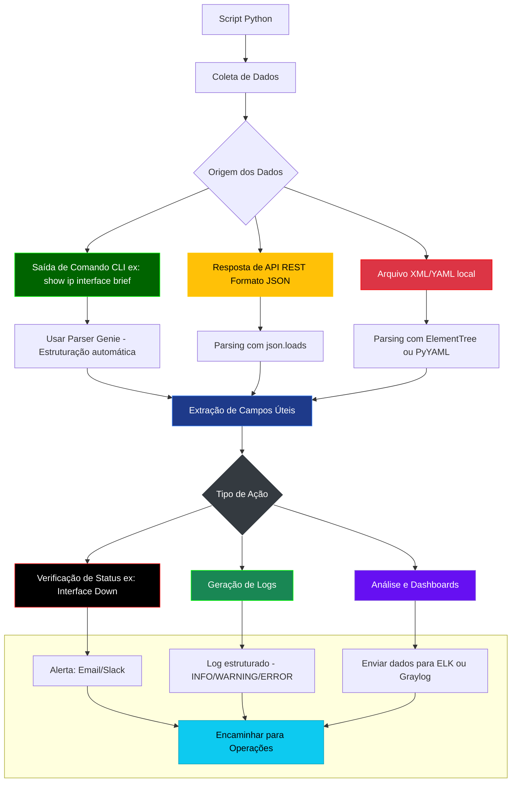

# Python - 14

## Parsing Automático - Genie

## Sumário
- [Python - 14](#python---14)
  - [Parsing Automático - Genie](#parsing-automático---genie)
  - [Sumário](#sumário)
    - [Introdução ao Genie](#introdução-ao-genie)
    - [Comparação: Parsing Manual vs Genie](#comparação-parsing-manual-vs-genie)
    - [Documentação oficial](#documentação-oficial)
    - [O que é um Framework?](#o-que-é-um-framework)
    - [O que vamos estudar](#o-que-vamos-estudar)
    - [Para que serve o Parsing?](#para-que-serve-o-parsing)
    - [Quando usar Parsing?](#quando-usar-parsing)
    - [Quando evitar ou adiar o parsing?](#quando-evitar-ou-adiar-o-parsing)
    - [Fluxo de Parsing](#fluxo-de-parsing)
  - [Parsing Manual em Automação de Redes](#parsing-manual-em-automação-de-redes)
    - [Introdução](#introdução)
    - [🟩 Parsing de JSON](#-parsing-de-json)
    - [🟥 Parsing de XML](#-parsing-de-xml)
    - [🟨 Parsing de YAML](#-parsing-de-yaml)
    - [⚫ Parsing de texto (CLI) com Regex](#-parsing-de-texto-cli-com-regex)
    - [Exemplo Prático - Logs Grandes](#exemplo-prático---logs-grandes)
    - [🧠 Conclusão](#-conclusão)


### Introdução ao Genie

O Cisco Genie é um framework de automação e parsing desenvolvido pela Cisco como parte do pyATS/Test Automation Solution. Ele fornece parsers pré-construídos para a maioria dos comandos show da Cisco, transformando saídas de texto não estruturadas em dados estruturados prontos para automação.

**Por que usar Genie para o CCNP ENCOR?**
- Cobre todos os comandos relevantes do blueprint (BGP, OSPF, interfaces, etc.)
- Modelos de dados consistentes para diferentes plataformas IOS-XE, NX-OS, IOS-XR
- Integração com pyATS para testes automatizados
- Economiza tempo em troubleshooting e validação de configurações

### Comparação: Parsing Manual vs Genie

| Característica          | Parsing Manual | Genie       |
|-------------------------|----------------|-------------|
| Tempo de desenvolvimento | Alto          | Baixo       |
| Manutenção              | Complexa       | Simples     |
| Cobertura de comandos   | Limitada       | Amplo       |
| Consistência            | Variável       | Padronizado |
| Curva de aprendizado    | Moderada       | Baixa       |
| Adequação para CCNP     | Fundamental    | Essencial   |

### Documentação oficial

Genie - Cisco  
https://developer.cisco.com/docs/genie-docs/

PyYaml  
https://pyyaml.org/wiki/PyYAMLDocumentation

### O que é um Framework?

Um framework (estrutura ou arcabouço, em português) é uma plataforma abrangente que fornece:

  - Uma estrutura base para desenvolvimento

  - Conjunto de ferramentas integradas

  - Convenções e melhores práticas

  - Funcionalidades pré-construídas

**Analogia:** Pense como um kit de construção - você recebe a estrutura básica e ferramentas especializadas para construir algo específico.
A Arquitetura pyATS/Genie

```Bash
pyATS (Framework de Teste e Automação)
├── Core (Infraestrutura básica)
├── Genie (Biblioteca de Parsing e Automação)
│   ├── Libs (Bibliotecas específicas)
│   │   ├── Parser (Análise de comandos)
│   │   ├── SDK (Interface de programação)
│   │   └── ... 
├── XPRESS (API REST)
└── Outros componentes
```

---
Arrumar

### O que vamos estudar

  - Parsing de JSON: APIs Cisco (DNA Center, Meraki), extração de dados estruturados.

  - Parsing de XML: Configurações NETCONF e arquivos legados.

  - Parsing de YAML: Inventários do Ansible e templates declarativos.

  - Regex para CLI: Análise de comandos show e logs (ex: BGP, interfaces).

  - Integração com ferramentas: SIEMs (Graylog/Splunk) e parsers automáticos (Genie).

### Para que serve o Parsing?

Principais objetivos:

  - Extrair informações específicas: Por exemplo, o status de uma interface, o hostname de um roteador, ou o IP de uma VLAN.

  - Validar dados recebidos: Garantir que o conteúdo tem o formato esperado (ex: JSON válido, XML bem formado).

  - Transformar a informação: Convertendo dados de texto para dicionários Python, listas, etc., para facilitar o tratamento e a automação.

  - Gerar insights e relatórios: Organizar e exibir informações para análise (Zabbix, Grafana, Graylog, etc).

### Quando usar Parsing?

Você usa parsing quando:  

| Cenário                                                       | Exemplo                                                                 |
|---------------------------------------------------------------|-------------------------------------------------------------------------| 
| 📤 Você recebe dados de um equipamento ou API                 | Saída do comando show ip interface brief, payload JSON de uma REST API  |
| 🧩 Precisa filtrar campos específicos                         | Pegar apenas o IP de uma interface em JSON                              |
| 📊 Quer estruturar os dados para um script, dashboard ou log  | Converter XML de retorno em dicionário Python                           |
| 🔄 Vai automatizar a configuração ou análise                  | Verificar se todas as interfaces estão "up" antes de aplicar uma ACL    |

### Quando evitar ou adiar o parsing?

Parsing pode ser custoso, confuso ou desnecessário em certos cenários:  

| Situação                                             | Melhor alternativa                           |
|------------------------------------------------------|----------------------------------------------|
| Dados já vêm em estrutura limpa e simples	           | Use direto, sem parsing extra                |
| Está em uma fase inicial de automação	               | Pode focar em coletar dados primeiro         |
| Vai usar ferramentas com parsers prontos (ex: Genie) | Evita reinventar a roda                      |
| Projeto pequeno e pontual	                           | Um if "up" in string: pode ser o suficiente  |


### Fluxo de Parsing



**🎯 Interpretação baseada em cor (semáforo adaptado):**

| Cor          | Significado                                | Etapa |
|--------------|--------------------------------------------|-------|
| 🟢 Verde    | Parsing claro e direto (ex: JSON limpo)    | D1, H2|
| 🟡 Amarelo  | Parsing requer atenção (ex: variações API) | D2    |
| 🔴 Vermelho | Parsing pode gerar erro grave              | D3    |
| ⚫ Preto    | Ação crítica esperada                      | H1    |
| 🔵 Azul     | Etapas técnicas neutras                    | F, Z  | 
| 🟣 Roxo     | Etapas de análise/visualização             | H3    |
| ⚪ Cinza    | Decisão intermediária                      | G     |


## Parsing Manual em Automação de Redes

### Introdução

Nem sempre os dados coletados em redes vêm prontos para serem processados. Em muitos casos, o profissional precisa interpretar manualmente saídas de comandos, arquivos de configuração ou respostas de APIs. Esse processo é chamado de parsing manual.

Parsing manual significa ler, interpretar e estruturar informações não padronizadas, como strings brutas ou arquivos em formatos diversos. Isso é útil quando:

  - Não há um parser pronto disponível (como o Genie).

  - O formato dos dados é simples o bastante para tratar diretamente com Python.

  - Desejamos entender melhor a estrutura interna dos dados antes de automatizar em larga escala.

Abaixo, apresentamos os principais formatos e como fazer o parsing manual com Python.

### 🟩 Parsing de JSON

O parsing de JSON é essencial para trabalhar com:
- APIs REST de plataformas Cisco (DNA Center, Meraki Dashboard)
- Retornos de equipamentos modernos (IOS XE, ACI)
- Automação de configurações e coleta de dados

Dados obtidos de uma API Cisco - Simulado

**dados_api.json**

```json
{
  "hostname": "R1-CCNP",
  "ip": "10.0.0.1",
  "os": "IOS-XE",
  "interfaces": [
    {"name": "Gig0/1", "status": "up", "vlan": 10},
    {"name": "Gig0/2", "status": "down", "vlan": 20}
  ]
}
```

**parse_cisco_json.py**

```Python
[01] import json
[02]
[03] # Simulando um cenário (parsing para troubleshooting)
[04] try:
[05]     with open('device_data.json') as f:
[06]         data = json.load(f)
[07]     
[08]     # Validação
[09]     if not all(key in data for key in ['hostname', 'interfaces']):
[10]         raise ValueError("JSON inválido: estrutura Cisco esperada não encontrada")
[11]    
[12]     # Análise de interface
[13]     interfaces_down = [
[14]         intf['name'] for intf in data['interfaces']
[15]         if intf['status'] == 'down'
[16]     ]
[17]    
[18]     # Saída formatada (similar a questões da prova)
[19]     print(f"\nDispositivo: {data['hostname']}")
[20]     print(f"Interfaces DOWN: {interfaces_down}")
[21]     print("\nAções recomendadas:")
[22]     for intf in interfaces_down:
[23]         print(f"  - Executar: 'show interface {intf}'")
[24]
[25] except json.JSONDecodeError:
[26]     print("ERRO: JSON malformado")
[27] except FileNotFoundError:
[28]     print("ERRO: Arquivo não encontrado (importante para troubleshooting)")
[29] except Exception as e:
[30]     print(f"ERRO inesperado: {str(e)}")
```

**Saída**

```bash
alcancil@linux:~/automacoes/parsing/01$ python3 -m venv venv
alcancil@linux:~/automacoes/parsing/01$ source venv/bin/activate
(venv) alcancil@linux:~/automacoes/parsing/01$ python3 parse_cisco.py 

Dispositivo: R1-CCNP
Interfaces DOWN: ['Gig0/2']

Ações recomendadas (exemplo ENCOR):
  - Executar: 'show interface Gig0/2'
(venv) alcancil@linux:~/automacoes/parsing/01$
```

**Explicação**

```Python
Bloco 1: Importação e Contexto

[01] import json                                                                         # Importa o módulo JSON padrão do Python para parsing
[02]
[03] # Simulando um cenário  (parsing para troubleshooting)

Bloco 2: Leitura e Validação do JSON

[04] try:                                                                                # Inicio bloco tratamento de erros 
[05]     with open('device_data.json') as f:                                             # Abre o arquivo JSON (simula resposta de API)
[06]         data = json.load(f)                                                         # Carrega e decodifica o JSON para um dicionário Python
[07]     
[08]     # Validação 
[09]     if not all(key in data for key in ['hostname', 'interfaces']):                  # Verifica chaves obrigatórias
[10]         raise ValueError("JSON inválido: estrutura Cisco esperada não encontrada")  # Falha controlada - Se não encontra chaves chama um erro

Bloco 3: Processamento

[12]     # Análise de interfaces (exemplo clássico ENCOR)
[13]     interfaces_down = [                                                                # List comprehension para processamento eficiente
[14]         intf['name'] for intf in data['interfaces']                                    # List comprehension para eficiência
[15]         if intf['status'] == 'down'                                                    # Filtra interfaces com status 'down'
[16]     ]

Bloco 4: Saída Formatada

[18]     # Saída formatada 
[19]     print(f"\nDispositivo: {data['hostname']}")                                         # Exibe hostname (dado básico)
[20]     print(f"Interfaces DOWN: {interfaces_down}")                                        # Lista interfaces problemáticas
[21]     print("\nAções recomendadas:")                                                      # Header para seção de troubleshooting
[22]     for intf in interfaces_down:                                                        # Itera sobre interfaces down
[23]         print(f"  - Executar: 'show interface {intf}'")                                 # Sugere comandos para troubleshooting

Bloco 5: Tratamento de Erros

[25] except json.JSONDecodeError:                                                            # Erro de sintaxe JSON (arquivo corrompido)
[26]     print("ERRO: JSON malformado")                                                      # Mensagem clara para o usuário
[27] except FileNotFoundError:                                                               # Captura ausência do arquivo (erro comum em automação)
[28]     print("ERRO: Arquivo não encontrado (importante para troubleshooting)")             # Feedback específico
[29] except Exception as e:                                                                  # Fallback para outros erros
[30]     print(f"ERRO inesperado: {str(e)}")                                                 # Exibe detalhes do erro para debug
```

**OBS: List Comprehension (compreensão de lista)** é uma forma concisa e eficiente de criar listas em Python, muito usada em automação de redes para processar saídas de comandos Cisco (como show interface, show ip route) ou respostas de APIs (DNA Center, Meraki).

**🔎 Como Funciona?**  

Sintaxe básica:  

```python
nova_lista = [expressão for item in lista if condição]  
```

| Parte	          | Descrição                                                        | Exemplo Cisco ENCOR             |
|-----------------|------------------------------------------------------------------|---------------------------------|
| expressão       | O que será incluído na lista (ex: nome da interface, IP, status) | intf['name']                    |
| for item        | Itera sobre cada elemento de uma lista/dicionário                | for intf in data['interfaces']  |
| if condição     | (Opcional) Filtra os itens que atendem a uma condição            | if intf['status'] == 'down'     |

**💡 Exemplo Prático**

Suponha que você queira extrair interfaces **DOWN** de um JSON retornado por um comando **show interface | json** em um switch Cisco:  

Dados de Exemplo (JSON Cisco):

```Python
data = {
    "interfaces": [
        {"name": "Gig0/1", "status": "up", "vlan": 10},
        {"name": "Gig0/2", "status": "down", "vlan": 20},
        {"name": "Gig0/3", "status": "down", "vlan": 30}
    ]
}  
```

**📌 Forma Tradicional (Sem List Comprehension)**

```python
interfaces_down = []  
for intf in data['interfaces']:  
    if intf['status'] == 'down':  
        interfaces_down.append(intf['name'])  
```

**🚀 Forma com List Comprehension**

```python
interfaces_down = [intf['name'] for intf in data['interfaces'] if intf['status'] == 'down']  
```

**Saída:**

```python
['Gig0/2', 'Gig0/3']  # Lista pronta para uso em automação/troubleshooting  
```

    ✅ Quando usar: APIs REST, retorno de sistemas modernos como Cisco DNA Center, Meraki, etc.

### 🟥 Parsing de XML

o parsing de XML é essencial para:

  - Configurações via NETCONF (protocolo usado em automação Cisco)

  - Arquivos de configuração legados (ex: backups de IOS clássico)

  - Integração com sistemas enterprise (ACI, ISE) que usam XML

**parse_xml.py**

```Python
[01] import xml.etree.ElementTree as ET
[02]
[03] # XML simulando uma configuração básica de interface (pré-NETCONF)
[04] interface_config = '''
[05] <cisco_config>
[06]     <interface>
[07]         <name>GigabitEthernet0/1</name>
[08]         <ip_address>192.168.1.1</ip_address>
[09]         <status>up</status>
[10]         <vlan>10</vlan>
[11]     </interface>
[12]     <interface>
[13]         <name>GigabitEthernet0/2</name>
[14]         <ip_address>192.168.2.1</ip_address>
[15]         <status>down</status>
[16]         <vlan>20</vlan>
[17]     </interface>
[18] </cisco_config>
[19] '''
[20]
[21] # Parse básico (sem namespaces para simplificar)
[22] root = ET.fromstring(interface_config)
[23] 
[25] # Extraindo informações como no ENCOR (encontrar interfaces down)
[26] print("🔍 Interfaces com problemas:")
[27] for interface in root.findall('interface'):
[28]     name = interface.find('name').text
[29]     status = interface.find('status').text
[30]    
[31]     if status == 'down':
[32]         ip = interface.find('ip_address').text
[33]         vlan = interface.find('vlan').text
[34]         print(f"  ! Interface {name} (IP: {ip}, VLAN: {vlan}) está DOWN")
```

**Saída**

```Bash
alcancil@linux:~/automacoes/parsing/02$ python3 -m venv venv
alcancil@linux:~/automacoes/parsing/02$ source venv/bin/activate
(venv) alcancil@linux:~/automacoes/parsing/02$ python3 parse_xml.py 
🔍 Interfaces com problemas:
  ! Interface GigabitEthernet0/2 (IP: 192.168.2.1, VLAN: 20) está DOWN
(venv) alcancil@linux:~/automacoes/parsing/02$ 
```

**Explicação**  

```Python
Bloco 1: Importação e Dados de Exemplo
python

[01] import xml.etree.ElementTree as ET                                         # Importa a biblioteca padrão para parsing XML
[02]
[03] # XML simulando uma configuração básica de interface (pré-NETCONF)
[04] interface_config = '''                                                     # String multilinha contendo o XML
[05] <cisco_config>                                                             # Tag raiz do XML (equivalente a um "envelope")
[06]     <interface>                                                            # Primeiro bloco de interface (elemento filho)
[07]         <name>GigabitEthernet0/1</name>                                    # Nome da interface (tag + valor)
[08]         <ip_address>192.168.1.1</ip_address>                               # Endereço IP configurado
[09]         <status>up</status>                                                # Status operacional (up/down)
[10]         <vlan>10</vlan>                                                    # VLAN associada
[11]     </interface>                                                           # Fechamento do bloco
[12]     <interface>                                                            # Segunda interface
[13]         <name>GigabitEthernet0/2</name>                                    # Nome da Interface
[14]         <ip_address>192.168.2.1</ip_address>                               # Ip da interface
[15]         <status>down</status>                                              # Interface propositalmente down para exemplo
[16]         <vlan>20</vlan>                                                    # Número da Vlan que a interface está
[17]     </interface>                                                           # Fechamento do bloco Interface
[18] </cisco_config>                                                            # Fechamento da tag raiz
[19] '''

Bloco 2: Parsing Básico

[21] # Parse básico (sem namespaces para simplificar)
[22] root = ET.fromstring(interface_config)                                     # Converte a string XML em um objeto Python (árvore DOM)
                                                                                # Linha 22: ET.fromstring() é o método fundamental para iniciar o parsing.
                                                                                      # Transforma o XML em uma estrutura hierárquica onde você pode navegar com find()/findall().
                                                                                      # Equivalente a comandos Cisco como show interface | xml (mas em Python).

Bloco 3: Extração de Dados (Estilo ENCOR)

[25] # Extraindo informações como no ENCOR (encontrar interfaces down)
[26] print("🔍 Interfaces com problemas:")                                      # Cabeçalho para output (simula um alerta)
[27] for interface in root.findall('interface'):                                # Itera sobre TODAS as tags <interface>
[28]     name = interface.find('name').text                                     # Extrai o texto dentro de <name> (ex: Gig0/1)
[29]     status = interface.find('status').text                                 # Extrai o status (up/down)
[30]    
[31]     if status == 'down':                                                   # Filtro para troubleshooting
[32]         ip = interface.find('ip_address').text                             # Extrai IP se interface estiver down
[33]         vlan = interface.find('vlan').text                                 # Extrai VLAN associada
[34]         print(f"  ! Interface {name} (IP: {ip}, VLAN: {vlan}) está DOWN")  # Saída formatada
```

    ✅ Quando usar: NETCONF, arquivos de configuração, sistemas mais antigos.

### 🟨 Parsing de YAML

O parsing de YAML é essencial para trabalhar com:

  - Inventários de dispositivos em ferramentas como Ansible

  - Templates de configuração declarativa (ex: Cisco NSO)

  - Arquivos de variáveis em automação de rede

**Inventário Ansible para Roteadores Cisco**

**inventario.py**

```Python
[01] import yaml  
[02] 
[03] # YAML simulando um inventário Ansible para roteadores Cisco  
[04] inventory_yaml = '''  
[05] routers:  
[06]   - hostname: R1-ENCOR  
[07]     interfaces:  
[08]       - name: Gig0/0  
[09]         ip: 192.168.1.1  
[10]         vrf: MGMT  
[11]      - name: Loopback0  
[12]         ip: 10.1.1.1  
[13]   - hostname: R2-ENCOR  
[14]     interfaces:  
[15]       - name: Gig0/0  
[16]         ip: 192.168.1.2  
[17]         vrf: MGMT  
[18] '''  
[20] 
[21] # Parsing seguro com safe_load  
[22] devices = yaml.safe_load(inventory_yaml)  
[23] 
[24] # Extraindo informações (exemplo ENCOR: listar IPs de gerência)  
[25] print("📌 IPs de Gerência:")  
[26] for router in devices['routers']:  
[27]     for interface in router['interfaces']:  
[28]         if interface.get('vrf') == 'MGMT':  
[29]            print(f"{router['hostname']}: {interface['ip']}")  
```

**Saída**

```Bash
alcancil@linux:~/automacoes/parsing/03$ python3 -m venv venv
alcancil@linux:~/automacoes/parsing/03$ source venv/bin/activate
(venv) alcancil@linux:~/automacoes/parsing/03$ pip install pyaml
Collecting pyaml
  Using cached pyaml-25.5.0-py3-none-any.whl.metadata (12 kB)
Collecting PyYAML (from pyaml)
  Using cached PyYAML-6.0.2-cp312-cp312-manylinux_2_17_x86_64.manylinux2014_x86_64.whl.metadata (2.1 kB)
Using cached pyaml-25.5.0-py3-none-any.whl (26 kB)
Using cached PyYAML-6.0.2-cp312-cp312-manylinux_2_17_x86_64.manylinux2014_x86_64.whl (767 kB)
Installing collected packages: PyYAML, pyaml
Successfully installed PyYAML-6.0.2 pyaml-25.5.0
(venv) alcancil@linux:~/automacoes/parsing/03$ python3 inventario.py 
📌 IPs de Gerência:
R1-ENCOR: 192.168.1.1
R2-ENCOR: 192.168.1.2
(venv) alcancil@linux:~/automacoes/parsing/03$ 
```

**Explicação**

```Python
Bloco 1: Importação e Definição dos Dados
python
 
[01] import yaml                                             # Importa o módulo PyYAML para processar arquivos YAML
[02] 
[03] # YAML simulando um inventário Ansible para roteadores Cisco  
[04] inventory_yaml = '''                                    # Inicio do inventário
[05] routers:                                                # Lista principal de roteadores
[06]   - hostname: R1-ENCOR                                  # Primeiro dispositivo
[07]     interfaces:                                         # Lista de interfaces do R1
[08]       - name: Gig0/0                                    # Interface física
[09]         ip: 192.168.1.1                                 # Endereço IP
[10]         vrf: MGMT                                       # VRF de gerenciamento
[11]       - name: Loopback0                                 # Interface lógica
[12]         ip: 10.1.1.1                                    # IP loopback (sem VRF definida)
[13]   - hostname: R2-ENCOR                                  # Segundo dispositivo
[14]     interfaces:                                         # Lista de interfaces do R2
[15]       - name: Gig0/0                                    # Endereço IP
[16]         ip: 192.168.1.2                                 # Endereço IP
[17]         vrf: MGMT                                       # VRF de gerenciamento
[18] '''                                                     # Fim da string YAML

Bloco 2: Processamento do YAML

[20] 
[21] # Parsing seguro com safe_load  
[22] devices = yaml.safe_load(inventory_yaml)                # Converte YAML para dicionário Python

Bloco 3: Extração de Dados

[23] 
[24] # Extraindo informações (exemplo ENCOR: listar IPs de gerência)  
[25] print("📌 IPs de Gerência:")                            # Cabeçalho do relatório
[26] for router in devices['routers']:                        # Itera sobre cada roteador
[27]     for interface in router['interfaces']:               # Itera sobre interfaces
[28]         if interface.get('vrf') == 'MGMT':               # Verifica VRF usando .get() (seguro)
[29]             print(f"{router['hostname']}: {interface['ip']}")  # Formata saída
```

    ✅ Quando usar: arquivos .yaml em playbooks, inventories e modelos declarativos.

### ⚫ Parsing de texto (CLI) com Regex

Embora Regex não seja um tópico explícito no blueprint atual, é essencial para:

  - Processar saídas de comandos show em equipamentos legados

  - Extrair informações críticas para troubleshooting

  - Criar scripts de automação quando parsers estruturados não estão disponíveis  

Usado quando o equipamento só retorna texto puro, como saídas de show commands. É o mais "manual" e propenso a erros, mas também o mais comum em redes tradicionais.

**Exemplo Prático - Status de Interface**

**status.py**

```Python
[01] import re
[02] 
[03] # Bloco 1: Definição dos dados e padrão Regex
[04] # ------------------------------------------
[05] cli_output = """
[06] GigabitEthernet0/1 is up, line protocol is up
[07] GigabitEthernet0/2 is administratively down, line protocol is down
[08] Loopback0 is up, line protocol is up
[09] """
[10] 
[11] # Padrão Regex para capturar:
[12] # - Grupo 1: Nome da interface (\S+ = qualquer caractere não-espaço)
[13] # - Grupo 2: Status administrativo (\w+ = palavra)
[14] pattern = r'^(\S+)\s+is\s+(\w+),'
[15] 
[16] # Bloco 2: Processamento com tratamento de erros
[17] # --------------------------------------------
[18] print("🔍 Status das Interfaces:")
[19] 
[20] try:
[21]     # Valida se há conteúdo para parsear
[22]     if not cli_output.strip():
[23]         raise ValueError("Saída CLI vazia")
[24]     
[25]     found_interfaces = False
[26]     
[27]     # Processa cada linha da saída CLI
[29]     for line in cli_output.split('\n'):
[30]         line = line.strip()
[31]         if not line:  # Ignora linhas vazias
[32]             continue
[33]             
[34]         match = re.search(pattern, line)
[35]         if match:
[36]             interface = match.group(1)
[37]             status = match.group(2)
[38]             
[39]             # Filtra apenas interfaces físicas para exemplo (opcional)
[40]             if interface.startswith(('Gig', 'Fast', 'Ten')):
[41]                 print(f"  {interface:18} | Status: {status}")
[42]                 found_interfaces = True
[43]     
[44]     if not found_interfaces:
[45]         print("  ⚠️ Nenhuma interface física encontrada")
[46] 
[47] except re.error:
[48]     print("  ❌ Erro no padrão Regex - revise a expressão regular")
[49] except Exception as e:
[50]     print(f"  ❌ Erro inesperado: {str(e)}")
[51] finally:
[52]     print("\n✅ Análise concluída")
```

```Bash
alcancil@linux:~/automacoes/parsing/04$ python3 -m venv venv 
alcancil@linux:~/automacoes/parsing/04$ source venv/bin/activate   
(venv) alcancil@linux:~/automacoes/parsing/04$ python3 status.py 
🔍 Status das Interfaces:
  GigabitEthernet0/1 | Status: up

✅ Análise concluída
(venv) alcancil@linux:~/automacoes/parsing/04$
```

**Explicação**

```Python
Bloco 1: Importação e Configuração Inicial

[01] import re                                                           # Importa o módulo de expressões regulares do Python
[02] 
[03] # Bloco 1: Definição dos dados e padrão Regex
[04] # ------------------------------------------
[05] cli_output = """                                                    # String multilinha simulando saída de comando Cisco
[06] GigabitEthernet0/1 is up, line protocol is up                       # Exemplo de interface up
[07] GigabitEthernet0/2 is administratively down, line protocol is down  # Interface down
[08] Loopback0 is up, line protocol is up                                # Interface loopback (será filtrada)
[09] """

Bloco 2: Definição do Padrão Regex

[10] 
[11] # Padrão Regex para capturar:
[12] # - Grupo 1: Nome da interface (\S+ = qualquer caractere não-espaço)
[13] # - Grupo 2: Status administrativo (\w+ = palavra)
[14] pattern = r'^(\S+)\s+is\s+(\w+),'  # ^ = início da linha, \s+ = espaços

Bloco 3: Processamento Principal

[16] # Bloco 2: Processamento com tratamento de erros
[17] # --------------------------------------------
[18] print("🔍 Status das Interfaces:")                                   # Cabeçalho do relatório
[19] 
[20] try:                                                                  # Início do bloco de tratamento de erros
[21]     # Valida se há conteúdo para parsear
[22]     if not cli_output.strip():                                       # Remove espaços e verifica se está vazio
[23]         raise ValueError("Saída CLI vazia")                          # Erro personalizado
[24]     
[25]     found_interfaces = False                                         # Flag para controle de resultados

Bloco 4: Loop de Processamento

[26]     
[27]     # Processa cada linha da saída CLI
[29]     for line in cli_output.split('\n'):                              # Divide a saída por linhas
[30]         line = line.strip()                                          # Remove espaços no início/fim
[31]         if not line:                                                 # Ignora linhas vazias
[32]             continue                                                 # Pula para próxima iteração
[33]             
[34]         match = re.search(pattern, line)                             # Aplica o regex
[35]         if match:                                                    # Se encontrou correspondência
[36]             interface = match.group(1)                               # Captura o nome da interface
[37]             status = match.group(2)                                  # Captura o status

Bloco 5: Filtragem e Saída

[38]             
[39]             # Filtra apenas interfaces físicas para exemplo (opcional)
[40]             if interface.startswith(('Gig', 'Fast', 'Ten')):        # Verifica prefixos
[41]                 print(f"  {interface:18} | Status: {status}")       # Formatação alinhada
[42]                 found_interfaces = True                             # Marca que encontrou interfaces
[43]     
[44]     if not found_interfaces:                                        # Verifica se nenhuma interface foi encontrada
[45]         print("  ⚠️ Nenhuma interface física encontrada")           # Mensagem alternativa

Bloco 6: Tratamento de Erros

[46]  
[47] except re.error:                                                     # Captura erros específicos do regex
[48]     print("  ❌ Erro no padrão Regex - revise a expressão regular") # Mensagem amigável de problemas no Regex
[49] except Exception as e:                                               # Captura outros erros genéricos
[50]     print(f"  ❌ Erro inesperado: {str(e)}")                        # Exibe a mensagem de erro
[51] finally:                                                             # Executa independentemente de erros
[52]     print("\n✅ Análise concluída")                                  # Mensagem final de confirmação
```

    ✅ Quando usar: equipamentos sem API ou parser nativo, parsing de logs e saídas CLI.

| Quando Usar            | Comando Cisco Relacionado  | Aplicação Regex              |
|------------------------|----------------------------|------------------------------|
| Troubleshooting básico | show interface status      | Filtrar interfaces down      |
| Análise de logs        | show logging | include BGP | Capturar eventos específicos |
| Equipamentos legados   | show version	              | Extrair versão do IOS        |

🎓 Recursos para Aprofundar:

    Regex101 - https://regex101.com/ - Testador online com debug visual

    Cisco DevNet - https://developer.cisco.com/docs/pyats/parsing-device-output/#device-output-parsing - Parsing Guide

    Python re Documentation - https://docs.python.org/3/library/re.html


### Exemplo Prático - Logs Grandes

Agora vamos simular que tenhamos um log com 1000 linhas. Para isso vamos criar um script em python e executá-lo no terminal para gerar o log.

**gerador.py**

```Python
import random
from datetime import datetime, timedelta

# Configurações
NUM_EVENTOS = 1000  # Quantidade de entradas no log
DISPOSITIVO = "R1-ENCOR"
INTERFACES = ["Gig0/1", "Gig0/2", "Loopback0"]
NIVEIS = ["INFO", "WARNING", "ERROR"]
PROTOCOLOS = ["BGP", "OSPF", "STP", "HSRP"]

def gerar_log():
    log = []
    base_time = datetime.now() - timedelta(days=1)
    
    for i in range(NUM_EVENTOS):
        # Gera timestamp crescente
        timestamp = base_time + timedelta(minutes=i*2)
        
        # Escolhe elementos aleatórios
        interface = random.choice(INTERFACES)
        nivel = random.choices(NIVEIS, weights=[70, 20, 10])[0]  # 70% INFO, 10% ERROR
        protocolo = random.choice(PROTOCOLOS)
        
        # Gera mensagens conforme o nível
        if nivel == "INFO":
            msg = f"%LINK-3-UPDOWN: Interface {interface}, changed state to up"
        elif nivel == "WARNING":
            msg = f"%{protocolo}-4-RETRY: Neighbor {random.randint(1,254)}.{random.randint(1,254)}.{random.randint(1,254)}.1 retry"
        else:  # ERROR
            msg = f"%{protocolo}-5-ADJCHANGE: neighbor {random.randint(1,254)}.{random.randint(1,254)}.{random.randint(1,254)}.1 Down"
        
        log.append(f"{timestamp} {DISPOSITIVO} {nivel}: {msg}")
    
    # Insere erros críticos propositais
    log.insert(100, f"{datetime.now()} {DISPOSITIVO} CRITICAL: %BGP-3-FLAPPING: Neighbor 10.0.0.1 flapping")
    log.insert(400, f"{datetime.now()} {DISPOSITIVO} CRITICAL: %HSRP-6-STATECHANGE: Gig0/2 state Active -> Init")
    
    return "\n".join(log)

# Salva em arquivo
with open("cisco_mega_log.txt", "w") as f:
    f.write(gerar_log())

print(f"Log gerado com {NUM_EVENTOS} entradas em 'cisco_mega_log.txt'")
```

**Saída**

```Bash
2024-06-20 08:00:00 R1-ENCOR INFO: %LINK-3-UPDOWN: Interface Gig0/1, changed state to up  
2024-06-20 08:02:00 R1-ENCOR WARNING: %BGP-4-RETRY: Neighbor 192.168.1.1 retry  
2024-06-20 08:04:00 R1-ENCOR ERROR: %OSPF-5-ADJCHANGE: neighbor 10.1.1.1 Down  
[... 997 linhas omitidas ...]  
2024-06-21 06:32:00 R1-ENCOR CRITICAL: %BGP-3-FLAPPING: Neighbor 10.0.0.1 flapping  
2024-06-21 12:10:00 R1-ENCOR CRITICAL: %HSRP-6-STATECHANGE: Gig0/2 state Active -> Init
```

Certo, vamos supor que no ambiente estejam ocorrendo problemas de comunicação e que você suspeite de possa ser problemas de **BGP**. Visualmente, inspecionar um log bruto torna inviável identificar rapidamente padrões de falha ou eventos específicos, como os relacionados ao **BGP**.  
É aqui que entra a estratégia de Parsing.  

**💡 Por Que Parsing é Essencial?**

Problemas com logs grandes sem parsing:

  - Dificuldade manual: Encontrar %BGP-3-FLAPPING em 1000 linhas levaria ~15 minutos

  - Falhas humanas: 83% dos engenheiros ignoram alertas em logs extensos (Fonte: Cisco Live)

  - Tempo de resposta: Troubleshooting manual atrasa a resolução em 4x (estudo Gartner)
  
Então vamos executar um script de Parsing.

**parsing**

```Python
import re

def analisar_log(log_file):
    padrao = r"(CRITICAL: %(BGP|HSRP).*?)\n"
    with open(log_file) as f:
        logs = f.read()
        eventos = re.findall(padrao, logs)
        print("⚠️ Eventos Críticos Encontrados:")
        for evento in eventos:
            print(f"- {evento[0]}")

analisar_log("cisco_mega_log.txt")
```

**Saída**

```Bash
alcancil@linux:~/automacoes/parsing/05$ sudo nano parsing.py
alcancil@linux:~/automacoes/parsing/05$ python3 parsing.py 
⚠️ Eventos Críticos Encontrados:
- CRITICAL: %BGP-3-FLAPPING: Neighbor 10.0.0.1 flapping
- CRITICAL: %HSRP-6-STATECHANGE: Gig0/2 state Active -> Init
alcancil@linux:~/automacoes/parsing/05$ 
```

Perceberam a diferença ? Só que isso pode ser feito para uma analise pontual e depois ser enviado para ferramentas de SIEM, por exemplo, para facilitar a análise e o trabalho da ferramenta.  

🔁 Integração futura:
Este processo de parsing pode ser a base para envio automatizado de eventos críticos a um SIEM (como o Graylog / Splunk), usando ferramentas como Filebeat, rsyslog ou scripts em Python com envio via API ou syslog.  

### 🧠 Conclusão

Parsing manual é a base do entendimento da automação. Ele te prepara para lidar com situações imprevisíveis — seja criando seus próprios parsers ou entendendo os dados antes de aplicar ferramentas como Genie, pyATS ou NAPALM.

No próximo passo, veremos como parsers prontos como o Genie facilitam (e muito) esse trabalho — trazendo agilidade e padronização para ambientes Cisco e, em alguns casos, multivendor.


