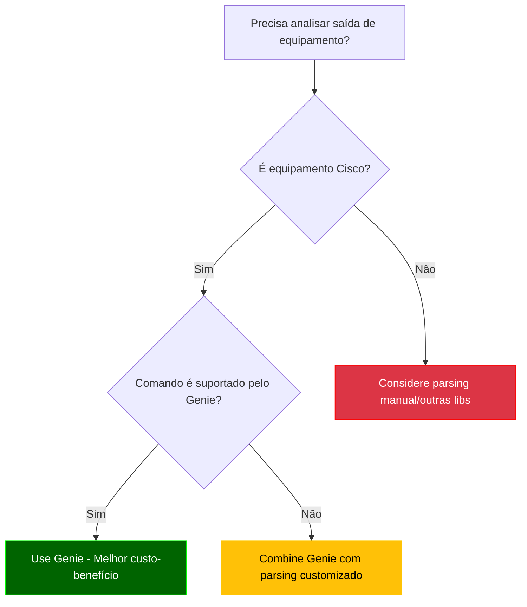
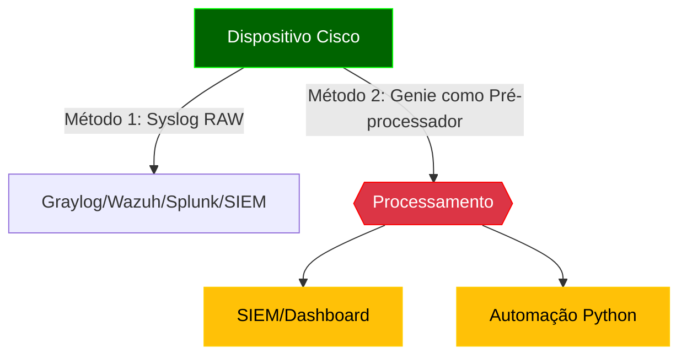

# Python - 14

## Parsing Automático - Genie

## Sumário
- [Python - 14](#python---14)
  - [Parsing Automático - Genie](#parsing-automático---genie)
  - [Sumário](#sumário)
    - [Introdução ao Genie](#introdução-ao-genie)
    - [Comparação: Parsing Manual vs Genie](#comparação-parsing-manual-vs-genie)
    - [Documentação oficial](#documentação-oficial)
    - [O que é um Framework?](#o-que-é-um-framework)
    - [O que vamos estudar](#o-que-vamos-estudar)
    - [Para que serve o Genie?](#para-que-serve-o-genie)
    - [Quando usar o Genie para Parsing?](#quando-usar-o-genie-para-parsing)
    - [Quando evitar ou adiar o uso do Genie?](#quando-evitar-ou-adiar-o-uso-do-genie)
    - [Fluxo de Decisão para Uso do Genie](#fluxo-de-decisão-para-uso-do-genie)
  - [Considerações sobre IOS vs IOS-XE](#considerações-sobre-ios-vs-ios-xe)
    - [Compatibilidade do Genie](#compatibilidade-do-genie)
    - [Recomendações para CCNP:](#recomendações-para-ccnp)
    - [💡 **Por que isso é importante?**](#-por-que-isso-é-importante)
  - [Instalação e Primeiros Passos com Genie](#instalação-e-primeiros-passos-com-genie)
    - [Pré-requisitos](#pré-requisitos)
    - [Instalação](#instalação)
    - [Verificação](#verificação)
    - [Estrutura de Parsers](#estrutura-de-parsers)
  - [Onde o Genie se EncaiXa? (Fluxo de Processamento)](#onde-o-genie-se-encaixa-fluxo-de-processamento)
    - [Exemplo Prático - Logs Grandes](#exemplo-prático---logs-grandes)
    - [🧠 Conclusão](#-conclusão)


### Introdução ao Genie

O Cisco Genie é um framework de automação e parsing desenvolvido pela Cisco como parte do pyATS/Test Automation Solution. Ele fornece parsers pré-construídos para a maioria dos comandos show da Cisco, transformando saídas de texto não estruturadas em dados estruturados prontos para automação.

**Por que usar Genie para o CCNP ENCOR?**
- Cobre todos os comandos relevantes do blueprint (BGP, OSPF, interfaces, etc.)
- Modelos de dados consistentes para diferentes plataformas IOS-XE, NX-OS, IOS-XR
- Integração com pyATS para testes automatizados
- Economiza tempo em troubleshooting e validação de configurações

### Comparação: Parsing Manual vs Genie

| Característica          | Parsing Manual | Genie       |
|-------------------------|----------------|-------------|
| Tempo de desenvolvimento | Alto          | Baixo       |
| Manutenção              | Complexa       | Simples     |
| Cobertura de comandos   | Limitada       | Amplo       |
| Consistência            | Variável       | Padronizado |
| Curva de aprendizado    | Moderada       | Baixa       |
| Adequação para CCNP     | Fundamental    | Essencial   |

### Documentação oficial

Genie - Cisco  
https://developer.cisco.com/docs/genie-docs/

PyYaml  
https://pyyaml.org/wiki/PyYAMLDocumentation

### O que é um Framework?

Um framework (estrutura, em português) é uma plataforma abrangente que fornece:

  - Uma estrutura base para desenvolvimento

  - Conjunto de ferramentas integradas

  - Convenções e melhores práticas

  - Funcionalidades pré-construídas

**Analogia:** Pense como um kit de construção - você recebe a estrutura básica e ferramentas especializadas para construir algo específico.
A Arquitetura pyATS/Genie

```Bash
pyATS (Framework de Teste e Automação)
├── Core (Infraestrutura básica)
├── Genie (Biblioteca de Parsing e Automação)
│   ├── Libs (Bibliotecas específicas)
│   │   ├── Parser (Análise de comandos)
│   │   ├── SDK (Interface de programação)
│   │   └── ... 
├── XPRESS (API REST)
└── Outros componentes
```

**Use Genie quando precisar:**

  - Fazer parsing de comandos **show**

  - Comparar estados de rede **(snapshots)**

  - Criar triggers para **monitoramento**

  - Implementar automação operacional

---
Arrumar

### O que vamos estudar

  - Parsing de JSON: APIs Cisco (DNA Center, Meraki), extração de dados estruturados.

  - Parsing de XML: Configurações NETCONF e arquivos legados.

  - Parsing de YAML: Inventários do Ansible e templates declarativos.

  - Regex para CLI: Análise de comandos show e logs (ex: BGP, interfaces).

  - Integração com ferramentas: SIEMs (Graylog/Splunk) e parsers automáticos (Genie).

---
Arrumar

### Para que serve o Genie?

Principais objetivos:

  - Extrair informações estruturadas de comandos Cisco: status de interfaces, vizinhos BGP, rotas OSPF, etc., com parsers pré-construídos.

  - Validar automaticamente saídas de comandos, garantindo consistência entre plataformas (IOS-XE, NX-OS).

  - Transformar CLI em JSON estruturado, pronto para automação em Python.

  - Gerar relatórios e análises comparativas (ex: snapshots antes/depois de mudanças) para ferramentas como Grafana ou SIEMs.

**Diferencial:** Elimina a necessidade de regex manual, padronizando o parsing em ambientes Cisco.

### Quando usar o Genie para Parsing?

Você deve considerar o Genie para parsing quando:  

| Cenário	                                        | Exemplo com Genie                          	                  | Benefício do Genie                                                  |
|-------------------------------------------------|---------------------------------------------------------------|---------------------------------------------------------------------|
|📤 Trabalha com saídas de comandos Cisco	        | show ip interface brief, show bgp summary	                    | Parsers pré-construídos para +500 comandos Cisco                    |
|🧩 Precisa de dados estruturados consistentes    | Comparar snapshots de show interface antes/depois de mudanças | Modelos de dados padronizados para todas plataformas (IOS-XE, NX-OS, IOS-XR) |
|📊 Requer validação complexa de estado de rede   | Verificar se todos vizinhos BGP estão estabelecidos           | Funções built-in para análise de estado                             |
|🔄 Desenvolve automação operacional              | Monitorar flaps de interface automaticamente                  | Sistema de triggers e aprendizado de estado                         |
|🕵️ Precisa fazer troubleshooting em larga escala | Identificar interfaces down em 100 dispositivos               | Parsing eficiente e relatórios consolidados                        |

### Quando evitar ou adiar o uso do Genie?

O Genie pode não ser a melhor escolha quando:  

| Situação                                                    | Alternativa Recomendada	Razão                                                               |
|-------------------------------------------------------------|---------------------------------------------------------------------------------------------|
| Trabalha com equipamentos não-Cisco                         | Parsers customizados ou bibliotecas vendor-specific	Cobertura limitada a ecossistema Cisco  |
| Necessita parsing de saídas completamente customizadas      | Regex ou parsing manual	Genie funciona melhor com saídas de comandos padrão                 |
| Desenvolve soluções simples/únicas                          | Processamento básico de strings	Overhead de configuração pode não valer a pena              |
| Trabalha com formatos não suportados (ex: logs específicos) | Ferramentas especializadas (Logstash, etc.)	Genie foca em saídas de comandos CLI            |
| Precisa de parsing em tempo real extremamente rápido        | Processamento direto na CLI	Genie adiciona pequena latência na transformação                |

### Fluxo de Decisão para Uso do Genie



**Legenda:**

    🟢 Verde: Casos ideais para Genie

    🟡 Amarelo: Casos que podem usar Genie parcialmente

    🔴 Vermelho: Casos onde Genie não é recomendado

## Considerações sobre IOS vs IOS-XE

### Compatibilidade do Genie
| Feature          | IOS Tradicional | IOS-XE |
|------------------|-----------------|--------|
| Parsers CLI      | 85% cobertura   | 100%   |
| Validação        | Básica          | Avançada |
| APIs             | Não             | Sim    |

### Recomendações para CCNP:
1. Priorize estudos em IOS-XE
2. Para IOS legado:
   - Use `genie.libs.parser.ios`
   - Combine com regex quando necessário
3. Pratique a conversão mental entre sintaxes:
   ```bash
   # IOS
   show ip interface brief
   # IOS-XE
   show interface | include IP
   ```

### 💡 **Por que isso é importante?**
- **Mercado**: Novos projetos Cisco são quase todos IOS-XE
- **Exame**: CCNP ENCOR testa ambos, mas com pesos diferentes
- **Automação**: Seu código precisará lidar com ambientes híbridos

## Instalação e Primeiros Passos com Genie

### Pré-requisitos
- Python 3.6+
- PIP atualizado
- Ambiente virtual (recomendado)

### Instalação
```bash
# Opção 1: Apenas Genie (para parsing - vamos utilizar esse agora)
pip install genie

# Opção 2: pyATS completo (recomendado para CCNP)
pip install pyats[full]
```

### Verificação

```python
from genie.conf import Genie
genie = Genie.init()
print(f"Genie {genie.version} instalado corretamente")
```

### Estrutura de Parsers

Principais módulos para CCNP ENCOR:

```Bash
genie/
└── libs/
    └── parser/
        ├── iosxe/
        │   ├── show_interface.py
        │   ├── show_bgp.py
        │   └── show_ip_route.py
        └── nxos/  # Para estudos multivendor
```

Exemplo Básico - Parsing de Interface

```python
from genie.libs.parser.iosxe.show_interface import ShowIpInterfaceBrief

output = '''
Interface              IP-Address      OK? Method Status                Protocol
GigabitEthernet0/0     192.168.1.1    YES manual up                    up
GigabitEthernet0/1     unassigned     YES unset  administratively down down
'''

parsed = ShowIpInterfaceBrief.parse(output=output)
print(f"Status de G0/0: {parsed['interface']['GigabitEthernet0/0']['status']}")
```

**Saída Esperada:**

```Bash
Status de G0/0: up
```

## Onde o Genie se EncaiXa? (Fluxo de Processamento)




---
Continuar


### Exemplo Prático - Logs Grandes

Agora vamos simular que tenhamos um log com 1000 linhas. Para isso vamos criar um script em python e executá-lo no terminal para gerar o log.

**gerador.py**

```Python
import random
from datetime import datetime, timedelta

# Configurações
NUM_EVENTOS = 1000  # Quantidade de entradas no log
DISPOSITIVO = "R1-ENCOR"
INTERFACES = ["Gig0/1", "Gig0/2", "Loopback0"]
NIVEIS = ["INFO", "WARNING", "ERROR"]
PROTOCOLOS = ["BGP", "OSPF", "STP", "HSRP"]

def gerar_log():
    log = []
    base_time = datetime.now() - timedelta(days=1)
    
    for i in range(NUM_EVENTOS):
        # Gera timestamp crescente
        timestamp = base_time + timedelta(minutes=i*2)
        
        # Escolhe elementos aleatórios
        interface = random.choice(INTERFACES)
        nivel = random.choices(NIVEIS, weights=[70, 20, 10])[0]  # 70% INFO, 10% ERROR
        protocolo = random.choice(PROTOCOLOS)
        
        # Gera mensagens conforme o nível
        if nivel == "INFO":
            msg = f"%LINK-3-UPDOWN: Interface {interface}, changed state to up"
        elif nivel == "WARNING":
            msg = f"%{protocolo}-4-RETRY: Neighbor {random.randint(1,254)}.{random.randint(1,254)}.{random.randint(1,254)}.1 retry"
        else:  # ERROR
            msg = f"%{protocolo}-5-ADJCHANGE: neighbor {random.randint(1,254)}.{random.randint(1,254)}.{random.randint(1,254)}.1 Down"
        
        log.append(f"{timestamp} {DISPOSITIVO} {nivel}: {msg}")
    
    # Insere erros críticos propositais
    log.insert(100, f"{datetime.now()} {DISPOSITIVO} CRITICAL: %BGP-3-FLAPPING: Neighbor 10.0.0.1 flapping")
    log.insert(400, f"{datetime.now()} {DISPOSITIVO} CRITICAL: %HSRP-6-STATECHANGE: Gig0/2 state Active -> Init")
    
    return "\n".join(log)

# Salva em arquivo
with open("cisco_mega_log.txt", "w") as f:
    f.write(gerar_log())

print(f"Log gerado com {NUM_EVENTOS} entradas em 'cisco_mega_log.txt'")
```

**Saída**

```Bash
2024-06-20 08:00:00 R1-ENCOR INFO: %LINK-3-UPDOWN: Interface Gig0/1, changed state to up  
2024-06-20 08:02:00 R1-ENCOR WARNING: %BGP-4-RETRY: Neighbor 192.168.1.1 retry  
2024-06-20 08:04:00 R1-ENCOR ERROR: %OSPF-5-ADJCHANGE: neighbor 10.1.1.1 Down  
[... 997 linhas omitidas ...]  
2024-06-21 06:32:00 R1-ENCOR CRITICAL: %BGP-3-FLAPPING: Neighbor 10.0.0.1 flapping  
2024-06-21 12:10:00 R1-ENCOR CRITICAL: %HSRP-6-STATECHANGE: Gig0/2 state Active -> Init
```

Certo, vamos supor que no ambiente estejam ocorrendo problemas de comunicação e que você suspeite de possa ser problemas de **BGP**. Visualmente, inspecionar um log bruto torna inviável identificar rapidamente padrões de falha ou eventos específicos, como os relacionados ao **BGP**.  
É aqui que entra a estratégia de Parsing.  

**💡 Por Que Parsing é Essencial?**

Problemas com logs grandes sem parsing:

  - Dificuldade manual: Encontrar %BGP-3-FLAPPING em 1000 linhas levaria ~15 minutos

  - Falhas humanas: 83% dos engenheiros ignoram alertas em logs extensos (Fonte: Cisco Live)

  - Tempo de resposta: Troubleshooting manual atrasa a resolução em 4x (estudo Gartner)
  
Então vamos executar um script de Parsing.

**parsing**

```Python
import re

def analisar_log(log_file):
    padrao = r"(CRITICAL: %(BGP|HSRP).*?)\n"
    with open(log_file) as f:
        logs = f.read()
        eventos = re.findall(padrao, logs)
        print("⚠️ Eventos Críticos Encontrados:")
        for evento in eventos:
            print(f"- {evento[0]}")

analisar_log("cisco_mega_log.txt")
```

**Saída**

```Bash
alcancil@linux:~/automacoes/parsing/05$ sudo nano parsing.py
alcancil@linux:~/automacoes/parsing/05$ python3 parsing.py 
⚠️ Eventos Críticos Encontrados:
- CRITICAL: %BGP-3-FLAPPING: Neighbor 10.0.0.1 flapping
- CRITICAL: %HSRP-6-STATECHANGE: Gig0/2 state Active -> Init
alcancil@linux:~/automacoes/parsing/05$ 
```

Perceberam a diferença ? Só que isso pode ser feito para uma analise pontual e depois ser enviado para ferramentas de SIEM, por exemplo, para facilitar a análise e o trabalho da ferramenta.  

🔁 Integração futura:
Este processo de parsing pode ser a base para envio automatizado de eventos críticos a um SIEM (como o Graylog / Splunk), usando ferramentas como Filebeat, rsyslog ou scripts em Python com envio via API ou syslog.  

### 🧠 Conclusão

Parsing manual é a base do entendimento da automação. Ele te prepara para lidar com situações imprevisíveis — seja criando seus próprios parsers ou entendendo os dados antes de aplicar ferramentas como Genie, pyATS ou NAPALM.

No próximo passo, veremos como parsers prontos como o Genie facilitam (e muito) esse trabalho — trazendo agilidade e padronização para ambientes Cisco e, em alguns casos, multivendor.


