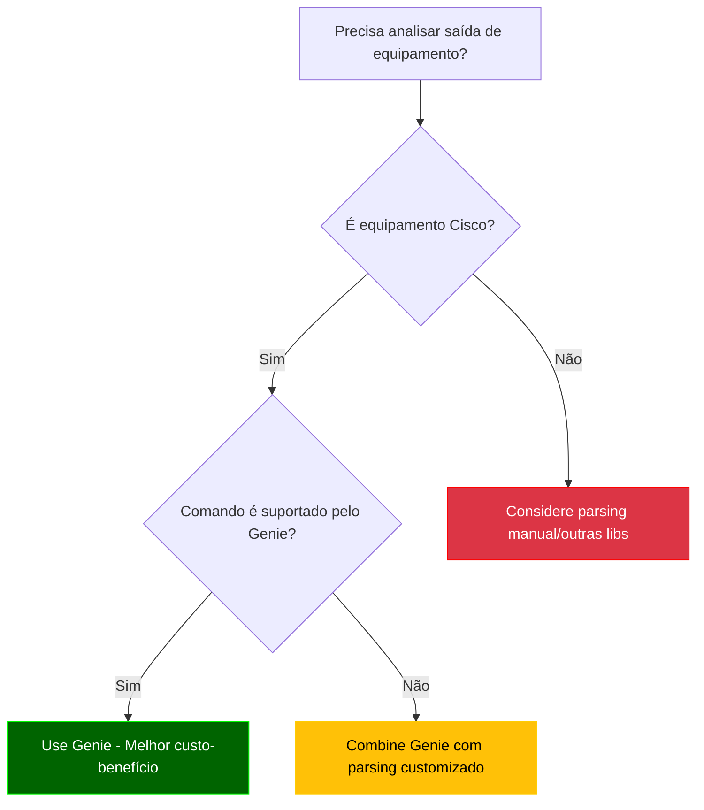
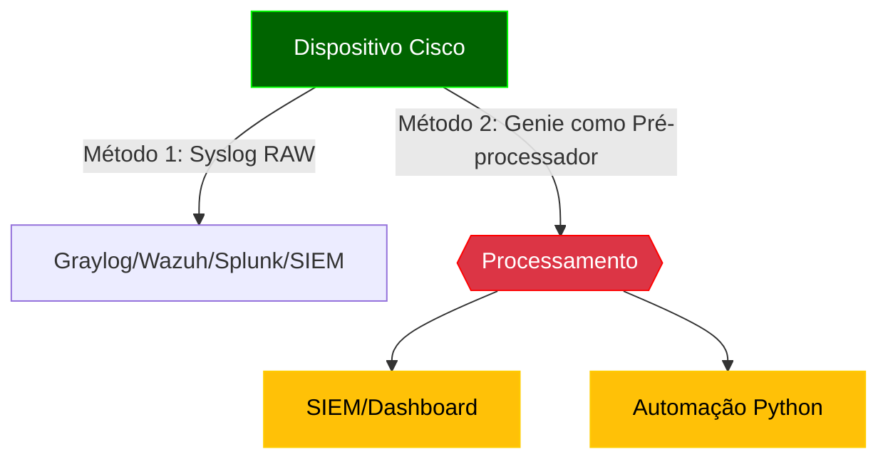
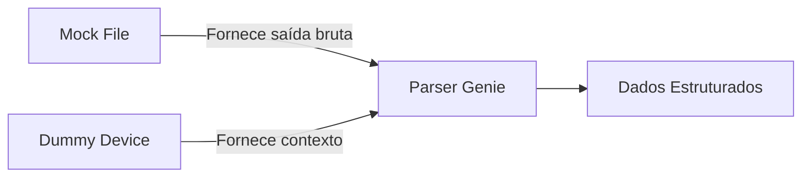

# Python - 14

## Parsing Automático - Genie

## Sumário
- [Python - 14](#python---14)
  - [Parsing Automático - Genie](#parsing-automático---genie)
  - [Sumário](#sumário)
    - [Introdução ao Genie](#introdução-ao-genie)
    - [⚠️ Aviso sobre Versões do Python](#️-aviso-sobre-versões-do-python)
    - [Comparação: Parsing Manual vs Genie](#comparação-parsing-manual-vs-genie)
    - [Documentação oficial](#documentação-oficial)
    - [O que é um Framework?](#o-que-é-um-framework)
    - [O que vamos estudar](#o-que-vamos-estudar)
    - [Para que serve o Genie?](#para-que-serve-o-genie)
    - [Quando usar o Genie para Parsing?](#quando-usar-o-genie-para-parsing)
    - [Quando evitar ou adiar o uso do Genie?](#quando-evitar-ou-adiar-o-uso-do-genie)
    - [Fluxo de Decisão para Uso do Genie](#fluxo-de-decisão-para-uso-do-genie)
  - [Considerações sobre IOS vs IOS-XE](#considerações-sobre-ios-vs-ios-xe)
    - [Compatibilidade do Genie](#compatibilidade-do-genie)
    - [Recomendações para CCNP:](#recomendações-para-ccnp)
    - [💡 **Por que isso é importante?**](#-por-que-isso-é-importante)
  - [Instalação e Primeiros Passos com Genie](#instalação-e-primeiros-passos-com-genie)
    - [Pré-requisitos](#pré-requisitos)
    - [Instalação](#instalação)
    - [Verificação](#verificação)
    - [Estrutura de Parsers](#estrutura-de-parsers)
  - [Onde o Genie se Encaixa? (Fluxo de Processamento)](#onde-o-genie-se-encaixa-fluxo-de-processamento)
    - [Abordagens Comparadas](#abordagens-comparadas)
    - [Casos de Uso Típicos do Genie](#casos-de-uso-típicos-do-genie)
    - [Quando NÃO Usar Genie?](#quando-não-usar-genie)
    - [Recomendações de Uso](#recomendações-de-uso)
    - [Casos de Uso do Genie (do Básico ao Avançado)](#casos-de-uso-do-genie-do-básico-ao-avançado)
    - [Usando pyATS + Genie - testbed.yaml](#usando-pyats--genie---testbedyaml)
    - [E quando usamos apenas o Genie?](#e-quando-usamos-apenas-o-genie)
    - [Conceitos Fundamentais no Genie: Mock Files e Dummy Devices](#conceitos-fundamentais-no-genie-mock-files-e-dummy-devices)
    - [Boas Práticas para Mocks no Genie](#boas-práticas-para-mocks-no-genie)
    - [Dummy Devices (Dispositivos Simulados)](#dummy-devices-dispositivos-simulados)
    - [Relação entre os Conceitos](#relação-entre-os-conceitos)
  - [Quando Usar?](#quando-usar)
    - [Boas práticas para Dummy Devices no Genie](#boas-práticas-para-dummy-devices-no-genie)
    - [O que é uma classe?](#o-que-é-uma-classe)
    - [O que é herança?](#o-que-é-herança)
    - [O que é def dentro de uma classe?](#o-que-é-def-dentro-de-uma-classe)
    - [Exemplo com mock files e Dummy Devices](#exemplo-com-mock-files-e-dummy-devices)
    - [Exemplos](#exemplos)
  - [Exemplo 01: Parsing de show ip interface brief com Genie](#exemplo-01-parsing-de-show-ip-interface-brief-com-genie)
  - [Exemplo 02: Parsing de show version com Genie](#exemplo-02-parsing-de-show-version-com-genie)
    - [✅ Instalação manual do Python 3.10.17 (sem sobrescrever o Python do sistema)](#-instalação-manual-do-python-31017-sem-sobrescrever-o-python-do-sistema)
    - [1. Verifica versões disponíveis](#1-verifica-versões-disponíveis)
    - [2. Cria e ativa o ambiente](#2-cria-e-ativa-o-ambiente)
    - [3. Confirma a versão no ambiente](#3-confirma-a-versão-no-ambiente)
  - [Exemplo 03: Parsing de show vlan brief com Genie + pyenv](#exemplo-03-parsing-de-show-vlan-brief-com-genie--pyenv)
- [Na pasta do seu projeto:](#na-pasta-do-seu-projeto)
    - [📚 Glossário](#-glossário)
  - [A](#a)
  - [C](#c)
  - [D](#d)
  - [F](#f)
  - [G](#g)
  - [H](#h)
  - [I](#i)
  - [J](#j)
  - [M](#m)
  - [N](#n)
  - [O](#o)
  - [P](#p)
  - [R](#r)
  - [S](#s)
  - [T](#t)
  - [V](#v)
  - [Y](#y)


### Introdução ao Genie

O Cisco Genie é um framework de automação e parsing desenvolvido pela Cisco como parte do pyATS/Test Automation Solution. Ele fornece parsers pré-construídos para a maioria dos comandos show da Cisco, transformando saídas de texto não estruturadas em dados estruturados prontos para automação.

**Por que usar Genie para o CCNP ENCOR?**
- Cobre todos os comandos relevantes do blueprint (BGP, OSPF, interfaces, etc.)
- Modelos de dados consistentes para diferentes plataformas IOS-XE, NX-OS, IOS-XR
- Integração com pyATS para testes automatizados
- Economiza tempo em troubleshooting e validação de configurações

### ⚠️ Aviso sobre Versões do Python

Os exemplos deste guia foram testados em Python 3.10.17.  

Cuidados com versões diferentes:

**Python < 3.6:**

  - Não suporta f-strings (use .format() ou concatenação).

  - Incompatível com Genie/pyATS.

**Python ≥ 3.12:**

  - Pode gerar erros com parsers do Genie em mock files.

  - Solução recomendada:
    
    ```bash
    pyenv install 3.10.17  # Usando pyenv
    pyenv global 3.10.17   # Define como versão padrão
    ```

**Regra de ouro:**

✅ Sempre consulte a documentação oficial:

  [Python: What's New](https://docs.python.org/3/whatsnew/)

  [Genie](https://developer.cisco.com/docs/genie-docs/)

### Comparação: Parsing Manual vs Genie

| Característica          | Parsing Manual | Genie       |
|-------------------------|----------------|-------------|
| Tempo de desenvolvimento | Alto          | Baixo       |
| Manutenção              | Complexa       | Simples     |
| Cobertura de comandos   | Limitada       | Amplo       |
| Consistência            | Variável       | Padronizado |
| Curva de aprendizado    | Moderada       | Baixa       |
| Adequação para CCNP     | Fundamental    | Essencial   |

### Documentação oficial

Genie - Cisco  
https://developer.cisco.com/docs/genie-docs/

PyYaml  
https://pyyaml.org/wiki/PyYAMLDocumentation

### O que é um Framework?

Um framework (estrutura, em português) é uma plataforma abrangente que fornece:

  - Uma estrutura base para desenvolvimento

  - Conjunto de ferramentas integradas

  - Convenções e melhores práticas

  - Funcionalidades pré-construídas

**Analogia:** Pense como um kit de construção - você recebe a estrutura básica e ferramentas especializadas para construir algo específico.
A Arquitetura pyATS/Genie

```Bash
pyATS (Framework de Teste e Automação)
├── Core (Infraestrutura básica)
├── Genie (Biblioteca de Parsing e Automação)
│   ├── Libs (Bibliotecas específicas)
│   │   ├── Parser (Análise de comandos)
│   │   ├── SDK (Interface de programação)
│   │   └── ... 
├── XPRESS (API REST)
└── Outros componentes
```

**Use Genie quando precisar:**

  - Fazer parsing de comandos **show**

  - Comparar estados de rede **(snapshots)**

  - Criar triggers para **monitoramento**

  - Implementar automação operacional

---
Arrumar

### O que vamos estudar

  - Parsing de JSON: APIs Cisco (DNA Center, Meraki), extração de dados estruturados.

  - Parsing de XML: Configurações NETCONF e arquivos legados.

  - Parsing de YAML: Inventários do Ansible e templates declarativos.

  - Regex para CLI: Análise de comandos show e logs (ex: BGP, interfaces).

  - Integração com ferramentas: SIEMs (Graylog/Splunk) e parsers automáticos (Genie).

---
Arrumar

### Para que serve o Genie?

Principais objetivos:

  - Extrair informações estruturadas de comandos Cisco: status de interfaces, vizinhos BGP, rotas OSPF, etc., com parsers pré-construídos.

  - Validar automaticamente saídas de comandos, garantindo consistência entre plataformas (IOS-XE, NX-OS).

  - Transformar CLI em JSON estruturado, pronto para automação em Python.

  - Gerar relatórios e análises comparativas (ex: snapshots antes/depois de mudanças) para ferramentas como Grafana ou SIEMs.

**Diferencial:** Elimina a necessidade de regex manual, padronizando o parsing em ambientes Cisco.

### Quando usar o Genie para Parsing?

Você deve considerar o Genie para parsing quando:  

| Cenário	                                        | Exemplo com Genie                          	                  | Benefício do Genie                                                  |
|-------------------------------------------------|---------------------------------------------------------------|---------------------------------------------------------------------|
|📤 Trabalha com saídas de comandos Cisco	        | show ip interface brief, show bgp summary	                    | Parsers pré-construídos para +500 comandos Cisco                    |
|🧩 Precisa de dados estruturados consistentes    | Comparar snapshots de show interface antes/depois de mudanças | Modelos de dados padronizados para todas plataformas (IOS-XE, NX-OS, IOS-XR) |
|📊 Requer validação complexa de estado de rede   | Verificar se todos vizinhos BGP estão estabelecidos           | Funções built-in para análise de estado                             |
|🔄 Desenvolve automação operacional              | Monitorar flaps de interface automaticamente                  | Sistema de triggers e aprendizado de estado                         |
|🕵️ Precisa fazer troubleshooting em larga escala | Identificar interfaces down em 100 dispositivos               | Parsing eficiente e relatórios consolidados                        |

### Quando evitar ou adiar o uso do Genie?

O Genie pode não ser a melhor escolha quando:  

| Situação                                                    | Alternativa Recomendada	Razão                                                               |
|-------------------------------------------------------------|---------------------------------------------------------------------------------------------|
| Trabalha com equipamentos não-Cisco                         | Parsers customizados ou bibliotecas vendor-specific	Cobertura limitada a ecossistema Cisco  |
| Necessita parsing de saídas completamente customizadas      | Regex ou parsing manual	Genie funciona melhor com saídas de comandos padrão                 |
| Desenvolve soluções simples/únicas                          | Processamento básico de strings	Overhead de configuração pode não valer a pena              |
| Trabalha com formatos não suportados (ex: logs específicos) | Ferramentas especializadas (Logstash, etc.)	Genie foca em saídas de comandos CLI            |
| Precisa de parsing em tempo real extremamente rápido        | Processamento direto na CLI	Genie adiciona pequena latência na transformação                |

### Fluxo de Decisão para Uso do Genie



**Legenda:**

    🟢 Verde: Casos ideais para Genie

    🟡 Amarelo: Casos que podem usar Genie parcialmente

    🔴 Vermelho: Casos onde Genie não é recomendado

## Considerações sobre IOS vs IOS-XE

### Compatibilidade do Genie
| Feature          | IOS Tradicional | IOS-XE |
|------------------|-----------------|--------|
| Parsers CLI      | 85% cobertura   | 100%   |
| Validação        | Básica          | Avançada |
| APIs             | Não             | Sim    |

### Recomendações para CCNP:
1. Priorize estudos em IOS-XE
2. Para IOS legado:
   - Use `genie.libs.parser.ios`
   - Combine com regex quando necessário
3. Pratique a conversão mental entre sintaxes:
   ```bash
   # IOS
   show ip interface brief
   # IOS-XE
   show interface | include IP
   ```

### 💡 **Por que isso é importante?**
- **Mercado**: Novos projetos Cisco são quase todos IOS-XE
- **Exame**: CCNP ENCOR testa ambos, mas com pesos diferentes
- **Automação**: Seu código precisará lidar com ambientes híbridos

## Instalação e Primeiros Passos com Genie

### Pré-requisitos
- Python 3.6+
- PIP atualizado
- Ambiente virtual (recomendado)

### Instalação
```bash
# Opção 1: Apenas Genie (para parsing - vamos utilizar esse agora)
pip install genie

# Opção 2: pyATS completo (recomendado para CCNP)
pip install pyats[full]
```

### Verificação

```python
from genie.conf import Genie
genie = Genie.init()
print(f"Genie {genie.version} instalado corretamente")
```

### Estrutura de Parsers

Principais módulos para CCNP ENCOR:

```Bash
genie/
└── libs/
    └── parser/
        ├── iosxe/
        │   ├── show_interface.py
        │   ├── show_bgp.py
        │   └── show_ip_route.py
        └── nxos/  # Para estudos multivendor
```

Exemplo Básico - Parsing de Interface

```python
from genie.libs.parser.iosxe.show_interface import ShowIpInterfaceBrief

output = '''
Interface              IP-Address      OK? Method Status                Protocol
GigabitEthernet0/0     192.168.1.1    YES manual up                    up
GigabitEthernet0/1     unassigned     YES unset  administratively down down
'''

parsed = ShowIpInterfaceBrief.parse(output=output)
print(f"Status de G0/0: {parsed['interface']['GigabitEthernet0/0']['status']}")
```

**Saída Esperada:**

```Bash
Status de G0/0: up
```

## Onde o Genie se Encaixa? (Fluxo de Processamento)



### Abordagens Comparadas

**Abordagem 1: Syslog Direto (Sem Genie)**

Como funciona:
    
  ```bash
    Router(config)# logging host 10.0.0.100  # Envia logs brutos para Graylog
  ```
    
**Prós:**

  - Simplicidade de configuração

  - Baixa latência

**Contras:**

  - Dados não estruturados (ex: %BGP-5-ADJCHANGE: neighbor 10.0.0.1 Down)

  - Necessidade de parsers no SIEM (GroK, regex)

  - Limitado a eventos pré-definidos

**Abordagem 2: Genie como Pré-processador (Recomendada para CCNP/automação)**

Fluxo:

  - Script Python coleta dados via SSH/API (ex: show bgp summary)

  - Genie faz parsing estruturado:
      
      ```python
        from genie.libs.parser.iosxe.show_bgp import ShowBgpAllSummary
        parsed = ShowBgpAllSummary.parse(device_output)
      ```
        
Dados são:

  - Enviados para SIEM como JSON estruturado

  - Ou processados localmente (ex: alertas via Slack)

**Vantagens:**

  - Estruturação RICA: Transforma "up/down" em {"bgp_neighbors": {"10.0.0.1": {"state": "down", "uptime": "00:01:23"}}}

  - Contexto para Troubleshooting: Mantém relações entre dados (ex: interface + BGP + OSPF)

  - Validação Automática: Checa se dados estão completos antes do envio

  - Preparação para CCNP: Pratica comandos show e análise estruturada

### Casos de Uso Típicos do Genie

| Cenário         | Exemplo	Vantagem vs. Syslog Bruto                                           |
|-----------------|-----------------------------------------------------------------------------|
| Troubleshooting	| Extrair todos vizinhos BGP inativos	Dados prontos para análise em Grafana   |
| Compliance      | Verificar se todas interfaces têm descrição	Validação programática          | 
| Monitoramento   | Alertar se >50% da CPU por 5min	Correlação com outros dados                 |

### Quando NÃO Usar Genie?

- Logs de Eventos Simples (ex: %LINK-UPDOWN): Syslog direto é suficiente

- Ambientes Não-Cisco: Genie tem suporte limitado a outros vendors

- Latência Crítica: Parsing adiciona ~100-500ms de processamento

### Recomendações de Uso

**Comparação Detalhada**

| Ferramenta        | Cisco      | Juniper | Arista | Nokia | API First | Learning Mode |
|-------------------|------------|---------|--------|-------|-----------|---------------|
| Genie             | ✅✅✅   | ✅      | ✅     | ❌   | ✅        | ✅           |
| TextFSM           | ✅✅      | ✅✅	 | ✅✅	 | ✅    | ❌	      | ❌            |
| PyATS             | ✅✅✅    | ✅	   | ✅     | ✅   | ✅        | ✅           |
| Ansible cli_parse | ✅✅      | ✅✅   | ✅✅  | ✅✅ | ✅        | ❌           |
| Scrapli	          | ✅✅      | ✅✅   | ✅     | ❌   | ✅        | ❌           |

Legenda: ✅✅✅ = Suporte nativo completo | ✅ = Suporte básico

**Quando Usar Cada Uma?**

  - Ambientes Cisco-dominantess → Genie/PyATS

  - Multivendor com foco em legacy → TextFSM + NTC-Templates

  - Automação com Ansible existente → cli_parse

  - Performance crítica → Scrapli

### Casos de Uso do Genie (do Básico ao Avançado)

| Comando                 | Protocolo/Feature | Aplicação Típica                                                             |
|-------------------------|-------------------|------------------------------------------------------------------------------|
| show ip interface brief | Interfaces        | Verificar status (up/down) e endereços IP das interfaces.                    |
| show version            | Sistema           | Coletar modelo, versão do IOS e tempo de operação (uptime).                  |
| show vlan brief         | VLANs (Switches)  | Listar VLANs configuradas e portas associadas.                               |
| show cdp neighbors      | Topologia         | Mapear dispositivos vizinhos e conexões.                                     |
| show ip ospf neighbor   | OSPF              | Verificar adjacências (FULL/DOWN) e problemas de vizinhança.                 |
| show ip eigrp neighbors | EIGRP             | Monitorar estabilidade de vizinhos EIGRP.                                    |
| show bgp summary        | BGP               | Checar sessões com peers (estabelecidas/pendentes) e contagem de rotas.      |
| show ip route	          | Roteamento	      | Analisar rotas (OSPF, EIGRP, estáticas) e métricas.                          |
| show running-config     | Configuração      | Auditoria de segurança (ACLs, SNMP) ou compliance (descrição de interfaces). |
| show interface trunk    | VLANs (Trunks)    | Verificar trunks configurados e modo de encapsulamento (802.1Q).             |
| Snapshot (antes/depois) | Todos             | Validar impactos de mudanças (ex.: interfaces que caíram após upgrade).      |
| show tech-support       | Diagnóstico	      | Troubleshooting avançado (combina dados de múltiplos comandos).              |

### Usando pyATS + Genie - testbed.yaml

Quando usamos o pyATS junto com o Genie em um ambiente real, o primeiro passo é criar um arquivo chamado testbed.yaml. Esse arquivo descreve os dispositivos da rede (nome, IP, sistema operacional, credenciais, etc).  

O próprio pyATS pode gerar automaticamente esse arquivo a partir de conexões SSH reais. Esse processo coleta informações do ambiente e cria um "mapa da rede", chamado de snapshot. Isso traz um certo overhead, já que depende da conexão com os equipamentos.  

Uma vez que o testbed.yaml está disponível e o dispositivo é conectado com device.connect(), o Genie pode usar comandos como:  

```python
device.parse("show version")
```

E então, ele escolhe automaticamente o parser correto baseado no sistema operacional e no comando.  

### E quando usamos apenas o Genie?

Quando não temos uma rede real (como neste projeto), podemos usar o Genie isoladamente, sem o pyATS conectado. Nesse caso:  

  - Criamos arquivos simulando a saída dos comandos (mock files),

  - E usamos objetos de teste (DummyDevice) para representar o equipamento.

Como não existe conexão real nem testbed.yaml, o Genie não consegue identificar o parser automaticamente. Por isso, precisamos informar manualmente qual parser será usado:

```python
from genie.libs.parser.iosxe.show_version import ShowVersion
```

Essa abordagem é mais simples e ideal para estudo, testes locais e automação offline.

### Conceitos Fundamentais no Genie: Mock Files e Dummy Devices

Antes de avançarmos, é essencial entender dois pilares do Genie/pyATS para automação e testes:

**1. Mock Files (Arquivos de Simulação)**

**O que são?**  

Arquivos de texto (.txt) que contêm saídas simuladas de comandos Cisco, como show version ou show ip interface brief. Esses arquivos imitam exatamente o que um dispositivo real retornaria via CLI.

**Por que usar?**

    ✅ Teste sem equipamentos: Permite desenvolver e validar parsers sem acesso físico a roteadores/switches.

    ✅ Consistência: Garante que o parser sempre receba a mesma entrada (útil para depuração).

    ✅ Eficiência: Elimina a latência de conexões SSH/Telnet durante o desenvolvimento.

**Exemplo Prático:**

```python
# mock_data/show_version.txt
Cisco IOS XE Software, Version 17.03.04
Router uptime is 1 week, 2 days
System image file is "bootflash:isr4300-universalk9.17.03.04.SPA.bin"
```

| Vantagem                      | Explicação                                                                           |
|-------------------------------|--------------------------------------------------------------------------------------|
| ✅ Não depende de laboratório | Você pode estudar e desenvolver seu código sem ter acesso a equipamentos reais       |
| ✅ Reprodutível               | O conteúdo é sempre o mesmo, então facilita testes e debug                           |
| ✅ Ideal para aprendizado     | Te permite focar no parsing e na lógica, sem se preocupar com conexões ou permissões |
| ✅ Rápido e leve              | Você roda tudo localmente em segundos, com arquivos .txt                             |

**📌 Exemplo de conteúdo mock (simulação de saída)**

```Bash
Interface              IP-Address      OK? Method Status                Protocol
GigabitEthernet0/0     192.168.1.1     YES manual up                    up
GigabitEthernet0/1     unassigned      YES unset  administratively down down
Loopback0              10.0.0.1        YES manual up                    up
```

Isso imita a resposta real do roteador, e permite que o parser Genie funcione corretamente.  

### Boas Práticas para Mocks no Genie

Para Projetos Reais:

1. Estrutura de Pastas:

```Bash

    project/
    ├── src/
    │   ├── parsers/
    │   └── tests/
    │       ├── mock_data/
    │       │   ├── iosxe/
    │       │   │   ├── show_version.txt
    │       │   │   └── show_interface.txt
    │       └── test_parsers.py
```

2. Nomenclatura:

   - Use nomes descritivos: iosxe_show_version_v17.3.4.txt.

3. Validação:

   - Sempre verifique se o mock corresponde à saída real (copie do dispositivo se possível).  

4. Para Fins Didáticos:

   - Mantenha os mocks em arquivos separados.

   - Adicione comentários explicativos no mock:

```Bash
# mock_data/show_version.txt
# Saída simulada de um Cisco ISR4321 com IOS-XE 17.03.04
# Última atualização: 2024-06-01
Cisco IOS XE Software, Version 17.03.04
...
```

5. Armazene em pastas mock_data/ separadas por OS (ex: iosxe/, nxos/).  

6. Nomeie os arquivos com o comando e versão (ex: show_version_iosxe_17.3.4.txt).

### Dummy Devices (Dispositivos Simulados)

**O que são?**  

Classes Python simples que emulam um dispositivo de rede (roteador, switch) para fins de teste. Elas fornecem os atributos mínimos que o Genie precisa para operar (como os e type).  

**Por que usar?**  

    ✅ Abstração: Testa parsers sem configurar conexões complexas.

    ✅ Flexibilidade: Simula diferentes sistemas operacionais (IOS-XE, NX-OS) mudando apenas self.os.

    ✅ Isolamento: Valida apenas a lógica de parsing, sem interferência de falhas de rede.

Exemplo Prático:

**Atributos essenciais:**

```python
class DummyDevice:
    def __init__(self, os='iosxe', name='lab-router'):
        self.os = os  # Define o sistema operacional (crucial para o Genie)
        self.name = name  # Identificação opcional
```

**Uso típico**

```python
device = DummyDevice(os='iosxe')
parser = ShowVersion(device=device)  # O parser usa 'os' para selecionar a implementação correta
```

### Relação entre os Conceitos



- Mock File: Simula o que o dispositivo envia (dados).

- Dummy Device: Simula quem envia (contexto: IOS-XE, NX-OS, etc.).

## Quando Usar?

| Cenário	Mock               | File                   | Dummy Device                   |
|----------------------------|------------------------|--------------------------------|
| Desenvolvimento local      | ✅                     | ✅                            |
| Testes em CI/CD            | ✅	                   | ✅                            |
| Validação rápida           | ❌ (Use string direta) | ✅                            |
| Conexão a dispositivo real | ❌	                   | ❌ (Use Device real)          |  

### Boas práticas para Dummy Devices no Genie

Adicione apenas os atributos essenciais (os, type, name).

Use herança para casos complexos:

```python

class DummyISR(DummyDevice):
    def __init__(self):
        super().__init__(os='iosxe', type='router', name='isr4321')
```

**OBS:** Vamos a uma breve explicação sobre Classes e Funções

### O que é uma classe?

No Python (e em programação orientada a objetos), uma classe é como um molde ou modelo para criar objetos. Ela define características (atributos) e ações (métodos) que aquele tipo de objeto pode ter.

Exemplo simples:

```python
class Roteador:
    def __init__(self, modelo):
        self.modelo = modelo
```

Com essa classe, você pode criar vários roteadores:

```python
r1 = Roteador('ISR4321')
r2 = Roteador('ASR1001')
``` 

### O que é herança?

Herança é quando você cria uma nova classe baseada em outra. A nova classe herda os atributos e comportamentos da classe original e pode personalizar ou expandir o que for necessário.

No exemplo:

```Python
class DummyISR(DummyDevice):
    def __init__(self):
        super().__init__(os='iosxe', type='router', name='isr4321')
```

Então estamos dizendo:

    “Quero criar um roteador de testes chamado DummyISR que já vem configurado como um router IOS-XE chamado isr4321, reutilizando tudo que já existe na classe DummyDevice.”

**📌 Resumo**  

| Conceito | Explicação curta                                      |              
|----------|-------------------------------------------------------|
| Classe   | Modelo para criar objetos (ex: roteadores, switches)  |
| Herança  | Reutilização de uma classe existente em outra         |

- Essa técnica torna o código mais organizado, reutilizável e profissional, principalmente em projetos maiores.

### O que é def dentro de uma classe?

A palavra-chave def no Python é usada para definir uma função — e quando essa função está dentro de uma classe, ela é chamada de método.

**Por que usar def dentro de uma classe?**

Porque assim você define comportamentos específicos que os objetos daquela classe podem executar.

Por exemplo:

```Python
class Roteador:
    def __init__(self, modelo):
        self.modelo = modelo

    def exibir_modelo(self):
        print(f"O modelo é: {self.modelo}")
```

Aqui temos:

  - __init__: um método especial que é chamado automaticamente quando o objeto é criado.

  - **exibir_modelo:** um método criado por você, que exibe o modelo do roteador.

**Por que __init__ é especial?**

É o construtor da classe. Ele é chamado automaticamente quando você cria um novo objeto.

```Python
r1 = Roteador('ISR4321')  # Chama __init__ automaticamente
r1.exibir_modelo()        # Chama o método da classe
```

**Resumo**

| Elemento      | O que faz                                       |
|---------------|-------------------------------------------------|
| def           | Define uma função (ou método, dentro da classe) |
| __init__      | Inicializa os atributos do objeto (construtor)  |
| Outros métodos| Definem ações que o objeto pode executar        |

### Exemplo com mock files e Dummy Devices

```Python
from genie.libs.parser.iosxe.show_version import ShowVersion

# 1. Dispositivo simulado
class DummyRouter:
    def __init__(self):
        self.os = 'iosxe'  # Atributo obrigatório para o Genie
        self.name = 'lab-device'

# 2. Mock file
with open('mock_data/show_version.txt') as f:
    raw_output = f.read()

# 3. Parsing
device = DummyRouter()
parsed = ShowVersion(device).parse(output=raw_output)

print(f"Versão: {parsed['version']['version_short']}")
```

### Exemplos

## Exemplo 01: Parsing de show ip interface brief com Genie

**Objetivo:** Extrair status e endereços IP de interfaces de forma estruturada.  

**📁 Estrutura recomendada**

```Bash
genie/
└── 01/
    ├── parse_interface_brief.py
    └── mock_data/
        └── show_ip_interface_brief.txt
```

**Requisitos: requirements.txt**

```txt
pyats[full]  
```

**OBS:** aqui estou instalado o pyats[full] pois ele já instala o Genie na versão mais completa e compatível com a versão do pyats. Dessa maneira não falta nenhuma dependência para o projeto e prevê futuros crescimentos no script como conexões a equipamentos via ssh. A "suite" completa tem 500 Mb, já o Genie ocuparia 200 Mb.

**show_ip_interface_brief.txt**

```txt
Interface              IP-Address      OK? Method Status                Protocol
GigabitEthernet1       unassigned      YES unset  administratively down down    
GigabitEthernet2       10.1.1.1        YES manual up                    up      
Loopback0              192.168.0.1     YES manual up                    up      
```

**parse_interface_brief.py**

```python
[01] from genie.libs.parser.iosxe.show_interface import ShowIpInterfaceBrief
[02] 
[03] class DummyDevice:
[04]     def __init__(self, name='mock'):
[05]         self.name = name
[06] 
[07] device = DummyDevice()
[08] 
[09] # Leitura do conteúdo mock
[10] with open('mock_data/show_ip_interface_brief.txt') as f:
[11]     raw_output = f.read()
[12]
[13] # Parsing
[14] parser = ShowIpInterfaceBrief(device=device)
[15] parsed = parser.parse(output=raw_output)
[16] 
[17] print("\n=== Interfaces Ativas ===")
[18] for intf, details in parsed['interface'].items():
[19]     if details.get('status', '').strip() == 'up':
[20]         print(f"{intf}:")
[21]         print(f"  IP: {details.get('ip_address', 'N/A').strip()}")
[22]         print(f"  Status: {details.get('status', 'N/A').strip()}")
[23]         print(f"  Protocolo: {details.get('protocol', 'N/A').strip()}\n")
[24]
[25] print("\n=== Interfaces Inativas ===")
[26] for intf, details in parsed['interface'].items():
[27]     if details.get('status', '').strip() != 'up':
[28]         print(f"{intf}: {details.get('status', 'unknown').strip()}")
```

**Saída**

```Bash
alcancil@linux:~/automacoes/genie/01$ python3 -m venv genie
alcancil@linux:~/automacoes/genie/01$ source genie/bin/activate
genie) alcancil@linux:~/automacoes/genie/01$ pip install -r requiremnets.txt 
Collecting pyats[full] (from -r requiremnets.txt (line 1))
  Using cached pyats-25.5-cp312-cp312-manylinux2014_x86_64.whl.metadata (4.5 kB)
Collecting packaging>=20.0 (from pyats[full]->-r requiremnets.txt (line 1))
  Using cached packaging-25.0-py3-none-any.whl.metadata (3.3 kB)
Collecting pyats.aereport<25.6.0,>=25.5.0 (from pyats[full]->-r requiremnets.txt (line 1))
  Using cached pyats.aereport-25.5-cp312-cp312-manylinux2014_x86_64.whl.metadata (3.2 kB)
...
4.67.1 types-python-dateutil-2.9.0.20250516 typing-extensions-4.14.0 unicon-25.5 unicon.plugins-25.5 urllib3-2.5.0 wcwidth-0.2.13 websocket-client-1.8.0 wheel-0.45.1 wsproto-1.2.0 xlrd-1.2.0 xlsxwriter-3.2.5 xlwt-1.3.0 xmltodict-0.12.0 yamllint-1.37.1 yang.connector-25.5 yarl-1.20.1
(genie) alcancil@linux:~/automacoes/genie/01$ python3 parse_interface_brief.py 
/home/alcancil/automacoes/genie/01/genie/lib/python3.12/site-packages/unicon/__init__.py:10: UserWarning: pkg_resources is deprecated as an API. See https://setuptools.pypa.io/en/latest/pkg_resources.html. The pkg_resources package is slated for removal as early as 2025-11-30. Refrain from using this package or pin to Setuptools<81.
  from unicon.core.pluginmanager import PluginManager

=== Interfaces Ativas ===
GigabitEthernet2:
  IP: 10.1.1.1
  Status: up
  Protocolo: up

Loopback0:
  IP: 192.168.0.1
  Status: up
  Protocolo: up


=== Interfaces Inativas ===
GigabitEthernet1: administratively down
(genie) alcancil@linux:~/automacoes/genie/01$ 
```

**Explicação**

```Python
[Bloco 1] Importação da biblioteca Genie

[01] from genie.libs.parser.iosxe.show_interface import ShowIpInterfaceBrief    # Importa o parser específico do comando 'show ip interface brief' para dispositivos IOS-XE

[Bloco 2] Criação de um dispositivo simulado (Dummy)

[03] class DummyDevice:                                                         # Define uma classe fictícia que simula um "device" para o parser funcionar
[04]     def __init__(self, name='mock'):                                       # Método construtor da classe
[05]         self.name = name                                                   # Atribui um nome ao dispositivo (apenas para satisfazer o parser)
[07] device = DummyDevice()                                                     # Instancia o dispositivo simulado

[Bloco 3] Leitura da saída simulada do comando CLI

[09] # Leitura do conteúdo mock
[10] with open('mock_data/show_ip_interface_brief.txt') as f:                   # Abre o arquivo contendo a saída simulada do comando
[11]     raw_output = f.read()                                                  # Lê todo o conteúdo do arquivo e armazena na variável

[Bloco 4] Parsing da saída usando Genie

[13] # Parsing
[14] parser = ShowIpInterfaceBrief(device=device)                               # Cria o objeto parser, passando o dispositivo simulado como parâmetro
[15] parsed = parser.parse(output=raw_output)                                   # Executa o parsing da saída CLI e armazena os dados estruturados em 'parsed'

[Bloco 5] Impressão das interfaces com status "up" (ativas)

[17] print("\n=== Interfaces Ativas ===")                                       # Título da seção de interfaces ativas
[18] for intf, details in parsed['interface'].items():                          # Itera sobre cada interface e seus detalhes
[19]     if details.get('status', '').strip() == 'up':                          # Verifica se o status da interface é "up"
[20]         print(f"{intf}:")                                                  # Exibe o nome da interface
[21]         print(f"  IP: {details.get('ip_address', 'N/A').strip()}")         # Exibe o IP da interface
[22]         print(f"  Status: {details.get('status', 'N/A').strip()}")         # Exibe o status (ex: up, administratively down)
[23]         print(f"  Protocolo: {details.get('protocol', 'N/A').strip()}\n")  # Exibe o status do protocolo (ex: up/down)

[Bloco 6] Impressão das interfaces com status diferente de "up" (inativas)

[25] print("\n=== Interfaces Inativas ===")                                     # Título da seção de interfaces inativas
[26] for intf, details in parsed['interface'].items():                          # Itera novamente sobre todas as interfaces
[27]     if details.get('status', '').strip() != 'up':                          # Verifica se o status não é "up"
[28]         print(f"{intf}: {details.get('status', 'unknown').strip()}")       # Exibe o nome e o statu
```

> 🧪 **Observação importante sobre a versão do Python**
>
> O Exemplo 01 foi desenvolvido utilizando a versão mais recente do Python disponível no momento (`Python 3.12.3`). No entanto, durante a simulação com arquivos *mock* e *dummy devices*, identifiquei que **alguns parsers do Genie ainda não estão totalmente compatíveis com essa versão**.
>
> Por isso, **recomendo fortemente a utilização da versão `Python 3.10.17`**, que é mais estável e amplamente compatível com os parsers utilizados no PyATS + Genie, especialmente para simulações locais sem acesso a equipamentos reais.
>
> Essa adaptação será demonstrada nos próximos exemplos.

## Exemplo 02: Parsing de show version com Genie

**Objetivo:**

Extrair informações estruturadas sobre o sistema operacional do roteador: versão do IOS, modelo do hardware, tempo de uptime e outros detalhes relevantes.  

⚠️ **Importante: Sobre a versão do Python**

Durante o desenvolvimento deste exemplo, identifiquei que alguns parsers do Genie não são totalmente compatíveis com o Python mais recente (`3.12.x`) quando utilizados em **testes locais simulados** com `mock files` e `dummy devices`.  

Após diversos testes, confirmei que a versão mais compatível para esse cenário é o **Python 3.10.17**, amplamente suportado pelo `pyATS` e `Genie`, especialmente para ambientes sem acesso a equipamentos reais.

A seguir, explico como instalar essa versão manualmente, mantendo as duas versões do Python lado a lado no Linux Mint, sem afetar o sistema:

### ✅ Instalação manual do Python 3.10.17 (sem sobrescrever o Python do sistema)

**Fonte oficial utilizada:**
[https://www.python.org/downloads/release/python-31017](https://www.python.org/downloads/release/python-31017)

**Comandos utilizados:**

```bash
cd ~/Downloads
wget https://www.python.org/ftp/python/3.10.17/Python-3.10.17.tgz
tar -xf Python-3.10.17.tgz
cd Python-3.10.17
./configure --enable-optimizations
make -j4
sudo make altinstall
```

**🧠 O que esses comandos significam?**

| Comando                            | Explicação                                                                        |
|------------------------------------|-----------------------------------------------------------------------------------| 
| wget ...Python-3.10.17.tgz         | Você baixou o código-fonte oficial do Python 3.10.17.                             | 
| tar -xf                            | Você descompactou o arquivo.                                                      |
| ./configure --enable-optimizations | Preparou a compilação com otimizações de performance.                             |
| make -j 4	                         | Compilou o Python usando 4 núcleos.                                               |
| sudo make altinstall               | Instala a versão sem sobrescrever o Python padrão do sistema (muito importante!). |

**🔎 Onde foi instalado?**

Provavelmente em:

```bash
/usr/local/bin/python3.10
```

Você pode confirmar com:

```bash
which python3.10
```

**🔎 Verificação após a instalação**

Após instalar, confirme a presença da nova versão:

```bash
/usr/local/bin/python3.10 --version
```

Resultado esperado:

```bash
Python 3.10.17
```

Você poderá então criar ambientes virtuais com essa versão usando:

```python
python3.10 -m venv nome_do_ambiente
```

**📁 Estrutura recomendada**

```Bash
genie/
└── 02/
    ├── parse_show_version.py
    └── mock_data/
        └── show_version.txt
```

**requirements.txt**

```Bash
pyats[full]
```

**mock_data/show_version.txt (exemplo de saída real)**

```Bash
Cisco IOS XE Software, Version 17.03.04
Cisco IOS Software [Amsterdam], ISR Software (ARMV8EB_LINUX_IOSD-UNIVERSALK9_IAS-M), Version 17.3.4, RELEASE SOFTWARE (fc3)
Technical Support: http://www.cisco.com/techsupport
Compiled Tue 20-Apr-21 09:18 by mcpre

ROM: IOS-XE ROMMON

Router uptime is 1 week, 2 days, 5 hours, 30 minutes
System returned to ROM by PowerOn
System image file is "bootflash:isr4300-universalk9.17.03.04.SPA.bin"
Last reload reason: PowerOn

Cisco ISR4321/K9 (1RU) processor with 1662612K/6147K bytes of memory.
Processor board ID FLM2306W0LB
2 Gigabit Ethernet interfaces
32768K bytes of non-volatile configuration memory.
4194304K bytes of physical memory.
2557440K bytes of flash memory at bootflash:.
```

**parse_show_version.py**

```Python
[01] from genie.libs.parser.utils import get_parser
[02] from genie.metaparser.util.exceptions import SchemaEmptyParserError
[03] import re
[04] 
[05] class DummyDevice:
[06]     def __init__(self, name='mock', os='iosxe'):
[07]         self.name = name
[08]         self.os = os
[09]         self.custom = {'abstraction': {'order': ['os']}}
[10] 
[11] def validate_mock_output(content):
[12]     """Verifica se o mock tem o formato esperado"""
[13]     required_patterns = [
[14]         r'Cisco IOS XE Software, Version \d+\.\d+\.\d+',
[15]         r'Cisco IOS Software \[.+\], .+ Version \d+\.\d+\.\d+',
[16]         r'System image file is ".+"',
[17]         r'Router uptime is .+',
[18]         r'Cisco \w+/.+ processor with',
[19]         r'\d+K bytes of (non-volatile configuration|physical|flash) memory'
[20]     ]
[21]     
[22]     for pattern in required_patterns:
[23]         if not re.search(pattern, content):
[24]             raise ValueError(f"Padrão não encontrado: {pattern}")
[25] 
[26] device = DummyDevice()
[27] 
[28] with open('mock_data/show_version.txt', 'r') as f:
[29]     raw_output = f.read()
[30] 
[31] try:
[32]     validate_mock_output(raw_output)
[33]     
[34]     # Modificação crítica aqui: tratamento correto do retorno do get_parser
[35]     parser_class = get_parser('show version', device=device)
[36]     if isinstance(parser_class, tuple):
[37]         parser = parser_class[0](device=device)  # Pega a classe de parser da tupla
[38]     else:
[39]         parser = parser_class(device=device)
[40]     
[41]     parsed = parser.parse(output=raw_output)
[42]     
[43]     print("\n=== Parsing Bem Sucedido ===")
[44]     print(f"Versão: {parsed['version']['version_short']}")
[45]     print(f"Modelo: {parsed['version']['chassis']}")
[46]     print(f"Uptime: {parsed['version']['uptime']}")
[47]  
[48] except ValueError as ve:
[49]     print(f"\nERRO: Formato inválido no mock: {ve}")
[50] except SchemaEmptyParserError:
[51]     print("\nERRO: O parser retornou vazio - verifique o formato do output")
[52] except Exception as e:
[53]     print(f"\nErro durante parsing: {str(e)}")
[54]     print("\nConteúdo problemático:")
[55]     print(raw_output)
```

**Saída**

```bash
lcancil@linux:~/automacoes/genie/02$ which python3
/usr/bin/python3
alcancil@linux:~/automacoes/genie/02$ which python3.10
/usr/local/bin/python3.10
alcancil@linux:~/automacoes/genie/02$ 
alcancil@linux:~/automacoes/genie/02$ python3.10 -m venv genie310
alcancil@linux:~/automacoes/genie/02$ source genie310/bin/activate
(genie310) alcancil@linux:~/automacoes/genie/02$ python
python             python3.10         python3.12         python3-config     
python3            python3.10-config  python3.12-config  python3-qr         
(genie310) alcancil@linux:~/automacoes/genie/02$ python3 parse_show_version.py 

=== Parsing Bem Sucedido ===
Versão: 17.3
Modelo: ISR4321/K9
Uptime: 1 week, 2 days, 5 hours, 30 minutes
(genie310) alcancil@linux:~/automacoes/genie/02$ 
```

**Explicação**

**📌 Verificando Versões do Python Instaladas**

Para listar todas as versões do Python disponíveis no sistema (globalmente), use:

```bash
# Lista executáveis Python no PATH
ls /usr/bin/python*  

# Ou para versões específicas (3.10+):
which python3.10 python3.12  # Caminhos completos
python3.10 --version         # Verifica a versão exata
```

**Saída esperada:**

```bash
/usr/bin/python3.10   # Python 3.10.17
/usr/bin/python3.12   # Python 3.12.3
```

**🌐 Criando um Ambiente Virtual com uma Versão Específica**

Se você instalou o Python 3.10 manualmente (como no Exemplo 02), siga estes passos:

  - Localize o caminho do Python 3.10:
    
```bash
which python3.10  # Ex: /usr/local/bin/python3.10
```

  - Crie o ambiente virtual:

```bash
# Sintaxe: <caminho_python> -m venv <nome_do_ambiente>
/usr/local/bin/python3.10 -m venv genie310
```

  - Ative o ambiente:

```bash
source genie310/bin/activate
```

  - Verifique a versão dentro do ambiente:

```bash
    python --version  # Deve mostrar "Python 3.10.17"
```

**🔍 Exemplo Prático**

### 1. Verifica versões disponíveis

```bash
alcancil@linux:~$ which python3.10 python3.12
/usr/local/bin/python3.10   # Python 3.10.17 (instalado manualmente)
/usr/bin/python3.12         # Python padrão do sistema
```

### 2. Cria e ativa o ambiente

```bash
alcancil@linux:~/automacoes/genie/02$ python3.10 -m venv genie310
alcancil@linux:~/automacoes/genie/02$ source genie310/bin/activate
```

### 3. Confirma a versão no ambiente

```bash
(genie310) alcancil@linux:~/automacoes/genie/02$ python --version
Python 3.10.17
```

**💡 Por Que Isso é Importante?**

  **Isolamento:** Ambientes virtuais evitam conflitos entre projetos.

  **Compatibilidade:** Garante que o Genie/pyATS funcione corretamente (como no Exemplo 02, que requer Python 3.10).

  **Controle:** Você pode ter múltiplos ambientes com versões diferentes do Python.

**parse_show_version.py**

```Python
Bloco 1: Importações

[01] from genie.libs.parser.utils import get_parser                               # Importa a função que seleciona automaticamente o parser correto para um comando
[02] from genie.metaparser.util.exceptions import SchemaEmptyParserError          # Importa exceção para tratar saídas vazias/inválidas
[03] import re                                                                    # Biblioteca para validação com regex

Bloco 2: Classe DummyDevice

[05] class DummyDevice:                                                           # Simula um dispositivo de rede para testes offline
[06]     def __init__(self, name='mock', os='iosxe'):
[07]         self.name = name                                                     # Nome do dispositivo (opcional)
[08]         self.os = os                                                         # Sistema operacional (crucial para o Genie selecionar o parser)
[09]         self.custom = {'abstraction': {'order': ['os']}}                     # Define a hierarquia de abstração (padrão pyATS)

Bloco 3: Validação do Mock File

[11] def validate_mock_output(content):                                           # Garante que o arquivo mock tenha o formato esperado
[12]     """Verifica se o mock tem o formato esperado"""
[13]     required_patterns = [                                                    # Lista de padrões regex que devem existir na saída
[14]         r'Cisco IOS XE Software, Version \d+\.\d+\.\d+',                     # Versão do IOS
[15]         r'Cisco IOS Software \[.+\], .+ Version \d+\.\d+\.\d+',              # Detalhes da versão
[16]         r'System image file is ".+"',                                        # Nome da imagem
[17]         r'Router uptime is .+',                                              # Tempo de atividade
[18]         r'Cisco \w+/.+ processor with',                                      # Modelo do hardware
[19]         r'\d+K bytes of (non-volatile configuration|physical|flash) memory'  # Memória
[20]     ]
[21]     
[22]     for pattern in required_patterns:                                        # Verifica cada padrão
[23]         if not re.search(pattern, content):                                  # Se algum padrão não for encontrado...
[24]             raise ValueError(f"Padrão não encontrado: {pattern}")            # Falha com erro descritivo

Bloco 4: Configuração Inicial

[26] device = DummyDevice()                                                       # Cria um dispositivo simulado IOS-XE
[27] 
[28] with open('mock_data/show_version.txt', 'r') as f:                           # Abre o arquivo mock
[29]     raw_output = f.read()                                                    # Lê todo o conteúdo

Bloco 5: Parsing e Tratamento de Erros

[31] try:                                                                         # Início do bloco para capturar erros
[32]     validate_mock_output(raw_output)                                         # Valida o conteúdo do mock
[33]     
[34]     # Obtém a classe do parser para 'show version' (pode retornar uma tupla ou classe direta)
[35]     parser_class = get_parser('show version', device=device)
[36]     if isinstance(parser_class, tuple):                                      # Se for tupla (classe + args)...
[37]         parser = parser_class[0](device=device)                              # Pega a classe (primeiro elemento)
[38]     else:                                                                    # Se for direto...
[39]         parser = parser_class(device=device)                                 # Usa a classe diretamente
[40]     
[41]     parsed = parser.parse(output=raw_output)                                 # Executa o parsing
[42]     
[43]     print("\n=== Parsing Bem Sucedido ===")                                  # Saída formatada
[44]     print(f"Versão: {parsed['version']['version_short']}")                   # Ex: "17.3"
[45]     print(f"Modelo: {parsed['version']['chassis']}")                         # Ex: "ISR4321/K9"
[46]     print(f"Uptime: {parsed['version']['uptime']}")                          # Ex: "1 week, 2 days"
[47]  
[48] except ValueError as ve:                                                     # Erro na validação do mock
[49]     print(f"\nERRO: Formato inválido no mock: {ve}")                         # Exibe mensagem de erro formatada quando a validação do mock falha:
                                                                                          # - \n insere quebra de linha antes da mensagem
                                                                                          # - f-string permite inserir o valor da variável 've' (ValueError)
                                                                                          # - 've' contém detalhes do padrão regex não encontrado
[50] except SchemaEmptyParserError:                                               # Erro no parser (saída vazia/inválida)
[51]     print("\nERRO: O parser retornou vazio - verifique o formato do output") # Exibe mensagem de erro quando o parser não consegue processar a saída:
                                                                                          # - \n cria uma quebra de linha para separação visual
                                                                                          # - Indica que o parser retornou vazio (SchemaEmptyParserError)
                                                                                          # - Sugere verificar:
                                                                                          #   1. Se o mock contém a saída COMPLETA do comando
                                                                                          #   2. Se há diferenças na sintaxe da saída real vs mock
                                                                                          #   3. Se a versão do OS no DummyDevice corresponde ao mock
[52] except Exception as e:                                                       # Qualquer outro erro
[53]     print(f"\nErro durante parsing: {str(e)}")                               # Exibe mensagem genérica de erro durante o processamento:
                                                                                          # - \n insere quebra de linha para melhor formatação
                                                                                          # - f-string permite incluir detalhes do erro através da variável 'e'
                                                                                          # - str(e) converte a exceção para string legível
                                                                                          # - Captura qualquer erro não tratado especificamente (Exception)
                                                                                          # - Útil para debug de problemas inesperados
[54]     print("\nConteúdo problemático:")                                        # Debug: mostra o conteúdo problemático
[55]     print(raw_output)                                                        # Exibe o conteúdo bruto do arquivo mock quando ocorre um erro inesperado:
                                                                                          # - Mostra exatamente o que foi lido do arquivo 'show_version.txt'
                                                                                          # - Auxilia no debug comparando a entrada com o formato esperado
                                                                                          # - Útil para identificar:
                                                                                          #   * Dados faltantes no mock
                                                                                          #   * Diferenças de formatação
                                                                                          #   * Caracteres inválidos
                                                                                          #   * Problemas de codificação
                                                                                          # - Sempre executado após mensagem de erro principal (linha 53)
```

**OBSERVAÇÃO:**

Como o Genie Escolhe Automaticamente o Parser?  

O Genie utiliza um sistema inteligente de seleção de parsers baseado em duas informações-chave:  

1. Mecanismo de Seleção (Passo a Passo):

 - Biblioteca de Parsers : O Genie possui +500 parsers pré-construídos organizados por sistema operacional:
  
```bash
genie/libs/parser/
├── iosxe/
│   ├── show_version.py
│   └── show_interface.py
├── nxos/
│   ├── show_version.py
│   └── show_interface.py
└── iosxr/
    ├── show_version.py
    └── show_interface.py
```

2. Chave de Seleção  
  
O get_parser usa dois critérios para escolher o parser correto:

   - Tipo de dispositivo (device.os no DummyDevice)

   - Comando Cisco (ex: show version)

**Fluxo Automático**

Quando você chama:

```python
get_parser('show version', device=device)
```

O Genie:

   - Verifica device.os (ex: iosxe)

   - Busca em genie/libs/parser/iosxe/ o arquivo show_version.py

   - Retorna a classe ShowVersion pronta para uso

**Exemplo Prático: Diferença entre Plataformas**

| Comando        | IOS-XE Parser	NX-OS Parser                                      |
|----------------|------------------------------------------------------------------|
| show version   | Extrai version_short (ex: 17.3) | Extrai nxos_platform (ex: N9K) |
| show interface | Campo protocol                  | Campo state (nome diferente)   |

**Por Que Isso é Útil em Ambientes Simulados?**

- **Consistência:** Seus testes comportam-se igual em simulação e produção.

- **Flexibilidade:** Para testar diferentes OS, basta mudar device.os:
    
```python
    device = DummyDevice(os='nxos')  # Agora usa parsers do NX-OS!
```
    
- **Manutenção Zero:** Se a Cisco atualizar um parser, seu código herda as melhorias automaticamente.

## Exemplo 03: Parsing de show vlan brief com Genie + pyenv

**Objetivo**

Extrair VLANs e portas associadas de switches Cisco, usando pyenv para garantir a compatibilidade com Python 3.10.17.  

**Obs:** como demonstrado no exemplo 02, podemos ter várias versões de python dentro de um mesmo computador. Então agora vou demonstrar como utilizar o **pyenv**, uma alternativa um pouco mais robusta para gerenciamento das várias versões de python.  

**📥 Passo 1: Instalação do pyenv**

No Linux (ex: Ubuntu/Mint):  

```bash
# Dependências necessárias
sudo apt update && sudo apt install -y make build-essential libssl-dev zlib1g-dev \
libbz2-dev libreadline-dev libsqlite3-dev wget curl llvm libncurses5-dev \
libncursesw5-dev xz-utils tk-dev libffi-dev liblzma-dev python3-openssl

# Instalação do pyenv
curl https://pyenv.run | bash

# Adicione ao seu .bashrc ou .zshrc
echo 'export PATH="$HOME/.pyenv/bin:$PATH"' >> ~/.bashrc
echo 'eval "$(pyenv init --path)"' >> ~/.bashrc
echo 'eval "$(pyenv virtualenv-init -)"' >> ~/.bashrc
source ~/.bashrc
```

**🔧 Passo 2: Instale o Python 3.10.17 via pyenv**

**Liste versões disponíveis**

```bash
pyenv install --list | grep 3.10
```

**Instale a versão específica**

```bash
pyenv install 3.10.17
```

**Defina como versão global**

```bash
pyenv global 3.10.17
```

**Verifique**

```bash
python --version  # Deve mostrar "Python 3.10.17"
```

**OBS:** realize os mesmos passos para o python3.12.3 assim teremos 2 versões de python gerenciadas pelo **pyenv**. 

**🛠️ Passo 3: Configure o Ambiente e Instale o Genie**

**Crie um ambiente virtual**  

```bash
python -m venv genie310
source genie310/bin/activate
```

**Instale as dependências**

```bash
pip install pyats[full]
```

**📂 Estrutura do Projeto**

```bash
genie/03_show_vlan/
├── mock_data/
│   └── show_vlan_brief.txt
└── parse_vlan.py
```

**Conteúdo do mock_data/show_vlan_brief.txt**

```bash
VLAN Name                             Status    Ports
---- -------------------------------- --------- -------------------------------
1    default                          active    Gi1/0/1, Gi1/0/2
10   VLAN0010                         active    Gi1/0/3
20   VLAN0020                         active    Gi1/0/4, Gi1/0/5
1002 fddi-default                     act/unsup
1003 token-ring-default               act/unsup
```

**parse_vlan.py**

```python
from genie.libs.parser.iosxe.show_vlan import ShowVlanBrief

# Dispositivo simulado
class DummySwitch:
    def __init__(self):
        self.os = 'iosxe'

device = DummySwitch()

# Carrega o mock file
with open('mock_data/show_vlan_brief.txt') as f:
    raw_output = f.read()

# Parsing com Genie
try:
    parsed = ShowVlanBrief(device).parse(output=raw_output)
    
    print("\n=== VLANs Ativas ===")
    for vlan_id, details in parsed['vlans'].items():
        if details['status'] == 'active':
            print(f"VLAN {vlan_id}: {details['name']}")
            print(f"Portas: {details['interfaces']}\n")

except Exception as e:
    print(f"Erro: {e}")
```

**Criar Ambiente Virtual com Python 3.10 via pyenv**

1. Verifique as versões instaladas no pyenv:
bash

pyenv versions

**Saída:**

```Bash
alcancil@linux:~/automacoes/genie/03$ pyenv versions
  system
  3.10.18
* 3.12.3 (set by /home/alcancil/.pyenv/version)
alcancil@linux:~/automacoes/genie/03$
```

2. Ative o Python 3.10 localmente (apenas para esta pasta):

# Na pasta do seu projeto:

```Bash
pyenv local 3.10.17
```
Isso cria um arquivo .python-version na pasta, forçando o uso do Python 3.10 ali.

**Saída**

```Bash
alcancil@linux:~/automacoes/genie/03$ pyenv versions
  system
* 3.10.18 (set by /home/alcancil/automacoes/genie/03/.python-version)
  3.12.3
alcancil@linux:~/automacoes/genie/03$ 
```

3. Agora crie o ambiente virtual:

```bash
alcancil@linux:~/automacoes/genie/03$ python -m venv genie310
alcancil@linux:~/automacoes/genie/03$ ls -la
total 24
drwxrwxr-x 4 alcancil alcancil 4096 jul 11 15:06 .
drwxrwxr-x 5 alcancil alcancil 4096 jul 11 14:55 ..
drwxrwxr-x 5 alcancil alcancil 4096 jul 11 15:06 genie310
drwxrwxr-x 2 alcancil alcancil 4096 jul 11 14:57 mock_data
-rw-r--r-- 1 root     root      657 jul 11 14:57 parse_vlan.py
-rw-rw-r-- 1 alcancil alcancil    8 jul 11 15:04 .python-version
alcancil@linux:~/automacoes/genie/03$ 
alcancil@linux:~/automacoes/genie/03$ python -m venv genie310
```

***Executar o script com o python3.18**

```Bash
(genie310) alcancil@linux:~/automacoes/genie/03$ python3 parse_vlan.py 

=== VLANs Ativas ===
VLAN 1: default
Portas: ['Gi1/0/1', 'Gi1/0/2']

VLAN 10: VLAN0010
Portas: ['Gi1/0/3']

VLAN 20: VLAN0020
Portas: ['Gi1/0/4', 'Gi1/0/5']

(genie310) alcancil@linux:~/automacoes/genie/03$ 
```

---
Continuar


### 📚 Glossário

## A

- **Abstração (no pyATS/Genie):** Mecanismo que permite ao Genie selecionar automaticamente o parser correto com base no sistema operacional do dispositivo (iosxe, nxos, iosxr, etc.).

- **API (Application Programming Interface):** Conjunto de protocolos e ferramentas para integração entre sistemas. Usada no Genie para comunicação com equipamentos Cisco (ex: DNA Center, Meraki).

## C

- **CLI (Command-Line Interface):** Interface baseada em texto para interagir com dispositivos de rede. O Genie converte saídas CLI em dados estruturados.

- **Compliance (Conformidade):** Processo de verificar se dispositivos seguem políticas de rede (ex: interfaces com descrição). O Genie auxilia na automação dessa validação.

## D

- **Dummy Device:** Classe Python que simula um dispositivo de rede (roteador/switch) para testes offline. Contém atributos como os e name para o Genie identificar o parser correto.

## F

- **Framework:** Plataforma que fornece estrutura e ferramentas para desenvolvimento (ex: pyATS/Genie para automação de redes).

## G

- **Genie (Cisco Genie):** Framework de automação e parsing da Cisco, parte do ecossistema pyATS. Transforma saídas de comandos Cisco (show, debug) em JSON estruturado.

## H

- **Herança (Programação Orientada a Objetos):** Reutilização de código entre classes. Exemplo: DummyISR herda atributos de DummyDevice.

## I

- **IOS-XE vs IOS Tradicional:**

    - **IOS-XE:** Sistema operacional modular da Cisco (suporte completo ao Genie).

    - **IOS Tradicional:** Versão legada (suporte limitado no Genie).

## J

- **JSON (JavaScript Object Notation):** Formato de dados estruturados usado pelo Genie para representar saídas de comandos (ex: show version).

## M

- **Mock File:** Arquivo de texto (.txt) que simula a saída de um comando CLI para testes locais sem equipamentos reais.

## N

- **NTC-Templates:** Biblioteca alternativa ao Genie para parsing multivendor (Juniper, Arista).

## O

- **Overhead:** Custo adicional de processamento (ex: latência ao usar Genie vs. parsing manual).

## P

- **Parser:** Componente do Genie que converte texto não estruturado (ex: show ip interface brief) em dados estruturados.

- **pyATS:** Framework de teste e automação da Cisco, onde o Genie está inserido.

- **Python Virtual Environment (venv):** Ambiente isolado para instalar dependências específicas (ex: Python 3.10 para compatibilidade com Genie).

## R

- **Regex (Regular Expression):** Padrões de texto para extrair dados. Usado em parsing manual, mas não necessário com Genie.

## S

- **SchemaEmptyParserError:** Exceção lançada pelo Genie quando a saída do comando está vazia ou é inválida.

- **Snapshot:** Captura do estado da rede em um momento específico (ex: antes/depois de mudanças). O Genie compara snapshots para troubleshooting.

- **Syslog:** Protocolo para envio de logs. Menos estruturado que o Genie, mas útil para eventos simples (ex: %LINK-UPDOWN).

## T

- **Testbed (testbed.yaml):** Arquivo YAML que descreve dispositivos de rede (IP, credenciais, OS) para automação com pyATS/Genie.

- **Trigger (Genie):** Mecanismo para monitorar eventos (ex: interface down) e executar ações automáticas.

## V

- **Vendor-Agnostic:** Ferramentas compatíveis com múltiplos fabricantes (ex: Ansible). Genie é focado em Cisco, mas suporta alguns parsers multivendor.

## Y

- **YAML (YAML Ain’t Markup Language):** Formato para configurações human-readable (ex: testbed.yaml no pyATS).


