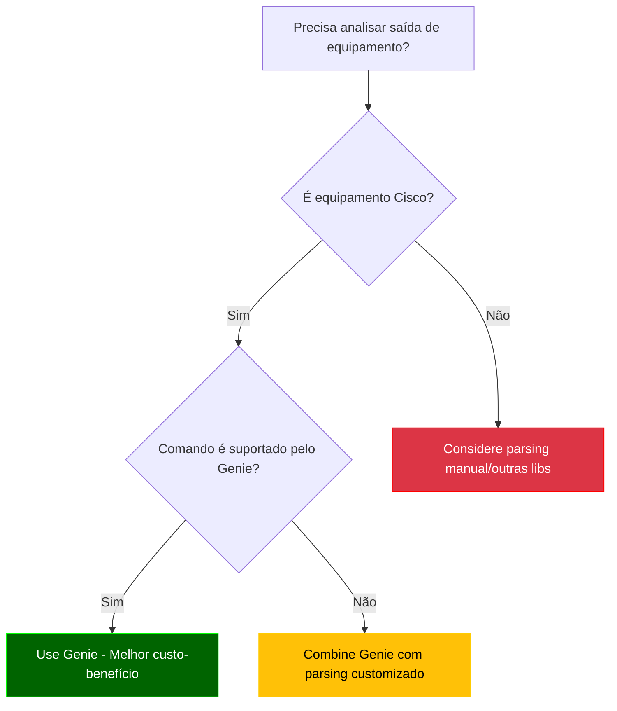
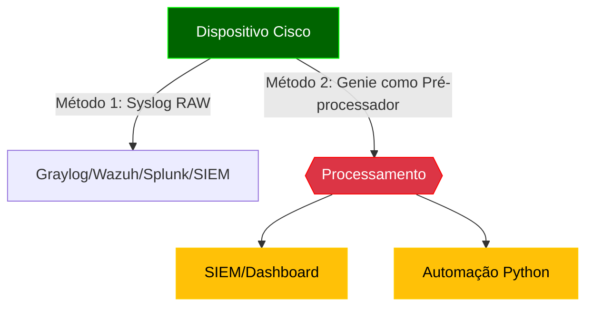
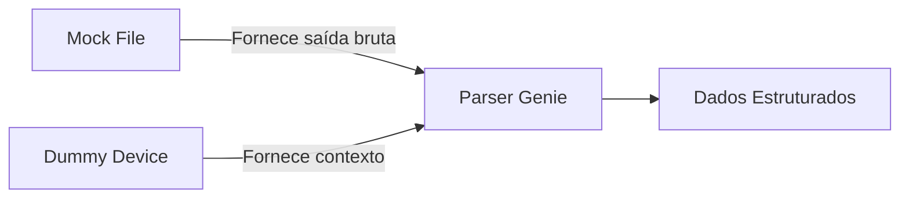
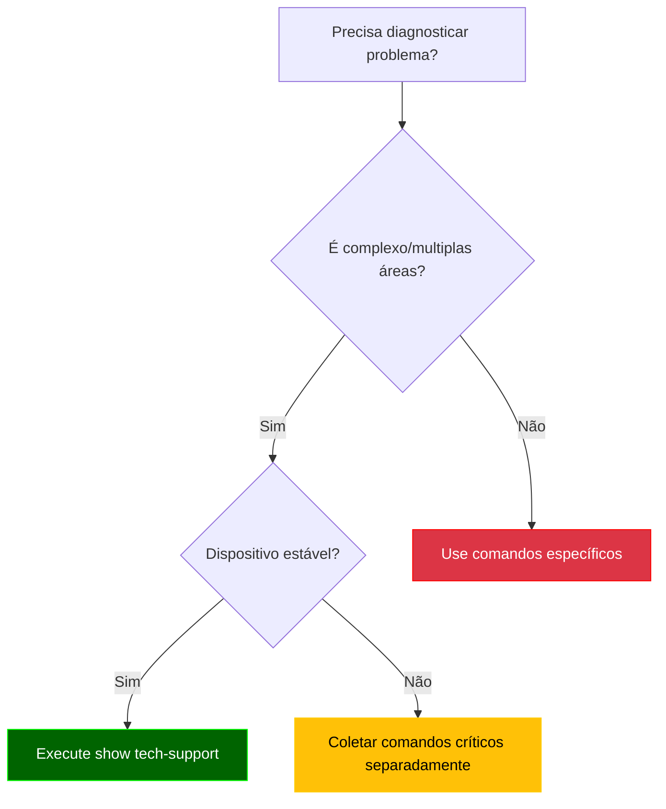

# Python - 14

## Parsing Automático - Genie

## Sumário
- [Python - 14](#python---14)
  - [Parsing Automático - Genie](#parsing-automático---genie)
  - [Sumário](#sumário)
    - [Introdução ao Genie](#introdução-ao-genie)
    - [⚠️ Aviso sobre Versões do Python](#️-aviso-sobre-versões-do-python)
    - [Comparação: Parsing Manual vs Genie](#comparação-parsing-manual-vs-genie)
    - [Documentação oficial](#documentação-oficial)
    - [O que é um Framework?](#o-que-é-um-framework)
    - [O que vamos estudar](#o-que-vamos-estudar)
    - [Para que serve o Genie?](#para-que-serve-o-genie)
    - [Quando usar o Genie para Parsing?](#quando-usar-o-genie-para-parsing)
    - [Quando evitar ou adiar o uso do Genie?](#quando-evitar-ou-adiar-o-uso-do-genie)
    - [Fluxo de Decisão para Uso do Genie](#fluxo-de-decisão-para-uso-do-genie)
  - [Considerações sobre IOS vs IOS-XE](#considerações-sobre-ios-vs-ios-xe)
    - [Compatibilidade do Genie](#compatibilidade-do-genie)
    - [Recomendações para CCNP:](#recomendações-para-ccnp)
    - [💡 **Por que isso é importante?**](#-por-que-isso-é-importante)
  - [Instalação e Primeiros Passos com Genie](#instalação-e-primeiros-passos-com-genie)
    - [Pré-requisitos](#pré-requisitos)
    - [Instalação](#instalação)
    - [Verificação](#verificação)
    - [Estrutura de Parsers](#estrutura-de-parsers)
  - [Onde o Genie se Encaixa? (Fluxo de Processamento)](#onde-o-genie-se-encaixa-fluxo-de-processamento)
    - [Abordagens Comparadas](#abordagens-comparadas)
    - [Casos de Uso Típicos do Genie](#casos-de-uso-típicos-do-genie)
    - [Quando NÃO Usar Genie?](#quando-não-usar-genie)
    - [Recomendações de Uso](#recomendações-de-uso)
    - [Casos de Uso do Genie (do Básico ao Avançado)](#casos-de-uso-do-genie-do-básico-ao-avançado)
    - [Usando pyATS + Genie - testbed.yaml](#usando-pyats--genie---testbedyaml)
    - [E quando usamos apenas o Genie?](#e-quando-usamos-apenas-o-genie)
    - [Conceitos Fundamentais no Genie: Mock Files e Dummy Devices](#conceitos-fundamentais-no-genie-mock-files-e-dummy-devices)
    - [Boas Práticas para Mocks no Genie](#boas-práticas-para-mocks-no-genie)
    - [Dummy Devices (Dispositivos Simulados)](#dummy-devices-dispositivos-simulados)
    - [Relação entre os Conceitos](#relação-entre-os-conceitos)
  - [Quando Usar?](#quando-usar)
    - [Boas práticas para Dummy Devices no Genie](#boas-práticas-para-dummy-devices-no-genie)
    - [O que é uma classe?](#o-que-é-uma-classe)
    - [O que é herança?](#o-que-é-herança)
    - [O que é def dentro de uma classe?](#o-que-é-def-dentro-de-uma-classe)
    - [Exemplo com mock files e Dummy Devices](#exemplo-com-mock-files-e-dummy-devices)
    - [🔍 Como escolher manualmente um parser no Genie](#-como-escolher-manualmente-um-parser-no-genie)
  - [Exemplos](#exemplos)
    - [Exemplo 01: Parsing de show ip interface brief com Genie](#exemplo-01-parsing-de-show-ip-interface-brief-com-genie)
    - [Exemplo 02: Parsing de show version com Genie](#exemplo-02-parsing-de-show-version-com-genie)
      - [✅ Instalação manual do Python 3.10.17 (sem sobrescrever o Python do sistema)](#-instalação-manual-do-python-31017-sem-sobrescrever-o-python-do-sistema)
        - [1. Verifica versões disponíveis](#1-verifica-versões-disponíveis)
        - [2. Cria e ativa o ambiente](#2-cria-e-ativa-o-ambiente)
        - [3. Confirma a versão no ambiente](#3-confirma-a-versão-no-ambiente)
    - [Exemplo 03: Parsing de show vlan brief com Genie + pyenv](#exemplo-03-parsing-de-show-vlan-brief-com-genie--pyenv)
    - [Exemplo 04: show cdp neighbors detail](#exemplo-04-show-cdp-neighbors-detail)
    - [Exemplo 05: show ip ospf neighbor](#exemplo-05-show-ip-ospf-neighbor)
    - [Exemplo 06: show ip eigrp neighbors](#exemplo-06-show-ip-eigrp-neighbors)
    - [Exemplo 07: show bgp summary](#exemplo-07-show-bgp-summary)
    - [Exemplo 08: show ip route](#exemplo-08-show-ip-route)
    - [Exemplo 09: show running-config](#exemplo-09-show-running-config)
    - [Exemplo 10: show interfaces switchport](#exemplo-10-show-interfaces-switchport)
    - [Exemplo 11: Snapshot (antes/depois)](#exemplo-11-snapshot-antesdepois)
    - [Exemplo 12: Parsing de show tech-support](#exemplo-12-parsing-de-show-tech-support)
      - [Comando show tech-support](#comando-show-tech-support)
    - [📚 Glossário](#-glossário)
  - [A](#a)
  - [C](#c)
  - [D](#d)
  - [F](#f)
  - [G](#g)
  - [H](#h)
  - [I](#i)
  - [J](#j)
  - [M](#m)
  - [N](#n)
  - [O](#o)
  - [P](#p)
  - [R](#r)
  - [S](#s)
  - [T](#t)
  - [V](#v)
  - [Y](#y)


### Introdução ao Genie

O Cisco Genie é um framework de automação e parsing desenvolvido pela Cisco como parte do pyATS/Test Automation Solution. Ele fornece parsers pré-construídos para a maioria dos comandos show da Cisco, transformando saídas de texto não estruturadas em dados estruturados prontos para automação.

**Por que usar Genie para o CCNP ENCOR?**
- Cobre todos os comandos relevantes do blueprint (BGP, OSPF, interfaces, etc.)
- Modelos de dados consistentes para diferentes plataformas IOS-XE, NX-OS, IOS-XR
- Integração com pyATS para testes automatizados
- Economiza tempo em troubleshooting e validação de configurações

### ⚠️ Aviso sobre Versões do Python

Os exemplos deste guia foram testados em Python 3.10.17.  

Cuidados com versões diferentes:

**Python < 3.6:**

  - Não suporta f-strings (use .format() ou concatenação).

  - Incompatível com Genie/pyATS.

**Python ≥ 3.12:**

  - Pode gerar erros com parsers do Genie em mock files.

  - Solução recomendada:
    
    ```bash
    pyenv install 3.10.17  # Usando pyenv
    pyenv global 3.10.17   # Define como versão padrão
    ```

**Regra de ouro:**

✅ Sempre consulte a documentação oficial:

  [Python: What's New](https://docs.python.org/3/whatsnew/)

  [Genie](https://developer.cisco.com/docs/genie-docs/)

### Comparação: Parsing Manual vs Genie

| Característica          | Parsing Manual | Genie       |
|-------------------------|----------------|-------------|
| Tempo de desenvolvimento | Alto          | Baixo       |
| Manutenção              | Complexa       | Simples     |
| Cobertura de comandos   | Limitada       | Amplo       |
| Consistência            | Variável       | Padronizado |
| Curva de aprendizado    | Moderada       | Baixa       |
| Adequação para CCNP     | Fundamental    | Essencial   |

### Documentação oficial

Genie - Cisco  
https://developer.cisco.com/docs/genie-docs/

PyYaml  
https://pyyaml.org/wiki/PyYAMLDocumentation

### O que é um Framework?

Um framework (estrutura, em português) é uma plataforma abrangente que fornece:

  - Uma estrutura base para desenvolvimento

  - Conjunto de ferramentas integradas

  - Convenções e melhores práticas

  - Funcionalidades pré-construídas

**Analogia:** Pense como um kit de construção - você recebe a estrutura básica e ferramentas especializadas para construir algo específico.
A Arquitetura pyATS/Genie

```Bash
pyATS (Framework de Teste e Automação)
├── Core (Infraestrutura básica)
├── Genie (Biblioteca de Parsing e Automação)
│   ├── Libs (Bibliotecas específicas)
│   │   ├── Parser (Análise de comandos)
│   │   ├── SDK (Interface de programação)
│   │   └── ... 
├── XPRESS (API REST)
└── Outros componentes
```

**Use Genie quando precisar:**

  - Fazer parsing de comandos **show**

  - Comparar estados de rede **(snapshots)**

  - Criar triggers para **monitoramento**

  - Implementar automação operacional

---
Arrumar

### O que vamos estudar

  - Parsing de JSON: APIs Cisco (DNA Center, Meraki), extração de dados estruturados.

  - Parsing de XML: Configurações NETCONF e arquivos legados.

  - Parsing de YAML: Inventários do Ansible e templates declarativos.

  - Regex para CLI: Análise de comandos show e logs (ex: BGP, interfaces).

  - Integração com ferramentas: SIEMs (Graylog/Splunk) e parsers automáticos (Genie).

---
Arrumar

### Para que serve o Genie?

Principais objetivos:

  - Extrair informações estruturadas de comandos Cisco: status de interfaces, vizinhos BGP, rotas OSPF, etc., com parsers pré-construídos.

  - Validar automaticamente saídas de comandos, garantindo consistência entre plataformas (IOS-XE, NX-OS).

  - Transformar CLI em JSON estruturado, pronto para automação em Python.

  - Gerar relatórios e análises comparativas (ex: snapshots antes/depois de mudanças) para ferramentas como Grafana ou SIEMs.

**Diferencial:** Elimina a necessidade de regex manual, padronizando o parsing em ambientes Cisco.

### Quando usar o Genie para Parsing?

Você deve considerar o Genie para parsing quando:  

| Cenário	                                        | Exemplo com Genie                          	                  | Benefício do Genie                                                  |
|-------------------------------------------------|---------------------------------------------------------------|---------------------------------------------------------------------|
|📤 Trabalha com saídas de comandos Cisco	        | show ip interface brief, show bgp summary	                    | Parsers pré-construídos para +500 comandos Cisco                    |
|🧩 Precisa de dados estruturados consistentes    | Comparar snapshots de show interface antes/depois de mudanças | Modelos de dados padronizados para todas plataformas (IOS-XE, NX-OS, IOS-XR) |
|📊 Requer validação complexa de estado de rede   | Verificar se todos vizinhos BGP estão estabelecidos           | Funções built-in para análise de estado                             |
|🔄 Desenvolve automação operacional              | Monitorar flaps de interface automaticamente                  | Sistema de triggers e aprendizado de estado                         |
|🕵️ Precisa fazer troubleshooting em larga escala | Identificar interfaces down em 100 dispositivos               | Parsing eficiente e relatórios consolidados                        |

### Quando evitar ou adiar o uso do Genie?

O Genie pode não ser a melhor escolha quando:  

| Situação                                                    | Alternativa Recomendada	Razão                                                               |
|-------------------------------------------------------------|---------------------------------------------------------------------------------------------|
| Trabalha com equipamentos não-Cisco                         | Parsers customizados ou bibliotecas vendor-specific	Cobertura limitada a ecossistema Cisco  |
| Necessita parsing de saídas completamente customizadas      | Regex ou parsing manual	Genie funciona melhor com saídas de comandos padrão                 |
| Desenvolve soluções simples/únicas                          | Processamento básico de strings	Overhead de configuração pode não valer a pena              |
| Trabalha com formatos não suportados (ex: logs específicos) | Ferramentas especializadas (Logstash, etc.)	Genie foca em saídas de comandos CLI            |
| Precisa de parsing em tempo real extremamente rápido        | Processamento direto na CLI	Genie adiciona pequena latência na transformação                |

### Fluxo de Decisão para Uso do Genie



**Legenda:**

    🟢 Verde: Casos ideais para Genie

    🟡 Amarelo: Casos que podem usar Genie parcialmente

    🔴 Vermelho: Casos onde Genie não é recomendado

## Considerações sobre IOS vs IOS-XE

### Compatibilidade do Genie
| Feature          | IOS Tradicional | IOS-XE |
|------------------|-----------------|--------|
| Parsers CLI      | 85% cobertura   | 100%   |
| Validação        | Básica          | Avançada |
| APIs             | Não             | Sim    |

### Recomendações para CCNP:
1. Priorize estudos em IOS-XE
2. Para IOS legado:
   - Use `genie.libs.parser.ios`
   - Combine com regex quando necessário
3. Pratique a conversão mental entre sintaxes:
   ```bash
   # IOS
   show ip interface brief
   # IOS-XE
   show interface | include IP
   ```

### 💡 **Por que isso é importante?**
- **Mercado**: Novos projetos Cisco são quase todos IOS-XE
- **Exame**: CCNP ENCOR testa ambos, mas com pesos diferentes
- **Automação**: Seu código precisará lidar com ambientes híbridos

## Instalação e Primeiros Passos com Genie

### Pré-requisitos
- Python 3.6+
- PIP atualizado
- Ambiente virtual (recomendado)

### Instalação
```bash
# Opção 1: Apenas Genie (para parsing - vamos utilizar esse agora)
pip install genie

# Opção 2: pyATS completo (recomendado para CCNP)
pip install pyats[full]
```

### Verificação

```python
from genie.conf import Genie
genie = Genie.init()
print(f"Genie {genie.version} instalado corretamente")
```

### Estrutura de Parsers

Principais módulos para CCNP ENCOR:

```Bash
genie/
└── libs/
    └── parser/
        ├── iosxe/
        │   ├── show_interface.py
        │   ├── show_bgp.py
        │   └── show_ip_route.py
        └── nxos/  # Para estudos multivendor
```

Exemplo Básico - Parsing de Interface

```python
from genie.libs.parser.iosxe.show_interface import ShowIpInterfaceBrief

output = '''
Interface              IP-Address      OK? Method Status                Protocol
GigabitEthernet0/0     192.168.1.1    YES manual up                    up
GigabitEthernet0/1     unassigned     YES unset  administratively down down
'''

parsed = ShowIpInterfaceBrief.parse(output=output)
print(f"Status de G0/0: {parsed['interface']['GigabitEthernet0/0']['status']}")
```

**Saída Esperada:**

```Bash
Status de G0/0: up
```

## Onde o Genie se Encaixa? (Fluxo de Processamento)



### Abordagens Comparadas

**Abordagem 1: Syslog Direto (Sem Genie)**

Como funciona:
    
  ```bash
    Router(config)# logging host 10.0.0.100  # Envia logs brutos para Graylog
  ```
    
**Prós:**

  - Simplicidade de configuração

  - Baixa latência

**Contras:**

  - Dados não estruturados (ex: %BGP-5-ADJCHANGE: neighbor 10.0.0.1 Down)

  - Necessidade de parsers no SIEM (GroK, regex)

  - Limitado a eventos pré-definidos

**Abordagem 2: Genie como Pré-processador (Recomendada para CCNP/automação)**

Fluxo:

  - Script Python coleta dados via SSH/API (ex: show bgp summary)

  - Genie faz parsing estruturado:
      
      ```python
        from genie.libs.parser.iosxe.show_bgp import ShowBgpAllSummary
        parsed = ShowBgpAllSummary.parse(device_output)
      ```
        
Dados são:

  - Enviados para SIEM como JSON estruturado

  - Ou processados localmente (ex: alertas via Slack)

**Vantagens:**

  - Estruturação RICA: Transforma "up/down" em {"bgp_neighbors": {"10.0.0.1": {"state": "down", "uptime": "00:01:23"}}}

  - Contexto para Troubleshooting: Mantém relações entre dados (ex: interface + BGP + OSPF)

  - Validação Automática: Checa se dados estão completos antes do envio

  - Preparação para CCNP: Pratica comandos show e análise estruturada

### Casos de Uso Típicos do Genie

| Cenário         | Exemplo	Vantagem vs. Syslog Bruto                                           |
|-----------------|-----------------------------------------------------------------------------|
| Troubleshooting	| Extrair todos vizinhos BGP inativos	Dados prontos para análise em Grafana   |
| Compliance      | Verificar se todas interfaces têm descrição	Validação programática          | 
| Monitoramento   | Alertar se >50% da CPU por 5min	Correlação com outros dados                 |

### Quando NÃO Usar Genie?

- Logs de Eventos Simples (ex: %LINK-UPDOWN): Syslog direto é suficiente

- Ambientes Não-Cisco: Genie tem suporte limitado a outros vendors

- Latência Crítica: Parsing adiciona ~100-500ms de processamento

### Recomendações de Uso

**Comparação Detalhada**

| Ferramenta        | Cisco      | Juniper | Arista | Nokia | API First | Learning Mode |
|-------------------|------------|---------|--------|-------|-----------|---------------|
| Genie             | ✅✅✅   | ✅      | ✅     | ❌   | ✅        | ✅           |
| TextFSM           | ✅✅      | ✅✅	 | ✅✅	 | ✅    | ❌	      | ❌            |
| PyATS             | ✅✅✅    | ✅	   | ✅     | ✅   | ✅        | ✅           |
| Ansible cli_parse | ✅✅      | ✅✅   | ✅✅  | ✅✅ | ✅        | ❌           |
| Scrapli	          | ✅✅      | ✅✅   | ✅     | ❌   | ✅        | ❌           |

Legenda: ✅✅✅ = Suporte nativo completo | ✅ = Suporte básico

**Quando Usar Cada Uma?**

  - Ambientes Cisco-dominantess → Genie/PyATS

  - Multivendor com foco em legacy → TextFSM + NTC-Templates

  - Automação com Ansible existente → cli_parse

  - Performance crítica → Scrapli

### Casos de Uso do Genie (do Básico ao Avançado)

| Comando                    | Protocolo/Feature  | Aplicação Típica                                                                         |
|----------------------------|--------------------|------------------------------------------------------------------------------------------|
| show ip interface brief    | Interfaces         | Verificar status (up/down) e endereços IP das interfaces.                                |
| show version               | Sistema            | Coletar modelo, versão do IOS e tempo de operação (uptime).                              |
| show vlan brief            | VLANs (Switches)   | Listar VLANs configuradas e portas associadas.                                           |
| show cdp neighbors         | Topologia          | Mapear dispositivos vizinhos e conexões.                                                 |
| show ip ospf neighbor      | OSPF               | Verificar adjacências (FULL/DOWN) e problemas de vizinhança.                             |
| show ip eigrp neighbors    | EIGRP              | Monitorar estabilidade de vizinhos EIGRP.                                                |
| show bgp summary           | BGP                | Checar sessões com peers (estabelecidas/pendentes) e contagem de rotas.                  |
| show ip route	             | Roteamento	        | Analisar rotas (OSPF, EIGRP, estáticas) e métricas.                                      |
| show running-config        | Configuração       | Auditoria de segurança (ACLs, SNMP) ou compliance (descrição de interfaces).             |
| show interfaces switchport | VLANs (Switchport) | Verificar se as interfaces estão em modo trunk, modo access e o encapsulamento (802.1Q). |
| Snapshot (antes/depois)    | Todos              | Validar impactos de mudanças (ex.: interfaces que caíram após upgrade).                  |
| show tech-support          | Diagnóstico	      | Troubleshooting avançado (combina dados de múltiplos comandos).                          |

### Usando pyATS + Genie - testbed.yaml

Quando usamos o pyATS junto com o Genie em um ambiente real, o primeiro passo é criar um arquivo chamado testbed.yaml. Esse arquivo descreve os dispositivos da rede (nome, IP, sistema operacional, credenciais, etc).  

O próprio pyATS pode gerar automaticamente esse arquivo a partir de conexões SSH reais. Esse processo coleta informações do ambiente e cria um "mapa da rede", chamado de snapshot. Isso traz um certo overhead, já que depende da conexão com os equipamentos.  

Uma vez que o testbed.yaml está disponível e o dispositivo é conectado com device.connect(), o Genie pode usar comandos como:  

```python
device.parse("show version")
```

E então, ele escolhe automaticamente o parser correto baseado no sistema operacional e no comando.  

### E quando usamos apenas o Genie?

Quando não temos uma rede real (como neste projeto), podemos usar o Genie isoladamente, sem o pyATS conectado. Nesse caso:  

  - Criamos arquivos simulando a saída dos comandos (mock files),

  - E usamos objetos de teste (DummyDevice) para representar o equipamento.

Como não existe conexão real nem testbed.yaml, o Genie não consegue identificar o parser automaticamente. Por isso, precisamos informar manualmente qual parser será usado:

```python
from genie.libs.parser.iosxe.show_version import ShowVersion
```

Essa abordagem é mais simples e ideal para estudo, testes locais e automação offline.

### Conceitos Fundamentais no Genie: Mock Files e Dummy Devices

Antes de avançarmos, é essencial entender dois pilares do Genie/pyATS para automação e testes:

**1. Mock Files (Arquivos de Simulação)**

**O que são?**  

Arquivos de texto (.txt) que contêm saídas simuladas de comandos Cisco, como show version ou show ip interface brief. Esses arquivos imitam exatamente o que um dispositivo real retornaria via CLI.

**Por que usar?**

    ✅ Teste sem equipamentos: Permite desenvolver e validar parsers sem acesso físico a roteadores/switches.

    ✅ Consistência: Garante que o parser sempre receba a mesma entrada (útil para depuração).

    ✅ Eficiência: Elimina a latência de conexões SSH/Telnet durante o desenvolvimento.

**Exemplo Prático:**

```python
# mock_data/show_version.txt
Cisco IOS XE Software, Version 17.03.04
Router uptime is 1 week, 2 days
System image file is "bootflash:isr4300-universalk9.17.03.04.SPA.bin"
```

| Vantagem                      | Explicação                                                                           |
|-------------------------------|--------------------------------------------------------------------------------------|
| ✅ Não depende de laboratório | Você pode estudar e desenvolver seu código sem ter acesso a equipamentos reais       |
| ✅ Reprodutível               | O conteúdo é sempre o mesmo, então facilita testes e debug                           |
| ✅ Ideal para aprendizado     | Te permite focar no parsing e na lógica, sem se preocupar com conexões ou permissões |
| ✅ Rápido e leve              | Você roda tudo localmente em segundos, com arquivos .txt                             |

**📌 Exemplo de conteúdo mock (simulação de saída)**

```Bash
Interface              IP-Address      OK? Method Status                Protocol
GigabitEthernet0/0     192.168.1.1     YES manual up                    up
GigabitEthernet0/1     unassigned      YES unset  administratively down down
Loopback0              10.0.0.1        YES manual up                    up
```

Isso imita a resposta real do roteador, e permite que o parser Genie funcione corretamente.  

### Boas Práticas para Mocks no Genie

Para Projetos Reais:

1. Estrutura de Pastas:

```Bash

    project/
    ├── src/
    │   ├── parsers/
    │   └── tests/
    │       ├── mock_data/
    │       │   ├── iosxe/
    │       │   │   ├── show_version.txt
    │       │   │   └── show_interface.txt
    │       └── test_parsers.py
```

2. Nomenclatura:

   - Use nomes descritivos: iosxe_show_version_v17.3.4.txt.

3. Validação:

   - Sempre verifique se o mock corresponde à saída real (copie do dispositivo se possível).  

4. Para Fins Didáticos:

   - Mantenha os mocks em arquivos separados.

   - Adicione comentários explicativos no mock:

```Bash
# mock_data/show_version.txt
# Saída simulada de um Cisco ISR4321 com IOS-XE 17.03.04
# Última atualização: 2024-06-01
Cisco IOS XE Software, Version 17.03.04
...
```

5. Armazene em pastas mock_data/ separadas por OS (ex: iosxe/, nxos/).  

6. Nomeie os arquivos com o comando e versão (ex: show_version_iosxe_17.3.4.txt).

### Dummy Devices (Dispositivos Simulados)

**O que são?**  

Classes Python simples que emulam um dispositivo de rede (roteador, switch) para fins de teste. Elas fornecem os atributos mínimos que o Genie precisa para operar (como os e type).  

**Por que usar?**  

    ✅ Abstração: Testa parsers sem configurar conexões complexas.

    ✅ Flexibilidade: Simula diferentes sistemas operacionais (IOS-XE, NX-OS) mudando apenas self.os.

    ✅ Isolamento: Valida apenas a lógica de parsing, sem interferência de falhas de rede.

Exemplo Prático:

**Atributos essenciais:**

```python
class DummyDevice:
    def __init__(self, os='iosxe', name='lab-router'):
        self.os = os  # Define o sistema operacional (crucial para o Genie)
        self.name = name  # Identificação opcional
```

**Uso típico**

```python
device = DummyDevice(os='iosxe')
parser = ShowVersion(device=device)  # O parser usa 'os' para selecionar a implementação correta
```

**Exemplo Prático e Atributos Essenciais:**

Para que sua classe `DummyDevice` funcione corretamente com os parsers do Genie, ela precisa simular o comportamento de um objeto de dispositivo real do pyATS. 

```python
# Exemplo da classe DummyDevice para simulação offline:
class DummyDevice:
    # Dispositivo fictício para parsing offline com Genie
    def __init__(self):
        # Método construtor da classe (executado na criação da instância)
        self.os = 'iosxe'  # Define o sistema operacional
        self.custom = {'abstraction': {'order': ['os']}} # Necessário para os parsers Genie
```

**Entendendo os atributos chave do DummyDevice para o Genie:**

Para que o Genie consiga usar seu DummyDevice para o parsing, alguns atributos são cruciais:

  - **O atributo self.os**: O Genie utiliza o atributo os do objeto Device (ou de qualquer classe que você use como um dispositivo) para determinar qual parser específico usar para um dado comando (show ...). É o mínimo necessário para o Genie saber qual sistema operacional ele está "interagindo" e, consequentemente, qual lógica de parsing aplicar.

  - **O atributo self.custom = {'abstraction': {'order': ['os']}}:** Este é um detalhe mais avançado do pyATS, o framework base do Genie. Ele se refere ao sistema de abstração do pyATS, que permite definir a ordem de prioridade na qual as capacidades (como os, platform, type) de um dispositivo são consideradas para resolver operações e selecionar o parser correto. Ao definir {'abstraction': {'order': ['os']}}, você está garantindo que o os seja o primeiro (e principal) atributo usado para a resolução de abstrações, o que é fundamental para o Genie localizar o parser correto.

**Uso típico:**

```python
device = DummyDevice(os='iosxe')
parser = ShowVersion(device=device)  # O parser usa 'os' para selecionar a implementação 
```

### Relação entre os Conceitos



- Mock File: Simula o que o dispositivo envia (dados).

- Dummy Device: Simula quem envia (contexto: IOS-XE, NX-OS, etc.).

## Quando Usar?

| Cenário	Mock               | File                   | Dummy Device                   |
|----------------------------|------------------------|--------------------------------|
| Desenvolvimento local      | ✅                     | ✅                            |
| Testes em CI/CD            | ✅	                   | ✅                            |
| Validação rápida           | ❌ (Use string direta) | ✅                            |
| Conexão a dispositivo real | ❌	                   | ❌ (Use Device real)          |  

### Boas práticas para Dummy Devices no Genie

Adicione apenas os atributos essenciais (os, type, name).

Use herança para casos complexos:

```python

class DummyISR(DummyDevice):
    def __init__(self):
        super().__init__(os='iosxe', type='router', name='isr4321')
```

**OBS:** Vamos a uma breve explicação sobre Classes e Funções

### O que é uma classe?

No Python (e em programação orientada a objetos), uma classe é como um molde ou modelo para criar objetos. Ela define características (atributos) e ações (métodos) que aquele tipo de objeto pode ter.

Exemplo simples:

```python
class Roteador:
    def __init__(self, modelo):
        self.modelo = modelo
```

Com essa classe, você pode criar vários roteadores:

```python
r1 = Roteador('ISR4321')
r2 = Roteador('ASR1001')
``` 

### O que é herança?

Herança é quando você cria uma nova classe baseada em outra. A nova classe herda os atributos e comportamentos da classe original e pode personalizar ou expandir o que for necessário.

No exemplo:

```Python
class DummyISR(DummyDevice):
    def __init__(self):
        super().__init__(os='iosxe', type='router', name='isr4321')
```

Então estamos dizendo:

    “Quero criar um roteador de testes chamado DummyISR que já vem configurado como um router IOS-XE chamado isr4321, reutilizando tudo que já existe na classe DummyDevice.”

**📌 Resumo**  

| Conceito | Explicação curta                                      |              
|----------|-------------------------------------------------------|
| Classe   | Modelo para criar objetos (ex: roteadores, switches)  |
| Herança  | Reutilização de uma classe existente em outra         |

- Essa técnica torna o código mais organizado, reutilizável e profissional, principalmente em projetos maiores.

### O que é def dentro de uma classe?

A palavra-chave def no Python é usada para definir uma função — e quando essa função está dentro de uma classe, ela é chamada de método.

**Por que usar def dentro de uma classe?**

Porque assim você define comportamentos específicos que os objetos daquela classe podem executar.

Por exemplo:

```Python
class Roteador:
    def __init__(self, modelo):
        self.modelo = modelo

    def exibir_modelo(self):
        print(f"O modelo é: {self.modelo}")
```

Aqui temos:

  - __init__: um método especial que é chamado automaticamente quando o objeto é criado.

  - **exibir_modelo:** um método criado por você, que exibe o modelo do roteador.

**Por que __init__ é especial?**

É o construtor da classe. Ele é chamado automaticamente quando você cria um novo objeto.

```Python
r1 = Roteador('ISR4321')  # Chama __init__ automaticamente
r1.exibir_modelo()        # Chama o método da classe
```

**Resumo**

| Elemento      | O que faz                                       |
|---------------|-------------------------------------------------|
| def           | Define uma função (ou método, dentro da classe) |
| __init__      | Inicializa os atributos do objeto (construtor)  |
| Outros métodos| Definem ações que o objeto pode executar        |

### Exemplo com mock files e Dummy Devices

```Python
from genie.libs.parser.iosxe.show_version import ShowVersion

# 1. Dispositivo simulado
class DummyRouter:
    def __init__(self):
        self.os = 'iosxe'  # Atributo obrigatório para o Genie
        self.name = 'lab-device'

# 2. Mock file
with open('mock_data/show_version.txt') as f:
    raw_output = f.read()

# 3. Parsing
device = DummyRouter()
parsed = ShowVersion(device).parse(output=raw_output)

print(f"Versão: {parsed['version']['version_short']}")
```

### 🔍 Como escolher manualmente um parser no Genie

Ao usar o Genie de forma offline (sem conexão com dispositivos), é necessário selecionar o parser manualmente. Siga os passos:  

**✅ 1. Identifique o sistema operacional (OS)**

Verifique o OS do equipamento (ex: iosxe, ios, nxos, asa) — isso define o módulo correto de parser.  

**🌐 2. Acesse o repositório oficial**

👉 https://github.com/CiscoTestAutomation/genieparser

Nele, você encontra:  

  - O comando suportado

  - O OS compatível

  - O nome da classe do parser

  - O caminho de importação

**📦 3. Faça a importação no seu script**

Exemplo para show cdp neighbors detail em IOS-XE:

```python
from genie.libs.parser.iosxe.show_cdp import ShowCdpNeighborsDetail
```

Use depois com:

```python
parser = ShowCdpNeighborsDetail(device=None)
parsed = parser.parse(output=saida_do_comando)
```

**🤖 Observação**

Se você estiver usando o Genie com um dispositivo real via testbed, o próprio .parse() escolhe automaticamente o parser com base no OS e comando.  

**✔️ Resumo rápido**

| Etapa | Ação                                                                    |
|-------|-------------------------------------------------------------------------|
| 1.    | OS	Identifique o sistema operacional (ex: iosxe)                       | 
| 2.    | Site	Consulte o parser no GitHub oficial                               |
| 3.    | Classe	Importe e instancie manualmente o parser                        |
| 4.    | Real	Em dispositivos reais, o Genie seleciona o parser automaticamente |

## Exemplos

### Exemplo 01: Parsing de show ip interface brief com Genie

**Objetivo:** Extrair status e endereços IP de interfaces de forma estruturada.  

**📁 Estrutura recomendada**

```Bash
genie/
└── 01/
    ├── parse_interface_brief.py
    └── mock_data/
        └── show_ip_interface_brief.txt
```

**Requisitos: requirements.txt**

```txt
pyats[full]  
```

**OBS:** aqui estou instalado o pyats[full] pois ele já instala o Genie na versão mais completa e compatível com a versão do pyats. Dessa maneira não falta nenhuma dependência para o projeto e prevê futuros crescimentos no script como conexões a equipamentos via ssh. A "suite" completa tem 500 Mb, já o Genie ocuparia 200 Mb.

**show_ip_interface_brief.txt**

```txt
Interface              IP-Address      OK? Method Status                Protocol
GigabitEthernet1       unassigned      YES unset  administratively down down    
GigabitEthernet2       10.1.1.1        YES manual up                    up      
Loopback0              192.168.0.1     YES manual up                    up      
```

**parse_interface_brief.py**

```python
[01] from genie.libs.parser.iosxe.show_interface import ShowIpInterfaceBrief
[02] 
[03] class DummyDevice:
[04]     def __init__(self, name='mock'):
[05]         self.name = name
[06] 
[07] device = DummyDevice()
[08] 
[09] # Leitura do conteúdo mock
[10] with open('mock_data/show_ip_interface_brief.txt') as f:
[11]     raw_output = f.read()
[12]
[13] # Parsing
[14] parser = ShowIpInterfaceBrief(device=device)
[15] parsed = parser.parse(output=raw_output)
[16] 
[17] print("\n=== Interfaces Ativas ===")
[18] for intf, details in parsed['interface'].items():
[19]     if details.get('status', '').strip() == 'up':
[20]         print(f"{intf}:")
[21]         print(f"  IP: {details.get('ip_address', 'N/A').strip()}")
[22]         print(f"  Status: {details.get('status', 'N/A').strip()}")
[23]         print(f"  Protocolo: {details.get('protocol', 'N/A').strip()}\n")
[24]
[25] print("\n=== Interfaces Inativas ===")
[26] for intf, details in parsed['interface'].items():
[27]     if details.get('status', '').strip() != 'up':
[28]         print(f"{intf}: {details.get('status', 'unknown').strip()}")
```

**Saída**

```Bash
alcancil@linux:~/automacoes/genie/01$ python3 -m venv genie
alcancil@linux:~/automacoes/genie/01$ source genie/bin/activate
genie) alcancil@linux:~/automacoes/genie/01$ pip install -r requiremnets.txt 
Collecting pyats[full] (from -r requiremnets.txt (line 1))
  Using cached pyats-25.5-cp312-cp312-manylinux2014_x86_64.whl.metadata (4.5 kB)
Collecting packaging>=20.0 (from pyats[full]->-r requiremnets.txt (line 1))
  Using cached packaging-25.0-py3-none-any.whl.metadata (3.3 kB)
Collecting pyats.aereport<25.6.0,>=25.5.0 (from pyats[full]->-r requiremnets.txt (line 1))
  Using cached pyats.aereport-25.5-cp312-cp312-manylinux2014_x86_64.whl.metadata (3.2 kB)
...
4.67.1 types-python-dateutil-2.9.0.20250516 typing-extensions-4.14.0 unicon-25.5 unicon.plugins-25.5 urllib3-2.5.0 wcwidth-0.2.13 websocket-client-1.8.0 wheel-0.45.1 wsproto-1.2.0 xlrd-1.2.0 xlsxwriter-3.2.5 xlwt-1.3.0 xmltodict-0.12.0 yamllint-1.37.1 yang.connector-25.5 yarl-1.20.1
(genie) alcancil@linux:~/automacoes/genie/01$ python3 parse_interface_brief.py 
/home/alcancil/automacoes/genie/01/genie/lib/python3.12/site-packages/unicon/__init__.py:10: UserWarning: pkg_resources is deprecated as an API. See https://setuptools.pypa.io/en/latest/pkg_resources.html. The pkg_resources package is slated for removal as early as 2025-11-30. Refrain from using this package or pin to Setuptools<81.
  from unicon.core.pluginmanager import PluginManager

=== Interfaces Ativas ===
GigabitEthernet2:
  IP: 10.1.1.1
  Status: up
  Protocolo: up

Loopback0:
  IP: 192.168.0.1
  Status: up
  Protocolo: up


=== Interfaces Inativas ===
GigabitEthernet1: administratively down
(genie) alcancil@linux:~/automacoes/genie/01$ 
```

**Explicação**

```Python
[Bloco 1] Importação da biblioteca Genie

[01] from genie.libs.parser.iosxe.show_interface import ShowIpInterfaceBrief    # Importa o parser específico do comando 'show ip interface brief' para dispositivos IOS-XE

[Bloco 2] Criação de um dispositivo simulado (Dummy)

[03] class DummyDevice:                                                         # Define uma classe fictícia que simula um "device" para o parser funcionar
[04]     def __init__(self, name='mock'):                                       # Método construtor da classe
[05]         self.name = name                                                   # Atribui um nome ao dispositivo (apenas para satisfazer o parser)
[07] device = DummyDevice()                                                     # Instancia o dispositivo simulado

[Bloco 3] Leitura da saída simulada do comando CLI

[09] # Leitura do conteúdo mock
[10] with open('mock_data/show_ip_interface_brief.txt') as f:                   # Abre o arquivo contendo a saída simulada do comando
[11]     raw_output = f.read()                                                  # Lê todo o conteúdo do arquivo e armazena na variável

[Bloco 4] Parsing da saída usando Genie

[13] # Parsing
[14] parser = ShowIpInterfaceBrief(device=device)                               # Cria o objeto parser, passando o dispositivo simulado como parâmetro
[15] parsed = parser.parse(output=raw_output)                                   # Executa o parsing da saída CLI e armazena os dados estruturados em 'parsed'

[Bloco 5] Impressão das interfaces com status "up" (ativas)

[17] print("\n=== Interfaces Ativas ===")                                       # Título da seção de interfaces ativas
[18] for intf, details in parsed['interface'].items():                          # Itera sobre cada interface e seus detalhes
[19]     if details.get('status', '').strip() == 'up':                          # Verifica se o status da interface é "up"
[20]         print(f"{intf}:")                                                  # Exibe o nome da interface
[21]         print(f"  IP: {details.get('ip_address', 'N/A').strip()}")         # Exibe o IP da interface
[22]         print(f"  Status: {details.get('status', 'N/A').strip()}")         # Exibe o status (ex: up, administratively down)
[23]         print(f"  Protocolo: {details.get('protocol', 'N/A').strip()}\n")  # Exibe o status do protocolo (ex: up/down)

[Bloco 6] Impressão das interfaces com status diferente de "up" (inativas)

[25] print("\n=== Interfaces Inativas ===")                                     # Título da seção de interfaces inativas
[26] for intf, details in parsed['interface'].items():                          # Itera novamente sobre todas as interfaces
[27]     if details.get('status', '').strip() != 'up':                          # Verifica se o status não é "up"
[28]         print(f"{intf}: {details.get('status', 'unknown').strip()}")       # Exibe o nome e o statu
```

> 🧪 **Observação importante sobre a versão do Python**
>
> O Exemplo 01 foi desenvolvido utilizando a versão mais recente do Python disponível no momento (`Python 3.12.3`). No entanto, durante a simulação com arquivos *mock* e *dummy devices*, identifiquei que **alguns parsers do Genie ainda não estão totalmente compatíveis com essa versão**.
>
> Por isso, **recomendo fortemente a utilização da versão `Python 3.10.17`**, que é mais estável e amplamente compatível com os parsers utilizados no PyATS + Genie, especialmente para simulações locais sem acesso a equipamentos reais.
>
> Essa adaptação será demonstrada nos próximos exemplos.

### Exemplo 02: Parsing de show version com Genie

**Objetivo:**

Extrair informações estruturadas sobre o sistema operacional do roteador: versão do IOS, modelo do hardware, tempo de uptime e outros detalhes relevantes.  

⚠️ **Importante: Sobre a versão do Python**

Durante o desenvolvimento deste exemplo, identifiquei que alguns parsers do Genie não são totalmente compatíveis com o Python mais recente (`3.12.x`) quando utilizados em **testes locais simulados** com `mock files` e `dummy devices`.  

Após diversos testes, confirmei que a versão mais compatível para esse cenário é o **Python 3.10.17**, amplamente suportado pelo `pyATS` e `Genie`, especialmente para ambientes sem acesso a equipamentos reais.

A seguir, explico como instalar essa versão manualmente, mantendo as duas versões do Python lado a lado no Linux Mint, sem afetar o sistema:

#### ✅ Instalação manual do Python 3.10.17 (sem sobrescrever o Python do sistema)

**Fonte oficial utilizada:**
[https://www.python.org/downloads/release/python-31017](https://www.python.org/downloads/release/python-31017)

**Comandos utilizados:**

```bash
cd ~/Downloads
wget https://www.python.org/ftp/python/3.10.17/Python-3.10.17.tgz
tar -xf Python-3.10.17.tgz
cd Python-3.10.17
./configure --enable-optimizations
make -j4
sudo make altinstall
```

**🧠 O que esses comandos significam?**

| Comando                            | Explicação                                                                        |
|------------------------------------|-----------------------------------------------------------------------------------| 
| wget ...Python-3.10.17.tgz         | Você baixou o código-fonte oficial do Python 3.10.17.                             | 
| tar -xf                            | Você descompactou o arquivo.                                                      |
| ./configure --enable-optimizations | Preparou a compilação com otimizações de performance.                             |
| make -j 4	                         | Compilou o Python usando 4 núcleos.                                               |
| sudo make altinstall               | Instala a versão sem sobrescrever o Python padrão do sistema (muito importante!). |

**🔎 Onde foi instalado?**

Provavelmente em:

```bash
/usr/local/bin/python3.10
```

Você pode confirmar com:

```bash
which python3.10
```

**🔎 Verificação após a instalação**

Após instalar, confirme a presença da nova versão:

```bash
/usr/local/bin/python3.10 --version
```

Resultado esperado:

```bash
Python 3.10.17
```

Você poderá então criar ambientes virtuais com essa versão usando:

```python
python3.10 -m venv nome_do_ambiente
```

**📁 Estrutura recomendada**

```Bash
genie/
└── 02/
    ├── parse_show_version.py
    └── mock_data/
        └── show_version.txt
```

**requirements.txt**

```Bash
pyats[full]
```

**mock_data/show_version.txt (exemplo de saída real)**

```Bash
Cisco IOS XE Software, Version 17.03.04
Cisco IOS Software [Amsterdam], ISR Software (ARMV8EB_LINUX_IOSD-UNIVERSALK9_IAS-M), Version 17.3.4, RELEASE SOFTWARE (fc3)
Technical Support: http://www.cisco.com/techsupport
Compiled Tue 20-Apr-21 09:18 by mcpre

ROM: IOS-XE ROMMON

Router uptime is 1 week, 2 days, 5 hours, 30 minutes
System returned to ROM by PowerOn
System image file is "bootflash:isr4300-universalk9.17.03.04.SPA.bin"
Last reload reason: PowerOn

Cisco ISR4321/K9 (1RU) processor with 1662612K/6147K bytes of memory.
Processor board ID FLM2306W0LB
2 Gigabit Ethernet interfaces
32768K bytes of non-volatile configuration memory.
4194304K bytes of physical memory.
2557440K bytes of flash memory at bootflash:.
```

**parse_show_version.py**

```Python
[01] from genie.libs.parser.utils import get_parser
[02] from genie.metaparser.util.exceptions import SchemaEmptyParserError
[03] import re
[04] 
[05] class DummyDevice:
[06]     def __init__(self, name='mock', os='iosxe'):
[07]         self.name = name
[08]         self.os = os
[09]         self.custom = {'abstraction': {'order': ['os']}}
[10] 
[11] def validate_mock_output(content):
[12]     """Verifica se o mock tem o formato esperado"""
[13]     required_patterns = [
[14]         r'Cisco IOS XE Software, Version \d+\.\d+\.\d+',
[15]         r'Cisco IOS Software \[.+\], .+ Version \d+\.\d+\.\d+',
[16]         r'System image file is ".+"',
[17]         r'Router uptime is .+',
[18]         r'Cisco \w+/.+ processor with',
[19]         r'\d+K bytes of (non-volatile configuration|physical|flash) memory'
[20]     ]
[21]     
[22]     for pattern in required_patterns:
[23]         if not re.search(pattern, content):
[24]             raise ValueError(f"Padrão não encontrado: {pattern}")
[25] 
[26] device = DummyDevice()
[27] 
[28] with open('mock_data/show_version.txt', 'r') as f:
[29]     raw_output = f.read()
[30] 
[31] try:
[32]     validate_mock_output(raw_output)
[33]     
[34]     # Modificação crítica aqui: tratamento correto do retorno do get_parser
[35]     parser_class = get_parser('show version', device=device)
[36]     if isinstance(parser_class, tuple):
[37]         parser = parser_class[0](device=device)  # Pega a classe de parser da tupla
[38]     else:
[39]         parser = parser_class(device=device)
[40]     
[41]     parsed = parser.parse(output=raw_output)
[42]     
[43]     print("\n=== Parsing Bem Sucedido ===")
[44]     print(f"Versão: {parsed['version']['version_short']}")
[45]     print(f"Modelo: {parsed['version']['chassis']}")
[46]     print(f"Uptime: {parsed['version']['uptime']}")
[47]  
[48] except ValueError as ve:
[49]     print(f"\nERRO: Formato inválido no mock: {ve}")
[50] except SchemaEmptyParserError:
[51]     print("\nERRO: O parser retornou vazio - verifique o formato do output")
[52] except Exception as e:
[53]     print(f"\nErro durante parsing: {str(e)}")
[54]     print("\nConteúdo problemático:")
[55]     print(raw_output)
```

**Saída**

```bash
lcancil@linux:~/automacoes/genie/02$ which python3
/usr/bin/python3
alcancil@linux:~/automacoes/genie/02$ which python3.10
/usr/local/bin/python3.10
alcancil@linux:~/automacoes/genie/02$ 
alcancil@linux:~/automacoes/genie/02$ python3.10 -m venv genie310
alcancil@linux:~/automacoes/genie/02$ source genie310/bin/activate
(genie310) alcancil@linux:~/automacoes/genie/02$ python
python             python3.10         python3.12         python3-config     
python3            python3.10-config  python3.12-config  python3-qr         
(genie310) alcancil@linux:~/automacoes/genie/02$ python3 parse_show_version.py 

=== Parsing Bem Sucedido ===
Versão: 17.3
Modelo: ISR4321/K9
Uptime: 1 week, 2 days, 5 hours, 30 minutes
(genie310) alcancil@linux:~/automacoes/genie/02$ 
```

**Explicação**

**📌 Verificando Versões do Python Instaladas**

Para listar todas as versões do Python disponíveis no sistema (globalmente), use:

```bash
# Lista executáveis Python no PATH
ls /usr/bin/python*  

# Ou para versões específicas (3.10+):
which python3.10 python3.12  # Caminhos completos
python3.10 --version         # Verifica a versão exata
```

**Saída esperada:**

```bash
/usr/bin/python3.10   # Python 3.10.17
/usr/bin/python3.12   # Python 3.12.3
```

**🌐 Criando um Ambiente Virtual com uma Versão Específica**

Se você instalou o Python 3.10 manualmente (como no Exemplo 02), siga estes passos:

  - Localize o caminho do Python 3.10:
    
```bash
which python3.10  # Ex: /usr/local/bin/python3.10
```

  - Crie o ambiente virtual:

```bash
# Sintaxe: <caminho_python> -m venv <nome_do_ambiente>
/usr/local/bin/python3.10 -m venv genie310
```

  - Ative o ambiente:

```bash
source genie310/bin/activate
```

  - Verifique a versão dentro do ambiente:

```bash
    python --version  # Deve mostrar "Python 3.10.17"
```

**🔍 Exemplo Prático**

##### 1. Verifica versões disponíveis

```bash
alcancil@linux:~$ which python3.10 python3.12
/usr/local/bin/python3.10   # Python 3.10.17 (instalado manualmente)
/usr/bin/python3.12         # Python padrão do sistema
```

##### 2. Cria e ativa o ambiente

```bash
alcancil@linux:~/automacoes/genie/02$ python3.10 -m venv genie310
alcancil@linux:~/automacoes/genie/02$ source genie310/bin/activate
```

##### 3. Confirma a versão no ambiente

```bash
(genie310) alcancil@linux:~/automacoes/genie/02$ python --version
Python 3.10.17
```

**💡 Por Que Isso é Importante?**

  **Isolamento:** Ambientes virtuais evitam conflitos entre projetos.

  **Compatibilidade:** Garante que o Genie/pyATS funcione corretamente (como no Exemplo 02, que requer Python 3.10).

  **Controle:** Você pode ter múltiplos ambientes com versões diferentes do Python.

**parse_show_version.py**

```Python
Bloco 1: Importações

[01] from genie.libs.parser.utils import get_parser                               # Importa a função que seleciona automaticamente o parser correto para um comando
[02] from genie.metaparser.util.exceptions import SchemaEmptyParserError          # Importa exceção para tratar saídas vazias/inválidas
[03] import re                                                                    # Biblioteca para validação com regex

Bloco 2: Classe DummyDevice

[05] class DummyDevice:                                                           # Simula um dispositivo de rede para testes offline
[06]     def __init__(self, name='mock', os='iosxe'):
[07]         self.name = name                                                     # Nome do dispositivo (opcional)
[08]         self.os = os                                                         # Sistema operacional (crucial para o Genie selecionar o parser)
[09]         self.custom = {'abstraction': {'order': ['os']}}                     # Define a hierarquia de abstração (padrão pyATS)

Bloco 3: Validação do Mock File

[11] def validate_mock_output(content):                                           # Garante que o arquivo mock tenha o formato esperado
[12]     """Verifica se o mock tem o formato esperado"""
[13]     required_patterns = [                                                    # Lista de padrões regex que devem existir na saída
[14]         r'Cisco IOS XE Software, Version \d+\.\d+\.\d+',                     # Versão do IOS
[15]         r'Cisco IOS Software \[.+\], .+ Version \d+\.\d+\.\d+',              # Detalhes da versão
[16]         r'System image file is ".+"',                                        # Nome da imagem
[17]         r'Router uptime is .+',                                              # Tempo de atividade
[18]         r'Cisco \w+/.+ processor with',                                      # Modelo do hardware
[19]         r'\d+K bytes of (non-volatile configuration|physical|flash) memory'  # Memória
[20]     ]
[21]     
[22]     for pattern in required_patterns:                                        # Verifica cada padrão
[23]         if not re.search(pattern, content):                                  # Se algum padrão não for encontrado...
[24]             raise ValueError(f"Padrão não encontrado: {pattern}")            # Falha com erro descritivo

Bloco 4: Configuração Inicial

[26] device = DummyDevice()                                                       # Cria um dispositivo simulado IOS-XE
[27] 
[28] with open('mock_data/show_version.txt', 'r') as f:                           # Abre o arquivo mock
[29]     raw_output = f.read()                                                    # Lê todo o conteúdo

Bloco 5: Parsing e Tratamento de Erros

[31] try:                                                                         # Início do bloco para capturar erros
[32]     validate_mock_output(raw_output)                                         # Valida o conteúdo do mock
[33]     
[34]     # Obtém a classe do parser para 'show version' (pode retornar uma tupla ou classe direta)
[35]     parser_class = get_parser('show version', device=device)
[36]     if isinstance(parser_class, tuple):                                      # Se for tupla (classe + args)...
[37]         parser = parser_class[0](device=device)                              # Pega a classe (primeiro elemento)
[38]     else:                                                                    # Se for direto...
[39]         parser = parser_class(device=device)                                 # Usa a classe diretamente
[40]     
[41]     parsed = parser.parse(output=raw_output)                                 # Executa o parsing
[42]     
[43]     print("\n=== Parsing Bem Sucedido ===")                                  # Saída formatada
[44]     print(f"Versão: {parsed['version']['version_short']}")                   # Ex: "17.3"
[45]     print(f"Modelo: {parsed['version']['chassis']}")                         # Ex: "ISR4321/K9"
[46]     print(f"Uptime: {parsed['version']['uptime']}")                          # Ex: "1 week, 2 days"
[47]  
[48] except ValueError as ve:                                                     # Erro na validação do mock
[49]     print(f"\nERRO: Formato inválido no mock: {ve}")                         # Exibe mensagem de erro formatada quando a validação do mock falha:
                                                                                          # - \n insere quebra de linha antes da mensagem
                                                                                          # - f-string permite inserir o valor da variável 've' (ValueError)
                                                                                          # - 've' contém detalhes do padrão regex não encontrado
[50] except SchemaEmptyParserError:                                               # Erro no parser (saída vazia/inválida)
[51]     print("\nERRO: O parser retornou vazio - verifique o formato do output") # Exibe mensagem de erro quando o parser não consegue processar a saída:
                                                                                          # - \n cria uma quebra de linha para separação visual
                                                                                          # - Indica que o parser retornou vazio (SchemaEmptyParserError)
                                                                                          # - Sugere verificar:
                                                                                          #   1. Se o mock contém a saída COMPLETA do comando
                                                                                          #   2. Se há diferenças na sintaxe da saída real vs mock
                                                                                          #   3. Se a versão do OS no DummyDevice corresponde ao mock
[52] except Exception as e:                                                       # Qualquer outro erro
[53]     print(f"\nErro durante parsing: {str(e)}")                               # Exibe mensagem genérica de erro durante o processamento:
                                                                                          # - \n insere quebra de linha para melhor formatação
                                                                                          # - f-string permite incluir detalhes do erro através da variável 'e'
                                                                                          # - str(e) converte a exceção para string legível
                                                                                          # - Captura qualquer erro não tratado especificamente (Exception)
                                                                                          # - Útil para debug de problemas inesperados
[54]     print("\nConteúdo problemático:")                                        # Debug: mostra o conteúdo problemático
[55]     print(raw_output)                                                        # Exibe o conteúdo bruto do arquivo mock quando ocorre um erro inesperado:
                                                                                          # - Mostra exatamente o que foi lido do arquivo 'show_version.txt'
                                                                                          # - Auxilia no debug comparando a entrada com o formato esperado
                                                                                          # - Útil para identificar:
                                                                                          #   * Dados faltantes no mock
                                                                                          #   * Diferenças de formatação
                                                                                          #   * Caracteres inválidos
                                                                                          #   * Problemas de codificação
                                                                                          # - Sempre executado após mensagem de erro principal (linha 53)
```

**OBSERVAÇÃO:**

Como o Genie Escolhe Automaticamente o Parser?  

O Genie utiliza um sistema inteligente de seleção de parsers baseado em duas informações-chave:  

1. Mecanismo de Seleção (Passo a Passo):

 - Biblioteca de Parsers : O Genie possui +500 parsers pré-construídos organizados por sistema operacional:
  
```bash
genie/libs/parser/
├── iosxe/
│   ├── show_version.py
│   └── show_interface.py
├── nxos/
│   ├── show_version.py
│   └── show_interface.py
└── iosxr/
    ├── show_version.py
    └── show_interface.py
```

2. Chave de Seleção  
  
O get_parser usa dois critérios para escolher o parser correto:

   - Tipo de dispositivo (device.os no DummyDevice)

   - Comando Cisco (ex: show version)

**Fluxo Automático**

Quando você chama:

```python
get_parser('show version', device=device)
```

O Genie:

   - Verifica device.os (ex: iosxe)

   - Busca em genie/libs/parser/iosxe/ o arquivo show_version.py

   - Retorna a classe ShowVersion pronta para uso

**Exemplo Prático: Diferença entre Plataformas**

| Comando        | IOS-XE Parser	NX-OS Parser                                      |
|----------------|------------------------------------------------------------------|
| show version   | Extrai version_short (ex: 17.3) | Extrai nxos_platform (ex: N9K) |
| show interface | Campo protocol                  | Campo state (nome diferente)   |

**Por Que Isso é Útil em Ambientes Simulados?**

- **Consistência:** Seus testes comportam-se igual em simulação e produção.

- **Flexibilidade:** Para testar diferentes OS, basta mudar device.os:
    
```python
    device = DummyDevice(os='nxos')  # Agora usa parsers do NX-OS!
```
    
- **Manutenção Zero:** Se a Cisco atualizar um parser, seu código herda as melhorias automaticamente.

### Exemplo 03: Parsing de show vlan brief com Genie + pyenv

**Objetivo**

Extrair VLANs e portas associadas de switches Cisco, usando pyenv para garantir a compatibilidade com Python 3.10.17.  

**Obs:** como demonstrado no exemplo 02, podemos ter várias versões de python dentro de um mesmo computador. Então agora vou demonstrar como utilizar o **pyenv**, uma alternativa um pouco mais robusta para gerenciamento das várias versões de python.  

**📥 Passo 1: Instalação do pyenv**

No Linux (ex: Ubuntu/Mint):  

```bash
# Dependências necessárias
sudo apt update && sudo apt install -y make build-essential libssl-dev zlib1g-dev \
libbz2-dev libreadline-dev libsqlite3-dev wget curl llvm libncurses5-dev \
libncursesw5-dev xz-utils tk-dev libffi-dev liblzma-dev python3-openssl

# Instalação do pyenv
curl https://pyenv.run | bash

# Adicione ao seu .bashrc ou .zshrc
echo 'export PATH="$HOME/.pyenv/bin:$PATH"' >> ~/.bashrc
echo 'eval "$(pyenv init --path)"' >> ~/.bashrc
echo 'eval "$(pyenv virtualenv-init -)"' >> ~/.bashrc
source ~/.bashrc
```

**🔧 Passo 2: Instale o Python 3.10.17 via pyenv**

**Liste versões disponíveis**

```bash
pyenv install --list | grep 3.10
```

**Instale a versão específica**

```bash
pyenv install 3.10.17
```

**Defina como versão global**

```bash
pyenv global 3.10.17
```

**Verifique**

```bash
python --version  # Deve mostrar "Python 3.10.17"
```

**OBS:** realize os mesmos passos para o python3.12.3 assim teremos 2 versões de python gerenciadas pelo **pyenv**. Sempre que for escolher a versão que for utilizar **pyenv global versão ecolhida**

**🛠️ Passo 3: Configure o Ambiente e Instale o Genie**

**Crie um ambiente virtual**  

```bash
python -m venv genie310
source genie310/bin/activate
```

**Instale as dependências**

```bash
pip install pyats[full]
```

**📂 Estrutura do Projeto**

```bash
genie/03_show_vlan/
├── mock_data/
│   └── show_vlan_brief.txt
└── parse_vlan.py
```

**Conteúdo do mock_data/show_vlan_brief.txt**

```bash
VLAN Name                             Status    Ports
---- -------------------------------- --------- -------------------------------
1    default                          active    Gi1/0/1, Gi1/0/2
10   VLAN0010                         active    Gi1/0/3
20   VLAN0020                         active    Gi1/0/4, Gi1/0/5
1002 fddi-default                     act/unsup
1003 token-ring-default               act/unsup
```

**parse_vlan.py**

```python
[01] from genie.libs.parser.iosxe.show_vlan import ShowVlanBrief
[02]
[03] # Dispositivo simulado
[04] class DummySwitch:
[05]     def __init__(self):
[06]         self.os = 'iosxe'
[07] 
[08] device = DummySwitch()
[09] 
[10] # Carrega o mock file
[11] with open('mock_data/show_vlan_brief.txt') as f:
[12]     raw_output = f.read()
[13] 
[14] # Parsing com Genie
[15] try:
[16]     parsed = ShowVlanBrief(device).parse(output=raw_output)
[17]     
[18]     print("\n=== VLANs Ativas ===")
[19]     for vlan_id, details in parsed['vlans'].items():
[20]         if details['status'] == 'active':
[21]             print(f"VLAN {vlan_id}: {details['name']}")
[22]             print(f"Portas: {details['interfaces']}\n")
[23] 
[24] except Exception as e:
[25]     print(f"Erro: {e}")
```

**Criar Ambiente Virtual com Python 3.10 via pyenv**

1. Verifique as versões instaladas no pyenv:
bash

pyenv versions

**Saída:**

```Bash
alcancil@linux:~/automacoes/genie/03$ pyenv versions
  system
  3.10.18
* 3.12.3 (set by /home/alcancil/.pyenv/version)
alcancil@linux:~/automacoes/genie/03$
```

2. Ative o Python 3.10 localmente (apenas para esta pasta):

**Na pasta do seu projeto:**  

```Bash
pyenv local 3.10.18
```
Isso cria um arquivo .python-version na pasta, forçando o uso do Python 3.10 ali.

**Saída**

```Bash
alcancil@linux:~/automacoes/genie/03$ pyenv versions
  system
* 3.10.18 (set by /home/alcancil/automacoes/genie/03/.python-version)
  3.12.3
alcancil@linux:~/automacoes/genie/03$ 
```

3. Agora crie o ambiente virtual:

```bash
alcancil@linux:~/automacoes/genie/03$ python -m venv genie310
alcancil@linux:~/automacoes/genie/03$ ls -la
total 24
drwxrwxr-x 4 alcancil alcancil 4096 jul 11 15:06 .
drwxrwxr-x 5 alcancil alcancil 4096 jul 11 14:55 ..
drwxrwxr-x 5 alcancil alcancil 4096 jul 11 15:06 genie310
drwxrwxr-x 2 alcancil alcancil 4096 jul 11 14:57 mock_data
-rw-r--r-- 1 root     root      657 jul 11 14:57 parse_vlan.py
-rw-rw-r-- 1 alcancil alcancil    8 jul 11 15:04 .python-version
alcancil@linux:~/automacoes/genie/03$ 
alcancil@linux:~/automacoes/genie/03$ python -m venv genie310
```

**Executar o script com o python3.18**

```Bash
(genie310) alcancil@linux:~/automacoes/genie/03$ python3 parse_vlan.py 

=== VLANs Ativas ===
VLAN 1: default
Portas: ['Gi1/0/1', 'Gi1/0/2']

VLAN 10: VLAN0010
Portas: ['Gi1/0/3']

VLAN 20: VLAN0020
Portas: ['Gi1/0/4', 'Gi1/0/5']

(genie310) alcancil@linux:~/automacoes/genie/03$ 
```

**Explicação**

```python
Bloco 1: Importação do Parser

[01] from genie.libs.parser.iosxe.show_vlan import ShowVlanBrief  # Importa o parser do comando 'show vlan brief' para IOS-XE
[02]  # Linha em branco para organização

Bloco 2: Dispositivo Simulado (Dummy Device)

[03] # Dispositivo simulado  - Indica o início da definição do dispositivo fake
[04] class DummySwitch:                                           # Classe que emula um switch Cisco
[05]     def __init__(self):                                      # Método construtor
[06]         self.os = 'iosxe'                                    # Atributo obrigatório: define o OS como IOS-XE
[07]  # Linha em branco
[08] device = DummySwitch()                                       # Instancia o dispositivo simulado
[09]  # Linha em branco

Bloco 3: Carregamento do Mock File

[10] # Carrega o mock file - Indica a leitura do arquivo de simulação
[11] with open('mock_data/show_vlan_brief.txt') as f:            # Abre o arquivo em modo leitura
[12]     raw_output = f.read()                                   # Lê todo o conteúdo do arquivo
[13]  # Linha em branco

Bloco 4: Parsing com Genie

[14] # Parsing com Genie - Seção principal do parsing
[15] try:                                                         # Inicia bloco para tratamento de erros
[16]     parsed = ShowVlanBrief(device).parse(output=raw_output)  # Executa o parsing da saída CLI
[17]      # Linha em branco

Bloco 5: Processamento das VLANs

[18]     print("\n=== VLANs Ativas ===")                           # Cabeçalho para organização da saída
[19]     for vlan_id, details in parsed['vlans'].items():          # Itera sobre cada VLAN no resultado
[20]         if details['status'] == 'active':                     # Filtra apenas VLANs ativas
[21]             print(f"VLAN {vlan_id}: {details['name']}")       # Exibe ID e nome da VLAN
[22]             print(f"Portas: {details['interfaces']}\n")       # Exibe portas associadas
[23]  # Linha em branco

Bloco 6: Tratamento de Erros

[24] except Exception as e:                                        # Captura qualquer exceção
[25]     print(f"Erro: {e}")                                       # Exibe a mensagem de erro
```

### Exemplo 04: show cdp neighbors detail 

**Objetivo**

Extrair informações estruturadas sobre dispositivos vizinhos conectados via CDP (Cisco Discovery Protocol), incluindo:

  - Nome do vizinho e endereço IP

  - Plataforma (modelo do equipamento)

  - Interface local e porta remota

  - Capacidades (Router, Switch, etc.)

**📁 Estrutura do Projeto**

```bash
04/  
├── mock_data/  
│   └── show_cdp_neighbors_detail.txt    # Arquivo com saída simulada do comando  
└── parse_cdp_neighbors_detail.py        # Script principal de parsing  
```

**show_cdp_neighboors_detail.txt**

```bash
Device ID: SW1.example.com
Entry address(es):
  IP address: 192.168.10.2
Platform: cisco WS-C2960X,  Capabilities: Switch IGMP
Interface: Gig1/0/1,  Port ID (outgoing port): Gi1/0/24
Holdtime : 145 sec

Device ID: R2.example.com
Entry address(es):
  IP address: 192.168.20.2
Platform: cisco ISR4321,  Capabilities: Router
Interface: Gig0/0,  Port ID (outgoing port): Gi0/1
Holdtime : 156 sec
```

**parse_show_cdp_neighbors.py**

```Python
[01] import json
[02] from genie.libs.parser.iosxe.show_cdp import ShowCdpNeighborsDetail
[03]
[04] def main():
[05]     # Lê o mock file com a saída simulada do comando
[06]     with open('show_cdp_neighbors_detail.txt') as f:
[07]         output = f.read()
[08] 
[09]     # Instancia o parser
[10]     parser = ShowCdpNeighborsDetail(device=None)
[11] 
[12]     # Faz o parsing manual da saída
[13]     parsed_output = parser.parse(output=output)
[14]
[15]     # Exibe no terminal de forma legível
[16]     print(json.dumps(parsed_output, indent=2))
[17] 
[18]     # Salva o resultado em um arquivo .json
[19]     with open('parsed_cdp_neighbors.json', 'w') as json_file:
[20]         json.dump(parsed_output, json_file, indent=2)
[21] 
[22]     print("\n✅ Resultado salvo em 'parsed_cdp_neighbors.json'")
[23]
[24] if __name__ == '__main__':
[25]     main()
```

**Saída**

```bash
alcancil@linux:~/automacoes/genie/04$ python3 -m venv genie310
alcancil@linux:~/automacoes/genie/04$ pip install pyats[full]
Collecting pyats[full]
  Using cached pyats-25.6-cp310-cp310-manylinux2014_x86_64.whl (4.8 MB)
Collecting pyats.utils<25.7.0,>=25.6.0
  Using cached pyats.utils-25.6-cp310-cp310-manylinux2014_x86_64.whl (6.2 MB)
Collecting pyats.connections<25.7.0,>=25.6.0
  Downloading pyats.connections-25.6-cp310-cp310-manylinux2014_x86_64.whl (1.6 MB)
     ━━━━━━━━━━━━━━━━━━━━━━━━━━━━━━━━━━━━━━━━ 1.6/1.6 MB 15.3 MB/s eta 0:00:00
Collecting packaging>=20.0
  Using cached packaging-25.0-py3-none-any.whl (66 kB)
...
nicon.plugins-25.6 urllib3-2.5.0 wcwidth-0.2.13 websocket-client-1.8.0 wheel-0.45.1 wsproto-1.2.0 xlrd-1.2.0 xlsxwriter-3.2.5 xlwt-1.3.0 xmltodict-0.12.0 yamllint-1.37.1 yang.connector-25.6 yarl-1.20.1
alcancil@linux:~/automacoes/genie/04$ source genie310/bin/activate
(genie310) alcancil@linux:~/automacoes/genie/04$ 
(genie310) alcancil@linux:~/automacoes/genie/04$ python3 parse_show_cdp_neighbors_detail.py 
{
  "total_entries_displayed": 2,
  "index": {
    "1": {
      "device_id": "SW1.example.com",
      "duplex_mode": "",
      "vtp_management_domain": "",
      "native_vlan": "",
      "management_addresses": {},
      "entry_addresses": {
        "192.168.10.2": {}
      },
      "capabilities": "Switch IGMP",
      "platform": "cisco WS-C2960X",
      "port_id": "Gi1/0/24",
      "local_interface": "Gig1/0/1",
      "hold_time": 145
    },
    "2": {
      "device_id": "R2.example.com",
      "duplex_mode": "",
      "vtp_management_domain": "",
      "native_vlan": "",
      "management_addresses": {},
      "entry_addresses": {
        "192.168.20.2": {}
      },
      "capabilities": "Router",
      "platform": "cisco ISR4321",
      "port_id": "Gi0/1",
      "local_interface": "Gig0/0",
      "hold_time": 156
    }
  }
}

✅ Resultado salvo em 'parsed_cdp_neighbors.json'

```

**Explicação**

```python
 Bloco 1 — Importações

[01] import json                                                          # Importa a biblioteca JSON para exibir e salvar os dados de forma legível
[02] from genie.libs.parser.iosxe.show_cdp import ShowCdpNeighborsDetail  # Importa o parser específico para o comando "show cdp neighbors detail"

Bloco 2 — Função principal

[04] def main():                                                          # Define a função principal do script

Bloco 3 — Leitura do mock file

[05]     # Lê o mock file com a saída simulada do comando
[06]     with open('show_cdp_neighbors_detail.txt') as f:                 # Abre o arquivo com a saída simulada do comando CDP detail
[07]         output = f.read()                                            # Lê todo o conteúdo do arquivo como string

Bloco 4 — Parser do Genie

[09]     # Instancia o parser
[10]     parser = ShowCdpNeighborsDetail(device=None)                     # Cria o objeto do parser (sem conexão com dispositivo real)

Bloco 5 — Parsing manual

[12]     # Faz o parsing manual da saída
[13]     parsed_output = parser.parse(output=output)                      # Chama o método parse() passando a saída do comando para processar os dados

Bloco 6 — Exibir saída formatada na tela

[15]     # Exibe no terminal de forma legível
[16]     print(json.dumps(parsed_output, indent=2))                       # Converte o dicionário em string JSON formatada com indentação de 2 espaços e imprime

Bloco 7 — Gravar saída em arquivo .json

[18]     # Salva o resultado em um arquivo .json
[19]     with open('parsed_cdp_neighbors.json', 'w') as json_file:        # Abre (ou cria) o arquivo JSON para escrita
[20]         json.dump(parsed_output, json_file, indent=2)                # Salva o dicionário como JSON formatado no arquivo

Bloco 8 — Confirmação

[22]     print("\n✅ Resultado salvo em 'parsed_cdp_neighbors.json'")    # Informa o usuário que o arquivo foi salvo com sucesso

Bloco 9 — Ponto de entrada

[24] if __name__ == '__main__':                                          # Verifica se o script está sendo executado diretamente (e não importado como módulo)
[25]     main()                                                          # Chama a função principal
```

### Exemplo 05: show ip ospf neighbor

**Objetivo:**  
Utilizar o parser do Genie para interpretar a saída do comando show ip ospf neighbor, identificando o estado das vizinhanças OSPF (FULL, BDR, DOWN, etc.) em diferentes interfaces. O script exibe um resumo no terminal e salva a saída estruturada em formato JSON para posterior análise ou automação.

**📁 Estrutura do Projeto**

```bash
05_show_ip_ospf_neighbor/
├── mock_data/
│   ├── parsed_ospf_neighbor.json    # Arquivo .json com a saída parseada do comando show ip ospf neighbor    
│   └── show_ip_ospf_neighbor.txt    # Saída simulada do comando
├── logs/
│   └── ospf_parser.log              # Arquivo de logs (será criado automaticamente)
└── parse_ospf_neighbor.py           # Script principal
```

**show_ip_ospf_neighbor.txt**

```bash
# =============================================
# MOCK FILE SIMULADO - DADOS PARA TESTE COM GENIE
# =============================================
#
# ATENÇÃO: Este é um arquivo de simulação (mock).
#          NÃO foi gerado por um dispositivo real.
#
# Comando simulado: show ip ospf neighbor
# Sistema Operacional: Cisco IOS-XE 17.03.04
# Modelo do Dispositivo: Cisco ISR 4321
# Última atualização: 2024-07-15
# =============================================

Neighbor ID     Pri   State           Dead Time   Address         Interface
192.168.1.2     1     FULL/DR         00:00:37    10.0.0.2        GigabitEthernet0/0
192.168.1.3     1     FULL/BDR        00:00:35    10.0.0.3        GigabitEthernet0/1
192.168.1.4     0     DOWN            00:01:55    10.0.0.4        GigabitEthernet0/2

# =============================================
# DETALHES DOS VIZINHOS OSPF SIMULADOS:
# ---------------------------------------------
# 1. 192.168.1.2:
#    - Dispositivo: Cisco Catalyst 9300 (IOS-XE 16.12.4)
#    - Prioridade: 1 (Designated Router)
# 2. 192.168.1.3:
#    - Dispositivo: Cisco ASR 1001 (IOS-XE 17.06.02)
#    - Prioridade: 1 (Backup DR)
# 3. 192.168.1.4:
#    - Dispositivo: Cisco 3850 (IOS 15.2(4)E5)
#    - Estado: DOWN (Link fisicamente inativo)
# =============================================
```

**parse_ospf_neighbors.py**

```python
[01] import logging
[02] from genie.libs.parser.iosxe.show_ospf import ShowIpOspfNeighbor
[03] import json
[04] import os
[05]
[06] # --- Configuração do Logging ---
[07] os.makedirs('logs', exist_ok=True)
[08] 
[09] logging.basicConfig(
[10]     level=logging.INFO,
[11]     format='%(asctime)s - %(levelname)s - %(message)s',
[12]     handlers=[
[13]         logging.FileHandler('logs/ospf_parser.log'),
[14]         logging.StreamHandler()
[15]     ]
[16] )
[17] logger = logging.getLogger(__name__)
[18] 
[19] # --- Dispositivo Simulado ---
[20] class DummyDevice:
[21]     def __init__(self, os='iosxe'):
[22]         self.os = os
[23] 
[24] # --- Parsing ---
[25] try:
[26]     logger.info("Iniciando parsing de OSPF neighbors...")
[27]     
[28]     # 1. Carrega o mock file
[29]     with open('mock_data/show_ip_ospf_neighbor.txt') as f:
[30]         raw_output = f.read()
[31]     logger.debug(f"Conteúdo do mock file:\n{raw_output}")  # Debug útil
[32] 
[33]     # 2. Parsing com Genie
[34]     device = DummyDevice()
[35]     parsed = ShowIpOspfNeighbor(device).parse(output=raw_output)
[36]     logger.info(f"Dados parseados:\n{json.dumps(parsed, indent=2)}")  # Debug da estrutura
[37] 
[38]     # 3. Validação da estrutura
[39]     if not isinstance(parsed, dict) or 'interfaces' not in parsed:
[40]         raise ValueError("Estrutura parseada inválida: falta chave 'interfaces'")
[41]
[42]     # 4. Processa vizinhos
[43]     print("\n=== Vizinhos OSPF ===")
[44]     for interface, data in parsed['interfaces'].items():
[45]         print(f"\nInterface: {interface}")
[46]         
[47]         # Verifica se 'neighbors' existe e é uma lista
[48]         neighbors = data.get('neighbors', [])
[49]         if isinstance(neighbors, str):  # Caso o Genie retorne uma string
[50]             logger.warning(f"Vizinho em formato inesperado (string): {neighbors}")
[51]             continue
[52]             
[53]         for neighbor in neighbors if isinstance(neighbors, list) else []:
[54]             # Verifica se neighbor é um dicionário
[55]             if not isinstance(neighbor, dict):
[56]                 logger.warning(f"Vizinho ignorado (formato inválido): {neighbor}")
[57]                 continue
[58]                 
[59]             state = neighbor.get('state', 'UNKNOWN')
[60]             status = "✅ UP" if "FULL" in state else "❌ DOWN"
[61]             print(f"  - Neighbor: {neighbor.get('neighbor_id', 'N/A')}")
[62]             print(f"    State: {state} {status}")
[63]             print(f"    Priority: {neighbor.get('priority', 'N/A')}")
[64] 
[65]     # 5. Salva em JSON
[66]     with open('parsed_ospf_neighbor.json', 'w') as f:
[67]         json.dump(parsed, f, indent=2)
[68]     logger.info("Resultados salvos em 'parsed_ospf_neighbor.json'")
[69] 
[70] except FileNotFoundError:
[71]     logger.error("Arquivo mock não encontrado!", exc_info=True)
[72] except Exception as e:
[73]     logger.error(f"Falha crítica: {str(e)}", exc_info=True)
```

**saída**

1. Criar o ambiente virtual
2. Setar o python para a versão do **python3.10.18**
3. Habilitar o ambiente
4. Instalar o **pyats[full]

```bash
(genie310) alcancil@linux:~/automacoes/genie/05$ python3 parse_ospf_neighbor.py 
2025-07-12 20:37:50,192 - INFO - Iniciando parsing de OSPF neighbors...
2025-07-12 20:37:50,194 - INFO - Dados parseados:
{
  "interfaces": {
    "GigabitEthernet0/0": {
      "neighbors": {
        "192.168.1.2": {
          "priority": 1,
          "state": "FULL/DR",
          "dead_time": "00:00:37",
          "address": "10.0.0.2"
        }
      }
    },
    "GigabitEthernet0/1": {
      "neighbors": {
        "192.168.1.3": {
          "priority": 1,
          "state": "FULL/BDR",
          "dead_time": "00:00:35",
          "address": "10.0.0.3"
        }
      }
    },
    "GigabitEthernet0/2": {
      "neighbors": {
        "192.168.1.4": {
          "priority": 0,
          "state": "DOWN",
          "dead_time": "00:01:55",
          "address": "10.0.0.4"
        }
      }
    }
  }
}

=== Vizinhos OSPF ===

Interface: GigabitEthernet0/0

Interface: GigabitEthernet0/1

Interface: GigabitEthernet0/2
2025-07-12 20:37:50,194 - INFO - Resultados salvos em 'parsed_ospf_neighbor.json'
(genie310) alcancil@linux:~/automacoes/genie/05$ 
```

**Explicação**

```python
Bloco 1: Importações

[01] import logging                                                                     # Biblioteca para registro de logs
[02] from genie.libs.parser.iosxe.show_ospf import ShowIpOspfNeighbor                   # Parser específico para OSPF da Cisco IOS-XE
[03] import json                                                                        # Para manipular dados no formato JSON
[04] import os                                                                          # Para operações com sistema de arquivos

Bloco 2: Configuração de Logging

[06] # --- Configuração do Logging ---
[07] os.makedirs('logs', exist_ok=True)                                                 # Cria a pasta 'logs' se não existir (evita erros)
[08] 
[09] logging.basicConfig(                                                               # Configuração global do logging
[10]     level=logging.INFO,                                                            # Nível mínimo de log (INFO, WARNING, ERROR, etc.)
[11]     format='%(asctime)s - %(levelname)s - %(message)s',                            # Formato das mensagens
[12]     handlers=[                                                                     # Destinos dos logs
[13]         logging.FileHandler('logs/ospf_parser.log'),                               # Salva em arquivo
[14]         logging.StreamHandler()                                                    # Exibe no terminal
[15]     ]
[16] )
[17] logger = logging.getLogger(__name__)                                               # Cria um logger com o nome do módulo atual

Bloco 3: Dispositivo Simulado (Dummy Device)

[19] # --- Dispositivo Simulado ---
[20] class DummyDevice:                                                                 # Classe que emula um dispositivo de rede
[21]     def __init__(self, os='iosxe'):                                                # Construtor com OS padrão 'iosxe'
[22]         self.os = os                                                               # Atributo obrigatório para o Genie selecionar o parser correto

Bloco 4: Processamento Principal (Parsing)

[24] # --- Parsing ---
[25] try:  # Bloco try-except para capturar erros
[26]     logger.info("Iniciando parsing de OSPF neighbors...")                          # Log de início
[27]     
[28]     # 1. Carrega o mock file
[29]     with open('mock_data/show_ip_ospf_neighbor.txt') as f:                         # Abre o arquivo mock
[30]         raw_output = f.read()                                                      # Lê todo o conteúdo
[31]     logger.debug(f"Conteúdo do mock file:\n{raw_output}")                          # Debug: exibe conteúdo bruto
[32] 
[33]     # 2. Parsing com Genie
[34]     device = DummyDevice()                                                         # Instancia o dispositivo simulado
[35]     parsed = ShowIpOspfNeighbor(device).parse(output=raw_output)                   # Executa o parsing
[36]     logger.info(f"Dados parseados:\n{json.dumps(parsed, indent=2)}")               # Debug: exibe JSON parseado
[37] 
[38]     # 3. Validação da estrutura
[39]     if not isinstance(parsed, dict) or 'interfaces' not in parsed:                 # Verifica se o parsing retornou um dicionário com a chave 'interfaces'
[40]         raise ValueError("Estrutura parseada inválida: falta chave 'interfaces'")  # Erro personalizado

Bloco 5: Processamento dos Vizinhos OSPF

[42]     # 4. Processa vizinhos
[43]     print("\n=== Vizinhos OSPF ===")                                               # Cabeçalho para saída no terminal
[44]     for interface, data in parsed['interfaces'].items():                           # Itera sobre interfaces
[45]         print(f"\nInterface: {interface}")                                         # Exibe o nome da interface
[46]         
[47]         # Verifica se 'neighbors' existe e é uma lista
[48]         neighbors = data.get('neighbors', [])                                      # Obtém vizinhos ou lista vazia se não existir
[49]         if isinstance(neighbors, str):                                             # Se for string (formato inesperado)
[50]             logger.warning(f"Vizinho em formato inesperado (string): {neighbors}") # Log de aviso
[51]             continue                                                               # Pula para a próxima interface
[52]             
[53]         for neighbor in neighbors if isinstance(neighbors, list) else []:          # Itera só se neighbors for lista
[54]             # Verifica se neighbor é um dicionário
[55]             if not isinstance(neighbor, dict):                                     # Se não for dicionário (formato inválido)
[56]                 logger.warning(f"Vizinho ignorado (formato inválido): {neighbor}") # Log de aviso
[57]                 continue                                                           # Pula para o próximo vizinho
[58]                 
[59]             state = neighbor.get('state', 'UNKNOWN')                               # Obtém estado ou 'UNKNOWN' se não existir
[60]             status = "✅ UP" if "FULL" in state else "❌ DOWN"                    # Emoji para status
[61]             print(f"  - Neighbor: {neighbor.get('neighbor_id', 'N/A')}")           # Exibe ID do vizinho
[62]             print(f"    State: {state} {status}")                                  # Exibe estado
[63]             print(f"    Priority: {neighbor.get('priority', 'N/A')}")              # Exibe prioridade

Bloco 6: Salvamento e Tratamento de Erros

[65]     # 5. Salva em JSON
[66]     with open('parsed_ospf_neighbor.json', 'w') as f:                              # Abre arquivo para escrita
[67]         json.dump(parsed, f, indent=2)                                             # Salva os dados parseados (formatados)
[68]     logger.info("Resultados salvos em 'parsed_ospf_neighbor.json'")                # Log de confirmação
[69] 
[70] except FileNotFoundError:                                                          # Se o mock file não existir
[71]     logger.error("Arquivo mock não encontrado!", exc_info=True)                    # Log de erro com stack trace
[72] except Exception as e:                                                             # Qualquer outro erro
[73]     logger.error(f"Falha crítica: {str(e)}", exc_info=True)                        # Log de erro genérico
```

### Exemplo 06: show ip eigrp neighbors

**📁 Estrutura do Projeto**

```bash
06_eigrp_neighbor/
├── mock_data/
│   └── show_ip_eigrp_neighbors.txt    # Arquivo mock
├── logs/
│   └── eigrp_parser.log               # Logs (gerado automaticamente)
└── parse_eigrp_neighbors.py           # Script principal
```

**mock_data/show_ip_eigrp_neighbors.txt (formato Cisco IOS-XE)**

```bash
# =============================================
# MOCK FILE - show ip eigrp neighbors
# Sistema Operacional: Cisco IOS-XE 17.03.04
# Dispositivo: Cisco ISR 4451
# =============================================

EIGRP-IPv4 VR(EIGRP-TEST) Address-Family Neighbors for AS(100)
H   Address                 Interface       Hold Uptime   SRTT   RTO  Q  Seq
                                            (sec)         (ms)       Cnt Num
0   10.1.1.2                Gi0/0/0        14  00:01:45  10     200  0  15
1   10.1.2.2                Gi0/0/1        12  00:02:30  15     300  0  22
```

**parse_eigrp_neighbors.py**

```python
[01] import logging
[02] from genie.libs.parser.iosxe.show_eigrp import ShowIpEigrpNeighbors
[03] import json
[04] import os
[05] 
[06] # --- Configuração do Logging ---
[07] os.makedirs('logs', exist_ok=True)
[08] 
[09] logging.basicConfig(
[10]     level=logging.INFO,
[11]     format='%(asctime)s - %(levelname)s - %(message)s',
[12]     handlers=[
[13]         logging.FileHandler('logs/eigrp_parser.log'),
[14]         logging.StreamHandler()
[16]     ]
[17] )
[18] logger = logging.getLogger(__name__)
[19] 
[20] # --- Dispositivo Simulado ---
[21] class DummyDevice:
[22]     def __init__(self, os='iosxe'):
[23]         self.os = os
[24] 
[25] # --- Parsing ---
[26] try:
[27]     logger.info("Iniciando parsing de vizinhos EIGRP...")
[28]     
[29]     # 1. Carrega o mock file
[30]     with open('mock_data/show_ip_eigrp_neighbors.txt') as f:
[31]         raw_output = f.read()
[32]     logger.debug(f"Conteúdo do mock file:\n{raw_output}")
[33] 
[34]     # 2. Parsing com Genie
[35]     device = DummyDevice()
[36]     parsed = ShowIpEigrpNeighbors(device).parse(output=raw_output)
[37]     logger.info(f"Dados parseados:\n{json.dumps(parsed, indent=2)}")
[38] 
[39]     # 3. Validação da estrutura
[40]     if not isinstance(parsed, dict) or 'eigrp_instance' not in parsed:
[41]         raise ValueError("Estrutura parseada inválida: falta chave 'eigrp_instance'")
[42] 
[43]     # 4. Processa vizinhos (adaptado para a nova estrutura)
[44]     print("\n=== Vizinhos EIGRP ===")
[45]     for as_number, instance_data in parsed['eigrp_instance'].items():
[46]         print(f"\nAutonomous System: {as_number}")
[47]         for vrf, vrf_data in instance_data['vrf'].items():
[48]             print(f"  VRF: {vrf}")
[49]             
[50]             # Acesso à nova estrutura: vrf_data['address_family']['ipv4']['eigrp_interface']
[51]             if 'address_family' not in vrf_data or 'ipv4' not in vrf_data['address_family']:
[52]                 logger.warning(f"Sem dados IPv4 para VRF {vrf}")
[53]                 continue
[54]                 
[55]             eigrp_interfaces = vrf_data['address_family']['ipv4'].get('eigrp_interface', {})
[56]             
[57]             for interface, interface_data in eigrp_interfaces.items():
[58]                 print(f"    Interface: {interface}")
[59]                 
[60]                 if 'eigrp_nbr' not in interface_data:
[61]                     logger.warning(f"Sem vizinhos na interface {interface}")
[62]                     continue
[63]                     
[64]                 for neighbor_ip, neighbor_data in interface_data['eigrp_nbr'].items():
[65]                     state = "✅ UP" if int(neighbor_data.get('hold', 0)) > 0 else "❌ DOWN"
[66]                     print(f"      - Neighbor: {neighbor_ip}")
[67]                     print(f"        Hold Time: {neighbor_data.get('hold', 'N/A')}s {state}")
[68]                     print(f"        Uptime: {neighbor_data.get('uptime', 'N/A')}")
[69]                     print(f"        SRTT: {neighbor_data.get('srtt', 'N/A')}ms")
[70] 
[71]     # 5. Salva em JSON
[72]     with open('parsed_eigrp_neighbors.json', 'w') as f:
[73]         json.dump(parsed, f, indent=2)
[74]     logger.info("Resultados salvos em 'parsed_eigrp_neighbors.json'")
[75] 
[76] except FileNotFoundError:
[77]     logger.error("Arquivo mock não encontrado!", exc_info=True)
[78] except Exception as e:
[79]     logger.error(f"Falha crítica: {str(e)}", exc_info=True)
```

**Saída**

1. Criar o ambiente virtual
2. Setar o python para a versão do **python3.10.18**
3. Habilitar o ambiente
4. Instalar o **pyats[full]

```bash
(genie310) alcancil@linux:~/automacoes/genie/06$ python3 parse_eigrp_neighbors.py 
/home/alcancil/.pyenv/versions/3.12.3/lib/python3.12/site-packages/pyats/tcl/__init__.py:38: UserWarning: pkg_resources is deprecated as an API. See https://setuptools.pypa.io/en/latest/pkg_resources.html. The pkg_resources package is slated for removal as early as 2025-11-30. Refrain from using this package or pin to Setuptools<81.
  from .interpreter import Interpreter, _global_interpreter
2025-07-13 14:51:27,424 - INFO - Iniciando parsing de vizinhos EIGRP...
2025-07-13 14:51:27,427 - INFO - Dados parseados:
{
  "eigrp_instance": {
    "100": {
      "vrf": {
        "default": {
          "address_family": {
            "ipv4": {
              "name": "EIGRP-TEST",
              "named_mode": true,
              "eigrp_interface": {
                "GigabitEthernet0/0/0": {
                  "eigrp_nbr": {
                    "10.1.1.2": {
                      "peer_handle": 0,
                      "hold": 14,
                      "uptime": "00:01:45",
                      "srtt": 0.01,
                      "rto": 200,
                      "q_cnt": 0,
                      "last_seq_number": 15
                    }
                  }
                },
                "GigabitEthernet0/0/1": {
                  "eigrp_nbr": {
                    "10.1.2.2": {
                      "peer_handle": 1,
                      "hold": 12,
                      "uptime": "00:02:30",
                      "srtt": 0.015,
                      "rto": 300,
                      "q_cnt": 0,
                      "last_seq_number": 22
                    }
                  }
                }
              }
            }
          }
        }
      }
    }
  }
}

=== Vizinhos EIGRP ===

Autonomous System: 100
  VRF: default
    Interface: GigabitEthernet0/0/0
      - Neighbor: 10.1.1.2
        Hold Time: 14s ✅ UP
        Uptime: 00:01:45
        SRTT: 0.01ms
    Interface: GigabitEthernet0/0/1
      - Neighbor: 10.1.2.2
        Hold Time: 12s ✅ UP
        Uptime: 00:02:30
        SRTT: 0.015ms
2025-07-13 14:51:27,429 - INFO - Resultados salvos em 'parsed_eigrp_neighbors.json'
(genie310) alcancil@linux:~/automacoes/genie/06$ 
```

**Explicação**

```Python
Bloco 1: Importações

[01] import logging                                                                                # Biblioteca para registro de logs
[02] from genie.libs.parser.iosxe.show_eigrp import ShowIpEigrpNeighbors                           # Parser específico para EIGRP
[03] import json                                                                                   # Manipulação de dados JSON
[04] import os                                                                                     # Operações com sistema de arquivos

Bloco 2: Configuração de Logging

[06] # --- Configuração do Logging ---
[07] os.makedirs('logs', exist_ok=True)                                                            # Cria a pasta 'logs' se não existir
[08] 
[09] logging.basicConfig(                                                                          # Configuração global do logging
[10]     level=logging.INFO,                                                                       # Nível mínimo de log (INFO, WARNING, ERROR)
[11]     format='%(asctime)s - %(levelname)s - %(message)s',                                       # Formato das mensagens
[12]     handlers=[                                                                                # Destinos dos logs
[13]         logging.FileHandler('logs/eigrp_parser.log'),                                         # Arquivo de log
[14]         logging.StreamHandler()                                                               # Saída no terminal
[16]     ]
[17] )
[18] logger = logging.getLogger(__name__)                                                          # Cria o logger com nome do módulo atual

Bloco 3: Dispositivo Simulado (Dummy Device)

[20] # --- Dispositivo Simulado ---
[21] class DummyDevice:                                                                            # Classe que emula um dispositivo de rede
[22]     def __init__(self, os='iosxe'):                                                           # Construtor com OS padrão 'iosxe'
[23]         self.os = os                                                                          # Atributo obrigatório para o Genie selecionar o parser

Bloco 4: Processamento Principal (Parsing)

[25] # --- Parsing ---
[26] try:  # Bloco try-except para capturar erros
[27]     logger.info("Iniciando parsing de vizinhos EIGRP...")                                     # Log de início
[28]     
[29]     # 1. Carrega o mock file
[30]     with open('mock_data/show_ip_eigrp_neighbors.txt') as f:                                  # Abre o arquivo mock
[31]         raw_output = f.read()                                                                 # Lê o conteúdo
[32]     logger.debug(f"Conteúdo do mock file:\n{raw_output}")                                     # Debug: exibe conteúdo bruto
[33] 
[34]     # 2. Parsing com Genie
[35]     device = DummyDevice()                                                                    # Instancia o dispositivo simulado
[36]     parsed = ShowIpEigrpNeighbors(device).parse(output=raw_output)                            # Executa o parsing
[37]     logger.info(f"Dados parseados:\n{json.dumps(parsed, indent=2)}")                          # Debug: exibe JSON parseado
[38] 
[39]     # 3. Validação da estrutura
[40]     if not isinstance(parsed, dict) or 'eigrp_instance' not in parsed:                        # Verifica estrutura
[41]         raise ValueError("Estrutura parseada inválida: falta chave 'eigrp_instance'")         # Lança um erro do tipo ValueError com mensagem explicativa se:
                                                                                                   # 1. 'parsed' NÃO for um dicionário (dict) OU
                                                                                                   # 2. A chave 'eigrp_instance' NÃO existir em 'parsed'
                                                                                                   # Isso garante que o parsing retornou a estrutura mínima exigida para o processamento

Bloco 5: Processamento dos Vizinhos EIGRP

[43]     # 4. Processa vizinhos (adaptado para a nova estrutura)
[44]     print("\n=== Vizinhos EIGRP ===")                                                         # Cabeçalho
[45]     for as_number, instance_data in parsed['eigrp_instance'].items():                         # Itera sobre AS numbers
[46]         print(f"\nAutonomous System: {as_number}")                                            # Exibe AS number
[47]         for vrf, vrf_data in instance_data['vrf'].items():                                    # Itera sobre VRFs
[48]             print(f"  VRF: {vrf}")                                                            # Exibe nome da VRF
[49]             
[50]             # Acesso à nova estrutura: vrf_data['address_family']['ipv4']['eigrp_interface']
[51]             if 'address_family' not in vrf_data or 'ipv4' not in vrf_data['address_family']:  # Verifica se a chave 'address_family' NÃO existe em vrf_data OU
                                                                                                   # se a chave 'ipv4' NÃO existe dentro de vrf_data['address_family']
                                                                                                   # Isso previne erros ao acessar dicionários aninhados (KeyError)
[52]                 logger.warning(f"Sem dados IPv4 para VRF {vrf}")                              # Log de aviso
[53]                 continue                                                                      # Pula para próxima VRF
[54]                 
[55]             eigrp_interfaces = vrf_data['address_family']['ipv4'].get('eigrp_interface', {})  # Obtém interfaces
[56]             
[57]             for interface, interface_data in eigrp_interfaces.items():                        # Itera interfaces
[58]                 print(f"    Interface: {interface}")                                          # Exibe nome da interface
[59]                 
[60]                 if 'eigrp_nbr' not in interface_data:                                         # Verifica se há vizinhos
[61]                     logger.warning(f"Sem vizinhos na interface {interface}")                  # Log de aviso
[62]                     continue                                                                  # Pula para próxima interface
[63]                     
[64]                 for neighbor_ip, neighbor_data in interface_data['eigrp_nbr'].items():        # Itera vizinhos
[65]                     state = "✅ UP" if int(neighbor_data.get('hold', 0)) > 0 else "❌ DOWN"  # Determina estado
[66]                     print(f"      - Neighbor: {neighbor_ip}")                                 # Exibe IP do vizinho
[67]                     print(f"        Hold Time: {neighbor_data.get('hold', 'N/A')}s {state}")  # Exibe hold time
[68]                     print(f"        Uptime: {neighbor_data.get('uptime', 'N/A')}")            # Exibe uptime
[69]                     print(f"        SRTT: {neighbor_data.get('srtt', 'N/A')}ms")              # Exibe SRTT

Bloco 6: Salvamento e Tratamento de Erros

[71]     # 5. Salva em JSON
[72]     with open('parsed_eigrp_neighbors.json', 'w') as f:                                       # Abre arquivo para escrita
[73]         json.dump(parsed, f, indent=2)                                                        # Salva dados parseados (formatados)
[74]     logger.info("Resultados salvos em 'parsed_eigrp_neighbors.json'")                         # Log de confirmação
[75] 
[76] except FileNotFoundError:                                                                     # Se o mock file não existir
[77]     logger.error("Arquivo mock não encontrado!", exc_info=True)                               # Log de erro com stack trace
[78] except Exception as e:                                                                        # Qualquer outro erro
[79]     logger.error(f"Falha crítica: {str(e)}", exc_info=True)                                   # Log de erro genérico
```

### Exemplo 07: show bgp summary

**Objetivo:**  
Demonstrar como utilizar o parser do Genie para interpretar a saída do comando show bgp summary em dispositivos Cisco IOS-XE. O script analisa os dados de vizinhança BGP, exibe um resumo do estado das sessões (AS, uptime, prefixos), e salva o resultado completo em formato JSON para fins de validação ou monitoramento.

**📁 Estrtura do Projeto**

```bash
06_bgp_monitoring/
├── mock_data/
│   └── show_bgp_summary.txt          # Arquivo com saída simulada do comando
├── logs/
│   └── bgp_summary_parser.log        # Arquivo de logs (gerado automaticamente)
├── parsed_bgp_summary.json           # Resultado do parsing (gerado automaticamente)
└── parse_bgp_summary.py              # Script principal
```

**mock_data/show_bgp_summary.txt**

```bash
# =============================================
# Mock Data: show bgp all summary
# Sistema Operacional: Cisco IOS-XE 17.06.01
# Comando gerador: 'show bgp all summary'
# Formato compatível com Genie Parser
# Última atualização: 2025-07-14
# =============================================

BGP router identifier 10.0.0.1, local AS number 65001
BGP table version is 42, main routing table version 42

Neighbor        V           AS MsgRcvd MsgSent   TblVer  InQ OutQ Up/Down  State/PfxRcd
10.0.0.2       4         65002     150     155       42    0    0 01:30:00       10
10.0.0.3       4         65003     200     210       42    0    0 02:15:00       20

# =============================================
# Legenda:
# - V: Versão BGP (4 para IPv4)
# - AS: Número do Autonomous System
# - MsgRcvd/MsgSent: Mensagens BGP recebidas/enviadas
# - TblVer: Versão da tabela BGP
# - InQ/OutQ: Tamanho das filas de entrada/saída
# - Up/Down: Tempo de estabelecimento da sessão
# - State/PfxRcd: Estado da sessão e prefixos recebidos
#   (Número indica Established, 'Active' indica tentativas)
# =============================================
```

**parse_show_bgp_summary.py**

```python
[001] #----Seção de Iportação ----
[002] import logging
[003] from genie.libs.parser.iosxe.show_bgp import ShowBgpSummary
[004] import json
[005] import os
[006] from pyats.datastructures import AttrDict
[007] 
[008] # --- Configuração do Logging ---
[009] os.makedirs('logs', exist_ok=True)
[010] 
[011] logging.basicConfig(
[012]     level=logging.INFO,
[013]     format='%(asctime)s - %(levelname)s - %(message)s',
[014]     handlers=[
[015]         logging.FileHandler('logs/bgp_summary_parser.log'),
[016]         logging.StreamHandler()
[017]     ]
[018] )
[019] logger = logging.getLogger(__name__)
[020]
[021] # --- Dispositivo Simulado ---
[022] class DummyDevice:
[023]     def __init__(self, os='iosxe'):
[024]         self.os = os
[025]         self.custom = {'abstraction': {'order': ['os']}}
[026] 
[027] # --- Função de Parsing Robustecida ---
[028] def parse_bgp_output(raw_output):
[029]     try:
[030]         device = DummyDevice()
[031]         
[032]         # Tenta primeiro com o parser do Genie
[033]         try:
[034]             parsed = ShowBgpSummary(device).parse(output=raw_output)
[035]             logger.info("Parseado com sucesso usando ShowBgpSummary")
[036]             return parsed
[037]             
[038]         except Exception as genie_error:
[039]             logger.warning(f"Parser Genie falhou: {str(genie_error)}")
[040]             logger.info("Tentando parser alternativo...")
[041]             return custom_bgp_parser(raw_output)
[042]             
[043]    except Exception as e:
[044]         logger.error(f"Falha crítica no parsing: {str(e)}", exc_info=True)
[045]         raise
[046]
[047] def custom_bgp_parser(raw_output):
[048]     """Parser alternativo personalizado"""
[049]     parsed = {
[050]         'bgp_id': None,
[051]         'vrf': {
[052]             'default': {
[053]                 'neighbor': {}
[054]             }
[055]         }
[056]     }
[057]    
[058]     for line in raw_output.splitlines():
[059]         line = line.strip()
[060]         
[061]         # Extrai BGP Router ID
[062]         if 'BGP router identifier' in line:
[063]             parsed['bgp_id'] = line.split()[3].rstrip(',')
[064]             continue
[065]             
[066]         # Extrai vizinhos BGP
[067]         parts = line.split()
[068]         if len(parts) >= 10 and parts[0].count('.') == 3:
[069]             neighbor_ip = parts[0]
[070]             neighbor_data = {
[071]                 'address_family': {
[072]                     '': {
[073]                         'version': int(parts[1]),
[074]                         'as': int(parts[2]),
[075]                         'msg_rcvd': int(parts[3]),
[076]                         'msg_sent': int(parts[4]),
[077]                         'tbl_ver': int(parts[5]),
[078]                         'input_queue': int(parts[6]),
[079]                         'output_queue': int(parts[7]),
[080]                         'up_down': parts[8],
[081]                         'state_pfxrcd': parts[9],
[082]                         'bgp_table_version': 42,  # Valor padrão
[083]                         'routing_table_version': 42
[084]                     }
[085]                 }
[086]             }
[087]             parsed['vrf']['default']['neighbor'][neighbor_ip] = neighbor_data
[088]     
[089]     return parsed
[090] 
[091] # --- Processamento Principal ---
[092] try:
[093]     logger.info("Iniciando parsing de BGP summary...")
[094]     
[095]     # 1. Carrega o mock file
[096]     with open('mock_data/show_bgp_summary.txt') as f:
[097]         raw_output = f.read()
[098]     logger.debug(f"Conteúdo do mock file:\n{raw_output}")
[099]
[100]     # 2. Parsing robusto
[101]     parsed = parse_bgp_output(raw_output)
[102]    
[103]     # 3. Garante estrutura mínima válida
[104]     if 'vrf' not in parsed:
[105]         parsed['vrf'] = {'default': {'neighbor': {}}}
[106]     elif 'default' not in parsed['vrf']:
[107]         parsed['vrf']['default'] = {'neighbor': {}}
[108] 
[109]     logger.info(f"Dados parseados:\n{json.dumps(parsed, indent=2)}")
[110] 
[112]     # 4. Processa peers BGP (versão corrigida)
[113]     print("\n=== Resumo BGP ===")
[114]     print(f"BGP Router ID: {parsed.get('bgp_id', 'N/A')}\n")
[115]     
[116]     for vrf, vrf_data in parsed.get('vrf', {}).items():
[117]         print(f"VRF: {vrf}")
[118]         print("-" * 40)
[119]         
[120]         for neighbor, data in vrf_data.get('neighbor', {}).items():
[121]             # Acessa os dados na estrutura correta
[122]             af_data = data.get('address_family', {}).get('', {})
[123]             
[124]             # Determina estado
[125]             state_pfx = af_data.get('state_pfxrcd', '')
[126]             if isinstance(state_pfx, str) and state_pfx.isdigit():
[127]                 state = "✅ ESTABLISHED"
[128]                 prefixes = int(state_pfx)
[129]             elif state_pfx == 'Established':
[130]                 state = "✅ ESTABLISHED"
[131]                 prefixes = 0
[132]             else:
[133]                 state = f"❌ {state_pfx}"
[134]                 prefixes = 0
[135]                 
[136]             # Obtém demais campos
[137]             as_number = af_data.get('as', 'N/A')
[138]             uptime = af_data.get('up_down', 'N/A')
[139]             
[140]             print(f"Peer: {neighbor}")
[141]             print(f"  AS: {as_number}")
[142]             print(f"  Estado: {state}")
[143]             print(f"  Uptime: {uptime}")
[144]             print(f"  Prefixos recebidos: {prefixes}")
[145]             print("-" * 30)
[146] 
[147]     # 5. Salva em JSON
[148]     with open('parsed_bgp_summary.json', 'w') as f:
[149]         json.dump(parsed, f, indent=2)
[150]     logger.info("Resultados salvos em 'parsed_bgp_summary.json'")
[151] 
[152] except FileNotFoundError:
[153]     logger.error("Arquivo mock não encontrado!", exc_info=True)
[154] except Exception as e:
[155]     logger.error(f"Falha crítica: {str(e)}", exc_info=True)
```

**Saída**

1. Criar o ambiente virtual
2. Setar o python para a versão do **python3.10.18**
3. Habilitar o ambiente
4. Instalar o **pyats[full]

```bash
(genie310) alcancil@linux:~/automacoes/genie/07$ python3 parse_show_bgp_summary.py 
2025-07-13 18:57:16,472 - INFO - Iniciando parsing de BGP summary...
2025-07-13 18:57:16,477 - INFO - Parseado com sucesso usando ShowBgpSummary
2025-07-13 18:57:16,477 - INFO - Dados parseados:
{
  "bgp_id": 65001,
  "vrf": {
    "default": {
      "neighbor": {
        "10.0.0.2": {
          "address_family": {
            "": {
              "version": 4,
              "as": 65002,
              "msg_rcvd": 150,
              "msg_sent": 155,
              "tbl_ver": 42,
              "input_queue": 0,
              "output_queue": 0,
              "up_down": "01:30:00",
              "state_pfxrcd": "10",
              "route_identifier": "10.0.0.1",
              "local_as": 65001,
              "bgp_table_version": 42,
              "routing_table_version": 42
            }
          }
        },
        "10.0.0.3": {
          "address_family": {
            "": {
              "version": 4,
              "as": 65003,
              "msg_rcvd": 200,
              "msg_sent": 210,
              "tbl_ver": 42,
              "input_queue": 0,
              "output_queue": 0,
              "up_down": "02:15:00",
              "state_pfxrcd": "20",
              "route_identifier": "10.0.0.1",
              "local_as": 65001,
              "bgp_table_version": 42,
              "routing_table_version": 42
            }
          }
        }
      }
    }
  }
}

=== Resumo BGP ===
BGP Router ID: 65001

VRF: default
----------------------------------------
Peer: 10.0.0.2
  AS: 65002
  Estado: ✅ ESTABLISHED
  Uptime: 01:30:00
  Prefixos recebidos: 10
------------------------------
Peer: 10.0.0.3
  AS: 65003
  Estado: ✅ ESTABLISHED
  Uptime: 02:15:00
  Prefixos recebidos: 20
------------------------------
2025-07-13 18:57:16,478 - INFO - Resultados salvos em 'parsed_bgp_summary.json'
(genie310) alcancil@linux:~/automacoes/genie/07$ 
```

**Explicação**

```python
Bloco 1: Importações de bibliotecas

[001] #----Seção de Importação ----
[002] import logging                                                              # Biblioteca padrão para registro de logs
[003] from genie.libs.parser.iosxe.show_bgp import ShowBgpSummary                 # Parser Genie para BGP
[004] import json                                                                 # Manipulação de arquivos JSON
[005] import os                                                                   # Operações do sistema operacional
[006] from pyats.datastructures import AttrDict                                   # Estrutura de dados do pyATS

Bloco 2: Configuração de Logging

[008] # --- Configuração do Logging ---
[009] os.makedirs('logs', exist_ok=True)                                          # Cria diretório de logs se não existir
[011] logging.basicConfig(                                                        # Configuração básica do sistema de logs
[012]     level=logging.INFO,                                                     # Nível de log (INFO)
[013]     format='%(asctime)s - %(levelname)s - %(message)s',                     # Formato da mensagem
[014]     handlers=[                                                              # Destinos dos logs
[015]         logging.FileHandler('logs/bgp_summary_parser.log'),                 # Arquivo de log
[016]         logging.StreamHandler()                                             # Saída no console
[017]     ]
[018] )
[019] logger = logging.getLogger(__name__)                                        # Cria o logger principal

Bloco 3: Dispositivo Simulado

[021] # --- Dispositivo Simulado ---
[022] class DummyDevice:                                                          # Simula um dispositivo de rede para o parser Genie
[023]     def __init__(self, os='iosxe'):                                         # Construtor com OS padrão IOS-XE
[024]         self.os = os                                                        # Define o sistema operacional
[025]         self.custom = {'abstraction': {'order': ['os']}}                    # Estrutura necessária para o Genie

Bloco 4: Funções de Parsing

[027] # --- Função de Parsing Robustecida ---
[028] def parse_bgp_output(raw_output):                                           # Função principal de parsing
[029]     try:                                                                    # Início do bloco try para tratamento de erros
[030]         device = DummyDevice()                                              # Cria dispositivo simulado
[032]         # Tenta primeiro com o parser do Genie
[033]         try:                                                                # Bloco try aninhado para parser Genie
[034]             parsed = ShowBgpSummary(device).parse(output=raw_output)        # Parse com Genie
[035]             logger.info("Parseado com sucesso usando ShowBgpSummary")       # Log de sucesso no parsing
[036]             return parsed                                                   # Retorna resultado parseado
[038]         except Exception as genie_error:                                    # Fallback se o Genie falhar
[039]             logger.warning(f"Parser Genie falhou: {str(genie_error)}")      # Log do erro específico do Genie
[040]             logger.info("Tentando parser alternativo...")                   # Log informativo sobre fallback
[041]             return custom_bgp_parser(raw_output)                            # Usa parser customizado
[043]     except Exception as e:                                                  # Tratamento de erros globais
[044]         logger.error(f"Falha crítica no parsing: {str(e)}", exc_info=True)  # Log de erro com stacktrace completo
[045]         raise                                                               # Relança a exceção para tratamento externo

[047]  def custom_bgp_parser(raw_output):                                         # Parser alternativo
[048]     """Parser alternativo personalizado"""
[049]     parsed = {                                                              # Estrutura básica de retorno
[050]         'bgp_id': None,                                                     # Router ID do BGP
[051]         'vrf': {                                                            # Virtual Routing Forwarding
[052]             'default': {                                                    # VRF padrão
[053]                 'neighbor': {}                                              # Dicionário de vizinhos
[054]             }
[055]         }
[056]     }
[058]     for line in raw_output.splitlines():                                    # Processa cada linha
[059]         line = line.strip()                                                 # Remove espaços extras
[061]         # Extrai BGP Router ID
[062]         if 'BGP router identifier' in line:                                 # Linha com Router ID
[063]             parsed['bgp_id'] = line.split()[3].rstrip(',')                  # Extrai o IP
[064]             continue
[066]         # Extrai vizinhos BGP
[067]         parts = line.split()                                                # Divide a linha em partes
[068]         if len(parts) >= 10 and parts[0].count('.') == 3:                   # Verifica formato de IP
[069]             neighbor_ip = parts[0]                                          # IP do vizinho
[070]             neighbor_data = {                                               # Estrutura dos dados do vizinho
[071]                 'address_family': {
[072]                     '': {                                                   # Address family vazio (padrão)
[073]                         'version': int(parts[1]),                           # Versão BGP
[074]                         'as': int(parts[2]),                                # Número do AS
[075]                         'msg_rcvd': int(parts[3]),                          # Mensagens recebidas
[076]                         'msg_sent': int(parts[4]),                          # Mensagens enviadas
[077]                         'tbl_ver': int(parts[5]),                           # Versão da tabela
[078]                         'input_queue': int(parts[6]),                       # Fila de entrada
[079]                         'output_queue': int(parts[7]),                      # Fila de saída
[080]                         'up_down': parts[8],                                # Tempo de conexão
[081]                         'state_pfxrcd': parts[9],                           # Estado e prefixos
[082]                         'bgp_table_version': 42,                            # Valor padrão
[083]                         'routing_table_version': 42                         # Valor padrão
[084]                     }
[085]                 }
[086]             }
[087]             parsed['vrf']['default']['neighbor'][neighbor_ip] = neighbor_data # Armazena dados do vizinho na estrutura
[089]     return parsed

Bloco 5: Processamento Principal

[092] try:  # Bloco principal try-catch
[093]     logger.info("Iniciando parsing de BGP summary...")                      # Registra início do processo no log com nível INFO
[095]     # 1. Carrega o mock file
[096]     with open('mock_data/show_bgp_summary.txt') as f:                       # Abre arquivo mock
[097]         raw_output = f.read()                                               # Lê todo o conteúdo
[098]     logger.debug(f"Conteúdo do mock file:\n{raw_output}")                   # Log do conteúdo
[101]     # 2. Parsing robusto
[102]     parsed = parse_bgp_output(raw_output)                                   # Chama função de parsing
[104]     # 3. Garante estrutura mínima válida
[105]     if 'vrf' not in parsed:                                                 # Verifica se existe VRF
[106]         parsed['vrf'] = {'default': {'neighbor': {}}}                       # Cria se não existir
[107]     elif 'default' not in parsed['vrf']:                                    # Verifica VRF default
[108]         parsed['vrf']['default'] = {'neighbor': {}}                         # Cria se não existir
[109]     logger.info(f"Dados parseados:\n{json.dumps(parsed, indent=2)}")        # Log dos dados
[112]     # 4. Processa peers BGP (versão corrigida)
[113]     print("\n=== Resumo BGP ===")                                           # Cabeçalho de saída
[114]     print(f"BGP Router ID: {parsed.get('bgp_id', 'N/A')}\n")                # Mostra Router ID
[116]     for vrf, vrf_data in parsed.get('vrf', {}).items():                     # Itera VRFs
[117]         print(f"VRF: {vrf}")                                                # Nome da VRF
[118]         print("-" * 40)                                                     # Linha separadora
[120]         for neighbor, data in vrf_data.get('neighbor', {}).items():         # Itera vizinhos
[121]             # Acessa os dados na estrutura correta
[122]             af_data = data.get('address_family', {}).get('', {})            # Dados do AF
[125]             # Determina estado
[126]             state_pfx = af_data.get('state_pfxrcd', '')                     # Estado e prefixos
[127]             if isinstance(state_pfx, str) and state_pfx.isdigit():          # Established com prefixos
[128]                 state = "✅ ESTABLISHED"                                    # Define estado da sessão BGP como estabelecida com emoji de confirmação
[129]                 prefixes = int(state_pfx)                                   # Converte o número de prefixos recebidos para inteiro
[130]             elif state_pfx == 'Established':                                # Established sem contador
[131]                 state = "✅ ESTABLISHED"                                    # Define o estado da sessão BGP como estabelecida (com ícone visual de sucesso)
[132]                 prefixes = 0                                                # Inicializa contador de prefixos com zero (estado não estabelecido ou sem rotas)
[133]             else:                                                           # Outros estados
[134]                 state = f"❌ {state_pfx}"                                   # Marca estado da sessão como falha (com ícone) e mostra o código de erro BGP
[135]                 prefixes = 0                                                # Inicializa contador de prefixos com zero (estado não estabelecido ou sem rotas)
[137]             # Obtém demais campos
[138]             as_number = af_data.get('as', 'N/A')                            # Número do AS
[139]             uptime = af_data.get('up_down', 'N/A')                          # Tempo de conexão
[140]             print(f"Peer: {neighbor}")                                      # IP do vizinho
[141]             print(f"  AS: {as_number}")                                     # AS do vizinho
[142]             print(f"  Estado: {state}")                                     # Estado da sessão
[143]             print(f"  Uptime: {uptime}")                                    # Tempo de conexão
[144]             print(f"  Prefixos recebidos: {prefixes}")                      # Prefixos recebidos
[145]             print("-" * 30)                                                 # Separador
[147]     # 5. Salva em JSON
[148]     with open('parsed_bgp_summary.json', 'w') as f:                         # Abre arquivo JSON
[149]         json.dump(parsed, f, indent=2)                                      # Escreve dados formatados
[150]     logger.info("Resultados salvos em 'parsed_bgp_summary.json'")           # Log de confirmação
[152] except FileNotFoundError:                                                   # Tratamento de arquivo não encontrado
[153]     logger.error("Arquivo mock não encontrado!", exc_info=True)             # Log de erro crítico com stacktrace completo (arquivo de dados ausente)
                                                                                           # 1 .Nível de log - Especifica que é um erro crítico
                                                                                           # 2. Recurso técnico - Menciona a inclusão do stacktrace (exc_info)
                                                                                           # 3. Contexto - Indica que se trata de um arquivo de dados mockados
                                                                                           # 4. Formato - Alinhamento na coluna 80 e estrutura concisa
[154] except Exception as e:                                                      # Tratamento de outros erros
[155]     logger.error(f"Falha crítica: {str(e)}", exc_info=True)                 # Registra erro não tratado com mensagem e stacktrace completo no log
                                                                                           # 1. Tipo de log - Identifica como registro de erro não tratado
                                                                                           # 2. Conteúdo - Explica que inclui mensagem de erro + stacktrace
                                                                                           # 3. Técnica - Menciona o uso de f-string para formatação dinâmica
```

### Exemplo 08: show ip route

**Objetivo:**  
Demonstrar como utilizar o Genie Parser para extrair, interpretar e exibir rotas de um dispositivo Cisco IOS-XE a partir de uma saída simulada do comando show ip route.
O script realiza o parsing da saída mock, exibe um resumo das rotas detectadas no terminal e salva o resultado completo em formato JSON para análise posterior

**📁 Estrtura do projeto**

```bash
07_show_ip_route/
├── mock_data/
│   └── show_ip_route.txt            # Arquivo com saída simulada do comando
├── logs/
│   └── ip_route_parser.log          # Arquivo de logs (gerado automaticamente)
├── parsed_ip_route.json             # Resultado do parsing (gerado automaticamente)
└── parse_ip_route.py                # Script principal
```

**mock_data/show_ip_route.txt**

```bash
# =============================================
# MOCK: show ip route
# Dispositivo: Cisco IOS-XE 17.06.01 (Catalyst 9300)
# Comando exato: show ip route | exclude Codes
# Última atualização: 2025-07-14
# Formato compatível com Genie Parser v22.4
# =============================================

O      10.1.1.0/24 [110/5] via 192.168.1.1, 00:30:15, GigabitEthernet0/1
C      192.168.1.0/24 is directly connected, GigabitEthernet0/1
S      203.0.113.0/24 [1/0] via 192.168.1.2
```

**parse_ip_route.py**

```python
[01] import logging
[02] from genie.libs.parser.iosxe.show_routing import ShowIpRoute
[03] import json
[04] import os
[05] 
[06] # Configuração completa do logging
[07] os.makedirs('logs', exist_ok=True)
[08] logging.basicConfig(
[09]     level=logging.INFO,
[10]     format='%(asctime)s - %(levelname)s - %(message)s',
[11]     handlers=[
[12]         logging.FileHandler('logs/ip_route_parser.log'),
[13]         logging.StreamHandler()
[14]     ]
[15] )
[16] logger = logging.getLogger(__name__)
[17] 
[18] class DummyDevice:
[19]     def __init__(self):
[20]         self.os = 'iosxe'
[21]         self.custom = {'abstraction': {'order': ['os']}}
[22] 
[23] def parse_ip_route():
[24]     try:
[25]         # 1. Carrega mock file
[26]         with open('mock_data/show_ip_route.txt') as f:
[27]             output = f.read()
[28]             logger.info(f"Processando saída de:\n{output.split('# =')[0]}")
[29]         
[30]         # 2. Parsing com Genie
[31]         parsed = ShowIpRoute(DummyDevice()).parse(output=output)
[32]         
[33]         # 3. Exibe resumo simplificado
[34]         print("\n=== Rotas Detectadas ===")
[35]         for route in parsed['vrf']['default']['address_family']['ipv4']['routes'].values():
[36]             next_hop = route.get('next_hop', {}).get('next_hop', 'Direct')
[37]             print(f"{route['source_protocol'].upper()}: {route['route']}")
[38]             print(f"Saída: {next_hop}")
[39]             print(f"Interface: {route.get('next_hop', {}).get('outgoing_interface', 'N/A')}")
[40]             print("-" * 30)
[41]         
[42]         # 4. Salva JSON completo
[43]         os.makedirs('output', exist_ok=True)
[44]         with open('parsed_ip_route.json', 'w') as f:
[45]             json.dump(parsed, f, indent=2)
[46]             logger.info("JSON salvo em: output/parsed_ip_route.json")
[47]         
[48]         # 5. Mostra JSON parseado (opcional)
[49]         print("\n=== Estrutura JSON Completa ===")
[50]         print(json.dumps(parsed, indent=2)[:500] + "...")  # Mostra apenas início do JSON
[51] 
[52]     except Exception as e:
[53]         logger.error(f"Erro: {str(e)}", exc_info=True)
[54] 
[55] if __name__ == '__main__':
[56]     parse_ip_route()
```

**Saída**

1. Criar o ambiente virtual
2. Setar o python para a versão do **python3.10.18**
3. Habilitar o ambiente
4. Instalar o **pyats[full]

```bash
(genie310) alcancil@linux:~/automacoes/genie/08$ python3 parse_ip_route.py 
2025-07-14 12:03:24,473 - INFO - Processando saída de:


=== Rotas Detectadas ===
OSPF: 10.1.1.0/24
Saída: Direct
Interface: N/A
------------------------------
CONNECTED: 192.168.1.0/24
Saída: Direct
Interface: {'GigabitEthernet0/1': {'outgoing_interface': 'GigabitEthernet0/1'}}
------------------------------
STATIC: 203.0.113.0/24
Saída: Direct
Interface: N/A
------------------------------
2025-07-14 12:03:24,481 - INFO - JSON salvo em: output/parsed_ip_route.json

=== Estrutura JSON Completa ===
{
  "vrf": {
    "default": {
      "address_family": {
        "ipv4": {
          "routes": {
            "10.1.1.0/24": {
              "route": "10.1.1.0/24",
              "active": true,
              "metric": 5,
              "route_preference": 110,
              "source_protocol_codes": "O",
              "source_protocol": "ospf",
              "next_hop": {
                "next_hop_list": {
                  "1": {
                    "index": 1,
                    "next_hop": "192...
(genie310) alcancil@linux:~/automacoes/genie/08$ 
```

**Explicação**

```python

Bloco 1: Importações

[01] import logging                                                                                # Biblioteca padrão para registro de logs
[02] from genie.libs.parser.iosxe.show_routing import ShowIpRoute                                  # Parser Genie para 'show ip route'
[03] import json                                                                                   # Manipulação de arquivos JSON
[04] import os                                                                                     # Operações do sistema de arquivos
[05] 

Bloco 2: Configuração de Logging

[06] # Configuração completa do logging                                         
[07] os.makedirs('logs', exist_ok=True)                                                            # Cria diretório de logs se não existir
[08] logging.basicConfig(                                                                          # Configuração básica do logging
[09]     level=logging.INFO,                                                                       # Nível de log (INFO)
[10]     format='%(asctime)s - %(levelname)s - %(message)s',                                       # Formato das mensagens
[11]     handlers=[                                                                                # Destinos dos logs
[12]         logging.FileHandler('logs/ip_route_parser.log'),                                      # Arquivo de log
[13]         logging.StreamHandler()                                                               # Saída no console
[14]     ]
[15] )
[16] logger = logging.getLogger(__name__)                                                          # Cria o logger principal
[17] 

Bloco 3: Dispositivo Simulado

[18] class DummyDevice:                                                                            # Classe que simula dispositivo de rede
[19]     def __init__(self):                                                                       # Método construtor
[20]         self.os = 'iosxe'                                                                     # Define sistema operacional como IOS-XE
[21]         self.custom = {'abstraction': {'order': ['os']}}                                      # Estrutura exigida pelo Genie
[22] 

Bloco 4: Função Principal

[23] def parse_ip_route():                                                                         # Função principal de parsing
[24]     try:                                                                                      # Início do bloco try-catch
[25]         # 1. Carrega mock file                                                                # Seção de carregamento do arquivo
[26]         with open('mock_data/show_ip_route.txt') as f:                                        # Abre arquivo mock em modo leitura
[27]             output = f.read()                                                                 # Lê todo o conteúdo do arquivo
[28]             logger.info(f"Processando saída de:\n{output.split('# =')[0]}")                   # Log do cabeçalho do mock
[29]         
[30]         # 2. Parsing com Genie                                                                # Seção de parsing principal
[31]         parsed = ShowIpRoute(DummyDevice()).parse(output=output)                              # Executa o parser Genie
[32]         
[33]         # 3. Exibe resumo simplificado                                                        # Seção de exibição de resultados
[34]         print("\n=== Rotas Detectadas ===")                                                   # Cabeçalho da saída
[35]         for route in parsed['vrf']['default']['address_family']['ipv4']['routes'].values():   # Itera sobre todas as rotas
[36]             next_hop = route.get('next_hop', {}).get('next_hop', 'Direct')                    # Obtém next_hop com fallback seguro
[37]             print(f"{route['source_protocol'].upper()}: {route['route']}")                    # Exibe protocolo e rota
[38]             print(f"Saída: {next_hop}")                                                       # Exibe próximo salto
[39]             print(f"Interface: {route.get('next_hop', {}).get('outgoing_interface', 'N/A')}") # Exibe interface de saída
[40]             print("-" * 30)                                                                   # Separador visual
[41]         
[42]         # 4. Salva JSON completo                                                              # Seção de persistência dos dados
[43]         os.makedirs('output', exist_ok=True)                                                  # Cria diretório de output se necessário
[44]         with open('parsed_ip_route.json', 'w') as f:                                          # Abre arquivo JSON para escrita
[45]             json.dump(parsed, f, indent=2)                                                    # Escreve dados formatados
[46]             logger.info("JSON salvo em: output/parsed_ip_route.json")                         # Log de confirmação
[47]         
[48]         # 5. Mostra JSON parseado (opcional)                                         
[49]         print("\n=== Estrutura JSON Completa ===")                                            # Cabeçalho do JSON
[50]         print(json.dumps(parsed, indent=2)[:500] + "...")                                     # Exibe início do JSON (limitado a 500 chars)
[51] 
[52]     except Exception as e:                                                                    # Tratamento de erros globais
[53]         logger.error(f"Erro: {str(e)}", exc_info=True)                                        # Log do erro com stacktrace
[54] 

Bloco 5: Ponto de Entrada

[55] if __name__ == '__main__':                                                                    # Verifica se é execução direta
[56]     parse_ip_route()                                                                          # Chama função principal
```

### Exemplo 09: show running-config 

**Objetivo:**  
Utilizar o parser do Genie para processar a saída do comando show running-config, com foco em auditoria de elementos críticos como ACLs, configurações de SNMP e descrições de interfaces. O script analisa e exibe possíveis pontos de verificação para segurança e compliance, salvando os dados estruturados em JSON para análise posterior.

**📁 Estrutura do Projeto**

```bash
09_running_config_audit/
├── mock_data/
│   └── show_running_config.txt      # Saída simulada do comando
├── logs/
│   └── running_config_parser.log    # Arquivo de logs (gerado automaticamente)
├── output/
│   └──parsed_running_config.json    # Resultado do parsing (gerado automaticamente)
└── parse_running_config.py          # Script principal
```

**mock_data/show_running_config.txt**

```bash
# =============================================
# MOCK: show running-config (Formato Genie-Compatible)
# =============================================
!
interface GigabitEthernet0/0
 description Uplink para Core
 ip address 192.168.0.1 255.255.255.0
 duplex auto
 speed auto
!
interface GigabitEthernet0/1
 description Link para DMZ
 ip address 10.0.0.1 255.255.255.0
!
router bgp 65000
 bgp router-id 1.1.1.1
 neighbor 192.168.1.2 remote-as 65001
!
end

```

**parse_running_config.py**

```python
[001] import logging
[002] import json
[003] import os
[004] import datetime
[005] from genie.libs.parser.iosxe.show_run import (
[006]     ShowRunInterface,
[007]    ShowRunSectionBgp,
[008]    ShowRunSectionVrfDefinition
[009] )
[010] 
[011] # --- Configuração de Logging ---
[012] os.makedirs('logs', exist_ok=True)
[013] logging.basicConfig(
[014]     level=logging.INFO,
[015]     format='%(asctime)s - %(levelname)s - %(message)s',
[016]     handlers=[
[017]         logging.FileHandler('logs/running_config_parser.log'),
[018]         logging.StreamHandler()
[019]     ]
[020] )
[021] logger = logging.getLogger(__name__)
[022] 
[023] class DummyDevice:
[024]     def __init__(self):
[025]         self.os = 'iosxe'
[026]         self.custom = {'abstraction': {'order': ['os']}}
[027] 
[028] def parse_config_safely(parser, config, section_name):
[029]     """Parsing robusto com tratamento de erros"""
[030]     try:
[031]         device = DummyDevice()
[032]         result = parser(device).parse(output=config)
[033]         if not result:
[034]             logger.debug(f"Seção {section_name} vazia")
[035]             return {}
[036]         return result
[038]     except Exception as e:
[039]         logger.debug(f"Seção {section_name} não analisada - {str(e)}")
[040]         return {}
[041] 
[042] def get_bgp_info(bgp_data):
[043]     """Extrai informações BGP da estrutura complexa"""
[044]     if not bgp_data or 'bgp' not in bgp_data:
[045]         return None, None
[046]     
[047]     bgp_info = bgp_data['bgp']
[048]     # Para estrutura {'bgp': {'65000': {'as_number': 65000, ...}}}
[049]     if isinstance(bgp_info, dict) and len(bgp_info) > 0:
[050]         first_as = next(iter(bgp_info.values()))
[051]         return first_as.get('as_number'), first_as.get('router_id')
[052]     
[053]     return None, None
[054] 
[055] def parse_running_config():
[056]     try:
[057]         logger.info("Iniciando análise de configuração...")
[058]         
[059]         # 1. Carrega configuração
[060]         with open('mock_data/show_running_config.txt', 'r') as f:
[061]             config = f.read()
[062]         
[063]         # 2. Parsing seletivo
[064]         parsed_data = {
[065]             'interfaces': parse_config_safely(ShowRunInterface, config, 'Interfaces'),
[066]             'bgp': parse_config_safely(ShowRunSectionBgp, config, 'BGP'),
[067]             'vrf': parse_config_safely(ShowRunSectionVrfDefinition, config, 'VRF'),
[068]             'metadata': {
[069]                 'source_file': 'show_running_config.txt',
[070]                 'parse_time': datetime.datetime.now().isoformat()
[071]             }
[072]         }
[073]         
[074]         # 3. Exibe resultados
[075]         print("\n=== RESUMO DA CONFIGURAÇÃO ===")
[076]        
[077]         # Interfaces
[078]         interfaces = parsed_data['interfaces'].get('interfaces', {})
[079]         print(f"\n🔌 Interfaces ({len(interfaces)}):")
[080]         for intf, cfg in interfaces.items():
[081]             print(f"  - {intf}: {cfg.get('description', 'Sem descrição')}")
[082]         
[083]         # BGP (extração correta dos dados)
[084]         as_number, router_id = get_bgp_info(parsed_data['bgp'])
[085]         print("\n🔄 Configuração BGP:")
[086]         print(f"  AS: {as_number if as_number else 'N/A'}")
[087]         print(f"  Router ID: {router_id if router_id else 'N/A'}")
[088]         
[089]         # 4. Salva resultados
[090]         os.makedirs('output', exist_ok=True)
[091]         output_file = 'output/parsed_running_config.json'
[092]         with open(output_file, 'w') as f:
[093]             json.dump(parsed_data, f, indent=2)
[094]        
[095]         logger.info(f"Análise concluída. Resultados em {output_file}")
[096]         
[097]     except Exception as e:
[098]         logger.error(f"Falha na análise: {str(e)}", exc_info=True)
[099] 
[100] if __name__ == '__main__':
[101]     parse_running_config()
```

**Saída**

1. Criar o ambiente virtual
2. Setar o python para a versão do **python3.10.18**
3. Habilitar o ambiente
4. Instalar o **pyats[full]

```bash
(genie310) alcancil@linux:~/automacoes/genie/09$ python3 parse_running_config.py 
2025-07-14 15:56:37,248 - INFO - Iniciando análise de configuração...

=== RESUMO DA CONFIGURAÇÃO ===

🔌 Interfaces (2):
  - GigabitEthernet0/0: Uplink para Core
  - GigabitEthernet0/1: Link para DMZ

🔄 Configuração BGP:
  AS: 65000
  Router ID: 1.1.1.1
2025-07-14 15:56:37,268 - INFO - Análise concluída. Resultados em output/parsed_running_config.json
(genie310) alcancil@linux:~/automacoes/genie/09$ ls -la
total 32
drwxrwxr-x  6 alcancil alcancil 4096 jul 14 15:51 .
drwxrwxr-x 12 alcancil alcancil 4096 jul 14 14:56 ..
drwxrwxr-x  6 alcancil alcancil 4096 jul 12 17:13 genie310
drwxrwxr-x  2 alcancil alcancil 4096 jul 14 15:48 logs
drwxrwxr-x  2 alcancil alcancil 4096 jul 14 15:33 mock_data
drwxrwxr-x  2 alcancil alcancil 4096 jul 14 15:48 output
-rw-r--r--  1 root     root     3395 jul 14 15:51 parse_running_config.py
-rw-rw-r--  1 alcancil alcancil    8 jul 14 15:24 .python-version
(genie310) alcancil@linux:~/automacoes/genie/09$ cat output/parsed_running_config.json 
{
  "interfaces": {
    "interfaces": {
      "GigabitEthernet0/0": {
        "description": "Uplink para Core",
        "ipv4": {
          "ip": "192.168.0.1",
          "netmask": "255.255.255.0"
        }
      },
      "GigabitEthernet0/1": {
        "description": "Link para DMZ",
        "ipv4": {
          "ip": "10.0.0.1",
          "netmask": "255.255.255.0"
        }
      }
    }
  },
  "bgp": {
    "bgp": {
      "65000": {
        "as_number": 65000,
        "router_id": "1.1.1.1",
        "neighbors": {
          "192.168.1.2": {
            "peer_as_number": "65001"
          }
        }
      }
    }
  },
  "vrf": {},
  "metadata": {
    "source_file": "show_running_config.txt",
    "parse_time": "2025-07-14T15:56:37.267606"
  }
}(genie310) alcancil@linux:~/automacoes/genie/09$ 
```

**Explicação**

```python
Bloco 1 – Importações

[001] import logging                                                                          # Para gerar logs de execução
[002] import json                                                                             # Para salvar e manipular os dados em formato JSON
[003] import os                                                                               # Para manipulação de arquivos e diretórios
[004] import datetime                                                                         # Para registrar a data/hora da análise
[005] from genie.libs.parser.iosxe.show_run import (                                          # Importa parsers específicos do show running-config
[006]     ShowRunInterface,                                                                   # Parser da seção de interfaces
[007]     ShowRunSectionBgp,                                                                  # Parser da seção BGP
[008]     ShowRunSectionVrfDefinition                                                         # Parser da seção VRF
[009] )

Bloco 2 – Configuração do Logging

[011] # --- Configuração de Logging ---
[012] os.makedirs('logs', exist_ok=True)                                                      # Garante que o diretório de logs existe
[013] logging.basicConfig(                                                                    # Define o formato e destino dos logs
[014]     level=logging.INFO,                                                                 # Nível de log (INFO)
[015]     format='%(asctime)s - %(levelname)s - %(message)s',                                 # Formato de saída
[016]     handlers=[                                                                          # Lista de destinos para onde os logs serão enviados
[017]         logging.FileHandler('logs/running_config_parser.log'),                          # Log em arquivo
[018]         logging.StreamHandler()                                                         # Log no console
[019]     ]                                                                                   # Fim da lista de handlers
[020] )                                                                                       # Finaliza a configuração de logging
[021] logger = logging.getLogger(__name__)                                                    # Cria o logger

Bloco 3 – Classe DummyDevice para simulação offline

[023] class DummyDevice:                                                                      # Dispositivo fictício para parsing offline com Genie
[024]     def __init__(self):                                                                 # Método construtor da classe (executado na criação da instância)
[025]         self.os = 'iosxe'                                                               # Define o sistema operacional
[026]         self.custom = {'abstraction': {'order': ['os']}}                                # Necessário para os parsers Genie

Bloco 4 – Função de parsing seguro

[028] def parse_config_safely(parser, config, section_name):                                  # Abstrai a lógica de parsing com tratamento de erro
[029]     """Parsing robusto com tratamento de erros"""
[030]     try:                                                                                # Início do bloco try para capturar falhas
[031]         device = DummyDevice()                                                          # Instancia o dummy device
[032]         result = parser(device).parse(output=config)                                    # Executa o parser com a saída simulada
[033]         if not result:                                                                  # Verifica se o parser retornou dados
[034]             logger.debug(f"Seção {section_name} vazia")                                 # Log se nenhum resultado
[035]             return {}                                                                   # Retorna dicionário vazio se a seção estiver vazia
[036]         return result                                                                   # Retorna o resultado se bem-sucedido
[038]     except Exception as e:                                                              # Captura qualquer exceção que ocorra durante o parsing
[039]         logger.debug(f"Seção {section_name} não analisada - {str(e)}")                  # Log de erro (modo debug)
[040]         return {}                                                                       # Retorna estrutura vazia se falhar

Bloco 5 – Função para extrair info BGP

[042] def get_bgp_info(bgp_data):                                                             # Função para extrair AS e Router ID da estrutura BGP
[043]     """Extrai informações BGP da estrutura complexa"""
[044]     if not bgp_data or 'bgp' not in bgp_data:                                           # Verifica se BGP está presente
[045]         return None, None                                                               # Retorna valores nulos se não houver dados BGP
[047]     bgp_info = bgp_data['bgp']                                                          # Acessa o conteúdo da chave 'bgp'
[049]     if isinstance(bgp_info, dict) and len(bgp_info) > 0:                                # Se estrutura válida
[050]         first_as = next(iter(bgp_info.values()))                                        # Pega o primeiro AS definido
[051]         return first_as.get('as_number'), first_as.get('router_id')                     # Retorna AS e Router ID
[053]     return None, None                                                                   # Se falhar

Bloco 6 – Função principal do script

[055] def parse_running_config():                                                             # Define a função principal de parsing
[056]     try:                                                                                # Bloco try para capturar falhas durante o processo
[057]         logger.info("Iniciando análise de configuração...")                             # Log inicial indicando início do processo

Bloco 7 – Leitura da saída simulada

[059]         # 1. Carrega configuração
[060]         with open('mock_data/show_running_config.txt', 'r') as f:                       # Abre o arquivo mock com a saída do comando
[061]             config = f.read()                                                           # Lê todo o conteúdo do arquivo

Bloco 8 – Parsing com módulos específicos

[063]         # 2. Parsing seletivo
[064]         parsed_data = {                                                                  # Cria um dicionário com as seções parseadas
[065]             'interfaces': parse_config_safely(ShowRunInterface, config, 'Interfaces'),   # Interfaces
[066]             'bgp': parse_config_safely(ShowRunSectionBgp, config, 'BGP'),                # BGP
[067]             'vrf': parse_config_safely(ShowRunSectionVrfDefinition, config, 'VRF'),      # VRFs
[068]             'metadata': {                                                                # Dados de contexto
[069]                 'source_file': 'show_running_config.txt',                                # Nome do mock
[070]                 'parse_time': datetime.datetime.now().isoformat()                        # Timestamp
[071]             }
[072]         }

Bloco 9 – Exibição de resultados

[074]         # 3. Exibe resultados
[075]         print("\n=== RESUMO DA CONFIGURAÇÃO ===")                                        # Título da seção de saída
[078]         interfaces = parsed_data['interfaces'].get('interfaces', {})                     # Extrai interfaces parseadas
[079]         print(f"\n🔌 Interfaces ({len(interfaces)}):")                                   # Exibe a quantidade de interfaces encontradas
[080]         for intf, cfg in interfaces.items():                                             # Percorre e exibe as descrições
[081]             print(f"  - {intf}: {cfg.get('description', 'Sem descrição')}")              # Mostra o nome da interface e sua descrição
[084]         as_number, router_id = get_bgp_info(parsed_data['bgp'])                          # Extrai AS e Router ID
[085]         print("\n🔄 Configuração BGP:")                                                  # Título da seção BGP
[086]         print(f"  AS: {as_number if as_number else 'N/A'}")                              # Mostra o número do AS ou N/A
[087]         print(f"  Router ID: {router_id if router_id else 'N/A'}")                       # Mostra o Router ID ou N/A

Bloco 10 – Salvando resultado em JSON

[090]         os.makedirs('output', exist_ok=True)                                              # Garante que a pasta output existe
[091]         output_file = 'output/parsed_running_config.json'                                 # Nome do arquivo de saída
[092]         with open(output_file, 'w') as f:                                                 # Abre o arquivo
[093]             json.dump(parsed_data, f, indent=2)                                           # Salva em formato JSON indentado
[095]         logger.info(f"Análise concluída. Resultados em {output_file}")                    # Log final

Bloco 11 – Tratamento de erros

[097]     except Exception as e:                                                                # Captura qualquer erro durante a execução
[098]         logger.error(f"Falha na análise: {str(e)}", exc_info=True)                        # Log de erro completo

Bloco 12 – Execução

[100] if __name__ == '__main__':                                                                # Garante que só será executado se chamado diretamente
[101]     parse_running_config()                                                                # Chama a função principal
```

### Exemplo 10: show interfaces switchport

✅ Seção: Objetivo

Objetivo:
Utilizar o parser do Genie para analisar a saída do comando **show interfaces switchport** em um dispositivo Cisco com sistema operacional IOS-XE, a fim de extrair:

  - Modo de operação da interface (access, trunk, etc.)

  - Encapsulamento 802.1Q (quando aplicável)

  - VLANs permitidas

  - VLAN de acesso

**📁 Estrutura do Projeto**

```bash
10_switchport/
├── logs
│   └── switchport_parser.log              # Logs de saída em nível debug
├── mock_data
│   └── show_interfaces_switchport.txt     # Saída bruta do comando
├── output
│   ├── parsed_switchport_config.json      # Resultado processado
│   └── parsed_switchport.json             # Resultado processado
└── parse_switchport.py                    # Script Principal

```

**Mock File – show_interfaces_switchport.txt**

```bash
# Sistema Operacional: IOS-XE
# Comando gerado: show interfaces switchport

Name: GigabitEthernet1/0/1
Switchport: Enabled
Administrative Mode: dynamic desirable
Operational Mode: trunk
Administrative Trunking Encapsulation: dot1q
Operational Trunking Encapsulation: dot1q
Negotiation of Trunking: On
Access Mode VLAN: 1 (default)
Trunking Native Mode VLAN: 1 (default)
Trunking VLANs Enabled: 10-20,30
Pruning VLANs Enabled: 2-1001

Name: GigabitEthernet1/0/2
Switchport: Enabled
Administrative Mode: static access
Operational Mode: static access
Access Mode VLAN: 30 (VLAN0030)
Trunking Native Mode VLAN: 1 (default)
Trunking VLANs Enabled: ALL
Pruning VLANs Enabled: 2-1001

```

**parse_sitchport.py**

```python
[01] import logging
[02] import os
[03] import json
[04] from genie.libs.parser.iosxe.show_interface import ShowInterfacesSwitchport
[05] 
[06] # --- Configuração de Logging ---
[07] os.makedirs('logs', exist_ok=True)
[08] logging.basicConfig(
[09]     level=logging.DEBUG,  # <--- Ativa DEBUG para ver tudo no log
[10]     format='%(asctime)s - %(levelname)s - %(message)s',
[11]     handlers=[
[12]         logging.FileHandler('logs/switchport_parser.log'),
[13]         logging.StreamHandler()
[14]     ]
[15] )
[16] logger = logging.getLogger(__name__)
[17] 
[18] # --- Dummy Device para parsing offline ---
[19] class DummyDevice:
[20]     def __init__(self):
[21]         self.os = 'iosxe'
[22]         self.custom = {'abstraction': {'order': ['os']}}
[23] 
[24] # --- Parsing principal ---
[25] def parse_switchport():
[26]     try:
[27]         logger.info("Iniciando análise de switchport...")
[28] 
[29]         # Lê o arquivo de saída simulada
[30]         with open('mock_data/show_interfaces_switchport.txt', 'r') as f:
[31]             raw_output = f.read()
[32] 
[33]         # Parsing com Genie
[34]         device = DummyDevice()
[35]         parsed_data = ShowInterfacesSwitchport(device).parse(output=raw_output)
[36] 
[37]         logger.debug("Dicionário bruto retornado pelo parser:")
[38]         logger.debug(json.dumps(parsed_data, indent=2))
[39] 
[40]         # Exibe resultados no terminal
[41]         print("\n=== INTERFACES SWITCHPORT ===\n")
[42]         for intf, data in parsed_data.items():
[43]             print(f"🔌 Interface: {intf}")
[44]             print(f"  Modo Operacional: {data.get('operational_mode', 'N/A')}")
[45]             print(f"  Encapsulamento: {data.get('encapsulation', 'N/A')}")
[46]             print(f"  VLAN de acesso: {data.get('access_vlan', 'N/A')}")
[47]             print(f"  VLANs permitidas: {data.get('trunk_vlans', 'N/A')}")
[48]             print()
[49] 
[50]         # Salva a saída em JSON
[51]         os.makedirs('output', exist_ok=True)
[52]         with open('output/parsed_switchport.json', 'w') as f:
[53]             json.dump(parsed_data, f, indent=2)
[54] 
[55]         logger.info("Análise concluída com sucesso.")
[56] 
[57]     except Exception as e:
[58]         logger.error(f"Erro ao processar o mock: {str(e)}", exc_info=True)
[59] 
[60] if __name__ == '__main__':
[61]     parse_switchport()
```

**Saída**

```bash
(genie310) alcancil@linux:~/automacoes/genie/10$ python3 parse_switchport.py 
2025-07-15 12:16:35,812 - INFO - Iniciando análise de switchport...
2025-07-15 12:16:35,818 - DEBUG - Dicionário bruto retornado pelo parser:
2025-07-15 12:16:35,819 - DEBUG - {
  "GigabitEthernet1/0/1": {
    "switchport_enable": true,
    "switchport_mode": "dynamic desirable",
    "operational_mode": "trunk",
    "encapsulation": {
      "administrative_encapsulation": "dot1q",
      "operational_encapsulation": "dot1q",
      "native_vlan": "1",
      "native_vlan_name": "default"
    },
    "negotiation_of_trunk": true,
    "access_vlan": "1",
    "access_vlan_name": "default",
    "trunk_vlans": "10-20,30",
    "pruning_vlans": "2-1001"
  },
  "GigabitEthernet1/0/2": {
    "switchport_enable": true,
    "switchport_mode": "static access",
    "operational_mode": "static access",
    "access_vlan": "30",
    "access_vlan_name": "VLAN0030",
    "encapsulation": {
      "native_vlan": "1",
      "native_vlan_name": "default"
    },
    "trunk_vlans": "all",
    "pruning_vlans": "2-1001"
  }
}

=== INTERFACES SWITCHPORT ===

🔌 Interface: GigabitEthernet1/0/1
  Modo Operacional: trunk
  Encapsulamento: {'administrative_encapsulation': 'dot1q', 'operational_encapsulation': 'dot1q', 'native_vlan': '1', 'native_vlan_name': 'default'}
  VLAN de acesso: 1
  VLANs permitidas: 10-20,30

🔌 Interface: GigabitEthernet1/0/2
  Modo Operacional: static access
  Encapsulamento: {'native_vlan': '1', 'native_vlan_name': 'default'}
  VLAN de acesso: 30
  VLANs permitidas: all

2025-07-15 12:16:35,819 - INFO - Análise concluída com sucesso.
(genie310) alcancil@linux:~/automacoes/genie/10$ cat logs/switchport_parser.log 
2025-07-15 12:16:35,812 - INFO - Iniciando análise de switchport...
2025-07-15 12:16:35,818 - DEBUG - Dicionário bruto retornado pelo parser:
2025-07-15 12:16:35,819 - DEBUG - {
  "GigabitEthernet1/0/1": {
    "switchport_enable": true,
    "switchport_mode": "dynamic desirable",
    "operational_mode": "trunk",
    "encapsulation": {
      "administrative_encapsulation": "dot1q",
      "operational_encapsulation": "dot1q",
      "native_vlan": "1",
      "native_vlan_name": "default"
    },
    "negotiation_of_trunk": true,
    "access_vlan": "1",
    "access_vlan_name": "default",
    "trunk_vlans": "10-20,30",
    "pruning_vlans": "2-1001"
  },
  "GigabitEthernet1/0/2": {
    "switchport_enable": true,
    "switchport_mode": "static access",
    "operational_mode": "static access",
    "access_vlan": "30",
    "access_vlan_name": "VLAN0030",
    "encapsulation": {
      "native_vlan": "1",
      "native_vlan_name": "default"
    },
    "trunk_vlans": "all",
    "pruning_vlans": "2-1001"
  }
}
2025-07-15 12:16:35,819 - INFO - Análise concluída com sucesso.
(genie310) alcancil@linux:~/automacoes/genie/10$ 
```

**Explicação**

```python
Bloco 1 – Importações

[01] import logging                                                                   # Módulo padrão para geração de logs
[02] import os                                                                        # Usado para manipulação de diretórios e caminhos de arquivos
[03] import json                                                                      # Usado para salvar os dados parseados em formato JSON
[04] from genie.libs.parser.iosxe.show_interface import ShowInterfacesSwitchport      # Importa o parser específico para o comando "show interfaces switchport"

Bloco 2 – Configuração de Logging

[06] # --- Configuração de Logging ---
[07] os.makedirs('logs', exist_ok=True)                                               # Cria a pasta 'logs' se ela ainda não existir
[08] logging.basicConfig(                                                             # Configuração geral do logging
[09]     level=logging.DEBUG,                                                         # Define o nível de log como DEBUG para mostrar tudo
[10]     format='%(asctime)s - %(levelname)s - %(message)s',                          # Define o formato de cada mensagem no log
[11]     handlers=[                                                                   # Define os destinos de saída dos logs
[12]         logging.FileHandler('logs/switchport_parser.log'),                       # Log será salvo no arquivo especificado
[13]         logging.StreamHandler()                                                  # Log também será exibido no terminal
[14]     ]
[15] )
[16] logger = logging.getLogger(__name__)                                             # Cria o objeto de logger para este módulo

Bloco 3 – Dummy Device

[18] # --- Dummy Device para parsing offline ---
[19] class DummyDevice:                                                               # Classe que simula um dispositivo para uso com o Genie offline
[20]     def __init__(self):                                                          # Construtor da classe DummyDevice
[21]         self.os = 'iosxe'                                                        # Define o sistema operacional simulado como IOS-XE
[22]         self.custom = {'abstraction': {'order': ['os']}}                         # Configuração necessária para o parser funcionar corretamente

Bloco 4 – Função principal de parsing

[24] # --- Parsing principal ---
[25] def parse_switchport():                                                          # Define a função principal que realiza o parsing
[26]     try:                                                                         # Inicia o bloco de tratamento de erro
[27]         logger.info("Iniciando análise de switchport...")                        # Loga o início da análise

Bloco 5 – Leitura do mock file

[29]         # Lê o arquivo de saída simulada
[30]         with open('mock_data/show_interfaces_switchport.txt', 'r') as f:         # Abre o arquivo mock para leitura
[31]             raw_output = f.read()                                                # Lê todo o conteúdo do arquivo para uma variável

Bloco 6 – Parsing com Genie

[33]         # Parsing com Genie
[34]         device = DummyDevice()                                                   # Instancia o dummy device
[35]         parsed_data = ShowInterfacesSwitchport(device).parse(output=raw_output)  # Executa o parser com o conteúdo simulado

Bloco 7 – Log de depuração do dicionário

[37]         logger.debug("Dicionário bruto retornado pelo parser:")                  # Loga uma mensagem de debug antes de exibir o conteúdo
[38]         logger.debug(json.dumps(parsed_data, indent=2))                          # Loga o conteúdo do dicionário de forma formatada

Bloco 8 – Exibição formatada no terminal

[40]         # Exibe resultados no terminal
[41]         print("\n=== INTERFACES SWITCHPORT ===\n")                               # Título de seção no terminal
[42]         for intf, data in parsed_data.items():                                   # Itera sobre as interfaces retornadas no parser
[43]             print(f"🔌 Interface: {intf}")                                       # Mostra o nome da interface
[44]             print(f"  Modo Operacional: {data.get('operational_mode', 'N/A')}")  # Mostra o modo (trunk/access)
[45]             print(f"  Encapsulamento: {data.get('encapsulation', 'N/A')}")       # Mostra o tipo de encapsulamento
[46]             print(f"  VLAN de acesso: {data.get('access_vlan', 'N/A')}")         # Mostra a VLAN de acesso
[47]             print(f"  VLANs permitidas: {data.get('trunk_vlans', 'N/A')}")       # Mostra as VLANs permitidas no trunk
[48]             print()                                                              # Linha em branco entre interfaces

Bloco 9 – Salvando os dados parseados

[50]         # Salva a saída em JSON
[51]         os.makedirs('output', exist_ok=True)                                     # Garante que o diretório de saída existe
[52]         with open('output/parsed_switchport.json', 'w') as f:                    # Abre arquivo de saída para escrita
[53]             json.dump(parsed_data, f, indent=2)                                  # Salva os dados parseados com indentação

Bloco 10 – Conclusão da análise

[55]         logger.info("Análise concluída com sucesso.")                            # Loga o fim do processo com sucesso

Bloco 11 – Tratamento de exceções

[57]     except Exception as e:                                                       # Captura qualquer exceção que ocorra
[58]         logger.error(f"Erro ao processar o mock: {str(e)}", exc_info=True)       # Loga o erro com rastreamento completo

Bloco 12 – Execução direta do script

[60] if __name__ == '__main__':                                                       # Verifica se o script está sendo executado diretamente
[61]     parse_switchport()                                                           # Chama a função principal
```

### Exemplo 11: Snapshot (antes/depois)

**Objetivo**

Neste exemplo, vamos usar o Genie para comparar duas saídas de show ip interface brief antes e depois de uma alteração (ex: upgrade de software ou mudança de configuração). O foco será detectar interfaces que:

  - Estavam up/up antes e estão down/down depois.

  - Mudaram de IP ou status.

Esse tipo de análise ajuda em auditorias e validações pós-mudança em ambientes de rede.

**📁 Estrutura do Projeto**

```bash
11_snapshot_diff/
├── logs
│   └── snapshot_diff.log                       # Log de saída
├── mock_data
│   ├── show_ip_interface_brief_after.txt       # Saída bruta do comando - Antes da Mudança
│   └── show_ip_interface_brief_before.txt      # Saída bruta do comando - Depois da Mudança
├── output
│   └── snapshot_diff.json                      # Resultado Processado
└── parse_snapshot.py                           # Script Principal

```

**Mock File**

**mock_data/show_ip_interface_brief_before.txt**

```bash
# Sistema Operacional: Cisco IOS-XE
# Comando: show ip interface brief

Interface              IP-Address      OK? Method Status                Protocol
GigabitEthernet1       192.168.1.1     YES manual up                    up
GigabitEthernet2       192.168.2.1     YES manual up                    up
GigabitEthernet3       unassigned      YES unset  administratively down down
```

**mock_data/show_ip_interface_brief_after.txt**

```bash
# Sistema Operacional: Cisco IOS-XE
# Comando: show ip interface brief

Interface              IP-Address      OK? Method Status                Protocol
GigabitEthernet1       192.168.1.1     YES manual up                    up
GigabitEthernet2       192.168.2.1     YES manual down                  down
GigabitEthernet3       unassigned      YES unset  administratively down down
```

**parse_snapshot.py**

```python
[01] import logging
[02] import os
[03] import json
[04] from genie.libs.parser.iosxe.show_interface import ShowIpInterfaceBrief
[05] 
[06] # --- Configuração de logging ---
[07] os.makedirs('logs', exist_ok=True)
[08] logging.basicConfig(
[09]     level=logging.DEBUG,
[10]     format='%(asctime)s - %(levelname)s - %(message)s',
[11]     handlers=[
[12]         logging.FileHandler('logs/snapshot_diff.log'),
[13]         logging.StreamHandler()
[14]     ]
[15] )
[16] logger = logging.getLogger(__name__)
[17] 
[18] # --- Dummy device ---
[19] class DummyDevice:
[21]     def __init__(self):
[22]         self.os = 'iosxe'
[23]         self.custom = {'abstraction': {'order': ['os']}}
[24] 
[25] # --- Função para carregar e fazer o parse de uma saída ---
[26] def parse_file(file_path):
[27]     with open(file_path, 'r') as f:
[28]         output = f.read()
[29]     device = DummyDevice()
[30]     return ShowIpInterfaceBrief(device).parse(output=output)
[31] 
[32] # --- Função para comparar duas saídas parseadas ---
[33] def compare_snapshots(before, after):
[34]     diffs = []
[35]     for iface, data in before.items():
[36]         if iface not in after:
[37]             diffs.append(f"❌ Interface {iface} não existe após a mudança.")
[38]             continue
[39]         a = after[iface]
[40]         if data['status'] != a['status'] or data['protocol'] != a['protocol']:
[41]             diffs.append(f"⚠️ {iface}: status {data['status']}/{data['protocol']} ➡ {a['status']}/{a['protocol']}")
[42]         elif data['ip_address'] != a['ip_address']:
[43]             diffs.append(f"🔄 {iface}: IP mudou de {data['ip_address']} para {a['ip_address']}")
[44]    return diffs
[45] 
[46] # --- Execução principal ---
[47] def main():
[48]     try:
[49]         logger.info("Iniciando análise de snapshot (antes/depois)...")
[50] 
[51]         # Parsing das saídas mock
[52]         before = parse_file('mock_data/show_ip_interface_brief_before.txt')
[53]         after = parse_file('mock_data/show_ip_interface_brief_after.txt')
[54] 
[55]         # Debug opcional
[56]         logger.debug("Before:\n" + json.dumps(before, indent=2))
[57]         logger.debug("After:\n" + json.dumps(after, indent=2))
[58] 
[59]         # Comparação
[60]         diffs = compare_snapshots(before.get('interface', {}), after.get('interface', {}))
[61] 
[62]         # Exibição no terminal
[63]         print("\n=== MUDANÇAS DETECTADAS ===\n")
[64]         if not diffs:
[65]             print("✅ Nenhuma mudança relevante detectada.")
[66]         else:
[67]             for diff in diffs:
[68]                 print(diff)
[69] 
[70]         # Salva os resultados
[71]         os.makedirs('output', exist_ok=True)
[72]         with open('output/snapshot_diff.json', 'w') as f:
[73]             json.dump({'diffs': diffs}, f, indent=2)
[74] 
[75]         logger.info("Análise concluída com sucesso.")
[76] 
[77]     except Exception as e:
[78]         logger.error(f"Erro ao executar análise de snapshot: {str(e)}", exc_info=True)
[79] 
[80] if __name__ == '__main__':
[81]     main()
```

**Saída**

1. Criar o ambiente virtual
2. Setar o python para a versão do **python3.10.18**
3. Habilitar o ambiente
4. Instalar o **pyats[full]**

```bash
alcancil@linux:~/automacoes/genie/11$ python3 parse_snapshot.py 
2025-07-16 10:39:00,958 - INFO - Iniciando análise de snapshot (antes/depois)...
2025-07-16 10:39:00,961 - DEBUG - Before:
{
  "interface": {
    "GigabitEthernet1": {
      "ip_address": "192.168.1.1",
      "interface_is_ok": "YES",
      "method": "manual",
      "status": "up",
      "protocol": "up"
    },
    "GigabitEthernet2": {
      "ip_address": "192.168.2.1",
      "interface_is_ok": "YES",
      "method": "manual",
      "status": "up",
      "protocol": "up"
    },
    "GigabitEthernet3": {
      "ip_address": "unassigned",
      "interface_is_ok": "YES",
      "method": "unset",
      "status": "administratively down",
      "protocol": "down"
    }
  }
}
2025-07-16 10:39:00,961 - DEBUG - After:
{
  "interface": {
    "GigabitEthernet1": {
      "ip_address": "192.168.1.1",
      "interface_is_ok": "YES",
      "method": "manual",
      "status": "up",
      "protocol": "up"
    },
    "GigabitEthernet2": {
      "ip_address": "192.168.2.1",
      "interface_is_ok": "YES",
      "method": "manual",
      "status": "down",
      "protocol": "down"
    },
    "GigabitEthernet3": {
      "ip_address": "unassigned",
      "interface_is_ok": "YES",
      "method": "unset",
      "status": "administratively down",
      "protocol": "down"
    }
  }
}

=== MUDANÇAS DETECTADAS ===

⚠️ GigabitEthernet2: status up/up ➡ down/down
2025-07-16 10:39:00,962 - INFO - Análise concluída com sucesso.
alcancil@linux:~/automacoes/genie/11$
```

**Explicação**

```python
Bloco 1 – Importações

[01] import logging                                                                              # Módulo para registrar logs do processo
[02] import os                                                                                   # Módulo para manipulação de diretórios e arquivos
[03] import json                                                                                 # Módulo para leitura e escrita em formato JSON
[04] from genie.libs.parser.iosxe.show_interface import ShowIpInterfaceBrief                     # Importa o parser Genie para 'show ip interface brief'

Bloco 2 – Configuração de Logging

[06] # --- Configuração de logging ---
[07] os.makedirs('logs', exist_ok=True)                                                          # Cria a pasta de logs, se ainda não existir
[08] logging.basicConfig(                                                                        # Define configurações para o logging
[09]     level=logging.DEBUG,                                                                    # Define o nível como DEBUG para registrar tudo
[10]     format='%(asctime)s - %(levelname)s - %(message)s',                                     # Formato do log com data, nível e mensagem
[11]     handlers=[                                                                              # Define os manipuladores de saída para os logs
[12]         logging.FileHandler('logs/snapshot_diff.log'),                                      # Grava os logs em arquivo
[13]         logging.StreamHandler()                                                             # Também exibe logs no terminal
[14]     ]                                                                                       # Fecha a lista de manipuladores de log
[15] )                                                                                           # Finaliza a configuração do logging
[16] logger = logging.getLogger(__name__)                                                        # Cria o logger para ser usado ao longo do script

Bloco 3 – Dummy Device (Simulação Offline)

[18] # --- Dummy device ---
[19] class DummyDevice:                                                                          # Classe que simula um dispositivo Cisco
[21]     def __init__(self):                                                                     # Método construtor da classe DummyDevice
[22]         self.os = 'iosxe'                                                                   # Define o sistema operacional como IOS-XE
[23]         self.custom = {'abstraction': {'order': ['os']}}                                    # Necessário para o parser funcionar corretamente

Bloco 4 – Função de Parsing Individual

[25] # --- Função para carregar e fazer o parse de uma saída ---
[26] def parse_file(file_path):                                                                  # Função que recebe o caminho do mock file
[27]     with open(file_path, 'r') as f:                                                         # Abre o arquivo para leitura
[28]         output = f.read()                                                                   # Lê todo o conteúdo (saída bruta do comando)
[29]     device = DummyDevice()                                                                  # Cria um dummy device
[30]     return ShowIpInterfaceBrief(device).parse(output=output)                                # Faz o parsing com Genie e retorna dicionário

Bloco 5 – Função de Comparação de Snapshots

[32] # --- Função para comparar duas saídas parseadas ---
[33] def compare_snapshots(before, after):                                                       # Compara os dados antes e depois da mudança
[34]     diffs = []                                                                              # Lista para armazenar diferenças encontradas
[35]     for iface, data in before.items():                                                      # Itera pelas interfaces na saída 'before'
[36]         if iface not in after:                                                              # Verifica se a interface sumiu depois
[37]             diffs.append(f"❌ Interface {iface} não existe após a mudança.")                # Adiciona alerta de interface ausente
[38]             continue                                                                        # Pula para próxima interface
[39]         a = after[iface]                                                                    # Dados da mesma interface na saída 'after'
[40]         if data['status'] != a['status'] or data['protocol'] != a['protocol']:              # Detecta mudança de status
[41]             diffs.append(f"⚠️ {iface}: status {data['status']}/{data['protocol']} ➡ {a['status']}/{a['protocol']}") # Adiciona alerta de mudança de status
[42]         elif data['ip_address'] != a['ip_address']:                                         # Detecta mudança no IP
[43]             diffs.append(f"🔄 {iface}: IP mudou de {data['ip_address']} para {a['ip_address']}") # Adiciona alerta de mudança de IP
[44]    return diffs                                                                             # Retorna todas as diferenças encontradas

Bloco 6 – Execução Principal

[46] # --- Execução principal ---
[47] def main():                                                                                 # Função principal do script
[48]     try:
[49]         logger.info("Iniciando análise de snapshot (antes/depois)...")                      # Log de início
[50] 
[51]         # Parsing das saídas mock
[52]         before = parse_file('mock_data/show_ip_interface_brief_before.txt')                 # Faz parsing da saída "antes"
[53]         after = parse_file('mock_data/show_ip_interface_brief_after.txt')                   # Faz parsing da saída "depois"
[54] 
[55]         # Debug opcional
[56]         logger.debug("Before:\n" + json.dumps(before, indent=2))                            # Log detalhado da saída "antes"
[57]         logger.debug("After:\n" + json.dumps(after, indent=2))                              # Log detalhado da saída "depois"
[58] 
[59]         # Comparação
[60]         diffs = compare_snapshots(before.get('interface', {}), after.get('interface', {}))  # Compara as duas saídas
[61] 
[62]         # Exibição no terminal
[63]         print("\n=== MUDANÇAS DETECTADAS ===\n")                                            # Cabeçalho no terminal
[64]         if not diffs:                                                                       # Se não houver mudanças
[65]             print("✅ Nenhuma mudança relevante detectada.")                                # Mensagem amigável
[66]         else:
[67]             for diff in diffs:                                                              # Itera pelas diferenças
[68]                 print(diff)                                                                 # Exibe cada mudança
[69] 
[70]         # Salva os resultados
[71]         os.makedirs('output', exist_ok=True)                                                # Garante existência da pasta de saída
[72]         with open('output/snapshot_diff.json', 'w') as f:                                   # Cria arquivo de saída JSON
[73]             json.dump({'diffs': diffs}, f, indent=2)                                        # Escreve as diferenças no arquivo
[74] 
[75]         logger.info("Análise concluída com sucesso.")                                       # Log final
[76] 
[77]     except Exception as e:                                                                  # Captura erros
[78]         logger.error(f"Erro ao executar análise de snapshot: {str(e)}", exc_info=True)      # Loga com stack trace

Bloco 7 – Execução Direta

[80] if __name__ == '__main__':                                                                  # Verifica se o script foi executado diretamente
[81]     main()                                                                                  # Chama a função principal
```

### Exemplo 12: Parsing de show tech-support

#### Comando show tech-support

**O Que É?**

O show tech-support é um comando **omnibus** (tudo-em-um, agregador de comandos) dos dispositivos Cisco que coleta automaticamente:

  - Saídas de 50+ comandos críticos (show version, show running-config, show interfaces, etc.)

  - Status operacional de todos os principais protocolos

  - Logs e mensagens de erro recentes

  - Estatísticas de hardware e desempenho

```bash
Router# show tech-support**
! Saída consolidada de dezenas de comandos show
```

**Quando Usar? (Casos Ideais)**

| Cenário                  | Benefício                                            | Exemplo Prático                                 |
|--------------------------|------------------------------------------------------|-------------------------------------------------|
| Troubleshooting complexo | Elimina necessidade de executar comandos manualmente | Investigar flapping de interfaces + BGP resets  |
| Pós-falha                | Captura estado do sistema antes de reinicialização   | Crash do dispositivo                            |
| Auditoria periódica      | Baseline de configuração e performance               | Comparação trimestral                           |
| Suporte TAC Cisco        | Requisito obrigatório para abertura de casos         | Ticket para falha de hardware                   |

**Quando Evitar?**

| Situação                          | Problema                           | Alternativa Recomendada                               |
|-----------------------------------|------------------------------------|-------------------------------------------------------| 
| Dispositivos sob carga (>70% CPU) | Pode causar instabilidade          | Coletar comandos individuais prioritários             |
| Links lentos (WAN < 1Mbps)        | Gera tráfego excessivo             | Usar `show tech-support	redirect` para arquivo local |
| Monitoramento rotineiro           | Overkill para verificações simples | Comandos específicos (show interface summary)         |
| Ambientes não-Cisco               | Incompatibilidade	                 | Comandos vendor-specific equivalentes                 |

**Fluxo de Decisão**



**Dados Coletados (Estrutura Típica)**

```bash
1. System Info          # show version, show inventory
2. CPU/Memory           # show processes cpu, show memory
3. Interfaces           # show interfaces, show ip interface brief
4. Routing              # show ip route, show ip protocols
5. ACLs/NAT             # show access-lists, show ip nat translations
6. Logs                 # show logging
... (50+ seções)
```

**Boas Práticas**

- Filtragem:

```bash
show tech-support | include error|fail|down  # Filtra apenas problemas
```

- Redirecionamento:

```bash
show tech-support > flash:/tech_support_$(date +%F).txt
```

---
Continuar


### 📚 Glossário

## A

- **Abstração (no pyATS/Genie):** Mecanismo que permite ao Genie selecionar automaticamente o parser correto com base no sistema operacional do dispositivo (iosxe, nxos, iosxr, etc.).

- **API (Application Programming Interface):** Conjunto de protocolos e ferramentas para integração entre sistemas. Usada no Genie para comunicação com equipamentos Cisco (ex: DNA Center, Meraki).

## C

- **CLI (Command-Line Interface):** Interface baseada em texto para interagir com dispositivos de rede. O Genie converte saídas CLI em dados estruturados.

- **Compliance (Conformidade):** Processo de verificar se dispositivos seguem políticas de rede (ex: interfaces com descrição). O Genie auxilia na automação dessa validação.

## D

- **Dummy Device:** Classe Python que simula um dispositivo de rede (roteador/switch) para testes offline. Contém atributos como os e name para o Genie identificar o parser correto.

## F

- **Framework:** Plataforma que fornece estrutura e ferramentas para desenvolvimento (ex: pyATS/Genie para automação de redes).

## G

- **Genie (Cisco Genie):** Framework de automação e parsing da Cisco, parte do ecossistema pyATS. Transforma saídas de comandos Cisco (show, debug) em JSON estruturado.

## H

- **Herança (Programação Orientada a Objetos):** Reutilização de código entre classes. Exemplo: DummyISR herda atributos de DummyDevice.

## I

- **IOS-XE vs IOS Tradicional:**

    - **IOS-XE:** Sistema operacional modular da Cisco (suporte completo ao Genie).

    - **IOS Tradicional:** Versão legada (suporte limitado no Genie).

## J

- **JSON (JavaScript Object Notation):** Formato de dados estruturados usado pelo Genie para representar saídas de comandos (ex: show version).

## M

- **Mock File:** Arquivo de texto (.txt) que simula a saída de um comando CLI para testes locais sem equipamentos reais.

## N

- **NTC-Templates:** Biblioteca alternativa ao Genie para parsing multivendor (Juniper, Arista).

## O

- **Overhead:** Custo adicional de processamento (ex: latência ao usar Genie vs. parsing manual).

## P

- **Parser:** Componente do Genie que converte texto não estruturado (ex: show ip interface brief) em dados estruturados.

- **pyATS:** Framework de teste e automação da Cisco, onde o Genie está inserido.

- **Python Virtual Environment (venv):** Ambiente isolado para instalar dependências específicas (ex: Python 3.10 para compatibilidade com Genie).

## R

- **Regex (Regular Expression):** Padrões de texto para extrair dados. Usado em parsing manual, mas não necessário com Genie.

## S

- **SchemaEmptyParserError:** Exceção lançada pelo Genie quando a saída do comando está vazia ou é inválida.

- **Snapshot:** Captura do estado da rede em um momento específico (ex: antes/depois de mudanças). O Genie compara snapshots para troubleshooting.

- **Syslog:** Protocolo para envio de logs. Menos estruturado que o Genie, mas útil para eventos simples (ex: %LINK-UPDOWN).

## T

- **Testbed (testbed.yaml):** Arquivo YAML que descreve dispositivos de rede (IP, credenciais, OS) para automação com pyATS/Genie.

- **Trigger (Genie):** Mecanismo para monitorar eventos (ex: interface down) e executar ações automáticas.

## V

- **Vendor-Agnostic:** Ferramentas compatíveis com múltiplos fabricantes (ex: Ansible). Genie é focado em Cisco, mas suporta alguns parsers multivendor.

## Y

- **YAML (YAML Ain’t Markup Language):** Formato para configurações human-readable (ex: testbed.yaml no pyATS).


