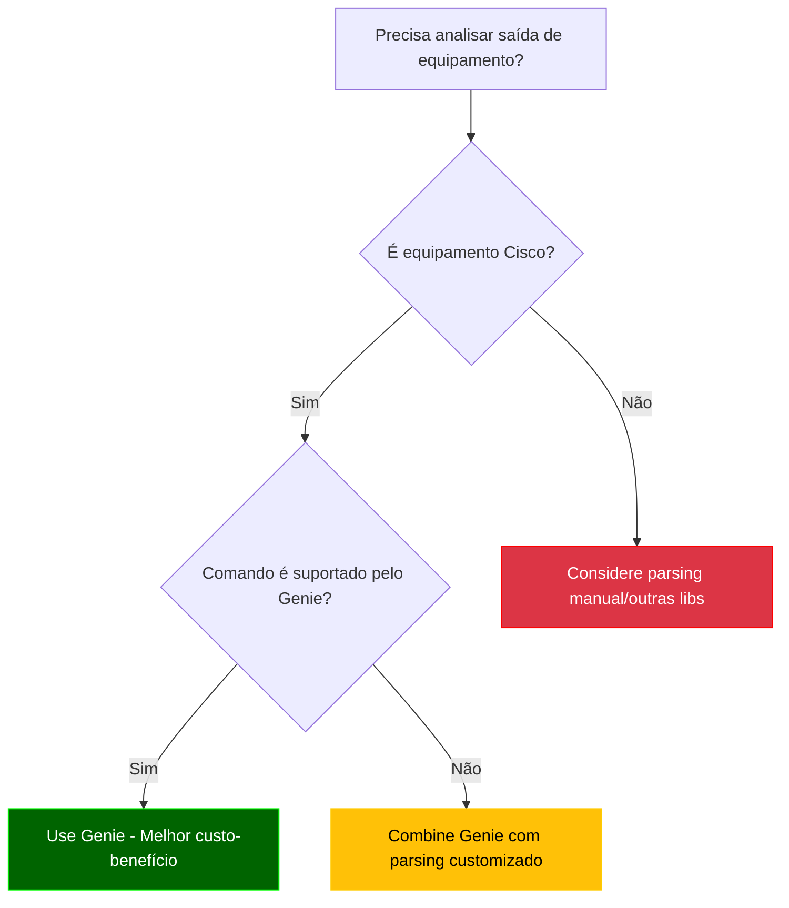
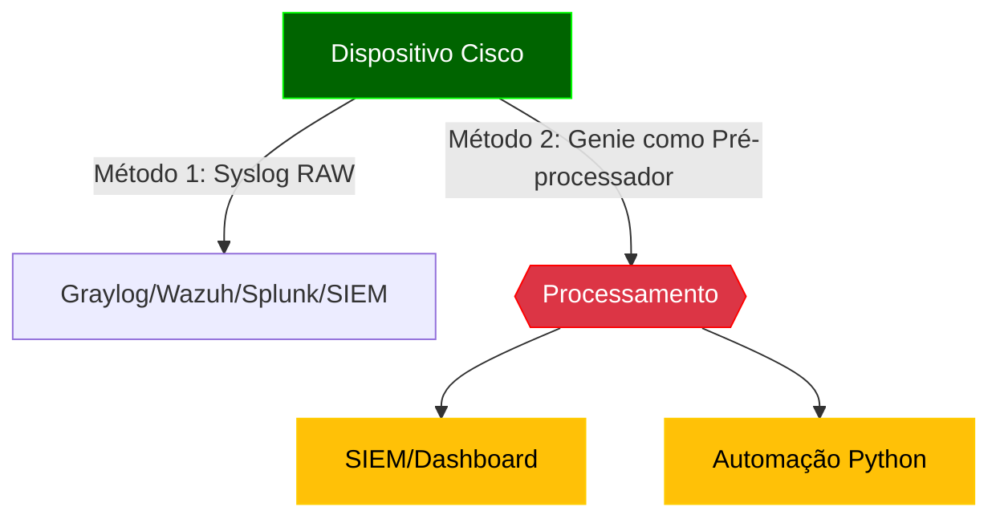
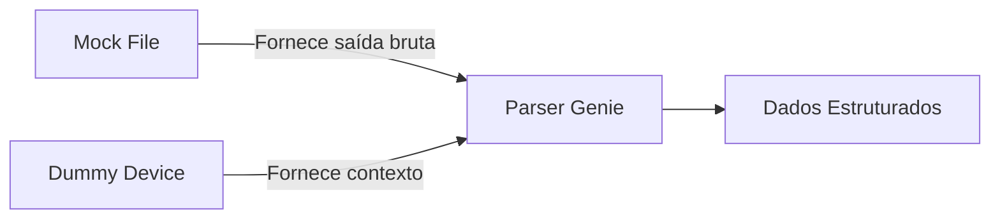

# Python - 14

## Parsing Automático - Genie

## Sumário
- [Python - 14](#python---14)
  - [Parsing Automático - Genie](#parsing-automático---genie)
  - [Sumário](#sumário)
    - [Introdução ao Genie](#introdução-ao-genie)
    - [Comparação: Parsing Manual vs Genie](#comparação-parsing-manual-vs-genie)
    - [Documentação oficial](#documentação-oficial)
    - [O que é um Framework?](#o-que-é-um-framework)
    - [O que vamos estudar](#o-que-vamos-estudar)
    - [Para que serve o Genie?](#para-que-serve-o-genie)
    - [Quando usar o Genie para Parsing?](#quando-usar-o-genie-para-parsing)
    - [Quando evitar ou adiar o uso do Genie?](#quando-evitar-ou-adiar-o-uso-do-genie)
    - [Fluxo de Decisão para Uso do Genie](#fluxo-de-decisão-para-uso-do-genie)
  - [Considerações sobre IOS vs IOS-XE](#considerações-sobre-ios-vs-ios-xe)
    - [Compatibilidade do Genie](#compatibilidade-do-genie)
    - [Recomendações para CCNP:](#recomendações-para-ccnp)
    - [💡 **Por que isso é importante?**](#-por-que-isso-é-importante)
  - [Instalação e Primeiros Passos com Genie](#instalação-e-primeiros-passos-com-genie)
    - [Pré-requisitos](#pré-requisitos)
    - [Instalação](#instalação)
    - [Verificação](#verificação)
    - [Estrutura de Parsers](#estrutura-de-parsers)
  - [Onde o Genie se Encaixa? (Fluxo de Processamento)](#onde-o-genie-se-encaixa-fluxo-de-processamento)
    - [Abordagens Comparadas](#abordagens-comparadas)
    - [Casos de Uso Típicos do Genie](#casos-de-uso-típicos-do-genie)
    - [Quando NÃO Usar Genie?](#quando-não-usar-genie)
    - [Recomendações de Uso](#recomendações-de-uso)
    - [Casos de Uso do Genie (do Básico ao Avançado)](#casos-de-uso-do-genie-do-básico-ao-avançado)
    - [Conceitos Fundamentais no Genie: Mock Files e Dummy Devices](#conceitos-fundamentais-no-genie-mock-files-e-dummy-devices)
    - [Boas Práticas para Mocks no Genie](#boas-práticas-para-mocks-no-genie)
    - [Dummy Devices (Dispositivos Simulados)](#dummy-devices-dispositivos-simulados)
    - [Relação entre os Conceitos](#relação-entre-os-conceitos)
  - [Quando Usar?](#quando-usar)
    - [Boas práticas para Dummy Devices no Genie](#boas-práticas-para-dummy-devices-no-genie)
    - [Exemplo com mock files e Dummy Devices](#exemplo-com-mock-files-e-dummy-devices)
    - [Exemplos](#exemplos)
  - [Exemplo 01: Parsing de show ip interface brief com Genie](#exemplo-01-parsing-de-show-ip-interface-brief-com-genie)
  - [Exemplo 02: Parsing de show version com Genie](#exemplo-02-parsing-de-show-version-com-genie)


### Introdução ao Genie

O Cisco Genie é um framework de automação e parsing desenvolvido pela Cisco como parte do pyATS/Test Automation Solution. Ele fornece parsers pré-construídos para a maioria dos comandos show da Cisco, transformando saídas de texto não estruturadas em dados estruturados prontos para automação.

**Por que usar Genie para o CCNP ENCOR?**
- Cobre todos os comandos relevantes do blueprint (BGP, OSPF, interfaces, etc.)
- Modelos de dados consistentes para diferentes plataformas IOS-XE, NX-OS, IOS-XR
- Integração com pyATS para testes automatizados
- Economiza tempo em troubleshooting e validação de configurações

### Comparação: Parsing Manual vs Genie

| Característica          | Parsing Manual | Genie       |
|-------------------------|----------------|-------------|
| Tempo de desenvolvimento | Alto          | Baixo       |
| Manutenção              | Complexa       | Simples     |
| Cobertura de comandos   | Limitada       | Amplo       |
| Consistência            | Variável       | Padronizado |
| Curva de aprendizado    | Moderada       | Baixa       |
| Adequação para CCNP     | Fundamental    | Essencial   |

### Documentação oficial

Genie - Cisco  
https://developer.cisco.com/docs/genie-docs/

PyYaml  
https://pyyaml.org/wiki/PyYAMLDocumentation

### O que é um Framework?

Um framework (estrutura, em português) é uma plataforma abrangente que fornece:

  - Uma estrutura base para desenvolvimento

  - Conjunto de ferramentas integradas

  - Convenções e melhores práticas

  - Funcionalidades pré-construídas

**Analogia:** Pense como um kit de construção - você recebe a estrutura básica e ferramentas especializadas para construir algo específico.
A Arquitetura pyATS/Genie

```Bash
pyATS (Framework de Teste e Automação)
├── Core (Infraestrutura básica)
├── Genie (Biblioteca de Parsing e Automação)
│   ├── Libs (Bibliotecas específicas)
│   │   ├── Parser (Análise de comandos)
│   │   ├── SDK (Interface de programação)
│   │   └── ... 
├── XPRESS (API REST)
└── Outros componentes
```

**Use Genie quando precisar:**

  - Fazer parsing de comandos **show**

  - Comparar estados de rede **(snapshots)**

  - Criar triggers para **monitoramento**

  - Implementar automação operacional

---
Arrumar

### O que vamos estudar

  - Parsing de JSON: APIs Cisco (DNA Center, Meraki), extração de dados estruturados.

  - Parsing de XML: Configurações NETCONF e arquivos legados.

  - Parsing de YAML: Inventários do Ansible e templates declarativos.

  - Regex para CLI: Análise de comandos show e logs (ex: BGP, interfaces).

  - Integração com ferramentas: SIEMs (Graylog/Splunk) e parsers automáticos (Genie).

---
Arrumar

### Para que serve o Genie?

Principais objetivos:

  - Extrair informações estruturadas de comandos Cisco: status de interfaces, vizinhos BGP, rotas OSPF, etc., com parsers pré-construídos.

  - Validar automaticamente saídas de comandos, garantindo consistência entre plataformas (IOS-XE, NX-OS).

  - Transformar CLI em JSON estruturado, pronto para automação em Python.

  - Gerar relatórios e análises comparativas (ex: snapshots antes/depois de mudanças) para ferramentas como Grafana ou SIEMs.

**Diferencial:** Elimina a necessidade de regex manual, padronizando o parsing em ambientes Cisco.

### Quando usar o Genie para Parsing?

Você deve considerar o Genie para parsing quando:  

| Cenário	                                        | Exemplo com Genie                          	                  | Benefício do Genie                                                  |
|-------------------------------------------------|---------------------------------------------------------------|---------------------------------------------------------------------|
|📤 Trabalha com saídas de comandos Cisco	        | show ip interface brief, show bgp summary	                    | Parsers pré-construídos para +500 comandos Cisco                    |
|🧩 Precisa de dados estruturados consistentes    | Comparar snapshots de show interface antes/depois de mudanças | Modelos de dados padronizados para todas plataformas (IOS-XE, NX-OS, IOS-XR) |
|📊 Requer validação complexa de estado de rede   | Verificar se todos vizinhos BGP estão estabelecidos           | Funções built-in para análise de estado                             |
|🔄 Desenvolve automação operacional              | Monitorar flaps de interface automaticamente                  | Sistema de triggers e aprendizado de estado                         |
|🕵️ Precisa fazer troubleshooting em larga escala | Identificar interfaces down em 100 dispositivos               | Parsing eficiente e relatórios consolidados                        |

### Quando evitar ou adiar o uso do Genie?

O Genie pode não ser a melhor escolha quando:  

| Situação                                                    | Alternativa Recomendada	Razão                                                               |
|-------------------------------------------------------------|---------------------------------------------------------------------------------------------|
| Trabalha com equipamentos não-Cisco                         | Parsers customizados ou bibliotecas vendor-specific	Cobertura limitada a ecossistema Cisco  |
| Necessita parsing de saídas completamente customizadas      | Regex ou parsing manual	Genie funciona melhor com saídas de comandos padrão                 |
| Desenvolve soluções simples/únicas                          | Processamento básico de strings	Overhead de configuração pode não valer a pena              |
| Trabalha com formatos não suportados (ex: logs específicos) | Ferramentas especializadas (Logstash, etc.)	Genie foca em saídas de comandos CLI            |
| Precisa de parsing em tempo real extremamente rápido        | Processamento direto na CLI	Genie adiciona pequena latência na transformação                |

### Fluxo de Decisão para Uso do Genie



**Legenda:**

    🟢 Verde: Casos ideais para Genie

    🟡 Amarelo: Casos que podem usar Genie parcialmente

    🔴 Vermelho: Casos onde Genie não é recomendado

## Considerações sobre IOS vs IOS-XE

### Compatibilidade do Genie
| Feature          | IOS Tradicional | IOS-XE |
|------------------|-----------------|--------|
| Parsers CLI      | 85% cobertura   | 100%   |
| Validação        | Básica          | Avançada |
| APIs             | Não             | Sim    |

### Recomendações para CCNP:
1. Priorize estudos em IOS-XE
2. Para IOS legado:
   - Use `genie.libs.parser.ios`
   - Combine com regex quando necessário
3. Pratique a conversão mental entre sintaxes:
   ```bash
   # IOS
   show ip interface brief
   # IOS-XE
   show interface | include IP
   ```

### 💡 **Por que isso é importante?**
- **Mercado**: Novos projetos Cisco são quase todos IOS-XE
- **Exame**: CCNP ENCOR testa ambos, mas com pesos diferentes
- **Automação**: Seu código precisará lidar com ambientes híbridos

## Instalação e Primeiros Passos com Genie

### Pré-requisitos
- Python 3.6+
- PIP atualizado
- Ambiente virtual (recomendado)

### Instalação
```bash
# Opção 1: Apenas Genie (para parsing - vamos utilizar esse agora)
pip install genie

# Opção 2: pyATS completo (recomendado para CCNP)
pip install pyats[full]
```

### Verificação

```python
from genie.conf import Genie
genie = Genie.init()
print(f"Genie {genie.version} instalado corretamente")
```

### Estrutura de Parsers

Principais módulos para CCNP ENCOR:

```Bash
genie/
└── libs/
    └── parser/
        ├── iosxe/
        │   ├── show_interface.py
        │   ├── show_bgp.py
        │   └── show_ip_route.py
        └── nxos/  # Para estudos multivendor
```

Exemplo Básico - Parsing de Interface

```python
from genie.libs.parser.iosxe.show_interface import ShowIpInterfaceBrief

output = '''
Interface              IP-Address      OK? Method Status                Protocol
GigabitEthernet0/0     192.168.1.1    YES manual up                    up
GigabitEthernet0/1     unassigned     YES unset  administratively down down
'''

parsed = ShowIpInterfaceBrief.parse(output=output)
print(f"Status de G0/0: {parsed['interface']['GigabitEthernet0/0']['status']}")
```

**Saída Esperada:**

```Bash
Status de G0/0: up
```

## Onde o Genie se Encaixa? (Fluxo de Processamento)



### Abordagens Comparadas

**Abordagem 1: Syslog Direto (Sem Genie)**

Como funciona:
    
  ```bash
    Router(config)# logging host 10.0.0.100  # Envia logs brutos para Graylog
  ```
    
**Prós:**

  - Simplicidade de configuração

  - Baixa latência

**Contras:**

  - Dados não estruturados (ex: %BGP-5-ADJCHANGE: neighbor 10.0.0.1 Down)

  - Necessidade de parsers no SIEM (GroK, regex)

  - Limitado a eventos pré-definidos

**Abordagem 2: Genie como Pré-processador (Recomendada para CCNP/automação)**

Fluxo:

  - Script Python coleta dados via SSH/API (ex: show bgp summary)

  - Genie faz parsing estruturado:
      
      ```python
        from genie.libs.parser.iosxe.show_bgp import ShowBgpAllSummary
        parsed = ShowBgpAllSummary.parse(device_output)
      ```
        
Dados são:

  - Enviados para SIEM como JSON estruturado

  - Ou processados localmente (ex: alertas via Slack)

**Vantagens:**

  - Estruturação RICA: Transforma "up/down" em {"bgp_neighbors": {"10.0.0.1": {"state": "down", "uptime": "00:01:23"}}}

  - Contexto para Troubleshooting: Mantém relações entre dados (ex: interface + BGP + OSPF)

  - Validação Automática: Checa se dados estão completos antes do envio

  - Preparação para CCNP: Pratica comandos show e análise estruturada

### Casos de Uso Típicos do Genie

| Cenário         | Exemplo	Vantagem vs. Syslog Bruto                                           |
|-----------------|-----------------------------------------------------------------------------|
| Troubleshooting	| Extrair todos vizinhos BGP inativos	Dados prontos para análise em Grafana   |
| Compliance      | Verificar se todas interfaces têm descrição	Validação programática          | 
| Monitoramento   | Alertar se >50% da CPU por 5min	Correlação com outros dados                 |

### Quando NÃO Usar Genie?

- Logs de Eventos Simples (ex: %LINK-UPDOWN): Syslog direto é suficiente

- Ambientes Não-Cisco: Genie tem suporte limitado a outros vendors

- Latência Crítica: Parsing adiciona ~100-500ms de processamento

### Recomendações de Uso

**Comparação Detalhada**

| Ferramenta        | Cisco      | Juniper | Arista | Nokia | API First | Learning Mode |
|-------------------|------------|---------|--------|-------|-----------|---------------|
| Genie             | ✅✅✅   | ✅      | ✅     | ❌   | ✅        | ✅           |
| TextFSM           | ✅✅      | ✅✅	 | ✅✅	 | ✅    | ❌	      | ❌            |
| PyATS             | ✅✅✅    | ✅	   | ✅     | ✅   | ✅        | ✅           |
| Ansible cli_parse | ✅✅      | ✅✅   | ✅✅  | ✅✅ | ✅        | ❌           |
| Scrapli	          | ✅✅      | ✅✅   | ✅     | ❌   | ✅        | ❌           |

Legenda: ✅✅✅ = Suporte nativo completo | ✅ = Suporte básico

**Quando Usar Cada Uma?**

  - Ambientes Cisco-dominantess → Genie/PyATS

  - Multivendor com foco em legacy → TextFSM + NTC-Templates

  - Automação com Ansible existente → cli_parse

  - Performance crítica → Scrapli

### Casos de Uso do Genie (do Básico ao Avançado)

| Comando                 | Protocolo/Feature | Aplicação Típica                                                             |
|-------------------------|-------------------|------------------------------------------------------------------------------|
| show ip interface brief | Interfaces        | Verificar status (up/down) e endereços IP das interfaces.                    |
| show version            | Sistema           | Coletar modelo, versão do IOS e tempo de operação (uptime).                  |
| show vlan brief         | VLANs (Switches)  | Listar VLANs configuradas e portas associadas.                               |
| show cdp neighbors      | Topologia         | Mapear dispositivos vizinhos e conexões.                                     |
| show ip ospf neighbor   | OSPF              | Verificar adjacências (FULL/DOWN) e problemas de vizinhança.                 |
| show ip eigrp neighbors | EIGRP             | Monitorar estabilidade de vizinhos EIGRP.                                    |
| show bgp summary        | BGP               | Checar sessões com peers (estabelecidas/pendentes) e contagem de rotas.      |
| show ip route	          | Roteamento	      | Analisar rotas (OSPF, EIGRP, estáticas) e métricas.                          |
| show running-config     | Configuração      | Auditoria de segurança (ACLs, SNMP) ou compliance (descrição de interfaces). |
| show interface trunk    | VLANs (Trunks)    | Verificar trunks configurados e modo de encapsulamento (802.1Q).             |
| Snapshot (antes/depois) | Todos             | Validar impactos de mudanças (ex.: interfaces que caíram após upgrade).      |
| show tech-support       | Diagnóstico	      | Troubleshooting avançado (combina dados de múltiplos comandos).              |

### Conceitos Fundamentais no Genie: Mock Files e Dummy Devices

Antes de avançarmos, é essencial entender dois pilares do Genie/pyATS para automação e testes:

**1. Mock Files (Arquivos de Simulação)**

**O que são?**  

Arquivos de texto (.txt) que contêm saídas simuladas de comandos Cisco, como show version ou show ip interface brief. Esses arquivos imitam exatamente o que um dispositivo real retornaria via CLI.

**Por que usar?**

    ✅ Teste sem equipamentos: Permite desenvolver e validar parsers sem acesso físico a roteadores/switches.

    ✅ Consistência: Garante que o parser sempre receba a mesma entrada (útil para depuração).

    ✅ Eficiência: Elimina a latência de conexões SSH/Telnet durante o desenvolvimento.

**Exemplo Prático:**

```python
# mock_data/show_version.txt
Cisco IOS XE Software, Version 17.03.04
Router uptime is 1 week, 2 days
System image file is "bootflash:isr4300-universalk9.17.03.04.SPA.bin"
```

**🧠 Por que usar conteúdo mock?**

| Vantagem                      | Explicação                                                                           |
|-------------------------------|--------------------------------------------------------------------------------------|
| ✅ Não depende de laboratório | Você pode estudar e desenvolver seu código sem ter acesso a equipamentos reais       |
| ✅ Reprodutível               | O conteúdo é sempre o mesmo, então facilita testes e debug                           |
| ✅ Ideal para aprendizado     | Te permite focar no parsing e na lógica, sem se preocupar com conexões ou permissões |
| ✅ Rápido e leve              | Você roda tudo localmente em segundos, com arquivos .txt                             |

**📌 Exemplo de conteúdo mock (simulação de saída)**

```Bash
Interface              IP-Address      OK? Method Status                Protocol
GigabitEthernet0/0     192.168.1.1     YES manual up                    up
GigabitEthernet0/1     unassigned      YES unset  administratively down down
Loopback0              10.0.0.1        YES manual up                    up
```

Isso imita a resposta real do roteador, e permite que o parser Genie funcione corretamente.  

### Boas Práticas para Mocks no Genie

Para Projetos Reais:

1. Estrutura de Pastas:

```Bash

    project/
    ├── src/
    │   ├── parsers/
    │   └── tests/
    │       ├── mock_data/
    │       │   ├── iosxe/
    │       │   │   ├── show_version.txt
    │       │   │   └── show_interface.txt
    │       └── test_parsers.py
```

2. Nomenclatura:

   - Use nomes descritivos: iosxe_show_version_v17.3.4.txt.

3. Validação:

   - Sempre verifique se o mock corresponde à saída real (copie do dispositivo se possível).  

4. Para Fins Didáticos:

   - Mantenha os mocks em arquivos separados.

   - Adicione comentários explicativos no mock:

```Bash
# mock_data/show_version.txt
# Saída simulada de um Cisco ISR4321 com IOS-XE 17.03.04
# Última atualização: 2024-06-01
Cisco IOS XE Software, Version 17.03.04
...
```

5. Armazene em pastas mock_data/ separadas por OS (ex: iosxe/, nxos/).  

6. Nomeie os arquivos com o comando e versão (ex: show_version_iosxe_17.3.4.txt).

### Dummy Devices (Dispositivos Simulados)

**O que são?**  

Classes Python simples que emulam um dispositivo de rede (roteador, switch) para fins de teste. Elas fornecem os atributos mínimos que o Genie precisa para operar (como os e type).  

**Por que usar?**  

    ✅ Abstração: Testa parsers sem configurar conexões complexas.

    ✅ Flexibilidade: Simula diferentes sistemas operacionais (IOS-XE, NX-OS) mudando apenas self.os.

    ✅ Isolamento: Valida apenas a lógica de parsing, sem interferência de falhas de rede.

Exemplo Prático:

```python

class DummyDevice:
    def __init__(self, os='iosxe', name='lab-router'):
        self.os = os  # Define o sistema operacional (crucial para o Genie)
        self.name = name  # Identificação opcional

# Uso:
device = DummyDevice(os='iosxe')
parser = ShowVersion(device=device)  # O parser usa 'os' para selecionar a implementação correta
```

### Relação entre os Conceitos



- Mock File: Simula o que o dispositivo envia (dados).

- Dummy Device: Simula quem envia (contexto: IOS-XE, NX-OS, etc.).

## Quando Usar?

| Cenário	Mock             | File                    | Dummy Device                   |
|--------------------------|-------------------------|--------------------------------|
| Desenvolvimento local    | ✅                     | ✅                             |
| Testes em CI/CD          | ✅	                   | ✅                             |
| Validação rápida         | ❌ (Use string direta) | ✅                             |
| Conexão a dispositivo real | ❌	                   | ❌ (Use Device real)         |  

### Boas práticas para Dummy Devices no Genie

Adicione apenas os atributos essenciais (os, type, name).

Use herança para casos complexos:

```python

class DummyISR(DummyDevice):
    def __init__(self):
        super().__init__(os='iosxe', type='router', name='isr4321')
```

### Exemplo com mock files e Dummy Devices

```Python
from genie.libs.parser.iosxe.show_version import ShowVersion

# 1. Dispositivo simulado
class DummyRouter:
    def __init__(self):
        self.os = 'iosxe'  # Atributo obrigatório para o Genie
        self.name = 'lab-device'

# 2. Mock file
with open('mock_data/show_version.txt') as f:
    raw_output = f.read()

# 3. Parsing
device = DummyRouter()
parsed = ShowVersion(device).parse(output=raw_output)

print(f"Versão: {parsed['version']['version_short']}")
```

### Exemplos

## Exemplo 01: Parsing de show ip interface brief com Genie

**Objetivo:** Extrair status e endereços IP de interfaces de forma estruturada.  

**📁 Estrutura recomendada**

```Bash
genie/
└── 01/
    ├── parse_interface_brief.py
    └── mock_data/
        └── show_ip_interface_brief.txt
```

**Requerimentos: requirements.txt**

```txt
pyats[full]  
```

**OBS:** aqui estou instalado o pyats[FULL] pois ele já instala o Genie na versão mais completa e compatível com a versão do pyats. Dessa maneira não falta nenhuma dependência para o projeto e prevê futuros crescimentos no script como conexões a equipamentos via ssh. A "suite" completa tem 500 Mb, já o Genie ocuparia 200 Mb.

**show_ip_interface_brief.txt**

```txt
Interface              IP-Address      OK? Method Status                Protocol
GigabitEthernet1       unassigned      YES unset  administratively down down    
GigabitEthernet2       10.1.1.1        YES manual up                    up      
Loopback0              192.168.0.1     YES manual up                    up      
```

**parse_interface_brief.py**

```python
[01] from genie.libs.parser.iosxe.show_interface import ShowIpInterfaceBrief
[02] 
[03] class DummyDevice:
[04]     def __init__(self, name='mock'):
[05]         self.name = name
[06] 
[07] device = DummyDevice()
[08] 
[09] # Leitura do conteúdo mock
[10] with open('mock_data/show_ip_interface_brief.txt') as f:
[11]     raw_output = f.read()
[12]
[13] # Parsing
[14] parser = ShowIpInterfaceBrief(device=device)
[15] parsed = parser.parse(output=raw_output)
[16] 
[17] print("\n=== Interfaces Ativas ===")
[18] for intf, details in parsed['interface'].items():
[19]     if details.get('status', '').strip() == 'up':
[20]         print(f"{intf}:")
[21]         print(f"  IP: {details.get('ip_address', 'N/A').strip()}")
[22]         print(f"  Status: {details.get('status', 'N/A').strip()}")
[23]         print(f"  Protocolo: {details.get('protocol', 'N/A').strip()}\n")
[24]
[25] print("\n=== Interfaces Inativas ===")
[26] for intf, details in parsed['interface'].items():
[27]     if details.get('status', '').strip() != 'up':
[28]         print(f"{intf}: {details.get('status', 'unknown').strip()}")
```

**Saída**

```Bash
alcancil@linux:~/automacoes/genie/01$ python3 -m venv genie
alcancil@linux:~/automacoes/genie/01$ source genie/bin/activate
genie) alcancil@linux:~/automacoes/genie/01$ pip install -r requiremnets.txt 
Collecting pyats[full] (from -r requiremnets.txt (line 1))
  Using cached pyats-25.5-cp312-cp312-manylinux2014_x86_64.whl.metadata (4.5 kB)
Collecting packaging>=20.0 (from pyats[full]->-r requiremnets.txt (line 1))
  Using cached packaging-25.0-py3-none-any.whl.metadata (3.3 kB)
Collecting pyats.aereport<25.6.0,>=25.5.0 (from pyats[full]->-r requiremnets.txt (line 1))
  Using cached pyats.aereport-25.5-cp312-cp312-manylinux2014_x86_64.whl.metadata (3.2 kB)
...
4.67.1 types-python-dateutil-2.9.0.20250516 typing-extensions-4.14.0 unicon-25.5 unicon.plugins-25.5 urllib3-2.5.0 wcwidth-0.2.13 websocket-client-1.8.0 wheel-0.45.1 wsproto-1.2.0 xlrd-1.2.0 xlsxwriter-3.2.5 xlwt-1.3.0 xmltodict-0.12.0 yamllint-1.37.1 yang.connector-25.5 yarl-1.20.1
(genie) alcancil@linux:~/automacoes/genie/01$ python3 parse_interface_brief.py 
/home/alcancil/automacoes/genie/01/genie/lib/python3.12/site-packages/unicon/__init__.py:10: UserWarning: pkg_resources is deprecated as an API. See https://setuptools.pypa.io/en/latest/pkg_resources.html. The pkg_resources package is slated for removal as early as 2025-11-30. Refrain from using this package or pin to Setuptools<81.
  from unicon.core.pluginmanager import PluginManager

=== Interfaces Ativas ===
GigabitEthernet2:
  IP: 10.1.1.1
  Status: up
  Protocolo: up

Loopback0:
  IP: 192.168.0.1
  Status: up
  Protocolo: up


=== Interfaces Inativas ===
GigabitEthernet1: administratively down
(genie) alcancil@linux:~/automacoes/genie/01$ 
```

**Explicação**

```Python
[Bloco 1] Importação da biblioteca Genie

[01] from genie.libs.parser.iosxe.show_interface import ShowIpInterfaceBrief    # Importa o parser específico do comando 'show ip interface brief' para dispositivos IOS-XE

[Bloco 2] Criação de um dispositivo simulado (Dummy)

[03] class DummyDevice:                                                         # Define uma classe fictícia que simula um "device" para o parser funcionar
[04]     def __init__(self, name='mock'):                                       # Método construtor da classe
[05]         self.name = name                                                   # Atribui um nome ao dispositivo (apenas para satisfazer o parser)
[07] device = DummyDevice()                                                     # Instancia o dispositivo simulado

[Bloco 3] Leitura da saída simulada do comando CLI

[09] # Leitura do conteúdo mock
[10] with open('mock_data/show_ip_interface_brief.txt') as f:                   # Abre o arquivo contendo a saída simulada do comando
[11]     raw_output = f.read()                                                  # Lê todo o conteúdo do arquivo e armazena na variável

[Bloco 4] Parsing da saída usando Genie

[13] # Parsing
[14] parser = ShowIpInterfaceBrief(device=device)                               # Cria o objeto parser, passando o dispositivo simulado como parâmetro
[15] parsed = parser.parse(output=raw_output)                                   # Executa o parsing da saída CLI e armazena os dados estruturados em 'parsed'

[Bloco 5] Impressão das interfaces com status "up" (ativas)

[17] print("\n=== Interfaces Ativas ===")                                       # Título da seção de interfaces ativas
[18] for intf, details in parsed['interface'].items():                          # Itera sobre cada interface e seus detalhes
[19]     if details.get('status', '').strip() == 'up':                          # Verifica se o status da interface é "up"
[20]         print(f"{intf}:")                                                  # Exibe o nome da interface
[21]         print(f"  IP: {details.get('ip_address', 'N/A').strip()}")         # Exibe o IP da interface
[22]         print(f"  Status: {details.get('status', 'N/A').strip()}")         # Exibe o status (ex: up, administratively down)
[23]         print(f"  Protocolo: {details.get('protocol', 'N/A').strip()}\n")  # Exibe o status do protocolo (ex: up/down)

[Bloco 6] Impressão das interfaces com status diferente de "up" (inativas)

[25] print("\n=== Interfaces Inativas ===")                                     # Título da seção de interfaces inativas
[26] for intf, details in parsed['interface'].items():                          # Itera novamente sobre todas as interfaces
[27]     if details.get('status', '').strip() != 'up':                          # Verifica se o status não é "up"
[28]         print(f"{intf}: {details.get('status', 'unknown').strip()}")       # Exibe o nome e o statu
```

## Exemplo 02: Parsing de show version com Genie

**Objetivo:**

Extrair informações estruturadas sobre o sistema operacional do roteador: versão do IOS, modelo do hardware, tempo de uptime e outros detalhes relevantes.  

**📁 Estrutura recomendada**

```Bash
genie/
└── 02/
    ├── parse_show_version.py
    └── mock_data/
        └── show_version.txt
```

**requirements.txt**

```Bash
pyats[full]
```

**mock_data/show_version.txt (exemplo de saída real)**

```Bash
Cisco IOS XE Software, Version 17.03.04
Cisco IOS Software [Amsterdam], ISR Software (ARMV8EB_LINUX_IOSD-UNIVERSALK9_IAS-M), Version 17.3.4, RELEASE SOFTWARE (fc3)
Technical Support: http://www.cisco.com/techsupport
Compiled Tue 20-Apr-21 09:18 by mcpre

ROM: IOS-XE ROMMON

Router uptime is 1 week, 2 days, 5 hours, 30 minutes
System returned to ROM by PowerOn
System image file is "bootflash:isr4300-universalk9.17.03.04.SPA.bin"
Last reload reason: PowerOn

Cisco ISR4321/K9 (1RU) processor with 1662612K/6147K bytes of memory.
Processor board ID FLM2306W0LB
2 Gigabit Ethernet interfaces
32768K bytes of non-volatile configuration memory.
4194304K bytes of physical memory.
2557440K bytes of flash memory at bootflash:.
```

**parse_show_version.py**

```Python
from genie.libs.parser.iosxe.show_version import ShowVersionMode

# Testbed com mock
testbed = load({
    "devices": {
        "mock": {
            "os": "iosxe",
            "type": "router",
            "connections": {
                "cli": {
                    "protocol": "mock"
                }
            }
        }
    }
})

device = testbed.devices['mock']

# Lê a saída do comando salva no arquivo mock
with open('mock_data/show_version.txt') as f:
    raw_output = f.read()

# Usa o parser automaticamente, sem importar a classe diretamente
parser = ShowVersionMode(device=device)
parsed = parser.parse(output=raw_output)

# Impressão dos dados estruturados relevantes
print("\n=== Informações do Sistema ===")
print(f"Versão do IOS: {parsed.get('version', {}).get('version', 'N/A')}")
print(f"Nome da Imagem: {parsed.get('version', {}).get('system_image', 'N/A')}")
print(f"Modelo: {parsed.get('version', {}).get('chassis', 'N/A')}")
print(f"Tempo de Uptime: {parsed.get('version', {}).get('uptime', 'N/A')}")
print(f"Motivo do último reload: {parsed.get('version', {}).get('reload_reason', 'N/A')}")

```

---
Continuar


