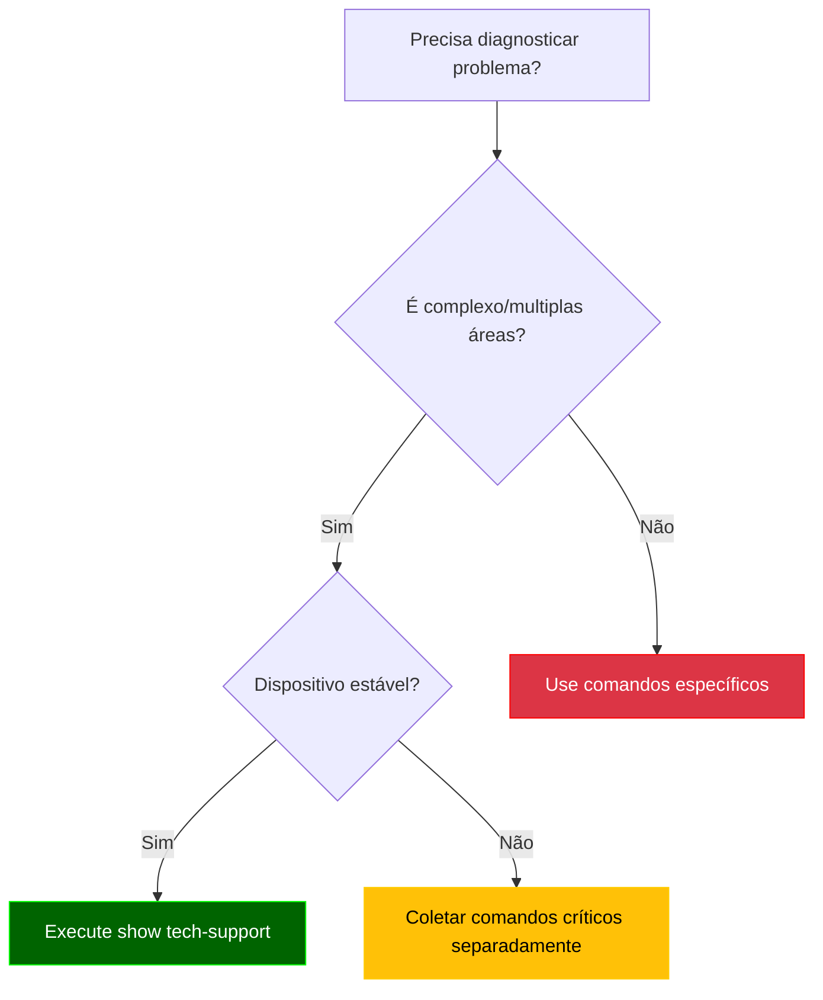
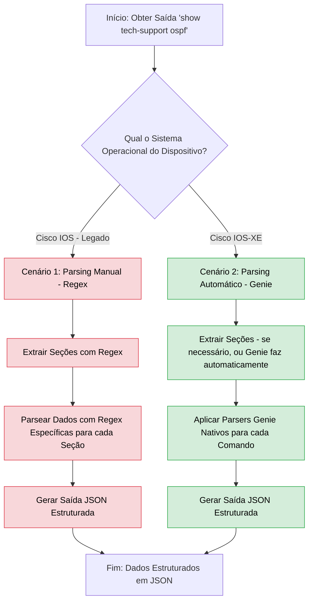
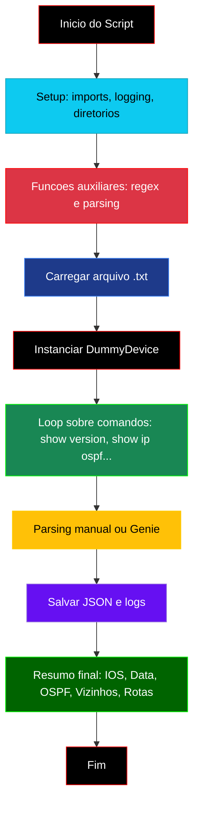
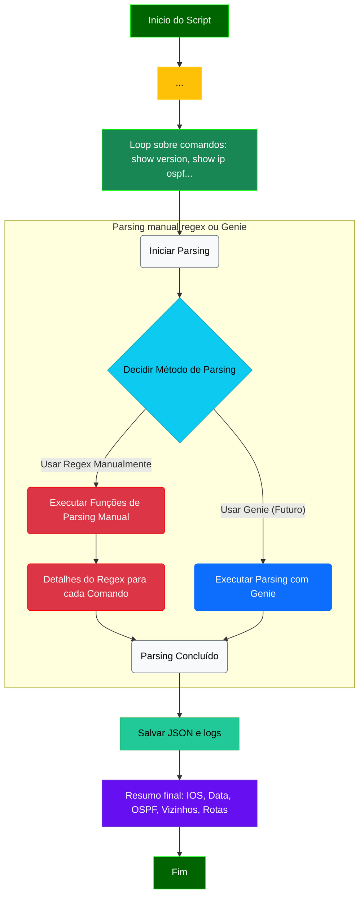
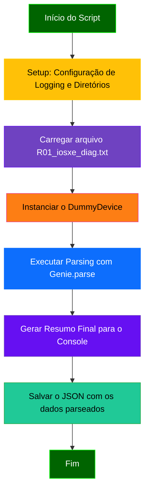
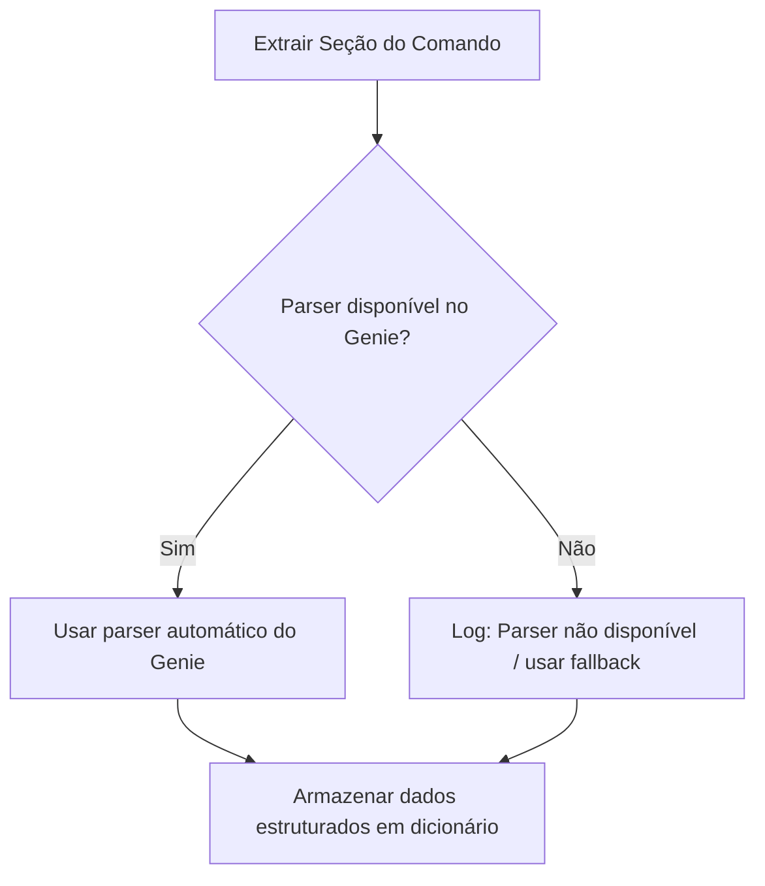

# Python - 15

## Parsing Automático - Genie

## Sumário
- [Python - 15](#python---15)
  - [Parsing Automático - Genie](#parsing-automático---genie)
  - [Sumário](#sumário)
      - [Comando show tech-support](#comando-show-tech-support)
    - [Parsing de show tech-support (comparativo)](#parsing-de-show-tech-support-comparativo)
      - [🔹 Cenário 1 — Cisco IOS (legado)](#-cenário-1--cisco-ios-legado)
      - [🔹 Cenário 2 — Cisco IOS-XE](#-cenário-2--cisco-ios-xe)
    - [Objetivo didático](#objetivo-didático)
    - [Aplicando na Prática](#aplicando-na-prática)
    - [Fluxo de decisão - Quando utilizar: Parsing Manual (Regex) X Parsing Automático (Genie)](#fluxo-de-decisão---quando-utilizar-parsing-manual-regex-x-parsing-automático-genie)
    - [Exemplo 12: Parsing de show tech-support](#exemplo-12-parsing-de-show-tech-support)
    - [🔹 Cenário 1 — Cisco IOS (legado)](#-cenário-1--cisco-ios-legado-1)
    - [Fluxograma](#fluxograma)
    - [Expandindo a explicação](#expandindo-a-explicação)
      - [Bloco Loop sobre comandos: show version, show ip ospf...](#bloco-loop-sobre-comandos-show-version-show-ip-ospf)
      - [Explicação Detalhada do Bloco 5 do Código](#explicação-detalhada-do-bloco-5-do-código)
    - [Quando usar o `while` em vez do `for`?](#quando-usar-o-while-em-vez-do-for)
    - [Exemplo 12B: Parsing de show tech-support](#exemplo-12b-parsing-de-show-tech-support)
      - [🔹 Cenário 2 — Cisco IOS-XE](#-cenário-2--cisco-ios-xe-1)
    - [Expandindo a Explicação](#expandindo-a-explicação-1)

#### Comando show tech-support

**O Que É?**

O show tech-support é um comando **omnibus** (tudo-em-um, agregador de comandos) dos dispositivos Cisco que coleta automaticamente:

  - Saídas de 50+ comandos críticos (show version, show running-config, show interfaces, etc.)

  - Status operacional de todos os principais protocolos

  - Logs e mensagens de erro recentes

  - Estatísticas de hardware e desempenho

```bash
Router# show tech-support
! Saída consolidada de dezenas de comandos show
```

**Quando Usar? (Casos Ideais)**

| Cenário                  | Benefício                                            | Exemplo Prático                                 |
|--------------------------|------------------------------------------------------|-------------------------------------------------|
| Troubleshooting complexo | Elimina necessidade de executar comandos manualmente | Investigar flapping de interfaces + BGP resets  |
| Pós-falha                | Captura estado do sistema antes de reinicialização   | Crash do dispositivo                            |
| Auditoria periódica      | Baseline de configuração e performance               | Comparação trimestral                           |
| Suporte TAC Cisco        | Requisito obrigatório para abertura de casos         | Ticket para falha de hardware                   |

**Quando Evitar?**

| Situação                          | Problema                           | Alternativa Recomendada                               |
|-----------------------------------|------------------------------------|-------------------------------------------------------| 
| Dispositivos sob carga (>70% CPU) | Pode causar instabilidade          | Coletar comandos individuais prioritários             |
| Links lentos (WAN < 1Mbps)        | Gera tráfego excessivo             | Usar `show tech-support	redirect` para arquivo local |
| Monitoramento rotineiro           | Overkill para verificações simples | Comandos específicos (show interface summary)         |
| Ambientes não-Cisco               | Incompatibilidade	                 | Comandos vendor-specific equivalentes                 |

**Fluxo de Decisão**



**Dados Coletados (Estrutura Típica)**

```bash
1. System Info          # show version, show inventory
2. CPU/Memory           # show processes cpu, show memory
3. Interfaces           # show interfaces, show ip interface brief
4. Routing              # show ip route, show ip protocols
5. ACLs/NAT             # show access-lists, show ip nat translations
6. Logs                 # show logging
... (50+ seções)
```

**Boas Práticas**

- Filtragem:

```bash
show tech-support | include error|fail|down  # Filtra apenas problemas
```

- Redirecionamento:

```bash
show tech-support > flash:/tech_support_$(date +%F).txt
```

Deixo aqui um exemplo de uma saída completa do comando: `show tech-support ospf`  
**OBS:** a versão do IOS em que foi retirada a saída é: `Cisco IOS Software, 7200 Software (C7200-ADVENTERPRISEK9-M), Version 15.2(4)S7, RELEASE SOFTWARE (fc4)`

[R01_ospf_diag.txt](Arquivos/12/R01_ospf_diag.txt)

**OBS2:** a versão do IOS em que foi retirada a saída é: `Cisco IOS Software [IOSXE], Linux Software (X86_64BI_LINUX-ADVENTERPRISEK9-M), Version 17.15.1, RELEASE SOFTWARE (fc4)`  

[ospf_diag.txt](Arquivos/12_b/ospf_diag.txt)


### Parsing de show tech-support (comparativo)

Neste exemplo avançado, vamos explorar como processar a saída extensa do comando `show tech-support ospf` de forma estruturada. Esse comando combina dezenas de seções (show version, show ip ospf, show ip route, etc.) e é amplamente utilizado para diagnósticos, auditorias e troubleshooting.

Aqui será feito um comparativo entre duas abordagens:

#### 🔹 Cenário 1 — Cisco IOS (legado)
Neste caso, não há suporte direto do Genie para muitos comandos. Portanto, o parsing é feito com **regex manual**, identificando trechos-chave da saída (`show version`, `show clock`, `show ip ospf`, etc.) para extração de dados relevantes.

✅ *Funciona, mas exige mais esforço, manutenção e conhecimento de expressões regulares.*

#### 🔹 Cenário 2 — Cisco IOS-XE
Aqui utilizamos **parsers automáticos do Genie** que suportam os comandos nativamente. Após separar a saída do `show tech-support` por blocos, os dados são extraídos automaticamente com os modelos do Genie.

✅ *Mais rápido, menos propenso a erro, ideal para automação em larga escala.*

---

### Objetivo didático

O foco não é ensinar regex, mas demonstrar que:
- O uso de parsers automáticos como o Genie é **mais prático, confiável e sustentável**
- Quando não há parser disponível (como em versões IOS mais antigas), é possível recorrer ao regex como fallback

---

### Aplicando na Prática

A seguir, apresentamos um exemplo real em que foi necessário processar a saída extensa do comando `show tech-support ospf`. O objetivo principal é demonstrar **as diferenças práticas** entre utilizar expressões regulares manuais e parsers automáticos do Genie.

O foco aqui não é aprofundar o uso de regex, mas sim ilustrar como ela pode ser usada como alternativa em ambientes **sem suporte oficial** do Genie (como IOS legado). Em contrapartida, no cenário com suporte Genie (IOS-XE), mostramos como os parsers automáticos oferecem **maior produtividade, confiabilidade e reutilização.**

### Fluxo de decisão - Quando utilizar: Parsing Manual (Regex) X Parsing Automático (Genie)  



**Observação Importante:**

> Ao trabalhar com parsers automáticos do Genie, é fundamental sempre consultar a documentação oficial e o repositório do projeto para verificar a disponibilidade e compatibilidade dos > parsers para os comandos e sistemas operacionais específicos. Nem todo comando possui um parser nativo para todas as versões de IOS ou IOS-XE. Em casos onde um parser automático não  > está disponível ou não se adequa à saída do seu dispositivo, o parsing manual com regex se torna uma alternativa necessária e válida.
> Você pode encontrar os parsers disponíveis e contribuir para o projeto no repositório oficial do Genie Parser: https://github.com/CiscoTestAutomation/genieparser  

### Exemplo 12: Parsing de show tech-support  

### 🔹 Cenário 1 — Cisco IOS (legado)  

**Objetivo**  

Interpretar a saída do comando show tech-support em dispositivos Cisco IOS (legado) utilizando Python e Genie, com foco na extração e estruturação de informações chave sobre o estado operacional do OSPF, incluindo ID do roteador, vizinhanças e rotas. O script extrai seções específicas do show tech-support (como show version, show clock, show ip ospf, show ip ospf neighbor e show ip route ospf), exibe um resumo no terminal e salva os dados parseados em formato JSON para análise e auditoria.

**Nota:** Este exemplo foi adaptado a partir de um modelo genérico anterior, focando especificamente no protocolo OSPF para demonstrar parsing manual versus automático com Genie.

**📁 Estrutura do Projeto**

```bash
12_show_tech_support_ios/
├── Arquivos/
│   └── R01_ospf_diag.txt                            # Saída simulada do comando 'show tech-support'
├── logs/
│   └── parse_tech_support_ospf_YYYMMDD_HHMMSS.log   # Arquivo de logs (com timestamp, será criado automaticamente)
├── output/
│   └── parsed_tech_support_ospf_YYYMMDD_HHMMSS.json # Arquivo .json com a saída parseada (com timestamp)
└── parse_tech_support_ospf.py                       # Script principal
```

**R01_ospf_diag.txt**

```bash
------------------ show clock ------------------


*18:00:49.603 UTC Thu Jul 17 2025

------------------ show version ------------------


Cisco IOS Software, 7200 Software (C7200-ADVENTERPRISEK9-M), Version 15.2(4)S7, RELEASE SOFTWARE (fc4)
Technical Support: http://www.cisco.com/techsupport
Copyright (c) 1986-2015 by Cisco Systems, Inc.
Compiled Wed 01-Apr-15 20:30 by prod_rel_team

ROM: ROMMON Emulation Microcode
BOOTLDR: 7200 Software (C7200-ADVENTERPRISEK9-M), Version 15.2(4)S7, RELEASE SOFTWARE (fc4)

R01 uptime is 10 minutes
System returned to ROM by unknown reload cause - suspect boot_data[BOOT_COUNT] 0x0, BOOT_COUNT 0, BOOTDATA 19
System image file is "tftp://255.255.255.255/unknown"
Last reload reason: unknown reload cause - suspect boot_data[BOOT_COUNT] 0x0, BOOT_COUNT 0, BOOTDATA 19


This product contains cryptographic features and is subject to United
States and local country laws governing import, export, transfer and
use. Delivery of Cisco cryptographic products does not imply
third-party authority to import, export, distribute or use encryption.
Importers, exporters, distributors and users are responsible for
compliance with U.S. and local country laws. By using this product you
agree to comply with applicable laws and regulations. If you are unable
to comply with U.S. and local laws, return this product immediately.

A summary of U.S. laws governing Cisco cryptographic products may be found at:
http://www.cisco.com/wwl/export/crypto/tool/stqrg.html
```

**parse_tech_support_ospf.py**

```python
[001] # Bloco 1: Importações
[002] import os
[003] import re
[004] import json
[005] import logging
[006] from datetime import datetime
[007]
[008] # Bloco 2: Configuração de Logging
[009] log_dir = 'logs'
[010] os.makedirs(log_dir, exist_ok=True)
[011]
[012] log_file_name = datetime.now().strftime("parse_tech_support_ospf_%Y%m%d_%H%M%S.log")
[013] log_file_path = os.path.join(log_dir, log_file_name)
[014]
[015] logging.basicConfig(
[016]     level=logging.DEBUG, # Mantido em DEBUG para depuração geral, se necessário
[017]     format='%(asctime)s - %(levelname)s - %(message)s',
[018]     handlers=[
[019]         logging.FileHandler(log_file_path),
[020]         logging.StreamHandler()
[021]     ]
[022] )
[023] log = logging.getLogger(__name__)
[024] 
[025] # Bloco 3: Configuração de Pastas de Saída
[026] output_dir = 'output'
[027] os.makedirs(output_dir, exist_ok=True)
[028] 
[029] # Bloco 4: Classe Dummy Device (para simulação local)
[030] class DummyDevice:
[031]     """
[032]     Classe que simula um dispositivo Cisco para fins de parsing offline com Genie.
[034]     Fornece os atributos mínimos necessários (como 'os') para o Genie selecionar
[035]     o parser correto.
[036]     """
[037]     def __init__(self, os='ios'): # OS definido como 'ios' para corresponder ao mock file
[038]         self.os = os
[039]         self.custom = {'abstraction': {'order': ['os']}}
[040]         log.info(f"DummyDevice criado para OS: {self.os}")
[041] 
[042] # Bloco 5: Funções Auxiliares para Extrair Seções e Parsing Manual
[043] def extract_section(full_output_text, command_name):
[044]     """
[046]     Extrai a saída de um comando específico de um show tech-support completo.
[047]     Procura por '------------------ COMMAND_NAME ------------------'
[048]     e captura o conteúdo até o próximo '------------------' ou fim do arquivo.
[049]     
[050]     CORREÇÃO: Ajustado para ser mais flexível com espaços após o nome do comando.
[051]     """
[052]     escaped_command_name = re.escape(command_name)
[053]     # Usa '\s*' para zero ou mais espaços, e '\s*\n' para a quebra de linha
[054]     pattern = rf'------------------ {escaped_command_name}\s*------------------\s*\n(.*?)(?=\n------------------|\Z)'
[055]     
[056]     log.info(f"Tentando extrair seção para o comando: '{command_name}'")
[057]     match = re.search(pattern, full_output_text, re.DOTALL)
[058]     
[059]     if match:
[060]         extracted_content = match.group(1).strip()
[061]         log.info(f"Seção '{command_name}' extraída com sucesso (tamanho: {len(extracted_content)} caracteres).")
[062]         return extracted_content
[063]     else:
[064]         log.warning(f"Seção '{command_name}' NÃO encontrada no show tech-support.")
[065]         return ""
[067] 
[068] # Função para parsing manual de 'show version'
[069] def parse_show_version_manualmente(output):
[070]     """
[071]     Parseia a saída do comando 'show version' manualmente para extrair a linha completa da versão do IOS.
[072]     Exemplo de saída: Cisco IOS Software, 7200 Software (C7200-ADVENTERPRISEK9-M), Version 15.2(4)S7, RELEASE SOFTWARE (fc4)
[073]     """
[074]     log.info("Realizando parsing manual para 'show version'.")
[075]     # Captura a linha que começa com "Cisco IOS Software"
[076]     match = re.search(r'Cisco IOS Software,.*', output, re.IGNORECASE)
[077]     if match:
[078]         return {"full_version_string": match.group(0).strip()}
[079]     return {"error": "Linha da versão do IOS não encontrada ou formato inesperado."}
[080] 
[081] # Função para parsing manual de 'show clock'
[082] def parse_show_clock_manualmente(output):
[083]     """
[084]     Parseia a saída do comando 'show clock' manualmente para extrair o timestamp.
[085]     Exemplo de saída: *18:00:49.603 UTC Thu Jul 17 2025
[086]     """
[087]     log.info("Realizando parsing manual para 'show clock'.")
[088]     match = re.search(r'\*(\d{2}:\d{2}:\d{2}\.\d{3} UTC \w{3} \w{3} \d{1,2} \d{4})', output)
[089]     if match:
[090]         return {"utc_time": match.group(1)}
[091]     return {"error": "Timestamp não encontrado ou formato inesperado."}
[092] 
[093] # Função para parsing manual de 'show ip route ospf'
[094] def parse_show_ip_route_ospf_manualmente(output):
[095]     """
[096]     Parseia a saída do comando 'show ip route ospf' manualmente.
[097]     Retorna uma lista de strings, uma para cada rota OSPF.
[098]     """
[099]     log.info("Realizando parsing manual para 'show ip route ospf'.")
[100]     routes = []
[101]     # Expressão regular para capturar linhas de rota OSPF
[102]     # Ex: O        192.168.0.2 [110/2] via 172.16.0.2, 00:00:35, FastEthernet0/0
[103]     # Captura linhas que começam com 'O' seguido de espaços e o resto da linha
[104]     for line in output.splitlines():
[105]         if re.match(r'^O\s+', line.strip()):
[106]             routes.append(line.strip())
[107]     return {"routes": routes}
[108] 
[109] # Função para parsing manual de 'show ip ospf' (estado geral)
[110] def parse_show_ip_ospf_manualmente(output):
[111]     """
[112]     Parseia a saída do comando 'show ip ospf' manualmente para extrair informações gerais.
[113]     Esta é uma versão simplificada para este exemplo.
[114]     """
[115]     log.info("Realizando parsing manual para 'show ip ospf'.")
[116]     # log.debug(f"Conteúdo recebido para 'show ip ospf':\n---\n{output}\n---") # Log de depuração
[117]     parsed_data = {}
[118]     
[119]     # Regex ajustada para corresponder ao formato real da linha no mock file
[120]     # O mock file tem "Routing Process "ospf 100" with ID 1.1.1.1"
[121]     match_router_id = re.search(r'Routing Process "ospf \d+" with ID\s*(\d{1,3}\.\d{1,3}\.\d{1,3}\.\d{1,3})', output)
[122]     if match_router_id:
[123]         parsed_data['router_id'] = match_router_id.group(1)
[124]         # log.debug(f"Router ID encontrado: {parsed_data['router_id']}")
[125]     # else:
[126]         # log.debug("Router ID não encontrado com a regex atual.")
[127]     
[128]     # Exemplo: Extrair número de áreas
[129]     match_areas = re.search(r'Number of areas in this router is (\d+)\.', output)
[130]     if match_areas:
[131]         parsed_data['number_of_areas'] = int(match_areas.group(1))
[132] 
[133]     # Sempre retorna parsed_data, mesmo que esteja vazio ou parcial.
[134]     return parsed_data
[135] 
[136] # Função para parsing manual de 'show ip ospf neighbor'
[137] def parse_show_ip_ospf_neighbor_manualmente(output):
[138]     """
[139]     Parseia a saída do comando 'show ip ospf neighbor' manualmente.
[140]     Retorna uma lista de dicionários para cada vizinho.
[141]     """
[142]     log.info("Realizando parsing manual para 'show ip ospf neighbor'.")
[143]     log.info(f"Conteúdo recebido para 'show ip ospf neighbor':\n---\n{output}\n---") # ALTERADO PARA INFO
[144]     neighbors = []
[145]     # CORREÇÃO: Ajuste na regex para ser mais flexível com o campo 'State'
[146]     # O seu mock tem: 2.2.2.2           0   FULL/  -        00:00:33    172.16.0.2      FastEthernet0/0
[147]     # Ajustado para:
[148]     pattern = re.compile(
[149]         r'^(?P<neighbor_id>\d{1,3}\.\d{1,3}\.\d{1,3}\.\d{1,3})\s+'  # Neighbor ID
[150]         r'(?P<priority>\d+)\s+'                                  # Priority
[151]         r'(?P<state>[\w\/]+\s*[\w\-]*)?\s+'                      # State (e.g., FULL/  -, FULL/BDR) - mais flexível
[152]         r'(?P<dead_time>\d{2}:\d{2}:\d{2})\s+'                   # Dead Time
[153]         r'(?P<address>\d{1,3}\.\d{1,3}\.\d{1,3}\.\d{1,3})\s+'     # Address
[154]         r'(?P<interface>\S+)$'                                   # Interface
[155]     )
[156]     
[157]     # Ignora a linha de cabeçalho e processa as linhas de dados
[158]     for line in output.splitlines():
[159]         if "Neighbor ID" in line or "---" in line or not line.strip(): # Ignora linhas de cabeçalho e linhas vazias
[160]             continue
[161]         match = pattern.match(line.strip())
[162]         if match:
[163]             neighbors.append(match.groupdict())
[164]             log.info(f"Vizinho encontrado: {match.groupdict()}") # ALTERADO PARA INFO
[165]         else:
[166]             log.debug(f"Linha de vizinho não corresponde ao padrão: '{line.strip()}'")
[167] 
[168]     return {"neighbors": neighbors} if neighbors else {"message": "Nenhum vizinho OSPF detectado ou formato inesperado."}
[169]
[170] # Bloco 6: Função Principal de Parsing ('parse_tech_support_ospf_data')
[171] def parse_tech_support_ospf_data():
[172]     """
[173]     Função principal que orquestra o carregamento do mock file,
[174]     a extração de seções e o parsing com Genie (onde possível) e parsing manual.
[175]     """
[176]     log.info("Iniciando o parsing do show tech-support OSPF.")
[177] 
[178]     # 1. Carregar o mock file
[179]     mock_file_path = os.path.join('Arquivos', 'R01_ospf_diag.txt')
[180]     try:
[181]         with open(mock_file_path, 'r') as f:
[182]             full_tech_support_output = f.read()
[183]         log.info(f"Mock file '{mock_file_path}' carregado com sucesso.")
[184]     except FileNotFoundError:
[185]         log.error(f"Erro: O arquivo mock '{mock_file_path}' não foi encontrado. Verifique o caminho.")
[186]         return
[187]     except Exception as e:
[188]         log.error(f"Erro inesperado ao ler o mock file: {e}")
[189]         return
[190]
[192]     # Instanciar o Dummy Device (ainda necessário para ShowPlatform, se fosse usado)
[193]     device = DummyDevice(os='ios')
[194] 
[195]     # Dicionário para armazenar todos os dados parseados
[196]     parsed_data_collection = {}
[197] 
[198]     # --- Bloco 6.1: Versão do Sistema Operacional ---
[199]     log.info("Processando: Versão do Sistema Operacional (show version)...")
[200]     show_version_output = extract_section(full_tech_support_output, "show version")
[201]     if show_version_output:
[202]         try:
[203]             # Usando parsing manual para 'show version'
[204]             parsed_data_collection['version'] = parse_show_version_manualmente(show_version_output)
[205]             log.info("Versão do SO parseada manualmente com sucesso.")
[206]         except Exception as e:
[207]             log.error(f"Falha ao parsear 'show version' manualmente: {e}")
[208]     else:
[209]         log.warning("Seção 'show version' não encontrada ou vazia para parsing.")
[210] 
[211]     # --- Bloco 6.2: Data e Hora ---
[212]     log.info("Processando: Data e Hora (show clock)...")
[213]     show_clock_output = extract_section(full_tech_support_output, "show clock")
[214]     if show_clock_output:
[215]         try:
[216]             # Usando parsing manual para 'show clock'
[217]             parsed_data_collection['clock'] = parse_show_clock_manualmente(show_clock_output)
[218]             log.info("Data e Hora parseadas manualmente com sucesso.")
[219]         except Exception as e:
[220]             log.error(f"Falha ao parsear 'show clock' manualmente: {e}")
[221]     else:
[222]         log.warning("Seção 'show clock' não encontrada ou vazia para parsing.")
[223] 
[224]     # --- Bloco 6.3: Tabela de Roteamento OSPF ---
[225]     log.info("Processando: Tabela de Roteamento OSPF (show ip route ospf)...")
[226]     show_ip_route_ospf_output = extract_section(full_tech_support_output, "show ip route ospf")
[227]     if show_ip_route_ospf_output:
[228]         try:
[229]             # Usando parsing manual para 'show ip route ospf'
[230]             parsed_data_collection['ip_route_ospf'] = parse_show_ip_route_ospf_manualmente(show_ip_route_ospf_output)
[231]             log.info("Tabela de roteamento OSPF parseada manualmente com sucesso.")
[232]         except Exception as e:
[233]             log.error(f"Falha ao parsear 'show ip route ospf' manualmente: {e}")
[234]     else:
[235]         log.warning("Seção 'show ip route ospf' não encontrada ou vazia para parsing.")
[236] 
[238]     # --- Bloco 6.4: Estado Geral do Protocolo OSPF (show ip ospf) ---
[239]     log.info("Processando: Estado Geral do Protocolo OSPF (show ip ospf)...")
[240]     # Passando apenas "show ip ospf" para extract_section, que agora é mais flexível
[241]     show_ip_ospf_output = extract_section(full_tech_support_output, "show ip ospf")
[242]     if show_ip_ospf_output:
[243]         try:
[244]             # Usando parsing manual para 'show ip ospf'
[245]             parsed_data_collection['ospf_general_state'] = parse_show_ip_ospf_manualmente(show_ip_ospf_output)
[246]             log.info("Estado geral do OSPF parseado manualmente com sucesso.")
[247]         except Exception as e:
[248]             log.error(f"Falha ao parsear 'show ip ospf' manualmente: {e}")
[249]     else:
[250]         log.warning("Seção 'show ip ospf' não encontrada ou vazia para parsing.")
[251]             
[252]     # --- Bloco 6.5: Vizinhos OSPF (show ip ospf neighbor) ---
[253]     log.info("Processando: Vizinhos OSPF (show ip ospf neighbor)...")
[254]     show_ip_ospf_neighbor_output = extract_section(full_tech_support_output, "show ip ospf neighbor")
[255]     if show_ip_ospf_neighbor_output:
[256]         try:
[257]             # Usando parsing manual para 'show ip ospf neighbor'
[258]             parsed_data_collection['ospf_neighbors'] = parse_show_ip_ospf_neighbor_manualmente(show_ip_ospf_neighbor_output)
[259]             log.info("Vizinhos OSPF parseados manualmente com sucesso.")
[260]         except Exception as e:
[261]             log.error(f"Falha ao parsear 'show ip ospf neighbor' manualmente: {e}")
[262]     else:
[263]         log.warning("Seção 'show ip ospf neighbor' não encontrada ou vazia para parsing.")
[264] 
[265]     # --- Bloco 7: Salvar a saída estruturada em JSON ---
[266]     output_file_name = datetime.now().strftime("parsed_tech_support_ospf_%Y%m%d_%H%M%S.json")
[267]     output_file_path = os.path.join(output_dir, output_file_name)
[268]     
[269]     try:
[270]         with open(output_file_path, 'w') as json_file:
[271]             json.dump(parsed_data_collection, json_file, indent=4)
[272]         log.info(f"Dados parseados salvos com sucesso em '{output_file_path}'.")
[273]     except Exception as e:
[274]         log.error(f"Erro ao salvar o arquivo JSON: {e}")
[275] 
[276]     # --- Bloco 8: Gerar Resumo Final para o Console ---
[277]     log.info("") # Linha em branco para separação visual
[278]     log.info("==== RESUMO FINAL ====")
[279] 
[280]     # Versão do Cisco IOS
[281]     version_info = parsed_data_collection.get('version', {})
[282]    # Agora a função parse_show_version_manualmente retorna 'full_version_string'
[283]     ios_version = version_info.get('full_version_string', 'Desconhecida')
[284]     log.info(f"Versão do Cisco IOS: {ios_version}")
[285] 
[286]     # Data e Hora
[287]     clock_info = parsed_data_collection.get('clock', {})
[288]     utc_time = clock_info.get('utc_time', 'Desconhecida')
[289]     log.info(f"Data e Hora: {utc_time}")
[290] 
[291]     # ID do Roteador OSPF
[293]     ospf_general_info = parsed_data_collection.get('ospf_general_state', {})
[294]     router_id = ospf_general_info.get('router_id', 'Desconhecida')
[295]    log.info(f"ID do Roteador OSPF: {router_id}")
[296] 
[297]     # Vizinhos OSPF
[298]     ospf_neighbors_info = parsed_data_collection.get('ospf_neighbors', {})
[299]     neighbors_list = ospf_neighbors_info.get('neighbors', [])
[300]     log.info(f"Vizinhos OSPF: {len(neighbors_list)} vizinho(s) detectado(s)")
[301]     for neighbor in neighbors_list:
[302]         log.info(f" - ID: {neighbor.get('neighbor_id', 'N/A')}, Estado: {neighbor.get('state', 'N/A')}, Endereço: {neighbor.get('address', 'N/A')}, Interface: {neighbor.get('interface', 'N/A')}") # ADICIONADO: Interface no resumo
[303] 
[304]     # Tabela de Roteamento OSPF
[305]     ip_route_ospf_info = parsed_data_collection.get('ip_route_ospf', {})
[307]     ospf_routes = ip_route_ospf_info.get('routes', [])
[308]     log.info("Tabela de Roteamento OSPF:")
[309]     if ospf_routes:
[310]         for route in ospf_routes:
[311]             log.info(f" - {route}")
[312]     else:
[313]         log.info(" - Nenhuma rota OSPF encontrada.")
[314] 
[315]     log.info("Parsing concluído com sucesso.")
[316] 
[317]  # Bloco 9: Executar a função principal
[318] if __name__ == "__main__":
[319]     parse_tech_support_ospf_data()

```

**saída**

1. Criar o ambiente virtual
2. Setar o python para a versão do **python3.10.18**
3. Habilitar o ambiente
4. Instalar o **pyats[full]

```bash
(genie310) alcancil@linux:~/automacoes/genie/12$ python3 parse_tech_support_ospf.py 
2025-07-22 11:46:13,586 - INFO - Iniciando o parsing do show tech-support OSPF.
2025-07-22 11:46:13,586 - INFO - Mock file 'Arquivos/R01_ospf_diag.txt' carregado com sucesso.
2025-07-22 11:46:13,587 - INFO - DummyDevice criado para OS: ios
2025-07-22 11:46:13,587 - INFO - Processando: Versão do Sistema Operacional (show version)...
2025-07-22 11:46:13,587 - INFO - Tentando extrair seção para o comando: 'show version'
2025-07-22 11:46:13,587 - INFO - Seção 'show version' extraída com sucesso (tamanho: 2587 caracteres).
2025-07-22 11:46:13,587 - INFO - Realizando parsing manual para 'show version'.
2025-07-22 11:46:13,587 - INFO - Versão do SO parseada manualmente com sucesso.
2025-07-22 11:46:13,587 - INFO - Processando: Data e Hora (show clock)...
2025-07-22 11:46:13,587 - INFO - Tentando extrair seção para o comando: 'show clock'
2025-07-22 11:46:13,588 - INFO - Seção 'show clock' extraída com sucesso (tamanho: 33 caracteres).
2025-07-22 11:46:13,588 - INFO - Realizando parsing manual para 'show clock'.
2025-07-22 11:46:13,588 - INFO - Data e Hora parseadas manualmente com sucesso.
2025-07-22 11:46:13,588 - INFO - Processando: Tabela de Roteamento OSPF (show ip route ospf)...
2025-07-22 11:46:13,588 - INFO - Tentando extrair seção para o comando: 'show ip route ospf'
2025-07-22 11:46:13,588 - INFO - Seção 'show ip route ospf' extraída com sucesso (tamanho: 705 caracteres).
2025-07-22 11:46:13,588 - INFO - Realizando parsing manual para 'show ip route ospf'.
2025-07-22 11:46:13,588 - INFO - Tabela de roteamento OSPF parseada manualmente com sucesso.
2025-07-22 11:46:13,588 - INFO - Processando: Estado Geral do Protocolo OSPF (show ip ospf)...
2025-07-22 11:46:13,588 - INFO - Tentando extrair seção para o comando: 'show ip ospf'
2025-07-22 11:46:13,589 - INFO - Seção 'show ip ospf' extraída com sucesso (tamanho: 1649 caracteres).
2025-07-22 11:46:13,589 - INFO - Realizando parsing manual para 'show ip ospf'.
2025-07-22 11:46:13,589 - INFO - Estado geral do OSPF parseado manualmente com sucesso.
2025-07-22 11:46:13,589 - INFO - Processando: Vizinhos OSPF (show ip ospf neighbor)...
2025-07-22 11:46:13,589 - INFO - Tentando extrair seção para o comando: 'show ip ospf neighbor'
2025-07-22 11:46:13,590 - INFO - Seção 'show ip ospf neighbor' extraída com sucesso (tamanho: 157 caracteres).
2025-07-22 11:46:13,590 - INFO - Realizando parsing manual para 'show ip ospf neighbor'.
2025-07-22 11:46:13,590 - INFO - Conteúdo recebido para 'show ip ospf neighbor':
---
Neighbor ID     Pri   State           Dead Time   Address         Interface
2.2.2.2           0   FULL/  -        00:00:33    172.16.0.2      FastEthernet0/0
---
2025-07-22 11:46:13,590 - INFO - Vizinho encontrado: {'neighbor_id': '2.2.2.2', 'priority': '0', 'state': 'FULL/  -', 'dead_time': '00:00:33', 'address': '172.16.0.2', 'interface': 'FastEthernet0/0'}
2025-07-22 11:46:13,590 - INFO - Vizinhos OSPF parseados manualmente com sucesso.
2025-07-22 11:46:13,591 - INFO - Dados parseados salvos com sucesso em 'output/parsed_tech_support_ospf_20250722_114613.json'.
2025-07-22 11:46:13,591 - INFO - 
2025-07-22 11:46:13,591 - INFO - ==== RESUMO FINAL ====
2025-07-22 11:46:13,591 - INFO - Versão do Cisco IOS: Cisco IOS Software, 7200 Software (C7200-ADVENTERPRISEK9-M), Version 15.2(4)S7, RELEASE SOFTWARE (fc4)
2025-07-22 11:46:13,591 - INFO - Data e Hora: 18:00:49.603 UTC Thu Jul 17 2025
2025-07-22 11:46:13,591 - INFO - ID do Roteador OSPF: 1.1.1.1
2025-07-22 11:46:13,591 - INFO - Vizinhos OSPF: 1 vizinho(s) detectado(s)
2025-07-22 11:46:13,591 - INFO -  - ID: 2.2.2.2, Estado: FULL/  -, Endereço: 172.16.0.2, Interface: FastEthernet0/0
2025-07-22 11:46:13,591 - INFO - Tabela de Roteamento OSPF:
2025-07-22 11:46:13,592 - INFO -  - O        192.168.0.2 [110/2] via 172.16.0.2, 00:00:35, FastEthernet0/0
2025-07-22 11:46:13,592 - INFO - Parsing concluído com sucesso.
(genie310) alcancil@linux:~/automacoes/genie/12$ 
```

**OBS:** o script apresenta o log em tela para facilitar o entendimento no final do processo. Ele também gera duas pastas: **logs** e **output**.

**logs**

```bash
(genie310) alcancil@linux:~/automacoes/genie/12$ cat logs/parse_tech_support_ospf_202507
parse_tech_support_ospf_20250718_185431.log  parse_tech_support_ospf_20250722_101515.log  parse_tech_support_ospf_20250722_114613.log
(genie310) alcancil@linux:~/automacoes/genie/12$ cat logs/parse_tech_support_ospf_20250722_114613.log 
2025-07-22 11:46:13,586 - INFO - Iniciando o parsing do show tech-support OSPF.
2025-07-22 11:46:13,586 - INFO - Mock file 'Arquivos/R01_ospf_diag.txt' carregado com sucesso.
2025-07-22 11:46:13,587 - INFO - DummyDevice criado para OS: ios
2025-07-22 11:46:13,587 - INFO - Processando: Versão do Sistema Operacional (show version)...
2025-07-22 11:46:13,587 - INFO - Tentando extrair seção para o comando: 'show version'
2025-07-22 11:46:13,587 - INFO - Seção 'show version' extraída com sucesso (tamanho: 2587 caracteres).
2025-07-22 11:46:13,587 - INFO - Realizando parsing manual para 'show version'.
2025-07-22 11:46:13,587 - INFO - Versão do SO parseada manualmente com sucesso.
2025-07-22 11:46:13,587 - INFO - Processando: Data e Hora (show clock)...
2025-07-22 11:46:13,587 - INFO - Tentando extrair seção para o comando: 'show clock'
2025-07-22 11:46:13,588 - INFO - Seção 'show clock' extraída com sucesso (tamanho: 33 caracteres).
2025-07-22 11:46:13,588 - INFO - Realizando parsing manual para 'show clock'.
2025-07-22 11:46:13,588 - INFO - Data e Hora parseadas manualmente com sucesso.
2025-07-22 11:46:13,588 - INFO - Processando: Tabela de Roteamento OSPF (show ip route ospf)...
2025-07-22 11:46:13,588 - INFO - Tentando extrair seção para o comando: 'show ip route ospf'
2025-07-22 11:46:13,588 - INFO - Seção 'show ip route ospf' extraída com sucesso (tamanho: 705 caracteres).
2025-07-22 11:46:13,588 - INFO - Realizando parsing manual para 'show ip route ospf'.
2025-07-22 11:46:13,588 - INFO - Tabela de roteamento OSPF parseada manualmente com sucesso.
2025-07-22 11:46:13,588 - INFO - Processando: Estado Geral do Protocolo OSPF (show ip ospf)...
2025-07-22 11:46:13,588 - INFO - Tentando extrair seção para o comando: 'show ip ospf'
2025-07-22 11:46:13,589 - INFO - Seção 'show ip ospf' extraída com sucesso (tamanho: 1649 caracteres).
2025-07-22 11:46:13,589 - INFO - Realizando parsing manual para 'show ip ospf'.
2025-07-22 11:46:13,589 - INFO - Estado geral do OSPF parseado manualmente com sucesso.
2025-07-22 11:46:13,589 - INFO - Processando: Vizinhos OSPF (show ip ospf neighbor)...
2025-07-22 11:46:13,589 - INFO - Tentando extrair seção para o comando: 'show ip ospf neighbor'
2025-07-22 11:46:13,590 - INFO - Seção 'show ip ospf neighbor' extraída com sucesso (tamanho: 157 caracteres).
2025-07-22 11:46:13,590 - INFO - Realizando parsing manual para 'show ip ospf neighbor'.
2025-07-22 11:46:13,590 - INFO - Conteúdo recebido para 'show ip ospf neighbor':
---
Neighbor ID     Pri   State           Dead Time   Address         Interface
2.2.2.2           0   FULL/  -        00:00:33    172.16.0.2      FastEthernet0/0
---
2025-07-22 11:46:13,590 - INFO - Vizinho encontrado: {'neighbor_id': '2.2.2.2', 'priority': '0', 'state': 'FULL/  -', 'dead_time': '00:00:33', 'address': '172.16.0.2', 'interface': 'FastEthernet0/0'}
2025-07-22 11:46:13,590 - INFO - Vizinhos OSPF parseados manualmente com sucesso.
2025-07-22 11:46:13,591 - INFO - Dados parseados salvos com sucesso em 'output/parsed_tech_support_ospf_20250722_114613.json'.
2025-07-22 11:46:13,591 - INFO - 
2025-07-22 11:46:13,591 - INFO - ==== RESUMO FINAL ====
2025-07-22 11:46:13,591 - INFO - Versão do Cisco IOS: Cisco IOS Software, 7200 Software (C7200-ADVENTERPRISEK9-M), Version 15.2(4)S7, RELEASE SOFTWARE (fc4)
2025-07-22 11:46:13,591 - INFO - Data e Hora: 18:00:49.603 UTC Thu Jul 17 2025
2025-07-22 11:46:13,591 - INFO - ID do Roteador OSPF: 1.1.1.1
2025-07-22 11:46:13,591 - INFO - Vizinhos OSPF: 1 vizinho(s) detectado(s)
2025-07-22 11:46:13,591 - INFO -  - ID: 2.2.2.2, Estado: FULL/  -, Endereço: 172.16.0.2, Interface: FastEthernet0/0
2025-07-22 11:46:13,591 - INFO - Tabela de Roteamento OSPF:
2025-07-22 11:46:13,592 - INFO -  - O        192.168.0.2 [110/2] via 172.16.0.2, 00:00:35, FastEthernet0/0
2025-07-22 11:46:13,592 - INFO - Parsing concluído com sucesso.
(genie310) alcancil@linux:~/automacoes/genie/12$ 
```

**output**

```bash
(genie310) alcancil@linux:~/automacoes/genie/12$ cat output/parsed_tech_support_ospf_202507
parsed_tech_support_ospf_20250718_185431.json  parsed_tech_support_ospf_20250722_101515.json  parsed_tech_support_ospf_20250722_114613.json
(genie310) alcancil@linux:~/automacoes/genie/12$ cat output/parsed_tech_support_ospf_20250722_1
parsed_tech_support_ospf_20250722_101515.json  parsed_tech_support_ospf_20250722_114613.json  
(genie310) alcancil@linux:~/automacoes/genie/12$ cat output/parsed_tech_support_ospf_20250722_114613.json
```

```json
{
    "version": {
        "full_version_string": "Cisco IOS Software, 7200 Software (C7200-ADVENTERPRISEK9-M), Version 15.2(4)S7, RELEASE SOFTWARE (fc4)"
    },
    "clock": {
        "utc_time": "18:00:49.603 UTC Thu Jul 17 2025"
    },
    "ip_route_ospf": {
        "routes": [
            "O        192.168.0.2 [110/2] via 172.16.0.2, 00:00:35, FastEthernet0/0"
        ]
    },
    "ospf_general_state": {
        "router_id": "1.1.1.1",
        "number_of_areas": 1
    },
    "ospf_neighbors": {
        "neighbors": [
            {
                "neighbor_id": "2.2.2.2",
                "priority": "0",
                "state": "FULL/  -",
                "dead_time": "00:00:33",
                "address": "172.16.0.2",
                "interface": "FastEthernet0/0"
            }
        ]
    }
} 
```

### Fluxograma



**OBS:** essa é uma visão "macro" do código. Por ele ser um pouco complexo vamos abordar por partes.

**Explicação**

```python
[001] # Bloco 1: Importações
[002] import os                                                                                   # Importa o módulo 'os' para interagir com o sistema operacional, como criar diretórios.
[003] import re                                                                                   # Importa o módulo 're' para usar expressões regulares na busca e extração de texto.
[004] import json                                                                                 # Importa o módulo 'json' para trabalhar com dados no formato JSON, como salvar a saída estruturada.
[005] import logging                                                                              # Importa o módulo 'logging' para configurar e gerenciar logs de eventos e mensagens.
[006] from datetime import datetime                                                               # Importa a classe 'datetime' do módulo 'datetime' para obter a data e hora atuais.
[007]
[008] # Bloco 2: Configuração de Logging
[009] log_dir = 'logs'                                                                            # Define o nome do diretório onde os arquivos de log serão armazenados.
[010] os.makedirs(log_dir, exist_ok=True)                                                         # Cria o diretório de logs se ele não existir; 'exist_ok=True' evita erro se já existir.
[011]
[012] log_file_name = datetime.now().strftime("parse_tech_support_ospf_%Y%m%d_%H%M%S.log")        # Gera um nome único para o arquivo de log com timestamp.
[013] log_file_path = os.path.join(log_dir, log_file_name)                                        # Combina o diretório de logs com o nome do arquivo para obter o caminho completo.
[014]
[015] logging.basicConfig(                                                                        # Configura as opções básicas do sistema de logging.
[016]     level=logging.DEBUG,                                                                    # Define o nível mínimo de mensagens a serem registradas (DEBUG inclui todos os níveis).
[017]     format='%(asctime)s - %(levelname)s - %(message)s',                                     # Define o formato das mensagens de log (data/hora, nível, mensagem).
[018]     handlers=[                                                                              # Define os manipuladores de onde as mensagens de log serão enviadas.
[019]         logging.FileHandler(log_file_path),                                                 # Um manipulador para enviar logs para um arquivo.
[020]         logging.StreamHandler()                                                             # Um manipulador para enviar logs para o console (saída padrão).
[021]     ]                                                                                       # Fecha a lista de manipuladores.
[022] )                                                                                           # Fecha a configuração básica do logging.
[023] log = logging.getLogger(__name__)                                                           # Cria um logger com o nome do módulo atual para registrar mensagens.
[024]
[025] # Bloco 3: Configuração de Pastas de Saída
[026] output_dir = 'output'                                                                       # Define o nome do diretório onde os arquivos de saída (JSON) serão salvos.
[027] os.makedirs(output_dir, exist_ok=True)                                                      # Cria o diretório de saída se ele não existir.
[028]
[029] # Bloco 4: Classe Dummy Device (para simulação local)
[030] class DummyDevice:                                                                          # Define a classe 'DummyDevice'.
[031]     """[032]     Classe que simula um dispositivo Cisco para fins de parsing offline com Genie. # Docstring: Descreve o propósito da classe.
[033]     [034]     Fornece os atributos mínimos necessários (como 'os') para o Genie selecionar  # Docstring: Explica que fornece atributos essenciais para o Genie.
[035]     o parser correto. # Docstring: Continuação da explicação.
[036]     """                                                                                     # Fecha o docstring.
[037]     def __init__(self, os='ios'):                                                           # Define o método construtor da classe, inicializando com 'os' padrão como 'ios'.
[038]         self.os = os                                                                        # Atribui o sistema operacional (OS) ao atributo 'os' da instância.
[039]         self.custom = {'abstraction': {'order': ['os']}}                                    # Define um atributo 'custom' exigido pelo Genie para abstração.
[040]         log.info(f"DummyDevice criado para OS: {self.os}")                                  # Registra uma mensagem informativa sobre a criação do DummyDevice.
[041]
[042] # Bloco 5: Funções Auxiliares para Extrair Seções e Parsing Manual
[043] def extract_section(full_output_text, command_name):                                        # Define a função para extrair uma seção específica da saída.
[044]     """[046]     Extrai a saída de um comando específico de um show tech-support completo.  # Docstring: Descreve o que a função faz.
[047]     Procura por '------------------ COMMAND_NAME ------------------' # Docstring: Explica o padrão de busca.
[048]     e captura o conteúdo até o próximo '------------------' ou fim do arquivo. # Docstring: Descreve o limite da extração.
[049]     [050]     CORREÇÃO: Ajustado para ser mais flexível com espaços após o nome do comando. # Docstring: Menciona uma correção ou melhoria.
[051]     """                                                                                     # Fecha o docstring.
[052]     escaped_command_name = re.escape(command_name)                                          # Escapa caracteres especiais no nome do comando para uso em regex.
[053]     # Usa '\s*' para zero ou mais espaços, e '\s*\n' para a quebra de linha # Comentário: Explica partes da expressão regular.
[054]     pattern = rf'------------------ {escaped_command_name}\s*------------------\s*\n(.*?)(?=\n------------------|\Z)' # Define a expressão regular para encontrar a seção do comando.
[055]
[056]     log.info(f"Tentando extrair seção para o comando: '{command_name}'")                    # Registra o comando que está sendo extraído.
[057]     match = re.search(pattern, full_output_text, re.DOTALL)                                 # Tenta encontrar o padrão no texto completo da saída.
[058]
[059]     if match:                                                                               # Verifica se um padrão foi encontrado.
[060]         extracted_content = match.group(1).strip()                                          # Extrai o conteúdo da seção (grupo 1 da regex) e remove espaços em branco.
[061]         log.info(f"Seção '{command_name}' extraída com sucesso (tamanho: {len(extracted_content)} caracteres).") # Registra o sucesso da extração e o tamanho do conteúdo.
[062]         return extracted_content                                                            # Retorna o conteúdo extraído.
[063]     else:                                                                                   # Se nenhum padrão for encontrado.
[064]         log.warning(f"Seção '{command_name}' NÃO encontrada no show tech-support.")         # Registra um aviso de que a seção não foi encontrada.
[065]         return ""                                                                           # Retorna uma string vazia se a seção não for encontrada.
[066]
[067] # Função para parsing manual de 'show version'
[068] # Função para parsing manual de 'show version'
[069] def parse_show_version_manualmente(output):                                                 # Define a função para parsear manualmente a saída de 'show version'.
[070]     """[071]     Parseia a saída do comando 'show version' manualmente para extrair a linha completa da versão do IOS. # Docstring: Descreve a função.
[072]     Exemplo de saída: Cisco IOS Software, 7200 Software (C7200-ADVENTERPRISEK9-M), Version 15.2(4)S7, RELEASE SOFTWARE (fc4) # Docstring: Fornece um exemplo de saída.
[073]     """                                                                                     # Fecha o docstring.
[074]     log.info("Realizando parsing manual para 'show version'.")                              # Registra que o parsing manual de 'show version' está sendo feito.
[075]     # Captura a linha que começa com "Cisco IOS Software" 
[076]     match = re.search(r'Cisco IOS Software,.*', output, re.IGNORECASE)                      # Procura a linha que começa com "Cisco IOS Software" (ignorando maiúsculas/minúsculas).
[077]     if match:                                                                               # Se uma correspondência for encontrada.
[078]         return {"full_version_string": match.group(0).strip()}                              # Retorna um dicionário com a string completa da versão.
[079]     return {"error": "Linha da versão do IOS não encontrada ou formato inesperado."}        # Retorna um erro se a linha não for encontrada.
[080]
[081] # Função para parsing manual de 'show clock'
[082] def parse_show_clock_manualmente(output):                                                   # Define a função para parsear manualmente a saída de 'show clock'.
[083]     """[084]     Parseia a saída do comando 'show clock' manualmente para extrair o timestamp. # Docstring: Descreve a função.
[085]     Exemplo de saída: *18:00:49.603 UTC Thu Jul 17 2025                                     # Docstring: Fornece um exemplo de saída.
[086]     """                                                                                     # Fecha o docstring.
[087]     log.info("Realizando parsing manual para 'show clock'.")                                # Registra que o parsing manual de 'show clock' está sendo feito.
[088]     match = re.search(r'\*(\d{2}:\d{2}:\d{2}\.\d{3} UTC \w{3} \w{3} \d{1,2} \d{4})', output) # Procura o timestamp no formato específico.
[089]     if match:                                                                               # Se uma correspondência for encontrada.
[090]         return {"utc_time": match.group(1)}                                                 # Retorna um dicionário com o timestamp UTC.
[091]     return {"error": "Timestamp não encontrado ou formato inesperado."}                     # Retorna um erro se o timestamp não for encontrado.
[092]
[093] # Função para parsing manual de 'show ip route ospf'
[094] def parse_show_ip_route_ospf_manualmente(output):                                           # Define a função para parsear manualmente a saída de 'show ip route ospf'.
[095]     """[096]     Parseia a saída do comando 'show ip route ospf' manualmente.               # Docstring: Descreve a função.
[097]     Retorna uma lista de strings, uma para cada rota OSPF.                                  # Docstring: Descreve o formato de retorno.
[098]     """                                                                                     # Fecha o docstring.
[099]     log.info("Realizando parsing manual para 'show ip route ospf'.")                        # Registra que o parsing manual de 'show ip route ospf' está sendo feito.
[100]     routes = []                                                                             # Inicializa uma lista vazia para armazenar as rotas.
[101]     # Expressão regular para capturar linhas de rota OSPF # Comentário: Explica o objetivo da regex.
[102]     # Ex: O        192.168.0.2 [110/2] via 172.16.0.2, 00:00:35, FastEthernet0/0 
[103]     # Captura linhas que começam com 'O' seguido de espaços e o resto da linha 
[104]     for line in output.splitlines():                                                         # Itera sobre cada linha da saída do comando.
[105]         if re.match(r'^O\s+', line.strip()):                                                 # Verifica se a linha começa com 'O' (indicando uma rota OSPF).
[106]             routes.append(line.strip())                                                      # Adiciona a linha da rota (sem espaços extras) à lista de rotas.
[107]     return {"routes": routes}                                                                # Retorna um dicionário contendo a lista de rotas.
[108]
[109] # Função para parsing manual de 'show ip ospf' (estado geral)
[110] def parse_show_ip_ospf_manualmente(output):                                                  # Define a função para parsear manualmente a saída de 'show ip ospf'.
[111]     """[112]     Parseia a saída do comando 'show ip ospf' manualmente para extrair informações gerais. # Docstring: Descreve a função.
[113]     Esta é uma versão simplificada para este exemplo.                                        # Docstring: Observa que é uma versão simplificada.
[114]     """                                                                                      # Fecha o docstring.
[115]     log.info("Realizando parsing manual para 'show ip ospf'.")                               # Registra que o parsing manual de 'show ip ospf' está sendo feito.
[116]     # log.debug(f"Conteúdo recebido para 'show ip ospf':\n---\n{output}\n---") # Log de depuração (comentado).
[117]     parsed_data = {}                                                                         # Inicializa um dicionário vazio para armazenar os dados parseados.
[118]
[119]     # Regex ajustada para corresponder ao formato real da linha no mock file 
[120]     # O mock file tem "Routing Process "ospf 100" with ID 1.1.1.1" 
[121]     match_router_id = re.search(r'Routing Process "ospf \d+" with ID\s*(\d{1,3}\.\d{1,3}\.\d{1,3}\.\d{1,3})', output) # Procura o ID do roteador OSPF.
[122]     if match_router_id:                                                                      # Se o ID do roteador for encontrado.
[123]         parsed_data['router_id'] = match_router_id.group(1)                                  # Extrai e armazena o ID do roteador.
[124]                                                                                              # log.debug(f"Router ID encontrado: {parsed_data['router_id']}") # Log de depuração (comentado).
[125]                                                                                              # else: # Bloco else (comentado).
[126]                                                                                              # log.debug("Router ID não encontrado com a regex atual.") # Log de depuração (comentado).
[127]
[128]     # Exemplo: Extrair número de áreas
[129]     match_areas = re.search(r'Number of areas in this router is (\d+)\.', output)            # Procura o número de áreas OSPF.
[130]     if match_areas:                                                                          # Se o número de áreas for encontrado.
[131]         parsed_data['number_of_areas'] = int(match_areas.group(1))                           # Extrai e converte para inteiro o número de áreas.
[132]
[133]     # Sempre retorna parsed_data, mesmo que esteja vazio ou parcial. 
[134]     return parsed_data                                                                       # Retorna o dicionário com os dados parseados.
[135]
[136] # Função para parsing manual de 'show ip ospf neighbor'
[137] def parse_show_ip_ospf_neighbor_manualmente(output):                                         # Define a função para parsear manualmente a saída de 'show ip ospf neighbor'.
[138]     """[139]     Parseia a saída do comando 'show ip ospf neighbor' manualmente.             # Docstring: Descreve a função.
[140]     Retorna uma lista de dicionários para cada vizinho.                                      # Docstring: Descreve o formato de retorno.
[141]     """                                                                                      # Fecha o docstring.
[142]     log.info("Realizando parsing manual para 'show ip ospf neighbor'.")                      # Registra que o parsing manual de vizinhos OSPF está sendo feito.
[143]     log.info(f"Conteúdo recebido para 'show ip ospf neighbor':\n---\n{output}\n---")         # ALTERADO PARA INFO # Registra o conteúdo recebido para depuração (nível INFO).
[144]     neighbors = []                                                                           # Inicializa uma lista vazia para armazenar os vizinhos.
[145]     # CORREÇÃO: Ajuste na regex para ser mais flexível com o campo 'State' 
[146]     # O seu mock tem: 2.2.2.2           0   FULL/  -        00:00:33    172.16.0.2      FastEthernet0/0 # Comentário: Fornece o formato esperado no mock file.
[147]     # Ajustado para: 
[148]     pattern = re.compile(                                                                    # Compila a expressão regular para melhor performance.
[149]         r'^(?P<neighbor_id>\d{1,3}\.\d{1,3}\.\d{1,3}\.\d{1,3})\s+'                           # Neighbor ID # Define o grupo nomeado para Neighbor ID.
[150]         r'(?P<priority>\d+)\s+'                                                              # Priority # Define o grupo nomeado para Priority.
[151]         r'(?P<state>[\w\/]+\s*[\w\-]*)?\s+'                                                  # State (e.g., FULL/  -, FULL/BDR) - mais flexível # Define o grupo nomeado para State (mais flexível).
[152]         r'(?P<dead_time>\d{2}:\d{2}:\d{2})\s+'                                               # Dead Time # Define o grupo nomeado para Dead Time.
[153]         r'(?P<address>\d{1,3}\.\d{1,3}\.\d{1,3}\.\d{1,3})\s+'                                # Address # Define o grupo nomeado para Address.
[154]         r'(?P<interface>\S+)$'                                                               # Interface # Define o grupo nomeado para Interface (até o final da linha).
[155]     )                                                                                        # Fecha a compilação da expressão regular.
[156]
[157]     # Ignora a linha de cabeçalho e processa as linhas de dados 
[158]     for line in output.splitlines():                                                         # Itera sobre cada linha da saída do comando.
[159]         if "Neighbor ID" in line or "---" in line or not line.strip():                       # Ignora linhas de cabeçalho e linhas vazias # Verifica se a linha é um cabeçalho ou está vazia.
[160]             continue                                                                         # Pula para a próxima iteração se for uma linha a ser ignorada.
[161]         match = pattern.match(line.strip())                                                  # Tenta fazer a correspondência da linha com o padrão regex (a partir do início da linha).
[162]         if match:                                                                            # Se uma correspondência for encontrada.
[163]             neighbors.append(match.groupdict())                                              # Adiciona um dicionário com os grupos nomeados do match à lista de vizinhos.
[164]             log.info(f"Vizinho encontrado: {match.groupdict()}")                             # Registra as informações do vizinho encontrado.
[165]         else:                                                                                # Se nenhuma correspondência for encontrada.
[166]             log.debug(f"Linha de vizinho não corresponde ao padrão: '{line.strip()}'")       # Registra uma mensagem de depuração se a linha não corresponder.
[167]
[168]     return {"neighbors": neighbors} if neighbors else {"message": "Nenhum vizinho OSPF detectado ou formato inesperado."} # Retorna os vizinhos ou uma mensagem de que nenhum foi encontrado.
[169]
[170] # Bloco 6: Função Principal de Parsing ('parse_tech_support_ospf_data')
[171] def parse_tech_support_ospf_data():                                                          # Define a função principal que orquestra todo o processo de parsing.
[172]     """[173]     Função principal que orquestra o carregamento do mock file,                 # Docstring: Descreve o propósito principal da função.
[174]     a extração de seções e o parsing com Genie (onde possível) e parsing manual.             # Docstring: Detalha as ações da função.
[175]     """                                                                                      # Fecha o docstring.
[176]     log.info("Iniciando o parsing do show tech-support OSPF.")                               # Registra o início do processo de parsing.
[177]
[178]     # 1. Carregar o mock file 
[179]     mock_file_path = os.path.join('Arquivos', 'R01_ospf_diag.txt')                           # Define o caminho para o arquivo de entrada (mock file).
[180]     try:                                                                                     # Inicia um bloco try para lidar com possíveis erros.
[181]         with open(mock_file_path, 'r') as f:                                                 # Abre o arquivo mock no modo de leitura.
[182]             full_tech_support_output = f.read()                                              # Lê todo o conteúdo do arquivo para uma string.
[183]         log.info(f"Mock file '{mock_file_path}' carregado com sucesso.")                     # Registra o sucesso do carregamento do arquivo.
[184]     except FileNotFoundError:                                                                # Captura o erro se o arquivo não for encontrado.
[185]         log.error(f"Erro: O arquivo mock '{mock_file_path}' não foi encontrado. Verifique o caminho.") # Registra uma mensagem de erro.
[186]         return                                                                               # Sai da função se o arquivo não for encontrado.
[187]     except Exception as e:                                                                   # Captura qualquer outro erro inesperado.
[188]         log.error(f"Erro inesperado ao ler o mock file: {e}")                                # Registra o erro inesperado.
[189]         return                                                                               # Sai da função em caso de erro.
[190]
[191]
[192]     # Instanciar o Dummy Device (ainda necessário para ShowPlatform, se fosse usado) 
[193]     device = DummyDevice(os='ios')                                                           # Cria uma instância da classe DummyDevice, simulando um dispositivo IOS.
[194]
[195]     # Dicionário para armazenar todos os dados parseados 
[196]     parsed_data_collection = {}                                                              # Inicializa um dicionário vazio para coletar todos os dados parseados.
[197]
[198]     # --- Bloco 6.1: Versão do Sistema Operacional ---
[199]     log.info("Processando: Versão do Sistema Operacional (show version)...")                 # Registra o início do processamento da versão do SO.
[200]     show_version_output = extract_section(full_tech_support_output, "show version")          # Extrai a seção "show version" do texto completo.
[201]     if show_version_output:                                                                  # Verifica se a seção "show version" foi encontrada.
[202]         try:                                                                                 # Inicia um bloco try para o parsing da versão.
[203]             # Usando parsing manual para 'show version' 
[204]             parsed_data_collection['version'] = parse_show_version_manualmente(show_version_output) # Chama a função de parsing manual e armazena o resultado.
[205]             log.info("Versão do SO parseada manualmente com sucesso.")                       # Registra o sucesso do parsing manual.
[206]         except Exception as e:                                                               # Captura erros durante o parsing da versão.
[207]             log.error(f"Falha ao parsear 'show version' manualmente: {e}")                   # Registra o erro na falha do parsing.
[208]     else:                                                                                    # Se a seção "show version" não for encontrada.
[209]         log.warning("Seção 'show version' não encontrada ou vazia para parsing.")            # Registra um aviso.
[210]
[211]     # --- Bloco 6.2: Data e Hora ---
[212]     log.info("Processando: Data e Hora (show clock)...")                                     # Registra o início do processamento de data e hora.
[213]     show_clock_output = extract_section(full_tech_support_output, "show clock")              # Extrai a seção "show clock".
[214]     if show_clock_output:                                                                    # Verifica se a seção "show clock" foi encontrada.
[215]         try:                                                                                 # Inicia um bloco try para o parsing do relógio.
[216]             # Usando parsing manual para 'show clock'
[217]             parsed_data_collection['clock'] = parse_show_clock_manualmente(show_clock_output) # Chama a função de parsing manual e armazena o resultado.
[218]             log.info("Data e Hora parseadas manualmente com sucesso.")                       # Registra o sucesso do parsing.
[219]         except Exception as e:                                                               # Captura erros durante o parsing do relógio.
[220]             log.error(f"Falha ao parsear 'show clock' manualmente: {e}")                     # Registra o erro.
[221]     else:                                                                                    # Se a seção "show clock" não for encontrada.
[222]         log.warning("Seção 'show clock' não encontrada ou vazia para parsing.")              # Registra um aviso.
[223]
[224]     # --- Bloco 6.3: Tabela de Roteamento OSPF ---
[225]     log.info("Processando: Tabela de Roteamento OSPF (show ip route ospf)...")               # Registra o início do processamento da tabela de rotas OSPF.
[226]     show_ip_route_ospf_output = extract_section(full_tech_support_output, "show ip route ospf") # Extrai a seção "show ip route ospf".
[227]     if show_ip_route_ospf_output:                                                            # Verifica se a seção foi encontrada.
[228]         try:                                                                                 # Inicia um bloco try para o parsing das rotas.
[229]             # Usando parsing manual para 'show ip route ospf' 
[230]             parsed_data_collection['ip_route_ospf'] = parse_show_ip_route_ospf_manualmente(show_ip_route_ospf_output) # Chama a função de parsing manual e armazena.
[231]             log.info("Tabela de roteamento OSPF parseada manualmente com sucesso.")          # Registra o sucesso.
[232]         except Exception as e:                                                               # Captura erros.
[233]             log.error(f"Falha ao parsear 'show ip route ospf' manualmente: {e}")             # Registra o erro.
[234]     else:                                                                                    # Se a seção não for encontrada.
[235]         log.warning("Seção 'show ip route ospf' não encontrada ou vazia para parsing.")      # Registra um aviso.
[236]
[237]
[238]     # --- Bloco 6.4: Estado Geral do Protocolo OSPF (show ip ospf) ---
[239]     log.info("Processando: Estado Geral do Protocolo OSPF (show ip ospf)...")                 # Registra o início do processamento do estado geral do OSPF.
[240]     # Passando apenas "show ip ospf" para extract_section, que agora é mais flexível Observa a flexibilidade de extract_section.
[241]     show_ip_ospf_output = extract_section(full_tech_support_output, "show ip ospf")           # Extrai a seção "show ip ospf".
[242]     if show_ip_ospf_output:                                                                   # Verifica se a seção foi encontrada.
[243]         try:                                                                                  # Inicia um bloco try.
[244]             # Usando parsing manual para 'show ip ospf' 
[245]             parsed_data_collection['ospf_general_state'] = parse_show_ip_ospf_manualmente(show_ip_ospf_output) # Chama a função de parsing manual e armazena.
[246]             log.info("Estado geral do OSPF parseado manualmente com sucesso.")                # Registra o sucesso.
[247]         except Exception as e:                                                                # Captura erros.
[248]             log.error(f"Falha ao parsear 'show ip ospf' manualmente: {e}")                    # Registra o erro.
[249]     else:                                                                                     # Se a seção não for encontrada.
[250]         log.warning("Seção 'show ip ospf' não encontrada ou vazia para parsing.")             # Registra um aviso.
[251]
[252]     # --- Bloco 6.5: Vizinhos OSPF (show ip ospf neighbor) ---
[253]     log.info("Processando: Vizinhos OSPF (show ip ospf neighbor)...")                         # Registra o início do processamento de vizinhos OSPF.
[254]     show_ip_ospf_neighbor_output = extract_section(full_tech_support_output, "show ip ospf neighbor") # Extrai a seção "show ip ospf neighbor".
[255]     if show_ip_ospf_neighbor_output:                                                          # Verifica se a seção foi encontrada.
[256]         try:                                                                                  # Inicia um bloco try.
[257]             # Usando parsing manual para 'show ip ospf neighbor'
[258]             parsed_data_collection['ospf_neighbors'] = parse_show_ip_ospf_neighbor_manualmente(show_ip_ospf_neighbor_output) # Chama a função de parsing manual e armazena.
[259]             log.info("Vizinhos OSPF parseados manualmente com sucesso.")                      # Registra o sucesso.
[260]         except Exception as e:                                                                # Captura erros.
[261]             log.error(f"Falha ao parsear 'show ip ospf neighbor' manualmente: {e}")           # Registra o erro.
[262]     else:                                                                                     # Se a seção não for encontrada.
[263]         log.warning("Seção 'show ip ospf neighbor' não encontrada ou vazia para parsing.")    # Registra um aviso.
[264]
[265]     # --- Bloco 7: Salvar a saída estruturada em JSON ---
[266]     output_file_name = datetime.now().strftime("parsed_tech_support_ospf_%Y%m%d_%H%M%S.json") # Gera um nome único para o arquivo JSON com timestamp.
[267]     output_file_path = os.path.join(output_dir, output_file_name)                             # Combina o diretório de saída com o nome do arquivo JSON.
[268]
[269]     try: # Inicia um bloco try para salvar o arquivo JSON.
[270]         with open(output_file_path, 'w') as json_file:                                        # Abre o arquivo JSON no modo de escrita.
[271]             json.dump(parsed_data_collection, json_file, indent=4)                            # Escreve os dados parseados no arquivo JSON, formatados com indentação.
[272]         log.info(f"Dados parseados salvos com sucesso em '{output_file_path}'.")              # Registra o sucesso ao salvar o arquivo.
[273]     except Exception as e:                                                                    # Captura qualquer erro ao salvar o arquivo.
[274]         log.error(f"Erro ao salvar o arquivo JSON: {e}")                                      # Registra o erro.
[275]
[276]     # --- Bloco 8: Gerar Resumo Final para o Console ---
[277]     log.info("")                                                                              # Linha em branco para separação visual # Registra uma linha vazia para formatação.
[278]     log.info("==== RESUMO FINAL ====")                                                        # Registra um cabeçalho para o resumo final.
[279]
[280]     # Versão do Cisco IOS # Comentário: Seção do resumo para a versão do IOS.
[281]     version_info = parsed_data_collection.get('version', {})                                  # Obtém as informações de versão do dicionário parseado, ou um dicionário vazio se não existir.
[282]    # Agora a função parse_show_version_manualmente retorna 'full_version_string' 
[283]     ios_version = version_info.get('full_version_string', 'Desconhecida')                     # Obtém a string da versão completa, ou 'Desconhecida' se não encontrada.
[284]     log.info(f"Versão do Cisco IOS: {ios_version}")                                           # Registra a versão do Cisco IOS no resumo.
[285]
[286]     # Data e Hora # Comentário: Seção do resumo para data e hora.
[287]     clock_info = parsed_data_collection.get('clock', {})                                      # Obtém as informações de relógio.
[288]     utc_time = clock_info.get('utc_time', 'Desconhecida')                                     # Obtém o timestamp UTC.
[289]     log.info(f"Data e Hora: {utc_time}")                                                      # Registra a data e hora no resumo.
[290]
[291]     # ID do Roteador OSPF # Comentário: Seção do resumo para o ID do roteador OSPF.
[292]     ospf_general_info = parsed_data_collection.get('ospf_general_state', {})                  # Obtém as informações gerais do OSPF.
[293]     router_id = ospf_general_info.get('router_id', 'Desconhecida')                            # Obtém o ID do roteador OSPF.
[294]    log.info(f"ID do Roteador OSPF: {router_id}")                                              # Registra o ID do roteador OSPF no resumo.
[295]
[296]     # Vizinhos OSPF # Comentário: Seção do resumo para vizinhos OSPF.
[297]     ospf_neighbors_info = parsed_data_collection.get('ospf_neighbors', {})                    # Obtém as informações dos vizinhos OSPF.
[298]     neighbors_list = ospf_neighbors_info.get('neighbors', [])                                 # Obtém a lista de vizinhos.
[299]     log.info(f"Vizinhos OSPF: {len(neighbors_list)} vizinho(s) detectado(s)")                 # Registra o número de vizinhos OSPF.
[300]     for neighbor in neighbors_list:                                                           # Itera sobre cada vizinho na lista.
[301]         log.info(f" - ID: {neighbor.get('neighbor_id', 'N/A')}, Estado: {neighbor.get('state', 'N/A')}, Endereço: {neighbor.get('address', 'N/A')}, Interface: {neighbor.get('interface', 'N/A')}")                                                                             # ADICIONADO: Interface no resumo # Registra os detalhes de cada vizinho.
[302]
[303]     # Tabela de Roteamento OSPF # Comentário: Seção do resumo para a tabela de roteamento OSPF.
[304]     ip_route_ospf_info = parsed_data_collection.get('ip_route_ospf', {})                      # Obtém as informações de rota OSPF.
[305]
[306]     ospf_routes = ip_route_ospf_info.get('routes', [])                                        # Obtém a lista de rotas OSPF.
[307]     log.info("Tabela de Roteamento OSPF:")                                                    # Registra o cabeçalho para a tabela de roteamento.
[308]     if ospf_routes:                                                                           # Verifica se há rotas OSPF.
[309]         for route in ospf_routes:                                                             # Itera sobre cada rota.
[310]             log.info(f" - {route}")                                                           # Registra cada rota.
[311]     else:                                                                                     # Se não houver rotas.
[312]         log.info(" - Nenhuma rota OSPF encontrada.")                                          # Registra que nenhuma rota foi encontrada.
[313]
[314]     log.info("Parsing concluído com sucesso.")                                                # Registra a conclusão bem-sucedida do parsing.
[315]
[316]  # Bloco 9: Executar a função principal
[317] if __name__ == "__main__":                                                                    # Verifica se o script está sendo executado diretamente (não importado como módulo).
[318]     parse_tech_support_ospf_data()                                                            # Chama a função principal para iniciar o processo de parsing.
```

### Expandindo a explicação

#### Bloco Loop sobre comandos: show version, show ip ospf...



#### Explicação Detalhada do Bloco 5 do Código

Este bloco contém as funções auxiliares que realizam o trabalho "pesado" de extrair e parsear as informações dos comandos usando expressões regulares.

1. **extract_section(full_output_text, command_name)**

Esta função é a primeira etapa para qualquer parsing, manual ou futuro com Genie. Ela encontra e isola a saída de um comando específico dentro de um show tech-support completo, usando um padrão delimitador.

```python
    escaped_command_name = re.escape(command_name)
```

- **re.escape()** é usado para "escapar" quaisquer caracteres especiais no command_name (por exemplo, . , * , + , ? , ( , ) , etc.) para que eles sejam interpretados literalmente pela regex e não como metacaracteres. Isso é crucial para garantir que a busca pelo nome do comando seja precisa.

```Python
    pattern = rf'------------------ {escaped_command_name}\s*------------------\s*\n(.*?)(?=\n------------------|\Z)'
```

- rf'': Define uma f-string (permite incluir variáveis diretamente) e uma raw string (ignora caracteres de escape normais como \n ou \t dentro da string, úteis para regex).

- **------------------** : Literalmente busca a linha de delimitador.

- **${escaped_command_name}**: Insere o nome do comando de forma segura.

- \s*: Corresponde a zero ou mais caracteres de espaço em branco (espaços, tabs). Adicionado para flexibilidade, caso haja espaços extras antes do próximo delimitador.

- **\n**: Corresponde a uma quebra de linha.

- **(.*?)**: Este é o grupo de captura (grupo 1).

- **.**: Corresponde a qualquer caractere (exceto nova linha por padrão, mas re.DOTALL muda isso).

- *: Corresponde a zero ou mais ocorrências do caractere anterior (.).

- ?: Torna o * "não-guloso" (non-greedy). Isso significa que ele vai corresponder ao menor número possível de caracteres até encontrar o próximo padrão, em vez de o máximo possível. Isso é essencial para capturar o conteúdo até o próximo delimitador, e não o resto do arquivo.

- **(?=\n------------------|\Z)**: Este é um lookahead positivo.

- **(?=...)**: Significa "olhe para frente e veja se o que está dentro corresponde, mas não inclua isso na minha correspondência". Não consome caracteres.

- **\n------------------**: Corresponde a uma quebra de linha seguida pelo próximo delimitador de seção.

- **|**: Operador "OU".

- **\Z**: Corresponde ao final da string (final do arquivo).

- Combinado, ele diz: "Capture tudo (não-guloso) até que você veja o próximo delimitador de seção OU o final do arquivo".

- **re.DOTALL**: Flag que faz com que o . corresponda a qualquer caractere, incluindo quebras de linha (\n). Sem isso, . não capturaria conteúdo multilinhas.

2. **parse_show_version_manualmente(output)**

Esta função extrai a linha completa que descreve a versão do software IOS.

```Python
    match = re.search(r'Cisco IOS Software,.*', output, re.IGNORECASE)
```

- **r''**: Raw string.

- **Cisco IOS Software,**: Corresponde literalmente a esta string.

- .*: Corresponde a qualquer caractere (.) zero ou mais vezes (*) até o final da linha. Como re.search procura a primeira ocorrência, ele captura a linha inteira a partir desse ponto.

- **re.IGNORECASE**: Flag que faz com que a correspondência não diferencie maiúsculas de minúsculas (ex: "cisco" ou "Cisco").

1. **parse_show_clock_manualmente(output)**

Esta função extrai o timestamp de show clock.

```Python
    match = re.search(r'\*(\d{2}:\d{2}:\d{2}\.\d{3} UTC \w{3} \w{3} \d{1,2} \d{4})', output)
```

- \*: Corresponde a um asterisco literal (*). O asterisco é um metacaractere em regex, então precisa ser escapado com \.

- **(\d{2}:\d{2}:\d{2}\.\d{3} UTC \w{3} \w{3} \d{1,2} \d{4})**: Este é o grupo de captura (grupo 1). Ele define o formato exato do timestamp:

- **\d{2}**: Dois dígitos numéricos (0-9). Usado para horas, minutos, segundos.

- **:**: Caractere literal dois pontos.

- **\.**: Caractere literal ponto. O ponto é um metacaractere em regex, então precisa ser escapado.

- **\d{3}**: Três dígitos numéricos (para milissegundos).

- **UTC**: Literalmente a string " UTC ".

- **\w{3}**: Três caracteres alfanuméricos (letras, números ou underscore). Usado para o dia da semana abreviado (ex: "Thu") e o mês abreviado (ex: "Jul").

- **\d{1,2}**: Um ou dois dígitos numéricos (para o dia do mês).

- **\d{4}**: Quatro dígitos numéricos (para o ano).

4. **parse_show_ip_route_ospf_manualmente(output)**

Esta função identifica e captura cada linha que representa uma rota OSPF.

```Python
    if re.match(r'^O\s+', line.strip()):
```

- **re.match()**: Diferente de re.search(), re.match() tenta corresponder o padrão apenas no início da string.

- **^**: Âncora que corresponde ao início da string.

- **O**: Corresponde ao caractere literal 'O' (indicando uma rota OSPF).

- **\s+**: Corresponde a um ou mais caracteres de espaço em branco. Isso captura os espaços após o 'O'.

- **line.strip()**: Remove quaisquer espaços em branco do início e do fim da linha antes de tentar a correspondência, garantindo que ^O\s+ funcione corretamente mesmo se a linha tiver espaços iniciais.

5. **parse_show_ip_ospf_manualmente(output)

Esta função extrai informações gerais sobre o processo OSPF, como o ID do roteador e o número de áreas.

```Python
    match_router_id = re.search(r'Routing Process "ospf \d+" with ID\s*(\d{1,3}\.\d{1,3}\.\d{1,3}\.\d{1,3})', output)
```

- **Routing Process "ospf** : Corresponde a esta string literal.

- **\d+**: Um ou mais dígitos (para o número do processo OSPF, ex: "100").

- **" with ID**: Corresponde a esta string literal.

- \s*: Zero ou mais caracteres de espaço em branco.

- **(\d{1,3}\.\d{1,3}\.\d{1,3}\.\d{1,3})**: Este é o grupo de captura (grupo 1). Corresponde a um endereço IP IPv4:

- **\d{1,3}**: Um a três dígitos (para cada octeto do IP).

- **\.**: Caractere literal ponto (escapado).

- Cada parte é repetida para formar o endereço IP completo.

- **match_areas** = re.search(r'Number of areas in this router is (\d+)\.', output)

- **Number of areas in this router is** : Corresponde a esta string literal.

- **(\d+)**: Este é o grupo de captura (grupo 1). Corresponde a um ou mais dígitos (para o número de áreas).

- **\.**: Caractere literal ponto final (escapado).

6. **parse_show_ip_ospf_neighbor_manualmente(output)**

Esta é a função mais complexa, pois parseia uma tabela formatada de vizinhos OSPF, extraindo múltiplos campos por linha.

```Python
    pattern = re.compile(...): O re.compile() é usado para pré-compilar a expressão regular. Isso melhora o desempenho se a mesma regex for usada várias vezes (como em um loop for line in output.splitlines():).
```

A Expressão Regular Multi-linhas (r'...')

- **^**: Corresponde ao início da linha (devido ao re.match() usado no loop).

- **(?P<neighbor_id>\d{1,3}\.\d{1,3}\.\d{1,3}\.\d{1,3})**: Grupo nomeado neighbor_id. Captura um endereço IP IPv4. (?P<name>...) define um grupo de captura que pode ser acessado pelo nome.

- **\s+**: Um ou mais espaços em branco (para separar os campos).

- **(?P<priority>\d+)**: Grupo nomeado priority. Captura um ou mais dígitos para a prioridade.

- **\s+**: Um ou mais espaços em branco.

- **(?P<state>[\w\/]+\s*[\w\-]*)?**: Grupo nomeado state. Captura o estado do vizinho (ex: "FULL/ -", "FULL/BDR").

- **[\w\/]+**: Um ou mais caracteres alfanuméricos (\w) ou barras (/).

- \s*: Zero ou mais espaços.

- [\w\-]*: Zero ou mais caracteres alfanuméricos ou hifens (-).

- **?**: Torna todo o grupo de estado opcional, caso o campo possa estar vazio em algumas saídas.

- **\s+**: Um ou mais espaços em branco.

- **(?P<dead_time>\d{2}:\d{2}:\d{2})**: Grupo nomeado dead_time. Captura o tempo de "dead timer" no formato HH:MM:SS.

- **\s+**: Um ou mais espaços em branco.

- **(?P<address>\d{1,3}\.\d{1,3}\.\d{1,3}\.\d{1,3})**: Grupo nomeado address. Captura o endereço IP do vizinho.

- **\s+**: Um ou mais espaços em branco.

- **(?P<interface>\S+)$**: Grupo nomeado interface. Captura a interface.

- **\S+**: Um ou mais caracteres não-espaço em branco.

- **$**: Âncora que corresponde ao final da linha.  

Cada vez que o pattern.match(line.strip()) encontra uma correspondência, match.groupdict() é usado para retornar um dicionário onde as chaves são os nomes dos grupos (neighbor_id, priority, etc.) e os valores são o texto capturado por cada grupo. Isso facilita muito a organização dos dados parseados.

### Quando usar o `while` em vez do `for`?

Use `while` quando:

- Não souber o número exato de repetições.
- Precisar monitorar uma condição que muda ao longo do tempo (como o estado de uma conexão de rede, por exemplo).

**Observação sobre o Parsing Manual**  

É importante notar que, embora o parsing manual com expressões regulares seja uma ferramenta poderosa, ele pode se tornar excessivamente complexo e frágil. A complexidade do regex aumenta exponencialmente com a variação das saídas de comando, exigindo manutenção constante.   

Neste ponto, fica evidente a vantagem de se utilizar ferramentas de parseamento automático como o Genie. No próximo exemplo, exploraremos como o Genie simplifica drasticamente a extração de informações, tornando o processo mais robusto e eficiente.  

### Exemplo 12B: Parsing de show tech-support

#### 🔹 Cenário 2 — Cisco IOS-XE

**Objetivo**

O objetivo deste exemplo é demonstrar a eficiência e a simplicidade do parsing automático com o Genie em dispositivos Cisco IOS-XE. Diferente do método manual com regex, o foco aqui é utilizar os parsers nativos da biblioteca para extrair informações chave da saída do comando show tech-support ospf.

O script irá:

  - Utilizar os modelos de parser pré-definidos do Genie para extrair dados estruturados sobre a versão do IOS, data/hora, ID do roteador OSPF, vizinhos e rotas.

  - Exibir um resumo claro e conciso das informações no terminal.

  - Salvar os dados estruturados em um arquivo JSON para futuras análises ou integrações com outras ferramentas de automação.

A principal meta é ilustrar como o Genie automatiza o processo de parsing, reduzindo a complexidade, o esforço de manutenção e a necessidade de conhecimento aprofundado em expressões regulares, o que o torna ideal para automação em larga escala.

**📁 Estrutura do Projeto**

```bash
12_show_tech_support_ios_xe                        # A pasta raiz do projeto de automação com Genie.
├── Arquivos                                       # O diretório que armazena os arquivos de entrada.
│   └── R01_iosxe_diag.txt                         # O arquivo de diagnóstico do dispositivo Cisco IOS-XE, que será o input para o Genie.
├── logs                                           # O diretório que armazena os arquivos de log gerados pelo script.
│   └── parse_ospf_diag_20250725_113243.log        # O arquivo de log do script, com a data e hora da execução.
├── output                                         # O diretório de saída, onde os resultados do parsing são salvos.
│   └── parsed_iosxe_20250725_113243.json          # O arquivo JSON que contém os dados estruturados parseados pelo Genie, nomeado com a data e hora da execução.
└── parse_ospf_diag.py                             # O script Python que utiliza a biblioteca Genie para realizar o parsing.
```

**R01_ospf_diag_iosxe.txt**

```bash
------------------ show clock ------------------


*16:53:38.344 UTC Sat Jul 19 2025


------------------ show switch ------------------


------------------ show module ------------------


------------------ show version ------------------


Cisco IOS Software [IOSXE], Linux Software (X86_64BI_LINUX-ADVENTERPRISEK9-M), Version 17.15.1, RELEASE SOFTWARE (fc4)
Technical Support: http://www.cisco.com/techsupport
Copyright (c) 1986-2024 by Cisco Systems, Inc.
Compiled Sun 11-Aug-24 22:07 by mcpre

ROM: Bootstrap program is Linux

R01 uptime is 1 hour, 39 minutes
System returned to ROM by unknown reload cause - suspect boot_data[BOOT_COUNT] 0x9, BOOT_COUNT 0, BOOTDATA 19
System image file is "unix:/x86_64_crb_linux-adventerprisek9-ms.iol"
Last reload reason: Unknown reason


This product contains cryptographic features and is subject to United
States and local country laws governing import, export, transfer and
use. Delivery of Cisco cryptographic products does not imply
third-party authority to import, export, distribute or use encryption.
Importers, exporters, distributors and users are responsible for
```

**parse_ospf_diag.py**


```Python
[001] import json
[002] import logging
[003] from datetime import datetime
[004] from genie.conf.base import Device
[005] from genie.libs.parser.iosxe.show_ospf import ShowIpOspf, ShowIpOspfNeighbor
[006] import os
[007] import sys
[008] import re
[009] 
[010] # Configurar logs
[011] data_execucao = datetime.now().strftime('%Y%m%d_%H%M%S')
[012] 
[013] # Definir e criar o diretório de logs
[014] log_dir = 'logs'
[015] os.makedirs(log_dir, exist_ok=True)
[016] log_file = os.path.join(log_dir, f'parse_iosxe_{data_execucao}.log')
[017]
[018] # Configurar o logger para gravar em arquivo
[019] logging.basicConfig(level=logging.INFO, format='%(asctime)s - %(levelname)s - %(message)s', filename=log_file)
[020]
[021] # Adicionar um handler para exibir logs no console
[022] console_handler = logging.StreamHandler(sys.stdout)
[023] console_handler.setLevel(logging.INFO)
[024] formatter = logging.Formatter('%(asctime)s - %(levelname)s - %(message)s')
[025] console_handler.setFormatter(formatter)
[026] logging.getLogger().addHandler(console_handler)
[027] 
[028] # Definir e criar o diretório de saída
[029] output_dir = 'output'
[030] os.makedirs(output_dir, exist_ok=True)
[031]
[032] # DummyDevice com IOS-XE
[033] device = Device(name='dummy', os='iosxe')
[034] device.custom.setdefault('abstraction', {})['order'] = ['os']
[035] device.cli = lambda *args, **kwargs: output # Mock do método cli
[036] 
[037] # Carregar mock e dividir as seções
[038] with open('Arquivos/R01_ospf_diag_iosxe.txt') as f:
[039]     full_output = f.read()
[040] 
[041] command_outputs = {}
[042] current_command_key = None
[043] current_output_lines = []
[044] 
[045] # Dividir o conteúdo do arquivo por seções de comando
[046] lines = full_output.splitlines()
[047] for line in lines:
[048]     if line.strip().startswith('------------------ show') and line.strip().endswith('------------------'):
[049]         if current_command_key:
[050]             command_outputs[current_command_key] = "\n".join(current_output_lines).strip()
[051]         
[052]         # FIX AQUI: Adicionar .strip() final para remover espaços extras no nome da chave
[053]         current_command_key = line.strip().replace('------------------ show ', '').replace(' ------------------', '').strip()
[054]         current_output_lines = []
[055]     else:
[056]         current_output_lines.append(line)
[057] 
[058] # Adiciona a última seção de comando após o loop
[059] if current_command_key:
[060]    command_outputs[current_command_key] = "\n".join(current_output_lines).strip()
[061]
[062] parsed_data = {}
[063]
[064] try:
[065]     # Usando device.parse() para show version
[066]     version_output = command_outputs.get('version', '')
[067]     parsed_data['version'] = device.parse("show version", output=version_output)
[068]     version = parsed_data['version'].get('version', {}).get('version_short', 'Desconhecida')
[069]     logging.info(f'Versão IOS: {version}')
[070] except Exception as e:
[071]     logging.warning(f'Erro ao parsear show version: {e}')
[072]     version = 'Desconhecida'
[073] 
[074] try:
[075]     # Usando device.parse() para show clock
[076]     clock_output = command_outputs.get('clock', '')
[077]     parsed_data['clock'] = device.parse("show clock", output=clock_output)
[078]     # Ajustado para a chave correta 'time' ou 'clock_time'
[079]     clock_raw = parsed_data['clock'].get('time', parsed_data['clock'].get('clock_time', 'Desconhecida'))
[080]     logging.info(f'Hora: {clock_raw}')
[081] except Exception as e:
[082]     logging.warning(f'Erro ao parsear show clock: {e}')
[083]     clock_raw = 'Desconhecida'
[084] 
[085] try:
[087]     # Usando device.parse() para show ip ospf
[088]     ospf_output = command_outputs.get('ip ospf', '')
[089]     
[090]     # Adicionando log para verificar o conteúdo de ospf_output
[091]     if not ospf_output:
[092]         logging.warning("Conteúdo para 'show ip ospf' está vazio na entrada do mock. Verifique a extração.")
[093]     # else:
[094]     #     logging.info(f"Conteúdo de 'show ip ospf' (primeiras 100 chars): {ospf_output[:100]}...") # Comentei para evitar logs muito grandes, mas pode descomentar se precisar depurar o conteúdo
[095] 
[096]     parsed_data['ospf'] = device.parse("show ip ospf", output=ospf_output)
[097]     
[098]     ospf_id = 'Desconhecida' # Valor padrão caso não seja encontrado
[099]     
[100]     # Tentar extrair do parser Genie primeiro
[101]     if parsed_data['ospf']:
[102]         ospf_id = parsed_data['ospf'].get('vrf', {}).get('default', {}).get('address_family', {}).get('ipv4', {}).get('instance', {}).get('100', {}).get('router_id', 'Desconhecida')
[103]         if ospf_id != 'Desconhecida': # Se o parser Genie encontrou, não precisa do fallback
[104]             logging.info("Router ID OSPF encontrado pelo parser Genie.")
[105] 
[106]     # FALLBACK: Se o parser Genie não encontrou, tentar com regex
[107]     # O regex pode precisar de ajuste se a linha exata no mock for diferente, mas o padrão é comum.
[108]     if ospf_id == 'Desconhecida' and ospf_output:
[109]         match = re.search(r'Routing Process "ospf \d+" with ID (\d{1,3}\.\d{1,3}\.\d{1,3}\.\d{1,3})', ospf_output)
[110]         if match:
[111]            ospf_id = match.group(1)
[112]            logging.info("Router ID OSPF encontrado via regex fallback.")
[113]         else:
[114]             logging.warning("Regex fallback também não encontrou o Router ID OSPF.")
[115]    
[116]     logging.info(f'Router ID OSPF: {ospf_id}')
[117]
[118] except Exception as e:
[119]     logging.warning(f'Erro ao parsear show ip ospf: {e} - O Router ID permanecerá Desconhecida.')
[120]     ospf_id = 'Desconhecida' # Garante que seja Desconhecida em caso de exceção
[121] 
[122] try:
[123]     # Mantido o uso explícito de ShowIpOspfNeighbor().cli()
[124]     neighbor_output = command_outputs.get('ip ospf neighbor', '')
[125]     parsed_data['neighbors'] = ShowIpOspfNeighbor(device=device).cli(output=neighbor_output)
[126]     neighbor_count = 0
[127]     
[128]     # Lógica de contagem de vizinhos ajustada para corresponder à estrutura do JSON
[129]     if 'interfaces' in parsed_data['neighbors']:
[130]         for interface_data in parsed_data['neighbors']['interfaces'].values():
[131]             if 'neighbors' in interface_data:
[132]                 neighbor_count += len(interface_data['neighbors'])
[133]    
[134]     logging.info(f'Vizinhos OSPF: {neighbor_count}')
[135] except Exception as e:
[136]     logging.warning(f'Erro ao parsear vizinhos OSPF: {e}')
[137]     neighbor_count = 0
[138]
[139] try: 
[140]     # Usando device.parse() para show ip route ospf, com o comando exato do mock
[141]     route_ospf_output = command_outputs.get('ip route ospf', '')
[142]     parsed_data['route_ospf'] = device.parse("show ip route ospf", output=route_ospf_output)
[143]     
[144]     routes = parsed_data['route_ospf'].get('vrf', {}).get('default', {}).get('address_family', {}).get('ipv4', {}).get('routes', {})
[145]     route_list = list(routes.keys())
[146]     logging.info(f'Tabela OSPF: {route_list}')
[147] except Exception as e:
[148]     logging.warning(f'Erro ao parsear show ip route ospf: {e}')
[149]     route_list = []
[150] 
[151] # Exibir resumo
[152] print(f"\n=== RESUMO IOS-XE ===")
[153] print(f"Versão IOS: {version}")
[154] print(f"Data/Hora: {clock_raw}")
[155] print(f"Router ID OSPF: {ospf_id}")
[156] print(f"Vizinhos OSPF: {neighbor_count}")
[157] print(f"Rotas OSPF:")
[158] for route in route_list:
[159]     print(f" - {route}")
[160] 
[161] # Salvar JSON
[162] output_json_file = os.path.join(output_dir, f'parsed_iosxe_{data_execucao}.json')
[163] with open(output_json_file, 'w') as f:
[164]     json.dump(parsed_data, f, indent=4)
[165] logging.info(f'Dados parseados salvos em {output_json_file}')
```

**Saída**

1. Criar o ambiente virtual
2. Setar o python para a versão do **python3.10.18**
3. Habilitar o ambiente
4. Instalar o **pyats[full]

```bash
alcancil@linux:~/automacoes/genie/12b$ source genie310/bin/activate
(genie310) alcancil@linux:~/automacoes/genie/12b$ pyenv versions
  system
* 3.10.18 (set by /home/alcancil/automacoes/genie/12b/.python-version)
  3.12.3
(genie310) alcancil@linux:~/automacoes/genie/12b$ python3 parse_ospf_diag.py 
2025-07-25 13:16:22,768 - INFO - Versão IOS: 17.15
2025-07-25 13:16:22,770 - INFO - Hora: 16:53:38.344
2025-07-25 13:16:22,789 - INFO - Router ID OSPF encontrado pelo parser Genie.
2025-07-25 13:16:22,789 - INFO - Router ID OSPF: 1.1.1.1
2025-07-25 13:16:22,789 - INFO - Vizinhos OSPF: 1
2025-07-25 13:16:22,815 - INFO - Tabela OSPF: ['2.2.2.2/32']

=== RESUMO IOS-XE ===
Versão IOS: 17.15
Data/Hora: 16:53:38.344
Router ID OSPF: 1.1.1.1
Vizinhos OSPF: 1
Rotas OSPF:
 - 2.2.2.2/32
2025-07-25 13:16:22,816 - INFO - Dados parseados salvos em output/parsed_iosxe_20250725_131622.json
(genie310) alcancil@linux:~/automacoes/genie/12b$ 
```

**logs**

```bash
(genie310) alcancil@linux:~/automacoes/genie/12b$ cat logs/parse_iosxe_20250725_131622.log 
2025-07-25 13:16:22,768 - INFO - Versão IOS: 17.15
2025-07-25 13:16:22,770 - INFO - Hora: 16:53:38.344
2025-07-25 13:16:22,789 - INFO - Router ID OSPF encontrado pelo parser Genie.
2025-07-25 13:16:22,789 - INFO - Router ID OSPF: 1.1.1.1
2025-07-25 13:16:22,789 - INFO - Vizinhos OSPF: 1
2025-07-25 13:16:22,815 - INFO - Tabela OSPF: ['2.2.2.2/32']
2025-07-25 13:16:22,816 - INFO - Dados parseados salvos em output/parsed_iosxe_20250725_131622.json
(genie310) alcancil@linux:~/automacoes/genie/12b$
```

**output**

```bash
(genie310) alcancil@linux:~/automacoes/genie/12b$ cat output/parsed_iosxe_20250725_131622.json
```

```json 
{
    "version": {
        "version": {
            "version_short": "17.15",
            "platform": "Linux",
            "version": "17.15.1",
            "image_id": "X86_64BI_LINUX-ADVENTERPRISEK9-M",
            "label": "RELEASE SOFTWARE (fc4)",
            "os": "IOS",
            "location": "IOSXE",
            "image_type": "production image",
            "copyright_years": "1986-2024",
            "compiled_date": "Sun 11-Aug-24 22:07",
            "compiled_by": "mcpre",
            "rom": "Bootstrap program is Linux",
            "hostname": "R01",
            "uptime": "1 hour, 39 minutes",
            "system_image": "unix:/x86_64_crb_linux-adventerprisek9-ms.iol",
            "last_reload_reason": "Unknown reason",
            "chassis_sn": "131184641",
            "number_of_intfs": {
                "Ethernet": "4"
            },
            "processor_board_flash": "256K",
            "curr_config_register": "0x0"
        }
    },
    "clock": {
        "time": "16:53:38.344",
        "timezone": "UTC",
        "day_of_week": "Sat",
        "month": "Jul",
        "day": "19",
        "year": "2025"
    },
    "ospf": {
        "vrf": {
            "default": {
                "address_family": {
                    "ipv4": {
                        "instance": {
                            "100": {
                                "router_id": "1.1.1.1",
                                "enable": true,
                                "nsr": {
                                    "enable": false
                                },
                                "bfd": {
                                    "enable": false
                                },
                                "start_time": "00:06:22.282",
                                "elapsed_time": "01:32:57.196",
                                "opqaue_lsa": true,
                                "lls": true,
                                "area_transit": true,
                                "nssa": true,
                                "db_exchange_summary_list_optimization": true,
                                "database_control": {
                                    "max_lsa": 50000,
                                    "max_lsa_current": 1,
                                    "max_lsa_threshold_value": 75,
                                    "max_lsa_ignore_time": 300,
                                    "max_lsa_reset_time": 600,
                                    "max_lsa_ignore_count": 5,
                                    "max_lsa_current_count": 0
                                },
                                "event_log": {
                                    "enable": true,
                                    "max_events": 1000,
                                    "mode": "cyclic"
                                },
                                "stub_router": {
                                    "always": {
                                        "always": false,
                                        "include_stub": false,
                                        "summary_lsa": false,
                                        "external_lsa": false
                                    }
                                },
                                "spf_control": {
                                    "throttle": {
                                        "spf": {
                                            "start": 50,
                                            "hold": 200,
                                            "maximum": 5000
                                        },
                                        "lsa": {
                                            "start": 50,
                                            "hold": 200,
                                            "maximum": 5000,
                                            "arrival": 100
                                        }
                                    },
                                    "incremental_spf": false
                                },
                                "lsa_group_pacing_timer": 240,
                                "interface_flood_pacing_timer": 33,
                                "retransmission_pacing_timer": 66,
                                "adjacency_stagger": {
                                    "initial_number": 300,
                                    "maximum_number": 300
                                },
                                "numbers": {
                                    "external_lsa": 0,
                                    "external_lsa_checksum": "0x000000",
                                    "opaque_as_lsa": 0,
                                    "opaque_as_lsa_checksum": "0x000000",
                                    "dc_bitless": 0,
                                    "do_not_age": 0
                                },
                                "total_areas": 1,
                                "total_normal_areas": 1,
                                "total_stub_areas": 0,
                                "total_nssa_areas": 0,
                                "total_areas_transit_capable": 0,
                                "external_flood_list_length": 0,
                                "graceful_restart": {
                                    "ietf": {
                                        "type": "ietf",
                                        "helper_enable": true,
                                        "enable": false
                                    },
                                    "cisco": {
                                        "type": "cisco",
                                        "helper_enable": true,
                                        "enable": false
                                    }
                                },
                                "auto_cost": {
                                    "reference_bandwidth": 100,
                                    "bandwidth_unit": "mbps",
                                    "enable": false
                                },
                                "areas": {
                                    "0.0.0.0": {
                                        "area_id": "0.0.0.0",
                                        "area_type": "normal",
                                        "statistics": {
                                            "interfaces_count": 2,
                                            "loopback_count": 1,
                                            "spf_last_executed": "01:25:22.789",
                                            "spf_runs_count": 6,
                                            "area_scope_lsa_count": 2,
                                            "area_scope_lsa_cksum_sum": "0x010319",
                                            "area_scope_opaque_lsa_count": 0,
                                            "area_scope_opaque_lsa_cksum_sum": "0x000000",
                                            "dcbitless_lsa_count": 0,
                                            "indication_lsa_count": 0,
                                            "donotage_lsa_count": 0,
                                            "flood_list_length": 0
                                        },
                                        "ranges": {}
                                    }
                                }
                            }
                        }
                    }
                }
            }
        }
    },
    "neighbors": {
        "interfaces": {
            "Ethernet0/0": {
                "neighbors": {
                    "2.2.2.2": {
                        "priority": 0,
                        "state": "FULL/  -",
                        "dead_time": "00:00:31",
                        "address": "192.168.0.2"
                    }
                }
            }
        }
    },
    "route_ospf": {
        "vrf": {
            "default": {
                "address_family": {
                    "ipv4": {
                        "routes": {
                            "2.2.2.2/32": {
                                "route": "2.2.2.2/32",
                                "active": true,
                                "metric": 11,
                                "route_preference": 110,
                                "source_protocol_codes": "O",
                                "source_protocol": "ospf",
                                "next_hop": {
                                    "next_hop_list": {
                                        "1": {
                                            "index": 1,
                                            "next_hop": "192.168.0.2",
                                            "updated": "01:25:23",
                                            "outgoing_interface": "Ethernet0/0"
                                        }
                                    }
                                }
                            }
                        }
                    }
                }
            }
        }
    }
}
```

**Fluxograma**



**Explicação**

```Python
[001] import json                                                                                        # Importa o módulo 'json' para trabalhar com dados estruturados no formato JSON.
[002] import logging                                                                                     # Importa o módulo 'logging' para gerenciar logs de eventos e mensagens.
[003] from datetime import datetime                                                                      # Importa a classe 'datetime' do módulo 'datetime' para obter a data e a hora atuais.
[004] from genie.conf.base import Device                                                                 # Importa a classe 'Device' da biblioteca Genie, que representa um dispositivo de rede.
[005] from genie.libs.parser.iosxe.show_ospf import ShowIpOspf, ShowIpOspfNeighbor                       # Importa os parsers específicos do Genie para os comandos 'show ip ospf' e 'show ip ospf neighbor' de dispositivos IOS-XE.
[006] import os                                                                                          # Importa o módulo 'os' para interagir com o sistema operacional, como criar diretórios.
[007] import sys                                                                                         # Importa o módulo 'sys' para interagir com o sistema, como acessar a saída padrão do console.
[008] import re                                                                                          # Importa o módulo 're' para usar expressões regulares, neste caso para um fallback de parsing.
[009]
[010] # Configurar logs
[011] data_execucao = datetime.now().strftime('%Y%m%d_%H%M%S')                                           # Gera uma string de data e hora para ser usada nos nomes dos arquivos de log e saída.
[012]
[013] # Definir e criar o diretório de logs
[014] log_dir = 'logs'                                                                                   # Define o nome do diretório para os logs.
[015] os.makedirs(log_dir, exist_ok=True)                                                                # Cria o diretório de logs se ele ainda não existir.
[016] log_file = os.path.join(log_dir, f'parse_iosxe_{data_execucao}.log')                               # Cria o caminho completo para o arquivo de log, usando a data e hora.
[017]
[018] # Configurar o logger para gravar em arquivo
[019] logging.basicConfig(level=logging.INFO, format='%(asctime)s - %(levelname)s - %(message)s', filename=log_file) # Configura o logger para salvar mensagens de nível INFO ou superior em um arquivo.
[020]
[021] # Adicionar um handler para exibir logs no console
[022] console_handler = logging.StreamHandler(sys.stdout)                                                # Cria um handler que direciona os logs para a saída padrão do console.
[023] console_handler.setLevel(logging.INFO)                                                             # Define o nível mínimo de log para o console como INFO.
[024] formatter = logging.Formatter('%(asctime)s - %(levelname)s - %(message)s')                         # Cria um formatador para as mensagens de log.
[025] console_handler.setFormatter(formatter)                                                            # Aplica o formatador ao handler do console.
[026] logging.getLogger().addHandler(console_handler)                                                    # Adiciona o handler do console ao logger principal.
[027]
[028] # Definir e criar o diretório de saída
[029] output_dir = 'output'                                                                              # Define o nome do diretório para os arquivos de saída.
[030] os.makedirs(output_dir, exist_ok=True)                                                             # Cria o diretório de saída se ele ainda não existir.
[031]
[032] # DummyDevice com IOS-XE
[033] device = Device(name='dummy', os='iosxe')                                                          # Cria uma instância de Device, simulando um dispositivo de nome 'dummy' e sistema operacional 'iosxe'.
[034] device.custom.setdefault('abstraction', {})['order'] = ['os']                                      # Configura a ordem de abstração do Genie, garantindo que o OS seja o primeiro a ser considerado.
[035] device.cli = lambda *args, **kwargs: output                                                        # Cria um método 'cli' simulado (mock) que retorna a saída de comando fornecida.
[036]
[037] # Carregar mock e dividir as seções
[038] with open('Arquivos/R01_ospf_diag_iosxe.txt') as f:                                                # Abre o arquivo de entrada mock.
[039]      full_output = f.read()                                                                        # Lê todo o conteúdo do arquivo em uma única string.
[040]
[041] command_outputs = {}                                                                               # Inicializa um dicionário para armazenar a saída de cada comando.
[042] current_command_key = None                                                                         # Variável para armazenar a chave (nome do comando) da seção atual.
[043] current_output_lines = []                                                                          # Lista temporária para armazenar as linhas de saída da seção atual.
[044]
[045] # Dividir o conteúdo do arquivo por seções de comando
[046] lines = full_output.splitlines()                                                                   # Divide o conteúdo completo do arquivo em uma lista de linhas.
[047] for line in lines:                                                                                 # Itera sobre cada linha do arquivo.
[048]      if line.strip().startswith('------------------ show') and line.strip().endswith('------------------'): # Verifica se a linha é um delimitador de início de comando.
[049]          if current_command_key:                                                                   # Se já houver um comando anterior sendo processado...
[050]              command_outputs[current_command_key] = "\n".join(current_output_lines).strip()        # ...junta as linhas da saída e as armazena no dicionário.
[051]
[052]          # FIX AQUI: Adicionar .strip() final para remover espaços extras no nome da chave
[053]          current_command_key = line.strip().replace('------------------ show ', '').replace(' ------------------', '').strip() # Extrai o nome do comando da linha delimitadora e remove espaços extras.
[054]          current_output_lines = []                                                                 # Reseta a lista de linhas para o novo comando.
[055]      else:                                                                                         # Se a linha não for um delimitador...
[056]          current_output_lines.append(line)                                                         # ...adiciona a linha à lista de linhas da saída atual.
[057]
[058] # Adiciona a última seção de comando após o loop
[059] if current_command_key:                                                                            # Verifica se há um último comando a ser salvo. 
[060]    command_outputs[current_command_key] = "\n".join(current_output_lines).strip()                  # Salva a saída do último comando no dicionário.
[061]
[062] parsed_data = {}                                                                                   # Inicializa um dicionário para armazenar todos os dados parseados pelo Genie.
[063]
[064] try:                                                                                               # Inicia um bloco try-except para lidar com erros de parsing do 'show version'.
[065]      # Usando device.parse() para show version
[066]      version_output = command_outputs.get('version', '')                                           # Obtém a saída do comando 'show version'.
[067]      parsed_data['version'] = device.parse("show version", output=version_output)                  # Usa o parser do Genie para o comando 'show version'.
[068]      version = parsed_data['version'].get('version', {}).get('version_short', 'Desconhecida')      # Extrai a versão curta do dicionário estruturado retornado pelo parser.
[069]      logging.info(f'Versão IOS: {version}')                                                        # Registra a versão do IOS.
[070] except Exception as e:                                                                             # Captura qualquer exceção durante o parsing.
[071]      logging.warning(f'Erro ao parsear show version: {e}')                                         # Registra um aviso sobre o erro.
[072]      version = 'Desconhecida'                                                                      # Define a versão como 'Desconhecida' em caso de erro.
[073]
[074] try:                                                                                               # Inicia um bloco try-except para lidar com erros de parsing do 'show clock'.
[075]      # Usando device.parse() para show clock
[076]      clock_output = command_outputs.get('clock', '')                                               # Obtém a saída do comando 'show clock'.
[077]      parsed_data['clock'] = device.parse("show clock", output=clock_output)                        # Usa o parser do Genie para o comando 'show clock'.
[078]      # Ajustado para a chave correta 'time' ou 'clock_time'
[079]      clock_raw = parsed_data['clock'].get('time', parsed_data['clock'].get('clock_time', 'Desconhecida')) # Extrai a hora do dicionário, tentando chaves alternativas.
[080]      logging.info(f'Hora: {clock_raw}')                                                            # Registra a hora.
[081] except Exception as e:                                                                             # Captura qualquer exceção durante o parsing.
[082]      logging.warning(f'Erro ao parsear show clock: {e}')                                           # Registra um aviso.
[083]      clock_raw = 'Desconhecida'                                                                    # Define a hora como 'Desconhecida' em caso de erro.
[084]
[085] try:                                                                                               # Inicia um bloco try-except para lidar com erros de parsing do 'show ip ospf'.
[086]      # Usando device.parse() para show ip ospf
[087]      ospf_output = command_outputs.get('ip ospf', '')                                              # Obtém a saída do comando 'show ip ospf'.
[088]
[089]      # Adicionando log para verificar o conteúdo de ospf_output
[090]      if not ospf_output:                                                                           # Verifica se a saída do comando está vazia.
[091]          logging.warning("Conteúdo para 'show ip ospf' está vazio na entrada do mock. Verifique a extração.") # Registra um aviso se a saída estiver vazia.
[092]      # else: # Bloco else comentado.
[093]      #     logging.info(f"Conteúdo de 'show ip ospf' (primeiras 100 chars): {ospf_output[:100]}...") # Comentei para evitar logs muito grandes, mas pode descomentar se precisar depurar o conteúdo
[094]
[095]      parsed_data['ospf'] = device.parse("show ip ospf", output=ospf_output)                        # Usa o parser do Genie para o comando 'show ip ospf'.
[096]
[097]      ospf_id = 'Desconhecida'                                                                      # Inicializa a variável com valor padrão.
[098]
[099]      # Tentar extrair do parser Genie primeiro
[100]      if parsed_data['ospf']:                                                                       # Verifica se o parser do Genie retornou dados.
[101]          ospf_id = parsed_data['ospf'].get('vrf', {}).get('default', {}).get('address_family', {}).get('ipv4', {}).get('instance', {}).get('100', {}).get('router_id', 'Desconhecida')                                                                                          # Extrai o Router ID navegando pelo dicionário aninhado retornado pelo parser.
[102]          if ospf_id != 'Desconhecida':                                                             # Se o Router ID foi encontrado...
[103]              logging.info("Router ID OSPF encontrado pelo parser Genie.")                          # ...registra que o Genie encontrou o ID.
[104]
[105]      # FALLBACK: Se o parser Genie não encontrou, tentar com regex
[106]      # O regex pode precisar de ajuste se a linha exata no mock for diferente, mas o padrão é comum.
[107]      if ospf_id == 'Desconhecida' and ospf_output:                                                 # Se o ID ainda for 'Desconhecida' e houver saída do comando.
[108]          match = re.search(r'Routing Process "ospf \d+" with ID (\d{1,3}\.\d{1,3}\.\d{1,3}\.\d{1,3})', ospf_output) # Tenta encontrar o Router ID com uma expressão regular (fallback).
[109]          if match:                                                                                 # Se o regex encontrar uma correspondência...
[110]             ospf_id = match.group(1)                                                               # ...extrai o ID do grupo de captura.
[111]             logging.info("Router ID OSPF encontrado via regex fallback.")                          # Registra que o fallback funcionou.
[112]          else:                                                                                     # Se o regex também falhar.
[113]              logging.warning("Regex fallback também não encontrou o Router ID OSPF.")              # Registra um aviso.
[114]
[115]      logging.info(f'Router ID OSPF: {ospf_id}')                                                    # Registra o Router ID final.
[116]
[117] except Exception as e:                                                                             # Captura exceções do bloco 'show ip ospf'.
[118]      logging.warning(f'Erro ao parsear show ip ospf: {e} - O Router ID permanecerá Desconhecida.') # Registra um aviso sobre o erro.
[119]      ospf_id = 'Desconhecida'                                                                      # Garante que o ID seja 'Desconhecida' em caso de erro.
[120]
[121] try:                                                                                               # Inicia um bloco try-except para lidar com erros de parsing do 'show ip ospf neighbor'.
[122]      # Mantido o uso explícito de ShowIpOspfNeighbor().cli()
[123]      neighbor_output = command_outputs.get('ip ospf neighbor', '')                                 # Obtém a saída do comando.
[124]      parsed_data['neighbors'] = ShowIpOspfNeighbor(device=device).cli(output=neighbor_output)      # Cria uma instância do parser e a executa com a saída mock.
[125]      neighbor_count = 0                                                                            # Inicializa um contador para os vizinhos.
[126]
[127]      # Lógica de contagem de vizinhos ajustada para corresponder à estrutura do JSON
[128]      if 'interfaces' in parsed_data['neighbors']:                                                  # Verifica se a chave 'interfaces' existe nos dados parseados.
[129]          for interface_data in parsed_data['neighbors']['interfaces'].values():                    # Itera sobre os valores (dados) de cada interface.
[130]              if 'neighbors' in interface_data:                                                     # Verifica se a interface possui vizinhos.
[131]                  neighbor_count += len(interface_data['neighbors'])                                # Adiciona o número de vizinhos encontrados ao contador.
[132]
[133]      logging.info(f'Vizinhos OSPF: {neighbor_count}')                                              # Registra o número total de vizinhos.
[134] except Exception as e:                                                                             # Captura exceções.
[135]      logging.warning(f'Erro ao parsear vizinhos OSPF: {e}')                                        # Registra um aviso.
[136]      neighbor_count = 0                                                                            # Define o contador como 0 em caso de erro.
[137]
[138] try:
[139]      # Usando device.parse() para show ip route ospf, com o comando exato do mock
[140]      route_ospf_output = command_outputs.get('ip route ospf', '')                                  # Obtém a saída do comando 'show ip route ospf'.
[141]      parsed_data['route_ospf'] = device.parse("show ip route ospf", output=route_ospf_output)      # Usa o parser do Genie para o comando.
[142]
[143]      routes = parsed_data['route_ospf'].get('vrf', {}).get('default', {}).get('address_family', {}).get('ipv4', {}).get('routes', {}) # Navega pela estrutura aninhada para obter o dicionário de rotas.
[144]      route_list = list(routes.keys())                                                              # Cria uma lista com as chaves (os endereços das rotas).
[145]      logging.info(f'Tabela OSPF: {route_list}')                                                    # Registra a lista de rotas.
[146] except Exception as e:                                                                             # Captura exceções.
[147]      logging.warning(f'Erro ao parsear show ip route ospf: {e}')                                   # Registra um aviso.
[148]      route_list = []                                                                               # Define a lista de rotas como vazia em caso de erro.
[149]
[150] # Exibir resumo
[151] print(f"\n=== RESUMO IOS-XE ===")                                                                  # Imprime o cabeçalho do resumo.
[152] print(f"Versão IOS: {version}")                                                                    # Imprime a versão do IOS.
[153] print(f"Data/Hora: {clock_raw}")                                                                   # Imprime a data e hora.
[154] print(f"Router ID OSPF: {ospf_id}")                                                                # Imprime o Router ID OSPF.
[155] print(f"Vizinhos OSPF: {neighbor_count}")                                                          # Imprime o número de vizinhos.
[156] print(f"Rotas OSPF:")                                                                              # Imprime o cabeçalho das rotas.
[157] for route in route_list:                                                                           # Itera sobre a lista de rotas.
[158]      print(f" - {route}")                                                                          # Imprime cada rota.
[159]
[160] # Salvar JSON
[161] output_json_file = os.path.join(output_dir, f'parsed_iosxe_{data_execucao}.json')                  # Define o caminho para o arquivo JSON de saída.
[162] with open(output_json_file, 'w') as f:                                                             # Abre o arquivo JSON para escrita.
[163]      json.dump(parsed_data, f, indent=4)                                                           # Salva o dicionário 'parsed_data' no arquivo JSON, formatado.
[164] logging.info(f'Dados parseados salvos em {output_json_file}')                                      # Registra que o arquivo foi salvo com sucesso.
```

### Expandindo a Explicação

