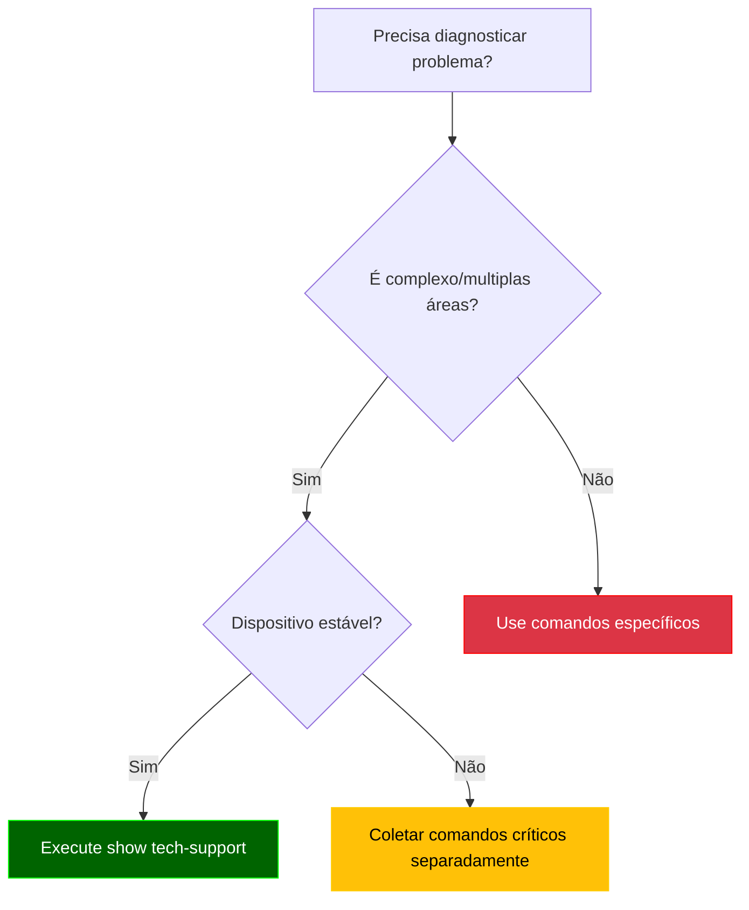
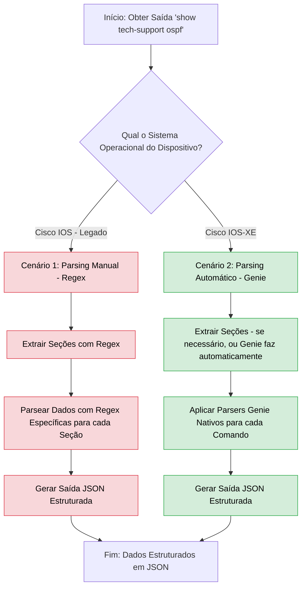
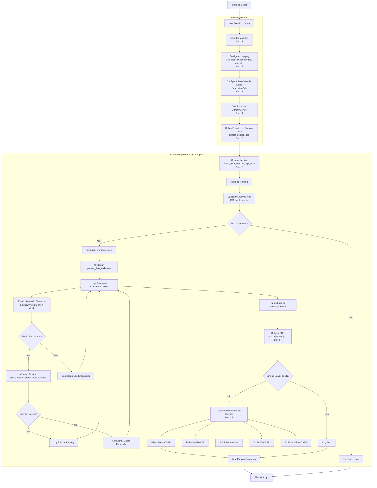
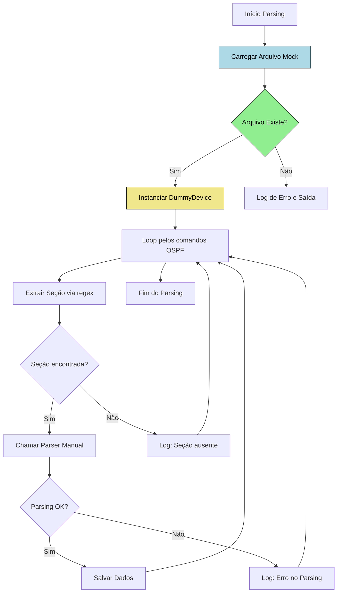
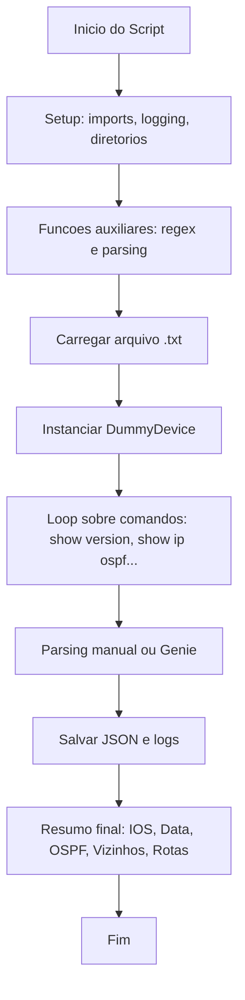

# Python - 15

## Parsing Automático - Genie

## Sumário
- [Python - 15](#python---15)
  - [Parsing Automático - Genie](#parsing-automático---genie)
  - [Sumário](#sumário)
      - [Comando show tech-support](#comando-show-tech-support)
    - [Parsing de show tech-support (comparativo)](#parsing-de-show-tech-support-comparativo)
      - [🔹 Cenário 1 — Cisco IOS (legado)](#-cenário-1--cisco-ios-legado)
      - [🔹 Cenário 2 — Cisco IOS-XE](#-cenário-2--cisco-ios-xe)
    - [Objetivo didático](#objetivo-didático)
    - [Aplicando na Prática](#aplicando-na-prática)
    - [Fluxo de decisão - Quando utilizar: Parsing Manual (Regex) X Parsing Automático (Genie)](#fluxo-de-decisão---quando-utilizar-parsing-manual-regex-x-parsing-automático-genie)
    - [Exemplo 12: Parsing de show tech-support](#exemplo-12-parsing-de-show-tech-support)
    - [🔹 Cenário 1 — Cisco IOS (legado)](#-cenário-1--cisco-ios-legado-1)
    - [Fluxograma](#fluxograma)

#### Comando show tech-support

**O Que É?**

O show tech-support é um comando **omnibus** (tudo-em-um, agregador de comandos) dos dispositivos Cisco que coleta automaticamente:

  - Saídas de 50+ comandos críticos (show version, show running-config, show interfaces, etc.)

  - Status operacional de todos os principais protocolos

  - Logs e mensagens de erro recentes

  - Estatísticas de hardware e desempenho

```bash
Router# show tech-support
! Saída consolidada de dezenas de comandos show
```

**Quando Usar? (Casos Ideais)**

| Cenário                  | Benefício                                            | Exemplo Prático                                 |
|--------------------------|------------------------------------------------------|-------------------------------------------------|
| Troubleshooting complexo | Elimina necessidade de executar comandos manualmente | Investigar flapping de interfaces + BGP resets  |
| Pós-falha                | Captura estado do sistema antes de reinicialização   | Crash do dispositivo                            |
| Auditoria periódica      | Baseline de configuração e performance               | Comparação trimestral                           |
| Suporte TAC Cisco        | Requisito obrigatório para abertura de casos         | Ticket para falha de hardware                   |

**Quando Evitar?**

| Situação                          | Problema                           | Alternativa Recomendada                               |
|-----------------------------------|------------------------------------|-------------------------------------------------------| 
| Dispositivos sob carga (>70% CPU) | Pode causar instabilidade          | Coletar comandos individuais prioritários             |
| Links lentos (WAN < 1Mbps)        | Gera tráfego excessivo             | Usar `show tech-support	redirect` para arquivo local |
| Monitoramento rotineiro           | Overkill para verificações simples | Comandos específicos (show interface summary)         |
| Ambientes não-Cisco               | Incompatibilidade	                 | Comandos vendor-specific equivalentes                 |

**Fluxo de Decisão**



**Dados Coletados (Estrutura Típica)**

```bash
1. System Info          # show version, show inventory
2. CPU/Memory           # show processes cpu, show memory
3. Interfaces           # show interfaces, show ip interface brief
4. Routing              # show ip route, show ip protocols
5. ACLs/NAT             # show access-lists, show ip nat translations
6. Logs                 # show logging
... (50+ seções)
```

**Boas Práticas**

- Filtragem:

```bash
show tech-support | include error|fail|down  # Filtra apenas problemas
```

- Redirecionamento:

```bash
show tech-support > flash:/tech_support_$(date +%F).txt
```

Deixo aqui um exemplo de uma saída completa do comando: `show tech-support ospf`  
**OBS:** a versão do IOS em que foi retirada a saída é: `Cisco IOS Software, 7200 Software (C7200-ADVENTERPRISEK9-M), Version 15.2(4)S7, RELEASE SOFTWARE (fc4)`

[R01_ospf_diag.txt](Arquivos/12/R01_ospf_diag.txt)

**OBS2:** a versão do IOS em que foi retirada a saída é: `Cisco IOS Software [IOSXE], Linux Software (X86_64BI_LINUX-ADVENTERPRISEK9-M), Version 17.15.1, RELEASE SOFTWARE (fc4)`  

[ospf_diag.txt](Arquivos/12_b/ospf_diag.txt)


### Parsing de show tech-support (comparativo)

Neste exemplo avançado, vamos explorar como processar a saída extensa do comando `show tech-support ospf` de forma estruturada. Esse comando combina dezenas de seções (show version, show ip ospf, show ip route, etc.) e é amplamente utilizado para diagnósticos, auditorias e troubleshooting.

Aqui será feito um comparativo entre duas abordagens:

#### 🔹 Cenário 1 — Cisco IOS (legado)
Neste caso, não há suporte direto do Genie para muitos comandos. Portanto, o parsing é feito com **regex manual**, identificando trechos-chave da saída (`show version`, `show clock`, `show ip ospf`, etc.) para extração de dados relevantes.

✅ *Funciona, mas exige mais esforço, manutenção e conhecimento de expressões regulares.*

#### 🔹 Cenário 2 — Cisco IOS-XE
Aqui utilizamos **parsers automáticos do Genie** que suportam os comandos nativamente. Após separar a saída do `show tech-support` por blocos, os dados são extraídos automaticamente com os modelos do Genie.

✅ *Mais rápido, menos propenso a erro, ideal para automação em larga escala.*

---

### Objetivo didático

O foco não é ensinar regex, mas demonstrar que:
- O uso de parsers automáticos como o Genie é **mais prático, confiável e sustentável**
- Quando não há parser disponível (como em versões IOS mais antigas), é possível recorrer ao regex como fallback

---

### Aplicando na Prática

A seguir, apresentamos um exemplo real em que foi necessário processar a saída extensa do comando `show tech-support ospf`. O objetivo principal é demonstrar **as diferenças práticas** entre utilizar expressões regulares manuais e parsers automáticos do Genie.

O foco aqui não é aprofundar o uso de regex, mas sim ilustrar como ela pode ser usada como alternativa em ambientes **sem suporte oficial** do Genie (como IOS legado). Em contrapartida, no cenário com suporte Genie (IOS-XE), mostramos como os parsers automáticos oferecem **maior produtividade, confiabilidade e reutilização.**

### Fluxo de decisão - Quando utilizar: Parsing Manual (Regex) X Parsing Automático (Genie)  



**Observação Importante:**

> Ao trabalhar com parsers automáticos do Genie, é fundamental sempre consultar a documentação oficial e o repositório do projeto para verificar a disponibilidade e compatibilidade dos > parsers para os comandos e sistemas operacionais específicos. Nem todo comando possui um parser nativo para todas as versões de IOS ou IOS-XE. Em casos onde um parser automático não  > está disponível ou não se adequa à saída do seu dispositivo, o parsing manual com regex se torna uma alternativa necessária e válida.
> Você pode encontrar os parsers disponíveis e contribuir para o projeto no repositório oficial do Genie Parser: https://github.com/CiscoTestAutomation/genieparser  

### Exemplo 12: Parsing de show tech-support  

### 🔹 Cenário 1 — Cisco IOS (legado)  

**Objetivo**  

Interpretar a saída do comando show tech-support em dispositivos Cisco IOS (legado) utilizando Python e Genie, com foco na extração e estruturação de informações chave sobre o estado operacional do OSPF, incluindo ID do roteador, vizinhanças e rotas. O script extrai seções específicas do show tech-support (como show version, show clock, show ip ospf, show ip ospf neighbor e show ip route ospf), exibe um resumo no terminal e salva os dados parseados em formato JSON para análise e auditoria.

**Nota:** Este exemplo foi adaptado a partir de um modelo genérico anterior, focando especificamente no protocolo OSPF para demonstrar parsing manual versus automático com Genie.

**📁 Estrutura do Projeto**

```bash
12_show_tech_support_ios/
├── Arquivos/
│   └── R01_ospf_diag.txt                            # Saída simulada do comando 'show tech-support'
├── logs/
│   └── parse_tech_support_ospf_YYYMMDD_HHMMSS.log   # Arquivo de logs (com timestamp, será criado automaticamente)
├── output/
│   └── parsed_tech_support_ospf_YYYMMDD_HHMMSS.json # Arquivo .json com a saída parseada (com timestamp)
└── parse_tech_support_ospf.py                       # Script principal
```

**R01_ospf_diag.txt**

```bash
------------------ show clock ------------------


*18:00:49.603 UTC Thu Jul 17 2025

------------------ show version ------------------


Cisco IOS Software, 7200 Software (C7200-ADVENTERPRISEK9-M), Version 15.2(4)S7, RELEASE SOFTWARE (fc4)
Technical Support: http://www.cisco.com/techsupport
Copyright (c) 1986-2015 by Cisco Systems, Inc.
Compiled Wed 01-Apr-15 20:30 by prod_rel_team

ROM: ROMMON Emulation Microcode
BOOTLDR: 7200 Software (C7200-ADVENTERPRISEK9-M), Version 15.2(4)S7, RELEASE SOFTWARE (fc4)

R01 uptime is 10 minutes
System returned to ROM by unknown reload cause - suspect boot_data[BOOT_COUNT] 0x0, BOOT_COUNT 0, BOOTDATA 19
System image file is "tftp://255.255.255.255/unknown"
Last reload reason: unknown reload cause - suspect boot_data[BOOT_COUNT] 0x0, BOOT_COUNT 0, BOOTDATA 19


This product contains cryptographic features and is subject to United
States and local country laws governing import, export, transfer and
use. Delivery of Cisco cryptographic products does not imply
third-party authority to import, export, distribute or use encryption.
Importers, exporters, distributors and users are responsible for
compliance with U.S. and local country laws. By using this product you
agree to comply with applicable laws and regulations. If you are unable
to comply with U.S. and local laws, return this product immediately.

A summary of U.S. laws governing Cisco cryptographic products may be found at:
http://www.cisco.com/wwl/export/crypto/tool/stqrg.html
```

**parse_tech_support_ospf.py**

```python
[001] # Bloco 1: Importações
[002] import os
[003] import re
[004] import json
[005] import logging
[006] from datetime import datetime
[007]
[008] # Bloco 2: Configuração de Logging
[009] log_dir = 'logs'
[010] os.makedirs(log_dir, exist_ok=True)
[011]
[012] log_file_name = datetime.now().strftime("parse_tech_support_ospf_%Y%m%d_%H%M%S.log")
[013] log_file_path = os.path.join(log_dir, log_file_name)
[014]
[015] logging.basicConfig(
[016]     level=logging.DEBUG, # Mantido em DEBUG para depuração geral, se necessário
[017]     format='%(asctime)s - %(levelname)s - %(message)s',
[018]     handlers=[
[019]         logging.FileHandler(log_file_path),
[020]         logging.StreamHandler()
[021]     ]
[022] )
[023] log = logging.getLogger(__name__)
[024] 
[025] # Bloco 3: Configuração de Pastas de Saída
[026] output_dir = 'output'
[027] os.makedirs(output_dir, exist_ok=True)
[028] 
[029] # Bloco 4: Classe Dummy Device (para simulação local)
[030] class DummyDevice:
[031]     """
[032]     Classe que simula um dispositivo Cisco para fins de parsing offline com Genie.
[034]     Fornece os atributos mínimos necessários (como 'os') para o Genie selecionar
[035]     o parser correto.
[036]     """
[037]     def __init__(self, os='ios'): # OS definido como 'ios' para corresponder ao mock file
[038]         self.os = os
[039]         self.custom = {'abstraction': {'order': ['os']}}
[040]         log.info(f"DummyDevice criado para OS: {self.os}")
[041] 
[042] # Bloco 5: Funções Auxiliares para Extrair Seções e Parsing Manual
[043] def extract_section(full_output_text, command_name):
[044]     """
[046]     Extrai a saída de um comando específico de um show tech-support completo.
[047]     Procura por '------------------ COMMAND_NAME ------------------'
[048]     e captura o conteúdo até o próximo '------------------' ou fim do arquivo.
[049]     
[050]     CORREÇÃO: Ajustado para ser mais flexível com espaços após o nome do comando.
[051]     """
[052]     escaped_command_name = re.escape(command_name)
[053]     # Usa '\s*' para zero ou mais espaços, e '\s*\n' para a quebra de linha
[054]     pattern = rf'------------------ {escaped_command_name}\s*------------------\s*\n(.*?)(?=\n------------------|\Z)'
[055]     
[056]     log.info(f"Tentando extrair seção para o comando: '{command_name}'")
[057]     match = re.search(pattern, full_output_text, re.DOTALL)
[058]     
[059]     if match:
[060]         extracted_content = match.group(1).strip()
[061]         log.info(f"Seção '{command_name}' extraída com sucesso (tamanho: {len(extracted_content)} caracteres).")
[062]         return extracted_content
[063]     else:
[064]         log.warning(f"Seção '{command_name}' NÃO encontrada no show tech-support.")
[065]         return ""
[067] 
[068] # Função para parsing manual de 'show version'
[069] def parse_show_version_manualmente(output):
[070]     """
[071]     Parseia a saída do comando 'show version' manualmente para extrair a linha completa da versão do IOS.
[072]     Exemplo de saída: Cisco IOS Software, 7200 Software (C7200-ADVENTERPRISEK9-M), Version 15.2(4)S7, RELEASE SOFTWARE (fc4)
[073]     """
[074]     log.info("Realizando parsing manual para 'show version'.")
[075]     # Captura a linha que começa com "Cisco IOS Software"
[076]     match = re.search(r'Cisco IOS Software,.*', output, re.IGNORECASE)
[077]     if match:
[078]         return {"full_version_string": match.group(0).strip()}
[079]     return {"error": "Linha da versão do IOS não encontrada ou formato inesperado."}
[080] 
[081] # Função para parsing manual de 'show clock'
[082] def parse_show_clock_manualmente(output):
[083]     """
[084]     Parseia a saída do comando 'show clock' manualmente para extrair o timestamp.
[085]     Exemplo de saída: *18:00:49.603 UTC Thu Jul 17 2025
[086]     """
[087]     log.info("Realizando parsing manual para 'show clock'.")
[088]     match = re.search(r'\*(\d{2}:\d{2}:\d{2}\.\d{3} UTC \w{3} \w{3} \d{1,2} \d{4})', output)
[089]     if match:
[090]         return {"utc_time": match.group(1)}
[091]     return {"error": "Timestamp não encontrado ou formato inesperado."}
[092] 
[093] # Função para parsing manual de 'show ip route ospf'
[094] def parse_show_ip_route_ospf_manualmente(output):
[095]     """
[096]     Parseia a saída do comando 'show ip route ospf' manualmente.
[097]     Retorna uma lista de strings, uma para cada rota OSPF.
[098]     """
[099]     log.info("Realizando parsing manual para 'show ip route ospf'.")
[100]     routes = []
[101]     # Expressão regular para capturar linhas de rota OSPF
[102]     # Ex: O        192.168.0.2 [110/2] via 172.16.0.2, 00:00:35, FastEthernet0/0
[103]     # Captura linhas que começam com 'O' seguido de espaços e o resto da linha
[104]     for line in output.splitlines():
[105]         if re.match(r'^O\s+', line.strip()):
[106]             routes.append(line.strip())
[107]     return {"routes": routes}
[108] 
[109] # Função para parsing manual de 'show ip ospf' (estado geral)
[110] def parse_show_ip_ospf_manualmente(output):
[111]     """
[112]     Parseia a saída do comando 'show ip ospf' manualmente para extrair informações gerais.
[113]     Esta é uma versão simplificada para este exemplo.
[114]     """
[115]     log.info("Realizando parsing manual para 'show ip ospf'.")
[116]     # log.debug(f"Conteúdo recebido para 'show ip ospf':\n---\n{output}\n---") # Log de depuração
[117]     parsed_data = {}
[118]     
[119]     # Regex ajustada para corresponder ao formato real da linha no mock file
[120]     # O mock file tem "Routing Process "ospf 100" with ID 1.1.1.1"
[121]     match_router_id = re.search(r'Routing Process "ospf \d+" with ID\s*(\d{1,3}\.\d{1,3}\.\d{1,3}\.\d{1,3})', output)
[122]     if match_router_id:
[123]         parsed_data['router_id'] = match_router_id.group(1)
[124]         # log.debug(f"Router ID encontrado: {parsed_data['router_id']}")
[125]     # else:
[126]         # log.debug("Router ID não encontrado com a regex atual.")
[127]     
[128]     # Exemplo: Extrair número de áreas
[129]     match_areas = re.search(r'Number of areas in this router is (\d+)\.', output)
[130]     if match_areas:
[131]         parsed_data['number_of_areas'] = int(match_areas.group(1))
[132] 
[133]     # Sempre retorna parsed_data, mesmo que esteja vazio ou parcial.
[134]     return parsed_data
[135] 
[136] # Função para parsing manual de 'show ip ospf neighbor'
[137] def parse_show_ip_ospf_neighbor_manualmente(output):
[138]     """
[139]     Parseia a saída do comando 'show ip ospf neighbor' manualmente.
[140]     Retorna uma lista de dicionários para cada vizinho.
[141]     """
[142]     log.info("Realizando parsing manual para 'show ip ospf neighbor'.")
[143]     log.info(f"Conteúdo recebido para 'show ip ospf neighbor':\n---\n{output}\n---") # ALTERADO PARA INFO
[144]     neighbors = []
[145]     # CORREÇÃO: Ajuste na regex para ser mais flexível com o campo 'State'
[146]     # O seu mock tem: 2.2.2.2           0   FULL/  -        00:00:33    172.16.0.2      FastEthernet0/0
[147]     # Ajustado para:
[148]     pattern = re.compile(
[149]         r'^(?P<neighbor_id>\d{1,3}\.\d{1,3}\.\d{1,3}\.\d{1,3})\s+'  # Neighbor ID
[150]         r'(?P<priority>\d+)\s+'                                  # Priority
[151]         r'(?P<state>[\w\/]+\s*[\w\-]*)?\s+'                      # State (e.g., FULL/  -, FULL/BDR) - mais flexível
[152]         r'(?P<dead_time>\d{2}:\d{2}:\d{2})\s+'                   # Dead Time
[153]         r'(?P<address>\d{1,3}\.\d{1,3}\.\d{1,3}\.\d{1,3})\s+'     # Address
[154]         r'(?P<interface>\S+)$'                                   # Interface
[155]     )
[156]     
[157]     # Ignora a linha de cabeçalho e processa as linhas de dados
[158]     for line in output.splitlines():
[159]         if "Neighbor ID" in line or "---" in line or not line.strip(): # Ignora linhas de cabeçalho e linhas vazias
[160]             continue
[161]         match = pattern.match(line.strip())
[162]         if match:
[163]             neighbors.append(match.groupdict())
[164]             log.info(f"Vizinho encontrado: {match.groupdict()}") # ALTERADO PARA INFO
[165]         else:
[166]             log.debug(f"Linha de vizinho não corresponde ao padrão: '{line.strip()}'")
[167] 
[168]     return {"neighbors": neighbors} if neighbors else {"message": "Nenhum vizinho OSPF detectado ou formato inesperado."}
[169]
[170] # Bloco 6: Função Principal de Parsing ('parse_tech_support_ospf_data')
[171] def parse_tech_support_ospf_data():
[172]     """
[173]     Função principal que orquestra o carregamento do mock file,
[174]     a extração de seções e o parsing com Genie (onde possível) e parsing manual.
[175]     """
[176]     log.info("Iniciando o parsing do show tech-support OSPF.")
[177] 
[178]     # 1. Carregar o mock file
[179]     mock_file_path = os.path.join('Arquivos', 'R01_ospf_diag.txt')
[180]     try:
[181]         with open(mock_file_path, 'r') as f:
[182]             full_tech_support_output = f.read()
[183]         log.info(f"Mock file '{mock_file_path}' carregado com sucesso.")
[184]     except FileNotFoundError:
[185]         log.error(f"Erro: O arquivo mock '{mock_file_path}' não foi encontrado. Verifique o caminho.")
[186]         return
[187]     except Exception as e:
[188]         log.error(f"Erro inesperado ao ler o mock file: {e}")
[189]         return
[190]
[192]     # Instanciar o Dummy Device (ainda necessário para ShowPlatform, se fosse usado)
[193]     device = DummyDevice(os='ios')
[194] 
[195]     # Dicionário para armazenar todos os dados parseados
[196]     parsed_data_collection = {}
[197] 
[198]     # --- Bloco 6.1: Versão do Sistema Operacional ---
[199]     log.info("Processando: Versão do Sistema Operacional (show version)...")
[200]     show_version_output = extract_section(full_tech_support_output, "show version")
[201]     if show_version_output:
[202]         try:
[203]             # Usando parsing manual para 'show version'
[204]             parsed_data_collection['version'] = parse_show_version_manualmente(show_version_output)
[205]             log.info("Versão do SO parseada manualmente com sucesso.")
[206]         except Exception as e:
[207]             log.error(f"Falha ao parsear 'show version' manualmente: {e}")
[208]     else:
[209]         log.warning("Seção 'show version' não encontrada ou vazia para parsing.")
[210] 
[211]     # --- Bloco 6.2: Data e Hora ---
[212]     log.info("Processando: Data e Hora (show clock)...")
[213]     show_clock_output = extract_section(full_tech_support_output, "show clock")
[214]     if show_clock_output:
[215]         try:
[216]             # Usando parsing manual para 'show clock'
[217]             parsed_data_collection['clock'] = parse_show_clock_manualmente(show_clock_output)
[218]             log.info("Data e Hora parseadas manualmente com sucesso.")
[219]         except Exception as e:
[220]             log.error(f"Falha ao parsear 'show clock' manualmente: {e}")
[221]     else:
[222]         log.warning("Seção 'show clock' não encontrada ou vazia para parsing.")
[223] 
[224]     # --- Bloco 6.3: Tabela de Roteamento OSPF ---
[225]     log.info("Processando: Tabela de Roteamento OSPF (show ip route ospf)...")
[226]     show_ip_route_ospf_output = extract_section(full_tech_support_output, "show ip route ospf")
[227]     if show_ip_route_ospf_output:
[228]         try:
[229]             # Usando parsing manual para 'show ip route ospf'
[230]             parsed_data_collection['ip_route_ospf'] = parse_show_ip_route_ospf_manualmente(show_ip_route_ospf_output)
[231]             log.info("Tabela de roteamento OSPF parseada manualmente com sucesso.")
[232]         except Exception as e:
[233]             log.error(f"Falha ao parsear 'show ip route ospf' manualmente: {e}")
[234]     else:
[235]         log.warning("Seção 'show ip route ospf' não encontrada ou vazia para parsing.")
[236] 
[238]     # --- Bloco 6.4: Estado Geral do Protocolo OSPF (show ip ospf) ---
[239]     log.info("Processando: Estado Geral do Protocolo OSPF (show ip ospf)...")
[240]     # Passando apenas "show ip ospf" para extract_section, que agora é mais flexível
[241]     show_ip_ospf_output = extract_section(full_tech_support_output, "show ip ospf")
[242]     if show_ip_ospf_output:
[243]         try:
[244]             # Usando parsing manual para 'show ip ospf'
[245]             parsed_data_collection['ospf_general_state'] = parse_show_ip_ospf_manualmente(show_ip_ospf_output)
[246]             log.info("Estado geral do OSPF parseado manualmente com sucesso.")
[247]         except Exception as e:
[248]             log.error(f"Falha ao parsear 'show ip ospf' manualmente: {e}")
[249]     else:
[250]         log.warning("Seção 'show ip ospf' não encontrada ou vazia para parsing.")
[251]             
[252]     # --- Bloco 6.5: Vizinhos OSPF (show ip ospf neighbor) ---
[253]     log.info("Processando: Vizinhos OSPF (show ip ospf neighbor)...")
[254]     show_ip_ospf_neighbor_output = extract_section(full_tech_support_output, "show ip ospf neighbor")
[255]     if show_ip_ospf_neighbor_output:
[256]         try:
[257]             # Usando parsing manual para 'show ip ospf neighbor'
[258]             parsed_data_collection['ospf_neighbors'] = parse_show_ip_ospf_neighbor_manualmente(show_ip_ospf_neighbor_output)
[259]             log.info("Vizinhos OSPF parseados manualmente com sucesso.")
[260]         except Exception as e:
[261]             log.error(f"Falha ao parsear 'show ip ospf neighbor' manualmente: {e}")
[262]     else:
[263]         log.warning("Seção 'show ip ospf neighbor' não encontrada ou vazia para parsing.")
[264] 
[265]     # --- Bloco 7: Salvar a saída estruturada em JSON ---
[266]     output_file_name = datetime.now().strftime("parsed_tech_support_ospf_%Y%m%d_%H%M%S.json")
[267]     output_file_path = os.path.join(output_dir, output_file_name)
[268]     
[269]     try:
[270]         with open(output_file_path, 'w') as json_file:
[271]             json.dump(parsed_data_collection, json_file, indent=4)
[272]         log.info(f"Dados parseados salvos com sucesso em '{output_file_path}'.")
[273]     except Exception as e:
[274]         log.error(f"Erro ao salvar o arquivo JSON: {e}")
[275] 
[276]     # --- Bloco 8: Gerar Resumo Final para o Console ---
[277]     log.info("") # Linha em branco para separação visual
[278]     log.info("==== RESUMO FINAL ====")
[279] 
[280]     # Versão do Cisco IOS
[281]     version_info = parsed_data_collection.get('version', {})
[282]    # Agora a função parse_show_version_manualmente retorna 'full_version_string'
[283]     ios_version = version_info.get('full_version_string', 'Desconhecida')
[284]     log.info(f"Versão do Cisco IOS: {ios_version}")
[285] 
[286]     # Data e Hora
[287]     clock_info = parsed_data_collection.get('clock', {})
[288]     utc_time = clock_info.get('utc_time', 'Desconhecida')
[289]     log.info(f"Data e Hora: {utc_time}")
[290] 
[291]     # ID do Roteador OSPF
[293]     ospf_general_info = parsed_data_collection.get('ospf_general_state', {})
[294]     router_id = ospf_general_info.get('router_id', 'Desconhecida')
[295]    log.info(f"ID do Roteador OSPF: {router_id}")
[296] 
[297]     # Vizinhos OSPF
[298]     ospf_neighbors_info = parsed_data_collection.get('ospf_neighbors', {})
[299]     neighbors_list = ospf_neighbors_info.get('neighbors', [])
[300]     log.info(f"Vizinhos OSPF: {len(neighbors_list)} vizinho(s) detectado(s)")
[301]     for neighbor in neighbors_list:
[302]         log.info(f" - ID: {neighbor.get('neighbor_id', 'N/A')}, Estado: {neighbor.get('state', 'N/A')}, Endereço: {neighbor.get('address', 'N/A')}, Interface: {neighbor.get('interface', 'N/A')}") # ADICIONADO: Interface no resumo
[303] 
[304]     # Tabela de Roteamento OSPF
[305]     ip_route_ospf_info = parsed_data_collection.get('ip_route_ospf', {})
[307]     ospf_routes = ip_route_ospf_info.get('routes', [])
[308]     log.info("Tabela de Roteamento OSPF:")
[309]     if ospf_routes:
[310]         for route in ospf_routes:
[311]             log.info(f" - {route}")
[312]     else:
[313]         log.info(" - Nenhuma rota OSPF encontrada.")
[314] 
[315]     log.info("Parsing concluído com sucesso.")
[316] 
[317]  # Bloco 9: Executar a função principal
[318] if __name__ == "__main__":
[319]     parse_tech_support_ospf_data()

```

**saída**

1. Criar o ambiente virtual
2. Setar o python para a versão do **python3.10.18**
3. Habilitar o ambiente
4. Instalar o **pyats[full]

```bash
(genie310) alcancil@linux:~/automacoes/genie/12$ python3 parse_tech_support_ospf.py 
2025-07-22 11:46:13,586 - INFO - Iniciando o parsing do show tech-support OSPF.
2025-07-22 11:46:13,586 - INFO - Mock file 'Arquivos/R01_ospf_diag.txt' carregado com sucesso.
2025-07-22 11:46:13,587 - INFO - DummyDevice criado para OS: ios
2025-07-22 11:46:13,587 - INFO - Processando: Versão do Sistema Operacional (show version)...
2025-07-22 11:46:13,587 - INFO - Tentando extrair seção para o comando: 'show version'
2025-07-22 11:46:13,587 - INFO - Seção 'show version' extraída com sucesso (tamanho: 2587 caracteres).
2025-07-22 11:46:13,587 - INFO - Realizando parsing manual para 'show version'.
2025-07-22 11:46:13,587 - INFO - Versão do SO parseada manualmente com sucesso.
2025-07-22 11:46:13,587 - INFO - Processando: Data e Hora (show clock)...
2025-07-22 11:46:13,587 - INFO - Tentando extrair seção para o comando: 'show clock'
2025-07-22 11:46:13,588 - INFO - Seção 'show clock' extraída com sucesso (tamanho: 33 caracteres).
2025-07-22 11:46:13,588 - INFO - Realizando parsing manual para 'show clock'.
2025-07-22 11:46:13,588 - INFO - Data e Hora parseadas manualmente com sucesso.
2025-07-22 11:46:13,588 - INFO - Processando: Tabela de Roteamento OSPF (show ip route ospf)...
2025-07-22 11:46:13,588 - INFO - Tentando extrair seção para o comando: 'show ip route ospf'
2025-07-22 11:46:13,588 - INFO - Seção 'show ip route ospf' extraída com sucesso (tamanho: 705 caracteres).
2025-07-22 11:46:13,588 - INFO - Realizando parsing manual para 'show ip route ospf'.
2025-07-22 11:46:13,588 - INFO - Tabela de roteamento OSPF parseada manualmente com sucesso.
2025-07-22 11:46:13,588 - INFO - Processando: Estado Geral do Protocolo OSPF (show ip ospf)...
2025-07-22 11:46:13,588 - INFO - Tentando extrair seção para o comando: 'show ip ospf'
2025-07-22 11:46:13,589 - INFO - Seção 'show ip ospf' extraída com sucesso (tamanho: 1649 caracteres).
2025-07-22 11:46:13,589 - INFO - Realizando parsing manual para 'show ip ospf'.
2025-07-22 11:46:13,589 - INFO - Estado geral do OSPF parseado manualmente com sucesso.
2025-07-22 11:46:13,589 - INFO - Processando: Vizinhos OSPF (show ip ospf neighbor)...
2025-07-22 11:46:13,589 - INFO - Tentando extrair seção para o comando: 'show ip ospf neighbor'
2025-07-22 11:46:13,590 - INFO - Seção 'show ip ospf neighbor' extraída com sucesso (tamanho: 157 caracteres).
2025-07-22 11:46:13,590 - INFO - Realizando parsing manual para 'show ip ospf neighbor'.
2025-07-22 11:46:13,590 - INFO - Conteúdo recebido para 'show ip ospf neighbor':
---
Neighbor ID     Pri   State           Dead Time   Address         Interface
2.2.2.2           0   FULL/  -        00:00:33    172.16.0.2      FastEthernet0/0
---
2025-07-22 11:46:13,590 - INFO - Vizinho encontrado: {'neighbor_id': '2.2.2.2', 'priority': '0', 'state': 'FULL/  -', 'dead_time': '00:00:33', 'address': '172.16.0.2', 'interface': 'FastEthernet0/0'}
2025-07-22 11:46:13,590 - INFO - Vizinhos OSPF parseados manualmente com sucesso.
2025-07-22 11:46:13,591 - INFO - Dados parseados salvos com sucesso em 'output/parsed_tech_support_ospf_20250722_114613.json'.
2025-07-22 11:46:13,591 - INFO - 
2025-07-22 11:46:13,591 - INFO - ==== RESUMO FINAL ====
2025-07-22 11:46:13,591 - INFO - Versão do Cisco IOS: Cisco IOS Software, 7200 Software (C7200-ADVENTERPRISEK9-M), Version 15.2(4)S7, RELEASE SOFTWARE (fc4)
2025-07-22 11:46:13,591 - INFO - Data e Hora: 18:00:49.603 UTC Thu Jul 17 2025
2025-07-22 11:46:13,591 - INFO - ID do Roteador OSPF: 1.1.1.1
2025-07-22 11:46:13,591 - INFO - Vizinhos OSPF: 1 vizinho(s) detectado(s)
2025-07-22 11:46:13,591 - INFO -  - ID: 2.2.2.2, Estado: FULL/  -, Endereço: 172.16.0.2, Interface: FastEthernet0/0
2025-07-22 11:46:13,591 - INFO - Tabela de Roteamento OSPF:
2025-07-22 11:46:13,592 - INFO -  - O        192.168.0.2 [110/2] via 172.16.0.2, 00:00:35, FastEthernet0/0
2025-07-22 11:46:13,592 - INFO - Parsing concluído com sucesso.
(genie310) alcancil@linux:~/automacoes/genie/12$ 
```

**OBS:** o script apresenta o log em tela para facilitar o entendimento no final do processo. Ele também gera duas pastas: **logs** e **output**.

**logs**

```bash
(genie310) alcancil@linux:~/automacoes/genie/12$ cat logs/parse_tech_support_ospf_202507
parse_tech_support_ospf_20250718_185431.log  parse_tech_support_ospf_20250722_101515.log  parse_tech_support_ospf_20250722_114613.log
(genie310) alcancil@linux:~/automacoes/genie/12$ cat logs/parse_tech_support_ospf_20250722_114613.log 
2025-07-22 11:46:13,586 - INFO - Iniciando o parsing do show tech-support OSPF.
2025-07-22 11:46:13,586 - INFO - Mock file 'Arquivos/R01_ospf_diag.txt' carregado com sucesso.
2025-07-22 11:46:13,587 - INFO - DummyDevice criado para OS: ios
2025-07-22 11:46:13,587 - INFO - Processando: Versão do Sistema Operacional (show version)...
2025-07-22 11:46:13,587 - INFO - Tentando extrair seção para o comando: 'show version'
2025-07-22 11:46:13,587 - INFO - Seção 'show version' extraída com sucesso (tamanho: 2587 caracteres).
2025-07-22 11:46:13,587 - INFO - Realizando parsing manual para 'show version'.
2025-07-22 11:46:13,587 - INFO - Versão do SO parseada manualmente com sucesso.
2025-07-22 11:46:13,587 - INFO - Processando: Data e Hora (show clock)...
2025-07-22 11:46:13,587 - INFO - Tentando extrair seção para o comando: 'show clock'
2025-07-22 11:46:13,588 - INFO - Seção 'show clock' extraída com sucesso (tamanho: 33 caracteres).
2025-07-22 11:46:13,588 - INFO - Realizando parsing manual para 'show clock'.
2025-07-22 11:46:13,588 - INFO - Data e Hora parseadas manualmente com sucesso.
2025-07-22 11:46:13,588 - INFO - Processando: Tabela de Roteamento OSPF (show ip route ospf)...
2025-07-22 11:46:13,588 - INFO - Tentando extrair seção para o comando: 'show ip route ospf'
2025-07-22 11:46:13,588 - INFO - Seção 'show ip route ospf' extraída com sucesso (tamanho: 705 caracteres).
2025-07-22 11:46:13,588 - INFO - Realizando parsing manual para 'show ip route ospf'.
2025-07-22 11:46:13,588 - INFO - Tabela de roteamento OSPF parseada manualmente com sucesso.
2025-07-22 11:46:13,588 - INFO - Processando: Estado Geral do Protocolo OSPF (show ip ospf)...
2025-07-22 11:46:13,588 - INFO - Tentando extrair seção para o comando: 'show ip ospf'
2025-07-22 11:46:13,589 - INFO - Seção 'show ip ospf' extraída com sucesso (tamanho: 1649 caracteres).
2025-07-22 11:46:13,589 - INFO - Realizando parsing manual para 'show ip ospf'.
2025-07-22 11:46:13,589 - INFO - Estado geral do OSPF parseado manualmente com sucesso.
2025-07-22 11:46:13,589 - INFO - Processando: Vizinhos OSPF (show ip ospf neighbor)...
2025-07-22 11:46:13,589 - INFO - Tentando extrair seção para o comando: 'show ip ospf neighbor'
2025-07-22 11:46:13,590 - INFO - Seção 'show ip ospf neighbor' extraída com sucesso (tamanho: 157 caracteres).
2025-07-22 11:46:13,590 - INFO - Realizando parsing manual para 'show ip ospf neighbor'.
2025-07-22 11:46:13,590 - INFO - Conteúdo recebido para 'show ip ospf neighbor':
---
Neighbor ID     Pri   State           Dead Time   Address         Interface
2.2.2.2           0   FULL/  -        00:00:33    172.16.0.2      FastEthernet0/0
---
2025-07-22 11:46:13,590 - INFO - Vizinho encontrado: {'neighbor_id': '2.2.2.2', 'priority': '0', 'state': 'FULL/  -', 'dead_time': '00:00:33', 'address': '172.16.0.2', 'interface': 'FastEthernet0/0'}
2025-07-22 11:46:13,590 - INFO - Vizinhos OSPF parseados manualmente com sucesso.
2025-07-22 11:46:13,591 - INFO - Dados parseados salvos com sucesso em 'output/parsed_tech_support_ospf_20250722_114613.json'.
2025-07-22 11:46:13,591 - INFO - 
2025-07-22 11:46:13,591 - INFO - ==== RESUMO FINAL ====
2025-07-22 11:46:13,591 - INFO - Versão do Cisco IOS: Cisco IOS Software, 7200 Software (C7200-ADVENTERPRISEK9-M), Version 15.2(4)S7, RELEASE SOFTWARE (fc4)
2025-07-22 11:46:13,591 - INFO - Data e Hora: 18:00:49.603 UTC Thu Jul 17 2025
2025-07-22 11:46:13,591 - INFO - ID do Roteador OSPF: 1.1.1.1
2025-07-22 11:46:13,591 - INFO - Vizinhos OSPF: 1 vizinho(s) detectado(s)
2025-07-22 11:46:13,591 - INFO -  - ID: 2.2.2.2, Estado: FULL/  -, Endereço: 172.16.0.2, Interface: FastEthernet0/0
2025-07-22 11:46:13,591 - INFO - Tabela de Roteamento OSPF:
2025-07-22 11:46:13,592 - INFO -  - O        192.168.0.2 [110/2] via 172.16.0.2, 00:00:35, FastEthernet0/0
2025-07-22 11:46:13,592 - INFO - Parsing concluído com sucesso.
(genie310) alcancil@linux:~/automacoes/genie/12$ 
```

**output**

```bash
(genie310) alcancil@linux:~/automacoes/genie/12$ cat output/parsed_tech_support_ospf_202507
parsed_tech_support_ospf_20250718_185431.json  parsed_tech_support_ospf_20250722_101515.json  parsed_tech_support_ospf_20250722_114613.json
(genie310) alcancil@linux:~/automacoes/genie/12$ cat output/parsed_tech_support_ospf_20250722_1
parsed_tech_support_ospf_20250722_101515.json  parsed_tech_support_ospf_20250722_114613.json  
(genie310) alcancil@linux:~/automacoes/genie/12$ cat output/parsed_tech_support_ospf_20250722_114613.json
```

```json
{
    "version": {
        "full_version_string": "Cisco IOS Software, 7200 Software (C7200-ADVENTERPRISEK9-M), Version 15.2(4)S7, RELEASE SOFTWARE (fc4)"
    },
    "clock": {
        "utc_time": "18:00:49.603 UTC Thu Jul 17 2025"
    },
    "ip_route_ospf": {
        "routes": [
            "O        192.168.0.2 [110/2] via 172.16.0.2, 00:00:35, FastEthernet0/0"
        ]
    },
    "ospf_general_state": {
        "router_id": "1.1.1.1",
        "number_of_areas": 1
    },
    "ospf_neighbors": {
        "neighbors": [
            {
                "neighbor_id": "2.2.2.2",
                "priority": "0",
                "state": "FULL/  -",
                "dead_time": "00:00:33",
                "address": "172.16.0.2",
                "interface": "FastEthernet0/0"
            }
        ]
    }
} 
```

### Fluxograma





