# Python - 15

## Parsing Automático - Genie

## Sumário
- [Python - 15](#python---15)
  - [Parsing Automático - Genie](#parsing-automático---genie)
  - [Sumário](#sumário)
      - [Comando show tech-support](#comando-show-tech-support)
    - [Parsing de show tech-support (comparativo)](#parsing-de-show-tech-support-comparativo)
      - [🔹 Cenário 1 — Cisco IOS (legado)](#-cenário-1--cisco-ios-legado)
      - [🔹 Cenário 2 — Cisco IOS-XE](#-cenário-2--cisco-ios-xe)
    - [Objetivo didático](#objetivo-didático)
    - [Fluxo de decisão - Quando utilizar: Parsing Manual (Regex) X Parsing Automático (Genie)](#fluxo-de-decisão---quando-utilizar-parsing-manual-regex-x-parsing-automático-genie)
    - [Exemplo 12: Parsing de show tech-support](#exemplo-12-parsing-de-show-tech-support)
    - [🔹 Cenário 1 — Cisco IOS (legado)](#-cenário-1--cisco-ios-legado-1)

#### Comando show tech-support

**O Que É?**

O show tech-support é um comando **omnibus** (tudo-em-um, agregador de comandos) dos dispositivos Cisco que coleta automaticamente:

  - Saídas de 50+ comandos críticos (show version, show running-config, show interfaces, etc.)

  - Status operacional de todos os principais protocolos

  - Logs e mensagens de erro recentes

  - Estatísticas de hardware e desempenho

```bash
Router# show tech-support
! Saída consolidada de dezenas de comandos show
```

**Quando Usar? (Casos Ideais)**

| Cenário                  | Benefício                                            | Exemplo Prático                                 |
|--------------------------|------------------------------------------------------|-------------------------------------------------|
| Troubleshooting complexo | Elimina necessidade de executar comandos manualmente | Investigar flapping de interfaces + BGP resets  |
| Pós-falha                | Captura estado do sistema antes de reinicialização   | Crash do dispositivo                            |
| Auditoria periódica      | Baseline de configuração e performance               | Comparação trimestral                           |
| Suporte TAC Cisco        | Requisito obrigatório para abertura de casos         | Ticket para falha de hardware                   |

**Quando Evitar?**

| Situação                          | Problema                           | Alternativa Recomendada                               |
|-----------------------------------|------------------------------------|-------------------------------------------------------| 
| Dispositivos sob carga (>70% CPU) | Pode causar instabilidade          | Coletar comandos individuais prioritários             |
| Links lentos (WAN < 1Mbps)        | Gera tráfego excessivo             | Usar `show tech-support	redirect` para arquivo local |
| Monitoramento rotineiro           | Overkill para verificações simples | Comandos específicos (show interface summary)         |
| Ambientes não-Cisco               | Incompatibilidade	                 | Comandos vendor-specific equivalentes                 |

**Fluxo de Decisão**


**Dados Coletados (Estrutura Típica)**

```bash
1. System Info          # show version, show inventory
2. CPU/Memory           # show processes cpu, show memory
3. Interfaces           # show interfaces, show ip interface brief
4. Routing              # show ip route, show ip protocols
5. ACLs/NAT             # show access-lists, show ip nat translations
6. Logs                 # show logging
... (50+ seções)
```

**Boas Práticas**

- Filtragem:

```bash
show tech-support | include error|fail|down  # Filtra apenas problemas
```

- Redirecionamento:

```bash
show tech-support > flash:/tech_support_$(date +%F).txt
```

Deixo aqui um exemplo de uma saída completa do comando: `show tech-support ospf`  
**OBS:** a versão do IOS em que foi retirada a saída é: `Cisco IOS Software, 7200 Software (C7200-ADVENTERPRISEK9-M), Version 15.2(4)S7, RELEASE SOFTWARE (fc4)`

[R01_ospf_diag.txt](Arquivos/12/R01_ospf_diag.txt)

**OBS2:** a versão do IOS em que foi retirada a saída é: `Cisco IOS Software [IOSXE], Linux Software (X86_64BI_LINUX-ADVENTERPRISEK9-M), Version 17.15.1, RELEASE SOFTWARE (fc4)`  

[ospf_diag.txt](Arquivos/12_b/ospf_diag.txt)


### Parsing de show tech-support (comparativo)

Neste exemplo avançado, vamos explorar como processar a saída extensa do comando `show tech-support ospf` de forma estruturada. Esse comando combina dezenas de seções (show version, show ip ospf, show ip route, etc.) e é amplamente utilizado para diagnósticos, auditorias e troubleshooting.

Aqui será feito um comparativo entre duas abordagens:

#### 🔹 Cenário 1 — Cisco IOS (legado)
Neste caso, não há suporte direto do Genie para muitos comandos. Portanto, o parsing é feito com **regex manual**, identificando trechos-chave da saída (`show version`, `show clock`, `show ip ospf`, etc.) para extração de dados relevantes.

✅ *Funciona, mas exige mais esforço, manutenção e conhecimento de expressões regulares.*

#### 🔹 Cenário 2 — Cisco IOS-XE
Aqui utilizamos **parsers automáticos do Genie** que suportam os comandos nativamente. Após separar a saída do `show tech-support` por blocos, os dados são extraídos automaticamente com os modelos do Genie.

✅ *Mais rápido, menos propenso a erro, ideal para automação em larga escala.*

---

### Objetivo didático

O foco não é ensinar regex, mas demonstrar que:
- O uso de parsers automáticos como o Genie é **mais prático, confiável e sustentável**
- Quando não há parser disponível (como em versões IOS mais antigas), é possível recorrer ao regex como fallback

### Fluxo de decisão - Quando utilizar: Parsing Manual (Regex) X Parsing Automático (Genie)

```mermaid
graph TD
    A[Início: Obter Saída 'show tech-support ospf'] --> B{Qual o Sistema Operacional do Dispositivo?}
    B -- Cisco IOS - Legado --> C[Cenário 1: Parsing Manual - Regex]
    C --> C1[Extrair Seções com Regex]
    C1 --> C2[Parsear Dados com Regex Específicas para cada Seção]
    C2 --> C3[Gerar Saída JSON Estruturada]
    B -- Cisco IOS-XE --> D[Cenário 2: Parsing Automático - Genie]
    D --> D1[Extrair Seções - se necessário, ou Genie faz automaticamente]
    D1 --> D2[Aplicar Parsers Genie Nativos para cada Comando]
    D2 --> D3[Gerar Saída JSON Estruturada]
    C3 --> E[Fim: Dados Estruturados em JSON]
    D3 --> E
    style C fill:#f8d7da,stroke:#dc3545,color:#000000
    style D fill:#d4edda,stroke:#28a745,color:#000000
    style C1 fill:#f8d7da,stroke:#dc3545,color:#000000
    style C2 fill:#f8d7da,stroke:#dc3545,color:#000000
    style C3 fill:#f8d7da,stroke:#dc3545,color:#000000
    style D1 fill:#d4edda,stroke:#28a745,color:#000000
    style D2 fill:#d4edda,stroke:#28a745,color:#000000
    style D3 fill:#d4edda,stroke:#28a745,color:#000000
```



**Observação Importante:**

> Ao trabalhar com parsers automáticos do Genie, é fundamental sempre consultar a documentação oficial e o repositório do projeto para verificar a disponibilidade e compatibilidade dos > parsers para os comandos e sistemas operacionais específicos. Nem todo comando possui um parser nativo para todas as versões de IOS ou IOS-XE. Em casos onde um parser automático não  > está disponível ou não se adequa à saída do seu dispositivo, o parsing manual com regex se torna uma alternativa necessária e válida.
> Você pode encontrar os parsers disponíveis e contribuir para o projeto no repositório oficial do Genie Parser: https://github.com/CiscoTestAutomation/genieparser  

### Exemplo 12: Parsing de show tech-support  

### 🔹 Cenário 1 — Cisco IOS (legado)