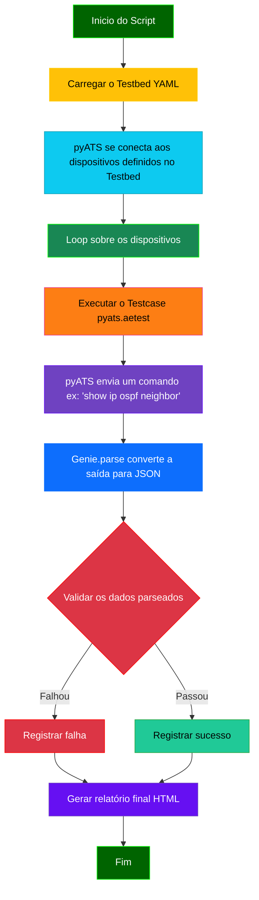
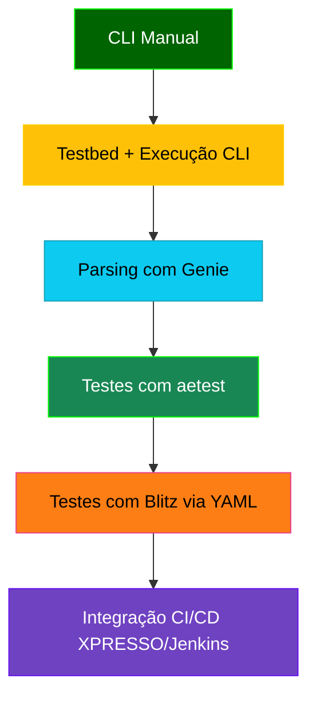

# Python - 16

## pyATS: Orquestração e Validação de Testes de Rede

## Sumário

- [Python - 16](#python---16)
  - [pyATS: Orquestração e Validação de Testes de Rede](#pyats-orquestração-e-validação-de-testes-de-rede)
  - [Sumário](#sumário)
    - [📚 Documentação Oficial pyATS](#-documentação-oficial-pyats)
    - [O Que É Orquestração?](#o-que-é-orquestração)
  - [Contextualização: O Universo do `pyATS`](#contextualização-o-universo-do-pyats)
  - [Quando Usar e Quando Não Usar `pyATS`](#quando-usar-e-quando-não-usar-pyats)
  - [O Que `pyATS` Faz e Como Ele Ajuda](#o-que-pyats-faz-e-como-ele-ajuda)
  - [Fluxograma do `pyATS`](#fluxograma-do-pyats)
    - [Requisitos](#requisitos)
    - [Instalação](#instalação)
  - [🧪 Casos de Uso do pyATS (Progressão Didática)](#-casos-de-uso-do-pyats-progressão-didática)
    - [📦 Relação entre pyATS e Genie](#-relação-entre-pyats-e-genie)
    - [🎯 Estrutura de Mock Files e Evolução Natural da Automação com pyATS](#-estrutura-de-mock-files-e-evolução-natural-da-automação-com-pyats)
    - [📁 Organização Estruturada dos Mock Files](#-organização-estruturada-dos-mock-files)
    - [🚀 pyats learn e pyats run job (Evolução Natural)](#-pyats-learn-e-pyats-run-job-evolução-natural)
    - [📈 Integração com Ferramentas de Monitoramento e Observabilidade](#-integração-com-ferramentas-de-monitoramento-e-observabilidade)
  - [Exemplos Práticos](#exemplos-práticos)
    - [Exemplo 01: Obtendo Saída de Comando com pyATS](#exemplo-01-obtendo-saída-de-comando-com-pyats)
    - [Exemplo 02: Obtendo Saída de Comando com pyATS e Parsing Genie com Templates](#exemplo-02-obtendo-saída-de-comando-com-pyats-e-parsing-genie-com-templates)
      - [Breve Explicação: O pyATS e a Interação com Dispositivos](#breve-explicação-o-pyats-e-a-interação-com-dispositivos)
- [Resumo dos Dados Parseados para o template 'GENERAL':](#resumo-dos-dados-parseados-para-o-template-general)
- [Resumo dos Dados Parseados para o template 'OSPF':](#resumo-dos-dados-parseados-para-o-template-ospf)

### 📚 Documentação Oficial pyATS

📘 [Visão Geral pyATS (Cisco DevNet)](https://developer.cisco.com/docs/pyats/)

🧰 [Getting Started com pyATS](https://xrdocs.io/programmability/tutorials/pyats-series-install-and-use-pyats/)

🧪 [API Reference (pyATS core)](https://developer.cisco.com/docs/pyats/api/)

🧑‍💻 [Repositório oficial de exemplos (GitHub)](https://github.com/CiscoTestAutomation/solutions_examples)

### O Que É Orquestração?

No contexto da automação de redes, orquestração é o processo de coordenar e gerenciar múltiplas tarefas e recursos para alcançar um objetivo final. Pense em um maestro regendo uma orquestra: ele não toca todos os instrumentos, mas garante que cada músico (cada tarefa) comece no momento certo, toque sua parte corretamente e trabalhe em harmonia com os outros.

Em um script de automação, a orquestração envolve:

- Gerenciar o fluxo: Definir a ordem em que os comandos são executados.

- Interagir com o ambiente: Conectar-se e autenticar-se nos dispositivos de rede.

- Tratar falhas: Decidir o que fazer se uma etapa falhar.

- Coletar e consolidar resultados: Juntar todas as informações de volta.

O **pyATS** é a ferramenta que assume o papel do "maestro", cuidando de toda essa coordenação e permitindo que você se concentre na lógica principal do seu script, em vez de se preocupar com os detalhes de baixo nível da execução.

## Contextualização: O Universo do `pyATS`

O `pyATS` (Python Automated Test System) é um framework de automação e validação de testes de rede desenvolvido pela Cisco. Ele se estabelece como a fundação para scripts de automação robustos e escaláveis. Diferente do Genie, que se concentra na inteligência do parsing, o `pyATS` atua como o **orquestrador**, gerenciando a interação com os dispositivos, a execução de comandos e o fluxo de trabalho de automação.

Ele é a ferramenta ideal para ir além do `parsing local` e começar a interagir com ambientes de rede reais, definindo uma metodologia clara para a automação.

## Quando Usar e Quando Não Usar `pyATS`

Para ajudá-lo a decidir quando o `pyATS` é a escolha certa para a sua tarefa, aqui estão algumas orientações claras.

| ✅ **Quando Usar `pyATS`**                                                             | ❌ **Quando Não Usar `pyATS`**                                                             |
|-----------------------------------------------------------------------------------------|--------------------------------------------------------------------------------------------|
| **Testes de Regressão:** Validar se uma mudança não quebrou funcionalidades existentes. | **Scripts Simples e de uso único:** Para tarefas de 5 a 10 linhas que não precisam de orquestração. |
| **Validação Pós-Mudança:** Verificar a integridade de um dispositivo após um upgrade ou alteração. | **Tarefas pontuais de CLI:** Quando você só precisa rodar um único comando e ler a saída manualmente. |
| **Coleta de Dados de Vários Dispositivos:** Coletar dados de estado (`show version`, `show interface`) de múltiplos dispositivos de uma só vez. | **Automação sem dispositivos de rede:** O `pyATS` é focado em rede. Para automação em servidores, use outras ferramentas. |
| **Automação em Larga Escala:** Quando a automação precisa ser consistente, reportar resultados de forma estruturada e ser executada em um ambiente de produção. | **Aprendizado inicial de Python:** Pode ter uma curva de aprendizado mais íngreme para iniciantes. |

---

## O Que `pyATS` Faz e Como Ele Ajuda

O `pyATS` facilita a automação de rede de várias maneiras:

- **Testbed (Ambiente de Teste):** Um dos conceitos mais poderosos do `pyATS`. O `testbed` é um arquivo YAML que define toda a sua topologia de rede: dispositivos, IPs, credenciais, links, sistemas operacionais, etc. Isso permite que seu código de automação seja totalmente agnóstico ao ambiente, tornando-o portátil e reutilizável.
- **Conexão Abstrata:** O `pyATS` gerencia todas as conexões (SSH, Telnet) para você. Seus scripts simplesmente se referem a um dispositivo pelo nome, e o framework cuida de todo o processo de conexão e autenticação.
- **Execução de Testes (`pyats.aetest`):** Ele fornece uma estrutura para você escrever testes de forma organizada (em `stages` ou `sections`), com relatórios automáticos em formato HTML que detalham o que foi feito, o que passou e o que falhou.
- **Integração com Genie:** O `pyATS` e o Genie são "irmãos" na Cisco. O `pyATS` executa o comando e obtém a saída, e o Genie (que já vem integrado no pacote) a parseia automaticamente. Essa sinergia é a principal razão pela qual eles são usados juntos.

## Fluxograma do `pyATS`

Este fluxograma ilustra a visão geral de um fluxo de trabalho típico de automação com `pyATS`, mostrando como ele orquestra todas as etapas.



### Requisitos

Para seguir este exemplo de forma eficaz, você precisará dos seguintes componentes:

- Python: Versão 3.6 ou superior (o pyATS é compatível com as versões mais recentes). É altamente recomendado o uso de um ambiente virtual (venv ou conda).

- Acesso à Internet: Para instalar as bibliotecas necessárias.

- pyATS e Genie: As bibliotecas da Cisco. A instalação do pyATS já inclui o Genie e outras dependências, como o Unicon (para conectividade).

- Arquivo testbed.yaml: Um arquivo de configuração para o ambiente de automação.

### Instalação

Siga estes passos para configurar seu ambiente virtual e instalar o pyATS.

- **Passo 1:** Criar e Ativar o Ambiente Virtual

Navegue até a pasta do seu projeto e execute os seguintes comandos no terminal:

```Bash

# Cria o ambiente virtual
python3 -m venv venv_pyats

# Ativa o ambiente virtual (no Linux/macOS)
source venv_pyats/bin/activate

# Ativa o ambiente virtual (no Windows)
venv_pyats\Scripts\activate
```

- **Passo 2:** Instalar o pyATS

Com o ambiente virtual ativado, você pode instalar o pyATS. A instalação da biblioteca principal já traz o Genie e o Unicon como dependências, então você só precisa de um comando:

```Bash
# Instala o pacote pyATS, que inclui o Genie
pip install pyats
```

**Observação:**

Como vamos utilizar o pyATS localmente de inicio, precisamos deixar ele compatível com a versão do Genie que utilizamos até aqui.

- Python: Versão 3.10.18. É altamente recomendado o uso de um ambiente virtual (venv ou pyenv) para isolar as bibliotecas do projeto.

- Acesso à Internet: Para instalar as bibliotecas necessárias.

- pyATS e Genie: As bibliotecas da Cisco. A instalação do pyATS já inclui o Genie e outras dependências, como o Unicon (para conectividade).

- Arquivo testbed.yaml: Um arquivo de configuração para o ambiente de automação.

📊 Casos de Uso pyATS: Do Básico ao Avançado

## 🧪 Casos de Uso do pyATS (Progressão Didática)

Abaixo estão cinco exemplos organizados em ordem crescente de complexidade, do mais simples ao mais completo. Eles servirão de base para os exemplos práticos a seguir.

| Nível | Objetivo                                      | Benefício                                         | Exemplo Prático                                      |
|-------|-----------------------------------------------|---------------------------------------------------|------------------------------------------------------|
| 1     | Obter saída CLI de um dispositivo remoto      | Coleta estruturada sem precisar de SSH manual     | `device.execute("show version")`                     |
| 2     | Parsing automático com Genie                  | Transformar CLI em dicionário estruturado         | `device.parse("show ip ospf neighbor")`              |
| 3     | Estrutura de teste com `pyats.aetest`         | Framework modular com setup/teardown              | Scripts com `class CommonSetup`, `testcases`         |
| 4     | Testes sem código com `blitz`                 | Execução via YAML, ideal para CI/CD               | `job/blitz_ospf_health.yaml` + parser Genie          |
| 5     | Integração com Jenkins, XPRESSO ou GitHub CI  | Execuções programadas, histórico e dashboards     | Health-check automático semanal com logs e status    |

🧭 Fluxo de Evolução com Mermaid



### 📦 Relação entre pyATS e Genie

O pyATS é uma plataforma modular de automação de testes de redes, mantida pela Cisco. Um de seus grandes diferenciais é que ele atua como um **metapacote**, ou seja, ao ser instalado, ele traz consigo um conjunto completo de bibliotecas que trabalham em conjunto para facilitar o desenvolvimento, execução e análise de testes.

**✅ Explicação técnica**

Quando você executa o comando:

```Python
pip install pyats
```

O seguinte conjunto de bibliotecas é instalado automaticamente:

- **genie** – Módulo para parsing automático de comandos, geração de configurações e diffs.

- **unicon** – Interface de conexão com dispositivos (CLI/SSH/telnet).

- **pyats.aetest** – Framework de testes modulares baseado em funções.

- **pyats.easypy** – Execução simplificada de testes e agendamento.

- **pyats.topology** – Gerenciamento de conexões e ambientes.

- **pyats.reporter, pyats.kleenex, pyats.log** – Ferramentas auxiliares de logging e relatórios.

- Outros módulos internos da Cisco.

Ou seja: ao instalar o pyATS, o Genie é incluído automaticamente, sem a necessidade de instalá-lo separadamente.  

**🔁 Genie também pode ser instalado isoladamente**

Apesar disso, o Genie também pode ser instalado de forma independente caso o foco esteja apenas no uso dos parsers automáticos e geração de configurações, sem necessidade de usar o restante da estrutura de testes do pyATS.

```python
pip install genie
```

Isso pode ser útil em cenários menores ou scripts que só precisem dos parsers Genie para processar comandos show.

**✅ Conclusão**

- Se você pretende utilizar parsing automático, testes, topologias e relatórios integrados:
    > instale o pyATS completo (pip install pyats).

- Se você só precisa dos parsers ou gerador de configuração para automação simples:
    > o Genie isolado já pode atender (pip install genie).

Dessa forma, o desenvolvedor tem flexibilidade total para escolher a abordagem mais adequada ao seu projeto.

### 🎯 Estrutura de Mock Files e Evolução Natural da Automação com pyATS

Antes de explorarmos os exemplos práticos, é fundamental entender a lógica e a estrutura por trás da criação dos arquivos mock. Esses arquivos simulam a saída real de comandos dos dispositivos de rede e permitem testes totalmente locais, mesmo sem conexão com os equipamentos.

### 📁 Organização Estruturada dos Mock Files

Os mock files devem ser organizados de forma padronizada e hierárquica, pois essa estrutura favorece a escalabilidade e a futura reutilização dos testes. Uma organização recomendada é:

```bash
mock_data/
├── R01/
│   └── exec/
│       ├── show_version.txt
│       ├── show_ip_ospf_neighbor.txt
│       └── show_ip_route.txt
```

**🔍 Importante:** A pasta exec/ indica que os comandos simulados pertencem ao modo EXEC do equipamento. Essa convenção é importante para que o parser saiba como interpretar cada comando corretamente.  

Essa estrutura permite que você monte "templates de coleta" para diferentes protocolos ou funcionalidades (ex: BGP, OSPF, interfaces, SNMP, etc), e aplique testes consistentes em diversos dispositivos.

**🤔 Por que usar mock files manuais antes do pyats learn?**

Neste momento, vamos criar os mock files manualmente: você coleta a saída de um comando real no dispositivo, salva em .txt e usa em seu script. Isso é ideal para:

- Aprendizado didático do funcionamento do pyATS.

- Montagem de ambientes locais para testes offline.

- Criação de templates de análise reutilizáveis.

- Controle preciso sobre o conteúdo e cenários de teste.

**✍️ Exemplo:** Copiar a saída de show ip ospf neighbor de um equipamento e salvá-la em **mock_data/R01/exec/show_ip_ospf_neighbor.txt.**

### 🚀 pyats learn e pyats run job (Evolução Natural)

O pyATS possui ferramentas poderosas como:

- **pyats learn**: conecta-se aos equipamentos reais e coleta automaticamente estados completos (roteamento, interfaces, OSPF, etc), gerando estrutura de dados rica e reutilizável.

- **pyats run job**: executa scripts modulares com definição de etapas (setup, testcases, cleanup), ideal para uso profissional e ambientes de produção.

Estes comandos serão introduzidos em etapas futuras, à medida que evoluímos para testes reais em ambientes maiores.

### 📈 Integração com Ferramentas de Monitoramento e Observabilidade

O objetivo final de estruturar a coleta e parsing de dados com o pyATS é transformar seu script em um coletor de dados inteligente, que pode:

- Exportar dados em JSON estruturado.

- Alimentar ferramentas como Graylog, Zabbix, Grafana.

- Disparar alertas automáticos ou dashboards visuais com insights de rede.

- Eliminar o uso de regex e tornar os dados legíveis e fáceis de automatizar.

✅ Com isso em mente, estamos prontos para explorar nossos primeiros exemplos práticos utilizando mock files locais!

## Exemplos Práticos

### Exemplo 01: Obtendo Saída de Comando com pyATS

**Objetivo**

Este exemplo introdutório demonstra o fluxo básico de coleta de saídas CLI usando pyATS em um ambiente local com mock files, preparando o terreno para a evolução natural com parsing do Genie. O script irá:

**Fase 1** - Coleta Bruta (Este Exemplo)

  - Usar um testbed.yaml com dispositivo dummy para simular conexões.

  - Carregar a saída do comando show version de um arquivo mock (show_version.txt).

  - Exibir a saída bruta do comando, ainda não parseada.

**📁 Estrutura do Projeto**

Para este exemplo, a estrutura do projeto será a seguinte, onde o testbed.yaml e o arquivo de mock são os novos componentes que definem nosso ambiente simulado.

```Bash

1
├── get_cli_output.py                 # Nosso script python
├── mock_files                        # pasta raiz do diretório dos arquivos mock
│   └── R01                           # Nome do dispositivo, no nosso caso somente um roteador
│       └── exec                      # estrutura de diretórios da caixa - modo exec privilegiado
│           └── show_version.txt      # Arquivo de mock contendo a saída dos comandos
└── testbed.yaml                      # Arquivo de configuração do ambiente (manual)
```

**testbed.yaml**

Este arquivo define o nosso dispositivo virtual. Note que a ip e as credentials são fictícias, mas o pyATS precisa delas para simular a conexão. O os é crucial para que o Genie saiba qual parser usar.
YAML

```yaml
---
devices:
  R01:
    os: iosxe
    type: router
    connections:
      cli:
        protocol: none   # Ou "mock" (ambos funcionam para cenários locais)
        ip: 192.0.2.1    # IP fictício (ignorado em modo mock)
    credentials:
      default:
        username: dummy  # Ignorado
        password: dummy  # Ignorado
```

**OBS:** para testar o arquivo **testbed.yaml** ou outros arquivos **.yaml** e ver se a estrutura digitada estácorreta, utilizar o comando **yamllint**

> Observe um exemplo do uso, um com erro e outro depois de arrumar o erro

```bash
(pyats) alcancil@linux:~/automacoes/pyats/01$ yamllint testbed.yaml 
testbed.yaml
  1:1       error    too many blank lines (1 > 0)  (empty-lines)
  2:1       warning  missing document start "---"  (document-start)

(pyats) alcancil@linux:~/automacoes/pyats/01$ sudo nano testbed.yaml 
(pyats) alcancil@linux:~/automacoes/pyats/01$ yamllint testbed.yaml 
(pyats) alcancil@linux:~/automacoes/pyats/01$ 
```

**Conteúdo do Mock File (show_version.txt)**

Este arquivo simula a saída de um comando show version de um roteador Cisco IOS-XE.

```bash
(pyats) alcancil@linux:~/automacoes/pyats/01$ cat mock_files/R01/exec/show_version.txt 
Cisco IOS Software [IOSXE], Linux Software (X86_64BI_LINUX-ADVENTERPRISEK9-M), Version 17.15.1, RELEASE SOFTWARE (fc4)
Technical Support: http://www.cisco.com/techsupport
Copyright (c) 1986-2024 by Cisco Systems, Inc.
Compiled Sun 11-Aug-24 22:07 by mcpre

ROM: Bootstrap program is Linux

R02 uptime is 1 minute
System returned to ROM by unknown reload cause - suspect boot_data[BOOT_COUNT] 0x9, BOOT_COUNT 0, BOOTDATA 19
System image file is "unix:/x86_64_crb_linux-adventerprisek9-ms.iol"
Last reload reason: Unknown reason


This product contains cryptographic features and is subject to United
States and local country laws governing import, export, transfer and
use. Delivery of Cisco cryptographic products does not imply
third-party authority to import, export, distribute or use encryption.
Importers, exporters, distributors and users are responsible for
compliance with U.S. and local country laws. By using this product you
agree to comply with applicable laws and regulations. If you are unable
to comply with U.S. and local laws, return this product immediately.

A summary of U.S. laws governing Cisco cryptographic products may be found at:
http://www.cisco.com/wwl/export/crypto/tool/stqrg.html

If you require further assistance please contact us by sending email to
export@cisco.com.

Linux Unix (i686) processor with 800932K bytes of memory.
Processor board ID 131184643
4 Ethernet interfaces
256K bytes of NVRAM.

Configuration register is 0x0
```

**Script Python (get_cli_output.py)**

O script está dividido em blocos comentados para facilitar o entendimento do fluxo de trabalho.

```Python
[001] import logging
[002] from pyats.topology import loader
[003] 
[004] # Configura logging
[005] logging.basicConfig(level=logging.INFO)
[006] logger = logging.getLogger(__name__)
[007] 
[008] def main():
[009]     # Carrega o testbed em modo mock
[010]     testbed = loader.load("testbed.yaml")
[011]     device = testbed.devices["R01"]
[012] 
[013]     # Lê o mock file
[014]     with open("mock_files/R01/exec/show_version.txt", "r") as f:
[015]         mock_output = f.read().strip()
[016]
[017]     # Define a saída mockada diretamente (simula device.execute)
[018]     logger.info(f"Simulando 'show version' no dispositivo {device.name}...")
[019]     cli_output = mock_output
[020] 
[021]     # Exibe a saída
[022]     logger.info("Saída do comando:\n" + "-" * 50)
[023]     print(cli_output)
[024]     logger.info("-" * 50)
[025] 
[026] if __name__ == "__main__":
[027]     main()
```

**saída**

```bash
(pyats) alcancil@linux:~/automacoes/pyats/01$ python3 get_cli_output.py 
INFO:__main__:Simulando 'show version' no dispositivo R01...
INFO:__main__:Saída do comando:
--------------------------------------------------
Cisco IOS Software [IOSXE], Linux Software (X86_64BI_LINUX-ADVENTERPRISEK9-M), Version 17.15.1, RELEASE SOFTWARE (fc4)
Technical Support: http://www.cisco.com/techsupport
Copyright (c) 1986-2024 by Cisco Systems, Inc.
Compiled Sun 11-Aug-24 22:07 by mcpre

ROM: Bootstrap program is Linux

R02 uptime is 1 minute
System returned to ROM by unknown reload cause - suspect boot_data[BOOT_COUNT] 0x9, BOOT_COUNT 0, BOOTDATA 19
System image file is "unix:/x86_64_crb_linux-adventerprisek9-ms.iol"
Last reload reason: Unknown reason


This product contains cryptographic features and is subject to United
States and local country laws governing import, export, transfer and
use. Delivery of Cisco cryptographic products does not imply
third-party authority to import, export, distribute or use encryption.
Importers, exporters, distributors and users are responsible for
compliance with U.S. and local country laws. By using this product you
agree to comply with applicable laws and regulations. If you are unable
to comply with U.S. and local laws, return this product immediately.

A summary of U.S. laws governing Cisco cryptographic products may be found at:
http://www.cisco.com/wwl/export/crypto/tool/stqrg.html

If you require further assistance please contact us by sending email to
export@cisco.com.

Linux Unix (i686) processor with 800932K bytes of memory.
Processor board ID 131184643
4 Ethernet interfaces
256K bytes of NVRAM.

Configuration register is 0x0
INFO:__main__:--------------------------------------------------
(pyats) alcancil@linux:~/automacoes/pyats/01$ 
```

**Explicação**

```python
# Bloco 01 - Importações
[001] import logging                                                                # [001] Importa módulo para registro de mensagens durante execução
[002] from pyats.topology import loader                                             # [002] Importa função para carregar arquivo testbed do pyATS

# Bloco 02 - Configuração de Logging  
[003]                                                                               # [003] (Linha vazia para organização)
[004] # Configura logging                                                           # [004] Seção de configuração do sistema de logs
[005] logging.basicConfig(level=logging.INFO)                                       # [005] Define nível mínimo de log como INFO
[006] logger = logging.getLogger(__name__)                                          # [006] Cria logger específico para este módulo

# Bloco 03 - Função Principal
[007]                                                                               # [007] (Linha vazia para organização)
[008] def main():                                                                   # [008] Define função principal do script
[009]     # Carrega o testbed em modo mock                                          # [009] Seção de carregamento do ambiente
[010]     testbed = loader.load("testbed.yaml")                                     # [010] Carrega definições do arquivo testbed.yaml
[011]     device = testbed.devices["R01"]                                           # [011] Acessa dispositivo R01 do testbed

# Bloco 04 - Leitura do Mock File
[012]                                                                               # [012] (Linha vazia para organização)
[013]     # Lê o mock file                                                          # [013] Seção de manipulação do arquivo de mock
[014]     with open("mock_files/R01/exec/show_version.txt", "r") as f:              # [014] Abre arquivo em modo leitura
[015]         mock_output = f.read().strip()                                        # [015] Lê conteúdo e remove espaços extras

# Bloco 05 - Simulação de Execução
[016]                                                                               # [016] (Linha vazia para organização)
[017]     # Define a saída mockada                                                  # [017] Seção de simulação do comando CLI
[018]     logger.info(f"Simulando 'show version' no dispositivo {device.name}...")  # [018] Log de simulação
[019]     cli_output = mock_output                                                  # [019] Armazena saída mockada como resultado

# Bloco 06 - Exibição de Resultados
[020]                                                                               # [020] (Linha vazia para organização)
[021]     # Exibe a saída                                                           # [021] Seção de apresentação dos resultados
[022]     logger.info("Saída do comando:\n" + "-" * 50)                             # [022] Cabeçalho visual no log
[023]     print(cli_output)                                                         # [023] Imprime saída bruta no console
[024]     logger.info("-" * 50)                                                     # [024] Rodapé visual no log

# Bloco 07 - Execução do Script
[025]                                                                               # [025] (Linha vazia para organização)
[026] if __name__ == "__main__":                                                    # [026] Verifica se script está sendo executado diretamente
[027]     main()                                                                    # [027] Chama função principal
```

**Fase 2** - Evolução para Parsing (Próximo Exemplo)
No próximo passo, o mesmo código será estendido para:

  - Usar device.parse() do Genie para converter a saída bruta em um dicionário Python.

  - Extrair campos específicos (ex.: versão do IOS-XE) de forma estruturada.

**📁 Estrutura do Projeto**

Para este exemplo, a estrutura do projeto será a seguinte, onde o testbed.yaml e o arquivo de mock são os novos componentes que definem nosso ambiente simulado.

```Bash
01_b/
├── get_cli_output.py                 # Nosso script python
├── logs                              # Pasta raiz que vai conter os logs de execução do script
│   └── script_20250728_171218.log    # Arquivo de log com Timestamp
├── mock_files                        # pasta raiz do diretório dos arquivos mock
│   └── R01                           # Nome do dispositivo, no nosso caso somente um roteador
│       └── exec                      # estrutura de diretórios da caixa - modo exec privilegiado
│           └── show_version.txt      # Arquivo de mock contendo a saída dos comandos  
├── output                            # Pasta raiz para as saídas dos arquivos de dicionário .json                  
│   └── parsed_R01_20250728.json      # Arquivo "parseado" em dicionário .json
└── testbed.yaml                      # Arquivo de configuração do ambiente (manual)
```
**get_cli_output.py**

```python
# Bloco 01 - Importações
[001] import logging
[002] import json
[003] import os
[004] from datetime import datetime
[005] from pyats.topology import loader
[006] 
[007] # Bloco 02 - Configuração de Pastas
[008] LOG_DIR = "logs"
[009] OUTPUT_DIR = "output"
[010] os.makedirs(LOG_DIR, exist_ok=True)    # Cria pasta de logs se não existir
[011] os.makedirs(OUTPUT_DIR, exist_ok=True) # Cria pasta de outputs se não existir
[012] 
[013] # Bloco 03 - Configuração de Logging
[014] log_file = f"{LOG_DIR}/script_{datetime.now().strftime('%Y%m%d_%H%M%S')}.log"
[015] logging.basicConfig(
[016]     level=logging.INFO,
[017]     format='%(asctime)s - %(levelname)s - %(message)s',
[018]     handlers=[
[019]         logging.FileHandler(log_file),  # Log para arquivo
[020]         logging.StreamHandler()        # Log para console
[021]     ]
[022] )
[023] logger = logging.getLogger(__name__)
[024] 
[025] # Bloco 04 - Função Principal
[026] def main():
[027]     try:
[028]         logger.info("="*50)
[029]         logger.info("Iniciando Fase 2 - Parsing com Genie")
[030]         logger.info("="*50)
[031] 
[032]         # Carrega testbed
[033]         testbed = loader.load("testbed.yaml")
[034]         device = testbed.devices["R01"]
[035]         logger.info(f"Dispositivo carregado: {device.name}")
[036] 
[037]         # Leitura do mock file
[038]         with open("mock_files/R01/exec/show_version.txt", "r") as f:
[039]             mock_output = f.read().strip()
[040]         logger.info("Mock file carregado com sucesso")
[041] 
[042]         # Parsing com Genie
[043]         logger.info("Iniciando parsing com Genie...")
[044]         parsed_data = device.parse("show version", output=mock_output)
[045]         
[046]         # Saída estruturada
[047]         output_file = f"{OUTPUT_DIR}/parsed_{device.name}_{datetime.now().strftime('%Y%m%d')}.json"
[048]         with open(output_file, 'w') as f:
[049]             json.dump(parsed_data, f, indent=4)
[050]         logger.info(f"Saída parseada salva em: {output_file}")
[051] 
[052]         # Resumo em tela
[053]         logger.info("\n" + "="*50)
[054]         logger.info("RESUMO DA EXECUÇÃO")
[055]         logger.info("="*50)
[056]         logger.info(f"Dispositivo: {device.name}")
[057]         logger.info(f"Versão do IOS: {parsed_data['version']['version_short']}")
[058]         logger.info(f"OS: {parsed_data['version']['os']}")
[059]         logger.info(f"Arquivo de Log: {log_file}")
[060]         logger.info(f"Arquivo de Output: {output_file}")
[061]         logger.info("="*50 + "\n")
[062] 
[063]     except Exception as e:
[064]         logger.error(f"Erro durante execução: {str(e)}", exc_info=True)
[065] 
[066] # Bloco 05 - Execução
[067] if __name__ == "__main__":
[068]     main()
```

**Saída**

```bash
(pyats) alcancil@linux:~/automacoes/pyats/01_b$ python3 get_cli_output.py 
2025-07-28 17:12:18,503 - INFO - ==================================================
2025-07-28 17:12:18,503 - INFO - Iniciando Fase 2 - Parsing com Genie
2025-07-28 17:12:18,503 - INFO - ==================================================
2025-07-28 17:12:23,318 - INFO - Dispositivo carregado: R01
2025-07-28 17:12:23,318 - INFO - Mock file carregado com sucesso
2025-07-28 17:12:23,318 - INFO - Iniciando parsing com Genie...
2025-07-28 17:12:24,163 - INFO - Saída parseada salva em: output/parsed_R01_20250728.json
2025-07-28 17:12:24,163 - INFO - 
==================================================
2025-07-28 17:12:24,163 - INFO - RESUMO DA EXECUÇÃO
2025-07-28 17:12:24,163 - INFO - ==================================================
2025-07-28 17:12:24,163 - INFO - Dispositivo: R01
2025-07-28 17:12:24,163 - INFO - Versão do IOS: 17.15
2025-07-28 17:12:24,164 - INFO - OS: IOS
2025-07-28 17:12:24,164 - INFO - Arquivo de Log: logs/script_20250728_171218.log
2025-07-28 17:12:24,164 - INFO - Arquivo de Output: output/parsed_R01_20250728.json
2025-07-28 17:12:24,164 - INFO - ==================================================

(pyats) alcancil@linux:~/automacoes/pyats/01_b$ 
```

```Bash
(pyats) alcancil@linux:~/automacoes/pyats/01_b$ cat logs/script_20250728_171218.log 
2025-07-28 17:12:18,503 - INFO - ==================================================
2025-07-28 17:12:18,503 - INFO - Iniciando Fase 2 - Parsing com Genie
2025-07-28 17:12:18,503 - INFO - ==================================================
2025-07-28 17:12:23,318 - INFO - Dispositivo carregado: R01
2025-07-28 17:12:23,318 - INFO - Mock file carregado com sucesso
2025-07-28 17:12:23,318 - INFO - Iniciando parsing com Genie...
2025-07-28 17:12:24,163 - INFO - Saída parseada salva em: output/parsed_R01_20250728.json
2025-07-28 17:12:24,163 - INFO - 
==================================================
2025-07-28 17:12:24,163 - INFO - RESUMO DA EXECUÇÃO
2025-07-28 17:12:24,163 - INFO - ==================================================
2025-07-28 17:12:24,163 - INFO - Dispositivo: R01
2025-07-28 17:12:24,163 - INFO - Versão do IOS: 17.15
2025-07-28 17:12:24,164 - INFO - OS: IOS
2025-07-28 17:12:24,164 - INFO - Arquivo de Log: logs/script_20250728_171218.log
2025-07-28 17:12:24,164 - INFO - Arquivo de Output: output/parsed_R01_20250728.json
2025-07-28 17:12:24,164 - INFO - ==================================================
```

```bash
(pyats) alcancil@linux:~/automacoes/pyats/01_b$ cat output/parsed_R01_20250728.json
```

```json
{
    "version": {
        "version_short": "17.15",
        "platform": "Linux",
        "version": "17.15.1",
        "image_id": "X86_64BI_LINUX-ADVENTERPRISEK9-M",
        "label": "RELEASE SOFTWARE (fc4)",
        "os": "IOS",
        "location": "IOSXE",
        "image_type": "production image",
        "copyright_years": "1986-2024",
        "compiled_date": "Sun 11-Aug-24 22:07",
        "compiled_by": "mcpre",
        "rom": "Bootstrap program is Linux",
        "hostname": "R02",
        "uptime": "1 minute",
        "system_image": "unix:/x86_64_crb_linux-adventerprisek9-ms.iol",
        "last_reload_reason": "Unknown reason",
        "chassis_sn": "131184643",
        "number_of_intfs": {
            "Ethernet": "4"
        },
        "processor_board_flash": "256K",
        "curr_config_register": "0x0"
    }
}
```

**Explicação**

```Python
# Bloco 01 - Importações
[001] import logging                                                                                       # Importa módulo para registro de logs
[002] import json                                                                                          # Importa módulo para manipulação de JSON
[003] import os                                                                                            # Importa módulo para operações com sistema de arquivos
[004] from datetime import datetime                                                                        # Importa classe para manipulação de datas/horas
[005] from pyats.topology import loader                                                                    # Importa função para carregar testbed do pyATS
[006] 
[007] # Bloco 02 - Configuração de Pastas
[008] LOG_DIR = "logs"                                                                                     # Define nome da pasta para arquivos de log
[009] OUTPUT_DIR = "output"                                                                                # Define nome da pasta para arquivos de saída
[010] os.makedirs(LOG_DIR, exist_ok=True)                                                                  # Cria pasta de logs (se não existir)
[011] os.makedirs(OUTPUT_DIR, exist_ok=True)                                                               # Cria pasta de outputs (se não existir)
[012] 
[013] # Bloco 03 - Configuração de Logging
[014] log_file = f"{LOG_DIR}/script_{datetime.now().strftime('%Y%m%d_%H%M%S')}.log"                        # Gera nome do arquivo de log com timestamp
[015] logging.basicConfig(                                                                                 # Configura sistema de logging
[016]     level=logging.INFO,                                                                              # Define nível mínimo de log como INFO
[017]     format='%(asctime)s - %(levelname)s - %(message)s',                                              # Formato das mensagens de log
[018]     handlers=[                                                                                       # Define handlers (destinos) dos logs
[019]         logging.FileHandler(log_file),                                                               # Handler para gravar em arquivo
[020]         logging.StreamHandler()                                                                      # Handler para exibir no console
[021]     ]
[022] )
[023] logger = logging.getLogger(__name__)                                                                 # Cria logger específico para este módulo
[024] 
[025] # Bloco 04 - Função Principal
[026] def main():                                                                                          # Define função principal do script
[027]     try:                                                                                             # Inicia bloco de tratamento de exceções
[028]         logger.info("="*50)                                                                          # Linha separadora no log
[029]         logger.info("Iniciando Fase 2 - Parsing com Genie")                                          # Mensagem de início
[030]         logger.info("="*50)                                                                          # Linha separadora no log
[031] 
[032]         # Carrega testbed
[033]         testbed = loader.load("testbed.yaml")                                                        # Carrega configurações do testbed
[034]         device = testbed.devices["R01"]                                                              # Obtém dispositivo R01 do testbed
[035]         logger.info(f"Dispositivo carregado: {device.name}")                                         # Log do dispositivo
[036] 
[037]         # Leitura do mock file
[038]         with open("mock_files/R01/exec/show_version.txt", "r") as f:                                 # Abre arquivo de mock
[039]             mock_output = f.read().strip()                                                           # Lê conteúdo e remove espaços extras
[040]         logger.info("Mock file carregado com sucesso")                                               # Confirmação de leitura
[041] 
[042]         # Parsing com Genie
[043]         logger.info("Iniciando parsing com Genie...")                                                # Mensagem de início do parsing
[044]         parsed_data = device.parse("show version", output=mock_output)                               # Converte saída CLI para JSON
[045]         
[046]         # Saída estruturada
[047]         output_file = f"{OUTPUT_DIR}/parsed_{device.name}_{datetime.now().strftime('%Y%m%d')}.json"  # Gera nome do arquivo de saída
[048]         with open(output_file, 'w') as f:                                                            # Abre arquivo para escrita
[049]             json.dump(parsed_data, f, indent=4)                                                      # Salva dados parseados como JSON formatado
[050]         logger.info(f"Saída parseada salva em: {output_file}")                                       # Log com local do arquivo
[051] 
[052]         # Resumo em tela
[053]         logger.info("\n" + "="*50)                                                                   # Linha separadora
[054]         logger.info("RESUMO DA EXECUÇÃO")                                                            # Cabeçalho do resumo
[055]         logger.info("="*50)                                                                          # Linha separadora
[056]         logger.info(f"Dispositivo: {device.name}")                                                   # Exibe nome do dispositivo
[057]         logger.info(f"Versão do IOS: {parsed_data['version']['version_short']}")                     # Exibe versão do IOS
[058]         logger.info(f"OS: {parsed_data['version']['os']}")                                           # Exibe sistema operacional
[059]         logger.info(f"Arquivo de Log: {log_file}")                                                   # Exibe caminho do log
[060]         logger.info(f"Arquivo de Output: {output_file}")                                             # Exibe caminho do output
[061]         logger.info("="*50 + "\n")                                                                   # Linha separadora final
[062] 
[063]     except Exception as e:                                                                           # Captura qualquer exceção
[064]         logger.error(f"Erro durante execução: {str(e)}", exc_info=True)                              # Log detalhado do erro
[065] 
[066] # Bloco 05 - Execução
[067] if __name__ == "__main__":                                                                           # Verifica se o script está sendo executado diretamente
[068]     main()                                                                                           # Chama a função principal
```

**📌 Por Dentro do Parsing com Genie**  
O método `device.parse()` do Genie converte a saída CLI em um dicionário Python seguindo este processo:
1. **Identificação do Parser**: Usa o campo `os: iosxe` do `testbed.yaml` para selecionar o parser correto.
2. **Estrutura Hierárquica**: Organiza os dados em chaves lógicas (ex.: `version`, `interfaces`).
3. **Tipagem Automática**: Converte strings para tipos nativos (booleanos, inteiros) quando possível.

### Exemplo 02: Obtendo Saída de Comando com pyATS e Parsing Genie com Templates

Este exemplo aprofunda o uso de pyATS e Genie para coletar e parsear saídas de comandos de dispositivos de rede, introduzindo o conceito de "templates" de comandos e detalhando como o Unicon interage com esses dados.

#### Breve Explicação: O pyATS e a Interação com Dispositivos

O **pyATS** é um framework robusto da Cisco para automação de testes e operações de rede. Dentro do ecossistema pyATS, duas bibliotecas são fundamentais para a interação com dispositivos e o processamento de dados:

- **Unicon**: É a biblioteca de conectividade do pyATS. Sua principal função é estabelecer e gerenciar conexões com dispositivos de rede (via SSH, Telnet, Console, etc.). Ele atua como a "interface" entre o seu script Python e o equipamento, lidando com os detalhes de baixo nível da comunicação.

- **Em acesso real**: O Unicon envia comandos para o dispositivo e dinamicamente coleta as saídas em um buffer temporário, identificando o prompt do dispositivo como o delimitador para saber quando a saída de um comando termina e a sessão está pronta para o próximo.

- **Em modo mock**: Para simulações, o Unicon é configurado para ler comandos e suas saídas de um arquivo pré-gravado (o "mock file"). Ele ainda usa a lógica de identificação do prompt (ex: R1#, Switch#) dentro desse arquivo mock para distinguir onde um comando começa e onde sua respectiva saída termina. Tudo que está entre o comando enviado (R1#show version) e o próximo prompt (R1#) é considerado a saída daquele comando.

- **Genie**: É a biblioteca de parsing e abstração de dados do pyATS. Uma vez que o Unicon coleta a saída bruta de um comando (seja de um dispositivo real ou de um mock file), o Genie entra em ação. Ele possui uma vasta coleção de parsers pré-construídos para comandos show de diversos sistemas operacionais de rede (IOS, IOS-XE, NX-OS, ASA, etc.). Sua função é transformar o texto bruto em um dicionário Python estruturado, facilitando a manipulação e análise dos dados.

A combinação de Unicon e Genie permite que você escreva scripts que funcionam de forma idêntica, seja se conectando a um dispositivo real ou a um mock, bastando alterar a configuração no seu testbed.yaml e injetar o mock file (quando aplicável).

1. **Objetivos**

- Demonstrar a criação de múltiplos "templates" de comandos para diferentes cenários de troubleshooting.

- Entender como o Unicon utiliza o prompt do dispositivo como delimitador nos mock files.

- Coletar saídas de comandos de forma modular e parseá-las usando Genie.

- Apresentar os dados parseados de forma clara e organizada.

2. **Estrutura do Projeto**

Vamos manter uma estrutura de diretórios organizada para separar os arquivos de configuração, scripts e arquivos de mock.

```Bash
automacoes/
├── pyats/
│   └──02/                                                                     
│       ├── testbed.yaml                                                        # Define os detalhes do dispositivo, incluindo como o Unicon deve se conectar a ele.
│       ├── parse_device_templates.py                                           # Script python para acesso ao equipamento e realizar o parser
│       ├── logs                                                                # Pasta raiz que vai conter os logs de execução do script
│       │    └── script_20250728_171218.log                                     # Arquivo de log com Timestamp
│       ├── mock_files                                                          # pasta raiz do diretório dos arquivos mock
│       │   └── R01                                                             # Nome do host (Hostname)
│       │     └── exec                                                          # modo privilegiado (modo exec)
│       │         ├── mock_general_health                                       # Diretório para saídas brutas separadas
│       │         │   ├── show_interfaces_stats.txt                             # Saída bruta do comando show interfaces para análise
│       │         │   ├── show_ip_interface_brief.txt                           # Saída bruta do comando show ip interface brief para análise
│       │         │   ├── show_ip_protocols.txt                                 # Saída bruta do comando show ip protocols para anaálise
│       │         │   ├── show_logging.txt                                      # Saída bruta do comando show logging para análise (logs armazenados no host)
│       │         │   ├── show_platform_software_thread_fastpath_detail.txt     # Saída bruta do comando show plataform software thread fastpath detail para análise
│       │         │   ├── show_processes_cpu_sorted.txt                         # Saída bruta do comando show processes cpu sortedpara análise
│       │         │   ├── show_processes_memory_sorted.txt                      # Saída bruta do comando show processes memory sorted para análise
│       │         │   └── show_version.txt                                      # Saída bruta do comando show version para análise 
│       │         ├── mock_ospf_troubleshoot                                    # Diretório para saídas brutas OSPF separadas
│       │         │   ├── show_ip_ospf_database.txt                             # Saída bruta do comando show ip ospf para análise
│       │         │   ├── show_ip_ospf_interface_brief.txt                      # Saída bruta do comando show ip ospf interface brief para análise
│       │         │   ├── show_ip_ospf_neighbor.txt                             # Saída bruta do comando show ip ospf neighbor para análise
│       │         │   ├── show_ip_ospf.txt                                      # Saída bruta do comand show ip ospf para análise
│       │         │   └── show_ip_route_ospf.txt                                # Saída bruta do comando show ip route ospf
│       │         ├── R01_full_troubleshoot.txt                                 # <-- **Mock File Unificado 1**
│       │         └── R01_ospf_troubleshoot.txt                                 # <-- **Mock File Unificado 2**
│       ├── output                                                              # Pasta raiz para as saídas dos arquivos de dicionário .json                  
│       └── parsed_R01_20250728.json                                            # Arquivo "parseado" em dicionário .json
```

**Explicação da Estrutura:**

- **testbed.yaml**: Define os detalhes do dispositivo, incluindo como o Unicon deve se conectar a ele (neste caso, em modo mock).

- **parse_device_templates.py**: É o script Python principal que irá carregar o testbed, se conectar (mock) e executar/parsear os comandos.

- **Arquivos/**: Contém os dados dos mock files.

- **mock_general_health e mock_ospf_troubleshoot**: Estes diretórios contêm as saídas individuais e brutas de cada comando, como você fez inicialmente. Eles servem para organizar as fontes de dados antes de serem combinadas.

- **R01_full_troubleshoot.txt** e **R1_ospf_troubleshoot.txt**: Estes são os arquivos de mock unificados. Eles contêm as saídas de múltiplos comandos, formatadas com os prompts (R1#) para que o Unicon possa simular uma sessão completa para um tema específico (saúde geral ou OSPF).

3. **Conteúdo dos Mock Files**

Agora vou deixar o link dos arquivos para análise. Vou mostrar como os arquivos são obtidos de forma separada e depois de forma unificada. Fiz isso para dar o entendimento de como o módulo **unicon** faz para identificar os comandos. Ele identifica os prompts (ex: R01#) e ai ele identifica o comando e quendo chega no próximo prompt (R01#) ele identifica como início do próximo comando.

**Parsers de saúde da caixa**  

[show_interfaces_stats.txt](Arquivos/02/mock_files/R01/exec/mock_general_health/show_interfaces_stats.txt)  
[show_ip_interface_brief.txt](Arquivos/02/mock_files/R01/exec/mock_general_health/show_ip_interface_brief.txt)  
[show_ip_protocols.txt](Arquivos/02/mock_files/R01/exec/mock_general_health/show_ip_protocols.txt)  
[show_logging.txt](Arquivos/02/mock_files/R01/exec/mock_general_health/show_logging.txt)  
[show_platform_software_thread_fastpath_detail.txt](Arquivos/02/mock_files/R01/exec/mock_general_health/show_platform_software_thread_fastpath_detail.txt)  
[show_processes_cpu_sorted.txt](Arquivos/02/mock_files/R01/exec/mock_general_health/show_processes_cpu_sorted.txt)  
[show_processes_memory_sorted.txt](Arquivos/02/mock_files/R01/exec/mock_general_health/show_processes_memory_sorted.txt)  
[show_version.txt](Arquivos/02/mock_files/R01/exec/mock_general_health/show_version.txt)  
[R01_full_troubleshoot.txt](Arquivos/02/mock_files/R01/exec/R01_full_troubleshoot.txt)    

**Parsers de saúde do protocolo OSPF**

[show_ip_ospf.txt](Arquivos/02/mock_files/R01/exec/mock_ospf_troubleshoot/show_ip_ospf.txt)  
[show_ip_ospf_database.txt](Arquivos/02/mock_files/R01/exec/mock_ospf_troubleshoot/show_ip_ospf_database.txt)  
[show_ip_ospf_interface_brief.txt](Arquivos/02/mock_files/R01/exec/mock_ospf_troubleshoot/show_ip_ospf_interface_brief.txt)  
[show_ip_ospf_neighbor.txt](Arquivos/02/mock_files/R01/exec/mock_ospf_troubleshoot/show_ip_ospf_neighbor.txt)  
[show_ip_route_ospf.txt](Arquivos/02/mock_files/R01/exec/mock_ospf_troubleshoot/show_ip_route_ospf.txt)  
[R01_ospf_troubleshoot.txt.txt](Arquivos/02/mock_files/R01/exec/R01_ospf_troubleshoot.txt.txt)  

**Conteúdo do testbed.yaml**

Este testbed.yaml será configurado para usar o Unicon MockConnection, que permite que o script leia os dados do arquivo de mock que especificaremos no script Python.

```YAML
# testbed.yaml
# Configuração do Testbed para PyATS com conexão mock (simulada)

devices:
  R1:
    os: iosxe
    type: router
    connections:
      cli:
        protocol: ssh
        # Para mock, o IP real não é usado, mas é um bom placeholder para clareza
        ip: 192.168.10.100
        # O connection_provider especifica que usaremos o modo de simulação
        connection_provider: unicon.mock.connection.MockConnection
    # As credenciais são opcionais para mocking, mas boa prática manter
    credentials:
      default:
        username: cisco
        password: cisco
```

**Script Python (parse_device_templates.py)**

Este script permitirá que você selecione qual template de mock file (geral ou OSPF) usar.

```Python
# parse_device_templates.py
import logging
import os
import argparse  # Importar para lidar com argumentos de linha de comando
from pyats.topology import loader

# Bloco 1: Configurar logging
# Configura o nível de log para INFO, mostrando mensagens informativas.
logging.basicConfig(level=logging.INFO, format='%(asctime)s - %(levelname)s - %(message)s')
log = logging.getLogger(__name__)

def run_template_parsing(template_name):
    """
    Função principal para carregar o testbed, conectar (mock) e parsear dados
    com base no template selecionado.
    """
    testbed_file = os.path.join(os.path.dirname(__file__), "testbed.yaml")
    # Define o caminho para o diretório Arquivos
    arquivos_dir = os.path.join(os.path.dirname(__file__), "Arquivos")

    if template_name == "general":
        mock_file_name = "R1_general_health.txt"
        commands_to_execute = {
            "show ip protocols": "protocols",
            "show ip interface brief": "ip_interface_brief",
            "show interfaces stats": "interfaces_stats",
            "show logging": "logging",
            "show platform software thread fastpath detail": "platform_thread_detail",
        }
        log.info(f"*** Executando template: {template_name.upper()} (Saúde Geral) ***")
    elif template_name == "ospf":
        mock_file_name = "R1_ospf_troubleshoot.txt"
        commands_to_execute = {
            "show ip protocols": "protocols", # Pode ser comum a ambos os templates
            "show ip ospf": "ospf_general",
            "show ip ospf interface brief": "ospf_interface_brief",
            "show ip ospf neighbor": "ospf_neighbor",
            "show ip ospf database": "ospf_database",
            "show ip route ospf": "ospf_routes",
        }
        log.info(f"*** Executando template: {template_name.upper()} (Troubleshooting OSPF) ***")
    else:
        log.error(f"Template '{template_name}' não reconhecido. Use 'general' ou 'ospf'.")
        return

    full_mock_file_path = os.path.join(arquivos_dir, mock_file_name)

    # Bloco 2: Carregar testbed
    log.info(f"Carregando testbed de: {testbed_file}")
    try:
        testbed = loader.load(testbed_file)
        log.info(f"Testbed '{testbed_file}' carregado com sucesso. Dispositivos: {list(testbed.devices.keys())}")
    except Exception as e:
        log.error(f"Erro ao carregar o testbed: {e}", exc_info=True)
        return

    # Bloco 3: Definir dispositivo e injetar mock data
    device = testbed.devices['R1'] # O nome do dispositivo no testbed.yaml
    log.info(f"Dispositivo selecionado: {device.name}")

    # Injeta o conteúdo do mock file no connection_provider do Unicon
    try:
        with open(full_mock_file_path, 'r') as f:
            device.connections.cli.connection_provider.execute_payload = f.read()
        log.info(f"Mock file '{mock_file_name}' injetado com sucesso.")
    except FileNotFoundError:
        log.error(f"Mock file não encontrado: {full_mock_file_path}", exc_info=True)
        return
    except Exception as e:
        log.error(f"Erro ao injetar mock file: {e}", exc_info=True)
        return

    # Bloco 4: Conectar (modo mock)
    log.info(f"Conectando ao dispositivo (modo mock): {device.name}")
    try:
        device.connect()
        log.info(f"Conexão mock estabelecida com sucesso com {device.name}.")
    except Exception as e:
        log.error(f"Falha na conexão mock: {e}", exc_info=True)
        return

    # Bloco 5: Executar comandos e parsear
    log.info("--- Coletando e parseando dados ---")
    parsed_data = {}

    for command, key in commands_to_execute.items():
        try:
            log.info(f"Executando e parseando comando: '{command}'")
            output_raw = device.execute(command)
            # Para depuração, você pode imprimir a saída bruta:
            # log.debug(f"Saída bruta de '{command}':\n{output_raw}")
            parsed_output = device.parse(command, output=output_raw)
            parsed_data[key] = parsed_output
            log.info(f"Comando '{command}' parseado com sucesso. Chaves principais: {list(parsed_output.keys())[:5]}...") # Limita para não poluir o log
        except Exception as e:
            log.warning(f"Falha ao executar ou parsear '{command}': {e}", exc_info=True)
            parsed_data[key] = {"error": str(e), "raw_output": output_raw}

    log.info("--- Coleta e Parsing Concluídos ---")

    # Bloco 6: Desconectar (boa prática, mesmo em mock)
    try:
        device.disconnect()
        log.info(f"Dispositivo '{device.name}' desconectado (mock).")
    except Exception as e:
        log.error(f"Erro ao desconectar (mock): {e}", exc_info=True)


    # Bloco 7: Exibir Resumo dos Dados Parseados (exemplo)
    log.info("\n" + "="*50)
    log.info(f"Resumo dos Dados Parseados para o template '{template_name.upper()}':")
    log.info("="*50)

    if 'protocols' in parsed_data:
        proto_data = parsed_data['protocols']
        log.info(f"  - Router ID OSPF: {proto_data.get('router_id', 'N/A')}")
        log.info(f"  - OSPF Areas: {proto_data.get('areas', 'N/A')}")

    if 'ip_interface_brief' in parsed_data:
        interface_count = len(parsed_data['ip_interface_brief'].get('interface', {}))
        log.info(f"  - Total de Interfaces: {interface_count}")
        # Exemplo: ver status de uma interface específica
        eth0_0_status = parsed_data['ip_interface_brief'].get('interface', {}).get('Ethernet0/0', {}).get('status', 'N/A')
        log.info(f"  - Status da Ethernet0/0: {eth0_0_status}")

    if 'ospf_neighbor' in parsed_data and template_name == "ospf":
        neighbors = parsed_data['ospf_neighbor'].get('vrf', {}).get('default', {}).get('address_family', {}).get('ipv4', {}).get('neighbors', {})
        neighbor_count = len(neighbors)
        log.info(f"  - Vizinhos OSPF Encontrados: {neighbor_count}")
        for n_id, n_data in neighbors.items():
            log.info(f"    - Vizinho {n_id}: Estado={n_data.get('state', 'N/A')}, Interface={n_data.get('interface', 'N/A')}")

    if 'ospf_routes' in parsed_data and template_name == "ospf":
        ospf_routes_info = parsed_data['ospf_routes'].get('vrf', {}).get('default', {}).get('address_family', {}).get('ipv4', {}).get('routes', {})
        num_ospf_routes = len(ospf_routes_info)
        log.info(f"  - Número de Rotas OSPF na Tabela de Roteamento: {num_ospf_routes}")


    log.info("="*50)
    log.info("Parsing e Resumo Concluídos.")


# Bloco 8: Executar a função principal
if __name__ == "__main__":
    parser = argparse.ArgumentParser(description="Executa parsing de comandos de dispositivo usando templates de mock files.")
    parser.add_argument("template", choices=["general", "ospf"], help="Selecione o template a ser executado: 'general' ou 'ospf'.")
    args = parser.parse_args()

    run_template_parsing(args.template)
```

---
Arrumar

6. Como Executar o Script

    Crie a Estrutura de Pastas:
    Bash

mkdir -p automacoes/pyats/02/Arquivos/mock_general_health
mkdir -p automacoes/pyats/02/Arquivos/mock_ospf_troubleshoot

Crie os Arquivos de Mock:

    Crie automacoes/pyats/02/Arquivos/R1_general_health.txt e cole o conteúdo da Seção 3a.

    Crie automacoes/pyats/02/Arquivos/R1_ospf_troubleshoot.txt e cole o conteúdo da Seção 3b.

Crie o testbed.yaml:

    Crie automacoes/pyats/02/testbed.yaml e cole o conteúdo da Seção 4.

Crie o Script Python:

    Crie automacoes/pyats/02/parse_device_templates.py e cole o conteúdo da Seção 5.

Navegue até o diretório 02 no terminal:
Bash

cd automacoes/pyats/02

Execute para o template "general":
Bash

python parse_device_templates.py general

Execute para o template "ospf":
Bash

    python parse_device_templates.py ospf

7. Saída Esperada (Exemplos)

a) Saída para python parse_device_templates.py general:

2025-07-30 16:38:25,000 - INFO - *** Executando template: GENERAL (Saúde Geral) ***
2025-07-30 16:38:25,001 - INFO - Carregando testbed de: /home/user/automacoes/pyats/02/testbed.yaml
2025-07-30 16:38:25,005 - INFO - Testbed 'testbed.yaml' carregado com sucesso. Dispositivos: ['R1']
2025-07-30 16:38:25,005 - INFO - Dispositivo selecionado: R1
2025-07-30 16:38:25,006 - INFO - Mock file 'R1_general_health.txt' injetado com sucesso.
2025-07-30 16:38:25,006 - INFO - Conectando ao dispositivo (modo mock): R1
2025-07-30 16:38:25,010 - INFO - Conexão mock estabelecida com sucesso com R1.
2025-07-30 16:38:25,010 - INFO - --- Coletando e parseando dados ---
2025-07-30 16:38:25,011 - INFO - Executando e parseando comando: 'show ip protocols'
2025-07-30 16:38:25,020 - INFO - Comando 'show ip protocols' parseado com sucesso. Chaves principais: ['router_id', 'areas', 'maximum_paths', 'routing_information_sources', 'distance']...
2025-07-30 16:38:25,021 - INFO - Executando e parseando comando: 'show ip interface brief'
2025-07-30 16:38:25,025 - INFO - Comando 'show ip interface brief' parseado com sucesso. Chaves principais: ['interface']...
2025-07-30 16:38:25,026 - INFO - Executando e parseando comando: 'show interfaces stats'
2025-07-30 16:38:25,030 - INFO - Comando 'show interfaces stats' parseado com sucesso. Chaves principais: ['Ethernet0/0', 'Ethernet0/1', 'Ethernet0/2', 'Ethernet0/3', 'Loopback0']...
2025-07-30 16:38:25,031 - INFO - Executando e parseando comando: 'show logging'
2025-07-30 16:38:25,035 - INFO - Comando 'show logging' parseado com sucesso. Chaves principais: ['buffer_logging', 'console_logging', 'exception_logging', 'monitor_logging', 'persistent_logging']...
2025-07-30 16:38:25,035 - INFO - Executando e parseando comando: 'show platform software thread fastpath detail'
2025-07-30 16:38:25,040 - INFO - Comando 'show platform software thread fastpath detail' parseado com sucesso. Chaves principais: ['clock_cpu_utilization', 'fastpath_invocation', 'fastpath_sleep', 'histogram_for_fastpath_thread_activities']...
2025-07-30 16:38:25,040 - INFO - --- Coleta e Parsing Concluídos ---
2025-07-30 16:38:25,041 - INFO - Dispositivo 'R1' desconectado (mock).

==================================================
Resumo dos Dados Parseados para o template 'GENERAL':
==================================================
  - Router ID OSPF: 1.1.1.1
  - OSPF Areas: ['0']
  - Total de Interfaces: 5
  - Status da Ethernet0/0: up
==================================================
Parsing e Resumo Concluídos.

b) Saída para python parse_device_templates.py ospf:

2025-07-30 16:38:25,000 - INFO - *** Executando template: OSPF (Troubleshooting OSPF) ***
2025-07-30 16:38:25,001 - INFO - Carregando testbed de: /home/user/automacoes/pyats/02/testbed.yaml
2025-07-30 16:38:25,005 - INFO - Testbed 'testbed.yaml' carregado com sucesso. Dispositivos: ['R1']
2025-07-30 16:38:25,005 - INFO - Dispositivo selecionado: R1
2025-07-30 16:38:25,006 - INFO - Mock file 'R1_ospf_troubleshoot.txt' injetado com sucesso.
2025-07-30 16:38:25,006 - INFO - Conectando ao dispositivo (modo mock): R1
2025-07-30 16:38:25,010 - INFO - Conexão mock estabelecida com sucesso com R1.
2025-07-30 16:38:25,010 - INFO - --- Coletando e parseando dados ---
2025-07-30 16:38:25,011 - INFO - Executando e parseando comando: 'show ip protocols'
2025-07-30 16:38:25,020 - INFO - Comando 'show ip protocols' parseado com sucesso. Chaves principais: ['router_id', 'areas', 'maximum_paths', 'routing_information_sources', 'distance']...
2025-07-30 16:38:25,021 - INFO - Executando e parseando comando: 'show ip ospf'
2025-07-30 16:38:25,025 - INFO - Comando 'show ip ospf' parseado com sucesso. Chaves principais: ['router_id', 'start_time', 'time_elapsed', 'supports_single_tos_routes', 'supports_opaque_lsa']...
2025-07-30 16:38:25,026 - INFO - Executando e parseando comando: 'show ip ospf interface brief'
2025-07-30 16:38:25,030 - INFO - Comando 'show ip ospf interface brief' parseado com sucesso. Chaves principais: ['interface']...
2025-07-30 16:38:25,031 - INFO - Executando e parseando comando: 'show ip ospf neighbor'
2025-07-30 16:38:25,035 - INFO - Comando 'show ip ospf neighbor' parseado com sucesso. Chaves principais: ['vrf']...
2025-07-30 16:38:25,036 - INFO - Executando e parseando comando: 'show ip ospf database'
2025-07-30 16:38:25,040 - INFO - Comando 'show ip ospf database' parseado com sucesso. Chaves principais: ['vrf']...
2025-07-30 16:38:25,041 - INFO - Executando e parseando comando: 'show ip route ospf'
2025-07-30 16:38:25,045 - INFO - Comando 'show ip route ospf' parseado com sucesso. Chaves principais: ['routes', 'vrf']...
2025-07-30 16:38:25,045 - INFO - --- Coleta e Parsing Concluídos ---
2025-07-30 16:38:25,046 - INFO - Dispositivo 'R1' desconectado (mock).

==================================================
Resumo dos Dados Parseados para o template 'OSPF':
==================================================
  - Router ID OSPF: 1.1.1.1
  - OSPF Areas: ['0']
  - Total de Interfaces: 5
  - Status da Ethernet0/0: up
  - Vizinhos OSPF Encontrados: 1
    - Vizinho 2.2.2.2: Estado=FULL/  -, Interface=Ethernet0/0
  - Número de Rotas OSPF na Tabela de Roteamento: 1
==================================================
Parsing e Resumo Concluídos.

8. Explicação do Exemplo

Este exemplo aprimora o anterior ao introduzir:

    Modularidade com Templates: Em vez de ter um único conjunto fixo de comandos, o script agora define diferentes listas de comandos (commands_to_execute) com base no template_name. Isso simula cenários de troubleshooting focados.

    Seleção de Mock File Dinâmica: O script seleciona qual arquivo de mock (R1_general_health.txt ou R1_ospf_troubleshoot.txt) será injetado no Unicon com base no template escolhido.

    Argumentos de Linha de Comando: O uso do módulo argparse permite que você passe o nome do template (e.g., general ou ospf) como um argumento ao executar o script. Isso torna o script mais flexível e reutilizável.

    Reafirmação do Conceito de Mocking: O script demonstra claramente como o device.connections.cli.connection_provider.execute_payload é usado para "alimentar" o Unicon com a sessão simulada do mock file.

Este é um passo importante para a construção de automações mais complexas e organizadas, permitindo que você adapte seus scripts para diferentes necessidades de diagnóstico sem modificar o código central da lógica de conexão e parsing.