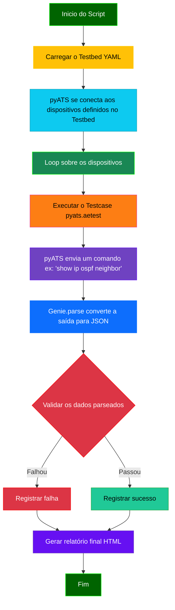
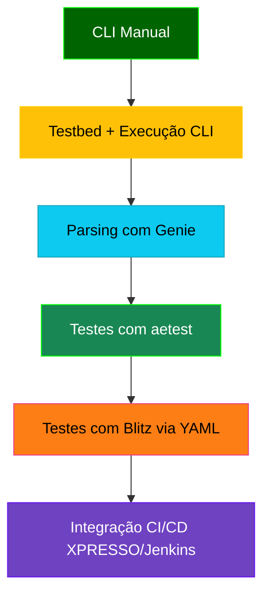

# Python - 16

## pyATS: Orquestração e Validação de Testes de Rede

## Sumário

- [Python - 16](#python---16)
  - [pyATS: Orquestração e Validação de Testes de Rede](#pyats-orquestração-e-validação-de-testes-de-rede)
  - [Sumário](#sumário)
    - [📚 Documentação Oficial pyATS](#-documentação-oficial-pyats)
    - [O Que É Orquestração?](#o-que-é-orquestração)
  - [Contextualização: O Universo do `pyATS`](#contextualização-o-universo-do-pyats)
  - [Quando Usar e Quando Não Usar `pyATS`](#quando-usar-e-quando-não-usar-pyats)
  - [O Que `pyATS` Faz e Como Ele Ajuda](#o-que-pyats-faz-e-como-ele-ajuda)
  - [Fluxograma do `pyATS`](#fluxograma-do-pyats)
    - [Requisitos](#requisitos)
    - [Instalação](#instalação)
  - [🧪 Casos de Uso do pyATS (Progressão Didática)](#-casos-de-uso-do-pyats-progressão-didática)
    - [📦 Relação entre pyATS e Genie](#-relação-entre-pyats-e-genie)
    - [🎯 Estrutura de Mock Files e Evolução Natural da Automação com pyATS](#-estrutura-de-mock-files-e-evolução-natural-da-automação-com-pyats)
    - [📁 Organização Estruturada dos Mock Files](#-organização-estruturada-dos-mock-files)
    - [🚀 pyats learn e pyats run job (Evolução Natural)](#-pyats-learn-e-pyats-run-job-evolução-natural)
    - [📈 Integração com Ferramentas de Monitoramento e Observabilidade](#-integração-com-ferramentas-de-monitoramento-e-observabilidade)
  - [Exemplos Práticos](#exemplos-práticos)
    - [Exemplo 01: Obtendo Saída de Comando com pyATS](#exemplo-01-obtendo-saída-de-comando-com-pyats)

### 📚 Documentação Oficial pyATS

📘 [Visão Geral pyATS (Cisco DevNet)](https://developer.cisco.com/docs/pyats/)

🧰 [Getting Started com pyATS](https://xrdocs.io/programmability/tutorials/pyats-series-install-and-use-pyats/)

🧪 [API Reference (pyATS core)](https://developer.cisco.com/docs/pyats/api/)

🧑‍💻 [Repositório oficial de exemplos (GitHub)](https://github.com/CiscoTestAutomation/solutions_examples)

### O Que É Orquestração?

No contexto da automação de redes, orquestração é o processo de coordenar e gerenciar múltiplas tarefas e recursos para alcançar um objetivo final. Pense em um maestro regendo uma orquestra: ele não toca todos os instrumentos, mas garante que cada músico (cada tarefa) comece no momento certo, toque sua parte corretamente e trabalhe em harmonia com os outros.

Em um script de automação, a orquestração envolve:

- Gerenciar o fluxo: Definir a ordem em que os comandos são executados.

- Interagir com o ambiente: Conectar-se e autenticar-se nos dispositivos de rede.

- Tratar falhas: Decidir o que fazer se uma etapa falhar.

- Coletar e consolidar resultados: Juntar todas as informações de volta.

O **pyATS** é a ferramenta que assume o papel do "maestro", cuidando de toda essa coordenação e permitindo que você se concentre na lógica principal do seu script, em vez de se preocupar com os detalhes de baixo nível da execução.

## Contextualização: O Universo do `pyATS`

O `pyATS` (Python Automated Test System) é um framework de automação e validação de testes de rede desenvolvido pela Cisco. Ele se estabelece como a fundação para scripts de automação robustos e escaláveis. Diferente do Genie, que se concentra na inteligência do parsing, o `pyATS` atua como o **orquestrador**, gerenciando a interação com os dispositivos, a execução de comandos e o fluxo de trabalho de automação.

Ele é a ferramenta ideal para ir além do `parsing local` e começar a interagir com ambientes de rede reais, definindo uma metodologia clara para a automação.

## Quando Usar e Quando Não Usar `pyATS`

Para ajudá-lo a decidir quando o `pyATS` é a escolha certa para a sua tarefa, aqui estão algumas orientações claras.

| ✅ **Quando Usar `pyATS`**                                                             | ❌ **Quando Não Usar `pyATS`**                                                             |
|-----------------------------------------------------------------------------------------|--------------------------------------------------------------------------------------------|
| **Testes de Regressão:** Validar se uma mudança não quebrou funcionalidades existentes. | **Scripts Simples e de uso único:** Para tarefas de 5 a 10 linhas que não precisam de orquestração. |
| **Validação Pós-Mudança:** Verificar a integridade de um dispositivo após um upgrade ou alteração. | **Tarefas pontuais de CLI:** Quando você só precisa rodar um único comando e ler a saída manualmente. |
| **Coleta de Dados de Vários Dispositivos:** Coletar dados de estado (`show version`, `show interface`) de múltiplos dispositivos de uma só vez. | **Automação sem dispositivos de rede:** O `pyATS` é focado em rede. Para automação em servidores, use outras ferramentas. |
| **Automação em Larga Escala:** Quando a automação precisa ser consistente, reportar resultados de forma estruturada e ser executada em um ambiente de produção. | **Aprendizado inicial de Python:** Pode ter uma curva de aprendizado mais íngreme para iniciantes. |

---

## O Que `pyATS` Faz e Como Ele Ajuda

O `pyATS` facilita a automação de rede de várias maneiras:

- **Testbed (Ambiente de Teste):** Um dos conceitos mais poderosos do `pyATS`. O `testbed` é um arquivo YAML que define toda a sua topologia de rede: dispositivos, IPs, credenciais, links, sistemas operacionais, etc. Isso permite que seu código de automação seja totalmente agnóstico ao ambiente, tornando-o portátil e reutilizável.
- **Conexão Abstrata:** O `pyATS` gerencia todas as conexões (SSH, Telnet) para você. Seus scripts simplesmente se referem a um dispositivo pelo nome, e o framework cuida de todo o processo de conexão e autenticação.
- **Execução de Testes (`pyats.aetest`):** Ele fornece uma estrutura para você escrever testes de forma organizada (em `stages` ou `sections`), com relatórios automáticos em formato HTML que detalham o que foi feito, o que passou e o que falhou.
- **Integração com Genie:** O `pyATS` e o Genie são "irmãos" na Cisco. O `pyATS` executa o comando e obtém a saída, e o Genie (que já vem integrado no pacote) a parseia automaticamente. Essa sinergia é a principal razão pela qual eles são usados juntos.

## Fluxograma do `pyATS`

Este fluxograma ilustra a visão geral de um fluxo de trabalho típico de automação com `pyATS`, mostrando como ele orquestra todas as etapas.



### Requisitos

Para seguir este exemplo de forma eficaz, você precisará dos seguintes componentes:

- Python: Versão 3.6 ou superior (o pyATS é compatível com as versões mais recentes). É altamente recomendado o uso de um ambiente virtual (venv ou conda).

- Acesso à Internet: Para instalar as bibliotecas necessárias.

- pyATS e Genie: As bibliotecas da Cisco. A instalação do pyATS já inclui o Genie e outras dependências, como o Unicon (para conectividade).

- Arquivo testbed.yaml: Um arquivo de configuração para o ambiente de automação.

### Instalação

Siga estes passos para configurar seu ambiente virtual e instalar o pyATS.

- **Passo 1:** Criar e Ativar o Ambiente Virtual

Navegue até a pasta do seu projeto e execute os seguintes comandos no terminal:

```Bash

# Cria o ambiente virtual
python3 -m venv venv_pyats

# Ativa o ambiente virtual (no Linux/macOS)
source venv_pyats/bin/activate

# Ativa o ambiente virtual (no Windows)
venv_pyats\Scripts\activate
```

- **Passo 2:** Instalar o pyATS

Com o ambiente virtual ativado, você pode instalar o pyATS. A instalação da biblioteca principal já traz o Genie e o Unicon como dependências, então você só precisa de um comando:

```Bash
# Instala o pacote pyATS, que inclui o Genie
pip install pyats
```

**Observação:**

Como vamos utilizar o pyATS localmente de inicio, precisamos deixar ele compatível com a versão do Genie que utilizamos até aqui.

- Python: Versão 3.10.18. É altamente recomendado o uso de um ambiente virtual (venv ou pyenv) para isolar as bibliotecas do projeto.

- Acesso à Internet: Para instalar as bibliotecas necessárias.

- pyATS e Genie: As bibliotecas da Cisco. A instalação do pyATS já inclui o Genie e outras dependências, como o Unicon (para conectividade).

- Arquivo testbed.yaml: Um arquivo de configuração para o ambiente de automação.

📊 Casos de Uso pyATS: Do Básico ao Avançado

## 🧪 Casos de Uso do pyATS (Progressão Didática)

Abaixo estão cinco exemplos organizados em ordem crescente de complexidade, do mais simples ao mais completo. Eles servirão de base para os exemplos práticos a seguir.

| Nível | Objetivo                                      | Benefício                                         | Exemplo Prático                                      |
|-------|-----------------------------------------------|---------------------------------------------------|------------------------------------------------------|
| 1     | Obter saída CLI de um dispositivo remoto      | Coleta estruturada sem precisar de SSH manual     | `device.execute("show version")`                     |
| 2     | Parsing automático com Genie                  | Transformar CLI em dicionário estruturado         | `device.parse("show ip ospf neighbor")`              |
| 3     | Estrutura de teste com `pyats.aetest`         | Framework modular com setup/teardown              | Scripts com `class CommonSetup`, `testcases`         |
| 4     | Testes sem código com `blitz`                 | Execução via YAML, ideal para CI/CD               | `job/blitz_ospf_health.yaml` + parser Genie          |
| 5     | Integração com Jenkins, XPRESSO ou GitHub CI  | Execuções programadas, histórico e dashboards     | Health-check automático semanal com logs e status    |

🧭 Fluxo de Evolução com Mermaid



### 📦 Relação entre pyATS e Genie

O pyATS é uma plataforma modular de automação de testes de redes, mantida pela Cisco. Um de seus grandes diferenciais é que ele atua como um **metapacote**, ou seja, ao ser instalado, ele traz consigo um conjunto completo de bibliotecas que trabalham em conjunto para facilitar o desenvolvimento, execução e análise de testes.

**✅ Explicação técnica**

Quando você executa o comando:

```Python
pip install pyats
```

O seguinte conjunto de bibliotecas é instalado automaticamente:

- **genie** – Módulo para parsing automático de comandos, geração de configurações e diffs.

- **unicon** – Interface de conexão com dispositivos (CLI/SSH/telnet).

- **pyats.aetest** – Framework de testes modulares baseado em funções.

- **pyats.easypy** – Execução simplificada de testes e agendamento.

- **pyats.topology** – Gerenciamento de conexões e ambientes.

- **pyats.reporter, pyats.kleenex, pyats.log** – Ferramentas auxiliares de logging e relatórios.

- Outros módulos internos da Cisco.

Ou seja: ao instalar o pyATS, o Genie é incluído automaticamente, sem a necessidade de instalá-lo separadamente.  

**🔁 Genie também pode ser instalado isoladamente**

Apesar disso, o Genie também pode ser instalado de forma independente caso o foco esteja apenas no uso dos parsers automáticos e geração de configurações, sem necessidade de usar o restante da estrutura de testes do pyATS.

```python
pip install genie
```

Isso pode ser útil em cenários menores ou scripts que só precisem dos parsers Genie para processar comandos show.

**✅ Conclusão**

- Se você pretende utilizar parsing automático, testes, topologias e relatórios integrados:
    > instale o pyATS completo (pip install pyats).

- Se você só precisa dos parsers ou gerador de configuração para automação simples:
    > o Genie isolado já pode atender (pip install genie).

Dessa forma, o desenvolvedor tem flexibilidade total para escolher a abordagem mais adequada ao seu projeto.

### 🎯 Estrutura de Mock Files e Evolução Natural da Automação com pyATS

Antes de explorarmos os exemplos práticos, é fundamental entender a lógica e a estrutura por trás da criação dos arquivos mock. Esses arquivos simulam a saída real de comandos dos dispositivos de rede e permitem testes totalmente locais, mesmo sem conexão com os equipamentos.

### 📁 Organização Estruturada dos Mock Files

Os mock files devem ser organizados de forma padronizada e hierárquica, pois essa estrutura favorece a escalabilidade e a futura reutilização dos testes. Uma organização recomendada é:

```bash
mock_data/
├── R01/
│   └── exec/
│       ├── show_version.txt
│       ├── show_ip_ospf_neighbor.txt
│       └── show_ip_route.txt
```

**🔍 Importante:** A pasta exec/ indica que os comandos simulados pertencem ao modo EXEC do equipamento. Essa convenção é importante para que o parser saiba como interpretar cada comando corretamente.  

Essa estrutura permite que você monte "templates de coleta" para diferentes protocolos ou funcionalidades (ex: BGP, OSPF, interfaces, SNMP, etc), e aplique testes consistentes em diversos dispositivos.

**🤔 Por que usar mock files manuais antes do pyats learn?**

Neste momento, vamos criar os mock files manualmente: você coleta a saída de um comando real no dispositivo, salva em .txt e usa em seu script. Isso é ideal para:

- Aprendizado didático do funcionamento do pyATS.

- Montagem de ambientes locais para testes offline.

- Criação de templates de análise reutilizáveis.

- Controle preciso sobre o conteúdo e cenários de teste.

**✍️ Exemplo:** Copiar a saída de show ip ospf neighbor de um equipamento e salvá-la em **mock_data/R01/exec/show_ip_ospf_neighbor.txt.**

### 🚀 pyats learn e pyats run job (Evolução Natural)

O pyATS possui ferramentas poderosas como:

- **pyats learn**: conecta-se aos equipamentos reais e coleta automaticamente estados completos (roteamento, interfaces, OSPF, etc), gerando estrutura de dados rica e reutilizável.

- **pyats run job**: executa scripts modulares com definição de etapas (setup, testcases, cleanup), ideal para uso profissional e ambientes de produção.

Estes comandos serão introduzidos em etapas futuras, à medida que evoluímos para testes reais em ambientes maiores.

### 📈 Integração com Ferramentas de Monitoramento e Observabilidade

O objetivo final de estruturar a coleta e parsing de dados com o pyATS é transformar seu script em um coletor de dados inteligente, que pode:

- Exportar dados em JSON estruturado.

- Alimentar ferramentas como Graylog, Zabbix, Grafana.

- Disparar alertas automáticos ou dashboards visuais com insights de rede.

- Eliminar o uso de regex e tornar os dados legíveis e fáceis de automatizar.

✅ Com isso em mente, estamos prontos para explorar nossos primeiros exemplos práticos utilizando mock files locais!

## Exemplos Práticos

### Exemplo 01: Obtendo Saída de Comando com pyATS

**Objetivo**

Este exemplo introdutório demonstra o fluxo básico de coleta de saídas CLI usando pyATS em um ambiente local com mock files, preparando o terreno para a evolução natural com parsing do Genie. O script irá:

**Fase 1** - Coleta Bruta (Este Exemplo)

  - Usar um testbed.yaml com dispositivo dummy para simular conexões.

  - Carregar a saída do comando show version de um arquivo mock (show_version.txt).

  - Exibir a saída bruta do comando, ainda não parseada.

**Fase 2** - Evolução para Parsing (Próximo Exemplo)
No próximo passo, o mesmo código será estendido para:

  - Usar device.parse() do Genie para converter a saída bruta em um dicionário Python.

  - Extrair campos específicos (ex.: versão do IOS-XE) de forma estruturada.

**📁 Estrutura do Projeto**

Para este exemplo, a estrutura do projeto será a seguinte, onde o testbed.yaml e o arquivo de mock são os novos componentes que definem nosso ambiente simulado.

```Bash

1
├── get_cli_output.py                 # Nosso script python
├── mock_files                        # pasta raiz do diretório dos arquivos mock
│   └── R01                           # Nome do dispositivo, no nosso caso somente um roteador
│       └── exec                      # estrutura de diretórios da caixa - modo exec privilegiado
│           └── show_version.txt      # Arquivo de mock contendo a saída dos comandos
└── testbed.yaml                      # Arquivo de configuração do ambiente (manual)
```

**testbed.yaml**

Este arquivo define o nosso dispositivo virtual. Note que a ip e as credentials são fictícias, mas o pyATS precisa delas para simular a conexão. O os é crucial para que o Genie saiba qual parser usar.
YAML

```yaml
---
devices:
  R01:
    os: iosxe
    type: router
    connections:
      cli:
        protocol: none   # Ou "mock" (ambos funcionam para cenários locais)
        ip: 192.0.2.1    # IP fictício (ignorado em modo mock)
    credentials:
      default:
        username: dummy  # Ignorado
        password: dummy  # Ignorado
```

**OBS:** para testar o arquivo **testbed.yaml** ou outros arquivos **.yaml** e ver se a estrutura digitada estácorreta, utilizar o comando **yamllint**

> Observe um exemplo do uso, um com erro e outro depois de arrumar o erro

```bash
(pyats) alcancil@linux:~/automacoes/pyats/01$ yamllint testbed.yaml 
testbed.yaml
  1:1       error    too many blank lines (1 > 0)  (empty-lines)
  2:1       warning  missing document start "---"  (document-start)

(pyats) alcancil@linux:~/automacoes/pyats/01$ sudo nano testbed.yaml 
(pyats) alcancil@linux:~/automacoes/pyats/01$ yamllint testbed.yaml 
(pyats) alcancil@linux:~/automacoes/pyats/01$ 
```

**Conteúdo do Mock File (show_version.txt)**

Este arquivo simula a saída de um comando show version de um roteador Cisco IOS-XE.

```bash
(pyats) alcancil@linux:~/automacoes/pyats/01$ cat mock_files/R01/exec/show_version.txt 
Cisco IOS Software [IOSXE], Linux Software (X86_64BI_LINUX-ADVENTERPRISEK9-M), Version 17.15.1, RELEASE SOFTWARE (fc4)
Technical Support: http://www.cisco.com/techsupport
Copyright (c) 1986-2024 by Cisco Systems, Inc.
Compiled Sun 11-Aug-24 22:07 by mcpre

ROM: Bootstrap program is Linux

R02 uptime is 1 minute
System returned to ROM by unknown reload cause - suspect boot_data[BOOT_COUNT] 0x9, BOOT_COUNT 0, BOOTDATA 19
System image file is "unix:/x86_64_crb_linux-adventerprisek9-ms.iol"
Last reload reason: Unknown reason


This product contains cryptographic features and is subject to United
States and local country laws governing import, export, transfer and
use. Delivery of Cisco cryptographic products does not imply
third-party authority to import, export, distribute or use encryption.
Importers, exporters, distributors and users are responsible for
compliance with U.S. and local country laws. By using this product you
agree to comply with applicable laws and regulations. If you are unable
to comply with U.S. and local laws, return this product immediately.

A summary of U.S. laws governing Cisco cryptographic products may be found at:
http://www.cisco.com/wwl/export/crypto/tool/stqrg.html

If you require further assistance please contact us by sending email to
export@cisco.com.

Linux Unix (i686) processor with 800932K bytes of memory.
Processor board ID 131184643
4 Ethernet interfaces
256K bytes of NVRAM.

Configuration register is 0x0
```

**Script Python (get_cli_output.py)**

O script está dividido em blocos comentados para facilitar o entendimento do fluxo de trabalho.

```Python
import logging
from pyats.topology import loader

# Configura logging
logging.basicConfig(level=logging.INFO)
logger = logging.getLogger(__name__)

def main():
    # Carrega o testbed em modo mock
    testbed = loader.load("testbed.yaml")
    device = testbed.devices["R01"]

    # Lê o mock file
    with open("mock_files/R01/exec/show_version.txt", "r") as f:
        mock_output = f.read().strip()

    # Define a saída mockada diretamente (simula device.execute)
    logger.info(f"Simulando 'show version' no dispositivo {device.name}...")
    cli_output = mock_output

    # Exibe a saída
    logger.info("Saída do comando:\n" + "-" * 50)
    print(cli_output)
    logger.info("-" * 50)

if __name__ == "__main__":
    main()

```
