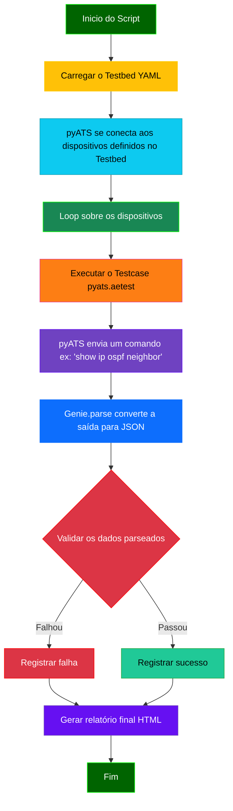

# Python - 16

## pyATS: Orquestração e Validação de Testes de Rede

## Sumário

- [Python - 16](#python---16)
  - [pyATS: Orquestração e Validação de Testes de Rede](#pyats-orquestração-e-validação-de-testes-de-rede)
  - [Sumário](#sumário)
    - [O Que É Orquestração?](#o-que-é-orquestração)
  - [Contextualização: O Universo do `pyATS`](#contextualização-o-universo-do-pyats)
  - [Quando Usar e Quando Não Usar `pyATS`](#quando-usar-e-quando-não-usar-pyats)
  - [O Que `pyATS` Faz e Como Ele Ajuda](#o-que-pyats-faz-e-como-ele-ajuda)
  - [Fluxograma do `pyATS`](#fluxograma-do-pyats)
    - [Requisitos](#requisitos)
    - [Instalação](#instalação)
  - [🧪 Casos de Uso do pyATS (Progressão Didática)](#-casos-de-uso-do-pyats-progressão-didática)

### O Que É Orquestração?

No contexto da automação de redes, orquestração é o processo de coordenar e gerenciar múltiplas tarefas e recursos para alcançar um objetivo final. Pense em um maestro regendo uma orquestra: ele não toca todos os instrumentos, mas garante que cada músico (cada tarefa) comece no momento certo, toque sua parte corretamente e trabalhe em harmonia com os outros.

Em um script de automação, a orquestração envolve:

- Gerenciar o fluxo: Definir a ordem em que os comandos são executados.

- Interagir com o ambiente: Conectar-se e autenticar-se nos dispositivos de rede.

- Tratar falhas: Decidir o que fazer se uma etapa falhar.

- Coletar e consolidar resultados: Juntar todas as informações de volta.

O **pyATS** é a ferramenta que assume o papel do "maestro", cuidando de toda essa coordenação e permitindo que você se concentre na lógica principal do seu script, em vez de se preocupar com os detalhes de baixo nível da execução.

## Contextualização: O Universo do `pyATS`

O `pyATS` (Python Automated Test System) é um framework de automação e validação de testes de rede desenvolvido pela Cisco. Ele se estabelece como a fundação para scripts de automação robustos e escaláveis. Diferente do Genie, que se concentra na inteligência do parsing, o `pyATS` atua como o **orquestrador**, gerenciando a interação com os dispositivos, a execução de comandos e o fluxo de trabalho de automação.

Ele é a ferramenta ideal para ir além do `parsing local` e começar a interagir com ambientes de rede reais, definindo uma metodologia clara para a automação.

## Quando Usar e Quando Não Usar `pyATS`

Para ajudá-lo a decidir quando o `pyATS` é a escolha certa para a sua tarefa, aqui estão algumas orientações claras.

| ✅ **Quando Usar `pyATS`**                                                             | ❌ **Quando Não Usar `pyATS`**                                                             |
|-----------------------------------------------------------------------------------------|--------------------------------------------------------------------------------------------|
| **Testes de Regressão:** Validar se uma mudança não quebrou funcionalidades existentes. | **Scripts Simples e de uso único:** Para tarefas de 5 a 10 linhas que não precisam de orquestração. |
| **Validação Pós-Mudança:** Verificar a integridade de um dispositivo após um upgrade ou alteração. | **Tarefas pontuais de CLI:** Quando você só precisa rodar um único comando e ler a saída manualmente. |
| **Coleta de Dados de Vários Dispositivos:** Coletar dados de estado (`show version`, `show interface`) de múltiplos dispositivos de uma só vez. | **Automação sem dispositivos de rede:** O `pyATS` é focado em rede. Para automação em servidores, use outras ferramentas. |
| **Automação em Larga Escala:** Quando a automação precisa ser consistente, reportar resultados de forma estruturada e ser executada em um ambiente de produção. | **Aprendizado inicial de Python:** Pode ter uma curva de aprendizado mais íngreme para iniciantes. |

---

## O Que `pyATS` Faz e Como Ele Ajuda

O `pyATS` facilita a automação de rede de várias maneiras:

- **Testbed (Ambiente de Teste):** Um dos conceitos mais poderosos do `pyATS`. O `testbed` é um arquivo YAML que define toda a sua topologia de rede: dispositivos, IPs, credenciais, links, sistemas operacionais, etc. Isso permite que seu código de automação seja totalmente agnóstico ao ambiente, tornando-o portátil e reutilizável.
- **Conexão Abstrata:** O `pyATS` gerencia todas as conexões (SSH, Telnet) para você. Seus scripts simplesmente se referem a um dispositivo pelo nome, e o framework cuida de todo o processo de conexão e autenticação.
- **Execução de Testes (`pyats.aetest`):** Ele fornece uma estrutura para você escrever testes de forma organizada (em `stages` ou `sections`), com relatórios automáticos em formato HTML que detalham o que foi feito, o que passou e o que falhou.
- **Integração com Genie:** O `pyATS` e o Genie são "irmãos" na Cisco. O `pyATS` executa o comando e obtém a saída, e o Genie (que já vem integrado no pacote) a parseia automaticamente. Essa sinergia é a principal razão pela qual eles são usados juntos.

## Fluxograma do `pyATS`

Este fluxograma ilustra a visão geral de um fluxo de trabalho típico de automação com `pyATS`, mostrando como ele orquestra todas as etapas.



### Requisitos

Para seguir este exemplo de forma eficaz, você precisará dos seguintes componentes:

- Python: Versão 3.6 ou superior (o pyATS é compatível com as versões mais recentes). É altamente recomendado o uso de um ambiente virtual (venv ou conda).

- Acesso à Internet: Para instalar as bibliotecas necessárias.

- pyATS e Genie: As bibliotecas da Cisco. A instalação do pyATS já inclui o Genie e outras dependências, como o Unicon (para conectividade).

- Arquivo testbed.yaml: Um arquivo de configuração para o ambiente de automação.

### Instalação

Siga estes passos para configurar seu ambiente virtual e instalar o pyATS.

- **Passo 1:** Criar e Ativar o Ambiente Virtual

Navegue até a pasta do seu projeto e execute os seguintes comandos no terminal:

```Bash

# Cria o ambiente virtual
python3 -m venv venv_pyats

# Ativa o ambiente virtual (no Linux/macOS)
source venv_pyats/bin/activate

# Ativa o ambiente virtual (no Windows)
venv_pyats\Scripts\activate
```

- **Passo 2:** Instalar o pyATS

Com o ambiente virtual ativado, você pode instalar o pyATS. A instalação da biblioteca principal já traz o Genie e o Unicon como dependências, então você só precisa de um comando:

```Bash
# Instala o pacote pyATS, que inclui o Genie
pip install pyats
```

**Observação:**

Para seguir este exemplo de forma eficaz, você precisará dos seguintes componentes:

- Python: Versão 3.10.18. É altamente recomendado o uso de um ambiente virtual (venv ou pyenv) para isolar as bibliotecas do projeto.

- Acesso à Internet: Para instalar as bibliotecas necessárias.

- pyATS e Genie: As bibliotecas da Cisco. A instalação do pyATS já inclui o Genie e outras dependências, como o Unicon (para conectividade).

- Arquivo testbed.yaml: Um arquivo de configuração para o ambiente de automação.

📊 Casos de Uso pyATS: Do Básico ao Avançado

## 🧪 Casos de Uso do pyATS (Progressão Didática)

| Nível | Objetivo                                      | Benefício                                         | Exemplo Prático                                       |
|-------|-----------------------------------------------|---------------------------------------------------|-------------------------------------------------------|
| 1     | Obter saída CLI de um dispositivo remoto      | Coleta estruturada sem precisar de SSH manual     | `device.execute("show version")`                     |
| 2     | Parsing automático com Genie                  | Transformar CLI em dicionário estruturado         | `device.parse("show ip ospf neighbor")`              |
| 3     | Estrutura de teste com `pyats.aetest`         | Framework modular com setup/teardown              | Scripts com `class CommonSetup`, `testcases`         |
| 4     | Testes sem código com `blitz`                 | Execução via YAML, ideal para CI/CD               | `job/blitz_ospf_health.yaml` + parser Genie          |
| 5     | Integração com Jenkins, XPRESSO ou GitHub CI  | Execuções programadas, histórico e dashboards     | Health-check automático semanal com logs e status    |

🧭 Fluxo de Evolução com Mermaid

flowchart TD
    A[CLI Manual] --> B[Testbed + Execução CLI]
    B --> C[Parsing com Genie]
    C --> D[Testes com aetest]
    D --> E[Testes com Blitz via YAML]
    E --> F[Integração CI/CD (XPRESSO/Jenkins)]

📚 Documentação Oficial pyATS

📘 [Visão Geral pyATS (Cisco DevNet)](https://developer.cisco.com/docs/pyats/)

    🧰 Getting Started com pyATS

    🧪 API Reference (pyATS core)

    🧾 Documentação do Testbed YAML

    🧬 Exemplo: Blitz YAML + Genie Parser

    🧑‍💻 Repositório oficial de exemplos (GitHub)
